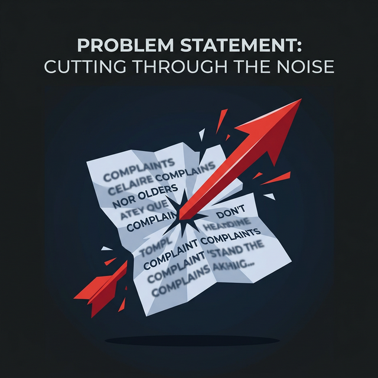
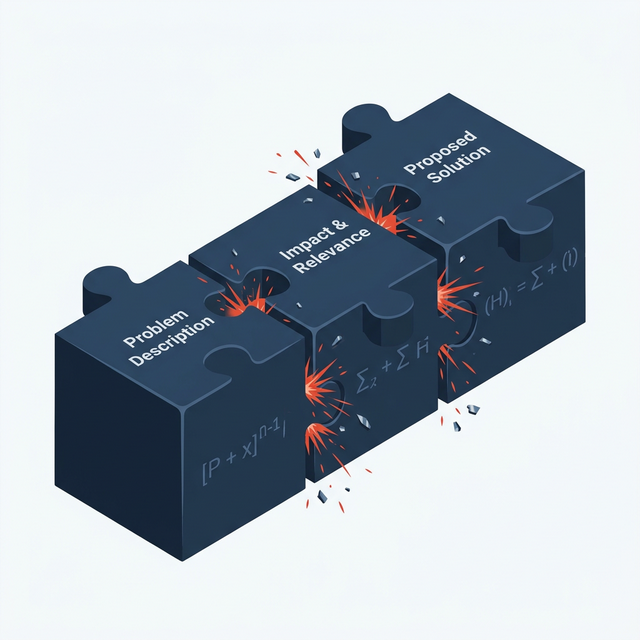
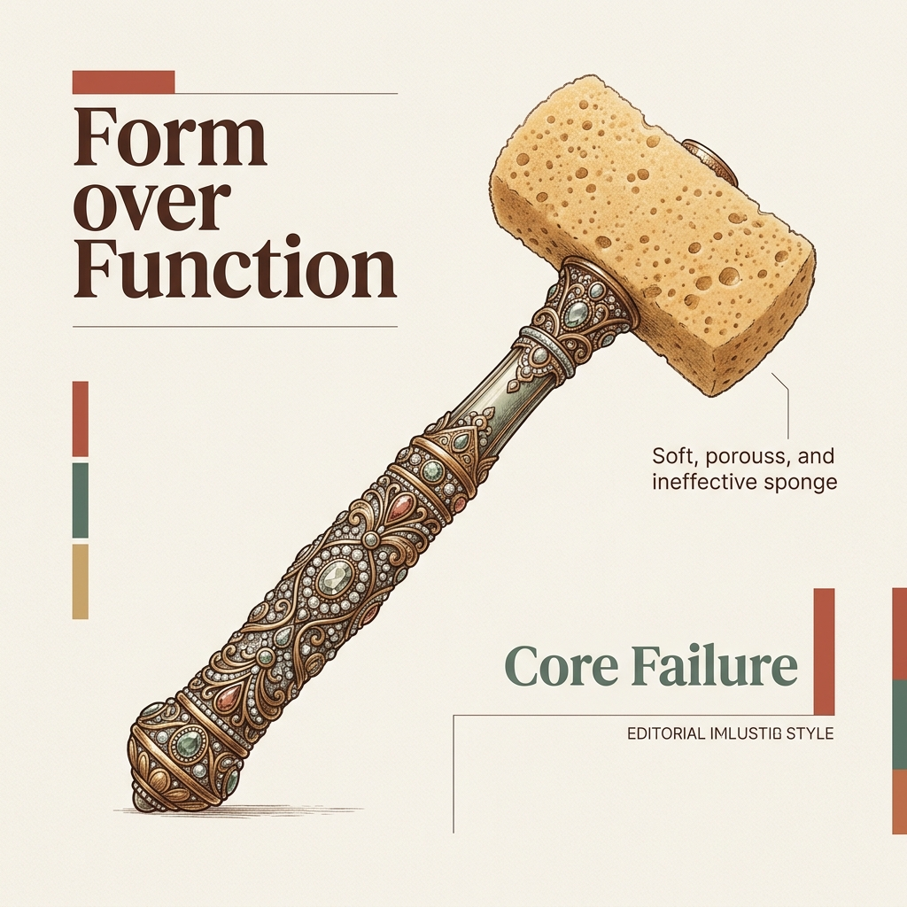
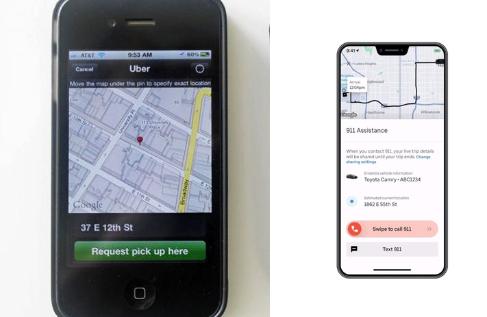
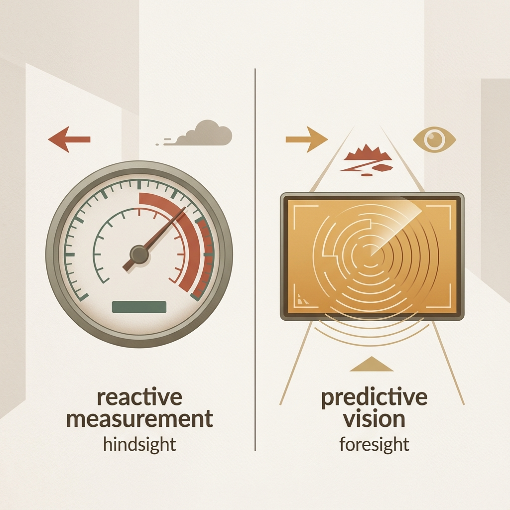

## 模块 5: 讲授三——敏捷痛点发掘与 Problem Statement (10 min)

<!-- BUDGET: 1800 chars | SLIDES: ≥4 | STATUS: done -->

> [VISUAL]
> **Slide**: w03-slide-26
> **Layout**: `Center`
> **Asset**: 
> **Scene**: 高度黑暗的背景上，一个红色的锋利箭头，精准地刺穿了一张写满模糊抱怨字眼的废纸
> **Text**: 问题陈述 (Problem Statement)：把同理心转化为系统需求

好，经过 5-Why 的深挖和 JTBD 的三维拆解，你们现在的白板和桌面上，应该已经堆满了各种深入的用户故事和原始洞察。
但是，同理心如果仅仅停留在抱歉阶段，就缺乏商业价值。产品经理不是心理咨询师，我们将同理心转化为实打实、能够指导研发的**系统需求**。

### 5.1 问题陈述：精确的工程句式能够转化抽象的同理心

为此，我们需要一个极具工程约束力的语言模具，把散漫的现象转化为精准的描述。这句话在敏捷开发中叫作 **Problem Statement（问题陈述）**。

**(Pause: 3s)**

> [VISUAL]
> **Slide**: w03-slide-27
> **Layout**: `Grid`
> **Asset**: 
> **Scene**: 像化学方程式一样严密卡扣的三个巨大拼接公式块，正在发出金属碰撞的火花
> **Text**: [高度具象的目标用户] 非常需要 [去完成某个动词任务] ，因为 [我们挖掘出了一条非常犀利的底层阻力/内心动机]
> **List**: 1️⃣ [高度具象的目标用户] | 2️⃣ 非常需要 [动词任务] | 3️⃣ 因为 [底层阻力/动机]

大家看屏幕，这是一个高度精炼的 **Problem Statement 陈述公式**。
千万不要小看这个公式。绝大多数初出茅庐的交互设计师，在面对这张纸时，往往会把焦点放错，甚至根本填不对这三个空。这导致了大量无效的开发资源浪费。

> [VISUAL]
> **Slide**: w03-slide-25b
> **Layout**: Title
> **Asset**: 
> **Scene**: 在一个仅有一盏昏暗路灯的漆黑小巷中，微光与周围浓重的黑暗形成对比，隐喻表层需求与深层安全感的差异
> **Text**: "用户需要一个更亮的灯" vs "用户需要感受到安全"

我们需要学会剥离表面的功能抱怨，去锁定最深层的**心理动机**。这就像是著名的冰山模型，露出水面的只是用户对按键颜色的粗浅意见，而沉在水底那个极其庞大且冰冷的部分，才是真正关乎生死存亡的生存级恐惧。

> [VISUAL]
> **Slide**: w03-slide-30_garage_story
> **Layout**: Center
> **Asset**: 
> **Scene**: 屏幕上打出巨大的 POV 填空题，对应小美深夜在车库翻找钥匙的恐惧
> **Text**: 用 POV 公式套用深夜车库场景

> [STORY TIME: 深夜车库的恐惧]
> 在我们动手填写这个公式之前，我要求你们先闭上眼睛，想象这样一个非常具体的画面：凌晨两点，一个刚加完班、精疲力竭到几乎站不稳的年轻女生，独自一人走进了 CBD 写字楼地下三层那个灯光闪烁、空气里弥漫着柴油味的巨大停车场。她的手机上显示"司机已到达"，但她面前停着整整三排几乎一模一样的黑色轿车。
> 
> 她必须低下头，眯着高度疲惫的双眼，去核对那串比蚂蚁还小的车牌尾号。就在她低头的那三秒钟里，她的后背暴露在了整个黑暗空间中，完全失去了对周围环境的感知。这，就是一个真实的、每天在中国几千万次发生的、却从未被任何产品经理写进需求文档里的**生存级恐惧**。

现在让我们对比一下，初级设计师和 JTBD 高手在这个公式上的差别：

> [VISUAL]
> **Slide**: w03-slide-30_bad_example
> **Layout**: Split
> **Asset**: 
> **Scene**: 坐在豪华办公室里写着"做个大按钮"的冷漠需求文档，与车库里极度恐惧急需安全感的女性形成刺眼对比
> **Text**: 正确的废话解决不了生存恐惧

❌ **初级设计师的示范**："【经常打开我们打车软件的年轻人】非常需要【我们在首页给他做一个大号的红色叫车按钮】，因为【有了这个按钮，他们就能更快地叫到车了】。"
这句话里根本没有任何"洞察"。第一空是正确的废话，第二空直接塞进了具体的解决方案（红色按钮），而在最核心的第三空动机处，只是用同义词重复了一遍废话。把它交给工程师，只能换来一个红按钮，解决不了真实问题。

> [VISUAL]
> **Slide**: w03-slide-30_jtbd_master
> **Layout**: Center
> **Asset**: 
> **Scene**: 工程师看着一份带有绝望情境描述的需求文档，脑海中浮现出安全护盾的设计图
> **Text**: 跨部门号召力：把现象翻译成带体温的需求

✅ **JTBD 高手的示范**："【深夜加班后疲惫的独身女性】非常需要【一种无需低头看屏幕就能确认车辆到达的安全机制】，因为【在昏暗的地下停车场，长时间低头核对车牌会让她们失去对周围环境的感知，产生极大的恐慌感】。"

感受一下这两种描述的差别。当这份 Problem Statement 摆在开发团队面前时，不需要多做解释，所有人脑子里都有了画面。工程师会意识到：他们写出的代码，不是为了完成 KPI 上的一个按钮，而是在为停车场里恐惧的女孩，打造一面**安全护盾**。这就是一段优秀的问题陈述所拥有的**跨部门号召力**。

> [VISUAL]
> **Slide**: w03-slide-28
> **Layout**: Split
> **Asset**: 
> **Scene**: 左侧是汽车仪表盘上正在疯狂跳动的实时时速表和油门深度（先导）；右侧是用黑色相框非常讽刺地裱起来的、上个月由于超速而寄到你家的违章全景罚单照片（滞后）
> **Text**: 滞后 = 尸检报告 vs 先导 = 实时方向盘
> **List**: 滞后指标 (Lagging): 验证结果的法医尸检报告 | 先导指标 (Leading): 预判生死翻车的实时方向盘

**滞后指标 (Lagging)** 往往只能宣告尸检结果，而无法指导研发过程。当你的 CEO 在季报会议上愤怒地拍桌子质问为什么这三个月流失了这么多用户时，一切都已经太迟了。你需要的是能提前拉响警报的手段。

> [VISUAL]
> **Slide**: w03-slide-26b
> **Layout**: Center
> **Asset**: 
> **Scene**: 打车软件的界面进化图，从简单的叫车按钮到复杂的安全共享中心
> **Text**: 从 Problem Statement 到最终产品形态的跳跃

所以，我们需要设计能够体现这种**安全保护机制**的交互界面。

> [TEACHING MOMENT]

> [ACTIVITY]
> **Type**: `QA`
> **Duration**: `1min`
> **Desc**: Problem Statement 三空要素速测
> 请大家快速默背一遍，在这个严密的陈述公式中，哪三个要素构成了核心的金三角？（提示：特定用户、具体场景下的绝望任务、以及他们原本的粗糙替代方案的摩擦）

### 5.2 先导指标：微观行为数据能提前预判宏观商业生死
仅仅写出问题陈述还不够。在敏捷开发中，当解决方案上线后，投资人和老板会抛出一个终极拷问："你怎么证明，这次改版真的提升了业务价值？" 这就引出了度量体系的两条铁律。

很多同学在做毕业设计汇报时，最喜欢写的数据是："本次交互改版，预计将提升 50% 的季度营收（Revenue）"，或者"降低全平台 20% 的用户流失率（Churn Rate）"。但这种庞大的滞后论断往往**经不起商业逻辑的推敲**。

> [VISUAL]
> **Slide**: w03-slide-34_leading_indicators
> **Layout**: Split
> **Asset**: 
> **Scene**: 左侧是代表"死亡判决"的滞后营收数据，右侧是代表"预警雷达"的早期用户行为测试
> **Text**: 生存法则：寻找预判翻车的先导雷达
> **List**: 滞后指标 (Lagging): 看到即死亡 (如销量、利润) | 先导指标 (Leading): 预判趋势的早期雷达 (如原型点击率)

为什么？因为无论是整体营收，还是用户流失率，在商业数据分析引擎里，这叫**滞后指标（Lagging Indicators）**。
它们就像是你收到了上个月由于超速而寄到你家的电子眼罚单。当你看到流失率这条曲线大幅上升的瞬间，你的用户其实早已经在半个月前用脚投票删除了 App。滞后指标，就是法医给死者开出的**尸检报告**——准确，但此时已无力回天。

真正的交互高手，在定义解决问题的价值时，会盯住并创造出微观的**先导指标（Leading Indicators）**。
**先导指标**，相当于你汽车仪表盘上的那个精确到 0.1 秒的**实时时速表**和转向角度偏离值。它会敏锐地告诉你，此时此刻你是否偏离了轨道。

> [VISUAL]
> **Slide**: w03-slide-29
> **Layout**: `Comparison`
> **Asset**: 
> **Scene**: 打车场景指标对比。上方悬挂着"年度营收曲线"（滞后）；下方显示着一个倒计时秒表"平均每次上车前在车外徘徊犹豫秒数"（先导）
> **Text**: 放弃宏大叙事，用微观行为预判宏观结果
> **List**: 滞后指标 (Lagging): 验证结果的法医尸检报告 | 先导指标 (Leading): 预判生死翻车的实时方向盘

如果你把成功目标定为"提升女性用户的留存率"，这是典型的**滞后指标**，缺乏指导意义。但如果你把那种恐惧感，转化为一个可验证的**先导指标**呢？
比如，我们在后台定义一个数据：**"当司机到达坐标后，女性乘客不敢拉开车门，而在车外徘徊观望的平均物理秒数"**（Time to un-fear board）。

比如，我们设计了一个无需看屏幕的**交互方案**——"当车辆到达时，用远光灯闪烁特定频率的暗号"。并在后台监测到：特定场景下，女性的"上车前观望时间"从 25 秒骤降到了 3 秒。那么在这个具体的**先导漏斗**里，你成功缓解了用户的恐惧。随着体验的改善，"留存率"和"平台营收"等滞后商业指标，自然也会随之提升。

在进入实战演练前，我们最后测试一下大家对数据度量的直觉。

> [ACTIVITY]
> **Type**: `Quiz`
> **Duration**: `2min`
> **Desc**: 概念辨析：识别真正的先导指标
> **Q**: 某外卖平台针对骑手端 App 的“订单接单卡片”进行了重新排版设计，核心目的是“减少骑手在骑车过程中的视线停留时间，提升安全性”。新版上线测试第一天，作为产品经理，为了最快预判这次改版是否成功，你最应该紧盯以下哪个数据？
> **Options**: A. 该测试区域当天所有骑手的总完单量是否上升 | B. 该测试区域骑手因交通事故产生的保险索赔率是否下降 | C. 骑手点击“接单”按钮前，在该界面的平均停留毫秒数 | D. 第二天骑手在 App 商店留下的五星好评数量
> **Answer**: `C`
> **Explain**: 停留毫秒数（C）是微观的“先导指标”，它能像仪表盘一样实时告诉你“设计是否真的减少了视线停留”。而完单量（A）、交通事故率（B）和好评数（D）都是宏观的“滞后指标”。等你拿到车祸索赔率下降的数据时，测试可能已经进行了几个月，如果设计失败，这期间的代价是极其惨痛的。

**(Pause: 3s)**

好，从那一条狭窄的认知裂缝，到冷酷的定量数据度量漏斗，大家看到了一个顶级商业洞察的完整推演链路。
接下来，我们将进入实战演练环节。所有人，现在起立，组建你们的调研突击队。
