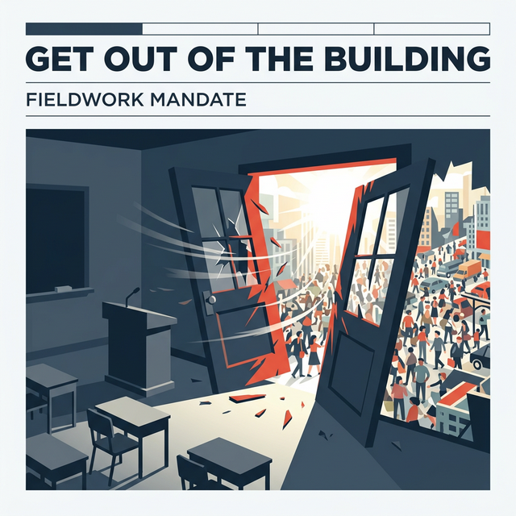
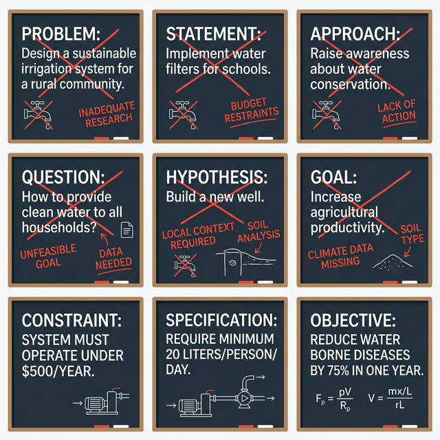
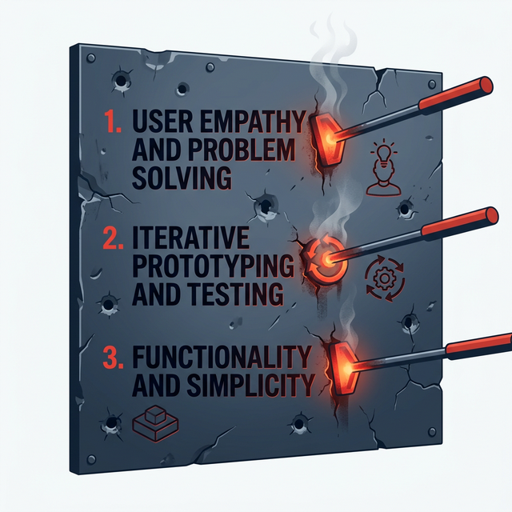
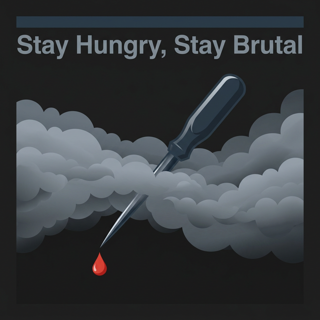

## 模块 6: 实践与小结——微调研沙局与 Exp1 启动 (80 min)

<!-- BUDGET: 2500 chars | SLIDES: ≥5 | STATUS: done -->

> [VISUAL]
> **Slide**: w03-slide-30
> **Layout**: `Center`
> *   **Asset**: 
> **Scene**: 教室的大门在视觉上被极其粗暴地炸开，外面是真实世界的刺眼阳光和密密麻麻的拥挤人流
> **Text**: Fieldwork: 滚出教室，去见血（Get Out of the Building）

我刚才不仅给你们讲了整整一黑板的 5-Why 和 JTBD 剥离技巧，甚至连先导指标怎么设定都教给你们了。现在你们脑子里的理论值已经爆表了。但是，这些东西在真实的敏捷开发大厂里，连一张实习生门禁卡都换不到。
硅谷精益创业之父 Steve Blank 有一句震耳欲聋的行业名言，我希望它能刻在你们今后的每一个原型的封面上："**There are no facts inside your building, so get outside.**"（你的高级办公大楼里绝对没有任何他妈的真实事实，所以现在给我滚出去找真相。）
不要觉得自己很聪明，不要坐在 24 度的空调房里靠臆想去写任何一行需求文档。现在，给我站起来，给你们 40 分钟的时间，带着你们的纸壳笔记本和手机录音笔，像饿狼一样，给我冲进这个校园里最拥挤、最脏乱、最具有不确定性的人群场景中去。

**(Pause: 3s)**

> [ACTIVITY: 校园残酷微调研沙局]
> **Type**: `Practice`
> **Duration**: `40min`
> **Desc**: 强制离开舒适教室，在校园极度受限环境中完成一次包含 JTBD 视角的街头深度人类学访谈，并现场提炼核心先导指标。
> `目标人群与场景选择（任选一）`：
> - 场景 A：中午 12 点整极度拥挤、排队绝望、令人窒息的第二食堂打饭窗口（观察功能性断裂与饥饿带来的情感性崩溃点）
> - 场景 B：大雨天疯狂抢占带有极其稀缺插座座位的图书馆地下自习室区（观察领地保护意识与社会性假面具的撕裂）
> - 场景 C：傍晚取件包裹堆积如山、扫码智能系统濒临瘫痪的菜鸟驿站狭窄快递点（观察机械流程断点与极端愤怒的情绪转移）
> 
> `交火实战规则（Rules of Engagement）`：
> 1. **隐身潜伏 (10 min)**：扮演"无情民族志"观察者。像墙角一盆根本不存在的绿植一样，在目标场景死死盯住 3 个极度焦虑甚至暴躁的用户。记录下他们眉头紧锁甚至咒骂的那个瞬间，以及他们在与环境交互时遇到的最荒谬的那个物理操作断点（比如一只手拿着湿漉漉的伞根本无法完成复杂的屏幕扫码动作）。期间绝对禁止任何形式的搭话与物理干预！
> 2. **突击捕获 (15 min)**：像苍蝇一样寻找一个刚刚经历完痛苦交互（历尽千辛万苦终于买完饭、满头大汗抢到座、或者满脸暴躁取完快递）的"幸存者"。立刻冲上去，展开极端拦截访谈（Intercept Interview）。
> 3. **致命五连问 (5-Whys)**：绝对不准问任何人性的非客观假设问题（例如极其愚蠢的"如果这里有个新机器你会用吗"）！必须从刚刚发生的那个真实客观具体动作切入（例如："同学不好意思打扰了，我刚才观察到你在扫码通道前反复把手机屏幕亮度调最高，甚至还拍了两下屏幕，能告诉我你在那一刻在担心什么吗？"）。顺着他的恶劣抱怨，连续使用 3 到 5 个为什么（Why），像锋利的手术刀一样直接切碎他的客套防备，逼出他在此时此地最底层的**社会层级任务（Social）**或深层无助的**情感任务（Emotional）**。
> 4. **现场凝流 (10 min)**：各小组就地找一个台阶坐下。把你们带有极其浓重个人经验偏见的原始口述记叙录音，死死地套进我们刚才讲的问题陈述公式里："【极度具象用户】极其需要【某个动词】，因为【深层底层动机】"，并且在旁边写下一个极其恶毒但能立刻通过后台埋点验证的**量化先导验证指标（Leading Indicator）**。

**(Timer: 40:00 - 学生全部强制离开教室向外场狂奔调查，随后返回大屏幕前并提交一句话痛点陈述，开展全班黑板残酷暴改互评)**

> [VISUAL]
> **Slide**: w03-slide-31
> **Layout**: Grid
> *   **Asset**: 
> **Scene**: 九宫格展示：屏幕上密集闪烁着各组刚才在黑板上被红笔极其暴力修改过、从充满废话的愚蠢造句逐渐变得句句致命毒辣的 Problem Statement
> **Text**: 全复盘：同理心从来不是请客吃饭，是一场外科手术

好的各位，大家看黑板上这些被我和你们互相用红笔改得面目全非、鲜血淋漓的定标语句。你们刚才在外面冷风里吃到的闭门羹、被不耐烦的受访者翻过的白眼，甚至被直接拒绝的巨大挫败感。请你们记住，这正是未来你们所谓的心血产品上线后，由于根本没有准确洞察到目标用户的核心痛点，而被他们用脚投票、无情抛弃的最真实微缩预演。
深深地记住这种痛楚。我想告诉各位的是，如果今天连面对一个对你没有太多防备的同龄大学生，你都问不出他的核心恐惧和连带的社会性痛楚。你凭什么以为你们能在明年毕业后，做出一款在这个由极其聪明的巨头垄断、在红海里残酷厮杀的资本市场上，让全国几千万成年人愿意解囊、疯狂掏钱的顶级商业软件？

接下来，我要你们把刚才那种极度不适的痛苦，转化为长期的、大规模杀伤性武器。因为这学期的第一场大型、甚至可能会让某些组崩溃解散的战役，正式打响。

> [VISUAL]
> **Slide**: w03-slide-32
> **Layout**: `Center`
> *   **Asset**: 
> **Scene**: 一份盖着绝密红印的指令书被重重拍在桌面上，标题印着 EXP.01
> **Text**: 第一场战役代号：EXP.01 荒野与猎物 (User Insight & Journey)

各位看屏幕——那份盖着绝密红印的指令书，已经被重重拍在了桌面上。代号 EXP.01，"荒野与猎物"。这不是一场温柔的课堂练习，这是你们在这个校园生涯里将要面对的、最残酷但也最接近商业实战的一场硬仗。从这一刻起，你们不再是坐在椅子上听故事的旁观者，而是即将被扔进丛林里的猎人。

> [ACTIVITY: Exp1 大型实弹项目启动与生死组队]
> **Type**: `Workshop`
> **Duration**: `30min`
> **Desc**: 极其严肃地确立 Exp1 的作业下发，强行组建具备多元技能、互补制衡的敏捷黑客战术小队，并现场锁定无法反悔的战役赛道领域。
> `战术要求`：
> 1. **强制兵种混合搭配**：这是一个绝对的硬性要求。绝对禁止一个组里全是被动执行的唯唯诺诺的绵羊，或者全是听不懂人话、只想自己造轮子的纯代码极客。每组必须强制包含以下三种处于极端维度的变态角色：
>    - 至少一名骨子里的**社交恐怖分子（Hustler）**：脸皮极厚，没有任何道德包袱的沟通大师，负责冲锋陷阵去街头抓人做无底线的深度定性访谈和极其残忍的街头可用性盲测。
>    - 至少一名具有**像素级强迫症的暴君（Hipster）**：对排版、视觉色彩层级、错别字有着生理性反胃的变态美学控制狂，负责守护最终原型那不可侵犯的用户体验尊严。
>    - 至少一名毫无感情的**逻辑碎纸机（Hacker）**：负责在另外两名队友开始极其浪漫不着边际的幻想疯狂加功能时，用极其冰冷的工程逻辑架构和数据流转瓶颈图，把他们硬生生一脚砍回现实。
> 2. **赛道生死红锁抽签**：接下来我要让你们从教学系统里发放的五个被绝望情绪填满的底层硬核赛道（比如绝望且冗长的底层重症医疗陪护、充满数字鸿沟的无助银发经济适老化陷阱、或者是充满背刺与甩锅防备的残酷白领职场生存办公套件协作）中随机盲抽一个。一旦锁死确认，本学期绝对不准更换。千万不要为了凑学分逃避困难的命题，我要告诉你们的商业底线是：用户所在的行业痛苦程度越深、越绝望，你一旦解决它，你们未来的商业估值的护城河就越深！
> 3. **交付终局战果预览**：下周的这节课这个时候，我绝对不想听到你们站在讲台上给我像小学生一样念长篇大论、没有感情的用户观察日记。我需要看到极其清晰精确的 Persona（用户画像）、布满情感绝望阴霾裂痕的 User Journey Map（用户动态旅程图），以及那句能让我听了心脏漏跳半拍的、极度毒辣的 Problem Statement。

各位，现在给你们十分钟，用你们的生存本能去寻找队友。十分钟后，把签字画押的组队契约交给我，逾期未组队的直接按首开挂科处理。

> [VISUAL]
> **Slide**: w03-slide-33
> **Layout**: `Split`
> *   **Asset**: 
> **Scene**: 三条冒着浓烈呛人硝烟的战火残废军规，像烧红的炽热烙铁一样死死嵌进布满弹痕的金属屏幕上
> **List**: 1. 用户说谎是生理本能，请停止轻信 | 2. JTBD 是一把不流血的神圣解剖刀 | 3. 没有先导指标定量的同理心，就是商业史上的无耻诈骗

> [TEACHING MOMENT]
> 在今天的最后两分钟，各位收拾书包拉上拉链的时候，我刚才讲过的内容你们可以全忘掉。但是，请把屏幕上这三句话，像物理赛博植入物一样嵌进你们的海马体神经系统里：

### 6.1 田野生存法则：三条嗜血训诫

**总结与训诫（Takeaway）**：
第一，放弃你们作为学生的一切天真幻想，**用户极其擅长说谎，这是写在他们生物基因里的生存保护本能**。这不是意味着他们存心恶毒要骗你，而是他们在语言表达系统里，本身就因为社会认同焦虑，根本无法准确翻译他们极其隐秘的潜意识恐慌。
第二，不要再像个做梦的锤子一样盯着你们那破漏百出、功能极其单一的电钻看了。**立刻换上 JTBD 的三维解剖刀，去切开那个血淋淋、充满泥土的真实墙洞**。永远要在设计前问自己极其残酷的那个问题："在这个极度特殊且绝望的时空情境下，如果没有我的这个伟大产品，他究竟在极其悲惨地雇佣什么狗屎方案来勉强维生？"
第三，**没有任何基于先导漏斗指标实干验证的同理心泛滥，只是一场极其可耻的自我高潮和商业诈骗**。如果你的洞察方案上线后，不能像跑车仪表盘上的死神指针一样，给出毫秒级的、极度敏感的异动数据反馈预言，那就把它立刻揉碎扔进垃圾桶，不要浪费公司极其昂贵的 8 万块月薪级别的研发资源去写！

下课。祝你们在这个布满地雷的残酷田野系统周末，猎杀愉快。

> [VISUAL]
> **Slide**: w03-slide-34
> **Layout**: `Center`
> *   **Asset**: 
> **Scene**: 昏暗聚光灯下，一把极其光滑锋利的锥子正从尖端刺穿迷雾流出鲜血
> **Text**: 保持极度饥饿，甚至保持嗜血，下周见 (Stay Hungry, Stay Brutal)

看最后这张屏幕——昏暗的聚光灯下，一把极其锋利的锥子正从尖端刺穿迷雾，流淌出鲜红的血液。那把锥子，就是你们今天刚刚磨好的 JTBD 洞察之刃。本周的破冰与洞察之旅到此结束。带上这把刀，走出教室，走进真实世界的泥泞与噪音里去。愿你们都能在这个布满地雷的周末成为一名绝不手软的猎兵，下周见。
