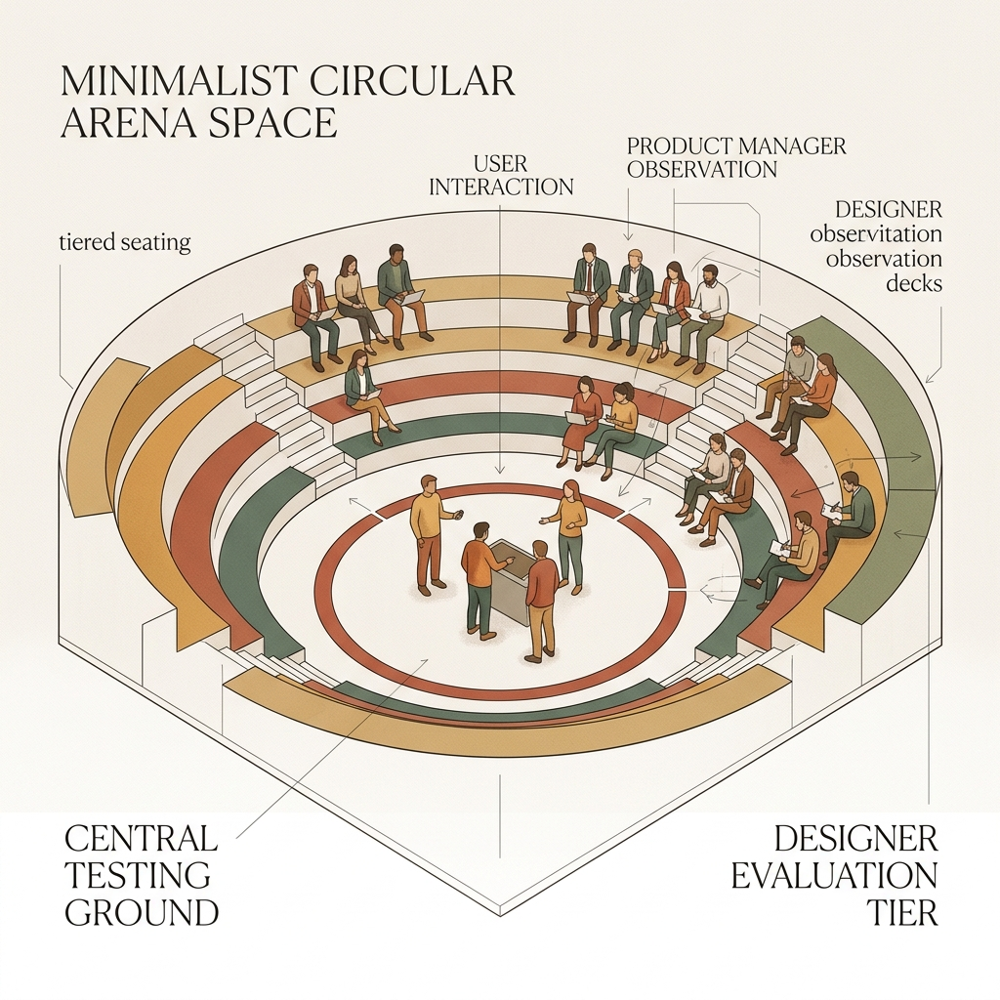
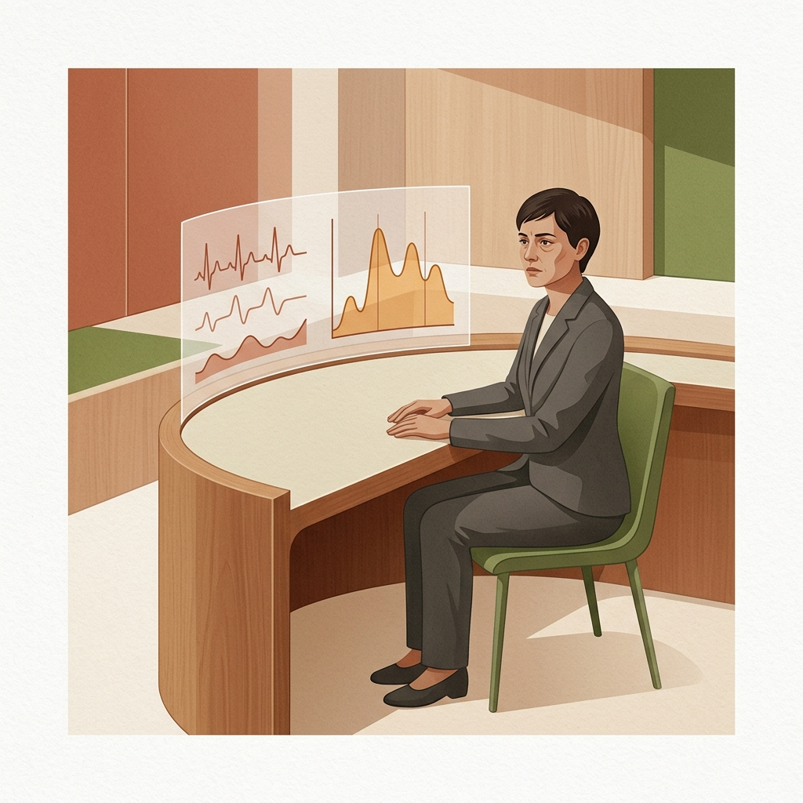
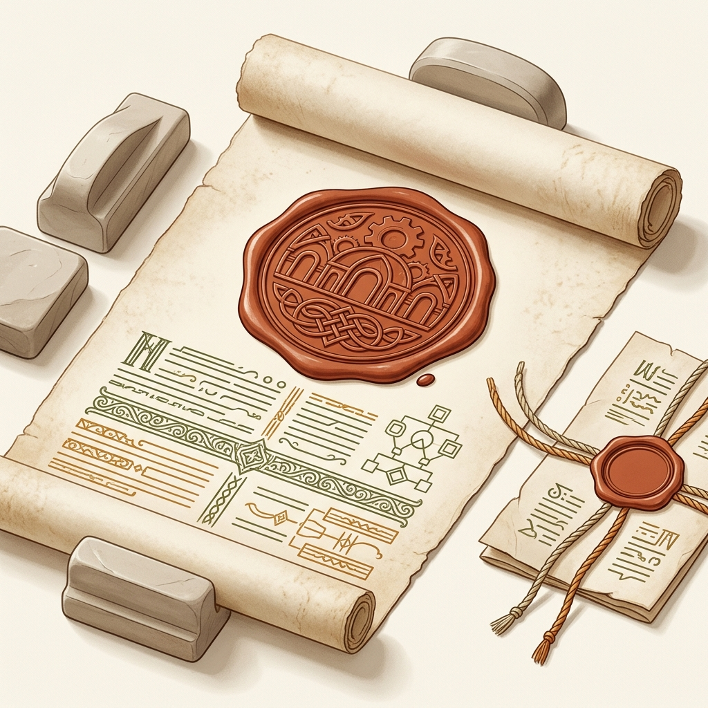
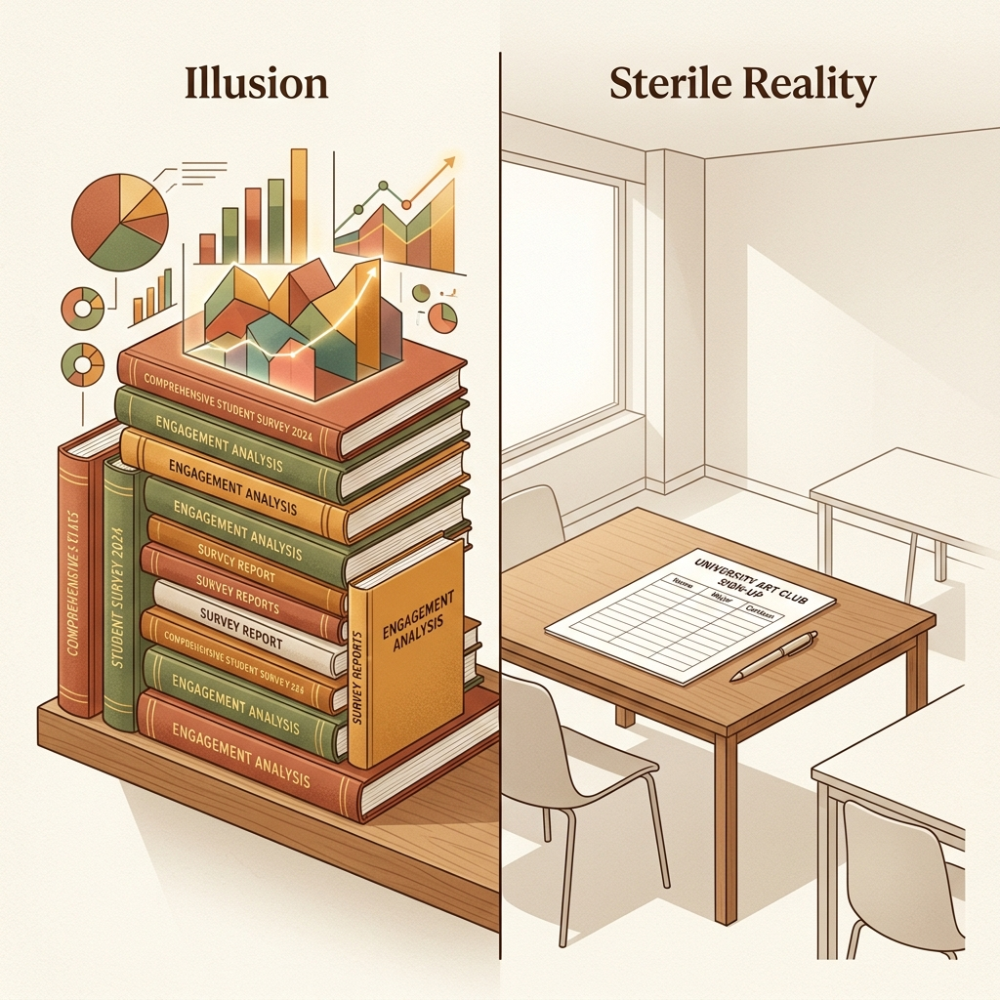
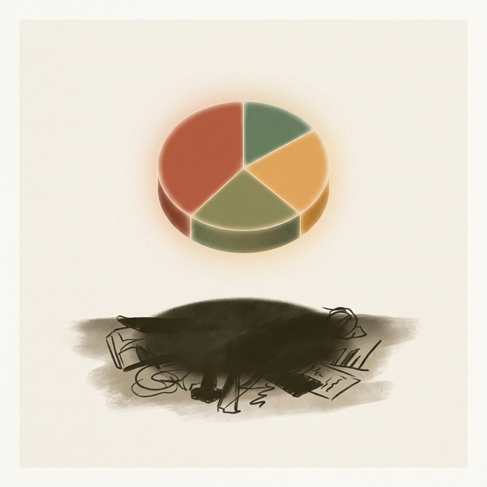

## 模块 6: 实践与小结——微调研沙局与 实践项目 启动 (80 min)

<!-- BUDGET: 2500 chars | SLIDES: ≥5 | STATUS: done -->

> [VISUAL]
> **Slide**: w03-slide-30
> **Layout**: `Center`
> **Asset**: 
> **Scene**: 一群没有实战经验的新兵正站在模拟舱外，神情紧张
> **Text**: Pre-Flight: 在滚出大楼前，先证明你能活过模拟舱

刚才讲了 5-Why、JTBD 剥离技巧和先导指标。现在你们掌握了充足的理论。但是，这些理论如果不到真实世界中去验证，就毫无价值。
> [STORY TIME: Steve Blank 的第一堂田野课]
> 在 Steve Blank 的斯坦福课堂上，他做过一件让所有学生终生难忘的事：开学第一天，他没有打开任何一张 PPT。他直接把全班 60 个穿着连帽衫、抱着 MacBook 的天之骄子赶出了教室大门，扔到帕洛阿尔托的街头，要求他们在两小时内找到 10 个活生生的陌生人，当面问出一个让对方皱眉的真实痛点。
> 
> 两小时后回来的学生里，有三分之一的人**一个有效访谈都没完成**——因为他们从来没有被训练过如何在真实世界中开口向陌生人说第一句话。Blank 说：**"这就是你们价值 20 万美元的 MBA 学位所缺失的全部教育。"**

> [VISUAL]
> **Slide**: w03-slide-36_arena
> **Layout**: Center
> **Asset**: 
> **Scene**: 屏幕上闪现巨大的倒计时沙漏和严酷的实战角斗场背景
> **Text**: 停止纸上谈兵，下沉到真实的泥泞中去

精益创业之父 Steve Blank 有一句名言："**There are no facts inside your building, so get outside.**"（大楼里没有事实，走出去寻找真相）。
但在你们直接上街之前，我们需要先在安全环境里进行一次高压对抗模拟。今天，我们不走出教室，但我们要把"人性中的撒谎本能"请进来。

### 6.1 AI 陪练访谈与画像卡核算

**(Pause: 3s)**

> [VISUAL]
> **Slide**: w03-slide-28b
> **Layout**: Center
> **Asset**: 
> **Scene**: 赛博朋克风格的 AI 审讯室，屏幕上跳动着心率与测谎波形
> **Text**: 飞行模拟舱：对抗带有社会面具的硅基人类

> 这个模拟系统将帮助你们熟悉提问的节奏和技巧。面对那些故意回避核心问题、只给你抛出表层敷衍的赛博对手，你必须克制住自己下意识想去反驳的冲动，学会像外科医生一样，用冷静客观的连环追问切开表象。

> [ACTIVITY: 独立 AI 陪练访谈与画像提取]
> **Type**: `Practice`
> **Duration**: `40min`
> **Desc**: 统一主题"短视频创作者的内容运营焦虑"，各组选择不同类型的创作者角色，通过万能角色构建器 AI 陪练终端练习 5-Why 连环追问与 JTBD 提取。Agent 在学生卡住时自动提供教练指导。采访结束后获取结构化 Proto-Persona 数据卡，作为周末实地调研的标准格式参考。

> [VISUAL]
> **Slide**: w03-slide-36_activity_rules
> **Layout**: List
> **Asset**: 
> **Scene**: AI 陪练终端界面与标准画像卡提取指引
> **Text**: 陪练终端的三大目标
> **List**: 1. 击穿 AI 的三层防御 | 2. 提取深层痛点与物理怪癖 | 3. 提取四大模块标准卡

> `实战流程（Rules of Engagement）`：
> 0. **设计使命宣告 (1 min)**：在开始之前，我要给你们一个身份。从现在起，你们不是学生——你们是一家**创作者工具公司的产品调研团队成员**。公司正在评估是否值得投入资源，开发一款针对"短视频创作者心理健康与效率管理"的辅助工具。你们的任务，是通过深度访谈来回答一个核心问题：**这个人的痛苦是否足以驱动他使用（并付费）一个新产品？还是说这只是一个"听起来很好但没人真正愿意掏钱"的伪需求？** 记住这个问题——它决定了你每一个提问的方向。
> 1. **高压对抗示范 (4 min)**：各位看大屏幕，我现在唤醒 1 号测试对象（输入 `/theme 短视频创作者`，选择美妆博主）。如果我问这种大而无当的问题：“你平时焦虑吗？”（输入问题），看到没有？它给了我一句社交敷衍（Layer 1）。很多人实地访谈就死在这一步。现在，我改用情境还原：“能描述一下你最近一次觉得‘做不下去了’的具体情况吗？”（输入问题）。看！它开始吐露细节了（Layer 2）。剩下的“剥洋葱”，交给你们。记住，如果在这一步直接要结果（输入 `/总结`），你们拿到的就是我屏幕上这张满是“未挖掘”的空白报告单。
> 2. **独立实战访谈 (30 min)**：群里已经发了**《学生实操对战指南》**。现在所有人扫码进入终端，独立操作。选定角色后，使用 5-Whys 连环追问，逼它吐露深层恐惧和“物理行为怪癖”。卡住时可使用 `/coach`。采访结束输入 `/总结` 获取标准四大模块数据卡。 **(Timer: 35:00)**
> 3. **结构卡核算 (5 min)**：将你拿到的数据卡提交至教学平台。这份卡片就是你们周末去线下采访真人（实践项目）时，实践报告必须填写的标准结构。

**(Timer: 40:00 - 全班大屏幕轮播各人提交的画像报告卡，教师快速点评)**

> [VISUAL]
> **Slide**: w03-slide-31
> **Layout**: Grid
> **Asset**: 
> **Scene**: 满屏密集排列的标准用户画像结构卡
> **Text**: 全班复盘：同一主题，不同角色，JTBD 差异一目了然
> **List**: 1. AI 陪练访谈（5-Why） | 2. 四大模块结构卡（/总结） | 3. 实践项目 报告规范对齐

大家看屏幕上这些 Proto-Persona 画像卡。有意思的事情来了——所有人都在采访"短视频创作者"，但你们发现了吗？美妆博主最深层的焦虑和游戏主播的完全不同。**这就是 JTBD 三维度在起作用**：同样的行业，不同的人，Functional Job、Social Job、Emotional Job 的组合完全不一样。那些卡片上到处是"未挖掘"空白的同学，现在你们知道差距在哪了——不是 AI 太狡猾，而是你们的提问还没有触发它的深层释放机制。今天从 AI 手里逼出来的这份标准化单子，就是你们周末去线下采访真人（实践项目）时，实践报告必须填写的标准结构。

接下来，我要你们把刚才的收获转化为敏锐的**商业洞察力**。因为这学期的第一个**核心实战项目**，正式启动。

> [VISUAL]
> **Slide**: w03-slide-32
> **Layout**: `Center`
> **Asset**: 
> **Scene**: 一份盖着绝密红印的指令书被重重拍在桌面上，标题印着 EXP.01
> **Text**: 第一场项目代号：EXP.01 荒野与猎物 (User Insight & Journey)

> 我们将通过这次实践，真正检验你们在**第一现场发掘真实痛点**的能力。

### 6.2 荒野与猎物：实践项目 田野调研项目启动

各位看屏幕——这份**项目指令书**已经下发。代号 **EXP.01**，"荒野与猎物"。这不是一场简单的课堂练习，这是你们将要面对的最接近**商业实战的测试**。从这一刻起，你们不再是旁观者，而是真正深入一线的**破局者**。

> [ACTIVITY: 实践项目 实践项目启动与敏捷组队]
> **Type**: `Workshop`
> **Duration**: `30min`
> **Desc**: 确立 实践项目 的作业下发，组建具备多元技能、互补制衡的敏捷小队，并现场选定研究赛道领域。
> `核心要求`：
> 1. **强制多元角色组合**：每组必须包含以下三种特长角色：
>    - 至少一名**沟通主导者（Hustler）**：擅长沟通，负责进行深度的定性访谈和可用性测试。
>    - 至少一名**体验控制者（Hipster）**：对排版、视觉层级有极高要求，负责把控最终原型的用户体验。
>    - 至少一名**逻辑工程师（Hacker）**：负责在队友发散思考时，用工程逻辑架构和数据流转图确保技术可行性。
>

> [VISUAL]
> **Slide**: w03-slide-37_roles
> **Layout**: Grid
> **Asset**: 
> **Scene**: Hacker, Hipster, Hustler 三种兵种的角色卡片
> **Text**: 黄金铁三角：商业逻辑、技术可行性与体验尊严
> **List**: Hustler (商业/破局者) | Hipster (体验/控制者) | Hacker (技术/工程师)
>
2. **赛道选择**：屏幕上有 8 个场景赛道，都是你们在校园或日常生活中**真正能触达受访者**的领域——校园外卖骑手、独居饮食管理、社交恐惧消费、社团财务管理、考研自习空间、短视频运营、二手交易、在线学习体验。各组根据兴趣自由选择，先到先得。如果你有自己特别想探索的场景，也可以提出自定义赛道，经我审核后使用。
3. **交付成果要求**：下周上课前，每组需要提交三样东西：第一，基于真实调研数据，按照四大标准模块格式整理出的 **Proto-Persona 草稿**；第二，带有时间戳的**原始访谈录音节选**；第三，至少两张**访谈现场环境照**。群里已经发放了**访谈脚本模板**（含破冰话术和 5-Why 追问示例）和**知情同意书模板**，请务必下载使用。

> [VISUAL]
> **Slide**: W03-06-Persona-Mockup
> **Layout**: Center
> **Asset**: 
> **Scene**: 展示一张基于四大模块标准格式排版的 Proto-Persona 报告卡草稿范例。
> **Text**: 交付物标准：四大模块画像草稿

4. **访谈记录的客观性要求**：你们提交的素材，要尽量保持原始状态——带有时间戳的录音节选，加上未经修饰的逐字稿（Verbatim），再辅以受访者当时的肢体动作观察。这些真实的微细节，才是通向痛点的线索。
5. **画像的有效性门槛**：你们构建的 Proto-Persona 必须具备排他性。如果你的画像描述放之四海而皆准（比如："张三，22岁，大学生，喜欢上网"），就需要继续打磨。高质量的画像必须拥有能将其与其他人群区分开的**行为特征**（例如："小陈，26岁外卖骑手，午高峰时段会把手机用橡皮筋绑在电动车把手上，因为他需要边骑车边看导航和新订单"）。记住，关注**行为**而非人口学标签。

> [VISUAL]
> **Slide**: w03-slide-38_failure_case
> **Layout**: Split
> **Asset**: 
> **Scene**: 左侧是装帧精美、堆满图表的问卷报告；右侧是一个空荡荡的大学社团活动室和无人问津的报名表
> **Text**: 死于大楼里的完美报告

> [STORY TIME]
> **[反面教材] 死于大楼里的完美报告**
> 让我给你们讲一个发生在这个教室的失败案例。当时有一组能力极强的全技术背景团队，他们选了"社区老人购药阻碍"的赛道。他们没有去过一次社区，而是坐在宿舍里，用高超的数据爬虫技术，抓取了一万条社交媒体上关于"老人买药难"的吐槽。
>

> [VISUAL]
> **Slide**: w03-slide-38_data_illusion
> **Layout**: Center
> **Asset**: 
> **Scene**: 精美的彩色饼图漂浮在屏幕上，下方掩盖的是真实的痛楚
> **Text**: 数据的欺骗性：爬虫抓不到深层的恐惧
>
他们用精美绝伦的数据可视化图表，向我展示了买药难的时间段分布和药品种类饼图。最后他们的结论是："老人们因为视力退化，看不清 App 上的小字，导致购药失败，所以我们要把字体放大 300%"。
我当时直接给了他们组一个低分。为什么？因为后来有另一个团队，真实地在清晨 6 点的药店门口观察。他们发现，那些老人并不是看不清字，而是他们极其害怕在线支付时点错，导致把钱转给骗子。

真正的摩擦不是"视觉障碍"，而是巨大的"资金安全恐慌"。那组坐在宿舍里的同学，因为放弃了实地考察，把一个心理恐惧问题，降维成了一个肤浅的 UI 字号放大问题。这就是没有真实田野调查导致的**闭门造车**。

> [VISUAL]
> **Slide**: w03-slide-38_field_reality
> **Layout**: Center
> **Asset**: 
> **Scene**: 清晨 6 点药店门口真实排队的老人和冻红的双手
> **Text**: 脱离肉身碰撞的洞察，比无知更可怕
>
各位，现在给你们十五分钟的时间去寻找队友、选定赛道、领取脚手架材料包（访谈脚本模板+知情同意书）。十五分钟后，把明确了**角色分工与赛道选择**的组队名单交给我。另外，这周三晚上之前，各组需要在微信群里发一张田野现场照片+一句话进度更新，让我知道你们已经出动了。

> [VISUAL]
> **Slide**: w03-slide-33
> **Layout**: `Split`
> **Asset**: 
> **Scene**: 屏幕上嵌着三条战火淬炼出的经验军规
> **Text**: 三条核心训诫：说谎本能 · JTBD 视角 · 先导验证
> **List**: 1. 用户往往言不由衷 | 2. 切开真实的墙洞 | 3. 无定量验证即是空谈

> [TEACHING MOMENT]
> 在今天的最后两分钟，各位收拾书包准备下课时。请把屏幕上这三条用无数失败项目和真金白银换来的核心训诫，深深刻进你们的潜意识里。永远不要迷信你在办公室里脑暴出的完美逻辑：

> [VISUAL]
> **Slide**: w03-slide-31b
> **Layout**: Title
> **Asset**: 
> **Scene**: 在幽暗的灯光下，一张布满使用痕迹的真实账单被高亮照亮，隐喻用实际付出的代价戳破语言的谎言
> **Text**: "不要问他们将来会不会用，看他们现在为了解决问题付出了什么代价。"

> 这句话是检验**伪需求与真实痛点**之间界限的**终极试金石**。

### 6.3 田野生存法则：这三条核心训诫决定了调研的成败

**总结与训诫（Takeaway）**：
第一，**用户往往言不由衷，这是社会认知偏差带来的常态**。这不是说他们存心骗你，而是由于社会认同焦虑，他们很难准确表达深层的潜意识需求。
第二，**换上 JTBD 的三维视角，去寻找那个真实的墙洞**。永远要在设计前问自己："在这个特定的时空情境下，如果没有我的产品，他究竟在雇佣什么替代方案来解决问题？"
第三，**没有经过定量验证的同理心，只能是自我感动**。如果你的方案上线后，不能给出高度敏感的数据反馈，那就不要浪费研发资源去实现！

下课。祝你们在这个周末的实地调研中，满载而归。

> [VISUAL]
> **Slide**: w03-slide-34
> **Layout**: `Center`
> **Asset**: 
> **Scene**: 昏暗聚光灯下，一把锋利的锥子正刺穿迷雾
> **Text**: 保持求知，保持敏锐，下周见 (Stay Hungry, Stay Sharp)

看最后这张屏幕——昏暗的聚光灯下，一把锋利的锥子正刺穿迷雾。那把锥子，就是你们今天掌握的 JTBD 洞察框架。本周的破冰与洞察之旅到此结束。带上这个**JTBD 洞察框架**，走出教室，去发掘真实的痛点。愿你们都能在这个周末的实地调研中获得深刻的洞察，下周见。
