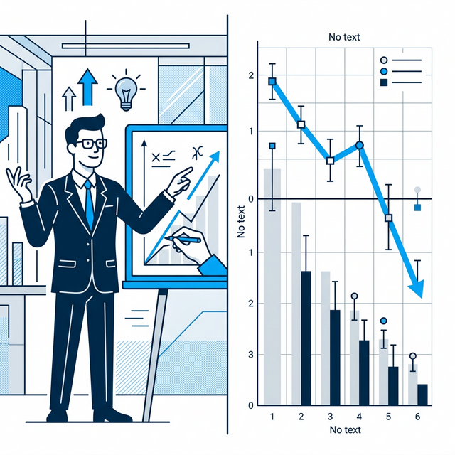
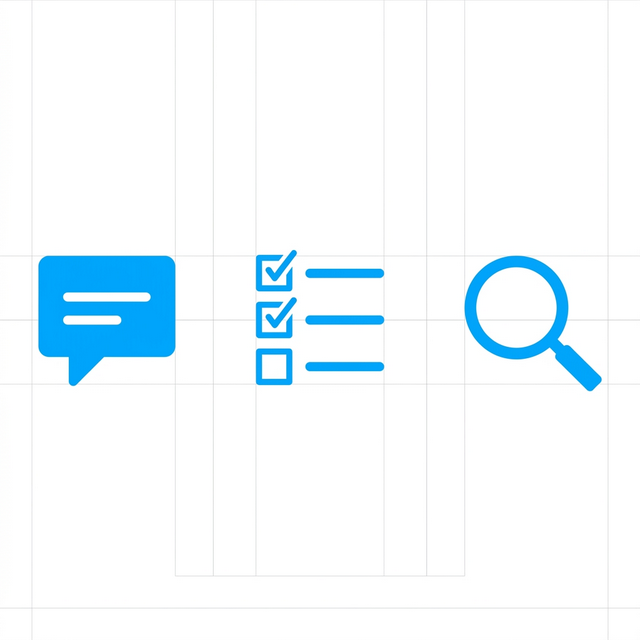
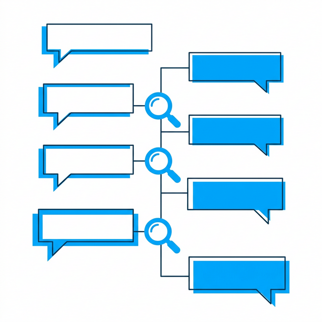
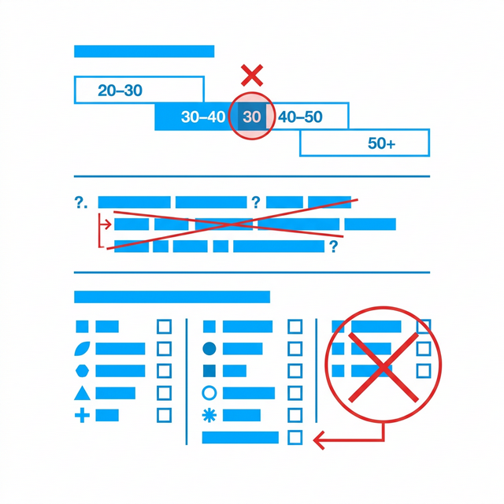

## 模块 1: 复习——从认知摩擦到商业洞察 (10 min)

<!-- BUDGET: 1800 chars | SLIDES: ≥4 | STATUS: done -->

> [VISUAL]
> **Slide**: w03-slide-01
> **Layout**: Title
> *   **Asset**: 
> **Scene**: 巨大的黑底白字标题页，背景是模糊的焦躁人群与代码瀑布流交错（暗示混沌的真实需求与冰冷的机器逻辑）
> **Text**: 产品洞察与痛点切入

欢迎回来各位。上周，我们做了一次对人类大脑极其冷酷的"暴力拆解"。

我们定义了一个贯穿整个职业生涯的词：**心智摩擦**（Mental Friction）。我们说，那不是因为代码写得不够优雅，那是由于人类五十万年进化而来的湿件系统（我们的大脑），硬生生地撞上了只有短短几十年历史的硅基逻辑。

**(Pause: 3s)**

> [VISUAL]
> **Slide**: w03-slide-02
> **Layout**: Grid
> *   **Asset**: 
> **Scene**: W02 核心概念回忆网格图，包含代表注意力的手电筒、代表工作记忆的便签纸、两道斩断流程的红色鸿沟、以及三种模型博弈的光谱图
> **List**: 1️⃣ 大脑的三道滤网 | 2️⃣ 两道体验鸿沟 | 3️⃣ 三种模型的博弈

我们快速把你们脑海里的短时缓存刷新一下。

我们探秘了大脑的三道滤网。还记得那个在人群中捶胸顿足，却没被将近一半人看见的大猩猩吗？那是第一道滤网——**注意力**（Attention）。它不是太阳，它是黑夜里一束极其狭窄的手电筒，照不到的地方都是绝对的黑暗。第二道是**感知**（Perception）——这是个疯狂的主观拼图引擎，格式塔法则让它痴迷于把零散的像素点强行脑补成有意义的整体，即使原本毫无意义。第三道，也是我们交互设计中最容易发生致命缓冲区溢出的——**工作记忆**（Working Memory）。它就像一张只能贴四张便签纸的小桌子，而且还有风在吹。塞满四张纸，再来新的信息，系统就会在你的脑子里无声地死机。

然后，我们在人与机器的交互循环里，画了两道致命的裂缝。一条是在你想干事，却不知道该按哪里、或者门是该推还是该拉时产生的**执行鸿沟**（Gulf of Execution）。另一条，是你战战兢兢按下了按钮，屏幕却静若死水，你不知道钱到底扣没扣的**评估鸿沟**（Gulf of Evaluation）。

最后，我们揭露了这一切惨剧的幕后主使：**三种模型的战争**。工程师构建的那个充满数据库表格与 API 接口的**底层逻辑引擎**（Implementation Model），和用户脑子里粗糙却直觉般管用的**心理模型**（Mental Model）之间，永远横亘着一条银河。而一名优秀的交互设计师的终极使命，就是用屏幕上那薄薄的一层**表现模型**（Represented Model），把复杂的机器现实按在地上摩擦，强行伪装出符合常理的人情人性。

> [VISUAL]
> **Slide**: w03-slide-03
> **Layout**: Split
> *   **Asset**: 
> **Scene**: 左侧是一位设计师正对着电脑疯狂调整界面圆角和阴影（追求正确地建造）；右侧是满仓库积灰的、设计精美却没人买的神奇产品（建造了错误的东西）
> **List**: 正确地建造产品 (Build the product right) | 建造正确的产品 (Build the right product)

好，上周我们算是拿到了一打怎么抹平界面摩擦的战术武器。大家都踌躇满志，准备大干一场。但今天，在这个关键的时间节点上，我要给你们浇一盆透心凉的冰水。我要推翻一个你们潜意识里极其危险的假设。

在这门课的前两周，包括你们在其他诸如 Web 开发、软件工程课里学到的所有东西，其实都在回答同一个技术问题：**"如何把一件东西设计好？"** 界面要符合格式塔原则、防错机制要做足、动效反馈要卡在微秒级的即时响应。这叫做**正确地建造产品（Build the product right）**。

但是，请你停下来想想。

如果那个你拼命想做好的"东西"本身，根本就不是用户想要的呢？如果在长达半年暗无天日的开发周期里，你们把界面的圆角打磨到了极致的像素级对齐，把所有的下拉菜单动画微调到了 60 帧的苹果级丝滑，最后满怀信心地把产品端给市场的时候——用户只是冷漠地看了一眼，扔下一句"这玩意有啥用"，然后转身走开呢？

> [VISUAL]
> **Slide**: w03-slide-04
> **Layout**: Image
> *   **Asset**: 
> **Scene**: 左侧是一台造型极具未来感、充满硅谷设计哲学的白色机器（Juicero 智能榨汁机），右侧是一双手直接粗暴地捏扁了机器专属的能量果汁包，榨出的汁水一样多
> **Text**: 完美执行的伪需求

这绝对不是骇人听闻。这其实是整个互联网商业史上最血淋淋的、每天都在发生的典型死法。你设计了一把体验极其顺滑、符合所有人机工程学规则的昂贵冰梳子，但你悲哀地发现，你的目标用户是个根本不长头发的和尚。

你们以为这种低级错误只有菜鸟会犯？来，让你们见识一下硅谷同行的**四吨推力谎言**。

> [CASE STUDY: Juicero —— 估值上亿的智商税陷阱]
> 2013 年，有一家叫 Juicero 的旧金山创业公司横空出世，他们凭着几张精美的产品图和宏大的愿景，拿下了包括 Google Ventures (谷歌风投) 在内的高达 1.2 亿美元的巨额融资。他们的王牌产品是一台对准中产阶级的"智能榨汁机"。
>
> 如果仅仅从"正确地建造产品"这个战术角度看，这台机器简直是工业与交互设计史上的神作。它由前苹果核心设计师操刀，外壳是根本不留一丝缝隙的极简航空级铝合金；它内部隐藏着一个可以产生 4 吨恐怖物理推力的定制电机（大到能凭空举起两辆特斯拉汽车）；为了贯彻极佳的可用性体验，这台榨汁机的正面只有一个极其优雅的实体按钮。它连通了高速 Wi-Fi，可以在手机 App 上为你提供带有精美波浪动效的实时榨汁进度条，甚至内置了摄像头能扫码识别其配套出售的专属果蔬包的防伪与保质期。科技美学、顶级交互、智能硬件，要素全部拉满，可以说是毫无瑕疵。
> 
> 创始团队给资本讲的故事极其动听：现代城市人渴望喝新鲜健康的果汁，但他们深恶痛绝洗切蔬菜的繁琐，更对榨完汁后清洗满是果渣的榨汁机感到绝望。这个痛点存在吗？确实存在。于是 Juicero 的解决方案是：卖极其昂贵的、在工厂里已经被预处理并装在密闭防震袋子里的果蔬包。用户只要把它丢进这台 700 美元的高科技机器里，按下一个灯光迷人的按钮，机器就用 4 吨的重力直接压榨出新鲜果汁。完美，一滴水都不用洗。
> 
> [VISUAL]
> **Slide**: w03-slide-04b
> **Layout**: Split
> *   **Asset**: 
> **Scene**: 左侧是极其高科技、产生四吨推力的昂贵榨汁机，右侧是一双普通人的双手徒手捏爆了果汁袋
> **Text**: 两分钟短视频戳破一亿美元的估值神话
> 
> 然而，泡沫在 2017 年破裂了。彭博社的一名毫无科技光环的记者发了一条不到两分钟的劣质短视频，用最原始的动作彻底摧毁了这家估值几亿美金的独角兽。视频里，记者拿起了那个 8 美元一袋的预切果蔬包，**没有把它放进机器，而是直接用自己的一双手，用力挤压袋子本身**。结果是毁灭性的：一个成年人的双手在 90 秒内徒手挤出了满满一杯新鲜果汁，出汁量甚至比那台庞然大物压得还要快、还要干净！
> 
> 整个硅谷投资圈哗然，舆论地震。Juicero 的团队完美地观测到了"人们讨厌洗榨汁机"这个极度浅层的表面行为，他们耗费了整整四年的光阴、烧了几百万美金的模具费，把机器的操作反馈、防错约束、视觉一致性全部做到了交互手册里的 100 分。但他们**主观虚构了**那个最底层的真实痛点。
> 人们真实的痛点是"想喝纯天然果汁却懒得收拾残局"，而这个痛点的终极解法——实际上是那包已经在无菌车间里被切碎、直接提供液体的**水果包装袋**！而绝对**不是**一台负责提供冗余挤压力的智能互联硬件。只要你有手，那台 700 美元的机器就是一堆无用且讽刺的硅晶体废铁。在真实粗粝的生活逻辑面前，这套精致到掉渣的数字体验，成为了本世纪最荒诞的商业笑话。

**(Pause: 3s)**

> [LIFE CONNECT]
> 看看你们手机里那些长满杂草、放在隐蔽文件夹里的 App 吧。比如那些你下载完只用过可怜的一两次的网红记账软件。它的过场动画可能比你的 iOS 原生界面还要惊艳，它的支出图表颜色搭配绝美，分类标签多达一百二十种。但它真的解决你"攒不下钱"的痛点了吗？你的核心痛点根本不是"我找不到一个能分出一百种花销账目的优美软件"，你的底层痛点是"每次吃完一碗 15 块钱的面条，都要像机器人一样掏出手机手动记录数字"——这件事本身**极其违反人类追求低能耗的生理本能**。当一个工具产品的设计团队没有看透这背后的天然阻力，没有试图去打通银行卡接口实现无感自动记账，而是一味地在那徒劳无功地死磕"选择餐饮类别的流畅滑动体验"时，这帮人就注定要在这个红海市场里被前浪淹死。

> [TEACHING MOMENT]
> 我看过了太多届同学的设计方案，很多人的致命通病是：一拿到题目，电脑一开，直接启动 Figma 开始疯狂画原型。画了一百多张充满虚荣感的炫目高保真稿子，结果在答辩时，被下面的评委冷冷地问一句："**用户凭什么非要用你这个东西？他不用你会死吗？他原来的替代方案槽点到底在哪里？**" 这个问题一出，整个精美的宣讲瞬间哑火，土崩瓦解。
> 
> 这门课，我们不仅要教你们如何打造一把无缝对接人类心智的利器，更要教你们，在动炉火锻造这把剑之前，必须先学会带上红外线望远镜和高倍显微镜，找准那只真正躲在迷雾背后的、咬人最疼的恶龙。
> 因为，如果没有深入骨髓的真实洞察，你所有的完美交互努力，都约等于在泰坦尼克号彻底沉没前的五分钟，非常投入、非常专业、非常有工匠精神地——将甲板上的躺椅摆得整整齐齐。

这，就是我们进入第三周核心内容的原因。我们要学会**逆向拆分用户的谎言与真相**。欢迎来到这场关于洞察的猎杀。
