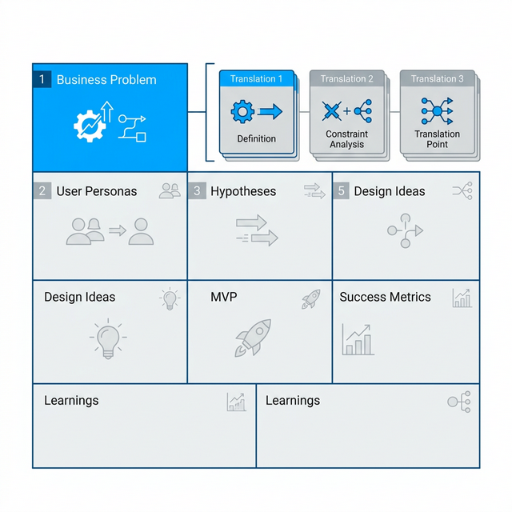
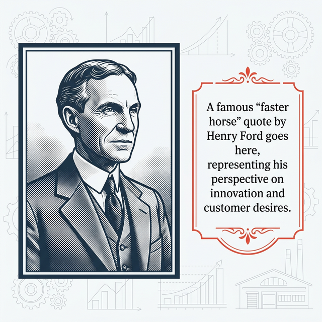

## 模块 2: 导入——认知摩擦的终极变种与言行不一 (10 min)

<!-- BUDGET: 1800 chars | SLIDES: ≥4 | STATUS: done -->

> [VISUAL]
> **Slide**: w03-slide-05
> **Layout**: Split
> *   **Asset**: 
> **Scene**: 左侧是一个用户满脸笑容地说"我非常喜欢并且需要这个功能"，右侧是监控录像里他把截然相反的东西偷偷揣进了口袋
> **Text**: 认知摩擦的终极变种：言行鸿沟 (Say-Do Gap)

上周我们讲了执行鸿沟和评估鸿沟，那是发生在**人机界面**上的物理断裂。但今天，我们要面对一条更深、更黑、更可怕的心理侧沟壑——发生在你和用户之间的**言行鸿沟**（Say-Do Gap）。

所有刚入行的哪怕是最顶尖大学毕业的产品经理和年轻设计师，都会在第一年毫无例外地犯下同一个不可饶恕的致命错误：**他们竟然真的去相信用户嘴里说出来的话。**

**(Pause: 3s)**

> [DID YOU KNOW: 索尼的黄色收音机谎言]
> 给你们讲一个市场消费者调研圈里，被奉为圭臬的经典老故事。很多年前，巨头索尼（Sony）准备推出一款全新的运动型便携收音机（Boombox）。为了决定第一批主打什么颜色，他们极其严谨地招募了一群目标消费者，把大家关在一个典型的焦点小组（Focus Group）访谈室里。
> 
> 主持人拿出黑色的和明黄色的两套方案，热情地问大家："你们更喜欢哪一个？"
> 参与者们纷纷热烈地举起手，满脸放光地称赞："当然是明黄色！黄色代表运动、代表活力、代表年轻人的朝气！在户外运动时我们太需要一款亮色的电子产品了！" 座谈会气氛空前热烈，详尽的调研报告上一边倒地支撑了黄色必须成为首发方案。
>
> 如果故事到这里结束，索尼就会开足马力生产几百万台明黄色收音机，然后发向全球市场死得很惨。
> 
> 但负责这场调研的首席心理学家做了一个天才的举动。在会议结束时，他微笑着对所有参与者说："感谢大家的宝贵建议。作为报酬，出门的时候，**每个人可以在门口的桌子上免费拿走一台收音机**作为礼物。黑色和黄色都在那儿，随便挑。"
> 
> 你们猜结果怎么着？
> 等会议室空了以后，工作人员惊讶地发现：**桌子上的黄色收音机原封不动，几乎所有的参与者，都悄悄地拿走了那台沉稳、低调、不会在公众场合让自己显得过于突兀的黑色收音机。**

> [VISUAL]
> **Slide**: w03-slide-06
> **Layout**: Diagram
> *   **Asset**: 
> **Scene**: 一座经典的深海冰山图模型。水面上的冰山极小尖端标注"人们怎么说 (Say)"，水面下巨大的冰山主干沉没在深海中，标注"人们怎么做 (Do)"和"人们隐秘的感觉 (Feel/Dream)"
> **List**: 表达层 (Say) - 受社会期望污染 | 行为层 (Do) - 本能与现实驱动 | 潜意识层 (Feel/Dream) - 最深刻的隐秘动机

这就是横亘在所有产品洞察面前，最厚的一堵叹息之墙。人们嘴里说出来的，往往是他们认为"在社会眼光下看起来更体面"、或者仅仅是"你希望听到"的礼貌答案；而他们身体诚实做出的，才是被千万年基因和底层真实欲望支配的本能动作。这种言语表达与物理行动的剧烈断裂，就是 **Say-Do Gap**。

如果你把产品立项的基石建立在用户的"Say"（口服）上，你就等于在一片沙滩上建造摩天大楼。

> [CASE STUDY: 沃尔玛惨痛的过道悖论]
> 我们再看一个更极端的真金白银惨案。全世界最大的零售商业巨头沃尔玛，曾经发起过一次大规模的门店顾客满意度问卷调查。成千上万的顾客在问卷上愤怒地抱怨同一件事："你们的货架过道实在太拥挤了！过道里堆满了乱七八糟的促销售卖车，推着购物车连转身都困难。太糟心了！我们强烈要求宽敞明亮的过道！"
> 
> 沃尔玛的总部高管们一看数据，痛定思痛。对啊，用户体验第一原则！于是，他们斥资数百万美元，强行下令把无数家门店过道里的促销端架（End-cap displays）和堆头全部撤走，把主动线过道拓宽了整整一倍。视线极其通透，空间无比豁亮，充满了极简高级感。顾客们在复访中也纷纷给出好评："太棒了，这才是国际超市该有的完美体验！"
> 
> 一个月后看季报，沃尔玛高管们的脊背骨却渗出了一片冷汗。**整体销售额暴跌了将近 15%！损失高达数十亿美元！**
> 
> 为什么？因为那些平时挡在过道中间、极其妨碍通行、被骂得狗血淋头的"拥挤促销车"，正是用来激发顾客走过路过时本能的**冲动消费**的终极武器！顾客的大脑前额叶（慢思考）在问卷上理性地写下："我讨厌拥挤，我只买购物清单上的东西"；但他们那个古老而诚实的边缘系统（快思考）却在走过糖果堆头时，毫不犹豫地把手伸向了那盒打折的士力架。沃尔玛为了迎合用户在"言语表现模型"里的体面要求，悍然抹杀了默默支持其商业帝国利润引擎的底层"物理行为模型"。

> [VISUAL]
> **Slide**: w03-slide-07
> **Layout**: Comparison
> *   **Asset**: 
> **Scene**: 左侧标注：古典经济学里绝对理性的"经济人"（Homo Economicus）；右侧标注：行为经济学里受限的、充满偏见的"现实人"（配以《辛普森一家》里 Homer 的经典挠头形象）
> **Text**: 行为经济学：认清人类的荒诞本能

> [PHILOSOPHY: 行为经济学里消失的理性人]
> 造成这道巨大鸿沟的跨学科解释是什么？在很长一段时间里，传统的古典经济学把人类假设为绝对理性的"经济人"（Homo Economicus）——认为人们总是能像计算机一样完美计算得失，根据最大化效用的严密原则诚实地行动。但 2017 年诺贝尔经济学奖得主理查德·泰勒（Richard Thaler）用行为经济学重重地打碎了这个百年幻想。他无情地指出，真实世界里的人，更像那只正在抓狂的辛普森。我们会因为极微小的虚荣心而盲目买单，因为损失厌恶（Loss Aversion）而做出极其非理性护短的选择，甚至会为了维护一个"我是一个环保/健康的人"的高尚社会人设，而在长达十几页的调研问卷上撒下弥天大谎，转头一出门再去买碳排放极高的大排量汽车和毫无营养的全糖奶茶。
> 
> 作为数字体验设计师，我们必须认清并且接受这个无奈的现实：你面对的绝对不是一排排能在数据库里严密闭环运转的算法参数，而是一群体内充满了荷尔蒙、偏见、恐惧和极度矛盾欲望的哺乳动物。

> [VISUAL]
> **Slide**: w03-slide-07b
> **Layout**: Image
> *   **Asset**: 
> **Scene**: 工业时代伟人亨利·福特的经典黑白复古照片，旁边印着他那句被产品圈引用了无数次的金句
> **Text**: "如果我当年去问顾客他们想要什么，他们只会告诉我：一匹更快的马。" —— 亨利·福特 (Henry Ford)

**(Pause: 3s)**

看屏幕。这是一句被无数傲慢的产品经理用来当作"老子不需要做调研"的经典挡箭牌名言。汽车工业的奠基人，福特真的说过这句话。

很多人极度曲解了这句话的本质，以为它的意思是："用户都是蠢货，是无法沟通的土包子，我们只要躲在玻璃房里闭门造车就行了，我们要像乔布斯一样高高在上地去教育用户"。

大错特错！福特这句话真正的灵魂内核，是在定义什么叫**洞察的第一准则**：用户永远只能基于他们现有的、极其狭窄的认知框架来思考。比如他们只活在马车时代，所以提出具体的解决方案时，往往只是想要一匹跑得更快的马。而你作为专业角色的核心任务，**绝对不是顺从地去满足他们嘴里提出的那个蠢方案**！而是要像一名极度冷血又极度敏锐的外科医生一样，用柳叶刀切开那句表面粗糙的"更快的马"，看到里面跳动的真实、永恒的诉求——**"我想用更短的时间、更省体力地从 A 点移动到 B 点"**。

看懂这把解剖刀了吗？这就是我们今天要讲的最核心的方法论跨越："更快的马"，是用户伪装出来的**伪需求（Solution）**；而"更快地从 A 点流转到 B 点"，才是人类不可磨灭的、跨越时代的**真痛点（Job to be Done）**。

所以，放弃去发那些愚蠢的选择题问卷问"你想怎么改进按键颜色"吧。停止机械的倾听，开始像捕食者一样去观察。在这堂课接下来的时间里，我要教你们一套系统的剥洋葱刀法，教你们如何切开现象那层迷人的肌肤，把最底层痛点的骨头，血淋淋地剔出来。
