## 模块 3: 讲授一——反直觉定性调研与问题发掘 (35 min)

<!-- BUDGET: 5400 chars | SLIDES: ≥10 | STATUS: done -->

> [VISUAL]
> **Slide**: w03-slide-08
> **Layout**: Split
> *   **Asset**: 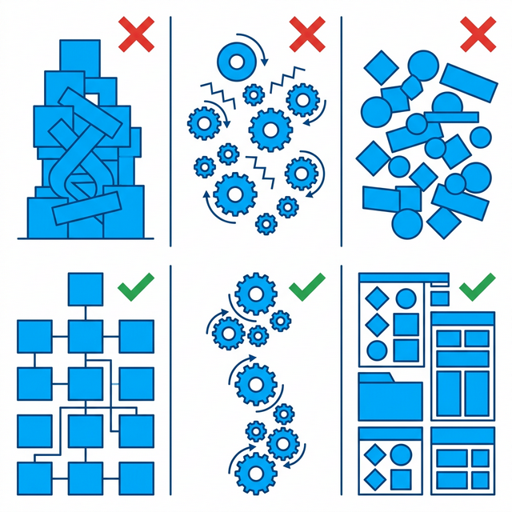
> **Scene**: 左侧是成堆的枯燥数据报表、漏斗和饼图（冷冰冰的"What"）；右侧是拿着黑客帝国般放大镜观察单个用户皱眉表情的极致特写（鲜活的"Why"）
> **List**: 定量调研 (Quantitative): 关注"有多少人"做这件事 | 定性调研 (Qualitative): 关注"为什么"做这件事

既然我们已经验证了"绝不能听用户怎么说"这条铁律，那在这个真假难辨的世界里，我们到底该怎么做产品调研呢？

商业世界里有两大流派，就像武当和少林：**定量调研（Quantitative）** 和 **定性调研（Qualitative）**。
简单粗暴地划分：定量告诉你"有多少人"在买单，定性告诉你他们到底"为什么"要买单。如果你的数据大盘告诉你，这个月购物车的跳出率激增了整整 30%——这是定量的功劳，它像一个挂在高塔上的红色报警器，尖叫着告诉你这栋大楼起火了。但报警器永远无法告诉你，火灾是因为昨晚地下室电线短路引起的，还是因为有人满怀仇恨地故意纵火。

要找到火源的灰烬真相，也就是业务痛点的终极本质，我们必须依靠**定性调研**。我们不是去发一万份廉价的选择题问卷，而是要像福尔摩斯一样，深入凶案现场，去死死盯住十个活生生、充满缺陷的人。

**(Pause: 3s)**

> [VISUAL]
> **Slide**: w03-slide-09
> **Layout**: Diagram
> *   **Asset**: 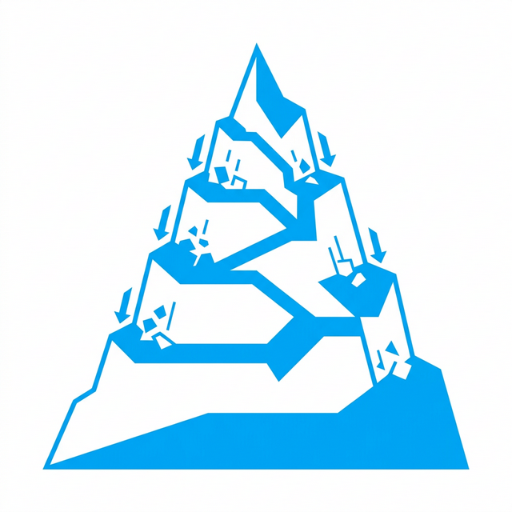
> **Scene**: 焦点小组病态行为动力学模型。圆桌中心是一个麦克风，一个人（声音最大者）身上发出巨大的声波覆盖全场，其他人（被顺从者）脑袋里亮起了代表"盲目同意"和"妥协"的绿灯
> **Text**: 焦点小组的毒药效应：群体极化与顺从

但在这个寻找真相的过程中，很多大公司踩了第一个巨坑——他们迷信一种被传统营销学奉为神明的工具，叫**焦点小组（Focus Group）**。

还记得我们在模块 2 里讲的索尼收音机的故事吗？那就是一场极其典型的焦点小组灾难。把八个完全不认识的陌生人关在一个带单向玻璃的房间里，给他们发点令人愉快的车马费，分发一些零食，然后让他们对着一个还不成熟的产品模型高谈阔论。这种形式听起来极其高效，仿佛一个下午就能收集所有声音。但它在洞察真实痛点上，简直就是一发剧毒的鹤顶红。

> [PHILOSOPHY: 乌合之众与群体动力学]
> 从社会心理学的宏大角度看，焦点小组天生带有无法根除的基因缺陷。第一，**意见领袖的恐怖霸权**。只要这八个人里有一个性格极其外向、嗓门极大的"Alpha"型人格，或者一个穿着西装的所谓"行业专家"，不出十分钟，剩下七个原本性格内向、真实痛点完全不同的小透明，就会在潜意识的社交压力巨轮下屈服，开始唯唯诺诺地附和他的观点。这在心理学上叫"群体极化"（Group Polarization）。第二，**表演型人格陷阱**。当人们知道自己正在被一块单向侧透的玻璃背后的高管们观察，甚至录音时，他们会自动带上"专业评论家"的面具，开始用极其理性的、甚至略带装腔作势的宏大词汇来点评你们的产品。在这个空间里，他们不是在表达日常的需求，他们是在上演一场廉价的公开智力表演。

焦点小组也许可以用来快速测试一句广告宣传语的通俗顺口程度，但**绝不能用来挖掘底层痛点**。因为真正的痛点是极度私密的、脆弱的、往往带有隐蔽的羞耻感和无能为力感的。你不可能指望一个真实的 C 端用户在一个灯光明亮的会议室里，当着七个陌生人的面，坦承自己"因为实在看不懂你们这句提示语到底什么意思，而觉得自己智商很低"。

> [VISUAL]
> **Slide**: w03-slide-10
> **Layout**: Quote
> *   **Asset**: 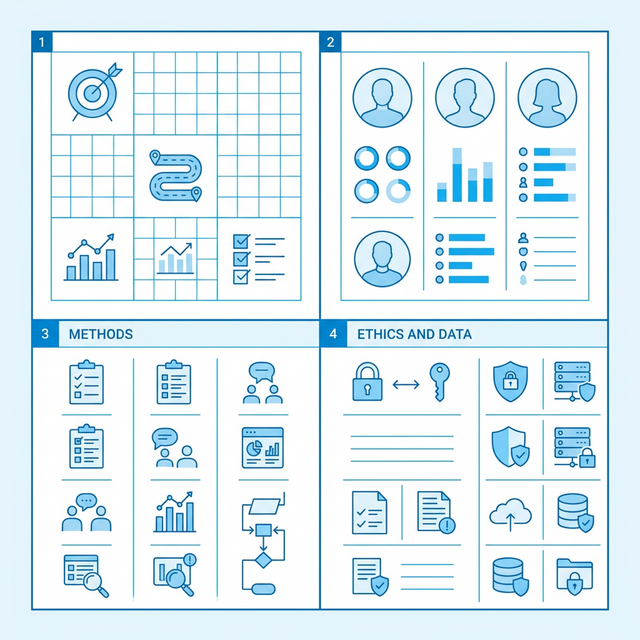
> **Scene**: 纯黑底色，用极其醒目的巨大亮黄色字体写着一行英文，背景是一个产品经理推开玻璃门走向车水马龙的街头背影
> **Text**: Get Out of the Building (走出大楼) —— Steve Blank

所以，敏捷创业之父、硅谷教父 Steve Blank 在斯坦福的讲台上喊出了一句振聋发聩的口号：**Get Out of the Building（走出大楼）**。

公司大楼里绝对没有事实，大楼里只有吹空调的猜测和部门之间的政治意见。要想拿到一手的、血淋淋的痛点洞察，你必须亲自走到室外，走到用户正在烈日下或黑夜里挣扎的真实物理环境里去。这就是定性调研刺干伪需求的两把最锋利的尖刀：**参与式观察（Observation）** 和 **深度访谈（In-depth Interview, 简称 IDI）**。

**(Pause: 3s)**

> [VISUAL]
> **Slide**: w03-slide-11
> **Layout**: Split
> *   **Asset**: 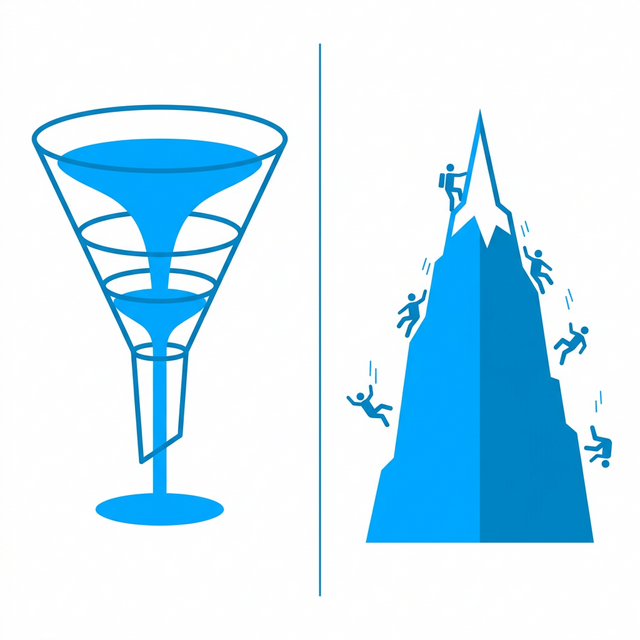
> **Scene**: 左侧是穿着一尘不染白大褂在无菌实验室里拿管子测试小白鼠的古典科学家（控制变量法）；右侧是穿得破破烂烂的人类学家，坐在非洲部落肮脏的篝火旁和土著一起啃树根（田野调查法）
> **List**: 实验室视角：剥离环境，观察被隔离的标本 | 人类学视角 (Ethnography)：融入情境，理解真实的系统语境

我们先抽出第一把刀：**参与式观察**。

> [CROSS-DISCIPLINARY: 民族志与人类学的田野调查]
> 各位，参与式观察这把刀不是我们硅谷的程序员或设计师发明的，它是我们从一个古老的人文学科——**人类学（Anthropology）**那里借来的顶级跨学科武器，学术界给它的专有名词叫**民族志（Ethnography）**。
> 大家想一想，一百多年前，伟大的古典人类学家如果想研究一个位于太平洋孤岛上的原始土著部落，他们是怎么实操的？他们绝对不会动用军队把几个土著抓回伦敦宽敞的实验室里、关进铁笼子，然后发给他们一张英文打印出来的多选题问卷问："请问你们部落平时是怎么打猎的？A. 用长矛 B. 用陷阱"。这简直荒谬到极点。
> 伟大的现代人类学奠基人马林诺夫斯基（Bronisław Malinowski）的做法是震撼性的：他直接带上一顶破帐篷，乘船跑到那个与世隔绝的特罗布里恩群岛上，在他们满是蚊虫的村子里搭起帐篷，住上了整整一年。和他们一起下狂风暴雨的海去捕鱼，一起参加充满迷信的神秘祭祀仪式，在雨后的烂泥地里打滚。
> 在那一年里，他剥落了所有现代文明学者的骄傲外衣。他不只是高高在上的"观察者"，他强行把自己变异成了这个古老环境结构里的"一部分"。这就叫人类学不可磨灭的火种——**田野调查（Fieldwork）**。

同理，如果你现在接到了一个价值千万的 B 端单子，要设计一款给三甲医院急诊室重症监护区护士用的医疗信息录入平板（Pad），你会怎么做调研？
把最资深的护士长请进你们高大上、落地窗外的互联网公司会议室里，给她泡一杯星巴克，让她坐在沙发上"回忆"她的操作流程？如果你这么做，你设计出来的系统注定会害死人。
你唯一正确的做法，是应该穿上护工的白大褂，在一个极其混乱、充斥着叫喊声和警报声的周五晚上，站在急诊室最拥挤的角落里，像隐形人一样盯着她看整整三个高压小时。

就在这样的田野观察里，你会**震惊地发现**：她那晚根本没有一丝多余的时间和从容，去用食指去精准点击那个你们在 Figma 电脑上精心设计的 44px 圆角按钮，因为她的双手那一刻可能沾满了黏腻的血液或者药物污渍；
你会发现，为了在走廊里一边跑步一边查房，她把极宽的 Pad 死死夹在左边腋下，用右手极不舒服的手腕姿势在疯狂地敲击屏幕侧边缘的物理盲区；

> [VISUAL]
> **Slide**: w03-slide-11a
> **Layout**: Image
> *   **Asset**: 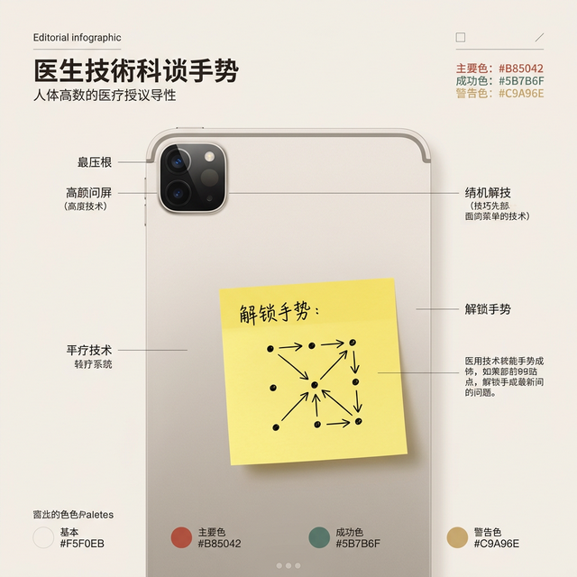
> **Scene**: 一台昂贵的高科技医疗平板电脑背面，被极其违和、粗暴地贴上了一张写着巨大九宫格开锁手势密码的明黄色便利贴
> **Text**: 只有实地观察才能捕获的"野生摩擦"

你甚至会惊悚地发现，为了对抗你们的高级架构师设定的那个军工级机制——也就是"为了数据隐私而每隔五分钟自动熄灭锁屏"的设定，护士长直接在 Pad 的黑色背面，毫不掩饰地贴了一张写着巨大的九宫格开锁密码的黄色便利贴！

这些沾着血、被腋下暴力夹着、充满违规的"肮脏"事实，在星巴克飘香的会议室里一辈子都不会出现。只有像马林诺夫斯基一样展开**民族志式的实地观察**，才能捕获这些足以瞬间推翻、颠覆你整个产品底层防御架构的"野生摩擦"。

> [VISUAL]
> **Slide**: w03-slide-11b
> **Layout**: Split
> *   **Asset**: 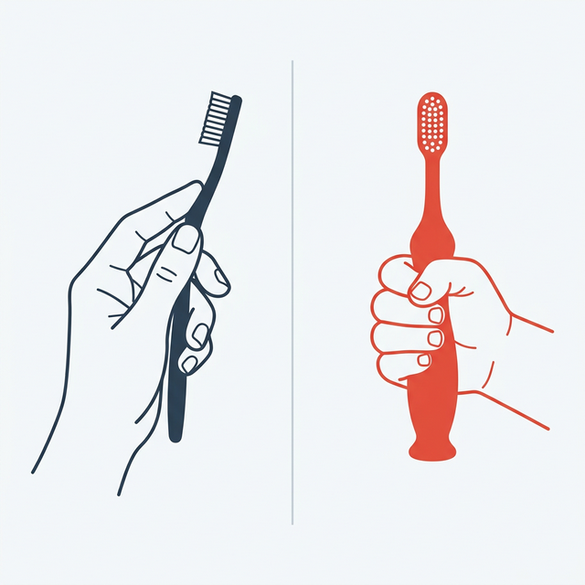
> **Scene**: 左侧是成年人灵活拿普通牙刷的姿态（三点手指灵活捏着笔杆），右侧是小孩子满手抓握极其粗壮的橡胶把手牙刷的暴躁姿态（整个拳头死死紧握）
> **Text**: 只有观察才能看见的物理真相：IDEO 儿童牙刷革命

> [CASE STUDY: IDEO 与欧乐-B 的儿童牙刷革命]
> 为了用最硬的铁证向你们证明"实地观察"比"语言询问"的破坏力大一万倍，我们来看全球顶级创新设计公司 IDEO 在 1996 年为欧乐-B (Oral-B) 做的一个极其著名的百亿美元爆示案子。
> 当年，欧乐-B 想设计一款划时代的儿童牙刷，挑战竞争对手。如果按照正统而平庸的商学院逻辑，由于五岁以内儿童的语言表达能力极差，公司肯定会去印刷十万份问卷，跑去问那些拥有购买决策权的"父母"："你们觉得一把优秀的儿童牙刷应该长什么样？"
> 父母的逻辑极其简单线性："儿童的嘴很小，儿童的手也很小，所以儿童牙刷就应该是我们成人牙刷的等比例缩小版呀——刷头变极其小，刷柄变得极其细。" 整个世界牙刷工业界，在长达几十年的时间里都是这么闭着眼睛干的。
> 但 IDEO 拒绝了问卷。他们派出了极少数最敏锐的人类学家设计师，带着极其笨重的摄像机，直接走进几十个有小孩的普通美国家庭的狭小浴室里。他们什么都不干预，什么都不问，就是像生了根一样静静地站在马桶旁边，用镜头记录下 5 岁小孩每天早晨与洗漱台做斗争的真实物理过程。
> 
> 然后，在会议室里一帧一帧缓慢回放录像带时，他们发现了一个震碎了整个行业三观的细节秘密。
> 各位，请你现在抬起手，假装你在刷牙。成年人是怎么拿牙刷的？由于成年人的精细运动神经元极其发达，我们根本不用手掌心，我们是用**指腹和指尖的灵巧力量**，像拿一支名贵钢笔一样"捏"着牙刷柄，在口腔内做极其轻盈的来回转动调整。所以成年人的牙刷柄设计得又细又长是非常科学的。
>
> [VISUAL]
> **Slide**: w03-slide-11c
> **Layout**: Split
> *   **Asset**: 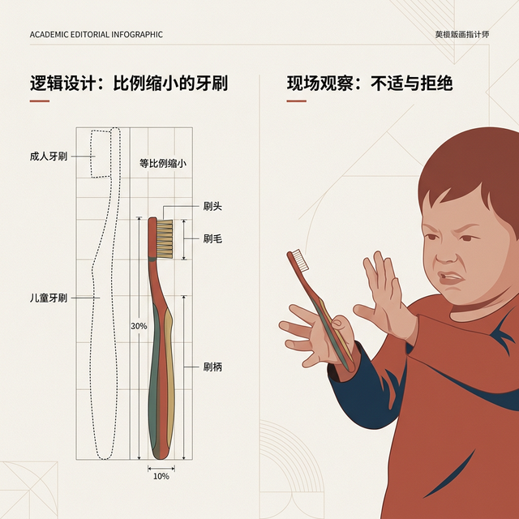
> **Scene**: 左侧是父母们理所当然的逻辑（大人牙刷等比例缩小）；右侧是田野影像中儿童拿着牙刷痛苦戳破牙龈的流血抗拒场景
> **Text**: 录像带回放中震碎了行业三观的细节秘密
>
> 但是那些狂躁的小孩子呢？5 岁儿童的手部精细神经根本没有发育完全！在由于热水雾气变得昏暗的灯光和滑腻腻的牙膏泡沫下，他们根本无法用两根指尖"捏"住一把细若游丝的牙刷。如果你看满屏的录像，你会发现所有哭闹的孩子，都是极其粗暴地用整只手掌，像棒球运动员死死握着一根全垒打棒球棍一样，**用整个拳头死死攥住**那根可怜的细牙刷柄！
> 因为手柄实在太细，根本不符合拳握的力学支撑，他们在嘴里闭着眼睛狂暴捣鼓的时候，牙刷天天在沾水的掌心里打滑脱落，甚至锋利的尾部直接大力戳破脆弱的牙龈，导致孩子们一边嚎啕大哭一边把牙刷狠狠砸进水池。
> 这，就是为什么全天下的孩子们如此痛恨刷牙的，最隐秘也是物理学上最致命的原因。
> 
> 带着这个哪怕问父母一万遍也休想听到的、滴着血的洞察，IDEO 杀回了实验室。他们把原来细长的牙刷柄彻底砸碎推翻，为欧乐-B 重新颠覆性地设计了一款刷柄极其粗壮、像个手榴弹一样、甚至表面紧紧包裹着一层极厚防滑波浪软胶的全新儿童牙刷——"Squish Grip"。这款产品上市后仅仅十八个月内，以前所未有的霸主姿态彻底统治了全球儿童牙刷的存量市场，成为人类工业产品创新史上的不朽丰碑。
>
> 各位请问，这个"孩子由于手部神经未发育而采取拳头棒球握姿"的生理痛点摩擦，是你把一堆疲惫的父母关在焦点小组会议室里喝咖啡，或者给那些根本不刷牙的五岁孩子发 100 份纸质多选题问卷，你能问得出来的一丝一毫的线索吗？
> 绝对不可能。**产品世界的真理，永远藏在充满噪音和泥泞的第一现场的真实摩擦之中。**

> [VISUAL]
> **Slide**: w03-slide-12
> **Layout**: Image
> *   **Asset**: 
> **Scene**: 一名探长在阴冷的高压审讯室里，用极其有压迫感的姿态拿刺眼强光灯直射嫌疑人的眼睛，嫌疑人被迫低头
> **Text**: 访谈的死穴：验证式审问

观察是"用眼看"，我们再来拔出第二把刀："用嘴问"，也就是**深度访谈（In-depth Interview）**。

这是产品史上人员伤亡和项目翻车最惨烈的重灾区。百分之九十的零经验初级访谈者、或者背着巨大 KPI 压力的项目猛将，拿到调研任务后，会不知不觉地把名为"用户访谈"的茶话会，变成一场**带极度偏见的诱导式高压审讯**。

最经典的自杀式提问通常长这样："李先生，如果我们在下一步的重大改版中，在这个右上角加一个闪烁的一键导出报表功能，极大地提升您的效率，您会在工作中高频使用它吗？如果这个超级棒的功能每个月只收您一杯咖啡钱 5 块钱，您愿意立刻掏钱支持并在我们这里点击下单吗？"
这叫提问吗？！
面前那个被光环压迫的用户，这个时候为了早点结束这场尴尬的谈话，或者仅仅是为了照顾你作为开发者的可怜面子，他一定会双眼放光、点头如捣蒜地向你宣誓发愿："这功能太棒了直击灵魂！我天天都会用的，区区 5 块钱根本不是钱我就当交个朋友了！"
然后在这位项目猛将欢天喜地地拿着"用户 100% 强烈付费意愿"的报告去要求研发加班三个月，把系统轰轰烈烈地上线那一天。他们盯着死寂的后台数据大盘，发现付费转化率是一个突破认知下限的零。由于毫无收入，团队就地解散。

> [TEACHING MOMENT]
> 永远把下面这句沾着无数死去的创业公司鲜血的话，拿刻刀刻在你的调研黑皮笔记本的扉页上：**绝对，绝对不要要求人类去预测他们自己未来的行为**。
> 一定要记住，人类的古老基因里由于缺乏对抗长周期风险的算力，压根就没有准确预测自身未来偏好的任何能力。你今天问他"如果小区门口开了健身房，你以后会不会每周去三次"，他百分之两百会大义凛然地说会；你立刻掏出 POS 机让他当场办张一万块的年卡，他假装接个电话立刻就消失在街角。
> 所以，深度访谈的唯一终极金科玉律是：**不要去问将来，只拼命狂挖过去；不要去打听态度，只追问发生的冷酷事实。**

> [VISUAL]
> **Slide**: w03-slide-13
> **Layout**: Comparison
> *   **Asset**: 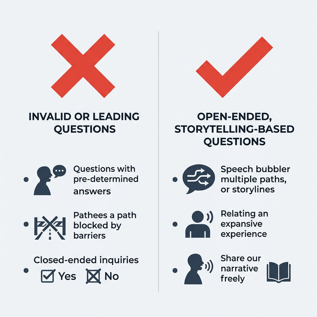
> **Scene**: 左右对比提问方式，左侧是大红叉，右侧是通行绿勾
> **Text**: 别让用户当高高在上的评委，请引诱他们讲出带体温的故事

看屏幕上这组对比。左侧那个巨大的红叉，是所有初级调研员天天在犯的致命错误——他们像法官一样端坐在审判席上，把用户逼成了一个只能举牌打分的沉默评委。而右侧那个绿色的通行勾，代表的是完全相反的权力翻转：不要让他评价，让他叙述。别问他好不好用，问他经历了什么。把话筒递给他，让他成为自己故事里唯一的主角。

> [VISUAL]
> **Slide**: w03-slide-13b
> **Layout**: List
> *   **Asset**: 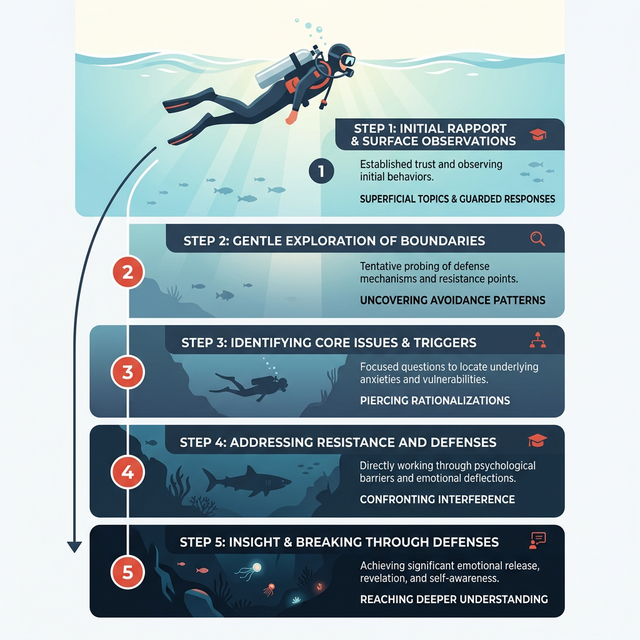
> **Scene**: 潜水员从阳光明媚的浅水区一步步下潜到深不见底的马里亚纳深渊的五步下降图，代表深访的五个渐进剥除心理防御的阶段
> **List**: 1. 破冰 (Ice-breaking) | 2. 探寻 (Exploration) | 3. 剥洋葱 (Deep-dive) | 4. 还原 (Reconstruction) | 5. 收拢 (Wrap-up)

那么，既然不能问未来，一场正确且杀气腾腾的高质量深度访谈，应该怎么层层推进？我们在长期的行业血战中，总结了一套犹如手术刀般精准的**深访五步法**。它不是去问问题，它就像一次对用户顽固心理防御机制的、极其克制的逐步渗透与瓦解。

**(Pause: 3s)**

**第一步：破冰（Ice-breaking）**。
记住我说的，访谈的前三分钟，绝不允许谈论你们的那个破产品。一个字都别提。
你要谈今天的雷阵雨天气、谈他带来的那只极其可爱的金毛狗、甚至谈他外套上印着的某个小众摇滚乐队 Logo。为什么要做这种看似极其浪费时间的废话？
因为当一个对你来说完全陌生的个体坐到你这个"官方调查人员"面前时，他脑子里的"社会自我防御机制"是全部闪着红灯、最高战备开启的。他处于一种极度耗能的"系统 2（慢思考）"的防备状态，随时准备应对一次你对他的智商或者习惯的粗暴考察。破冰的唯一目的，是用与利益无关的日常闲聊，让他紧绷的背部肌肉放松靠在椅背上，卸下防弹盔甲，骗他切回到漫不经心、会说漏嘴的"系统 1"聊天模式。

**第二步：探寻（Exploration）**。
防御卸下后，开始切入。但切记，用极其开放的、不带任何道德或倾向预设的宽泛问题投石问路。
❌ 毁灭式的问法："张先生，您觉得某某竞品打车软件好用吗？"（这是封闭式问题，你用"好坏"这个词强行设置了议程，他只能像机器人一样选择答好或不好）
✅ 收割式的问法："张先生，您能跟我仔细描述一下，上周三下那场大暴雨导致全城瘫痪的时候，您在 CBD 是怎么想尽办法挣扎回家的吗？"（你直接把时空拉回了一个极具戏剧冲突的开放场景，强制他重播一整段充满鲜活情绪录像）

**第三步：剥洋葱（Deep-dive）——这是决定访谈生死存亡的最核心环节**。
在这里，你的身份从引导者变成了一头极其贪婪的食肉动物。我们要动用日本丰田汽车创始人丰田佐吉在工业流水线上发明的终极武器：**连续追问 5 个 Why (5 Whys)**。
当用户在回答中，漫不经心地抛出一个表象的抱怨节点时，绝不要像个文员一样满意地停下笔做记录。我们要像一只嗅到了血腥味的疯狗一样死死咬住它，毫不留情地连续、递进地问五次为什么，一层一层撕下虚伪的表皮，直到扯出那根最底层、甚至让用户感到战栗的心理动机神经。

> [VISUAL]
> **Slide**: w03-slide-14
> **Layout**: Diagram
> *   **Asset**: 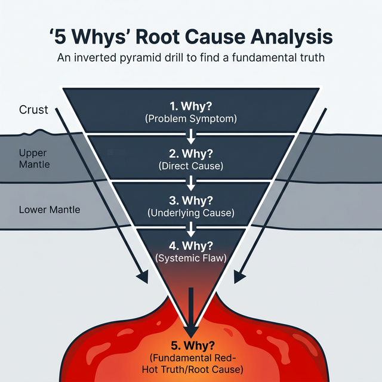
> **Scene**: 一个由表象尖端不断向下突破硬土层、深挖到地心岩浆的倒金字塔图例。每一次看似完美的回答，都是下一次无情"Why"的起跳点，直到触及红色的沸腾底层
> **Text**: 丰田 5-Why：榨干浮浅动机的致命剥洋葱法

让我用一个血淋淋的案例，向你们演示什么叫教科书级的剥洋葱。

> [CASE STUDY: 5-Whys 榨干网盘伪需求的底层恐惧]
> 假设我们在为一家独角兽企业调研他们正在开发的下一代企业级网盘工具。在一个昂贵的写字楼里，受访的资深设计师极度暴躁地向你抱怨：
> "你们的网盘上传进度条简直像蜗牛一样，每天传文件慢得我要崩溃了！" 
> 这是一个典型的大型表象需求，我们通常叫它"更快的马"。如果坐在这里的是一个初级产品助理，他会马上激动地在笔记本上写下：急需大幅增加 IDC 机房带宽资源，高优优化 P2P 多线程上传底层算法。然后满载而归。
> 
> 但如果坐在这里的是一个深谙人性的洞察高手，杀戮才刚刚开始：
> 🎙️ 致命第一问（锁定场景）："所以你究竟是在上传什么极其特殊的文件时，觉得这个速度慢到让你在工位上生理性地无法忍受？"
> 🗣️ 答："哦，不是普通文档。每次我给最挑剔的甲方客户，发几百兆甚至上 G 的 PSD 设计源文件预览时，最让我抓狂。"
> 🎙️ 继续撕扯第二问（砍断常规动作）："等等，只是为了看个视觉效果，你为什么要用笨重的网盘传体积如此巨大的源文件给客户？"
> 🗣️ 答："因为那个该死的客户是个细节控，他非要用肉眼放大看每一个边缘的修改细节。我如果直接截图发微信，经过微信服务器的恶心压缩，像素全都糊掉了，他会痛骂我不专业。"
> 🎙️ 匕首逼近第三问（识别真正动机）："我明白了。其实你真正的目的只是想让他看清高清细节。既然如此，如果有的选的话，你为什么非要把你吃吃饭的家伙——最核心的、含着所有分层通道的源文件，毫无保留地发给他呢？"
> 🗣️ 答："（语塞了一下），废话，因为目前地球上没有其他简单便宜的办法，能让他在那个不懂任何专业软件的电脑上，不用安装几个G的臃肿盗版软件，也能顺滑地查看毫无压缩的高清大图啊。"
> 🎙️ 图穷匕见第四问（构造幻想降维解法）："那如果现在有一种黑科技魔法，能让他收到一个极其轻量的网页链接，直接在普通浏览器里点开就能丝滑缩放看你的超清无损版本，甚至还能直接用鼠标在上面画红圈批注呢？"
> 🗣️ 惊恐与狂喜第五答："天神下凡！那简直太好了！你们知道吗，我他妈的其实在潜意识里**根本就一万个不想把那个没付尾款的宝贵源文件发给那个满嘴跑火车的蠢客户**，我天天晚上做梦都在害怕他直接拿着我的高精度原稿去淘宝上找便宜大学生套模板盗用！发源文件是我在这个操蛋流程里被迫做的最恶心的妥协！"
> 
> 全场死寂。各位看清楚发生了什么吗？！

> [VISUAL]
> **Slide**: w03-slide-14b
> **Layout**: Image
> *   **Asset**: assets/slides/w03-slide-14b.png
> **Scene**: 冰山的表面被暴力击碎，表层的"上传速度慢"碎裂成粉末，暴露出深海最底层发着红光的隐秘恐惧："源文件主权"
> **Text**: 这不是单纯的体验 Bug，这是深层生存恐惧

> 通过这极其暴力的连续剥洋葱，我们像剥皮一样发现，用户那个导致他愤怒摔鼠标的核心痛点，**根本他妈的不是那个什么见鬼的"你们系统上传速度慢"**！
> 他最底层、最滴血、最不可告人的隐秘痛点，**是"在全行业缺乏一种既能极高保真展示细节，又能在这场信任博弈中物理级誓死捍卫创作者源文件绝对主权的跨机构轻量交付方案"**。
> 如果刚才那个初级产品经理真的拿到了十倍巨额预算，傻乎乎地去耗费一年时间优化光纤上传带宽，把速度提升了一百倍。他其实是在什么？他其实是在加速、在极致丝滑地助长这名设计师内心深处那份"随时害怕核心机密源文件被剽窃盗用"的最大职场恐惧！速度越快，流失越快。
> 最终，正是同类深邃到骨髓的洞察，砸碎了硬盘传输的旧世界，在硅谷催生了 Figma 这种主打"基于全浏览器链接实时渲染协作，绝不泄露哪怕一比特本地源文件给未授权终端"的跨时代神级独角兽。

> [VISUAL]
> **Slide**: w03-slide-15
> **Layout**: Flow
> *   **Asset**: 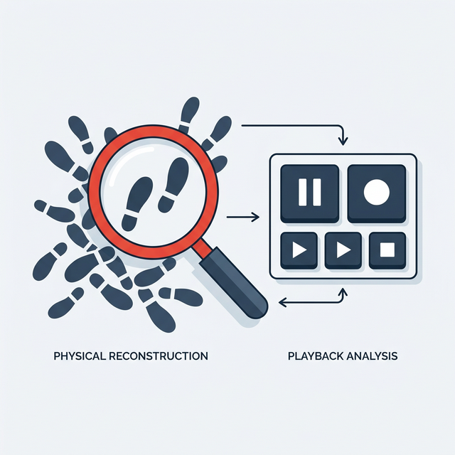
> **Scene**: 错综复杂的混乱脚印上放置着巨大的放大镜，旁边是一个暂停的录像机按钮。象征着案发现场的足迹强制物理重构
> **Text**: 场景重建：让用户在你的面前，把过去的动作重新做一遍

惊心动魄的第三步之后，我们来到**第四步：还原（Reconstruction）**。
这是我们在面对人类记忆被篡改的生理天性时，用来强行对抗"Say-Do Gap"的绝对杀手锏。当受访用户在第三步开始为了面子胡编乱造、或者真的因为时间久远而记不清具体细节，只能用模糊的废话搪塞你时。你立刻打断他，祭出这句充满力量感的话：
**"张先生我们先别说了。既然就在你手里，你能不能现在，就当着我的面，把你昨晚操作被卡住的过程，原封不动地重新给我点一遍？"**
这在专业的定性调研界，叫"关键事件追溯（Critical Incident Technique）"。让用户掏出他布满指纹的手机，让他重新滑动把那个极其隐蔽的页面点开，让他向你真人演示他当时是怎么因为一个弹窗而彻底卡死的。
永远记住，人类用来描述的语义记忆是不可靠的、被过度加工的面团，但当他们亲自重新接触到那个触发过心智摩擦的真实物理屏幕环境时，他们手指的**肌肉记忆**，会以一种惊人的诚实，把他们当时最下意识的愤怒、最困惑的卡顿停留、和无奈点击叉号的绝望妥协，一秒不差地原封不动重播给你看。就在他眉头再次因为找不到返回键而下意识皱起的那一零点一秒，你会抓到全场最致命的洞察。

最后，**第五步：收拢（Wrap-up）**。
经过前面像过山车一样的极度压榨，访谈即将结束，这时候双方的精神能量已经被消耗得非常疲惫。作为缓解气氛的致谢，你可以身体向后倾，抛出最后一个俗套但极其管用的"魔术棒测试"："张先生非常感谢您的坦诚，我们聊了这么多。现在，如果上帝或者哆啦A梦就在这里，给你一根没有边际的魔术棒，可以瞬间改变这个产品上的某个绝望的地方，不用考虑任何我们可笑的技术限制或成本，你会指向哪里？"
你要知道，抛出这个问题，根本就不是为了老老实实地回公司照着他的方案去做开发，而是为了在这场漫长精神审讯的最后关头，用这种极度释放压力的天马行空，测出他内心深处那座压抑已久的休眠火山，其**最渴望喷发的那个温度核心**究竟在哪。

**(Pause: 3s)**

> [ACTIVITY: 死亡提问极速诊断室]
> **Type**: `Practice`
> **Duration**: `5min`
> **Desc**: 快速甄别诱导性提问
> `操作`：请全场看大屏幕，屏幕上会依次打出三个在企业实战中极度真实、看似没有任何毛病的初级调研问题。我要求全场的各组学生代表，在 10 秒倒计时内，像找茬一样站起来大声指出其违反了定性调研的哪条致命红线。
> 问题 1："您平时使用我们 App 的功能频率高吗？您当时觉得这个最新体验到底如何？" 
> （**抢答痛批：高危复合错误！这是封闭词根+两个庞大问题荒谬合并。什么叫高？大一学生一天一次叫高，还是网约车司机一小时一次才叫高？"体验如何"这种极其抽象的词汇，是在逼迫用户做出一篇宏大的文学评论，没有任何可执行价值。**）
> 问题 2（经典找死）："如果我们在接下来的大规模改版中，把这个底部的提交按钮变成显眼的红色，并且放大两倍字体，您觉得您在紧急情况下会更容易点击它吗？" 
> （**抢答痛批：这是要求人类预测未来的狂妄，叠加强烈的视觉心理幸存者偏差诱导。任何人都会对这种假设性的免费视觉增强说'会'，毫无任何事实基石。**）
> 问题 3（潜意识绑架）："监控显示您上周五在这个购物结算页面停留了整整 5 分钟最后却狠心关闭了没有购买，是因为当时觉得那个附加服务费的价格太贵了超出了预算，对吗？" 
> （**抢答痛批：极度恶劣的影响司法公正！这个产品经理提前把自己对价格的软弱预设，像植入盗梦空间一样强行塞进了用户的嘴里，彻底用"对吗"这两个字，残忍剥夺了用户开口说出"因为页面上的选择银行卡控件在 iOS15 上一直鬼畜抖动根本点不中"这个真实荒谬物理原因的宝贵机会！**）

这就是定性调研血肉横飞的真实战场。不要发一万份冰冷的量化问卷来粉饰太平，而是勇敢地用手术刀剖开十个活生生、充满缺陷的个体。

但是，大家深吸一口气，这还远远不是终点。
哪怕你完美执行了民族志观察和 5-Why 剥洋葱，你手里拿到的，依然只是一堆沾满血污和现实泥土的"孤立现象"——无论那是用户抱怨上传太慢的哀嚎，还是护士在 Pad 黑背景上生硬贴下的九宫格密码纸。
这些零散的现象本身，在商业产品架构的图纸上，是毫无直接执行价值的，它们只是未经冶炼、长满杂质的原始矿石。

> [VISUAL]
> **Slide**: w03-slide-15b
> **Layout**: Split
> *   **Asset**: 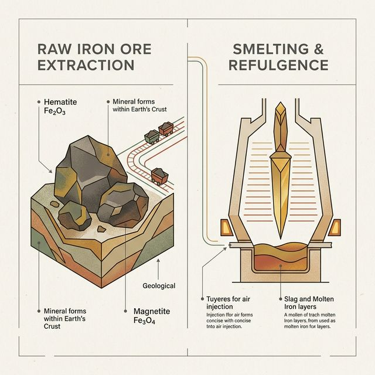
> **Scene**: 左侧是刚刚搜集回来的一堆沾满泥土、粗糙的原矿石；右侧是经过高温反应炉冶炼后，流出极其纯净锋利的金色锋刃
> **Text**: 洞察只是矿石，经冶炼方能杀敌

接下来，我要极其庄重地交给你们，几乎是这门大学课上前三昂贵的一套世界级商业思想框架。
它拥有魔法般的力量，能在一秒钟的高速运转内，把你们桌面上这些满地乱滚、令人摸不到头脑的生铁矿，瞬间放进高温的认知反应炉，冶炼成可以精准刺穿商业市场隐秘喉咙的纯金利剑。

这把剑的名字，叫 **Jobs-to-be-Done (JTBD) 断点分离框架**。
