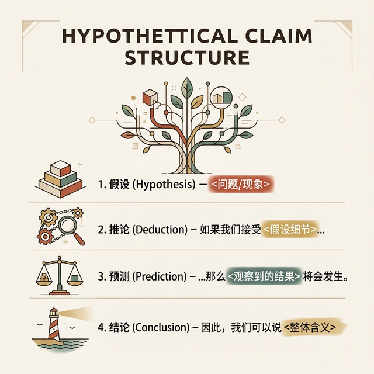
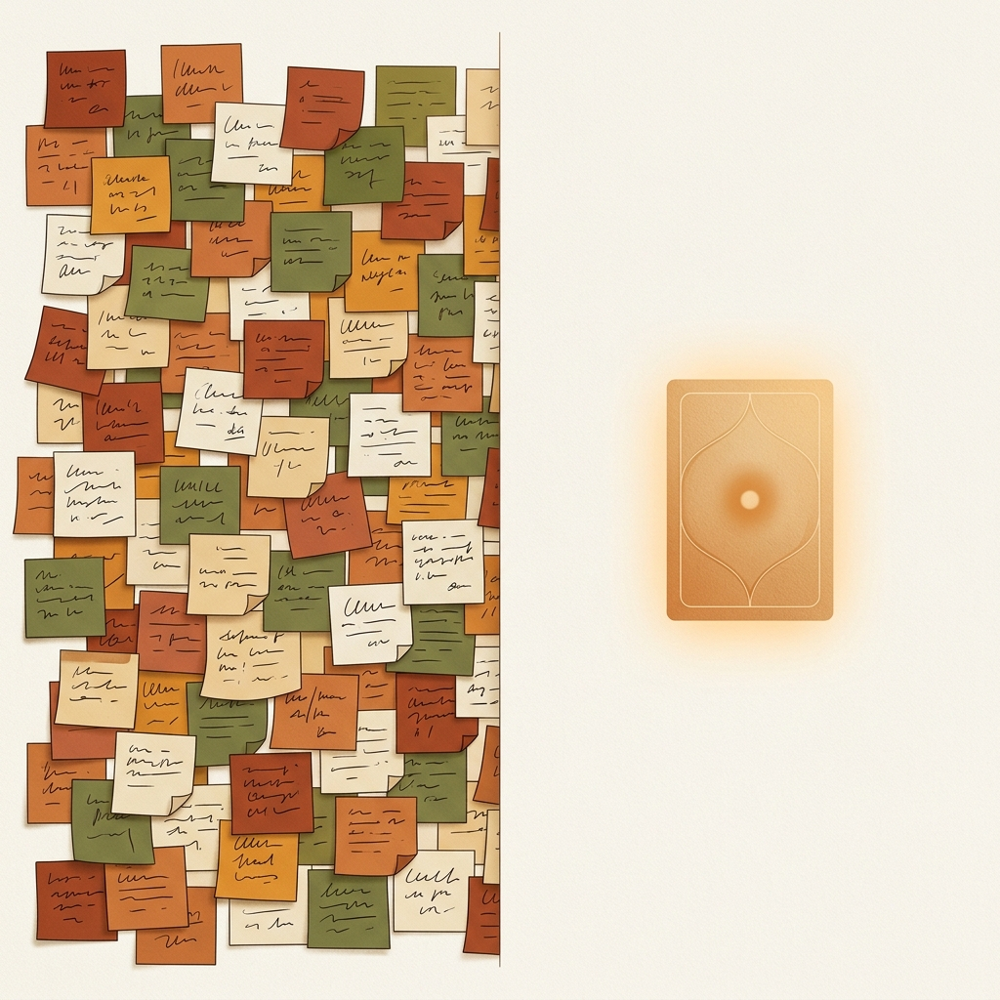
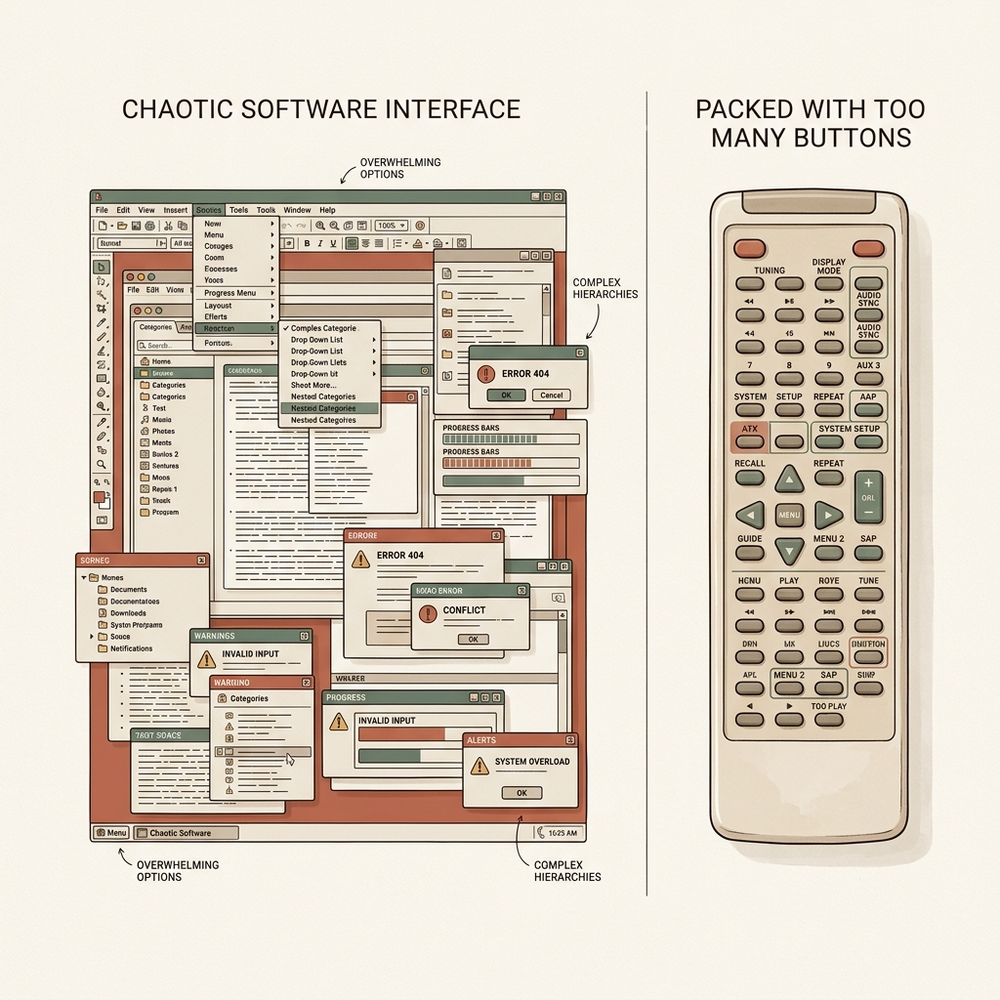
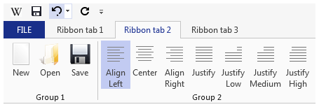
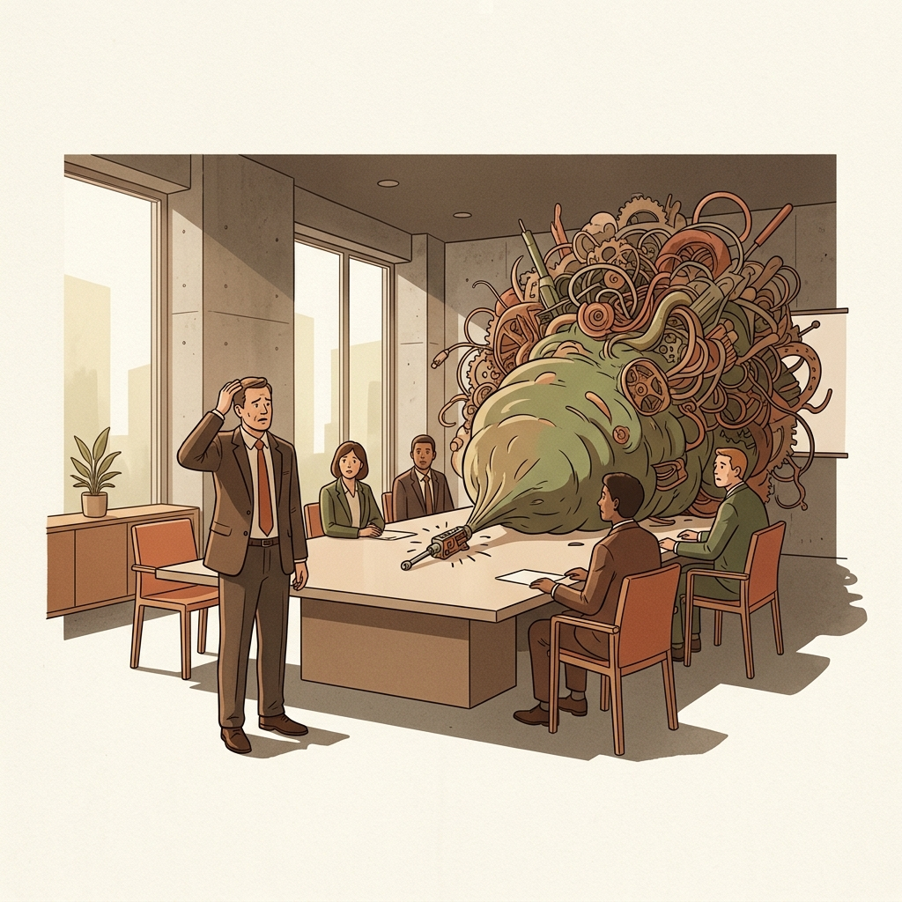
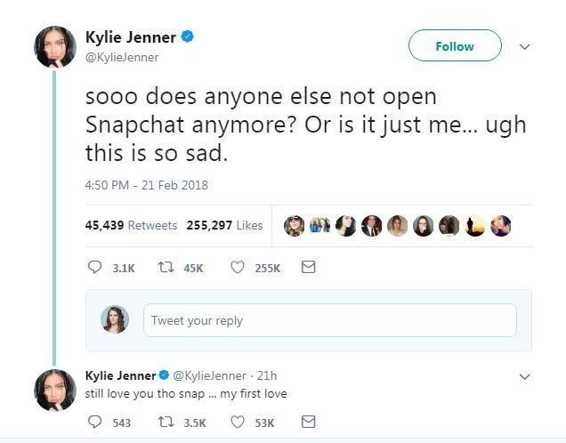
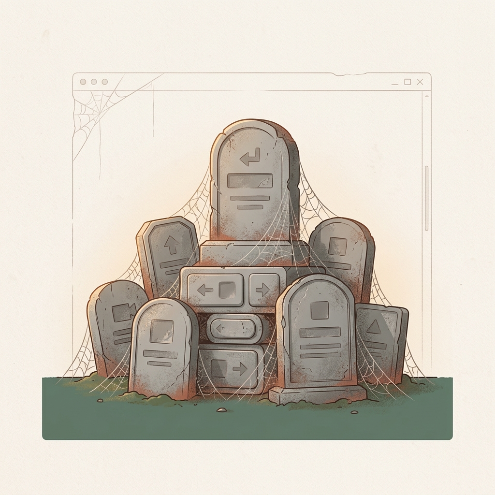
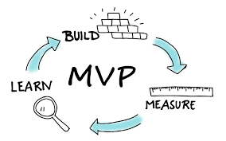
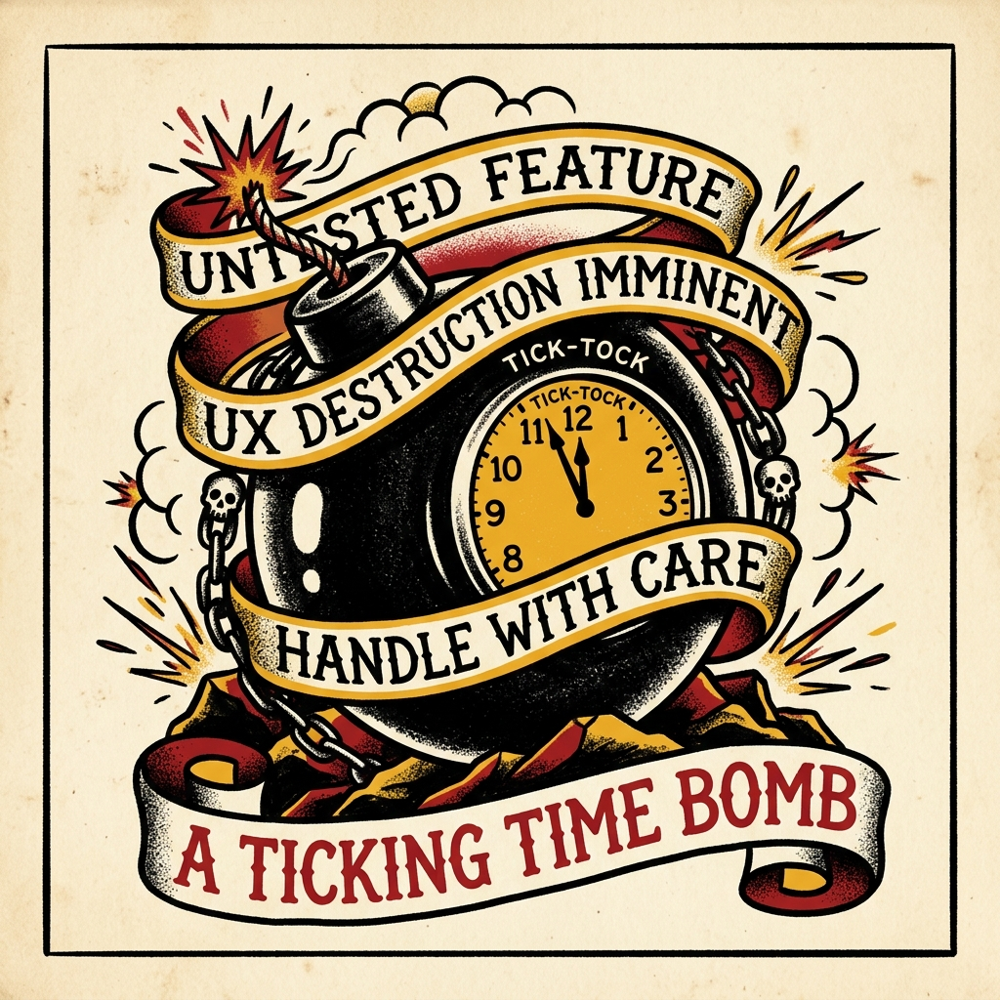

# W04 假设驱动与 MVP 构建: 用最小成本验证最大风险

> **本节目标**
> 掌握从模糊洞察到可验证假设的转化方法，理解 Proto-Persona、假设模板和假设优先级矩阵；认识 MVP 的本质——它不是"阉割版产品"，而是"学习工具"；学会根据风险等级选择正确的原型保真度。本节是 实践项目1 的收官课，学生将完成调研数据汇报，并输出互动应用的最小可行性清单。

*Tags*: `[THEORY]` `[LEAN UX]` `[CASE STUDY]` `[ACTIVITY]`

<!-- MATERIAL_BUDGET: {M1: 100%, M2: 100%, M3: 100%, M4: 100%, M5: 100%} -->

> [!NOTE] 核心理论支撑 (Core Theory Matrix)
> 本讲教案底层认知模型强映射于《Lean UX》与精益创业方法论：
> * **[lean-ux-ch05-06-business]** Lean UX 画布起点：商业痛点界定与预期产出
> * **[lean-ux-ch07-proto-persona]** Proto-Persona 解构：抛弃人口统计学的行为特征建模
> * **[lean-ux-ch10-hypotheses]** 假设优先级矩阵 (HPC)：极坐标系下的双轴风险评估体系
> * **[lean-ux-ch12-mvp]** MVP 光谱定义：真相曲线与四种核心降维探测术

---

## 复习：W03 JTBD 痛点回顾 (约 15 分钟)

### 田野重构：穿透 Say-Do 提取真实痛点

> [VISUAL]
> **Slide**: W04-01-JTBD-Review
> **Layout**: `Split`
> **Scene**: 左侧显示一堆杂乱的便利贴（用户的无序抱怨），右侧显示一个结构化的 JTBD 画布与三段式痛点陈述。
> **List**:
> - 实地观察
> - 探针深挖
> - 聚焦行为
> **Text**: 观察胜于聆听 / 洞穿 Say-Do Gap
> **Asset**: 

欢迎回到《交互产品开发》的课堂。上周，你们像数字时代的侦探一样潜入校园的各个角落，完成了一次真实的**JTBD (Jobs To Be Done) 微访谈**。在此之前，我们先做一个简短的共识复盘。

还记得我们上周反复强调的那条田野调查铁律吗？**永远不要只听用户说了什么，要去观察他们做了什么。** 我们上节课提到了 "Say-Do Gap"（言行鸿沟）。大家可以回想一下身边一个极为常见的现象：健身房年卡。当你去采访一个刚办完健身卡的人，问他有什么期待，他大概率会满怀激情地告诉你：“这个健身房器材很全、洗浴条件很好，我计划每周来三次，练出腹肌。”这是他在理想状态下对你做出的"合理化陈述"（Say）。

但这如果你调取他在门禁系统里的签到数据，真实情况是什么？由于天气冷、加班累、看剧爽等各种真实世界的阻力，他的**实际出勤率**可能不到每月两次（Do）。

> [VISUAL]
> **Slide**: W04-01b-Say-Do-Gap
> **Layout**: Split
> **Scene**: 左侧是健身卡销售时满怀激情的誓言（Say），右侧是下班后在沙发上瘫倒的真实用户（Do），以幽默夸张的方式对比言行鸿沟。
> **Text**: 言行鸿沟 (Say-Do Gap)
> **Asset**: 

如果我们作为一个软件设计团队，仅仅基于访谈里那个**虚幻的理想用户**去设计一套复杂的四次大循环健身打卡激励系统，最终一定无人问津。因为你设计的对象是一个只存在于幻觉中的自律完人，而不是那个下班后在沙发上瘫倒的血肉之躯。

> [VISUAL]
> **Slide**: W04-01-Philosophy-Map
> **Layout**: Image
> **Scene**: 概念性社论插图，画布被一分为二。左侧是一张带有简单网格线的粗糙纸质抽象地图；右侧则是复杂、丰富的三维真实地形。用强烈的对比张力表达“地图不等于疆域”的隐喻。
> **Text**: 哲学视角 / 地图不等于疆域
> **Asset**: 

> [PHILOSOPHY]
> **地图不等于疆域 (The Map is Not the Territory)**
> 这是一个在设计界非常有用的思维隐喻。用户嘴上讲出的抱怨和需求，就像是一张粗糙的“地图”，它只是对问题的表面描绘；而他们实际的潜意识动机和真实行为，才是那片复杂的三维“疆域”。作为交互设计师，如果你把“地图”当成了真实的世界，你就会画出完全错误的航线。

这就是为什么优秀的交互设计师从来不问“你想要什么功能？”，而是用**探针 (Probe)** 去观察真实行为。我们试图理解的，不是他们想要一把更快的钻头，而是他们墙上缺一个怎样的洞。

> [VISUAL]
> **Slide**: W04-01c-JTBD-Deep-Dive
> **Layout**: Diagram
> **Scene**: 隐喻性图表——表层（海面/冰面上方）标有“SAY（言辞需求）”，深层（沉入深海的部分）标有“DO（真实动机与行为）”（冰山模型）。
> **Text**: 冰山之下的真实动机
> **Asset**: 
> **Source**: AI Generated

正如屏幕上这座冰山所展示的，冰山之上是用户喧哗的欲求与抱怨，**冰山之下是他们沉默的动机与恐惧**。只有当定性调研锋利如刀，刺穿了用户的“Say（语言陈述）”，抵达了他们的“Do（潜意识行为动机）”，我们后续的假设验证才具备生长的土壤。否则，任何建立在虚假痛点上的精美产品，都只是在完美地执行一个错误的策略。这也是我们在进入问题陈述之前的必经之路。

> [ACTIVITY]
> *   **Type**: `Quiz`
> *   **Duration**: `3min`
> *   **Desc**: 快测：挖掘定性研究的“隐藏宝藏”
> *   **Q**: 在针对“校园座位预约系统”的 JTBD 访谈中，一位同学抱怨：“界面太难用了，我每天早上 6:55 就得把手机、平板和电脑全摆在桌上，提前在所有设备上点开 8 层菜单，卡在最后一步的页面一动不敢动。生怕手滑退出去，到 7 点只能三个设备一起狂点确认”。面对这个预期外的反馈，作为交互设计师，你提炼出的核心“设计目标”应当是？
> *   **Options**: A. 增加“防误触锁定”功能，让用户安心停在最后一步页面。 | B. 限制 7 点前不允许进入最后一步页面，保证对所有学生绝对公平。 | C. 缩短操作链路，将原本 8 步的流程压降到 3 步以内，让用户不再对“退回首页重新走流程太费时”感到恐慌。 | D. 优化 UI 视觉，让这 8 层菜单看起来更清晰、现代。
> *   **Answer**: `C`
> *   **Explain**: 用户被逼得"多设备提前卡在最后一步页面不敢动"，这是一种典型的"补偿行为"（Do）——用物理上的多端死等来对抗极其冗长的操作链路。他们说"界面难用"或害怕误触，只是表层的情绪宣泄（Say）。因为一旦手滑退回首页，重新走完 8 层菜单的时间成本极高，这才是导致"效率恐慌"的真正病因。真正的设计目标是缩短链路消除这种恐慌（治本），而不是加个防误触锁（治标）。大家回想一下上节课学过的 **JTBD 三维剥离**：这位同学抱怨的"界面难用"，只是最表层的**功能任务**受阻——系统在物理操作层面不好使。但她清晨 6:55 三台设备并排死等的恐慌本质，是一种深层的**情感任务**——害怕失去学习空间导致考研失败的焦虑。如果你当时用 **5-Whys** 继续追问她"抢不到座位之后你会怎么办？"，你很可能会发现，她真正恐惧的根本不是"操作慢"，而是"我无法向父母证明我在认真准备考研"——这就触及了**社会任务**。记住这三个维度的名字，今天写 Proto-Persona 时你们会直接用到。

> [VISUAL]
> **Slide**: W04-01d-Compensatory-Behavior
> **Layout**: Image
> **Scene**: 昏暗的桌面上同时摆着手机、平板和电脑等多个设备，屏幕全部提前卡在了一个有着极深导航面包屑（如：首页>三教>4楼>042座）的最终预约页面。用户正僵硬地准备在整点到来时，同时狂按所有设备上的“确认”按钮。隐喻为了对抗冗长链路，用户被迫做出的极端补偿行为。
> **Text**: 补偿行为：冗长链路导致的“效率恐慌”
> **Asset**: 

正如这道题所揭示的，这其实是一个典型的定性研究宝藏！受访者的这种“多设备提前卡页面”的极端行为说明，“怕误触”或“繁琐”只是表层的情绪宣泄，真正的底层痛点是**操作链路过长带来的效率恐慌**。

如果只听从表面抱怨去给系统换个好看的皮，而不解决抢座流程需要点 8 次菜单的深层麻烦，你们就是在制造一场金玉其外的设计灾难。

### 问题对焦：将抱怨转化为量化陈述

> [VISUAL]
> **Slide**: W04-02-Problem-Statement-Check
> **Layout**: Comparison
> **Scene**: 展示几组对比，左侧是错误问题陈述（“给系统换个皮”），右侧是聚焦行为改变的陈述（“如何缩短操作链路将成功率提升 40%”）。
> **List**:
> - 拒绝空洞
> - 量化指标
> **Text**: 量化陈述 / 拒绝空洞的“换皮”
> **Asset**: 

所以，这也是为什么在我们将调研结论推进到设计环节前，要求大家把这些零散的故事锻压成一句**结构化的业务问题陈述**。不要用“打造更直观的 UI”这种空洞的形容词堆砌。要严格量化——比如，“我们如何将座位系统中从登录到完成预约的平均时长，从原来的 65 秒缩短到 15 秒之内？”当你写下这句带有量化指标的陈述时，你的设计评估基准才真正具备了客观可测的标尺。所有不能被度量的事情，都不能被打磨。

### 陈述共识：工作坊的三段推演与标准模板

> [VISUAL]
> **Slide**: W04-02b-Workshop-Templates
> **Layout**: List
> **Scene**: 概念化展示一个设计工作坊。背景是散落的代表“混乱思绪”的卡片和符号，前景中涌现出三张结构严谨的模板卡片，寓意从混乱中提炼标准共识。
> **List**:
> - 拉齐背景
> - 分组起草
> - 整合共识
> **Text**: 共识工作坊 / 三步推演流程
> **Asset**: 

要把主观的抱怨转化为精准的量化陈述，不能靠产品经理一个人拍脑袋。我们需要通过一个简短的**团队工作坊 (Workshop)** 来收敛共识：
1. **提供上下文**：由产品经理为全组拉齐业务背景与痛点。
2. **分组起草**：团队分为 2-3 人小组，用 30 分钟独立完成第一版草案。
3. **整合陈述**：各组分享并合并为全队同意的统一版本。

> [VISUAL]
> **Slide**: W04-02b-Hypothesis-Templates
> **Layout**: Comparison
> **Scene**: 极简风格的排版设计。左右并排展示两张如同实验处方笺一样的填空卡片，充满严谨的格式感。左卡片代表“改进现有”，右卡片代表“全新探索”，重点在于清晰地映衬出卡片上严密的填空公式结构。
> **Keywords**: Prescription cards, Standard templates, Blank fields
> **Text**: 业务问题陈述：两套标准模板
> **List**: 
> - **模板 A（现有产品改进）**: [我们的产品] 最初是为了实现 [商业目标] 而设计的。我们观察到未能实现目标，导致了 [负面业务影响]。我们该如何改进？成功将通过 [用户行为的可衡量变化] 来判定。
> - **模板 B（全新产品/项目）**: 目前 [我们工作的领域] 的现状集中在 [受众与痛点]。现有市场未能解决 [某种差距]。我们的产品将通过 [核心策略] 解决它。当看到 [可衡量的行为变化] 时，我们就成功了。
> **Asset**: 

在这个过程中，我们可以直接套用 Lean UX 提供的两套标准陈述模板——**就如大屏幕上这两张处方笺所显示的这样**。

不论你是要优化一个现有的老系统（套用模板A），还是要平地起高楼做一个全新的项目（套用模板B），你们收集到的成百上千条用户抱怨，最终都必须被严丝合缝地填进这些方括号里。特别是最后那句“可衡量的行为变化”，这是你们绝不能含糊的生死线。

> [VISUAL]
> **Slide**: W04-02c-Cruel-Subtraction
> **Layout**: Image
> *   **Asset**: 
> **Scene**: 一把雕塑刻刀正在从一块杂乱无章的巨石中精准剔除多余的碎片，暴露出内部如刀锋般锐利、散发着赤土红光芒的纯粹核心。展现出从繁杂中提炼本质的“残酷减法”带来的心理张力与绝对清晰感。
> **Text**: 残酷的减法

> [TEACHING MOMENT]
> 很多同学在这个环节容易有一种失落感。你们在访谈中收集了几万字的逐字稿，听了无数悲惨的抱怨，最后只能提炼出这么干巴巴的、不到 100 字的问题陈述。你们会问：“老师，是不是太亏了？”这绝不叫亏。**所有伟大的产品构想，最初都是在做极其残酷的减法。** 削掉那些琐碎的细枝末节，正是为了让那唯一致命的底层矛盾，如刀刃般锋利地显露出来。

> [VISUAL]
> **Slide**: W04-02d-Subtraction-Value
> **Layout**: Split
> **Scene**: 左侧展示满墙密密麻麻、让人眼花缭乱的杂乱痛点便利贴；右侧则只剩下一张发光的卡片，上面印着一句被高度提炼的量化陈述，寓意“少即是多”。
> **Text**: 从 1000 句抱怨到 1 句核心陈述
> **Asset**: 

在进入下一个话题前，我们用一个实战场景来检验一下大家对问题陈述模板的掌握程度。

> [ACTIVITY]
> *   **Type**: `Quiz`
> *   **Duration**: `3min`
> *   **Desc**: 案例应用：评估 Lean UX 问题陈述
> *   **Q**: 某团队开发了一款帮助大学生记录日常开销的 App“财金账本”。他们发现下载量虽高，但用户往往在一周后流失。产品经理决定重构问题陈述以指引后续设计。按照 Lean UX 模板法则，以下哪个陈述最能聚焦于验证并解决真实业务痛点？
> *   **Options**: A. 财金账本最初是为帮大学生记账而设计的，但流失率极高。我们该如何优化 UI，使界面更好看从而吸引用户留下？ | B. 财金账本最初是为帮大学生记账而设计的。我们观察到记账操作繁琐导致一周后流失。我们该如何缩短记账链路？这种成功将通过“第二周留存率提升 30%”来判定。 | C. 大学生普遍缺乏理财意识，我们的产品将通过强制每天弹窗提醒的方式，培养他们良好的每日记账习惯。 | D. 我们需要为大学生开发一个带有自动图像识别小票功能的全新记账系统，以解决记账太累的问题。
> *   **Answer**: `B`
> *   **Explain**: 选项 B 严格遵循了模板 A 的逻辑——明确了原定目标、观察到的失败现状、具体的改进方向，且最关键的是，使用了“用户行为的可衡量变化（留存率提升 30%）”作为设计成功的判定标尺。选项 A 缺乏可衡量的行为指标（换皮假把式）；选项 C 强加伪需求；选项 D 直接跳向未经假设验证的解决方案（功能堆砌）。

## 导入：功能臃肿的困境 (约 10 分钟)
<!-- BUDGET: 1800 chars | SLIDES: ≥4 | STATUS: done -->

### 臃肿困境：拒绝无验证的功能堆砌

> [VISUAL]
> **Slide**: W04-03-Feature-Bloat
> **Layout**: Split
> **Scene**: 屏幕左侧是一个让每个大学生都头皮发麻的高校教务选课系统：布满数以百计不知所云的文字链接、层层嵌套的下拉菜单和随时会弹出的警告框；右侧放着老式电视遥控器，上面密密麻麻全是几乎没见过的按键。
> **Text**: 功能臃肿 (Feature Bloat) 的瘟疫
> **Asset**: 

在基于刚才我们的问题陈述、进入用户画像和假设推演之前，让我们先来正视一个在数字产品世界里瘟疫般蔓延的癌症级现象——**Feature Bloat**，也就是功能臃肿。

大家请回想一下，每次到了选课季，你们登录学校教务系统时的感受。几百个不知道什么意思的字段、永远找不到入口的跨院系选修列表、不知道点了会不会报错的灰色按钮交织在一起。大家请看大屏幕左侧，这种典型的“反人类”界面，就是一个导致使用者瞬间看懵了、不敢乱点（决策瘫痪）的认知生化武器。

这不仅仅是美观问题，更是反认知常理的。为什么软件最终会变成这样？难道这些系统的工程师生来就喜欢折磨人？

### 数据穿透：遥测揭示残酷使用真相

> [VISUAL]
> **Slide**: W04-03b-Office-Telemetry
> **Layout**: Split
> **Scene**: 展示 Office Ribbon 改进前的遥测热力图，揭示 80/20 法则的残酷数据。
> **Text**: 80/20 法则与伪需求绑架
> *   **Asset**: 
> **Source**: [Squarespace](https://images.squarespace-cdn.com/content/v1/6008fbe89c2d8f3e5162a344/1611353301012-UDASX3TUV853M55N4CPP/Microsoft+Excel+with+charts+and+colorful+tables)

> [CASE STUDY]
> **"军备竞赛"带来的灾难与 Office 的反思**
> 上世纪 90 年代，微软开发 Office 时陷入了“功能军备竞赛”的错觉：一旦对手增加新功能，他们就会陷入恐慌式跟进，将极其生僻的功能全部塞进顶部工具栏。结局就是早期的 Word 拥有迷宫般致命的嵌套菜单。直到通过海量的遥测日志，他们才发现让行业汗颜的真相：**80% 的用户仅仅使用了 20% 的功能**。那些耗费无数深夜开发出的 80% 的“长尾功能”，不仅没有任何实际价值，反而像垃圾一样干扰了核心用户。这就是典型的被少数“刺头”用户和伪需求绑架的后果。

微软最终是怎么扭转这场灾难的？2007 年，Office 团队的 Jensen Harris 主导了一次堪称教科书级的变革实验。他的团队没有召开高管会议拍脑袋决定"下一版该长什么样"，而是做了一件极其低调但震撼业界的事情：**用遥测日志给每一个按钮画了一张热力图。** 几亿次用户的真实点击数据清晰地显示，不到 30 个命令占据了绝大多数的使用频率。

> [VISUAL]
> **Slide**: W04-03c-Office-Ribbon
> **Layout**: Split
> **Scene**: 屏幕一侧展示新版 Word App（Office Ribbon）的标准界面截图，另一侧以醒目的引言形式展示设计假设的核心句子。
> **Text**: 如果我们将这 30 个高频操作平铺展示，用户的操作效率将提升
> *   **Asset**: 
> **Source**: [Wikimedia](https://upload.wikimedia.org/wikipedia/commons/e/ec/Example_of_a_ribbon_%28user_interface_element%29.png)

于是，那个庞大的嵌套菜单被彻底推翻，取而代之的是如今大家熟悉的**功能区 (Ribbon)**——它把最高频的操作放在最显眼的位置，把罕有人至的冷门功能收进"更多"折叠栏。

这就是典型的避免被少数“刺头”用户和伪需求绑架的案例。微软的成功，正是因为他们**通过遥测数据精准地抓住了用户的真实行为（Do）**，击碎了内部拍脑袋的“伪需求”。只有基于这些真实的行为基石，团队才能提出科学的**设计假设**（“如果我们将这 30 个高频操作平铺展示，用户的操作效率将提升”），并进行后续的验证。这就引出了我们今天的主题：不是凭直觉猜，而是用真实的数据逼出真相，再用假设去驱动开发。

> [VISUAL]
> **Slide**: W04-04-Blind-Development
> **Layout**: Full
> **Scene**: 昏暗沉闷的会议室里，一位领导正在用力“拍脑袋”做决策。随着他拍脑袋的动作，桌面上一个原本小巧的工具/界面像充气一样疯狂膨胀，被硬生生撑成了一个臃肿、杂乱、毫无重点的“巨无霸”怪物。
> **Keywords**: 会议室, 领导, 拍脑袋, 膨胀, 巨无霸怪物
> **Text**: 未经验证的灾难
> **Asset**: 

但并非所有开发团队都能像微软这样果断割肉。这种功能臃肿现象的深层心理机制，本质上是管理层一种**“宁可做错，不能错过”的恐慌蔓延**。每一个没人用的僵尸功能，最初诞生的时候都是在某个沉闷的会议室里，因为某个负责人一句听起来很有道理的话——"我觉得用户很有可能需要这个……"或者"万一有极个别用户问起来我们不支持怎么办？加上吧，反正程序员写代码很快！"——就这样被拍脑袋强行塞进了系统里。

当会议室里有七八个不同部门的人都在争夺话语权时，最终开发出来的系统根本不是给用户用的产品，而是一份**“谁也不得罪的内部妥协备忘录”**——大家把所有的点子胡乱堆砌在一起，硬生生把一个工具撑成了毫无重点的巨无霸。

> [VISUAL]
> **Slide**: W04-04a-Snapchat-Kylie-Tweet
> **Layout**: Image
> **Scene**: 截图展示 Kylie Jenner 的那条引发了 Snap 股价暴跌的毁灭性推文。
> **Text**: 毁灭性的推文代价
> *   **Asset**: 
> **Source**: [WRAL](https://images.wral.com/asset/business/2018/02/22/17364030/media-S090124477-300-DMID1-5dvp40tx3-636x498.jpg)

> [CASE STUDY]
> **Snapchat 2018 年的灾难性改版**
> 2018 年 2 月，Snapchat 在没有充分验证用户假设的情况下，对整个 App 进行了一次激进的大改版——将好友动态和媒体内容混合排列，彻底打乱了用户多年形成的操作心智模型。结果？**超过 125 万用户联署请愿要求撤回改版**。更致命的是，超级网红 Kylie Jenner 在推特上写了一句"有人还在用 Snapchat 吗？还是只有我觉得它已经不行了？"——这条短短 25 个单词的推文，直接导致 Snapchat 母公司 Snap Inc. 股价蒸发约 **13 亿美元**。一个没有经过假设验证就强推上线的决定，仅用一天时间就把一家上市公司推向了悬崖边缘。

### 验证缺失：FOMO 驱动的灾难代价

> [VISUAL]
> **Slide**: W04-04b-Code-Graveyard
> **Layout**: Image
> **Scene**: 一座阴冷雾气弥漫的“无效代码坟墓”。无数个巨大、灰暗且长满青苔的“僵尸按钮”像墓碑一样排列在荒野中，生动隐喻了高达 64% 从未或极少被使用的代码最终的归宿。
> **Text**: 无效代码的坟墓
> *   **Asset**: 

> [TEACHING MOMENT]
> 如果一个团队没有纪律，在不知不觉中就会滑向深渊。**不去做真实场景的实验，不去做最基础的用户验证，仅仅因为某件事"技术上可行（It can be built）"，我们就把所有的商业恐惧打包成丑陋的组件，硬塞给了毫无防备的用户。** 

> [DID YOU KNOW]
> **无效代码的坟墓**
> 著名的 Standish Group 曾在对近万个企业级软件项目的代码分析中指出：软件里有高达 **45% 的功能从未被用户点击过**，甚至另外 **19% 的功能极少被使用**。
> 这意味着什么？整个开发团队日日夜夜爆肝写出的代码，有超过一半，一上线就进了停尸房。

这种思维模式下，每一行实际上没人运行的代码都会变为高昂的维护地雷，每一个**无人点击的僵尸按钮**都会透支用户的视觉耐心。微软花了十年才爬出功能军备竞赛的泥潭，Snapchat 则在一天之内被拖入了深渊。

> [VISUAL]
> **Slide**: W04-04c-Zombie-Buttons
> **Layout**: Image
> **Scene**: 一个阴暗废弃的软件界面角落，布满了蜘蛛网和灰尘的“无人点击”灰色按钮，像墓碑一样堆叠在一起，隐喻长期无人使用的僵尸功能。
> **Text**: 僵尸按钮透支视觉耐心
> **Asset**: 

> [ACTIVITY]
> *   **Type**: `Quiz`
> *   **Duration**: `3min`
> *   **Desc**: 快测：区分真实需求与“买方暴政”
> *   **Q**: 当一位重要客户提出“我们需要在首页增加一个一键导出全部历史数据的功能，否则我们就不用了”时，基于假设驱动与防范“功能臃肿”的原则，产品团队最恰当的第一反应应该是？
> *   **Options**: A. 立即在下个 Sprint 中排期开发该功能以留住客户。 | B. 拒绝该需求，因为 80/20 法则说明大多数人不需要这个功能。 | C. 探究该需求背后的 JTBD：“你们导出历史数据的最终目的是什么？是在做什么维度的报表？” | D. 在界面上放一个“导出”的假按钮，看有多少人点。
> *   **Answer**: `C`
> *   **Explain**: 防范这种被伪需求绑架的第一步是穿透 Say 探究 Do，确认真实业务动机（疆域），而非急于用功能（地图）满足表层抱怨。

> [VISUAL]
> **Slide**: W04-05a-MVP-Example
> **Layout**: Image
> **Scene**: 最小可行性产品 (MVP) 示例截图，展示极简、克制与聚焦的构建思路。
> **Text**: 最小成本实验的过滤 (MVP)
> *   **Asset**: 
> **Source**: [MVP Example](https://encrypted-tbn0.gstatic.com/images?q=tbn:ANd9GcTiJ-XIhx1_26h9ivaygmTh_C70lI4XW1oPhA&s)

所以，在这堂课接下来的时间里，我们要直面核心命题：如何避免成为这种堆砌垃圾代码的帮凶？

答案，就是要在我们的工作流中嵌入一个过滤的黑魔法：**让"假设"（即 Hypothesis）与"最小成本实验"（即 MVP）成为你从洞察痛点跨越到代码上线的无情守门人。**

> [VISUAL]
> **Slide**: W04-05b-Feature-Bomb
> **Layout**: Image
> **Scene**: 传统美式纹身风格插画：一个绑着横幅的定时炸弹。炸弹代表未经测试的“新功能”，横幅上写着“UNTESTED FEATURE”，强调其破坏性。
> **Text**: 警惕：功能即炸弹
> *   **Asset**: 

我们要训练一种克制的条件反射：把所有想要开发的新功能，都首先当成是**可能毁掉用户体验的定时炸弹**。除非你的小组成员，能在极低成本的快速试错（比如画个草图找同学测一下）中，用真实反馈向全组证明这个小改动确实能解决核心痛点，否则，无论这想法听起来多酷炫，**一行代码都不准写，一个高保真页面都不准画**。

大家准备好**卸下这些虚荣的功能包袱**了吗？但在轻装上阵之前，我们必须先找准第一个要清理的目标。让我们共同进入第一场战役：告别那个看似精致、实则笨重低效的传统用户画像。
