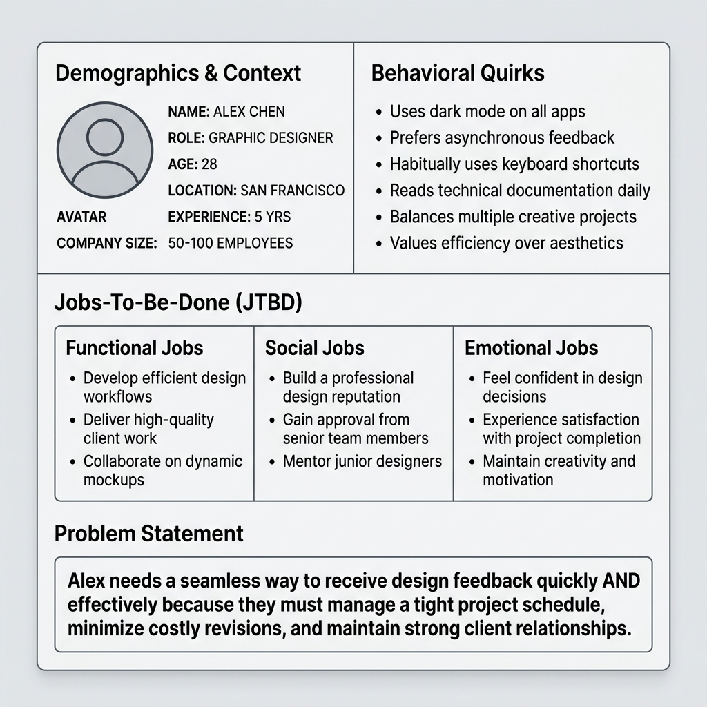

## 模块 1: 杀死重型 Persona (约 20 分钟)
<!-- BUDGET: 3600 chars | SLIDES: ≥7 | STATUS: done -->

### 1.1 画像崩塌：摒弃昂贵且僵化的传统画像

> [VISUAL]
> **Slide**: W04-06-Persona-Death
> **Layout**: Split
> **Scene**: 左侧是一份装订精美、厚达 50 页的《年度用户画像市场调研报告》，甚至盖着金色的印章；右侧是一张画在星巴克餐巾纸上的简陋火柴人。
> **List**:
> - 太贵且太慢
> - 知识鸿沟与研发割裂
> - 僵化神圣
> **Text**: 传统画像的三个致命隐患
> **Asset**: 

在传统的软件开发流程中，"用户画像 (Persona)" 往往是一份神圣、昂贵且不可侵犯的最终交付物——它通常由第三方咨询公司耗费数月重金打造，并在你入职第一天作为一份厚厚的精美报告郑重其事地交到你手上。但这个被奉为圭臬的传统流程，存在三个致命的隐患：
- **太贵且太慢**。在数字时代，当你花三个月调研出一个用户模型时，市场竞争环境可能早就变了。
- **知识鸿沟与研发割裂**。做前端调研的人和在后台拼命写代码的人完全脱节，报告只会流于表面并且永远被扔在抽屉里落灰。
- **僵化神圣的“圣经准则”**。因为投入了巨资，高层倾向于将其视为绝对真理。即使系统上线后发现数据不符，也没有人敢去推翻这本僵硬的模型，只能削足适履。这是极其荒谬的行为。

### 1.2 画板革命：用 Proto-Persona 开启快速迭代

> [VISUAL]
> **Slide**: W04-07-Proto-Persona-Intro
> **Layout**: Split
> **Scene**: 屏幕中央出现 "Proto-Persona (原型用户画像)"，副标题标注 "先假设再验证，快速画持续改"。右侧展示一张粗糙但信息密集的手绘卡片。
> **Text**: 画板革命：先假设再验证
> **Asset**: 

为了打破这种官僚主义僵局，Lean UX 提出了一种具有颠覆性的替代方案：**原型用户画像**，也就是 **Proto-Persona**。

Proto-Persona 彻底剥离了画像作为最终交付物的神圣感；相反，它直接变身为一纸被随时涂抹修改、用以全员对齐开启探索的发令枪。

它的核心精神就两句话：**先假设，再验证；快速画，持续改。** 
你们不需要昂贵的咨询公司，只需要把团队核心成员（设计师、前端开发、后端主程、产品经理）锁进会议室，对着一块白板，用你们对行业的直觉和常识，在半小时的高压冲刺内粗略捏出一个基础模型。然后再拿着这张纸片人，走出舒适区去街头开展真实的试错验证。

这种工作流不仅敏捷，它在重塑团队共识建设上更有着奇效。它的最终目的，是建立一种能够抵抗公司内耗的**统一共享理解根基 (Shared Understanding)**——当后续有任何争议时，所有人脑中都必须浮现出同一个具体而残酷的用户模型，而不是各自发散出几千种割裂的私利概念。

### 1.3 极速冲刺：六步推演强行收敛团队共识

> [VISUAL]
> **Slide**: W04-07b-Proto-Persona-Workflow
> **Layout**: Flow
> **Scene**: 展示 Proto-Persona 的六步快速推演流程。
> **List**:
> - 独立脑暴
> - 上墙汇集
> - 投票收敛
> - 行为分离
> - 模版具象化
> - 交叉审视
> **Text**: 六步推演的极速冲刺
> **Asset**: 

具体怎么操作？这是一场需要全员对齐的工作坊：
1. **疯狂脑暴**：倒计时 5 分钟，独立写下各自心目中的核心受众画像标签。
2. **上墙汇集**：将所有便利贴贴上白板，展现所有潜在的人群碰撞。
3. **极限瘦身**：强行投票收敛，全员砍掉长尾角色，只保留最顶层那 3-4 个左右战局的核心画像。
4. **行为分离**：绝对不能依据传统的阶级或收入做划分，必须依据对系统诉求、数字设备掌握深浅等底层差异进行彻底切割。
5. **模版具象化**：强行落实在四大模块标准模板中。
6. **地狱拷问**：各小组相互交换模型卡片，展开最苛责无情的内部挑刺。
7. **外部验证**：拿着初稿找团队之外的同事（甚至保洁阿姨）分享以获取客观意见，强制打破团队的内部回音室。

> [ACTIVITY]
> **Type**: `QA`
> **Duration**: `1 min`
> **Desc**: 提问：为什么第 4 步强调绝对不能按传统收入/阶级来划分用户？（提示：行为特征差异）

### 1.4 从三窗格到四大模块：承载真实的田野洞察

> [VISUAL]
> **Slide**: W04-08b-Four-Module-Template
> **Layout**: Flow
> **Scene**: 展示从经典 Lean UX “三分区 (Tri-pane)” 升级而来的“四大标准模块”模板。四个区块依次亮起：背景档案、行为核心特征、JTBD三维度、问题陈述。
> **List**:
> - 模块一：背景档案 (Context)
> - 模块二：行为核心特征 (Behavior)
> - 模块三：JTBD 三维度 (Jobs)
> - 模块四：痛点陈述公式 (Problem)
> **Text**: 进化：四大标准模块 (Four-Module)
> **Asset**: 

如何勾勒出一个经得起推敲的 Proto-Persona 假人？
在经典的 Lean UX 教材中，作者提出了简单的“三窗格 (Tri-pane)”画法。但在我们的课程体系中，为了与 W03 的 5-Whys 深度访谈法无缝衔接，我们将其严谨化升级为了**四大标准模块**。只需一张 A4 纸，将其划分为四个区域：

**模块一：背景档案 (Demographics & Context)。** 用粗糙的笔触画出极简头像。这绝非单纯好玩，而是为了强制唤醒开发团队深藏的感性共情。在其下方，用一句不足十个字的核心社会身份痛境（例如“重度拖延备考焦虑党 大李”）赋予这张废纸灵魂。

**模块二：行为核心特征 (Behavioral Quirks)。** 这是大家最容易踩空掉入陷阱的死亡区域。

> [VISUAL]
> **Slide**: W04-09-Demographic-Trap
> **Layout**: Split
> **Scene**: 极尽拉踩对比。左侧是传统的“年龄、收入、婚姻状态”等人口学死板分类，标有红色❌；右侧是“单手操作偏好、暗箱隐藏能力、极限耐心阀值”等行为差异清单，标有绿色✅。
> **Text**: 警惕人口统计学陷阱 (Demographic Trap)
> **Asset**: 

这个坑，就是著名的 **Demographic Trap**（即人口统计学陷阱）。传统的市场营销喜欢用“一线城市、25-30岁、月入一万的白领女性”来划分受众。但在交互设计领域，当你需要打磨特定的操作流程时，这种分类法毫无价值。因为年龄和收入无法决定用户在界面前的操作偏好。我们真正需要关注的是行为差异：比如用户倾向于单手滑动还是双手打字？他们遇到错误提示时是仔细阅读还是立刻关闭？这些底层的数字交互习惯往往与人口学标签毫不相干。

> [VISUAL]
> **Slide**: W04-09b-Ozzy-Vs-Charles
> **Layout**: Split
> **Scene**: 极尽反差的对比：左侧是庄重优雅的英国王储查尔斯国王，右侧是狂野叛逆的摇滚主唱 Ozzy Osbourne，两人头上顶着完全相同的人口学标签数据。
> **Text**: 人口学标签的荒谬性
> **Asset**: 
> **Source**: Web Source

在业界，有一个极其经典反证。假如按照这些冷冰冰的僵化指标：1948 年同年同月出生于英国、皆为男性、结过婚具有相似家庭架构、银行资产丰厚富可流油、并在英国拥有常居地的用户。如果不看人，你会以为这是百分百高度同质重合的高配模板人群对不对？

可是剥开看真人，他们中间的一位，是位居权力顶端主抓严肃庄重国事、举止高贵的英国王储查尔斯国王；而另一位同等匹配标签的人，则是离经叛道、满身纹身、甚至曾在演唱会徒口撕烂咬掉活蝙蝠、歇斯底里的黑暗重金属摇滚传奇主唱 Ozzy Osbourne！

如果让你为这组人开发一款全数字交互系统，你敢相信那冷冰冰的人口报表认为他们是“同属性用户”的结论吗？绝对不可能！
因此，在右上区，我们只关心能够**预测软件真实使用行为差异点**的特征。这才是指导我们界面架构的唯一硬指标。

人类在面对软件时的真实互动行为（比如没耐心看繁琐的提示框、本能地去点击闪烁的红色按钮），很大程度上是受深嵌在潜意识与固有习惯中的直觉支配的。行为特征区的挖掘，正是为了去描摹这只在冰山之下、主宰着绝大多数用户行动的无形巨鲨。

> [VISUAL]
> **Slide**: W04-10-JTBD-Problem
> **Layout**: Split
> **Scene**: 分析四大模块的下半区。左侧是“JTBD 三维任务 (功能/社会/情感)”，右侧是“Problem Statement (痛点陈述公式)”。
> **Text**: 模块三与四：任务拆解与痛点陈述
> **Asset**: 

最后是下半区的**模块三与模块四：JTBD 与 痛点陈述**。

经典模板往往只在下半区含糊地写上“目标与需求”。但在实战中，这种粗颗粒度的标签毫无用处。用户经常会向你索要某个“功能需求”，但如果你不知道他的“终极目标”，你只会变成一个无情的接盘侠。

因此，我们要求你在**模块三**，必须将用户的诉求严格拆解为我们在前置课程学过的 **JTBD 三个维度：功能任务 (Functional)、社会任务 (Social) 和情感任务 (Emotional)**。只有通过 5-Whys 剥离出底层的社交恐惧或情感焦虑，你的设计才真正有了护城河。

最后，在**模块四**，你必须用一句话进行最终收敛，也就是**痛点陈述 (Problem Statement)** 公式：**【具象用户】非常需要【动词+任务】，因为【深层动机】**。
这个浓缩了心血的公式，将成为你接下来的产品进行 MVP 实验和假设验证的唯一法庭原点。

> [ACTIVITY]
> **Type**: `Quiz`
> **Duration**: `3 min`
> **Desc**: 测验：跨越“人口学陷阱”与提炼行为特征
> **Question**: 某金融团队为老年人设计了“大字版极简理财App”，但在 Proto-Persona 的右上角（行为核心特征）区域，他们填入了“年龄 65+、退休金月入 8000、独居”。按照 Lean UX 摒弃“人口学陷阱”的法则，以下哪一项才是合格且能真正驱动该系统界面架构设计的“行为特征”标签？
> **Options**: A. 本科学历，曾从事过初级财务会计工作 | B. 患有严重的老花眼与白内障等视力退化障碍 | C. 对红色报错弹窗极度恐慌，且倾向于单点重按而非滑动操作 | D. 居住在非一线城市的传统社区，有强烈的存钱意愿
> **Answer**: `C`
> **Explain**: 年龄、收入、居住地等属于传统人口统计学标签（System 2属性），无法决定用户在界面前的真实操作偏好（选项A、D错误）。选项 C 精准描述了系统交互层面的直觉与操作习惯（System 1属性），是指导界面架构的硬指标。选项 B（视力退化）属于生理阻碍，应放入下半区的 Obstacles（障碍）栏，而非右上角的行为特征区。

> [VISUAL]
> **Slide**: W04-11-Three-Validations
> **Layout**: Flow
> **Scene**: 绘制一个时间轴，标出在写下一行代码之前必须跨越的三个验证关卡（存在？痛点？买单？）。
> **List**:
> - 第一关：存在性检验
> - 第二关：真实痛点检验
> - 第三关：付费行为检验
> **Text**: 击碎确认偏误的三道验尸墙
> **Asset**: 

### 1.5 活文档闯关：击碎确认偏误的三道验尸墙

在画完三分区模板后，我需要特别给大家打一剂清醒针。Jeff Gothelf 在教材中反复锤打的一条核心警告是：**我们不是用户，也就是 We Are Not Our Users**。作为交互设计专业的学生，你们处于一个极其危险的"专家诅咒"位置——你们个人对软件的容忍阈值、用智能手机的认知熟练度、以及对界面设计形态的需求弹性，远远超出了普罗大众的常规水位线。当你知道三手指滑动可以触发 iPad 的多任务管理器时，你已经是世界上非常非常少见的极端用户了。你的妈妈——我想大部分同学的妈妈都是如此——遇到这个手势时的第一反应是惊恼地抬头问你"孩子，我的屏幕怎么又乱了"。你凭自己的共情去捏造臆想的假画像，总是会远比你以为的更乐观。

而 Proto-Persona 的诞生，就是为了强迫你跳出"我用着挺好的呀"这个自我平行宇宙，去立旗注视那个真实的、疏离的、混乱的异维度用户。

记住，Proto-Persona 是一份**活文档（Living Document）**。当你把这张 A4 纸画完，它仅仅是你们团队“一厢情愿的幻觉”。在进入更深层的敏捷迭代之前，你手里的这个假人物，必须立刻去闯三关开展早期验证：

**第一关：这类用户真的存在于地球上吗？**
你们走到街上或是拉响人脉网，尝试按特征招募 5 个人。如果你发现哪怕找遍全校都凑不齐你画的这种具有特定行为模式（而不是人口统计）的人，说明什么？说明你的假设纯属虚构，**立即撕毁重新画脸，这是命令。**

**第二关：他们真的遭遇了你猜测的巨大痛点吗？**
假设你找到了这批人，通过上周学的 JTBD 访谈和观察，你绝望地发现，由于种种原因，他们对你臆想中的那个“巨大痛点”根本无感，他们有别的情景和烦恼。此时，你要果断抛弃你最初的方向，将白纸下半区全数抹掉。这是你避免浪费几个月生命的最昂贵但最值得的教训。

**第三关：在拥有致命痛点的前提下，他们会有任何购买且长期使用的行动吗？**

> [VISUAL]
> **Slide**: W04-10b-Behavioral-Check
> **Layout**: Flow
> **Scene**: 展示三关验证的漏斗图，顶部是“人口存在 (Exist)”，中间是“痛点吻合 (Pain)”，底部最窄且标红的出口是“真实行为支付 (Action)”。
> **Text**: 第三关：付费/使用行为检测
> **Asset**: 

这一关是杀伤力最强的最终经济性检测。你不能只问"你觉得这个产品怎么样"这种空洞的观点式探询，因为人类在观点层面总是极度慰貍的。你要观察的是行为级别的信号：他有没有愿意留下真实的邮箱进入等待名单？有没有在你的简陋纸质原型上尝试去点击一个根本不存在的"立即购买"按钮？只有这种带有真实成本的行动突破，才能被视为“这个电子假人正在变得有血有肉”的硬性证据。

> [VISUAL]
> **Slide**: W04-12-Angel-Investor-Failure
> **Layout**: Split
> **Scene**: 一张极其精致的商业计划书 (BP) 评估系统界面前，一群投资人面面相觑，没有人愿意掏钱或学习。
> **Text**: 伪刚需：痛点存在但不致命
> **Asset**: 

> [CASE STUDY]
> **天使投资人的“伪刚需”血案**
> 这绝对不是我们在课堂里的虚张声势。硅谷曾有一支闪亮的精益创业团队，计划为资深的天使投资人，定制一款硬核的商业计划书 (BP) 评估追踪平台。
>
> **前两关如履平地：** 
> 第一，全美确实有海量的活跃天使投资人。
> 第二，实地田野调查确认，他们每天看海量 BP 确实很痛苦，迫切想要摆脱低效的泥潭。
> 团队全体沸腾。以为拿到了一把通往千万级市场的刚需钥匙。
>
> **第三关折戟沉沙：**
> 就在摩拳擦掌准备搭建架构前，团队做了最后一次实战探测。
> 交互主考官面对那群苦主，抛出了终极拷问：“既然我们的系统能完美解决痛点，各位是否愿意为此支付订阅费？或者，每天哪怕多花二十分钟，去专门学习并操作这套精密系统？”
>
> 瞬间，原本满地诉苦的面孔开始闪烁其词。
> 残酷的真相浮出水面：这群人 95% 只是每年跟风投几笔钱。他们把拓展人脉当主业。痛点确实存在，但让他们跨越极高的学习门槛还要掏钱？这是个伪命题。
> 只有不到 5% 的全职专职投资人愿意买单。但这微不足道的受众存量，根本撑不起系统开发的高昂开支。
> 在真实掏钱的行动线上，这个 Proto-Persona 被当场证伪，胎死腹中。

> [TEACHING MOMENT]
> **警惕“廉价的赞同”**
> 同学们，在下周的实地验证中，你们最容易犯的错，就是把用户“口头上的感兴趣”误当作“掏钱行动的承诺”。
> 记住，**赞扬是免费的，但行为是有成本的**。当用户说“这主意听起来不错”时，那往往只是他们出于礼貌的社交防御。只有当他们愿意为你简陋的纸质原型留下真实的邮箱，或者甚至当场试图点击你那个假的购买按钮时，你白纸上的那个假人像，才真正获得了呼吸和生命。

> [VISUAL]
> **Slide**: W04-12b-Confirmation-Bias
> **Layout**: Split
> **Scene**: 左侧是设计师像保护婴儿一样抱着自己的 Proto-Persona 画板，右侧是他在实地访谈中焦急地向用户“推销”自己的理念，试图寻找支持证据。
> **Text**: 警惕确证偏误 (Confirmation Bias)
> **Asset**: 

> [TEACHING MOMENT]
> **不要让假定变成教条**
> 大家在做上述这致命三关的时候，切记心理学上的确证偏误 (Confirmation Bias)。当你亲手画出一个可爱的 Proto-Persona 时，你就像看着自己的孩子，潜意识里会极其排斥那些推翻你预设的不利证据。
> 很多实习生在做验证访谈时，一旦受访者表示“我其实不太需要这个功能”，他们就会焦急地去引导：“但是你看，加上这个是不是能帮你省两分钟？是不是挺好的？”如果你在访谈中不自觉地开始推销你的理念，而不是像一个冷血的法医一样去记录尸检报告，那么你从一开始就失败了。Proto-Persona 是为了被推翻而生的，每一条被无情推翻的假设，都是在为你们未来的开发资金护盘。

> [CASE STUDY]
> **失败的“全能差旅助手”与 Persona 崩溃**
> 曾有一个团队意图开发一款“全能差旅助手”，他们的初版 Proto-Persona 是“高频出差、对行程细节极度掌控的商务强人”。
> 但当他们拿着简陋的概念去机场拦截这种真实用户时，第二关直接把他们打入冰窟：这群人确实高频出差，但他们对行程细节**根本不想掌控**。他们极其暴躁、疲惫，只希望有一个“什么都不要问我，直接把最快的车和最近的床安排好”的傻瓜黑盒。一旦系统给出四个选项让他们挑选航司常旅客权益对冲，他们会直接关闭 App。
> 这个团队被迫在机场大厅当场撕毁了原来的白板纸，重新画出了一个“极度疲惫、极简决策、厌恶选择”的全新受众画像。如果不经历这种现场被打脸的剧痛，他们会在后端的航司权益比价算法上烧掉整整半年的开发预算。

为了检验大家是否真的理解了这三道残酷的关卡，我们来做一个真实的案例诊断。

> [ACTIVITY]
> **Type**: `Quiz`
> **Duration**: `3min`
> **Desc**: 案例诊断：Proto-Persona 的致命关卡
> **Q**: 某团队为“25-30岁独居白领”设计了一款智能烹饪机器人。实地访谈显示，这群人确实每天抱怨“下班太累不想做饭，外卖不健康”。但当团队放出 999 元的早鸟预售链接时，转化率却为零。按照 Proto-Persona 的验证法则，这个项目死在了哪一关？
> **Options**: A. 第一关：这群“25-30岁独居白领”在现实中根本不存在 | B. 第二关：受访者关于“外卖不健康”的抱怨纯属伪造 | C. 第三关：团队把廉价的口头赞同误当成了真实的支付意愿 | D. 行为分离关：未采用人口统计学标签来招募测试用户
> **Answer**: `C`
> **Explain**: 团队成功验证了人口存在（第一关）和痛点存在（第二关），但在最终经济性检测（第三关）折戟。正如上文“天使投资人”案例所示，用户抱怨“不想做饭”不代表他们愿意付出高昂的真实成本来解决它。验证不能仅停留在观点式探询，必须观测带有成本的真实行动。
