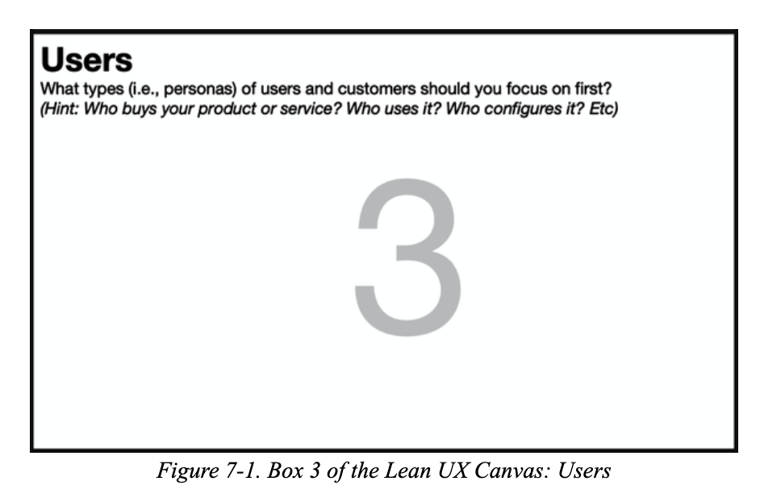
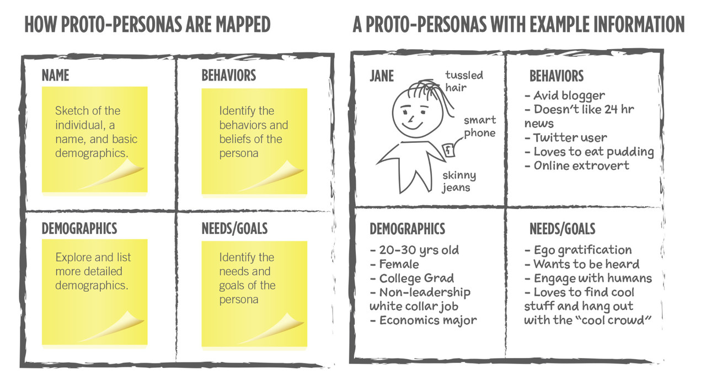
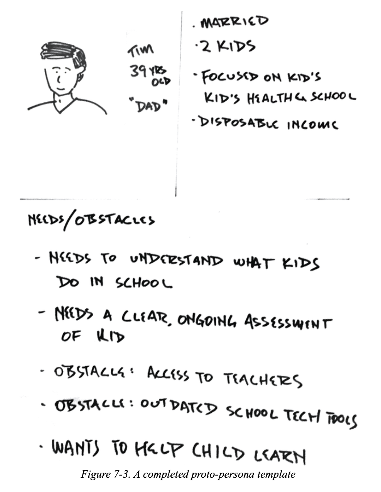
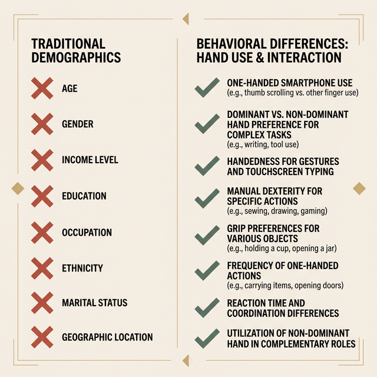
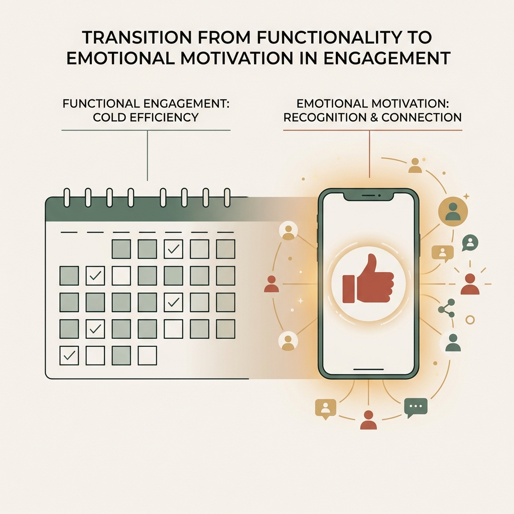
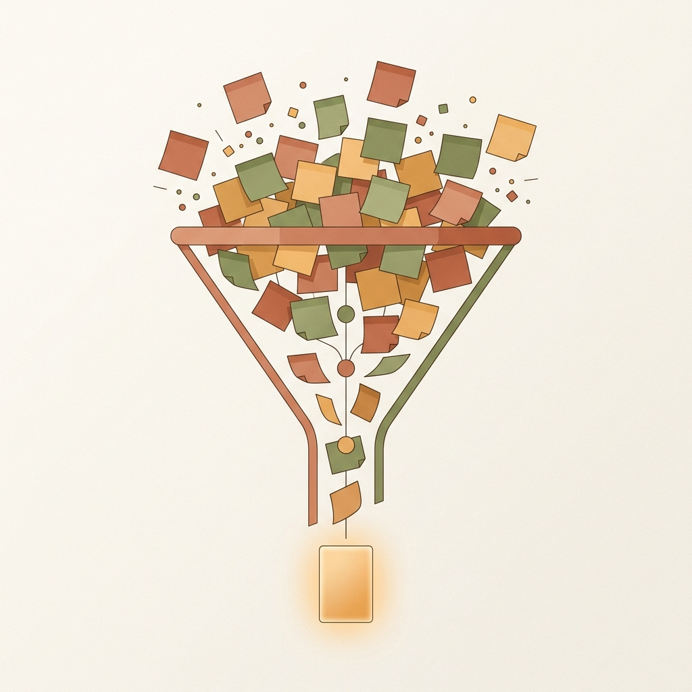
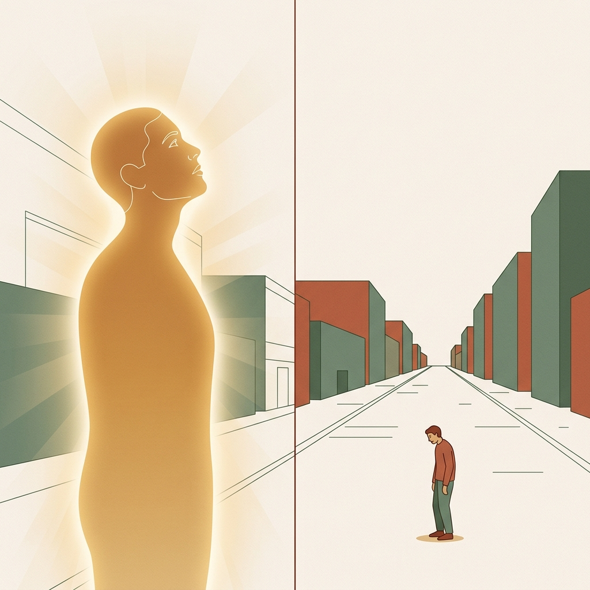
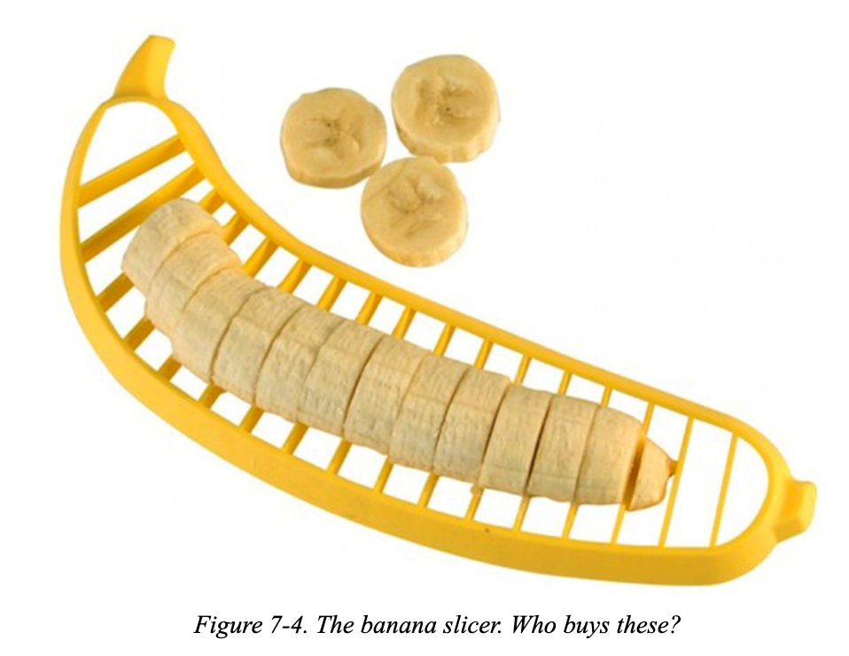
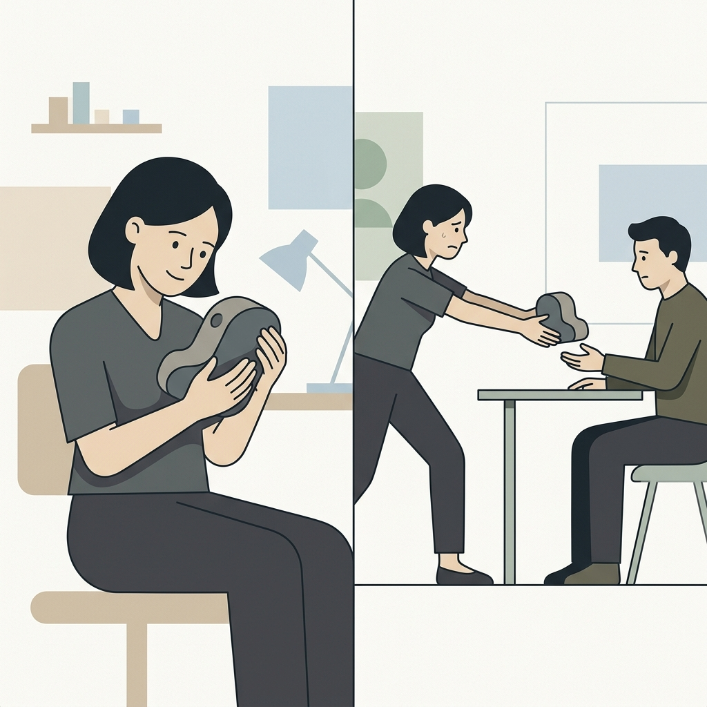

## 模块 1: 杀死重型 Persona (约 20 分钟)
<!-- BUDGET: 3600 chars | SLIDES: ≥7 | STATUS: done -->

### 1.1 画像崩塌：摒弃昂贵且僵化的传统画像

> [VISUAL]
> **Slide**: W04-06-Persona-Death
> **Layout**: Split
> **Scene**: 左侧是一份装订精美、厚达 50 页的《年度用户画像市场调研报告》，甚至盖着金色的印章；右侧是一张画在星巴克餐巾纸上的简陋火柴人。
> **List**:
> - 极易过期
> - 调研脱节
> - 沉没成本
> **Text**: 传统画像的三个致命隐患
> **Asset**: 

在传统的产品开发（甚至很多同学的期末大作业）中，"用户画像"（也就是 Persona）往往是一份为了应付汇报而编写的厚重文档。大家去网上抄一堆数据，拼凑出一份精美的报告，假装很懂用户。但这种传统做法存在致命隐患：
- **太慢且容易过期**。花大力气做出的用户模型，很多时候只是为了填满 PPT 的页数，跟真实世界脱节。
- **调研与设计的脱节**。你们负责调研收集数据的同学，和最后真正打开 Figma 画界面的同学，往往完全不在一个频道上。这份几十页的报告最后只能在微信群里落灰，根本指导不了具体的交互操作设计。
- **沉没成本导致将错就错**。因为前期投入了大量时间和金钱，团队往往舍不得推翻它。即使后来在测试中发现用户根本不是报告里写的那样，大家也只能硬着头皮继续错下去。

### 1.2 画板革命：用 Proto-Persona 开启快速迭代

> [VISUAL]
> **Slide**: W04-07-Proto-Persona-Intro
> **Layout**: Split
> **Scene**: 原著《精益 UX》中的 Lean UX 画布“用户”模块 (Box 3)。这代表了我们不再追求完美的终极画像，而是快速假设。
> **Text**: 画板革命：先假设再验证 (Box 3: Users)
> **Asset**: 

为了解决这些问题，Lean UX 提出了一种替代方案：**原型用户画像**，也就是 **Proto-Persona**。

Proto-Persona 不再是一份完美的最终报告，而是一张可以随时涂抹修改、用来让团队对齐认知的基础草图。

> [VISUAL]
> **Slide**: W04-07a-Proto-Persona-Canvas
> **Layout**: Image
> **Scene**: 展示 Proto-Persona 的四象限画板结构：左侧是用便利贴快速构建模板，右侧是手绘的极简纸片人画像。完美对应了“无需专业调研，只需一块白板快速手绘”的核心精神。
> **Text**: 快速画，持续改
> *   **Asset**: 
> **Source**: [LinkedIn](https://media.licdn.com/dms/image/v2/C5612AQH9XFFhOC1Dpw/article-cover_image-shrink_720_1280/article-cover_image-shrink_720_1280/0/1520060640524?e=2147483647&v=beta&t=8IML6TuiFh-Elli84_ChRXxdNtCxZdIFQTlau2IfVJU)

它的核心精神就两句话：**先假设，再验证；快速画，持续改。** 
你们不需要专业的调研机构，只需要把小组里的核心成员聚在一起，对着一块白板，用你们现有的经验和常识，在半小时内快速推演出一个基础的用户模型。然后再拿着这个“纸片人”，去找真实的用户进行验证和修正。

这种做法最大的价值在于**建立团队共识**。很多时候你们做大作业会吵架，是因为每个人脑子里想象的“用户”都不一样。Proto-Persona 能让所有人在动手做设计前，脑海中浮现出同一个具体的用户形象，从而减少不必要的沟通摩擦。

### 1.3 极速冲刺：六步推演强行收敛团队共识

> [VISUAL]
> **Slide**: W04-07b-Proto-Persona-Workflow
> **Layout**: Flow
> **Scene**: 展示 Proto-Persona 的六步快速推演流程。
> **List**:
> - 独立脑暴
> - 上墙汇集
> - 投票收敛
> - 行为聚类
> - 模板具象
> - 交叉审视
> **Text**: 六步推演的极速冲刺
> **Asset**: 

具体怎么操作？这是一场需要全员对齐的工作坊：
1. **疯狂脑暴**：倒计时 5 分钟，独立在便利贴上写下各自心目中的核心受众画像标签。
2. **上墙汇集**：将所有便利贴贴上白板，展现所有潜在的人群碰撞。
3. **投票收敛**：砍掉边缘角色，全员投票选出最重要的 3-4 个核心画像方向。
4. **行为聚类**：看着白板上的便利贴，不要按传统的“年龄”或“收入”来分类，而是将具有相同“数字设备熟悉度”、“操作习惯”等真实行为差异的标签聚拢在一起。
5. **模版具象化（从散落标签到人设卡片）**：白板上的标签依然是零散的。现在，针对每一个行为聚类拿出一张 A4 纸，随手画一个简笔画头像赋予其“实体”，然后将这些行为标签、初步猜测的痛点汇聚到这张纸上（至于这张纸具体怎么画，我们在下一节详细拆解）。
6. **交叉审视与外部验证**：小组成员先互相交换这些刚画好的人设卡片“找茬”，然后再拿着初稿找团队之外的同学或潜在用户看一眼，听听客观意见，避免陷入团队的自嗨。

> [VISUAL]
> **Slide**: W04-08a-Cross-Validation
> **Layout**: Split
> **Scene**: 团队围在白板前互相找茬，有人拿着放大镜审视便利贴，隐喻交叉验证的重要性。
> **Text**: 突破团队自嗨
> **Asset**: 

> [ACTIVITY]
> **Type**: `QA`
> **Duration**: `1 min`
> **Desc**: 提问：为什么第 4 步强调绝对不能按传统收入/阶级来划分用户？（提示：行为特征差异）

### 1.4 从三窗格到四大模块：承载真实的田野洞察

> [VISUAL]
> **Slide**: W04-08b-Four-Module-Template
> **Layout**: Full
> **Scene**: 《精益 UX》中真实的 Proto-Persona 手绘模板（包含左上角的速写头像、右上角的行为特征、下方的痛点与目标拆解）。
> **Text**: 标准化 Proto-Persona 模板 (Four-Module)
> **Asset**: 

如何勾勒出一个经得起推敲的 Proto-Persona 假人？
在经典的 Lean UX 教材中，作者提出了简单的“三窗格”（也就是 Tri-pane）画法。但在我们的课程体系中，为了与 W03 的 5-Whys 深度访谈法无缝衔接，我们将其严谨化升级为了**四大标准模块**。只需一张 A4 纸，将其划分为四个区域：

**模块一：人物素描与情境 (Sketch & Context)。** 用粗糙的笔触画出极简头像，这能让团队产生真实的共情。在头像下方，用一句简短的话描述TA的核心痛点场景（例如：“重度拖延、考前焦虑的大李”），赋予这个人物真实的灵魂。注意，这里我们只需要极简的情境代入，不需要长篇大论的“人口学普查”。

**模块二：行为核心特征**。这是指导设计的核心，也是大家最容易踩空掉入“人口学陷阱（Demographic Trap）”的死亡区域。

> [VISUAL]
> **Slide**: W04-09-Demographic-Trap
> **Layout**: Split
> **Scene**: 极尽拉踩对比。左侧是传统的“年龄、收入、婚姻状态”等人口学死板分类，标有红色❌；右侧是“单手操作偏好、系统报错时的容忍度、是否依赖快捷键”等行为差异清单，标有绿色✅。
> **Text**: 警惕人口统计学陷阱 (Demographic Trap)
> **Asset**: 

这个坑，就是著名的 **Demographic Trap**（人口统计学陷阱）。很多同学在写“行为特征”时，会习惯性地套用传统营销那一套：“一线城市、25-30岁、月入一万的白领女性”。但在交互设计领域，这种分类法毫无价值，因为年龄和收入决定不了用户在界面前的操作偏好。我们真正需要关注的是底层的数字交互习惯：比如用户习惯单手滑动还是双手打字？遇到错误提示是仔细阅读还是立刻关闭？

> [VISUAL]
> **Slide**: W04-09b-Ozzy-Vs-Charles
> **Layout**: Split
> **Scene**: 极尽反差的对比：左侧是庄重优雅的英国王储查尔斯国王，右侧是狂野叛逆的摇滚主唱 Ozzy Osbourne，两人头上顶着完全相同的人口学标签数据。
> **Text**: 人口学标签的荒谬性
> **Asset**: 
> **Source**: Web Source

业界有一个极其经典的反证。假如我们只看这些冷冰冰的指标：1948 年出生于英国、男性、已婚、银行资产丰厚、常居英国。如果不看照片，你会以为这是高度同质化的同一类用户群。

可是看真人呢？其中一位是举止严谨、主抓严肃国事的英国国王查尔斯；另一位则是离经叛道、满身纹身的黑暗重金属摇滚传奇主唱 Ozzy Osbourne。

> [VISUAL]
> **Slide**: W04-09c-Behavior-Vs-Demographics
> **Layout**: Image
> **Scene**: 冰山隐喻，海面上是虚假的人口标签，海面下是庞大的真实行为习惯。
> **Text**: 行为习惯的冰山模型
> **Asset**: 

如果让你为他们设计一款 App，你敢相信人口报表上说他们是“同属性用户”，从而给他们做一样的界面吗？绝不可能！因为他们的生活方式和操作习惯有着天壤之别。
因此，在模块二，我们必须坚决抛弃“查户口”式的描写，只写那些能够**直接影响软件使用行为**的特征。

人类在使用软件时的真实行为，往往是由潜意识和固有习惯支配的。挖掘行为特征，正是为了找出这些藏在冰山之下、真正决定用户如何操作界面的核心习惯，这才是指导我们设计交互的唯一硬指标。

> [VISUAL]
> **Slide**: W04-10-JTBD-Problem
> **Layout**: Split
> **Scene**: 画面展现从单纯功能向情感动机的转变。左侧是一个冰冷、机械的签到日历；右侧是一部智能手机，屏幕跳出“点赞”图标，周围环绕着温暖的社交光效，以此来折射出用户内心渴望同伴陪伴、对抗孤独的情感诉求。
> **Keywords**: Check-in calendar, Smartphone, Thumbs up icon, Glowing social connections
> **Text**: 模块三与四：任务拆解与痛点陈述
> **Asset**: 

最后是下半区的**模块三与模块四：JTBD 与 痛点陈述**。

很多时候，画像模板只在下半区含糊地写上“目标与需求”。但在实战中，这种笼统模糊的标签毫无用处。比如，当用户说他需要一个“打卡功能”时，如果你不去深究，最后做出来的界面只会是一个冷冰冰的签到日历，沦为盲目堆砌功能的机器。

因此，在**模块三**，你必须将用户的诉求拆解为我们在前置课程学过的 **JTBD 三个维度：功能任务、社会任务和情感任务**。只有通过 5-Whys 往下挖，你可能才会发现，用户要“打卡”的深层情感动机其实是“缓解一个人备考的孤独感，渴望同伴的认可”。

最后，在**模块四**，你必须用一句话进行最终的收敛，即**痛点陈述**（也就是 Problem Statement）公式：**【具象用户】非常需要【动词+任务】，因为【深层动机】**。

这个公式，其实就是把前三个模块的心血完美融合。套用上面的例子，它会变成：
**“【考研焦虑党 大李】非常需要【在完成每日背单词后打卡】，因为【他极度渴望得到研友的点赞来缓解孤独】。”**

有了这个浓缩了深层动机的公式，你在做 MVP 和画原型时，界面设计的重心自然就不再是单纯的日历控件，而是打卡成功后的“社交互动反馈动效”。这才是四大模块指导具体交互设计的真正威力！

> [VISUAL]
> **Slide**: W04-10c-Problem-Statement-Funnel
> **Layout**: Diagram
> **Scene**: 漏斗形状的提炼过程，上面是杂乱的标签和抱怨，经过漏斗提炼出一张发光的痛点陈述卡。
> **Text**: 痛点陈述的极简提炼
> **Asset**: 

> [ACTIVITY]
> **Type**: `Quiz`
> **Duration**: `3 min`
> **Desc**: 测验：跨越“人口学陷阱”与提炼行为特征
> **Q**: 某金融团队为老年人设计了“大字版极简理财App”，但在 Proto-Persona 的右上角（行为核心特征）区域，他们填入了“年龄 65+、退休金月入 8000、独居”。按照 Lean UX 摒弃“人口学陷阱”的法则，以下哪一项才是合格且能真正驱动该系统界面架构设计的“行为特征”标签？
> **Options**: A. 本科学历，曾从事过初级财务会计工作 | B. 患有严重的老花眼与白内障等视力退化障碍 | C. 对红色报错弹窗极度恐慌，且倾向于单点重按而非滑动操作 | D. 居住在非一线城市的传统社区，有强烈的存钱意愿
> **Answer**: `C`
> **Explain**: 年龄、收入、居住地等属于传统人口统计学标签（表面社会属性），无法决定用户在界面前的真实操作偏好（选项A、D错误）。选项 C 精准描述了系统交互层面的直觉与操作习惯（底层行为习惯），这才是指导界面架构的硬指标。选项 B（视力退化）属于生理层面的客观限制条件，不属于右上角的行为核心特征区。

> [VISUAL]
> **Slide**: W04-11-Three-Validations
> **Layout**: Flow
> **Scene**: 绘制一个时间轴，标出在写下一行代码之前必须跨越的三个验证关卡（存在？痛点？买单？）。
> **List**:
> - 存在检验
> - 痛点检验
> - 付费意愿
> **Text**: 击碎确认偏误的三道验尸墙
> **Asset**: 

### 1.5 活文档闯关：击碎确认偏误的三道验尸墙

在画完三分区模板后，我需要特别给大家打一剂清醒针。Jeff Gothelf 在教材中反复锤打的一条核心警告是：**我们不是用户，也就是 We Are Not Our Users**。作为交互设计专业的学生，你们处于一个极其危险的"专家诅咒"位置——你们个人对软件的容忍阈值、用智能手机的认知熟练度、以及对界面设计形态的需求弹性，远远超出了普罗大众的常规水位线。当你知道三手指滑动可以触发 iPad 的多任务管理器时，你已经是世界上非常非常少见的极端用户了。你的妈妈——我想大部分同学的妈妈都是如此——遇到这个手势时的第一反应是惊恼地抬头问你"孩子，我的屏幕怎么又乱了"。你凭自己的共情去捏造臆想的假画像，总是会远比你以为的更乐观。

而 Proto-Persona 的诞生，就是为了强迫你跳出"我用着挺好的呀"这个自我平行宇宙，去立旗注视那个真实的、疏离的、混乱的异维度用户。

记住，Proto-Persona 是一份**随时可推翻的活文档**。当你把这张 A4 纸画完，它仅仅是你们团队“一厢情愿的幻觉”。在进入更深层的敏捷迭代之前，你手里的这个假人物，必须立刻去闯三关开展早期验证：

**第一关：这类用户真的存在于地球上吗？**
你们走到街上或是拉响人脉网，尝试按特征招募 5 个人。如果你发现哪怕找遍全校都凑不齐你画的这种具有特定行为模式（而不是人口统计）的人，说明什么？说明你的假设纯属虚构，**立即撕毁重新画脸，这是命令。**

> [VISUAL]
> **Slide**: W04-11b-Harsh-Reality-Check
> **Layout**: Split
> **Scene**: 左侧是幻想中完美的受众（如同发光的剪影），右侧是在街头茫然寻找却一无所获的设计师。
> **Text**: 幻觉与现实的碰撞
> **Asset**: 

**第二关：他们真的遭遇了你猜测的巨大痛点吗？**
假设你找到了这批人，通过上周学的 JTBD 访谈和观察，你绝望地发现，由于种种原因，他们对你臆想中的那个“巨大痛点”根本无感，他们有别的情景和烦恼。此时，你要果断抛弃你最初的方向，将白纸下半区全数抹掉。这是你避免浪费几个月生命的最昂贵但最值得的教训。

**第三关：在拥有致命痛点的前提下，他们会有任何购买且长期使用的行动吗？**

> [VISUAL]
> **Slide**: W04-10b-Banana-Slicer
> **Layout**: Split
> **Scene**: 著名的“香蕉切片机”商品图——一个荒谬但解决“真实痛点”的过度设计产物。
> **Text**: 痛点存在 = 愿意买单？(香蕉切片机陷阱)
> **Asset**: 

这一关是杀伤力最强的真实意愿检测。你不能只问"你觉得这个产品想法怎么样？"这种空洞的问题，因为人们在口头表态时总是倾向于礼貌和敷衍。你要观察的是行为信号：他有没有愿意留下真实的邮箱以获取后续通知？有没有在你的简陋纸质原型上，主动去点击那个"立即使用"按钮？只有当用户愿意付出真实的时间或行动成本时，你的假设才算初步成立。

> [VISUAL]
> **Slide**: W04-12-Angel-Investor-Failure
> **Layout**: Split
> **Scene**: 大学食堂门口，几个大学生拿着手机面面相觑。旁边的同学摆手拒绝扫码注册，表情从"这想法不错"瞬间切换为"算了太麻烦"。
> **List**:
> - 痛点证实
> - 伪需现形
> - 败于成本
> **Text**: 伪刚需：痛点存在但不致命
> **Asset**: 

> [CASE STUDY]
> **校园闲置交易 App 的“伪刚需”血案**
> 这绝对不是我们在课堂里的虚张声势。曾经有一组同学，计划开发一款“专为大学生设计的二手闲置交易 App”。
>
> **前两关如履平地：** 
> 第一，校园里确实有海量的大学生。
> 第二，实地调查确认，大家确实觉得跳蚤市场摆摊太累，闲鱼同城又不够精准，痛点是真实存在的。
> 小组全体沸腾，以为找到了一个堪比校园版闲鱼的“刚需”。
>
> **第三关折戟沉沙：**
> 就在团队摩拳擦掌准备画原型前，他们做了最后一次实战探测。
> 他们在食堂门口拦住那些抱怨过的同学，抛出了终极拷问：“现在我们的 App 只要实名认证并缴纳 5 块钱押金就能发布商品，你愿意现在扫码注册吗？”
>
> 瞬间，原本满地诉苦的同学开始闪烁其词。
> 残酷的真相浮出水面：虽然大家嘴上说卖二手很麻烦，但绝大多数人的真实行为是——“大不了直接把旧书送给学弟，或者直接扔了”。痛点确实存在，但让他们跨越注册、拍照、填信息甚至交押金的门槛去解决它？这是个伪命题。
> 在要求真实付出行动成本的这一关，这个 Proto-Persona 被当场证伪，胎死腹中。

> [TEACHING MOMENT]
> **警惕“廉价的赞同”**
> 同学们，在下周的实地验证中，你们最容易犯的错，就是把用户“口头上的感兴趣”误当作“掏钱行动的承诺”。
> 记住，**赞扬是免费的，但行为是有成本的**。当用户说“这主意听起来不错”时，那往往只是他们出于礼貌的社交防御。只有当他们愿意为你简陋的纸质原型留下真实的邮箱，或者甚至当场试图点击你那个假的购买按钮时，你白纸上的那个假人像，才真正获得了呼吸和生命。

> [VISUAL]
> **Slide**: W04-12b-Confirmation-Bias
> **Layout**: Split
> **Scene**: 左侧是设计师像保护婴儿一样抱着自己的 Proto-Persona 画板，右侧是他在实地访谈中焦急地向用户“推销”自己的理念，试图寻找支持证据。
> **Text**: 警惕确证偏误
> **Asset**: 

> [TEACHING MOMENT]
> **警惕“只听顺耳话”的错觉**
> 大家在做验证的时候，要警惕心理学上的“确证偏误”。当你亲手画出一个 Proto-Persona 时，潜意识里往往会排斥那些推翻你预设的负面反馈。
> 很多同学在做测试访谈时，一旦受访者表示“我其实不太需要这个功能”，他们就会焦急地去引导：“但是你看，加上这个功能是不是挺好的？”如果你在访谈中变成了推销员，试图强行说服用户接受你的设计，那你的调查就失去意义了。记住，验证的目的就是为了尽早发现错误。每一次被推翻的想法，都是在帮你省下将来熬夜改高保真原型的无用功。

> [CASE STUDY]
> **失败的“极客减脂计算器”与 Persona 崩溃**
> 曾有一个团队意图开发一款“极客减脂计算器”，他们的初版 Proto-Persona 是“渴望身材管理、对卡路里摄入极度自律的大学生”。
> 但当他们拿着画在纸上的界面去健身房门口拦截这类真实同学时，第二关直接把他们打入冰窟：这群人确实想减肥，但他们对热量细节**根本不想自己算**。他们下了课极其疲惫，只希望有一个“什么都不要问我，直接告诉我中午去第几饭堂打哪三个菜最不容易胖”的傻瓜黑盒。一旦系统给出三大营养素的柱状图让他们自己调节滑块，他们会直接关闭 App。
> 这个团队被迫当场撕毁了原来的白板纸，重新画出了一个“又想瘦又懒惰、极度疲惫、厌恶复杂选择”的全新受众画像。如果不经历这种现场被打脸的剧痛，他们会在那些看似华丽但根本没人用的数据图表上，浪费掉整整半个月的精力。

为了检验大家是否真的理解了这三道残酷的关卡，我们来做一个真实的案例诊断。

> [ACTIVITY]
> **Type**: `Quiz`
> **Duration**: `3min`
> **Desc**: 案例诊断：Proto-Persona 的致命关卡
> **Q**: 某团队为“25-30岁独居白领”设计了一款智能烹饪机器人。实地访谈显示，这群人确实每天抱怨“下班太累不想做饭，外卖不健康”。但当团队放出 999 元的早鸟预售链接时，转化率却为零。按照 Proto-Persona 的验证法则，这个项目死在了哪一关？
> **Options**: A. 第一关：这群“25-30岁独居白领”在现实中根本不存在 | B. 第二关：受访者关于“外卖不健康”的抱怨纯属伪造 | C. 第三关：团队把廉价的口头赞同误当成了真实的支付意愿 | D. 行为分离关：未采用人口统计学标签来招募测试用户
> **Answer**: `C`
> **Explain**: 团队成功验证了人口存在（第一关）和痛点存在（第二关），但在最终经济性检测（第三关）折戟。正如上文“校园闲置 App”案例所示，用户抱怨“不想做饭”不代表他们愿意付出高昂的真实成本来解决它。验证不能仅停留在观点式探询，必须观测带有成本的真实行动。
