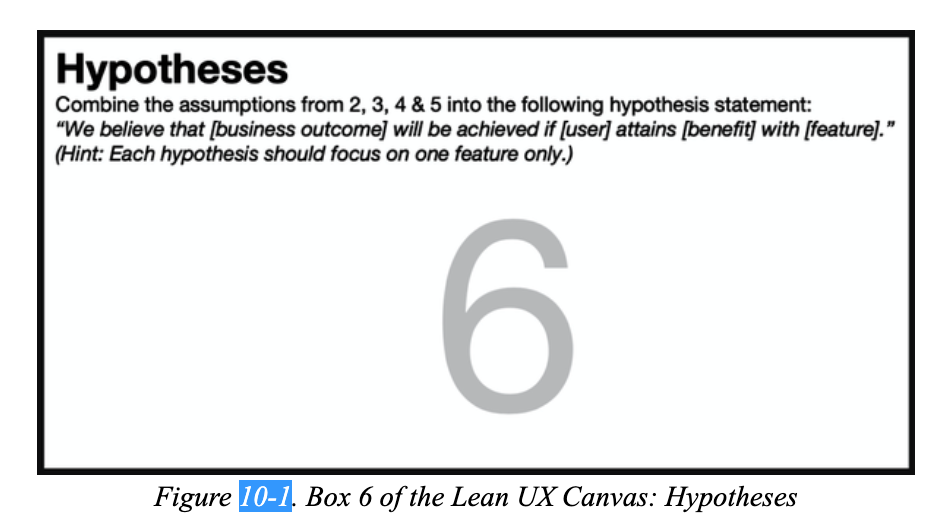
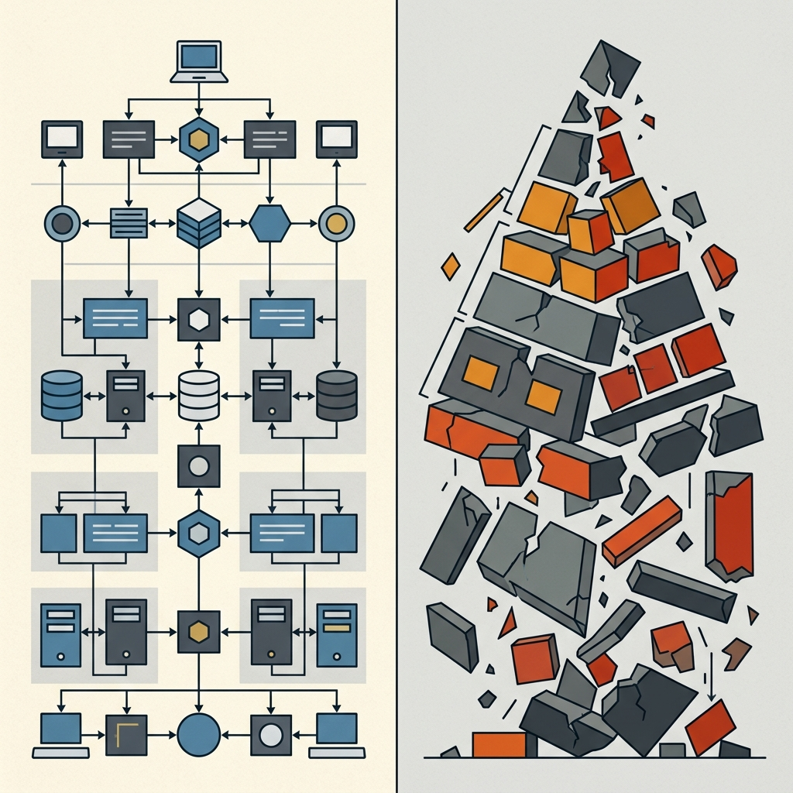
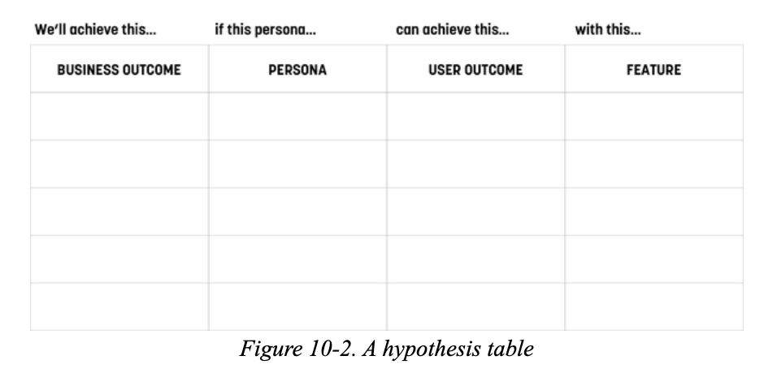
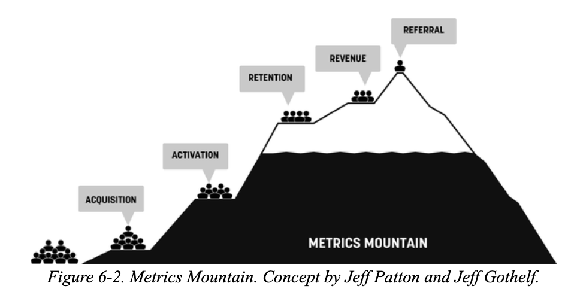
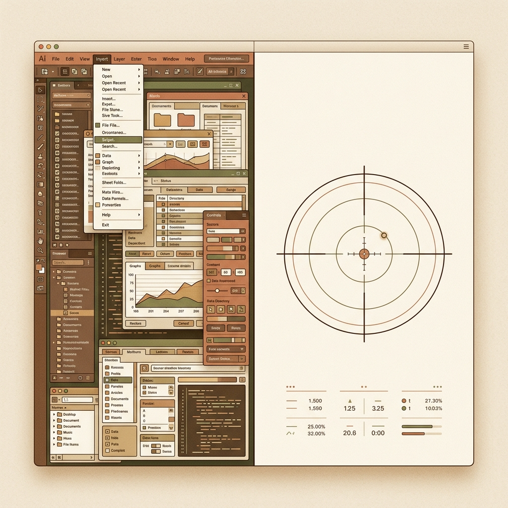
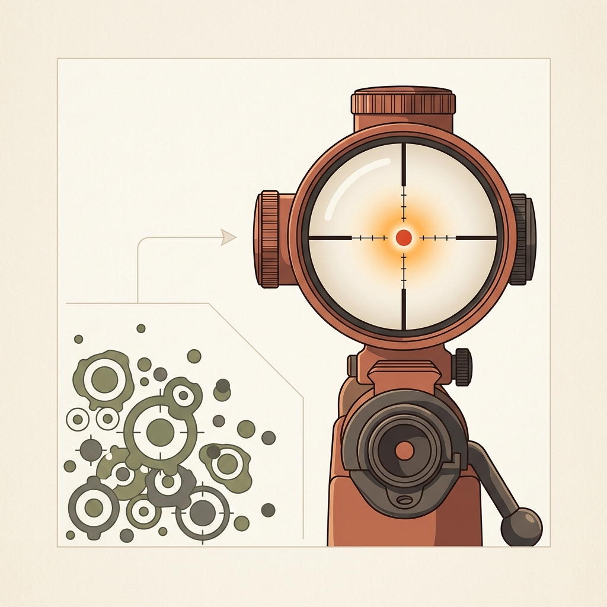
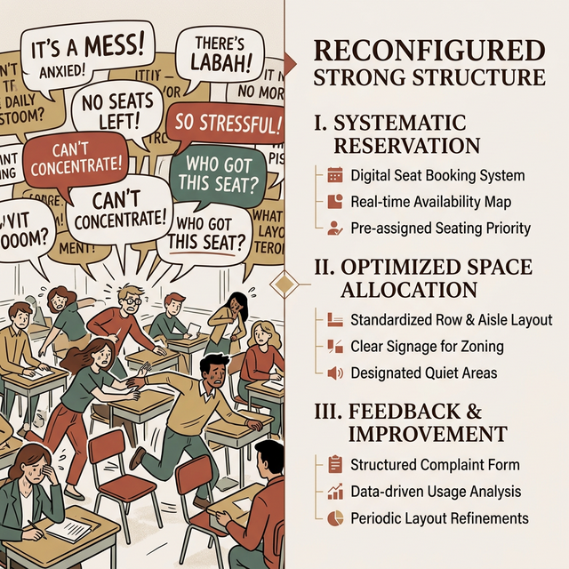
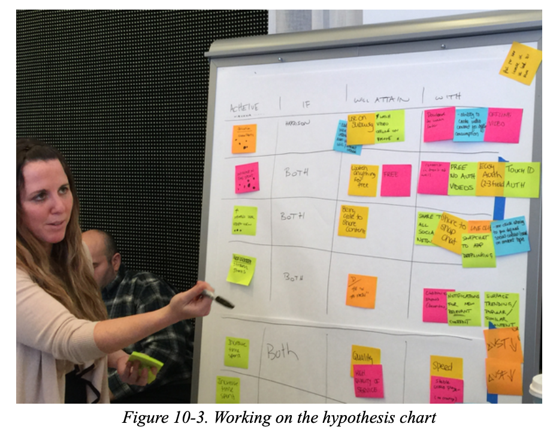

## 模块 2: 从假设到子弹——假设驱动设计 (约 20 分钟)
<!-- BUDGET: 3600 chars | SLIDES: ≥7 | STATUS: done -->

### 2.1 指令重构：用假设声明取代功能清单

> [VISUAL]
> **Slide**: W04-13-Hypothesis-Bridge
> **Layout**: Split
> **Scene**: 原著《精益 UX》的 Lean UX 画布“假设”模块 (Box 6)。
> **Text**: 假设声明 (Box 6: Hypotheses)
> **Asset**: 

带着从田野调查中锤炼出来的真实业务问题陈述和洞察，我们终于进入了整个精益设计的中枢神经：**假设**（也就是 Hypotheses）。

在传统的软件工程里，产品经理想出了一个主意，然后把它写成干巴巴的 PRD（产品需求文档），当成命令指派给你们。你们就成了无情的“画图机器”和“代码民工”。在精益设计中，我们要彻底推翻这种单向度的接单模式。

假设，就是你瞄准商业目标打出的一颗子弹。我们要先认清传统开发模式里，交互设计师经常踩入的一个巨大火坑：只管交付，不管死活。

### 2.2 交付陷阱：做完功能不等于解决问题

> [VISUAL]
> **Slide**: W04-14-Agile-Trap
> **Layout**: Comparison
> **Scene**: 左侧展示“传统接单思维”，以界面画完、功能凑齐作为胜利节点；右侧展示“精益验证思维”，必须看到用户真实的动作或数据改变才算胜利。
> **List**:
> - 接单陷阱
> - 精益验证
> **Text**: 产出 vs 结果 (Output vs Outcome)
> **Asset**: 

让我们来深度剖析一个经典、看起来毫无破绽、却容易引发问题的**功能需求指令**模板：
“*开发一个 **一键找回密码** 功能，确保在 **用户忘了密码时能发送验证码**。*”

这个模板在全世界的产品开发里被广泛使用。它的缺陷到底在哪？在于它在潜移默化中篡改了团队对**“什么是成功”**的定义。
团队的目标变成了“这周我们把几十张高保真页面画完、原型跳转连好”，而不是“这套设计到底有没有解决用户的实际问题”。当大家熬夜把 Figma 原型做完时，全组会击掌相庆：“我们的出图速度简直全班第一！”

> [VISUAL]
> **Slide**: W04-14b-Output-Vs-Outcome
> **Layout**: Split
> **Scene**: 左侧是完美的系统架构图（看似完成了产出），右侧是真实的业务崩塌（完全没有好结果）。对比揭示“做完”和“做好”的区别。
> **Text**: Output vs Outcome (产出与结果)
> **Asset**: 

但是在真实的商业世界中，这种闭门造车的狂欢是一场灾难。为什么？因为验证码邮件很有可能被用户的手机自动归入垃圾箱，或者用户在手机端打开那个排版错位的找回页面时，在经历多步的安全问题校验时感到不耐烦，直接放弃并卸载了你们的 App。

在硅谷的精益圈里，这种“只管做完、不管死活”的灾难有一个非常著名的专有名词，叫做 **Output vs Outcome 谬误**。
发觉了吗？**你们设计的界面看起来可能很顺滑（成功输出了漂亮的图纸 Output），但你们所要解决的真实痛点，却完全没有被消除（完全没有产生结果 Outcome）。** 把高保真原型画完，只能被视为跑通了视觉链路，它是验证假设的起点，绝不能当做大作业拿高分的终点！

密码找回功能存在的唯一理由是帮助那些焦急的用户快速找回账号，并继续使用核心功能。如果你没达到这个目标，你之前排版再好看、动效再酷炫、组件库再规范，对用户而言都只是一堆没用的废土，对团队也是一种纯粹的时间浪费。

> [VISUAL]
> **Slide**: W04-14c-Design-Wasteland
> **Layout**: Split
> **Scene**: 废土隐喻：美丽的 UI 组件库和高保真原型如同废墟碎片般散落在一片荒芜的沙漠中，隐喻“没有商业结果的产出只是一堆废土”。
> **Text**: 美丽的交互废土
> **Asset**: 

> [ACTIVITY]
> **Type**: `Quiz`
> **Duration**: `3 min`
> **Desc**: 测验：辨析产出 (Output) 与结果 (Outcome)
> **Q**: 某小组成功提交了“一键生成课表”功能的高保真原型，UI 非常精美且动效完全无 Bug。但找几位同学实测后，大家表示操作太繁琐，依然在用手机原生备忘录记课表。按精益设计标准，这次设计属于什么情况？
> **Options**: A. 成功交付，因为按时完成了所有的界面和 UI 规范要求 | B. 陷入产出陷阱，虽然输出了图纸，但未能真实改变用户行为解决痛点 | C. 原型保真度不够，如果加上微交互动效大家就会用了 | D. 审美降级，肯定是那几个实测的同学不懂设计
> **Answer**: `B`
> **Explain**: 传统的接单思维容易陷入“以出图完毕为终点”的交付陷阱 (Output Trap)。在精益交互设计中，原型的平滑点击只是起点。如果不能真实改变用户的行为（成功让他们放弃手机备忘录），这就没有产生实际的业务结果 (Outcome)，假设验证依然是失败的。

### 2.3 严谨组装：四段式骨架收敛商业目标

> [VISUAL]
> **Slide**: W04-15-Hypothesis-Template
> **Layout**: Full
> **Scene**: 教材《精益 UX》中真实的四段式假设推导表格 (Hypothesis Table)，横跨画布的 Box 2 至 Box 5 维度。
> **Text**: 标准四段式假设表格
> **Asset**: 

> [VISUAL]
> **Slide**: W04-15b-Hypothesis-Comparison
> **Layout**: Comparison
> **Scene**: 纯文本排版对比两套模板结构。左侧为错误案例，右侧为正确案例。幻灯片本身只有排版文字，不需要AI文生图。
> **List**:
> - ❌ 传统接单式句式：“作为一个[某用户]，我想要[某功能]，以便于[实现某目标]”
> - ✅ 标准四段式声明：我们相信将实现[商业数据结果]，如果能让[受众群体]，获得了[行为后果   消除痛点]，通过提供[解决方案]
> **Text**: 需求陈述 vs 假设声明

> [TEACHING MOMENT]
> **传统需求句式 vs 假设声明**
> 你们可能听过传统的需求陈述：“作为一个 [某用户]，我想要 [某功能]，以便于 [实现某目标]。” 这种句式极易让团队把注意力集中在中间的“交付功能”上。而精益的**假设声明**则彻底翻转了结构——它将“商业与行为的改变”放在首位作为成功的绝对定义，功能只是一种随时可抛弃的手段。

所以，成熟的交互设计师，更倾向于写可被快速评估、能通过测试验证的**假设声明 (Hypothesis Statement)**。这是精益设计中核心的四段式结构：

1. **我们相信**，即 We Believe... 将实现 **[某个具体可测的商业数据结果]**
2. **如果**，即 If... **[某个经过真实验证的 Proto-Persona 受众群体]**
3. **获得了**，即 Attain... **[这种切实的行为干预后果 或 消除了极限摩擦痛点]**
4. **通过**，即 With... **[团队所构想提供的某项具体功能点或交互解决方案]**

> [VISUAL]
> **Slide**: W04-15b-Subjective-Bet
> **Layout**: Split
> **Scene**: 签署军令状/下注隐喻：一个人正在一个巨大的发光问号前签署协议或抛下筹码，承认每一次功能开发都是一次主观下注。
> **Text**: 承认创意的风险
> **Asset**: 

注意结构里的第一句话，千万不要写“我们决定 (We decide)”或“这必将带来 (It will lead to)”。这是对人类傲慢的一记耳光：你脑子里所有自以为精妙绝伦的功能，无论是 AI 算法还是动画视差，本质上都只是一种**主观的下注猜测**。当你签下“我们相信”四个大字时，你就签下了一份军令状，承认自己可能失败的概率。

> [VISUAL]
> **Slide**: W04-16-Dissecting-Hypothesis
> **Layout**: Flow
> **Scene**: 将四段式模板的每一个括号部件，通过发光的神经束线精确连结到 Lean UX Canvas 之前完成的对应 Box 核心区 (Box 2, 3, 4, 5)。
> **List**:
> - 商业结果 (Box 2)
> - 目标群体 (Box 3)
> - 用户利益 (Box 4)
> - 解决方案 (Box 5)
> **Text**: 对齐 Lean UX 画布
> **Asset**: 

这个填字游戏，实际上是对你们前两周市场洞察与画布推演工作的一次逻辑组装：

- **[商业或行为结果]**（即画布的 Box 2）：必须是可以用数字度量的具体行为变化。不要写“提高满意度”等模糊的形容词。

> [VISUAL]
> **Slide**: W04-16-Metrics-Action
> **Layout**: Text
> **Scene**: 展示将虚无缥缈的形容词（满意度高、体验好）转化为具体的动词指标（减少报错、增加点击、降低停留时间）。
> **Text**: 寻找可被观察的“动词”
> **Asset**: 

> [TEACHING MOMENT]
> **拒绝宏大叙事，寻找“动作指标”**
> 为什么不能写“提升公司利润”或“提高市占率”？因为这些属于老板关注的宏大指标。对于我们做大作业的学生或者刚入行的设计师来说，你很难证明利润上升是因为你的按钮改了颜色。
> 交互团队必须关注的是 **行为指标**。你要问自己：“如果方案有效，用户在这个页面上的具体动作会有什么不同？”在制定这层结果时有一条铁律：**必须以动词开头**（例如：用户“减少”求助客服次数、“增加”表单提交率），因为我们追踪的是真实的动作，而不是虚无缥缈的感受。

> [VISUAL]
> **Slide**: W04-16-Persona-Target
> **Layout**: Diagram
> **Scene**: 狙击镜锁定隐喻：一个发光的狙击光环精准锁定人群中一个特定的人影，忽略周围其他人。隐喻极度聚焦受众。
> **Text**: 锁定唯一的焦点
> **Asset**: 

- **[目标群体] (Box 3)**：这里严禁使用“所有普通用户”这种宽泛词汇。你必须聚焦前置调研得出的具体画像，例如“缺乏设备操作耐心的中老年女性”，或者“每次登录仅停留 2 分钟的新媒体运营人员”。只有明确对象，你的解决方案才能精准匹配他们的认知习惯。
- **[用户利益] (Box 4)**：这是用户最终达成的个人心理感受或体验突破。它指的是你帮助用户消除了哪种具体的使用摩擦。
- **[解决方案] (Box 5)**：这是末端的功能载体，例如“接入基于面部识别的无密码通行密钥”。它只是实现上述目标的尝试手段。

> [VISUAL]
> **Slide**: W04-16a-Confounding-Variable
> **Layout**: Split
> **Scene**: 左侧是多个功能杂糅在一起的凌乱界面，右侧是像狙击手一样只瞄准一个目标的精简界面。
> **Text**: 避免功能大杂烩：一次只验证一件事
> **Asset**: 

在进入防错环节之前，我们先来做一个“寻找可被观察的动词”实战诊断。

> [ACTIVITY]
> *   **Type**: `Quiz`
> *   **Duration**: `3min`
> *   **Desc**: 陷阱诊断：识别虚无缥缈的虚荣指标
> *   **Q**: 在某外卖平台重新设计的四段式假设声明中，产品团队写道：“我们相信，如果能让 [晚高峰点餐的白领] 获得 [更顺滑的交互体验]，通过提供 [一键复购历史订单功能]，就能实现 [系统的整体好评率上升]。” 按照“寻找可被观察的动词”法则，这段声明中哪一个括号内的定义是无效且无法被精确验证的？
> *   **Options**: A. [系统的整体好评率上升]，因为“好评率”是模糊的感受指标，应当替换为具体的动作变化（如“晚高峰订单转化率提升 10%”）。 | B. [晚高峰点餐的白领]，因为目标受众应该扩大为“所有平台点餐用户”才具有商业价值。 | C. [一键复购历史订单功能]，因为解决方案不应该在假设阶段就被固定。 | D. [更顺滑的交互体验]，因为用户利益不需要在精益设计的假设中体现。
> *   **Answer**: `A`
> *   **Explain**: 根据“动作指标”法则，[商业结果]（Box 2）绝对不能使用“体验变好”、“好评率上升”等模糊虚荣的形容词。它必须是可通过用户真实动作去度量和追踪的指标（如点击率、转化率）。B项扩大受众违背了Proto-Persona的极度聚焦原则；C项具体的解决方案是允许在假设阶段作为验证手段被提出的；D项用户利益是四段式模板的核心组件。

在填完上述四段式结构后，我们要特别防范一种逻辑陷阱：习惯性地将多个不相关的功能点绑定在同一个目标上。

> [VISUAL]
> **Slide**: W04-16a2-Sniper-Rule
> **Layout**: Split
> **Scene**: 狙击手的纪律隐喻：狙击镜瞄准单一的红点，排斥旁边一团杂乱的多个红点，代表一次只测试一个功能变量。
> **Text**: 一次只开一枪
> **Asset**: 

> [TEACHING MOMENT]
> **一次只开一枪的狙击手纪律**
> 有些团队会在一条假设里塞入多个变量：“如果在主页放红包（功能A），同时在侧边栏加排行榜（功能B），日活就能涨 30%”。
> 请切记——如果你同时上线了 A 和 B，下个月数据涨了 25%，你根本不知道是谁的功劳。是红包带飞了全盘，还是排行榜反而拖了后腿？在写假设时，我们要信奉狙击手的纪律：一条假设，只瞄准唯一的一个功能变量。

如果大家听着这些抽象词汇还是觉得如同黑箱迷雾，让我们一起来迅速拉近距焦镜头，看一个实战演练转化案例。

> [VISUAL]
> **Slide**: W04-16b-Classroom-Example
> **Layout**: Split
> **Scene**: 左侧显示杂乱焦虑的课间抢座场景和满屏幕抱怨的乱码对话框，右侧则像代码审查一样清晰地罗列出被收敛重构后的图书馆预约系统具体强力假设结构。
> **List**:
> - 入座率升
> - 备考群体
> - 缓解焦虑
> - 一键顺延
> **Text**: 图书馆预约系统痛点转化
> **Asset**: 

以大家上周调研最多的“大学图书馆预约系统”为例。我们曾假定其**核心痛点**是：“每天抢座需经历 7 步长流程且容错率极低，失败会严重挫败学习情绪”。
当准备优化这一流程时，我们绝不能仅仅抛出“优化系统界面”这种毫无执行力的模糊指令。我们必须将痛点严密地**转化**入四段式假设架构中：

**(1)* *我们相信* 将实现 **[在早晨 7 点抢座高峰期间，将学生的一次成功入座率从 45% 提升至 75%，并使超话论坛里的相关吐槽帖数量降低 50%]**
**(2)* *如果* 能让 **[重度依赖图书馆且每天有定点自习刚需的高频备考学生群体]**
**(3)* *实现* **[减少机械的重复筛选操作，缓解等待加载产生的焦虑感和时间浪费]**
**(4)* *通过* 提供 **[在登录后的首页第一屏内，新增一个“一键顺延昨日旧座”的快捷交互入口，避免让学生重新进入冗长的选座流程]**

> [VISUAL]
> **Slide**: W04-16c-Spotify-Release-Radar
> **Layout**: Split
> **Scene**: 还原 Spotify Release Radar 的简单列表界面，对比极简交付形态与高价值商业回报之间的惊人杠杆率。
> **Text**: Spotify 新歌雷达假设
> **Asset**: 
> **Source**: Web Source

仅仅停留在一个功能细节的改进上往往还不够。当你需要解决平台级的数据流失时，一条强大的假设可以撬动巨大的商业回报。这就要求我们将用户最底层的行为痛点与系统的核心价值完美结合起来。

> [CASE STUDY]
> **Spotify 的「Release Radar」假设验证**
> 曾经的全球音乐霸主 Spotify 发现，老用户在经过两年的听歌后，经常抱怨“找不到新歌听，平台推荐的永远都是那几首老歌”，导致订阅退订率在一个特定的时间节点开始上升。
> 团队并没有立项去花重金开发一套全新的 AI 推荐算法模型，也没有直接去推翻重做全站的 UI 主题。他们组内写下了一条冷酷的假设：
> *我们相信* 将实现 **[服役期超过两年的老用户月流失率下降 15%，且其周级活跃收听时长增加 20%]**
> *如果* 能让 **[那些歌单口味已经高度固化且缺乏时间主动找歌的高频付费熟客 (Proto-Persona)]**
> *实现* **[无须任何搜索步骤，只需固定每周点开一个即时更新的专属阵地，就能获得新鲜极具针对性的探索感满足]**
> *通过* 提供 **[每周五自动生成一张结合其过往口味且囊括最新发行的「Release Radar（新歌雷达）」个性化播放列表]**
> 这条假设精确到可以用周级数据来直接验证。他们没有去开发几十种华丽的探索交互，仅仅是做了一张列表。首周测试，点击「Release Radar」的老用户粘性直接飙升，这颗子弹正中靶心。

有了这条**数据驱动的强力假设**，你的功能开发就具备了精确的制导方向。但这依然不是终结。

> [VISUAL]
> **Slide**: W04-16d-Data-Guided-Missile
> **Layout**: Split
> **Scene**: 精确制导隐喻：一枚由发光的数据图表引导轨迹的导弹，正精准命中靶心，寓意强力假设带来巨大的商业杠杆。
> **Text**: 数据制导的商业杠杆
> **Asset**: 

> [ACTIVITY]
> **Type**: `Quiz`
> **Duration**: `2min`
> **Desc**: 缺陷诊断：识别功能大杂烩陷阱
> **Q**: 某内容社区的活跃度连月下跌。产品团队提出了如下假设：“如果在文章底部增加‘一键打赏’功能，并同时将全站主题色修改为暖色调，作者的次月留存率就能提升 15%”。这一假设在验证时最致命的缺陷是什么？
> **Options**: A. 缺少可被量化的结果目标 | B. 陷入了“产出谬误”，仅以功能上线作为终点 | C. 一次引入了多个不相关的功能，导致数据变化时无法准确归因 | D. 解决方案颗粒度太细，不应该提及“主题色”这种UI细节
> **Answer**: `C`
> **Explain**: 该假设虽然给出了明确的数据指标，但同时引入了“打赏”和“变色”两个功能变量。如果次月留存率真的上升了，你无法知道究竟是打赏功能立功，还是暖色调发挥了作用。精益验证必须像做科学实验一样，一次只测试一个核心变量。

### 2.4 团队共识：用便利贴矩阵组装假设

> [VISUAL]
> **Slide**: W04-17-Table-Exercise
> **Layout**: Split
> **Scene**: 真实的团队工作坊场景（来源于《精益 UX》）：团队成员正围在白板前，通过便利贴对齐各维度，审查某个功能是否有清晰对应的画像和商业价值。
> **Text**: 便利贴矩阵组装法
> **Asset**: 

大家在各自小组推演完这套流程后，桌面上可能产出的并不是孤零零的一条声明，而是一堆充满创意的待验证假设。当大量假设同时出现时，这就引出了我们团队管控资源的下一个核心组件。

当达成方向共识后，我们可以采用直观的视觉工具——**便利贴矩阵 (Post-it Hypothesis Matrix)**。在实体墙面或白板上，将之前推演出的痛点、画像、功能点子，通过物理连结组合成完整的四段式假设长句。
为什么纸质便利贴重要？因为在这个推演过程中，当团队发现某条点子站不住脚时，直接撕下扔进垃圾桶的阻力极低。相比之下，如果是在拥有几十个画板和密密麻麻跳转连线的 Figma 文件里，要求设计师删掉重做一整个模块，那阻力（和怨气）是极大的。这就是纸笔草图相较于高保真原型的碾压性优势。当你们组合出几条经过逻辑审查的初版假设时，先别急着去排版画图，接下来要进入优先级筛选阶段。

> [TEACHING MOMENT]
> **控制“解决方案 (Solution)”的精度**
> 在第四段 `通过...` 中，我们需要指出解决方案。但请控制好描述的精度！不要写得像“通过 AI 技术”或“通过一个更好的界面”那样抽象。同时，也不要写得像代码字典一样详尽（“通过一个带有蓝色 5px 阴影的自适应按钮框”）。
> 合格的解决方案精度，应该是一个**清晰的交互动因组件**。例如：“通过一个在结账流程前强制弹出的优惠券一键匹配侧边栏”。这明确了何时发生（结账前）、什么形态（侧边栏）、核心机制（一键匹配）。这才是能拿去当子弹发射的标准规格。

