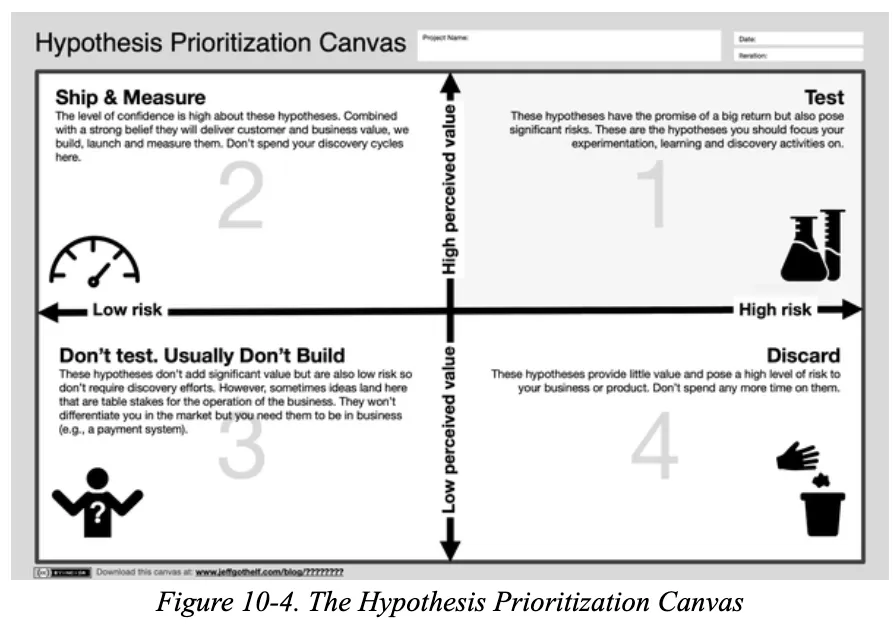
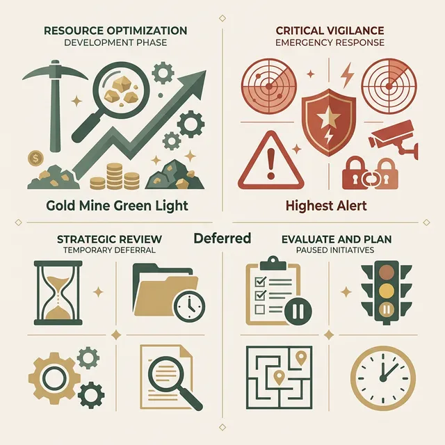
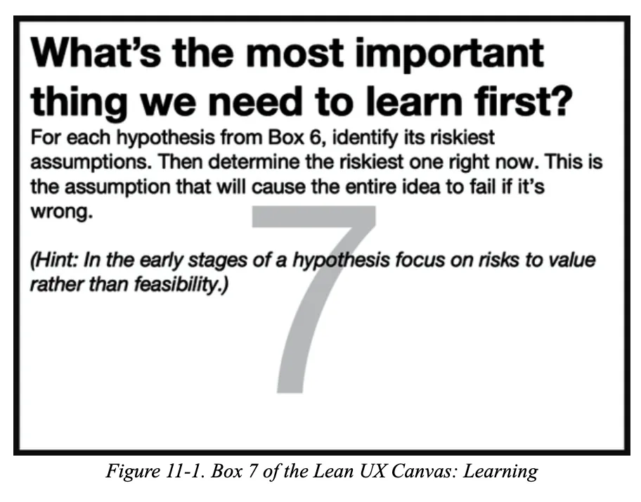
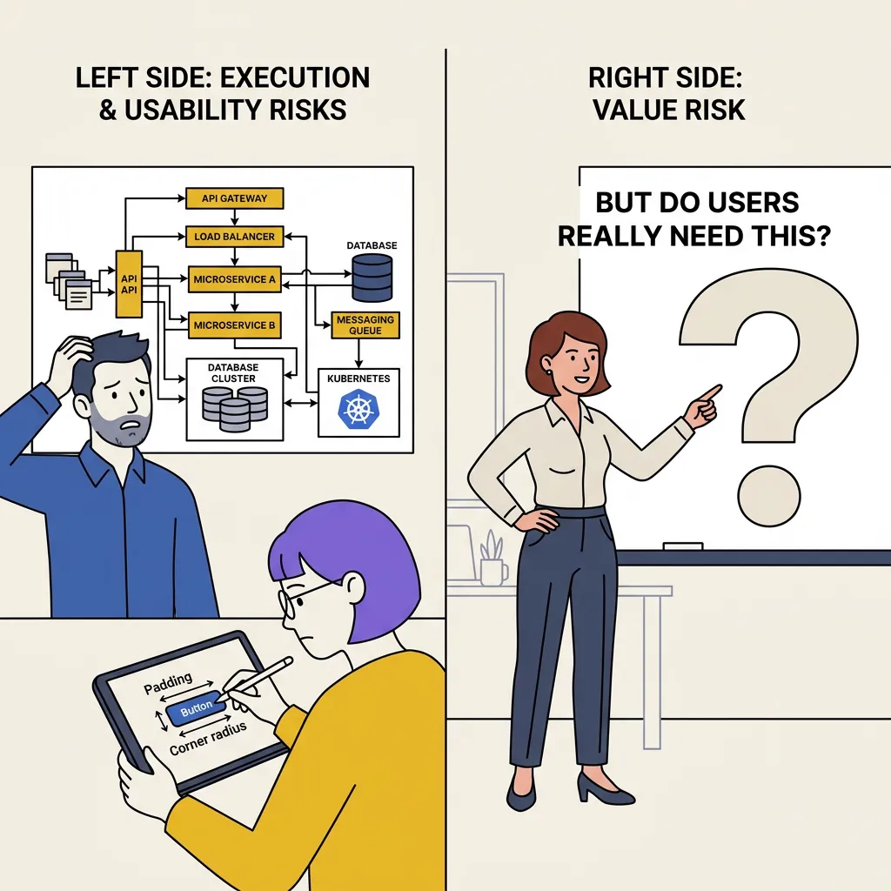

## 模块 3: 假设优先级——风险 × 价值矩阵 (约 10 分钟)
<!-- BUDGET: 1800 chars | SLIDES: ≥4 | STATUS: done -->

### 3.1 严格排序：用优先级遏制盲目开发

> [VISUAL]
> **Slide**: W04-18-Hypothesis-Backlog
> **Layout**: Full
> **Scene**: 一面贴满了几十张五颜六色假设便利贴的白板。画面中心打上一个巨大的问号："我们要全做吗？"

> **Text**: 散乱的点子池
> **Asset**: 

目前桌面上可能躺着十几条想法。团队极易在此刻失控——大家一拍脑袋，恨不得马上打开 Figma 把所有功能都画出来，或者立刻动手做高保真动效。此时，最需要克制的冲动就是“我全都要”。精益设计的核心纪律是**极其冷酷地排优先级**（做减法）。

试图同时实现所有功能的团队，必然面临**精力耗尽**的风险。在有限的结课时间（或创业资金）下，坚决对不重要的需求说"不"，比马上动手画图更重要。在错误的方向上奔跑，速度越快，灾难越深。

我们写下诸多假设，不是为了全部开发，而是为了提前识别出**最高风险节点**。将宝贵的初期时间集中验证核心假设，才能避免后续开发建立在流沙之上。

### 3.2 矩阵切割：引入双轴剥离未知风险

> [VISUAL]
> **Slide**: W04-19-HPC-Matrix
> **Layout**: Full
> **Scene**: 教材原版的假设优先级矩阵 (Hypothesis Prioritization Canvas, HPC)。X轴标示为风险 (Risk)，Y轴标示为感知价值 (Perceived Value)。
> **Text**: 假设优先级矩阵 (HPC)
> **Asset**: 

为了解决产品需求筛选的难题，业界推崇这套由 Jeff Gothelf 等人提出的 **假设优先级矩阵**（英文简称 **HPC**）。它用经典的 2x2 象限图，帮助团队系统性地审视所有假设。

我们来拆解它的两根轴线。**在我们的矩阵中，横轴从左到右风险递增，纵轴从下到上价值递增。**

纵向标尺是**预期价值**。为什么叫“预期”？因为在真正让用户用上之前，你觉得“这功能超酷”或者“用户每天都会用”，全都是你的主观推测。在经过实测前，一切价值都只是**团队的一厢情愿**。与其用复杂的商业术语包装，不如直白地理解为：“这东西要是做成了，价值到底大不大？”

横轴是**风险程度**，即 Risk。这里的风险不仅指**制作难度**（如需要做极其复杂的交互动效或跨专业开发），还包括**合规风险**（如侵犯隐私），以及**体验风险**（如强行弹窗导致用户直接卸载）。评估风险的本质，就是衡量这个想法一旦失败，团队白干了多少个通宵，或者产品会遭到多少骂声。

> [VISUAL]
> **Slide**: W04-19b-Risk-Value-Treasure
> **Layout**: Split
> **Scene**: 风险价值矩阵隐喻。插入一张四象限的抽象视觉隐喻图，展示出在迷雾（高风险）中寻找宝藏（高价值）的精确决策过程。
> **Text**: 穿越高风险的迷雾
> **Asset**: 

> [ACTIVITY]
> **Type**: `Quiz`
> **Duration**: `3 min`
> **Desc**: 测验：识别 HPC 矩阵的隐藏软性风险
> **Q**: 小组作业中，负责代码的同学提出："只要新用户强制分享给5个微信群就能解锁滤镜，这只需加两行分享代码，特别简单。" 但负责交互的同学在画 HPC 矩阵时，坚决把这个点子的横轴（Risk 风险程度）拉到了最高。这位交互同学是基于什么考量？
> **Options**: A. 评估失误，既然写代码只要两行，制作风险就必定是最低的 | B. 识别出了巨大的"信誉与合规风险"，强制分享极易引发微信封禁和海量一星差评 | C. 觉得这功能不够酷，所以用高风险作为借口来阻挡队友 | D. 不懂技术，误以为加这两行代码会把整个 App 搞崩溃
> **Answer**: `B`
> **Explain**: 在 HPC 矩阵的横轴（Risk 风险程度）中，风险绝不仅仅指"制作难度"。它还包括合规风险、用户体验受损风险和品牌信誉风险。强制裂变虽然代码或设计成本极低，但一旦引发用户反感与平台封杀，产品就彻底毁了，因此必须被定为极高风险（High Risk）。

### 3.3 四象限裁决：从核心实验区到直接抛弃

> [VISUAL]
> **Slide**: W04-20-Quadrant-Rules
> **Layout**: Grid
> **Scene**: 屏幕四分切割，四个象限对应的具体红绿黄行动指令。第一象限（右上）为"高价值/高风险"；第二象限（左上）为"高价值/低风险"；下半区为"低价值区"。
> **List**:
> - Q1 实验核心
> - Q2 直接开发
> - Q3 暂缓储备
> - Q4 直接抛弃
> **Text**: 四象限裁决法则
> **Asset**: 

现在，带着所有的便利贴，要求团队成员将其放入这四个区块。我们从最关键的象限开始：

- **第一区（高价值、高风险）**：这是整张矩阵的**核心战场**。它们是决定产品生死的核心卖点，但也包含最高的不确定性。直接花几周时间做出来一旦失败，就是白费功夫。因此，这类核心想法绝不能马上动手精做，必须提取出来作为 **MVP 实验** 的对象，用几张纸或极简的原型去测验它成不成立。
- **第二区（高价值、低风险）**：这里被俗称为"快速出图区"（或快速交付区）。既然实现起来不难（风险低），又能有效解决用户的痛点，策略就是**直接做出来**。不要在这个区域浪费时间去搞什么问卷和验证实验。直接把它画进你的 UI 稿里，或者写进前端代码里即可。

> [VISUAL]
> **Slide**: W04-20a-Infrastructure-Exception
> **Layout**: Split
> **Scene**: 展示标配的底层功能，左侧是华丽但非必需的装饰功能，右侧是朴素但不可或缺的基建组件（如手机号登录框架）。
> **Text**: 标配组件 (必须有，但不加分)
> **Asset**: 

- **第三区（低价值、低风险）**：被称为"辅助功能区"。这类点子通常不着急做。但存在一个重要的特例：**标配基础组件**。例如"App 的注册登录界面"、"找回密码"。虽然它们没有任何产品卖点（低价值），开发难度也低（低风险），但没它用户进不去。对于这类**标配组件**，不要去过度创新（比如发明一种很酷但谁都看不懂的密码输入法），直接找市面上的开源组件库或成熟的 UI Kit 快速拼凑即可。
- **第四区（低价值、高风险）**：直接抛弃。这类功能投入成本高、风险大，且只能带来微弱的用户体验提升。推进这类功能会浪费团队资源。

> [VISUAL]
> **Slide**: W04-20d-Over-Engineering
> **Layout**: Split
> **Scene**: 表现为了验证一座小木桥能否通车，却建了一座更宏大复杂的立交桥的荒诞场景，隐喻过度构建的荒谬性与低价值高风险陷阱。
> **Text**: 警惕过度工程的荒谬
> **Asset**: 

> [ACTIVITY]
> **Type**: `Quiz`
> **Duration**: `2min`
> **Desc**: 矩阵裁定：处理必备组件需求
> **Q**: 你们团队在做一款新的校园外卖 App，现在需要画一套常规的"短信验证码登录"界面。这界面没有任何产品卖点，但没它用户进不去。在优先级矩阵中，这个模块应当如何被定性和处理？
> **Options**: A. 划入第一区（高风险/高价值），要设计三种酷炫的动画方案让同学投票 | B. 划入第二区（低风险/高价值），作为核心卖点让全组人一起精雕细琢 | C. 划入第三区（低风险/低价值），作为"标配组件"，直接去开源组件库里拖拽一套标准的界面填上 | D. 划入第四区（高风险/低价值），因为缺乏卖点又耽误时间，直接不做了
> **Answer**: `C`
> **Explain**: 基础登录模块属于典型的"标配组件"。它无法作为卖点给用户带来极高的预期价值（低价值），制作也高度标准化（低风险）。对于这类 Q3 区的基础件，唯一的纪律就是"绝不在这上面浪费创新精力，用最标准、现成的方案直接对付过去"，把所有时间和心血留给决定产品死活的第一象限核心实验区。

> [VISUAL]
> **Slide**: W04-20b-Matrix-Sorting
> **Layout**: Flow
> **Scene**: 动画演示大量原本散乱的浅黄色便利贴，像被磁铁吸附一样，自动飞向背后巨大的 2x2 HPC 四象限矩阵中对齐。
> **Text**: 矩阵归位收敛
> **Asset**: 

在这个将散乱想法收敛到矩阵的过程中，团队讨论的焦点将从"哪个点子最酷"强制转移到"哪个风险最大"与"哪个价值最高"。这种直观的视觉排序，能够有效减少主观争论，提升沟通效率。

### 3.4 风险盲区：警惕“唯开发成本论”的陷阱

> [VISUAL]
> **Slide**: W04-20c-Social-Friction-Risk
> **Layout**: Split
> **Scene**: 还原裂变活动的翻车场景，表面上是简单的代码逻辑（开发成本极低），背后是引发口碑崩盘和集体卸载的社交隐患（体验风险极高）。
> **Text**: 警惕只看实现难度的盲区
> **Asset**: 

> [TEACHING MOMENT]
> **开发简单 ≠ 风险低**
> 很多设计专业的同学在评估风险时，容易产生一个错觉：“只要代码好写、图好画，风险就低”。大错特错。请务必记住：**引发用户反感、信誉受损、隐私争议** 等体验层面的“软性风险”，其带来的毁灭性影响往往远超一个写错的代码 Bug。

> [CASE STUDY]
> **被忽视的“非技术风险”灾难**
> 曾有一个大学生团队为校园 App 策划了一个拉新活动。他们在排期时，把"强制分享给 5 个微信群才能解锁查课表功能"归入了低风险的高优区域，理由是：这功能在前端做个弹窗加个链接就行，开发成本极低，且能快速带来病毒式裂变。
> 然而，他们完全忽略了横轴上一个致命的**体验与信誉风险维度**。功能上线第一天，由于强制分享引发了极其恶劣的“牛皮癣”式刷屏，不仅立刻被微信官方限制了分享，甚至在校园表白墙上引发了上千条声讨和集体卸载。一个“制作成本只要半天”的小聪明，因为对软性风险的盲目乐观，彻底摧毁了这个产品在校园里积攒了一年的口碑。

当便利贴在矩阵中归位后，第一象限（高价值/高风险）将成为我们的核心战场。这些高危假设绝不能直接进入开发排期，而是必须提取出来作为 **MVP 实验** 的首要测试对象。

### 3.5 风险演进：先验证价值，再探讨执行

> [VISUAL]
> **Slide**: W04-21-Box-7-Learning
> **Layout**: Split
> **Scene**: 原著《精益 UX》的 Lean UX 画布“我们需要学习什么”模块 (Box 7)。
> **Text**: 第一象限目标：优先学习未知风险 (Box 7)
> **Asset**: 
在矩阵讨论中，你们常常会遇到一种僵局：大家对什么是“最高风险”无法达成共识。前端同学觉得某个动效太难实现，UI 同学觉得某个页面色彩不统一。

> [VISUAL]
> **Slide**: W04-21b-Value-Vs-Execution
> **Layout**: Split
> **Scene**: 团队成员争执的画面。工程师在担忧服务器架构（执行风险），设计师在纠结按钮好不好按（可用性风险），而产品经理指向白板上最核心的问题：“但用户真的需要这个东西吗？”（价值风险）。
> **Text**: 风险的两阶段演进
> **Asset**: 

此时，团队必须停下手里的活，问出一个直击灵魂的问题：**“抛开好不好看、好不好写，用户真的需要这个东西吗？”** 

在产品的生命周期中，风险是分阶段的：
1. **早期：先证明“有人要”（价值风险）**：在产品刚萌芽时，最大的风险永远是——你做出来的东西根本没人用。如果用户根本不需要这个功能，你们花一个月时间纠结的高级动效和像素级对齐，毫无意义。
2. **后期：再死磕“做得好”（执行风险）**：只有当用户意愿被初步验证（证明真的有人要），团队的焦点才应该转移到**执行风险**，比如动效能不能流畅落地、前端代码会不会卡顿、体验够不够丝滑。

> [TEACHING MOMENT]
> **用行动打破共识僵局**
> 如果团队在会议室里为了“到底哪个风险最大”争论不休，说明你们需要更多的数据。此时的正确做法不是无休止地辩论，而是由产品经理拍板，挑出一个大家最担忧的致命风险，**立刻出去设计实验收集数据**。不要害怕选错方向，如果数据证明你们错了，随时可以回到假设清单里选下一个。用行动获取认知，永远胜过在会议室里空对空地猜想。

但请注意——接下来你将发现，这个针对高风险假设的"最小成本实验"很可能不需要你写任何一行代码。甚至，你只需要一张白纸和一支记号笔。
