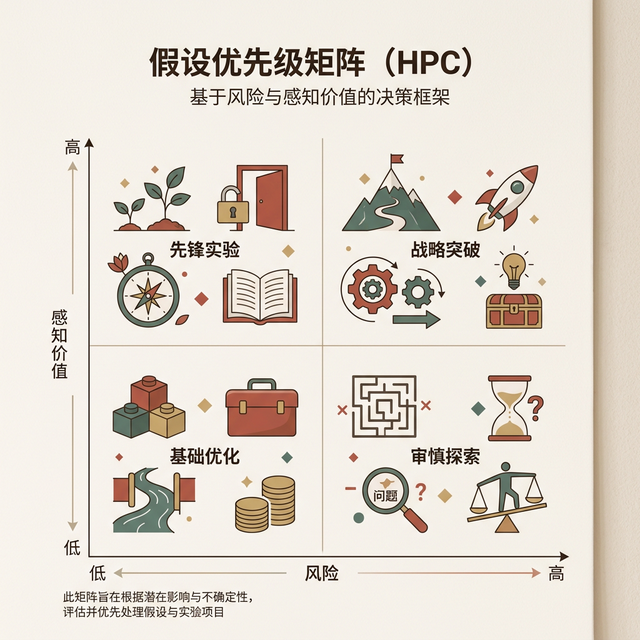

## 模块 3: 假设优先级——风险 × 价值矩阵 (约 10 分钟)
<!-- BUDGET: 1800 chars | SLIDES: ≥4 | STATUS: done -->

### 3.1 严格排序：用优先级遏制盲目开发

> [VISUAL]
> **Slide**: W04-18-Hypothesis-Backlog
> **Layout**: Full
> **Scene**: 一面贴满了几十张五颜六色假设便利贴的白板。画面中心打上一个巨大的问号：“我们要全做吗？”
> *   **Text**: 积压的假设池 (Hypothesis Backlog)
> *   **Asset**: 

目前桌面上可能躺着十几条假设声明。初创团队极易在此刻失控——工程师急于搭建架构，把所有想法塞入排期。精益设计的核心纪律是**严格优先级排序 (Ruthless Prioritization)**。

试图同时开发全部功能的团队，必然面临**资源耗尽**的风险。在有限的资金下，系统性地对低优需求说“不”，比快速编码更重要。正如精益团队的座右铭：在错误的方向上奔跑，速度越快，灾难越深重。

我们写下诸多假设，不是为了全部开发，而是为了提前识别出**最高风险节点**。将宝贵的初期时间集中验证核心假设，才能避免后续开发建立在流沙之上。

### 3.2 矩阵切割：引入双轴剥离未知风险

> [VISUAL]
> **Slide**: W04-19-HPC-Matrix
> **Layout**: Split
> **Scene**: 展示著名的假设优先级矩阵 (Hypothesis Prioritization Canvas, HPC)。X轴标示为风险 (Risk)，Y轴标示为感知价值 (Perceived Value)。
> *   **Text**: 假设优先级矩阵 (HPC)
> *   **Asset**: 

为了解决产品需求筛选的难题，业界推崇这套由 Jeff Gothelf 等人提出的 **假设优先级矩阵**（英文简称 **HPC**）。它用经典的 2x2 象限图，帮助团队系统性地审视所有假设。

我们来拆解它的两根轴线：
纵向标尺是**感知价值 (Perceived Value)**。为何强调“感知”？因为在产生真实数据前，一切价值都只是推论。无论是解决用户痛点（体验提升），还是增加留存率（商业回报），在经过实战测试前，它们都仅是**团队的主观预估**。

横轴是**风险程度 (Risk)**。这里的风险不仅指**技术难度**（如重构底层逻辑），还包括**合规风险**（如数据隐私），以及**体验风险**（如改版引发老用户流失）。评估风险的本质，就是衡量该假设若失败，公司将承受多大的灾难。

### 3.3 无情裁决：将高风险资产逼入核心实验区

> [VISUAL]
> **Slide**: W04-20-Quadrant-Rules
> **Layout**: Grid
> **Scene**: 屏幕四分切割，四个象限对应的具体红绿黄行动指令。第一象限（右上）为“高价值/高风险”；第二象限（左上）为“高价值/低风险”；下半区为“低价值区”。
> **List**:
> - Q1 高价值高风险：MVP 实验核心区
> - Q2 高价值低风险：直接开发，上线监控
> - Q3 低价值低风险：功能储备库暂缓开发
> - Q4 低价值高风险：直接抛弃
> *   **Text**: 四象限裁决法则
> *   **Asset**: 

现在，带着所有的便利贴，要求团队成员将其放入这四个区块：

- **第四区（低价值、高风险）**：直接抛弃。这类功能投入成本高、风险大，且只能带来微弱的用户体验提升。推进这类功能会浪费团队资源。
> [VISUAL]
> **Slide**: W04-20a-Infrastructure-Exception
> **Layout**: Split
> **Scene**: 展示基础设施例外，左侧是华丽但无用的低优功能，右侧是深埋地下但不可或缺的底层管道（如支付网关）。
> *   **Text**: 基础设施例外 (Infrastructure Exception)
> *   **Asset**: 

- **第三区（低价值、低风险）**：被称为“辅助功能区”。这类功能通常暂缓开发。但存在一个重要的**基础设施例外 (Infrastructure Exception)**。例如“构建一套支持银联通道的购物车支付链路”。虽然底层架构不能直接作为卖点吸引用户，但缺少它系统将无法运作。对于明确的**基础设施**，不要过度规划创新，直接采用市面上的成熟方案快速构建即可。
- **第二区（高价值、低风险）**：这里被俗称为“快速交付区”。既然能够低成本上线，又能有效解决当前迫切的需求，策略就是**直接开发落地**。无需在这一区域做复杂的验证实验或冗长的文档。将其拆解为敏捷用户故事交付开发，并在上线后做好数据观测即可。

> [ACTIVITY]
> **Type**: `Quiz`
> **Duration**: `2min`
> **Desc**: 矩阵裁定：处理基础设施需求
> **Q**: 某电商产品在开发初期需要搭建一套常规的“短信验证码登录模块”。该模块对吸引用户毫无卖点，但又是后续订单系统的强制前置条件。在 HPC（假设优先级矩阵）中，这类需求应当如何被定性和处理？
> **Options**: A. 划入第一象限（高风险/高价值），需设计多个 A/B 测试验证哪种登录界面转化率高 | B. 划入第二象限（低风险/高价值），作为核心竞争力投入最精锐的开发资源闭门打造 | C. 划入第三象限（低风险/低价值），作为“基础设施例外”，应直接采购市面成熟组件快速拼接 | D. 划入第四象限（高风险/低价值），因为缺乏卖点且耽误时间，应当直接抛弃
> **Answer**: `C`
> **Explain**: 基础登录模块属于典型的“基础设施例外”。它无法作为产品亮点给用户带来极高的感知价值（低价值），技术也已高度标准化（低风险）。对于这类 Q3 区的基础设施，团队的纪律是“绝不过度规划创新，用最快/最便宜的成熟方案直接填补”，把宝贵的资源和创新精力留给决定生死的第一象限核心假设。

> [VISUAL]
> **Slide**: W04-20b-Matrix-Sorting
> **Layout**: Flow
> **Scene**: 动画演示大量原本散乱的浅黄色便利贴，像被磁铁吸附一样，自动飞向背后巨大的 2x2 HPC 四象限矩阵中对齐。
> *   **Text**: 矩阵归位收敛
> *   **Asset**: 

在这个将散乱想法收敛到矩阵的过程中，团队讨论的焦点将从“哪个点子最酷”强制转移到“哪个风险最大”与“哪个价值最高”。这种直观的视觉排序，能够有效减少主观争论，提升沟通效率。

> [VISUAL]
> **Slide**: W04-20c-Social-Friction-Risk
> **Layout**: Split
> **Scene**: 还原裂变活动的翻车场景，表面上是简单的代码逻辑（低技术风险），背后是引发口碑下降和卸载的社交隐患（高信誉风险）。
> *   **Text**: 警惕非技术层面的信誉风险
> *   **Asset**: 

> [TEACHING MOMENT]
> **警惕“唯技术论”的风险盲区**
> 在评估风险维度时，团队极易陷入“唯技术论”的盲区。请务必记住：**用户摩擦、信誉受损、合规争议** 等软性风险，其带来的毁灭性负面影响往往远超代码层面的 Bug。

> [CASE STUDY]
> **低估隐藏风险的误判教训**
> 在对便利贴做矩阵投放时，视角的误判经常发生。曾有电商团队将“拉新砍价功能”归入了左上方的二区（高价值/低风险）。他们认为该功能耗时短，且能获取大量新客。但他们忽略了横轴上的信誉风险：强制分享引发了用户的反感，导致 App 被大量卸载和差评。实际上，这是一个应当被划入第一象限并进行小规模测试的高风险项目。

矩阵中最关键的区域，是**第一象限（高价值、高风险）**。它们是决定产品破局的核心，但也包含最高的不确定性。直接上线一旦失败，将导致巨大的资源浪费。

因此，这类核心假设绝不能直接排期开发。必须将其提取出来作为 **MVP 实验** 的测试对象，用最小的成本验证其成立与否，这也是我们下一步的工作重心。
