## 模块 4: MVP —— 最小可行「学习工具」(约 25 分钟)
<!-- BUDGET: 4500 chars | SLIDES: ≥5 | STATUS: done -->

### 4.1 认知谬误：打破“半成品等于 MVP”的思维定势

> [VISUAL]
> **Slide**: W04-21-MVP-Misconception
> **Layout**: Split
> **Scene**: 原著《精益 UX》的 Lean UX 画布“MVP与实验”模块 (Box 8)。
> **Text**: 实验设计 (Box 8: MVPs & Experiments)
> **Asset**: 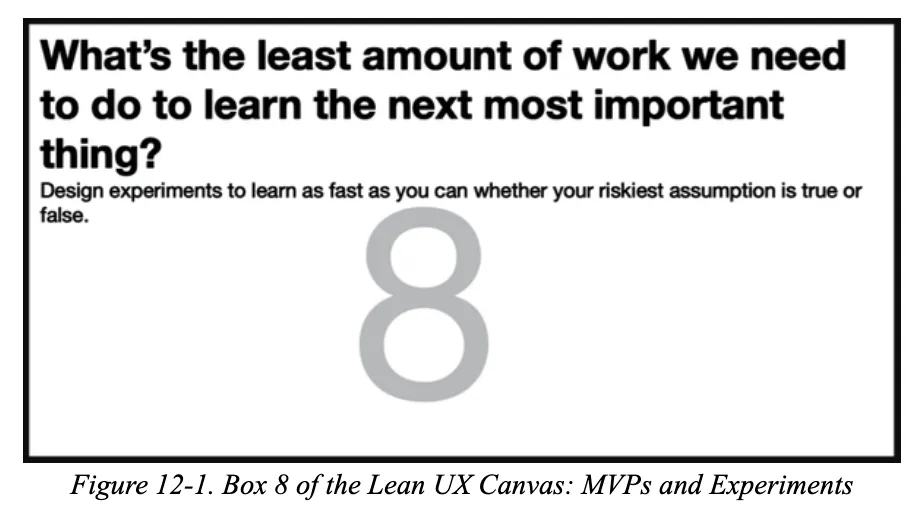

说到 MVP，也就是 **最小可行产品**（Minimum Viable Product），这可能是数字产品开发中被误解最深的一个词。

如果询问非专业人士，他们可能会认为 MVP 就是为了赶进度而砍掉功能的**缩减版本**，或是勉强能运行的**粗糙程序**。这是对精益思想的误读。

当咱们在优先级矩阵的“第一象限”里，讨论如何用 MVP 开展验证时，请务必记住：**它根本不是软件开发的第一版代码**。甚至大多数时候，你连一行正式代码都不需要写。

在 Lean UX 的定义里，MVP 就是你用低成本的手段，为了验证那个“最容易导致失败的假设”，而制作的一个“**低成本试错工具**”。它的核心使命，不是交付一个半成品软件，而是**快速搞清楚用户真正想要什么 (Learning & Insights)**。

> [VISUAL]
> **Slide**: W04-21b-MVP-Microscope
> **Layout**: Split
> **Scene**: 学习工具隐喻：MVP 不是一个未完工的残缺商品，而是被描绘成一把发光的显微镜或探照灯，正在照亮一片充满未知的黑暗区域，隐喻发现与学习。
> **Text**: 核心使命：学习与发现
> **Asset**: 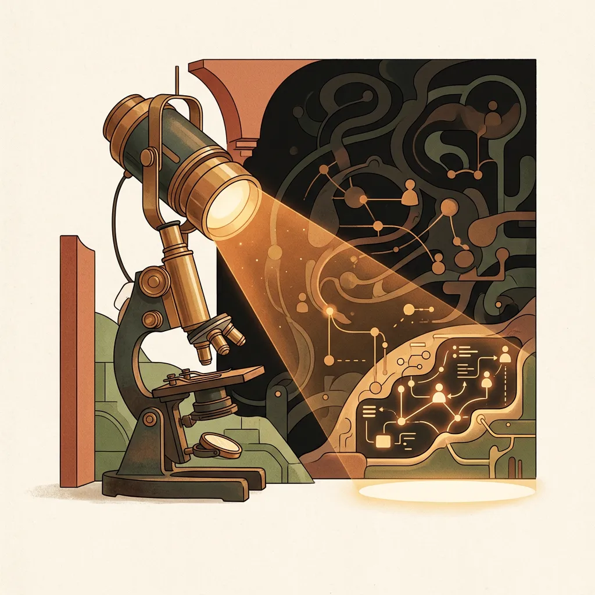

请在心里默念：“这个想法里，哪个部分一旦猜错了，整个设计就会彻底垮掉？” 然后，用最简单、最便宜的材料把它包装起来，让用户与之发生真实互动。那个简易的包装物，就是你的 MVP。

> [DID YOU KNOW]
> **与其花大钱证明自己对，不如花小钱证明自己错**
> MVP 的本质就是一种极端的“找茬”思维：不要花两个月去画全套高保真图或者开发代码，去“证实”你的主意有多棒；而是用最廉价的方法（哪怕是几张纸）去让用户挑刺，用 100 块钱的成本避开 100 万的开发灾难。

### 4.2 真相曲线：用证据强度严格限制保真度

> [VISUAL]
> **Slide**: W04-22-Truth-Curve
> **Layout**: Full
> **Scene**: 教材中展示的真相曲线 (Truth Curve)。横轴是原型的保真度和投入水平，纵轴是已有证据的可靠性/充分程度。这是一条向上延伸的阶梯状模型图。
> **Text**: 真相曲线 (The Truth Curve)
> **Asset**: 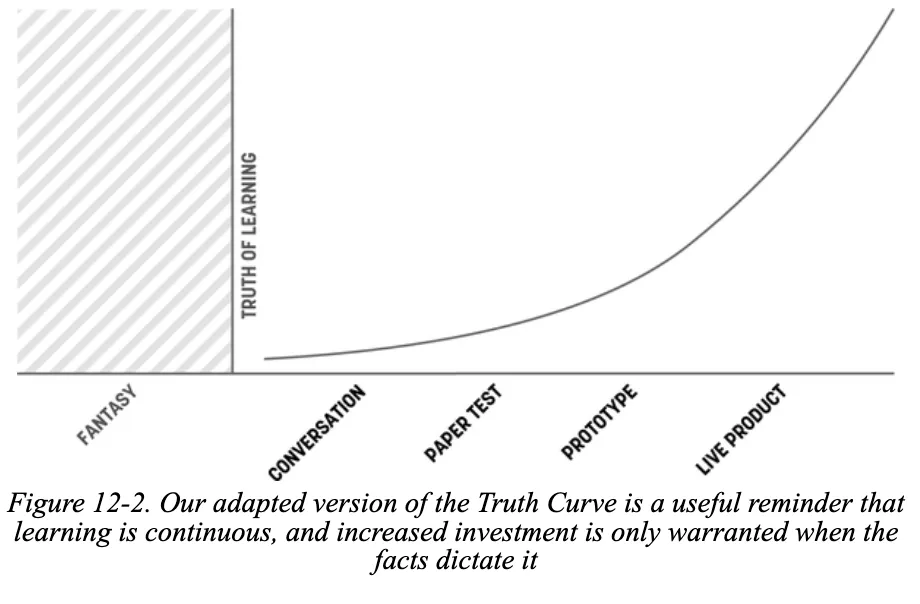

在部署这层伪装前，各位必须信奉一条硅谷铁律：**真相曲线法则**，也就是 **The Truth Curve**。

这条曲线在白板上用一句最通俗的话提醒所有人：**“证据没到那一步，就别花那个钱！”** 你投入在原型上的开发时长和资金，必须被你手中已有的市场证据严格限制。

如果你只凭访谈里两句抱怨，就花两周时间在 Figma 里把全套 UI 组件库和高保真动效全部重做，这叫**高成本的盲目投入**。在精益思想里，超出验证当前问题所需的**任何设计和开发，都是对时间和精力的极大浪费**。

> [VISUAL]
> **Slide**: W04-22b-Evidence-Scale
> **Layout**: Split
> **Scene**: 失衡的证据天平：天平一端是极其微小的一片羽毛（代表微弱的证据），另一端是沉甸甸的巨大金币袋（代表巨大的开发投入），天平正危险地倾斜，隐喻盲目投入。
> **Text**: 证据与投入的平衡
> **Asset**: 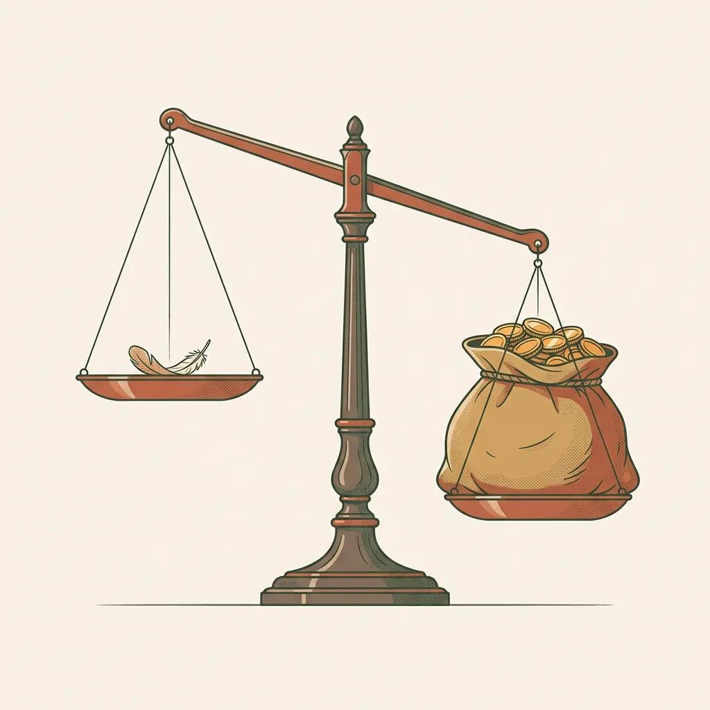

> [ACTIVITY]
> **Type**: `Quiz`
> **Duration**: `3 min`
> **Desc**: 测验：应用“真相曲线 (Truth Curve)”法则评估投入
> **Q**: 某创业团队刚拿到了两份关于“宠物智能陪伴项圈”的用户早期访谈反馈。技术合伙人提议：“既然有痛点，我们这周直接花 10 万元开模印制一批高保真硬件原型，带上全套传感器送给用户试用。”按照 MVP 的“真相曲线”法则，这位合伙人的提议错在哪里？
> **Options**: A. 违背了“真相曲线”，投入的原型资金与保真度（横轴），远远超出了当前极弱的“证据可靠性”（纵轴） | B. 开模速度太慢，应当让工程师连夜加班手工焊接出全套硬件 | C. 未采用“纸质原型”，在开发硬件前必须先让用户在白纸上画出项圈的形状 | D. 违背了“证伪主义”，因为团队应当先证明用户一定不会购买，然后才有资格开始开发
> **Answer**: `A`
> **Explain**: “真相曲线法则”（也就是 The Truth Curve）规定：你投入在原型上的开发成本与保真度，必须被你手中已有的市场证据强度严格限制。在只有两份早期访谈（证据非常薄弱）时，投入 10 万重金开模（极高开发成本）是对资源的巨大浪费。此时的 MVP 应当是极低成本的测试工具（如着陆页概念预售），而非制造高保真的半成品硬件。

### 4.3 极限光谱：在纸质与人工模拟间自由滑动

> [VISUAL]
> **Slide**: W04-23-MVP-Spectrum
> **Layout**: Flow
> **Scene**: 展示一条从左向右保真度渐进的 MVP 光谱，从最左侧的极简纸质原型向右推进，越过着陆页和假按钮，来到右侧的绿野仙踪后台人工模拟。
> **List**:
> - 纸质原型 (Paper Prototype)
> - 着陆页 (Landing Page)
> - 假按钮 (Feature Fake)
> - 绿野仙踪 (Wizard of Oz MVP)
> **Text**: 极简验证的光谱工具
> **Asset**: 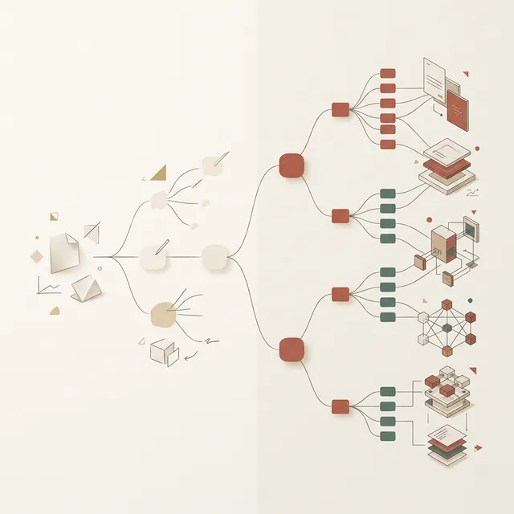

这意味着，MVP 并非某种固化的代码半成品，而是可以根据风险等级灵活选择的**验证光谱**。

> [DID YOU KNOW] **原型的保真度五层级**
> 教材中将用于验证的原型分为 5 个层级：纸质原型 → 低保真线框图 → 中高保真原型(Figma) → 无代码 MVP(如用飞书/腾讯文档拼接业务流程) → 真实代码与实时数据原型。保真度越高，验证成本与维护负担越重。

> [VISUAL]
> **Slide**: W04-23a2-Fidelity-Distraction
> **Layout**: Split
> **Scene**: 保真度干扰隐喻：左侧人们在为了彩色涂料和花哨 UI 激烈争吵（色彩干扰），右侧则是极致纯粹的黑白草图带来的清晰逻辑聚焦。
> **Text**: 剥离视觉干扰
> **Asset**: 

从极简的涂鸦草图，到着陆页与假按钮，再到人工后台的绿野仙踪测试，你可以在光谱上自由滑动。其核心在于用最少成本验证核心风险。接下来，逐一拆解光谱中最常用的四种极简验证方式：

1. **纸质原型**，也就是 Paper Prototype：
很多人会问："有没有最低成本的验证手段？" 当然有，那就是光谱最廉价的一端：**纸质原型**。
拿一叠白卡纸，用粗记号笔画出 APP 流程——每张纸代表一个屏幕，用户点击哪里，就手动抽出下一张纸片覆盖。这种纸片游戏，能在五分钟内暴露逻辑问题。相比在 Figma 里打磨一个月的动效，**纸质原型的真实验证效能更高**。

> [VISUAL]
> **Slide**: W04-23b-Landing-Page-MVP
> **Layout**: Screenshot
> **Scene**: 一个典型的 Kickstarter 众筹页面示例——经典的落地页测试，在产品还未开发完成前就测试真实购买意愿。
> **Text**: 着陆页测试 (Landing Page)
> **Asset**: 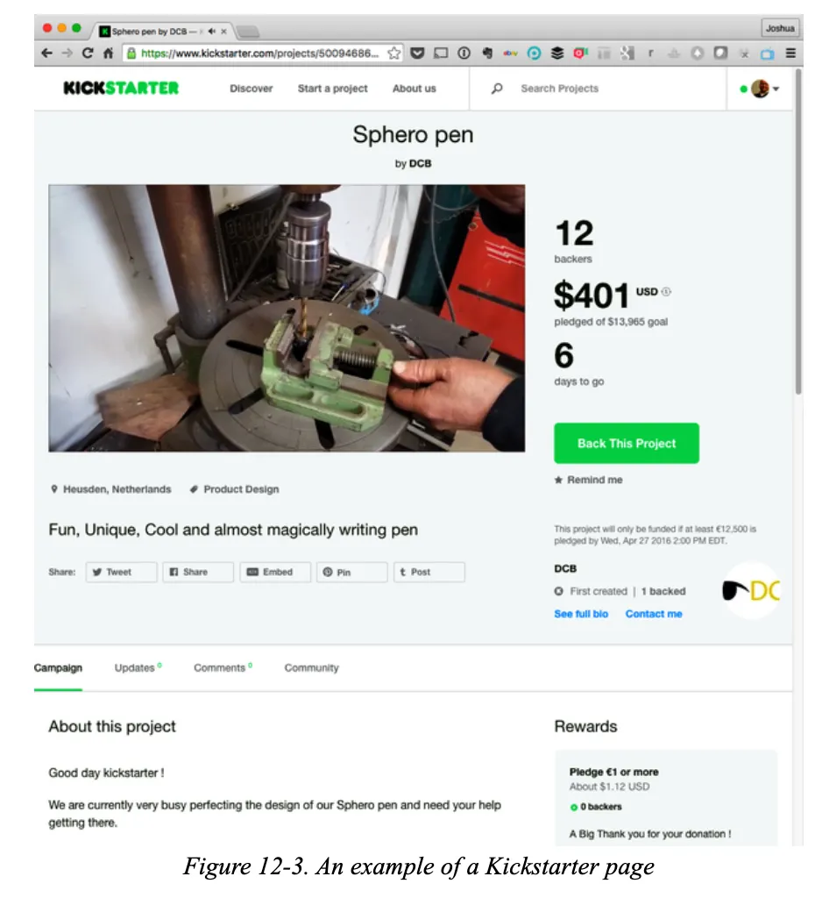

2. **着陆页测试**——英文称作 Landing Page：
这是验证“用户到底愿不愿意买单”最直接的手段。完全不需要写任何复杂的后台代码，你只需搭建一个**极简的宣传网页**，写明你的产品价值并附带一个**抢先体验/预订**的按钮。如果网页上线后毫无点击，那么这几十块钱的域名费就帮你成功避开了几个月的**无效设计和开发灾难**。

着陆页操作底线：**一个网页说明 + 一个行动按钮 + 一段时间的观察期**。不要做多余的页面，更不要去接真实的支付系统——你只需要统计那个按钮被点击了多少次。

> [CASE STUDY]
> **Dropbox 的“烟雾弹”视频测试**
> 硅谷的案例中，最经典的莫过于云存储巨头 Dropbox。在 2007-2008 年间，开发一套能穿透各操作系统的同步引擎技术难度极高。“云同步”对普通用户来说也是个难以理解的概念。
> 投资人问他：“你怎么证明这东西有人要？”
> 创始人 Drew Houston 没有选择闭门写代码。他选择了一个极端的 MVP 方式：用两段不同风格的演示视频，分别击破两种人群的认知防御。

> [VISUAL]
> **Slide**: W04-23b2-Dropbox-Mental-Model
> **Layout**: Full
> **Scene**: 播放 Common Craft 风格的剪纸动画视频，用形象的比喻（把钱包忘在家里）向大众解释云同步的“魔法口袋”概念。
> **Text**: 场景价值验证：让大众听懂
> **Asset**: 
> **Source**: `Video` — Common Craft 纸片人演示视频
> **Duration**: `2m17s`
> **TimeCategory**: `activity`

对于完全不懂技术的大众，团队用这段著名的**“纸片人”视频**作为敲门砖。视频中完全没有展示任何软件界面，而是讲述了一个日常烦恼的故事：就像你把钱包忘在家里，就没办法在公司买咖啡一样，把文件存在单独的电脑或 U 盘里也会面临同样的尴尬。而 Dropbox 就像是一个“魔法口袋”。

这段视频的核心目的，就是用讲故事的方式**把复杂技术转译为大众能懂的常识**。你不需要跟用户解释服务器怎么运作，只需要让他们知道你的产品能解决什么生活痛点。

然而，仅仅让普通大众听懂是不够的。为了向最早期的种子用户（各大论坛上的极客玩家）证明这玩意不是画大饼，Drew 亲自录制了**第二段内测演示视频**——直接在真实的操作系统中拖拽文件，一个微小但关键的“绿色小勾”瞬间出现。这直接向内行证明了：核心技术是可以跑通的。

> [VISUAL]
> **Slide**: W04-23b3-Dropbox-Execution-Model
> **Layout**: Full
> **Scene**: 播放 Drew 亲自录制的屏幕录像操作视频，展示真实拖拽文件后出现的“绿色同步小勾”，向极客证明底层技术的无缝集成。
> **Text**: 技术可行性验证：让内行信服
> **Asset**: 
> **Source**: `Video` — Drew Houston 早期内测演示屏幕录像
> **Duration**: `4m18s`
> **TimeCategory**: `self_study`

这两个截然不同的视频测试，完美切中了两个不同的风险区：第一支视频排除了**“大众听不懂买单价值”的风险**，第二支视频排除了**“极客不相信技术能跑通”的信任风险**。
据创始人回忆，结果令人惊讶：一夜之间，排队注册内测的邮箱数从约 5000 大幅增加到了 75000。
**连一行完整的后端代码都没跑起来，Drew 就用极其低成本的录屏，有效排除了这块领地上所有的“市场需求风险”，也就是 Market Risk。**

在进入下一类 MVP 工具之前，我们来检验一下刚才 Dropbox 案例中蕴含的“分层测试”逻辑。

> [ACTIVITY]
> *   **Type**: `Quiz`
> *   **Duration**: `3min`
> *   **Desc**: 案例应用：Dropbox 视频 MVP 的双重风险拆解
> *   **Q**: 在 Dropbox 的极早期验证案例中，创始人 Drew Houston 并没有直接写底层代码，而是录制了两段不同风格的视频：第一段是面向大众的“纸片人”比喻动画，第二段是面向极客的真实操作系统中出现“绿色同步小勾”的录屏。按照精益验证法则，这两段视频 MVP 分别极其精准地排除了哪两类最致命的早期风险？
> *   **Options**: A. 大众的“市场需求风险”与极客的“技术执行风险” | B. 公司的“资金链断裂风险”与竞争对手的“抄袭风险” | C. 视频平台的“流量转化风险”与后端的“服务器宕机风险” | D. 产品原型的“视觉美观度风险”与“品牌声誉风险”
> *   **Answer**: `A`
> *   **Explain**: 这是着陆页/视频测试 MVP 过滤风险的经典体现。第一段通俗的“纸片人”视频用于向大众解释复杂的云概念，测试其是否愿意为此痛点买单（验证价值 / 市场需求风险）；第二段真实的“绿勾”录屏用于向内行证明底层技术跑得通（验证技术执行风险）。通过极低成本的 MVP 录屏，这两种致命风险在开发前就被成功排除了。

> [VISUAL]
> **Slide**: W04-23c-Fake-Button-MVP
> **Layout**: Split
> **Scene**: 早期 Flickr 的 Apple TV App 界面，展示了一个测试新功能的按钮入口。
> **Text**: 假功能测试：Flickr (Feature Fake)
> **Asset**: 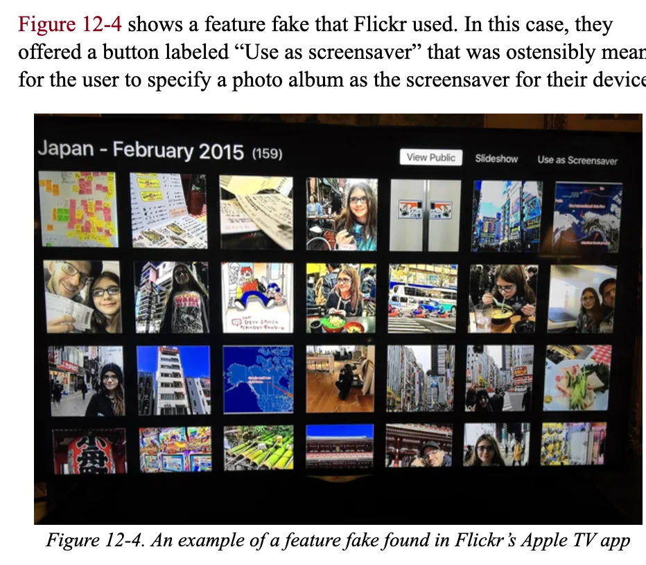

> [VISUAL]
> **Slide**: W04-23c2-Fake-Button-Click
> **Layout**: Split
> **Scene**: 用户点击按钮后出现的提示反馈界面，借此统计了真实的点击需求数据。
> **Text**: 点击后的意愿捕捉
> **Asset**: 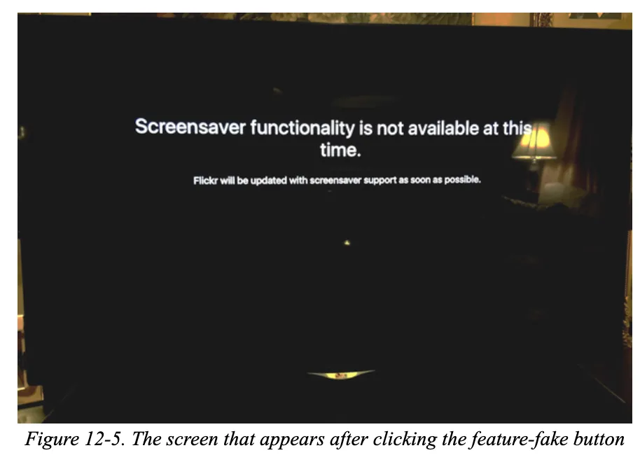

3. **假功能按钮**（即 **Feature Fake Button**）：
想在已上线的系统里加新功能又怕没人用？只需在界面放置一个**虚假的入口按钮**。当用户点击时仅提示“即将推出”，团队便能直接收集到**真实的点击数据**。据业界流传的经典案例，2004-2005 年间早期 Flickr 就曾靠一个毫无反应的“用做屏保”假按钮，精准测算出了用户需求，从而决定是否要真正花时间去开发这个复杂的功能。

> [VISUAL]
> **Slide**: W04-23d-Wizard-Of-Oz
> **Layout**: Split
> **Scene**: Taproot Foundation 的前台测试网页，看起来像是一个高度自动化匹配系统。
> **Text**: 绿野仙踪人工前台测试 (Wizard of Oz)
> **Asset**: 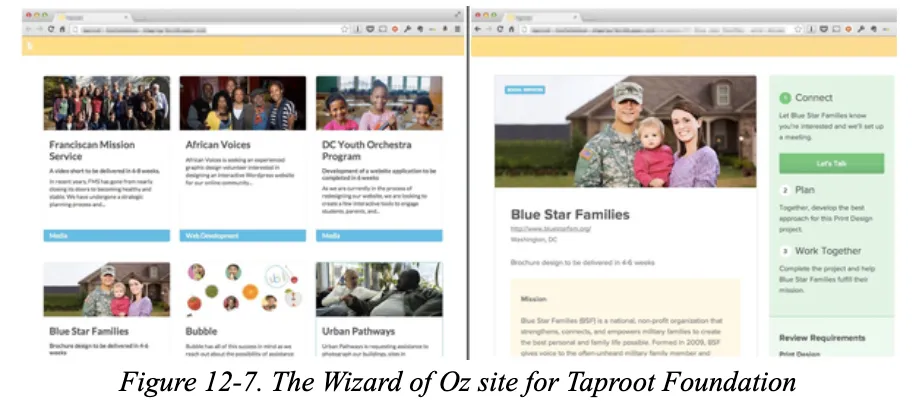

4. **人工模拟测试**（即 **Wizard of Oz MVP / 绿野仙踪法**）：
如果你们想设计一个“智能推荐”或“AI助手”功能，但团队里没人会写复杂的算法代码，怎么办？
不要硬着头皮去写那些容易出错的假代码。请使用交互史上著名的**人工绿野仙踪法**。
就像童话《绿野仙踪》里那个操控着机器吓唬来客的幕后魔术师一样——产品的前台看起来像是个全自动的智能系统，但后台其实是几个人在纯手工回复和处理数据。

> [VISUAL]
> **Slide**: W04-23d1-Wizard-Metaphor
> **Layout**: Split
> **Scene**: 绿野仙踪测试法隐喻：前台是一个极具科技感的 AI 机器人界面，而帷幕后面，是一个人正满头大汗地疯狂拉动拉杆和敲打打字机来伪装人工智能。
> **Text**: 幕后的魔术师
> **Asset**: 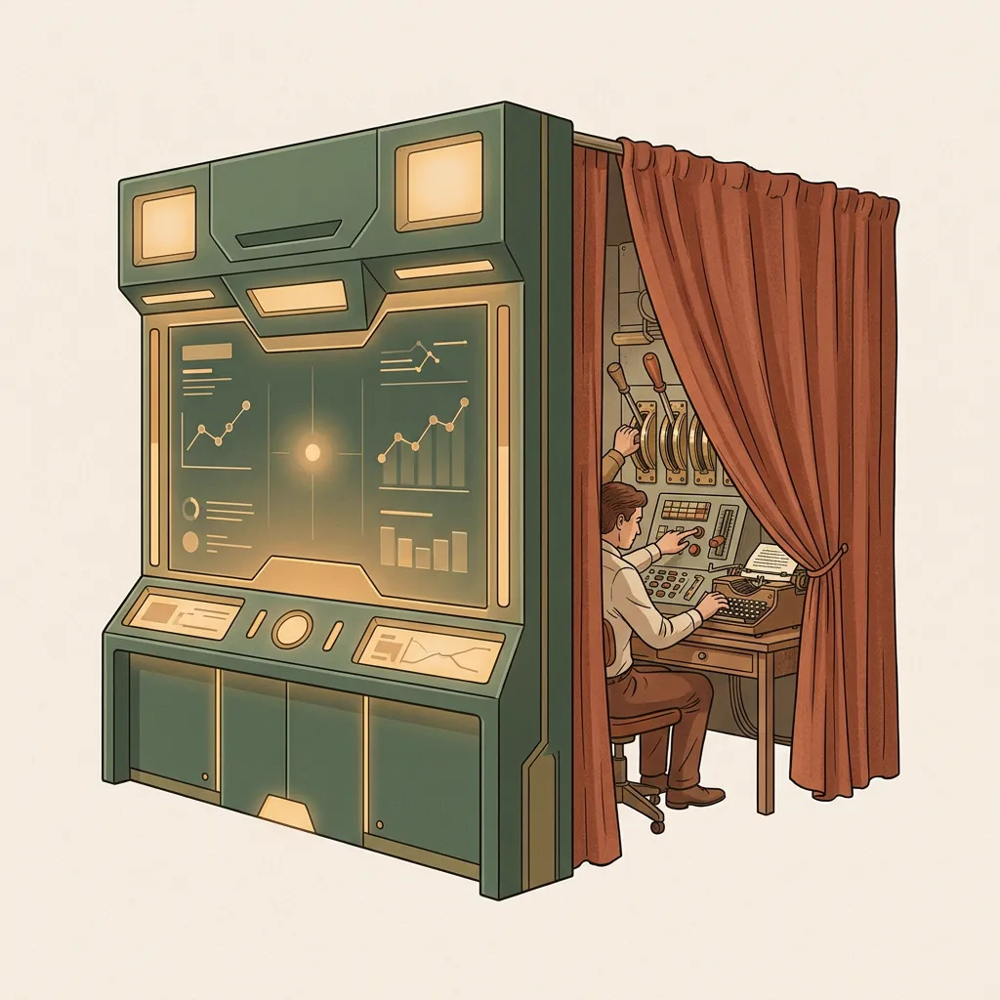

但在进入具体的绿野仙踪案例之前，我们要明确人工模拟的核心精髓：**千万别让用户发现背后是真人在操作**。

> [VISUAL]
> **Slide**: W04-23e-Wizard-Of-Oz-Examples
> **Layout**: Split
> **Scene**: Taproot 背后由人工驱动的 Trello 看板，展示所谓的“AI智能匹配”实际上是由人工在后端拖拽卡片完成。
> **Text**: 隐藏的人工测试后台 (Trello)
> **Asset**: 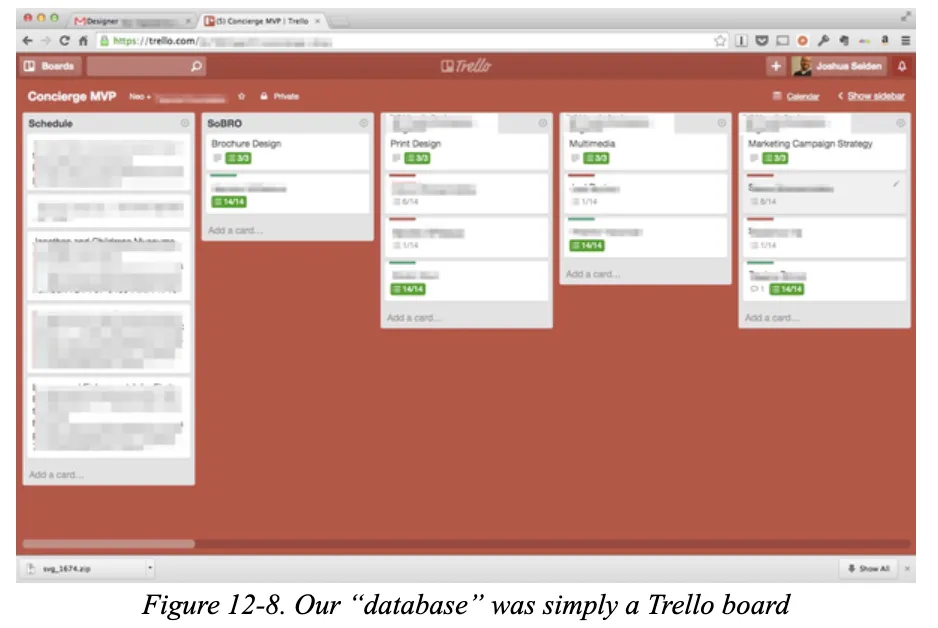

> [CASE STUDY]
> **AI 助手的“人工”智能与语音助手的幕后测试**
> 很多初创团队在做“AI 个人助理”时，第一反应是花几个月去微调大模型。
> 但聪明的精益团队会怎么做？他们只需用半天时间建一个微信群或者极简的聊天网页，对外宣称这是最新的“AI 助手”。
> 当用户在对话框里输入问题时，后台并没有连接任何大模型 API，而是坐着两个轮班的运营人员。
> 他们通过快速搜索资料，然后模仿 AI 的语气手动敲字回复用户。
> 依靠这种极其廉价的“人工”智能往来，团队快速探明了用户最喜欢问什么问题，以及他们对回复速度的容忍底线。这比直接投入资金调用 API 要高效安全得多。
>
> 同样，据多份公开报道，电商巨头 Amazon 在测试第一代 Echo 智能音箱的原型交互时，也采取了类似的谨慎策略。
> 在当时尚无成熟云端语义库的情况下，他们制作了一个假音箱外壳，并安排工作人员在隔壁房间监听。
> 测试者对音箱说话时，工作人员通过键盘检索答案，再操控机器发出合成语音回应。
> 依靠这种人工模拟的“绿野仙踪”测试，他们以极低的成本提前摸清了用户对机器助手的容忍度和询问习惯，为后续投入巨资构建真实的语音引擎奠定了基础。

> [VISUAL]
> **Slide**: W04-23f-MVP-Design-Rules
> **Layout**: Flow
> **Scene**: 提炼 MVP 设计的两个核心原则，文字像警示牌一样醒目。
> **List**:
> - 去除冗余
> - 锁定行为
> **Text**: MVP 的两大铁律
> **Asset**: 

> [ACTIVITY]
> **Type**: `Quiz`
> **Duration**: `2min`
> **Desc**: 工具选择：MVP 光谱的精准应用
> **Q**: 某 SaaS 团队想要验证假设：“企业用户愿意为‘一键生成月度数据报告’的高级付费功能买单”。但开发该报表引擎需要耗费两个月。为了在不写任何后端报表代码的前提下，精准获取用户真实的付费意愿数据，团队应优先选择哪种 MVP 验证工具？
> **Options**: A. 纸质原型：画出周报页面的草图在访谈时让用户传阅 | B. 假功能按钮：在当前界面放置“获取月度报告(¥99)”按钮，点击后提示“即将上线”并记录点击率 | C. 绿野仙踪测试：对外宣称已上线，实则让工程师在后台拼命手动写报表发给用户 | D. 着陆页测试：直接购买一个全新域名并设计精美宣传页
> **Answer**: `B`
> **Explain**: 假功能按钮（Feature Fake Button）是在已上线系统中测试新功能付费意愿的最廉价工具。纸质原型无法测试真实付费意愿（人们在口头上总是很慷慨）；而绿野仙踪虽然能测试，但人工写报表的成本远高于加一个按钮。按照“真相曲线法则”，在尚未确认用户是否愿意点那个按钮前，连人工介入的成本都不该花。

> [TEACHING MOMENT]
> **MVP 实验设计的验证铁律**
> 在构思 MVP 时，请务必遵循以下核心纪律：
> 
> 1. **直奔主题，去除冗余**：剔除所有边缘功能和修饰性的视觉设计，把核心痛点的解法直接呈现给用户。
> 2. **测量行为，而非观念**：不要依赖用户的口头承诺（"我觉得挺好"），必须设置真实的转化触点（如让他们点击假按钮、留下邮箱）来测量他们的真实行为。
> 3. **制造真实感**：即使背后是人工操作或纸片，前端呈现给用户的必须是一个看起来能跑通的连贯体验，而不是零散的草图。

### 4.4 验证行动：用最简单的方法找答案

从杂乱无章的访谈中提取核心问题，然后用**最直白、最廉价的手段**去测试用户反馈，这就是精益设计赋予我们的底气。

记住今天介绍的四种方法：**纸质原型、着陆页、假按钮、绿野仙踪**。它们按制作成本从低到高排列在光谱上。你要做的唯一决策是：根据你目前掌握的证据可靠度，选择**刚好够用**的那一种方式。

接下来进入今天最重要的 80 分钟实训工作坊。我会要求各组带上真实的访谈素材，在白板前完成四个步骤：**重审痛点 → 锁定核心需求 → 提出关键假设 → 构思验证方式**。你们将亲手把刚才学到的方法用在自己的项目上，请做好准备。
