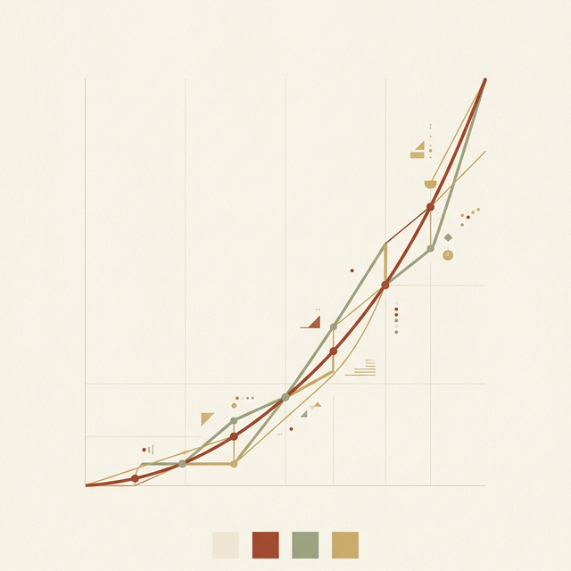
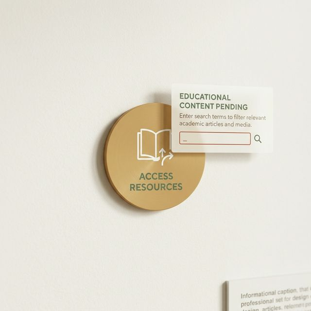

## 模块 4: MVP —— 最小可行「学习工具」(约 15 分钟)
<!-- BUDGET: 2700 chars | SLIDES: ≥5 | STATUS: done -->

### 4.1 认知谬误：打破“半成品等于 MVP”的思维定势

> [VISUAL]
> **Slide**: W04-21-MVP-Misconception
> **Layout**: Split
> **Scene**: 左侧是大众眼中的 MVP（一个少了一半轮子的残破汽车底盘），右侧是真实的 MVP 本质（一个低成本但完备的精密检测传感器，其唯一目的是探究用户是否需要移动）。
> *   **Text**: 认知谬误：MVP 是探测仪而非半成品
> *   **Asset**: 

说到 MVP，也就是 **最小可行产品**（Minimum Viable Product），这可能是数字产品开发中被误解最深的一个词。

如果询问非专业人士，他们可能会认为 MVP 就是为了赶进度而砍掉功能的**缩减版本**，或是勉强能运行的**粗糙程序**。这是对精益思想的误读。

当咱们在优先级矩阵的“第一象限”里，讨论如何用 MVP 开展验证时，请务必记住：**它根本不是软件开发的第一版代码**。甚至大多数时候，你连一行正式代码都不需要写。

在 Lean UX 的定义里，MVP 就是你用低成本的手段，为了探知那个“核心商业未知风险”，而部署的一次“**高效学习探测仪**”。它的核心使命，不是交付产品的使用价值，而是**换取关键的认知 (Learning & Insights)**。

请在心里默念：“团队目前最大、最容易导致失败的盲点在哪？” 然后，找点简易材料把它伪装起来，让用户与之发生真实互动。那个包装物，就是你的 MVP。

> [VISUAL]
> **Slide**: W04-22-Truth-Curve
> **Layout**: Flow
> **Scene**: 展示美国顶尖产品导师 Giff Constable 的著名 Truth Curve（真相曲线）。横轴是原型的保真度（投入的资产与时间成本），纵轴是已有证据的置信度。这是一条陡峭上升的抛物线模型图。
> *   **Text**: 真相曲线 (The Truth Curve)
> *   **Asset**: 

> [PHILOSOPHY]
> **科学哲学的内核：证伪主义 (Falsifiability)**
> 著名科学哲学家卡尔·波普尔 (Karl Popper) 提出，判断一个理论是否科学的最佳标准，不是看它能否被证实，而是看它能否被证伪。
> 哪怕你看到了一万只白天鹅，也无法“证实”所有天鹅都是白的；但只要你找到一只黑天鹅，就能瞬间“证伪”这个结论。
> MVP 的底层哲学与此相似：我们不要花三个月建系统去试图“证实”用户会买；我们要用低成本的方式，去试图“证伪”那个核心假设。

### 4.2 真相曲线：用证据强度严格限制保真度

在部署这层伪装前，各位必须信奉一条硅谷铁律：**真相曲线法则**，也就是 **The Truth Curve**。

这条曲线在白板上提醒所有人：“你投入在原型上的开发时长和资金（横轴保真度），必须被你手中已有的市场证据置信度（纵轴证据级别）严格限制！”

如果你只凭访谈里两句抱怨，就花两周时间让后端重写底层架构，这叫**高成本的盲目投入**。在精益架构师眼里，超出验证当前变量所需的**代码，都是对公司资源的极大浪费**。

### 4.3 极限光谱：在纸质与人工模拟间自由滑动

> [VISUAL]
> **Slide**: W04-23-MVP-Spectrum
> **Layout**: Flow
> **Scene**: 展示一条从左向右保真度渐进的 MVP 光谱，从最左侧的极简纸质原型向右推进，越过着陆页和假按钮，来到右侧的绿野仙踪后台人工模拟。
> **List**:
> - 纸质原型 (Paper Prototype)
> - 着陆页测试 (Landing Page)
> - 假功能按钮 (Feature Fake Button)
> - 绿野仙踪 (Wizard of Oz MVP)
> *   **Text**: 极简验证的光谱工具
> *   **Asset**: 

这意味着，MVP 并非某种固化的代码半成品，而是可以根据风险等级灵活选择的**验证光谱**。
从极简的涂鸦草图，到着陆页与假按钮，再到人工后台的绿野仙踪测试，你可以在光谱上自由滑动。其核心在于用最少成本验证核心风险。接下来，逐一拆解这四种方式：

0. **纸质原型 (Paper Prototype)**：
很多人会问："有没有最低成本的验证手段？" 当然有，那就是光谱最廉价的一端：**纸质原型**。
拿一叠白卡纸，用粗记号笔画出 APP 流程——每张纸代表一个屏幕，用户点击哪里，就手动抽出下一张纸片覆盖。这种纸片游戏，能在五分钟内暴露逻辑问题。相比在 Figma 里打磨一个月的动效，**纸质原型的真实验证效能更高**。

> [VISUAL]
> **Slide**: W04-23b-Landing-Page-MVP
> **Layout**: Screenshot
> **Scene**: 展示著名的 Dropbox 早期三分钟低保真演示视频截图，或者是充满诱惑力但实际只收集邮箱的着陆页。
> *   **Text**: 着陆页测试 (Landing Page)
> *   **Asset**: 

1. **着陆页测试**（英文称作 **Landing Page**）与其衍生的预售测温：
它是应对“真实购买意愿”的核心提问手段。无需触碰任何底层数据库，你只需搭建一个**极简着陆页**，写明产品价值并附带一个**抢先预订**的按钮。如果投入极低流量后毫无点击，那么这 300 块的域名费就帮你成功避开了百万级的**无效开发灾难**（著名的 Kickstarter 平台，本质上就是海量着陆页 MVP 的集合）。

> [VISUAL]
> **Slide**: W04-23b2-Dropbox-Video-MVP
> **Layout**: Split
> **Scene**: Dropbox 的经典三分钟演示视频画面，旁边的图表显示 Hacker News 流量如何将候补名单从 5000 瞬间推高至 75000。
> *   **Text**: Dropbox 视频验证 MVP
> *   **Asset**: 

> [CASE STUDY]
> **Dropbox：一个不存在的软件，和一段三分钟的视频**
> 硅谷的案例中，最经典的莫过于云存储巨头 Dropbox。
> 创始人 Drew Houston 当时面临一个困局。在 2007 年，开发一套能穿透 Mac、Windows 并处理底层文件的同步引擎，技术难度高，且需要漫长的开发时间。
> 投资人问他：“你怎么证明这东西有人要？”
> 他没有选择闭门造车。他做了一件出乎意料的事：他录了一段三分钟的演示视频。
> 视频里，他假装在演示一个做好的 Dropbox 软件。甚至还在操作系统里悄悄埋了几个彩蛋。
> 但实际上，当时的代码连基础功能的十分之一都没写完。那只是一个只有外观的剪辑秀。
> 他把这段名为“MVP”的视频扔到了 Hacker News 论坛上。
> 结果令人惊讶：那个通往申请表单的着陆页，一夜之间，排队注册的邮箱数从 5000 大幅增加到了 75000。
> 甚至连一行完整的后端代码都没跑起来，Drew 就用低成本的三分钟录屏，有效排除了这块领地上所有的“市场需求风险 (Market Risk)”。这才是高阶的商业验证。

> [VISUAL]
> **Slide**: W04-23c-Fake-Button-MVP
> **Layout**: Screenshot
> **Scene**: 早期 Flickr 界面底部放了一个诱人的 "用做屏保" 假按钮，点击后弹出 "即将推出" 的占位提示框。
> *   **Text**: 假按钮 (Feature Fake Button)
> *   **Asset**: 

2. **假功能按钮**（即 **Feature Fake Button**）与意向捕捉：
想在已上线的系统里加新功能又怕没人用？只需在界面放置一个**虚假的入口按钮**。当用户点击时仅提示“即将推出”，团队便可借此捕捉到**最真实的点击意愿日志**。早期 Flickr 就是靠一个毫无反应的“用做屏保”假按钮，精准测算出了用户需求，从而决定是否投入后端渲染架构的昂贵开发。

> [VISUAL]
> **Slide**: W04-23d-Wizard-Of-Oz
> **Layout**: Split
> **Scene**: 前端与后端的对比。前台是极简的输入界面或智能音箱，后台是紧张忙碌正在查资料人工回复的工程师。
> **List**:
> - 前台：极简自动化界面
> - 后台：全人工干预模拟
> *   **Text**: 绿野仙踪人工测试 (Wizard of Oz)
> *   **Asset**: 

3. **人工后台测试**（即 **Wizard of Oz MVP**）：
如果你想做的智能规则非常复杂，匹配引擎连边界到底在哪都不知道，怎么办？
不要写那些脆弱的虚假智能代码。请使用交互史上著名的**人工绿野仙踪法**。
就像童话《绿野仙踪》里那个操控着机器吓唬来客的幕后魔术师一样——产品的前台看起来像是个全自动的引擎，但后台其实坐着几个工程师，纯靠手工在处理数据。

但在进入具体的绿野仙踪案例之前，我们要明确人工模拟的核心精髓：**不让用户感知到后端的脆弱**。

> [VISUAL]
> **Slide**: W04-23e-Wizard-Of-Oz-Examples
> **Layout**: Split
> **Scene**: 上半部分是 Taproot 员工在地下室人肉收发邮件，下半部分是亚马逊员工躲在隔壁房间手动输入 Alexa 的回答指令。
> *   **Text**: 亚马逊与 Taproot 的幕后模拟
> *   **Asset**: 

> [CASE STUDY]
> **智能匹配系统与语音助手的幕后测试**
> 公益机构 Taproot 曾计划打造一个云端匹配网络，对接高级志愿者与非营利机构的需求。
> 这一构想涉及复杂的画像匹配和自然语言处理。如果按照常规路径，开发团队需要耗费数月构建后台算法。
> 但精益团队接手后，仅用两天时间搭建了一个前端登记网页模板。
> 页面上收集的表单数据并没有进入数据库，而是转化为邮件，直接发送给两位产品经理。
> 这两位管理员通过手工回复邮件，模拟了“算法自动匹配对接”的流程。
> 通过数周的人工邮件往来，团队快速探明了需求边界和用户的真实询问模式。这比直接投入开发算法更加高效。
>
> 同样，电商巨头 Amazon 在测试第一代 Echo 智能音箱的原型交互时，也采取了非常谨慎的策略。
> 在当时尚无成熟云端语义库的情况下，他们制作了一个假音箱外壳，并安排工作人员在隔壁房间监听。
> 测试者对音箱说话时，工作人员通过键盘检索答案，再操控机器发出合成语音回应。
> 依靠这种人工模拟的“绿野仙踪”测试，他们以极低的成本提前摸清了用户对机器助手的容忍度和询问习惯，为后续投入巨资构建真实的神经网络奠定了基础。

> [VISUAL]
> **Slide**: W04-23f-MVP-Design-Rules
> **Layout**: Flow
> **Scene**: 提炼 MVP 设计的两个核心原则，文字像警示牌一样醒目。
> **List**:
> - 去除冗余设计
> - 明确诱导与行为锁定
> *   **Text**: MVP 的两大铁律
> *   **Asset**: 

> [ACTIVITY]
> **Type**: `Quiz`
> **Duration**: `2min`
> **Desc**: 工具选择：MVP 光谱的精准应用
> **Q**: 某 SaaS 团队想要验证假设：“企业用户愿意为‘一键生成月度数据报告’的高级付费功能买单”。但开发该报表引擎需要耗费两个月。为了在不写任何后端报表代码的前提下，精准获取用户真实的付费意愿数据，团队应优先选择哪种 MVP 验证工具？
> **Options**: A. 纸质原型：画出周报页面的草图在访谈时让用户传阅 | B. 假功能按钮：在当前界面放置“获取月度报告(¥99)”按钮，点击后提示“即将上线”并记录点击率 | C. 绿野仙踪测试：对外宣称已上线，实则让工程师在后台拼命手动写报表发给用户 | D. 着陆页测试：直接购买一个全新域名并设计精美宣传页
> **Answer**: `B`
> **Explain**: 假功能按钮（Feature Fake Button）是在已上线系统中测试新功能付费意愿的最廉价工具。纸质原型无法测试真实付费意愿（人们在口头上总是很慷慨）；而绿野仙踪虽然能测试，但人工写报表的成本远高于加一个按钮。按照“真相曲线法则”，在尚未确认用户是否愿意点那个按钮前，连人工介入的成本都不该花。

> [TEACHING MOMENT]
> **MVP 实验设计的两条准则**
> 在构思 MVP 时，请务必遵循这两条原则：
> 第一，**去除冗余元素**。任何不能直接帮助验证核心假设的装饰性边框、复杂动画甚至后端数据库，都应被剔除。保真度只要能满足验证需求即可，多余的开发都是资源浪费。
> 第二，**锁定真实行为**。不要依赖用户的口头承诺，因为人们在想象中往往容易做出不切实际的许诺。我们要在界面上放置真实的转化触点（例如“获取名额”按钮）。
> 只有当用户真正付诸行动时，产生的数据才是最有价值的验证依据。

### 4.4 终局洗礼：用最廉价的手段获取真相

从复杂的调研数据中提取关键信息，用**最直白廉价的手段**获取真实的市场反馈，这就是这场精益洗礼赋予设计者的底气。在下堂**实训大课**上，我会要求各组带上真实的访谈素材，用客观分析逻辑，在这块白板前锁定你们必须优先测试的**核心实验点**。
