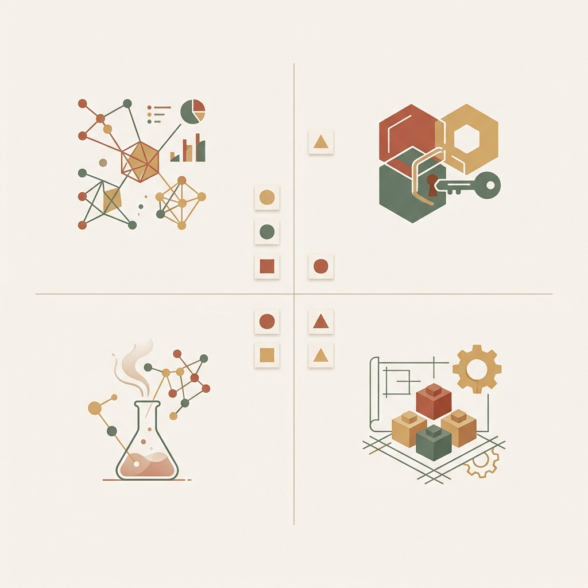

## 模块 5: 实验1(Exp1) 收官 —— 调研汇报与可行性清单 (约 80 分钟)
<!-- BUDGET: 0 chars | SLIDES: ≥0 | STATUS: done -->

> [VISUAL]
> **Slide**: W04-23g-Workshop-Exp1
> **Layout**: Grid
> **Scene**: 极简风格的四宫格看板，分别呈现"法医预检"、"锁定真凶"、"假设提炼"和"构思 MVP"四大实战关卡指令。
> **List**:
> - 1. 法医预检：验收调研素材与痛点重算
> - 2. 锁定真凶：深化 Proto-Persona 行为特征
> - 3. 假设提炼：四段式声明与 HPC 矩阵
> - 4. 构思 MVP：设计最廉价验证实验
> **Text**: 实战工作坊：从调研数据到 MVP 实验
> **Asset**: 
> **Source**: AI Generated

> [ACTIVITY]
> **Type**: `Workshop`
> **Duration**: `80 min`
> **Desc**: 基于 W03 田野调研数据，完成从 Proto-Persona 深化到 MVP 实验设计的全流程。
>
> 任务说明：
> 0. **法医预检 + 痛点重算 (20 min)**：各组将上周田野调研的**原始访谈录音、现场照片和 Proto-Persona Figma 草稿**提交到教学系统。教师快速抽查 2-3 组的素材真实性。素材不完整的组标注缺失项，允许课后补交。随后听录音回放，运用 Problem Statement 公式重新提炼业务问题陈述——必须包含量化指标。
> 1. **锁定真凶：Proto-Persona 深化 (20 min)**：只能做 1 个！用 3 分钟每人写 1 个受众标签便利贴，1 分钟全员投票只留 1 个主攻目标。然后死磕这个独苗——在 Figma 中更新 Proto-Persona 右上区的**行为核心特征**，必须列出 3 条极端的"核心行为预测变量"（注意：不是人口学标签！"25岁女性"不是行为特征，"每天凌晨 2 点反复刷新后台数据"才是）。完成后，组间交换 Figma 链接，用 Comment 标注对方画像中的**人口学陷阱**。
> 2. **假设提炼 (25 min)**：前 3 分钟老师在黑板上用某组数据示范"四段式假设声明（We believe... If... Attain... With...）"的写法。随后各组写出 3 条核心假设——每条只能包含 1 个功能变量，直接扔进 2x2 **HPC 优先级矩阵**进行生死角逐，锁定 Q1（高风险高价值）。
> 3. **构思 MVP (15 min)**：锁定 Q1 假设，从 **MVP 光谱**中选择验证工具（纸质原型/着陆页/假按钮/绿野仙踪），在白板上画出 MVP 方案并写下明确的**定量验证指标**。用 **MoSCoW 四条红线法则**标注每个功能的生死边界。

## 课堂总结：将精益阵列转化为肌肉记忆
<!-- BUDGET: 1800 chars | SLIDES: ≥4 | STATUS: done -->

### 5.1 闭环阵列：从调研到实验的结构化推演

> [VISUAL]
> **Slide**: W04-24-Summary-Pipeline
> **Layout**: Flow
> **Scene**: 展示从 "Pain Point (业务问题)" -> "Proto-Persona" -> "Hypothesis Matrix" -> "MVP Experiment" 的闭环流程图。
> **Text**: 验证回路：从痛点到 MVP
> **Asset**: 

这堂课要求大家摒弃凭直觉做设计的习惯。让我们回顾这套结构化的**验证回路**：

> **四步验证复盘**
> 1. **提炼信息**：摒弃**大杂烩式的用户抱怨**，必须锁定并量化客观的**业务问题**。
> 2. **聚焦画像**：烧掉长篇大论的报告，转而紧握最具实质差异化的**行为驱动力指标**。
> 3. **矩阵收敛**：停止发散的头脑风暴，用 HPC 矩阵死死咬住**第一象限**（高价值高风险）的**核心假设**。
> 4. **终局验证**：将假设转化为最简可行、成本极低的 **MVP 实验场**。

请把这十六个字变成你们的工作本能：**痛点量化、画像行为化、假设可证伪化、实验最廉价化**。

大家不仅应该意识到这个模型对你们目前破题工程的实用价值，更应该理解精益设计要求我们打破主观认知的局限性，在真实数据中寻找答案。

> [VISUAL]
> **Slide**: W04-24a-Growth-Mindset
> **Layout**: Split
> **Scene**: 对比两种心态模型：固定型心态将 MVP 失败视为个人能力的否定，成长型心态将数据挫败视为试错阶梯和系统优化的中枢数据。
> **Text**: 拥抱试错的成长型心态
> **Asset**: 

在面对 MVP 收集回来的无情数据时，团队的心态决定了项目的最终走向。这也是我们为什么要强调成长型心态的原因。

> [PHILOSOPHY]
> **接纳试错的成长型心态 (Growth Mindset)**
> 心理学家 Carol Dweck 关于"成长型心态"的研究，与精益设计理念不谋而合。精益模式中的 MVP 测试，目的不是通过验证失败来否定团队的能力。相反，假设验证机制是基于一个共识：即承认我们对市场的初期预测往往是有局限的。通过建立这种试错机制，将实验未能达标的结果转化为客观的优化依据，而不是相互指责的理由。这种客观、成长导向的心态，正是精益系统能够长期有效运转的核心支撑。

> [VISUAL]
> **Slide**: W04-24b-Office-Ribbon-MVP
> **Layout**: Flow
> **Scene**: 还原 Office Ribbon 界面大改版时的极简测试原型（无真实功能，只有外观点击热区探测），强调其规避核心风险的价值。
> **Text**: Office Ribbon 的极简测试原型
> **Asset**: 
> **Source**: Web Source

即使是行业巨头，在面对高风险的交互变革时，也同样依赖于极其谨慎的 MVP 验证流程，以此来规避可能导致巨大商业损失的误判。

> [CASE STUDY]
> **Office Ribbon 界面的原型验证与 MVP 测试**
> 在总结今天所有的理论之前，我们来看一个软件工程界的经典案例：微软 Office 2007 的 Ribbon（功能区）界面大改版。
> 在那之前，Word 和 Excel 的菜单栏结构非常复杂，嵌套了深达数层的下拉菜单。开发团队提出了一个高风险的假设：将隐藏的深层菜单重构为直观的大号图标面板 (Ribbon)。
> 这在 HPC 矩阵上属于 Q1（高价值高风险）区域：如果新用户觉得好用，将显著提升效率；但如果几亿老用户不适应新界面，微软将面临巨大的商业危机。
> 团队是如何做 MVP 的？他们没有一上来就修改底层代码。而是先做了一个只有最基础文本格式刷空壳、带点击热力追踪的低保真测试系统。然后邀请不同熟练度的用户，观察他们在没有培训的情况下，寻找"加粗"或"插入表格"等功能的本能反应。
> 经过长时间的迭代和重构，Ribbon 界面最终破茧而出，承受住了用户的适应期阵痛，并成为了数字办公交互的新标准。这就是假设驱动设计在工业界的成功实践。

> [ACTIVITY]
> **Type**: `Quiz`
> **Duration**: `3 min`
> **Desc**: 测验：应用"成长型心态"处理失败的 MVP 数据
> **Question**: 某团队耗时一周搭建了一个测试"一键智能排版"新功能的着陆页 MVP。投放广告后，页面点击率极低，预售转化率为零。团队内部爆发了激烈的争吵。按照精益系统中的"成长型心态 (Growth Mindset)"，团队负责人最正确、最能推动项目前进的复盘表态应该是什么？
> **Options**: A. 痛批市场部投放人群不精准，要求换一拨用户继续测直到数据变好为止 | B. 认为着陆页做得不够逼真，要求设计师花一个月把高保真系统彻底开发出来再测 | C. 承认这次测试"证明了我们的设计能力不行"，直接解散该核心项目组 | D. 庆祝这次"失败"，因为团队以极其廉价的成本证伪了一个高风险假设，避免了接下来三个月的无效开发
> **Answer**: `D`
> **Explain**: "成长型心态"要求我们将 MVP 的数据挫败视为试错阶梯和系统优化的中枢数据。实验数据不达标并非个人或团队能力的失败，而是以极低成本排除了一个错误的市场假设。选项 A 和 B 是典型的"确认偏误"，拒绝接受事实并盲目追加成本；选项 C 是"固定型心态"，将假设错误等同于能力不行；唯有 D 将证伪本身视为一种获取认知的胜利（Learning），这正是精益系统能够长期有效运转的核心支撑。

### 5.2 剥离偏见：拥抱"不完美"的真实数据

刚才的 80 分钟里，你们经历了一场高压的精益洗礼。你们被迫扔掉了脑海里那些大而全的产品幻想，用客观逻辑硬生生收敛出了一个只能跑通单一路径的 MVP 实验。

这才是真实的交互设计工作流——**不是在屏幕前闭门画几十个精美的图层，而是在白板前为了"到底砍掉哪个功能"而争得面红耳赤**。

> [VISUAL]
> **Slide**: W04-24c-Team-Assignment
> **Layout**: List
> **Scene**: 明确的三步课后细化指令清单卡片。
> **List**:
> - 完善独苗画像卡
> - 固化假设矩阵
> - 细化 MVP 实验边界
> **Text**: 课后实战细化指令
> **Asset**: 

现在，各组的白板上已经有了 MVP 的核心框架。但作为调研阶段的最终交付物，这个粗糙的骨架还需要在课后进行精细打磨，特别是对 MVP 实验边界的严格界定。

### 5.3 课后作业：用 MoSCoW 重塑 MVP 实验边界

> [VISUAL]
> **Slide**: W04-24d-MVP-Boundaries
> **Layout**: Split
> **Scene**: 左侧罗列本周作业交付物（1张独苗画像卡、3条核心假设及矩阵），右侧高亮展示针对"MVP 实验"的真假原型四条红线。
> **List**:
> - 必须有：核心实验触点 (不容协商)
> - 应该有：高保真伪装 (尽量掩饰)
> - 可以有：体验级点缀 (有空再做)
> - 绝不碰：真实后端代码 (死亡线)
> **Text**: 划定 MVP 生死边界
> **Asset**: 

> [TEACHING MOMENT]
> **界定 MVP 的"真假边界"**
> 在设计 MVP 实验时，为了防止大家一不小心又滑入"过度开发"的陷阱，我们必须在组内死死守住这四条边界红线：
> *   🔴 **必须有（实验生存线）**：为了验证假设，你**必须要放置的触点**。比如你要测购买转化率，一个看起来能点击的"立即支付"假按钮就是必须的。没有它，你根本收集不到数据。
> *   🟡 **应该有（视觉伪装线）**：为了让用户以为这是一个真产品而需要的**视觉伪装**。比如像样的 Logo、合乎逻辑的表单字段。
> *   🟢 **可以有（体验糖果线）**：比如点击按钮后的加载转圈动画，有空加一下显得更逼真，没有也无伤大雅。
> *   ⚫️ **绝不碰（开发死亡线）**：**真实的后端逻辑与数据库！** 今天我们在白板上吹得天花乱坠的智能匹配算法，在本次 MVP 中**绝对一行代码都不写**，全靠人工在后台发微信！

在布置课后作业之前，我们通过一道测试题来确保每个人都划清了这条生死红线。

> [ACTIVITY]
> **Type**: `Quiz`
> **Duration**: `2min`
> **Desc**: 边界裁定：识别 MVP 的死亡线
> **Q**: 某团队准备用绿野仙踪法测试用户是否愿意使用"AI自动写周报"的高级功能。团队使用四条红线法则界定工作量。以下哪一项任务最应该被划入"绝不碰（开发死亡线）"？
> **Options**: A. 在界面首屏放置一个高亮可点击的"立即生成周报"假按钮 | B. 接入真实的大语言模型 API 并完成复杂的微调与提示词工程 | C. 设计一个极其逼真的"AI 分析数据中..."的动态加载提示框 | D. 在系统中埋点，记录每天有多少人点击了该功能按钮
> **Answer**: `B`
> **Explain**: 按钮（必须有）和点击记录埋点（必须有）是获取用户意愿数据绝对必需的实验触点；加载动画（应该有/可以有）是让原型看起来像真实产品的必要伪装；唯独"接入真实 AI 接口（选项B）"是耗资巨大的后端真实逻辑，在没有验证需求前绝对不碰（死亡线），它的活应该由躲在后台的工程师人工打字来代替。

**下周任务交付物 (Task)**：
各组在下周课前必须提交最终电子版：
1. **1 份** 深度打磨的 A4 四大标准模块画像卡（Figma，必须源于真实赛道数据，必须包含行为怪癖与 JTBD 拆解）。
2. **3 条** 核心假设及 HPC 矩阵分布截图（每条假设只含 1 个功能变量，标注 Q1 优先理由）。
3. **1 份** 基于 MoSCoW 四条红线法则制定的 **MVP 实验明细表**（清晰标明哪些是假装的功能，定量验证的指标是什么）。

> [VISUAL]
> **Slide**: W04-25-Next-Steps
> **Layout**: Split
> **Scene**: 屏幕上出现一句全屏金句："在你的假设得到真实数据证实之前，你不过是一个拥有固执意见的陌生人。" (Until your hypotheses are supported by real data, you are just a stranger with an opinion.)
> **Text**: 下周预告与结语金句
> **Asset**: 

下周，我们将正式进入交互设计的信息架构阶段。请带着你们通过 MVP 验证的假设清单，去学习如何规划**目标导向的交互路径**。

当你走出这个教室，若有领导或客户要求"加一个炫酷的人工智能推荐"，你的脑海必须**条件反射地拉响警报**：

"你的**假设**是什么？"
"这里的**潜在风险**有多大？"
"我们最快能用什么廉价方式，去证明这个改动不会带来负面影响？"

停止纠结**像素是否完美**，优先确保你们的**验证机制是否有效**。下周见！
