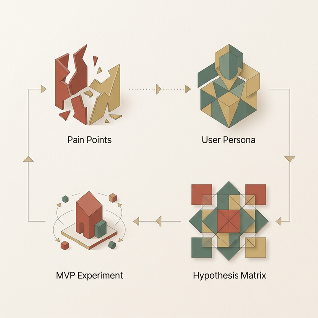

## 模块 5: 实验1(Exp1) 收官 —— 调研汇报与可行性清单 (约 80 分钟)
<!-- BUDGET: 0 chars | SLIDES: ≥0 | STATUS: done -->

> [ACTIVITY]
> **Type**: `Workshop`
> **Duration**: `80 min`
> **Desc**: 根据 JTBD 数据进行假设声明与 MVP 清单输出。
>
> 任务说明：
> 1. **痛点重算 (15 min)**：小组内汇总上一周的 JTBD 定性访谈录音日志。寻找重复出现的槽点，并重新提炼一句符合三要素标准的**业务问题陈述**。
> 2. **锁定真凶 (20 min)**：基于真实受访者，绘制一个三窗格的 **Proto-Persona（原型用户画像）**。严格避开人口统计学陷阱，必须列出三条区别于他人的“核心行为预测变量”。
> 3. **假设弹药库 (25 min)**：使用标准的 `We believe... If... Attain... With...` 格式，小组头脑风暴并写出 5 条极其精准的假设声明。然后共同画一个 2x2 优先级矩阵，互相讨论、辩论，无情地将这 5 条假设展开风险与感知价值判定。
> 4. **构思猎具 (20 min)**：找出绝对落在第一象限（高风险高价值）的唯一那条“王者假设”。以这个假设为标靶，设计一个最小可行性的“学习工具 (MVP)”！是着陆页？假按钮？还是绿野仙踪？写好你们即将在接下来两周内开展低保真原型制作的需求明细。

## 课堂总结 (约 10 分钟)
<!-- BUDGET: 1800 chars | SLIDES: ≥4 | STATUS: done -->

> [VISUAL]
> **Slide**: W04-24-Summary-Pipeline
> **Layout**: Flow
> **Scene**: 展示从 "Pain Point (业务问题)" -> "Proto-Persona" -> "Hypothesis Matrix" -> "MVP Experiment" 的闭环流程图。
> *   **Asset**: 

### 5.1 闭环阵列：极速运转的四大冷血手术刀

今天这堂课的内容极其密集，它实际上是对大家过往凭直觉做设计这种安逸习惯的一次暴力拆除。让我们最后再审视一下这套从含糊到锋利、再反哺实测的极速闭环武器阵列运转机器：

首先它逼迫你去抽干水分。你不能只是罗列各种大杂烩式的悲惨反馈经历和情绪性“需要个酷炫功能”，而是像挤破暗疮一样锁定并量化那个冰冷的业务问题。
然后那本几十页的重度精美插图用户模型调研手册被当众撕毁。转而在白板上采用敏捷共享式的火柴人小样草草提拔，强迫大家必须紧握最实质差异化的那些**行为驱动力指标**。
其三，你们那把从无头脑狂写功能描述的胡乱扫射的机关枪，终于停火了。它最终被重铸成了一支只有四段高精严苛格式组合的假设猎杀单发狙击步枪。并且，它只能在 HPC 这张 2X2 的生死矩阵上，瞄准那个最不可捉摸的狂野生死极度深坑——第一象限展开重型试击。

直到最后在这场搏杀的底盘，那张代表了残血丑陋组件敷衍外壳的MVP废渣贴图，被替换成了如精钢制探测针一般的极其廉价又隐蔽的学习实验场。

请诸位把这四把手术刀牢牢刻进你们的肌肉记忆里：**痛点量化，画像行为化，假设可证伪化，实验最廉价化。**这十六个字，就是我们从这堂课带走的全部武器弹药。忽略其中任何一条，就是在给未来的自己埋雷。

大家不仅应该意识到这个模型对你们目前这个大一破题工程大有用处，同时我也想告诉大家精益这种强迫剥去过度安逸傲慢、从虚假安全幻象中醒来的残酷行径。
> [PHILOSOPHY]
> **容纳错击与验证的生长——成长型心态 (Growth Mindset)**
> 心理学家 Carol Dweck 最具知名度的关于成长型心态的探讨在这里和它产生了奇异的高度重叠对焦。精益的这套模式与 MVP 等的各种虚晃布局不是让你因为失败而去感受到自我被全盘唾骂。真正的假设验证的心理机制是因为承认自我对未来的极其浅薄的预测缺陷，将一次次不甘落空的实验重定向和极度羞耻的数据击败转化为最中枢客观和最没有指责怨妇氛围的试错阶梯！这种心态和机制的融合正是精益系统能够跨时代保持其冰冷威信的核心中枢脉络支撑。

> [CASE STUDY]
> **Office Ribbon 界面的殊死验证与 MVP 回旋**
> 在总结今天所有的理论之前，我想用软件界一个极其著名的战役来作为收尾，那就是微软 Office 2007 著名的 Ribbon（功能区）界面大改版。
> 在那之前，Word 和 Excel 的菜单栏已经臃肿到了令人发指的程度，嵌套了超过 9 层深渊般的下拉菜单。开发团队提出了一个极高风险的假设：将所有隐藏的深层菜单全部抛弃，重构为一个直通式的大号图标面板 (Ribbon)。
> 这在矩阵上绝对是 Q1（高价值极高风险）的雷区：如果新用户觉得好用，那是划时代颠覆；如果占据全球几亿台电脑的老用户不适应罢工，微软的股价会直接腰斩。
> 他们怎么做 MVP？他们没有一上来就让几千名程序员改底层。他们先做了一个只有最基础文本格式刷空壳的点击热力测试系统。然后找来各种 Proto-Persona（从重度排版老手到什么都不懂的小白），观察他们在完全不给培训的情况下，去寻找“加粗”或“插入表格”的本能反应。
> 在长达月余的无数次抛弃和重构中，Ribbon 界面最终破茧而出，承受住了全球数亿人的抗拒阵痛，并最终彻底改变了人类的数字办公交互模式。这就是精益与假设驱动在工业界最高级别的铁血胜利。

### 5.2 剥离傲慢：换上法医的粗糙实验服去验尸

所以，在即将到来的实训中，请脱掉你们“我能写出完美代码”的骄傲外衣。换上法医的白大褂，拿起放大镜，去街道上、去论坛里，寻找那些微小的、真实的痛处。用一张粗糙的纸画出他们的脸，用四段冷酷的格式写下你们的狂赌，然后用最劣质也是最巧妙的伪装去诱捕真相。

> [TEACHING MOMENT]
> 1. **全员下沉调研**：按照之前组队的分配，立即启动针对你所选命题的实地/线上深入访谈，产出不低于 10 份原始记录。
> 2. **团队白板会议**：周末前，各组必须完成首次的白板冲刺，强制输出定版的 Proto-Persona 并且不得超过三个。
> 3. **假设矩阵拉练**：准备好你们的争吵，带上所有的便利贴，我们将下一堂课的实验室里，亲眼见证你们是如何残忍地把自己的精妙点子扔进碎纸机的。

下课！准备迎接真正的挑战吧。

> [VISUAL]
> **Slide**: W04-24b-MoSCoW-Task
> **Layout**: Split
> **Scene**: 左侧罗列本周作业交付物（Proto-Persona 卡、5条假设及矩阵），右侧高亮展示 MoSCoW 原则（Must, Should, Could, Won't）对剩余功能特性进行分类。
> **List**:
> - Must 必须有
> - Should 也许应该有
> - Could 假如不闲可以凑上去有
> - Won't 当前绝对不做
> *   **Asset**: 

### 5.3 课后围剿：MoSCoW 极刑与红线生死划分

今天各个小组在最后的 80 分钟实战里表现出了极高的挣扎反驳和辩论热情。作为这个痛点验证的最终收割之作，课后，大家需要回去继续精修。
**下周任务交付物 (Task)**：
在使用这套框架输出最终原型明细版时候，务必要带有针对该款 MVP 产品列表的深度把控，所以必须运用 **MoSCoW 方法** 对所有设想的功能继续划定红线（Must 必须有、Should 也许应该有、Could 假如不闲可以凑上去有、Won't 当前绝对不做）。最终交付 A4 三窗格画卡 1 份、假设清单最少 5 条及其标注 HPC 九宫格分布 1 图、以及这份最不可或缺的包含 Must 的 MVP 详细实验明细表。

> [VISUAL]
> **Slide**: W04-25-Next-Steps
> **Layout**: `Split`
> **Scene**: 屏幕上出现一句全屏金句："在你的假设得到真实数据证实之前，你不过是一个拥有固执意见的陌生人。" (Until your hypotheses are supported by real data, you are just a stranger with an opinion.)
> *   **Asset**: 

下周，我们将带领大家真正跨入交互设计的最底层迷宫——带着你们手中经过千锤百炼验证、用血泪换回的这份纯正 MVP 干涸名册单，去学习怎么在最冷酷的信息架构丛林中牵出能够贯穿全盘的**目标导向路径**。

作为一名立志成为一流交互专家的工程师，当你们走出这个教室以后，下一次如果有任何领导或客户拍着脑袋对你们说：“我觉得这里应该加一个很炫酷的人工智能推荐流”，你们的脑海里应该条件反射地拉响警报：
"你的假设是什么？" "风险如何？" "我们最快能用什么方式去证明这个改动不会炸毁整套体验？"

不要去纠结像素是否完美，去纠结它的钩子是否锋利。
我们下周见！
