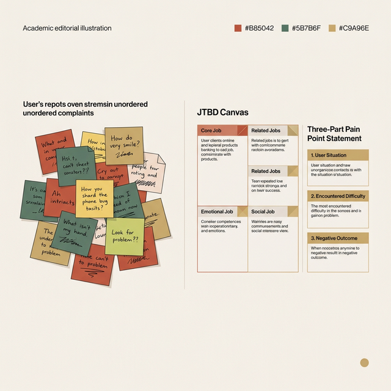
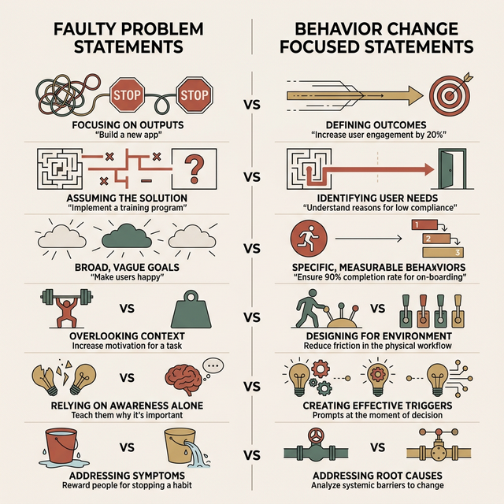
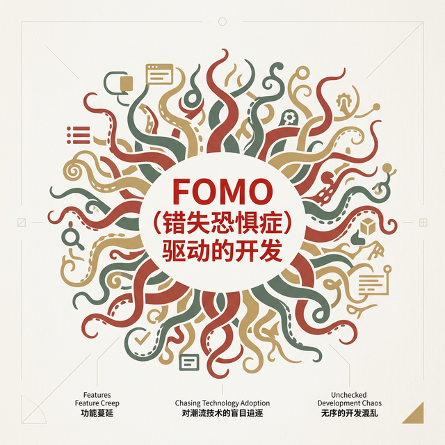
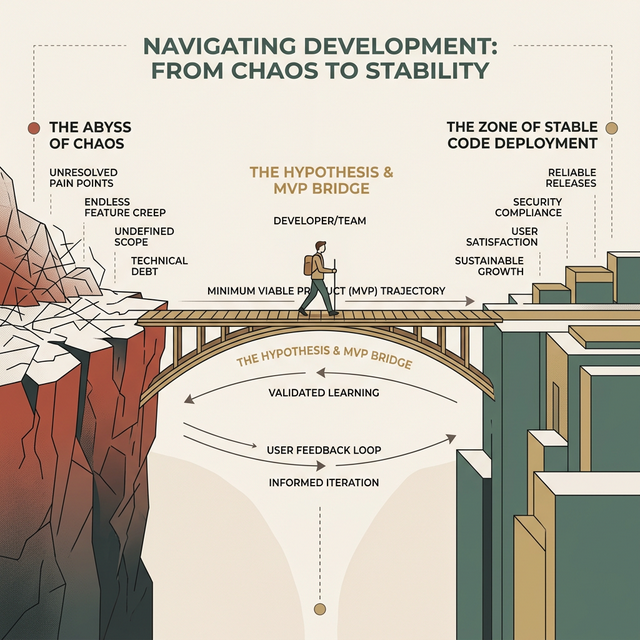

# W04 假设驱动与 MVP 构建: 用最小成本验证最大风险

> **本节目标**
> 掌握从模糊洞察到可验证假设的转化方法，理解 Proto-Persona、假设模板和假设优先级矩阵；认识 MVP 的本质——它不是"阉割版产品"，而是"学习工具"；学会根据风险等级选择正确的原型保真度。本节是 实验1(Exp1) 的收官课，学生将完成调研数据汇报，并输出互动应用的最小可行性清单。

*Tags*: `[THEORY]` `[LEAN UX]` `[CASE STUDY]` `[ACTIVITY]`

<!-- MATERIAL_BUDGET: {M1: 100%, M2: 100%, M3: 100%, M4: 100%, M5: 100%} -->

> [!INFO] 核心理论支撑 (Core Theory Matrix)
> 本讲教案底层认知模型强映射于《Lean UX》与精益创业方法论：
> * **[lean-ux-ch05-06-business]** Lean UX 画布起点：商业痛点界定与预期产出
> * **[lean-ux-ch07-proto-persona]** Proto-Persona 解构：抛弃人口统计学的行为特征建模
> * **[lean-ux-ch10-hypotheses]** 假设优先级矩阵 (HPC)：极坐标系下的双轴风险评估体系
> * **[lean-ux-ch12-mvp]** MVP 光谱定义：真相曲线与四种核心降维探测术

---

## 复习：W03 JTBD 痛点回顾 (约 15 分钟)
<!-- BUDGET: 2700 chars | SLIDES: ≥5 | STATUS: done -->

<!-- STAGE NOTE: 复习
本模块回顾 W03 定性调研方法论，汇报各组 JTBD 微访谈发现，复盘 Say-Do Gap、探针法与业务问题陈述三大核心要素，为假设驱动与 MVP 构建做铺垫。回链：知识目标 1（完整创作流程中的痛点洞察 → 假设驱动阶段衔接）。
-->

> [VISUAL]
> **Slide**: W04-01-JTBD-Review
> **Layout**: Split
> **Scene**: 左侧显示一堆杂乱的便利贴（用户的无序抱怨），右侧显示一个结构化的 JTBD 画布与三段式痛点陈述。
> **List**:
> - 观察胜于聆听 (Say-Do Gap)
> - 探针法深挖 (Probes)
> - 聚焦行为改变 (Outcome Metrics)
> *   **Asset**: 

欢迎回到《交互产品开发》的课堂。上周，你们像数字时代的侦探一样潜入校园的各个角落，完成了一次真实的**JTBD (Jobs To Be Done) 微访谈**。在此之前，我们先做一个简短的共识复盘。

还记得我们上周反复强调的那条田野调查铁律吗？**永远不要只听用户说了什么，要去观察他们做了什么。** 我们上节课提到了 "Say-Do Gap"（言行鸿沟）。大家可以回想一下身边一个极为常见的现象：健身房年卡。当你去采访一个刚办完健身卡的人，问他有什么期待，他大概率会满怀激情地告诉你：“这个健身房器材很全、洗浴条件很好，我计划每周来三次，练出腹肌。”这是他在理想状态下对你做出的"合理化陈述"（Say）。

但如果你调取他在门禁系统里的签到数据，真实情况是什么？由于天气冷、加班累、看剧爽等各种真实世界的阻力，他的实际出勤率可能不到每月两次（Do）。

如果我们作为一个软件设计团队，仅仅基于访谈里那个虚幻的“理想用户”去设计一套复杂的四次大循环健身打卡激励系统，最终一定无人问津。因为你设计的对象是一个只存在于幻觉中的自律完人，而不是那个下班后在沙发上瘫倒的血肉之躯。

> [PHILOSOPHY]
> **地图不等于疆域 (The Map is Not the Territory)**
> 在上世纪 30 年代，波兰裔学者阿尔弗雷德·柯日布斯基提出了这句著名的论断。在我们的调研语境中，用户口中讲出的词汇、抱怨，仅仅是对其复杂内心世界的粗糙抽象（地图），绝不等于他们内心真实的欲望与潜意识动机（疆域）。作为交互设计师，如果不能穿透语言的迷雾，你将永远在绘制错误的航线。

这就是为什么优秀的交互设计师从来不问“你想要什么功能？”，而是像外科医生一样，用**探针 (Probe)** 剖析用户在特定场景下的真实动机。我们试图理解的，不是他们想要一把更快的钻头，而是他们墙上缺一个怎样的洞。

> [ACTIVITY]
> **Type**: `Discussion`
> **Duration**: `10 min`
> **Desc**: 调研数据汇报
> 各组用 3 分钟轮流汇报上周的 JTBD 访谈发现。汇报结构必须包含：初始假设 → 访谈中遭遇的预期外洞察（摩擦点） → 最终收敛的"业务问题陈述"。

（这里请前排的三组派代表起立，用两分钟时间陈述你们提炼出的最核心的业务问题陈述。）

好的，听完了各组的汇报。刚才第二组提到一个绝佳的细节：受访者在访谈中强烈抱怨图书馆的座位预约系统“界面太丑，操作很繁琐”，甚至建议给系统加一套酷炫的暗黑模式和动画。但当你们深入追问他最后是如何抢座时，才发现他因为嫌弃界面繁琐，干脆自己写了个 Python 脚本去刷后台接口自动预约。

这是一个典型的定性研究宝藏！这说明了什么？说明“界面不酷”只是一个表层的情绪宣泄。他真正的底层痛点，根本不是美学维度的，而是**效率恐慌**与系统交互步骤冗长带来的不确定性。如果你们按照受访者最初的说法，去给预约系统重新画得光鲜亮丽，但依然需要点击 8 层菜单，你们不仅解决不了任何本质问题，还在制造一场金玉其外、败絮其中的糟糕设计灾难。

> [VISUAL]
> **Slide**: W04-02-Problem-Statement-Check
> **Layout**: Grid
> **Scene**: 展示几组对比，左侧是错误问题陈述（“给系统换个皮”），右侧是聚焦行为改变的陈述（“如何缩短操作链路将成功率提升 40%”）。
> *   **Asset**: 

所以，这也是为什么我们在精益画布的 Box 1 中，要求大家把这些零散的故事锻压成一句**结构化的业务问题陈述**。不要用“打造更直观的 UI”这种空洞的形容词堆砌。要严格量化——比如，“我们如何将座位系统中从登录到完成预约的平均时长，从原来的 65 秒缩短到 15 秒之内？”当你写下这句带有量化指标的陈述时，你的设计评估基准才真正具备了客观可测的标尺。所有不能被度量的事情，都不能被打磨。

> [TEACHING MOMENT]
> 很多同学在这个环节容易有一种失落感。你们在访谈中收集了几万字的逐字稿，听了无数悲惨的抱怨，最后只能提炼出这么干巴巴的、不到 100 字的问题陈述。你们会问：“老师，是不是太亏了？”这绝不叫亏。**所有伟大的产品构想，最初都是在做极其残酷的减法。** 削掉那些琐碎的细枝末节，正是为了让那唯一致命的底层矛盾，如刀刃般锋利地显露出来。

## 导入：功能臃肿的困境 (约 10 分钟)
<!-- BUDGET: 1800 chars | SLIDES: ≥4 | STATUS: done -->

> [VISUAL]
> **Slide**: W04-03-Feature-Bloat
> **Layout**: Split
> **Scene**: 屏幕左侧是一个布满数以百计图标、长列表和告警灯的传统企业级 ERP 界面；右侧放着遥控器，上面密密麻麻全是几乎没见过的按键。
> *   **Asset**: 

在基于刚才我们的问题陈述、进入用户画像和假设推演之前，让我们先来正视一个在数字产品世界里瘟疫般蔓延的癌症级现象——**Feature Bloat**，也就是功能臃肿。

大家请看大屏幕左侧。这是一个传统 ToB 企业级 ERP 系统的典型仪表盘视角。在上一周，我们详细探讨过人类的"工作记忆负荷"与"7±2法则"。这个界面，就是一个导致使用者瞬间发生 **Analysis Paralysis**（即决策瘫痪）的认知生化武器。几百个字段、嵌套的折叠菜单、不知道触发什么结果的图标按钮交织在一起。

这不仅仅是不好看，这是反人类的。为什么软件最终会变成这样？难道这些产品的工程师和设计师生来就喜欢折磨人？

> [CASE STUDY]
> **"暴君模式"带来的灾难与 Office 的反思**
> 我们不妨回顾一下上世纪 90 年代的老故事。微软在开发 Office 软件系列时曾陷入过一种"核军备竞赛"的错觉：每一次新版本发布，只要发现竞争对手（如 WordPerfect 等）增加了一个稍微有些噱头的新功能，他们就会陷入恐慌式跟进，要求开发团队必须把该功能加到顶部工具栏里。即使那个功能（例如极生僻的宏排版语法）只有千分之一的用户需要。
>
> 结局就是，早期的 Word 拥有多层嵌套迷宫般的庞大致命菜单栏，操作极其困难。直到后来通过海量的遥测日志他们才发现了一个让整个软件行业汗颜的真相：**80% 的用户，仅仅只使用了所有功能中的 20%**。这意味着什么？这意味着开发团队耗费了无数的深夜调试出来的那些 80% 的"长尾功能"，不仅没有创造实质性商业价值，相反，它巨大的存在感极具攻击性地干扰了核心用户，让那 20% 的日常高频操作变得步履维艰。这就是典型的被小部分聒噪用户绑架的"买方暴政 (Tyranny of the buyer)"。

微软最终是怎么扭转这场灾难的？2007 年，Office 团队的 Jensen Harris 主导了一次堪称教科书级的变革实验。他的团队没有召开高管会议拍脑袋决定"下一版该长什么样"，而是做了一件极其低调但震撼业界的事情：**用遥测日志给每一个按钮画了一张热力图。** 几亿次用户的真实点击数据清晰地显示，不到 30 个命令占据了绝大多数的使用频率。于是，那个庞大的嵌套菜单被彻底推翻，取而代之的是如今大家熟悉的**功能区 (Ribbon)**——它把最高频的操作放在最显眼的位置，把罕有人至的冷门功能收进"更多"折叠栏。这就是假设驱动在工程实践中的一次伟大胜利：不是凭直觉猜用户要什么，而是用真实的数据逼出真相。

> [VISUAL]
> **Slide**: W04-04-FOMO-Development
> **Layout**: Full
> **Scene**: 画面中央用鲜红色大字展示 "**FOMO** (错失恐惧症) 驱动的开发"，背景是不断疯狂生长的触手图标，寓意功能的无序蔓延。
> *   **Asset**: 

但并非所有公司都有微软的觉悟。这种功能臃肿现象的深层心理机制，本质上是软件工程团队与管理层的 FOMO，也就是错失恐惧症。每一个没人用的僵尸功能，最初诞生的时候都是在某个沉闷的会议室里，因为某个经理或销售一句听起来很有道理的话——"我觉得用户很有可能需要这个……"或者"万一大客户问起来我们不支持怎么办？加上吧，反正很快！"——而被拍脑袋强行塞进代码库里的。

这种心理在组织行为学里有一个精准的描述：**“Sunk Cost Fallacy”（即沉没成本谬误）与“Design by Committee”（即委员会设计）的致命联姻**。当会议室里有七八个利益相关者各自守护自己分管的板块时，最终输出的不是一个产品，而是一份没有人敢删减任何一行的政治妥协备忘录——因为删掉谁的功能，就等于宣判谁的部门不重要。

> [CASE STUDY]
> **Snapchat 2018 年的灾难性改版**
> 2018 年 2 月，Snapchat 在没有充分验证用户假设的情况下，对整个 App 进行了一次激进的大改版——将好友动态和媒体内容混合排列，彻底打乱了用户多年形成的操作心智模型。结果？**超过 125 万用户联署请愿要求撤回改版**。更致命的是，超级网红 Kylie Jenner 在推特上写了一句"有人还在用 Snapchat 吗？还是只有我觉得它已经不行了？"——这条短短 25 个单词的推文，直接导致 Snapchat 母公司 Snap Inc. 股价蒸发约 **13 亿美元**。一个没有经过假设验证就强推上线的决定，仅用一天时间就把一家上市公司推向了悬崖边缘。

> [VISUAL]
> **Slide**: W04-04b-Snapchat-Disaster
> **Layout**: Chart
> **Scene**: 左侧展示 Snapchat 改版前后的 App Store 评分暴跌曲线（从 3.1 星到 1.8 星），右侧展示 Snap Inc. 股价在 Kylie Jenner 推文后的断崖式下跌图。
> *   **Asset**: 

如果一个团队没有纪律，在不知不觉中就会滑向深渊。**不去做真实场景的实验，不去做最基础的用户验证，仅仅因为某件事"技术上可行（It can be built）"，我们就把所有的商业恐惧打包成丑陋的组件，硬塞给了毫无防备的用户。** 

> [DID YOU KNOW]
> **无效代码的坟墓**
> 著名的 Standish Group 曾在对近万个企业级软件项目的代码分析中指出：软件里有高达 **45% 的功能从未被用户点击过**，甚至另外 **19% 的功能极少被使用**。
> 这意味着什么？整个开发团队日日夜夜爆肝写出的代码，有超过一半，一上线就进了停尸房。

这种思维模式下，每一行实际上没人运行的代码都会变为高昂的维护地雷，每一个无人点击的按钮都会像牛皮癣一样透支着用户的视觉耐心。微软花了十年才爬出功能军备竞赛的泥潭，Snapchat 则在一天之内被拖入了深渊。

> [VISUAL]
> **Slide**: W04-05-The-Solution-Bridge
> **Layout**: Full
> **Scene**: 左侧悬崖是混乱的痛点和无穷无尽的欲求，右侧悬崖是安全的代码上线区，中间连接着一座极其窄小但坚固的桥梁——桥墩上写着硕大的 "Hypothesis (假设)" 和 "MVP (最小可行性产品)"。
> *   **Asset**: 

所以，在这堂课接下来的时间里，我们要直面核心命题：如何避免成为这种堆砌垃圾代码的帮凶？

答案，就是要在我们的工作流中嵌入一个过滤的黑魔法：**让"假设 (Hypothesis)"与"最小成本实验 (MVP)"成为你从洞察痛点跨越到代码上线的无情守门人。**

我们要训练一种克制的条件反射：把所有想要开发的功能特性，都首先降级视为一种"极高风险的不良资产"。除非你的小组成员，能在极低成本的快速试错中，用冷冰冰的数据向全组证明这个小改动确实能驱动用户达成某项我们追求的商业表现指标，否则，无论这想法多酷炫，**一行代码都不准写**。

大家准备好用剃刀把虚荣的赘肉都切掉了吗？但在挥刀之前，我们必须先搞清楚要对谁挥刀——正确的打击目标是谁。让我们共同进入第一场战役：干掉那个看似精致、实则虚伪沉重的传统用户画像。
