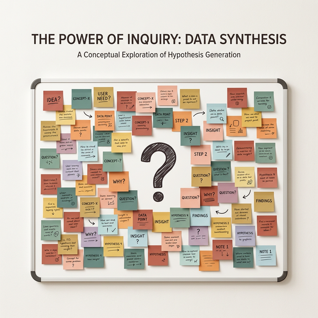
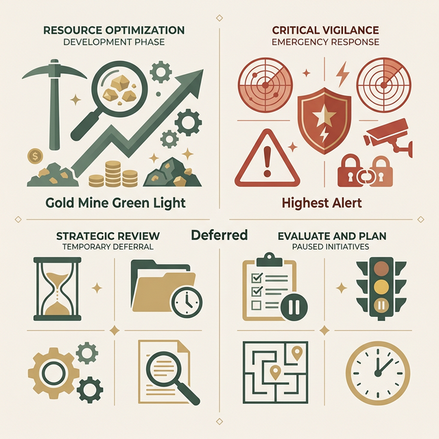

## 模块 3: 假设优先级——风险 × 价值矩阵 (约 10 分钟)
<!-- BUDGET: 1800 chars | SLIDES: ≥4 | STATUS: done -->

> [VISUAL]
> **Slide**: W04-18-Hypothesis-Backlog
> **Layout**: Full
> **Scene**: 一面贴满了几十张五颜六色假设便利贴的白板。画面中心打上一个巨大的问号：“我们要全做吗？”
> *   **Asset**: 

经过上一阶段极其火热的脑力激荡，你们小组的桌面上现在可能躺着十几条甚至几十条精密制导的假设声明。在初创团队或者热情高涨的黑客马拉松里，这往往是最危险的时刻。每一个点子看起来都很有宏大的潜力，每一个都仿佛能带领大家冲上热搜、颠覆行业。所有的工程师都会摩拳擦掌，巴不得立刻连夜搭建底层跑起环境，把所有代码拉满塞进这周的全部排期。

停下。放下你们悬在键盘上的手。

精益设计 (Lean UX) 的另一项也是最为核心残酷的纪律，叫做**无情优先级排序 (Ruthless Prioritization)**。

大家要记住软件工程的一个死理：任何试图同时验证所有假设并把全量“可能有用”的功能塞进去的团队，最终只有资金链断裂、系统崩溃及重度拖延延误发版这几种下场。我们明确把这么多带有强烈“如果...就会...”主观猜测属性的假设写下来的初衷，绝对不是为了把它们全做完！我们之所以写下来，正是为了在倾泄全副身家性命进 IDE 编译器前，用比市场更冷酷的手段，提前识别出系统设计中最致命的那些风险点，并将极其宝贵的“第一滴血”（也就是第一周的开发时间）完全倾注在那上面。你不解决最高悬崖，剩下的平地走得再快也是死局。

> [VISUAL]
> **Slide**: W04-19-HPC-Matrix
> **Layout**: Quadrant
> **Scene**: 展示著名的假设优先级矩阵 (Hypothesis Prioritization Canvas, HPC)。X轴标示为风险 (Risk)，Y轴标示为感知价值 (Perceived Value)。
> *   **Asset**: 

为了解决这个令所有产品经理头疼的“筛选与站队”的终极血腥拼杀局，业界目前最有威慑力的是这套由 Jeff Gothelf 等人推崇的 **假设优先级矩阵**（英文简称 **HPC**）。它用极其暴力的极坐标 2x2 切割系，无情地审判了你们的全部心血。

我们来拆解它的两根生死轴：
它的**纵向标尺是感知价值 (Perceived Value)**——在此我们要着重强调，之所以前置加上“感知 (Perceived)”二字，是因为在这玩意上线跑通真实商业环境之前，它依然只是一种极度不稳靠的单向推断。哪怕你们讲到天花乱坠地认为这项革新将极大提高购物车转化率并挽救世界，它在被现实测试前依然只是“你们团队自己单厢情愿感觉很值钱”。这是针对假象的一层面膜。
它的**横轴是风险程度 (Risk)**——这里的风险可供考量的层级非常之深。它绝不仅仅单指技术风险，比如我们要用一种极其诡异或是不成熟的 AI 视觉底层框架。它同时必须要全盘囊括诸如法律合规风险，比如这个功能会不会直接触犯最新的欧盟 GDPR 隐私法案导致公司面临巨额罚款。甚至还有老用户的抵触叛变风险，这会不会彻底惹怒那些已经习惯了五年老版本操作流程的死忠受众，从而引发综合信誉爆点危机。

> [VISUAL]
> **Slide**: W04-20-Quadrant-Rules
> **Layout**: Grid
> **Scene**: 屏幕四分切割，四个象限对应的具体红绿黄行动指令。第一象限（右上）为“最高警戒”；第二象限（左上）为“金矿绿灯”；下半区为“销毁/暂缓”。
> **List**:
> - Q1 高价值高风险：锁定！这才是真正的 MVP 实验地战区
> - Q2 高价值低风险：直接开发写代码，留好数据埋点后监控
> - Q3 低价值低风险：被归入储备库暂缓，除非涉及必须的基础设施底层
> - Q4 低价值高风险：直接就地销毁，连讨论都不用参与
> *   **Asset**: 

现在，带着所有的便利贴强迫成员必须做出这四种站队：

- **第四区（低价值、高风险）**：毫无疑义，扔进碎纸机。这种功能投入极高、随时可能弄巧成拙激怒用户，而带来的只是一些无关痛痒的边缘体验点缀。强上这类功能无异于慢性自杀犯罪。
- **第三区（低价值、低风险）**：这被称为“边缘填充长尾区”。原则上如果是商业功能，它绝不直接上排期。但这有一个极其重要的**基础设施例外 (Infrastructure Exception)**。什么是例外？比如“构建一套支持银联全通道外挂的底层购物车支付链路架构”。作为一个必须水管一样的底层搭建，它的价值并不能显著“差异化突出”你们品牌多么伟大吸引人（低附加价值感知），但是一旦你不建这个通道，企业将直接瘫痪断流无法收款。对于这种极其明确的特性基础管件体系，不要去过度折磨调研或是再做复杂的创新原型测试了，直接拍板找寻目前市面上的最佳实践或开源现成方案，用极短时间闭着眼快速构建过去即可。
- **第二区（高价值、低风险）**：这里被所有的业务线总监俗称为“绝对金矿区”。既然它既不伤筋动骨能低成本上线，又能极其有效地解决当前极其迫切的需求，答案只有一个：**直接去盖房子开发落地！** 这种区域的东西你绝对不要再写什么多冗长的用户测试白皮书或者大动干戈去纸壳子画原型做长篇大论了。把它写成极其短平快的敏捷 Story 塞给前端工程师们马上在下个迭代拉分支跑代码投递上生产部署服。你唯一要做的就是留好精准的用户漏斗操作统计打点以观测后续波动防备走眼即可。

> [VISUAL]
> **Slide**: W04-20b-Matrix-Sorting
> **Layout**: Diagram
> **Scene**: 动画演示大量原本散乱的浅黄色便利贴，像被磁铁吸附一样，自动飞向背后巨大的 2x2 HPC 四象限红绿灯网格中，并自动排序对齐。
> *   **Asset**: 

> [CASE STUDY]
> **危险的二区误判傲慢灾难**
> 在对便利贴做矩阵投放时，人性的傲慢经常会招致翻车。前些年某个很著名的下沉市场电商团队将“用极具轰炸性的社交链拉好友帮砍一刀来获取极低折扣”这一病毒裂变功能，强行归入了他们项目组看板上的左上方二区（高价值/低风险）——他们单纯依据“这个裂变发小红点的活动开发极其简单就两三天就能弄完（误以为低技术风险），且极易获取超大体量的裂变拉新获客量（高商业价值）”就火速强行上线全端口铺开。这犯了一个极其傲慢盲目的致命失误，他们在 Risk 横轴上，彻底忽略了“无休止的信息轰炸诱导会导致巨量的原本静默消费老客极度反感、并强行卸载甚至引发社交平台群体式退坑与严厉的舆情控诉（隐藏极高信誉与政策抵制风险）”。实际上这个是极度凶险且容易翻亡国局的右上角第一战区！

最为核心与危险的，是**第一象限（极高价值、极高风险区块）**。
这就正是进入了我们的生死红线战区。这些通常是那些颠覆性的假设，将是你决定这款全新破局产品能否在一片红海里一剑封喉绝杀的王室重任。但同时它们又像是极难掌握且尚未被驯服的爆燃物，随时可能导致整家初创公司因为技术黑洞、资金耗尽、或者触逆鳞的舆论而出现全面爆燃失控。对于这一象限内的所有核心雷区假设——请全组成员听好，我们绝对不要把它直接当做 Feature 送进代码版本仓库当作常规开发，我们要把它们单独挑出来，送进“验尸刑场”，去经历残忍到底的提纯打击。这就终于迎来了今天最重要的概念。
