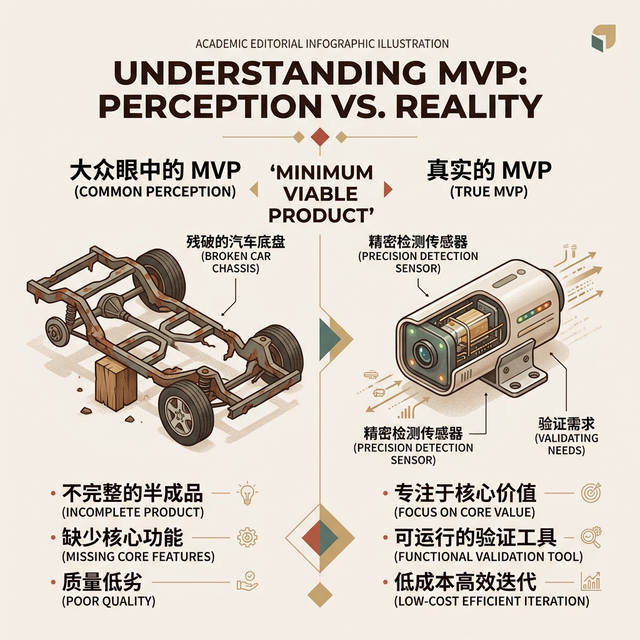
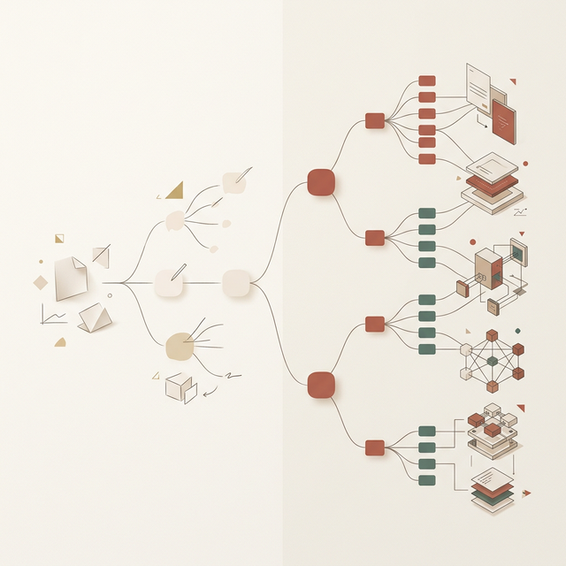
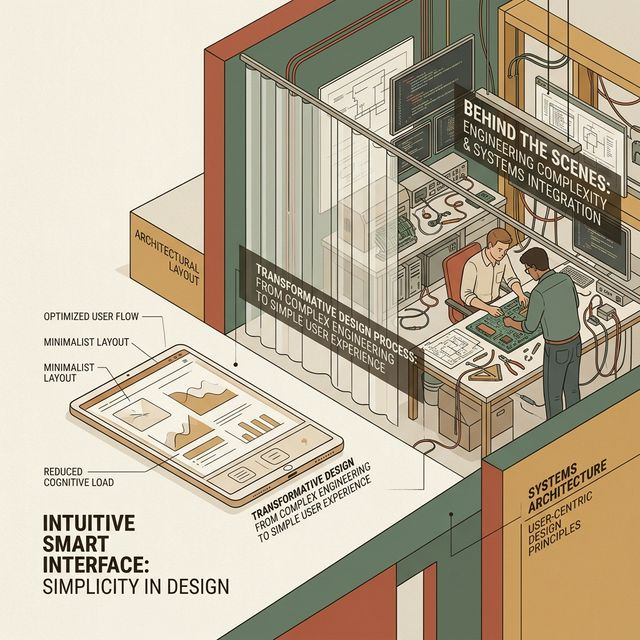

## 模块 4: MVP —— 最小可行「学习工具」(约 15 分钟)
<!-- BUDGET: 2700 chars | SLIDES: ≥5 | STATUS: done -->

> [VISUAL]
> **Slide**: W04-21-MVP-Misconception
> **Layout**: Split
> **Scene**: 左侧是大众眼中的 MVP（一个少了一半轮子、生锈、残破不堪的半毁汽车底盘），右侧是真实的 MVP 本质（一个低成本但完备的精密检测传感器，其唯一目的是探究用户是否需要移动）。
> *   **Asset**: 

说到 MVP，也就是 **最小可行产品**（Minimum Viable Product），这可能是互联网圈被误解最深的一个词。

如果你去问外行，他们会告诉你 MVP 就是：
“为了赶进度，砍掉所有动画的残缺版系统。”
“为了应付甲方，拼凑出的烂尾雏形。”
“只要程序不闪退，多难用都叫 MVP。”

这是对精益思想的彻底亵渎。

当咱们在优先级矩阵的“第一象限”里，讨论如何用 MVP 开展验证时，请务必记住：**它根本不是软件开发的第一版代码**。甚至大多数时候，你连一行正式代码都不需要写。

在 Lean UX 的纯正定义里，**MVP 就是你用最廉价的手段，为了探知那个“最致命的商业未知风险”，而部署的一次“极限学习探测仪”。**

它的核心使命，不是交付残缺的使用价值，而是**换取致命的真理认知 (Learning & Insights)**。

请在心里默念：“团队目前最大、最容易导致破产的认知盲区在哪？” 然后，找点破铜烂铁把它伪装起来，骗用户发生真实交互。那个包装物，就是你的 MVP。

> [VISUAL]
> **Slide**: W04-22-Truth-Curve
> **Layout**: Chart
> **Scene**: 展示美国顶尖产品导师 Giff Constable 的著名 Truth Curve（真相曲线）。横轴是原型的保真度（投入的资产与时间成本），纵轴是已有证据的置信度。这是一条陡峭上升的抛物线模型图。
> *   **Asset**: 

> [PHILOSOPHY]
> **科学哲学的内核：证伪主义 (Falsifiability)**
> 著名科学哲学家卡尔·波普尔 (Karl Popper) 提出，判断一个理论是否科学的最佳标准，不是看它能否被证实，而是看它能否被证伪。
> 哪怕你看到了一万只白天鹅，也无法“证实”所有天鹅都是白的；但只要你找到一只黑天鹅，就能瞬间“证伪”这个结论。
> MVP 的底层哲学与此如出一辙：我们不要花三个月去建一个系统来试图“证实”用户会买；我们要用最低成本、最极端的方式，去试图“证伪”那个一旦不成立大家就得下岗的核心假设。

在部署这层伪装前，各位必须信奉一条硅谷铁律：**真相曲线法则**，也就是 **The Truth Curve**。

这条曲线在白板上向所有人怒吼：“你投入在原型上的开发时长和资金（横轴保真度），必须被你手中已有的市场证据置信度（纵轴证据级别）严格限制！”

如果你只凭访谈里两句抱怨，就花两周时间让后端死磕高并发架构，重写 UI，这叫**重资产押注自杀**。

在精益架构师眼里，超出验证当前极小变量所需的**每一行多余代码，都是对企业资源的犯罪**。

> [VISUAL]
> **Slide**: W04-23-MVP-Spectrum
> **Layout**: Spectrum
> **Scene**: 展示一条从左向右极大保真度跃升的 MVP 渐进光谱，从最左侧的极简纸质原型向右推进，越过深水区的绿野仙踪，来到右侧局部代码系统。
> **List**:
> - 纸质原型 (Paper Prototype)
> - 着陆页测试 (Landing Page)
> - 假功能按钮 (Feature Fake Button)
> - 绿野仙踪 (Wizard of Oz MVP)
> *   **Asset**: 

这就意味着，MVP 绝非某种固化的半成品代码，它是一把应对不同层级危险水域的光谱散弹枪：
你完全可以根据手中的风险等级，在光谱上自由滑动。从最左端成本几乎为零、画在餐巾纸上的涂鸦草图，到极速上线的欺骗性着陆页与伪装按钮，再到深水区那由工程师在后台纯人工扮演的绿野仙踪魔法。这把极其灵活的光谱枪里的每一层挡位，都在试图用最极致的廉价物理杠杆，去撬动并证实那些足以摧毁整个团队的致命商业危机。接下来，让我们逐一拆解这四种极具破坏力的极限武器。

> [VISUAL]
> **Slide**: W04-23b-Landing-Page-MVP
> **Layout**: Screenshot
> **Scene**: 展示著名的 Dropbox 早期三分钟低保真演示视频截图，或者是充满诱惑力但实际只收集邮箱的着陆页。
> *   **Asset**: 

1. **着陆页测试**（英文称作 **Landing Page**）与其衍生的预售测温：
这是应对“这玩意真有人掏钱买吗？”的终极灵魂拷问。别碰数据库，直接在官网上挂个极简的单页。
放上产品的假想渲染图，写好价值主张，最后加上一个醒目的“99 美元抢先预订”或是“留下邮箱获取内测名额”的行动按钮。
扔点广告流量进去。如果一周过去，连个位数点击都没有，恭喜你，你用 300 块的域名费，帮公司省下了整整一年的无效开发。
著名的众筹平台 Kickstarter，其底层的商业狂欢逻辑，本质上就是成千上万个着陆页 MVP 在经历残酷的海选。

> [CASE STUDY]
> **Dropbox：一个不存在的软件，和一段三分钟的视频**
> 硅谷顶流案例中，最经典的莫过于云存储巨头 Dropbox。
> 创始人 Drew Houston 当时面临一个死局。在 2007 年，开发一套能完美穿透 Mac、Windows 并处理底层文件的无缝同步引擎，技术难度极高，且需要漫长的底层架构搭建周期。
> 投资人问他：“你怎么证明这东西有人要？”
> 他没有回去闭关锁国写半年代码。他做了一件震惊业界的事：他录了一段三分钟的演示视频。
> 视频里，他像极客一样假装在演示一个已经完美做好的 Dropbox 软件。甚至还在操作系统里悄悄埋了几个搞笑的彩蛋。
> 但实际上，当时的代码连基础功能的十分之一都没写完。那只是一个徒有其表的精巧剪辑秀。
> 他把这段名为“MVP”的视频扔到了 Hacker News 论坛上。
> 结果令人瞠目结舌：那个通往测试版申请表单的着陆页，一夜之间，排队注册的邮箱数从 5000 跃升飙涨到了 75000。
> 甚至连一行完整的后端代码都没跑起来，Drew 就用一段极其廉价的三分钟录屏，彻底扫除了这块领地上所有的“市场需求风险 (Market Risk)”。这才是真理级别的高端验证。

> [VISUAL]
> **Slide**: W04-23c-Fake-Button-MVP
> **Layout**: Screenshot
> **Scene**: 早期 Flickr 界面底部放了一个诱人的 "用做屏保" 假按钮，点击后弹出 "即将推出" 的占位提示框。
> *   **Asset**: 

2. **假功能按钮**（即 **Feature Fake Button**）与意向捕捉：
在一个已经上线的庞大系统里，想加个新功能，但怕吃力不讨好翻车？直接贴个空心假皮。
比如，产品经理提议为一款运动记账 App 开发“一键生成朋友圈高光长图”的复杂图文渲染引擎。工程师压根不用写后端画图代码！
只要在界面老位置，放一个真金白银的假分享按钮。只要用户好奇点击，就会弹出一个优雅的弹窗：“该前沿功能正在加紧建设中，下个大版本将优先为您开启体验通道！” 
团队仅靠在后台默默收集这个假按钮的一周点击计数日志，就准确探知了真实的转化需求量。这也是海外团队测算新功能接受度的惯用白嫖伎俩。这种方法有一个更显赫的早期发明者——翻开 Flickr 的产品历史档案，你会发现他们曾在网页版底部显眼处放过一个诱人的"用做屏保 (Use as Screensaver)"按钮。点击后什么也不会发生，仅仅弹出"即将推出"的快乐文案。但后台点击日志已经快乐地告诉团队：用户对这个功能的欲望被量化成了寒冷的数字。如果日点击量少得可怕，那么像素级渲染引擎的巨额开发成本，就被一个假按钮提前封印掉了。

> [VISUAL]
> **Slide**: W04-23d-Wizard-Of-Oz
> **Layout**: Split
> **Scene**: 极其鲜明的幕后黑手对比。前台是极简的输入界面或智能音箱，后台是满头大汗正在查资料人工回复的工程师。
> *   **Asset**: 

3. **绿野仙踪的终极魔法**（即 **Wizard of Oz MVP**）：
如果你想做的智能规则极度庞杂，底层匹配引擎连边界到底在哪都不知道，怎么办？
不要写那些脆弱的 IF-ELSE 伪智能。请使用交互史上著名的**人工绿野仙踪法**。
就像童话《绿野仙踪》里那个操控着机械巨头吓唬来客的幕后矮小魔术师一样——产品的前台看起来像是个全自动的科幻级引擎，但后台其实坐着几个满头大汗的人类工程师，纯靠手工在处理数据。

但在进入绿野仙踪之前，很多同学可能会问："有没有比着陆页和假按钮更原始、成本更低到几乎为零的验证手段？"当然有。这就是 **纸质原型**，也就是 **Paper Prototype**，它是整个 MVP 光谱中最左侧、最廉价的一端。拿一叠白卡纸，用粗记号笔画出 APP 的交互流程——每张纸代表一个屏幕，用户点击哪里，你就手动抽出下一张纸片覆盖上去。这种看起来可笑的纸片翻页游戏，却能在五分钟内暴露你流程设计中最要命的逻辑断裂点：用户在哪个环节开始等待不耐烦？什么时候他会本能地伸手去触摸那个实际上不存在的"返回"按钮？这些被手指触发的真实还原，比你在 Figma 里打磨了一个月的像素级动效违和感更具有致命的杀伤俱价比。

> [CASE STUDY]
> **用键盘手敲出的智能匹配大网与亚马逊的隐秘监听室**
> 著名公益机构 Taproot 曾想要打造一个庞大的云端智能匹配网络，让高级志愿者与非营利机构的痛点能零误差对接。
> 这一听就涉及极度复杂的画像匹配算法和自然语言分析。如果按照传统做法，团队得花大半年去老老实实写后端推演。
> 但精益团队接手后，他们花了两天时间，用现成模板搭了一个极度高端、看似极其专业的假前台登记网页。
> 那些极其精细的选项表单填完后，其实根本没有进入什么数据库。
> 所有数据全变成了一封封长长的求助邮件，直接发送到了地下室里两位产品经理的收件箱中。
> 这两位苦力盯着满墙的白板，强行通过手工收发邮件，去高仿伪装“云端算法一秒对接成功”。这种极致逼真的人工模拟流，看似愚蠢，实则是神来之笔。
> 几个星期每天几百封的人肉邮件往来，短时间内逼着管理员蹚平了所有的边界雷区和真实用户的模糊询问。这比写一堆根本用不上的废代码要有效百倍。
>
> 即使是千亿市值的电商帝国 Amazon，在测试第一代 Echo 智能大音柱原型的自然交互时，也极度克制。
> 那时候根本没有成熟的云端语义库。在完全没写复杂底层理解逻辑前，他们造了一个假音箱外壳，派人工偷偷躲在隔壁黑屋里。
> 测试者对音箱喊话，黑屋里的员工戴着耳机听着，双手飞速敲击键盘查询答案，然后操控机器发出合成语音回应。
> 他们利用这种纯手工的绿野仙踪，提前低成本测试了大众对机器助手的语气容忍度、常见询问边界，才最终敢投入几十亿起建真实的神经处理架构。

> [TEACHING MOMENT]
> **MVP 实验设计七准则之首：冷酷的断舍离与行为捕捉**
> 在下周实训课构思你们的 MVP 时，务必死磕这两条铁律：
> 第一，**无情阉割多余触角**。一切不能直接帮忙验证核心假设的装饰性边框、花哨的动画、甚至完美的数据库，哪怕再容易做，也必须全部剔除。保真度只要高过刚需水位线一毫米，都是罪恶。
> 第二，**明确诱导与行为突破锁定**。不要再去街头问别人“你会买我们的产品吗？”。这毫无意义，人类在想象中都是极为大方的谎言家。不要听用户说了什么，直接在简陋的界面上挂上一个“点击预授扣款体验”的血红按钮！
> 只有当那根手指真正按下鼠标的那一刻，那个带有抗拒压力的真实支付或分享行为底线，才是你们能够带回会议室、最无从掩盖的试金石。

从杂乱无章的混沌抱怨中，精准削取核心真理；用看似粗糙却直指人心的廉价手段，去骗过残酷的市场并获取真实反馈数据。
这就是这场名为精益的洗礼，赋予现代数字工匠们最大的底气。
在下堂实训大课上，我会要求你们带来沾满泥土的真实访谈素材，在这块白板前，用冷血的大清洗逻辑，最终锁定属于你们组唯一的生死裁决实验点。
