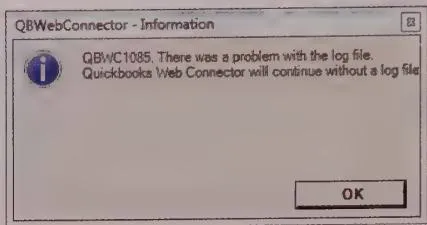
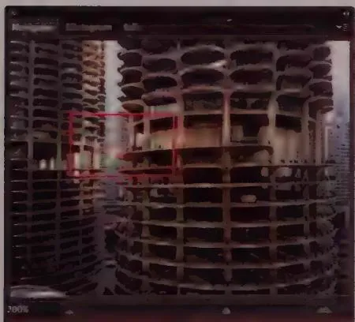
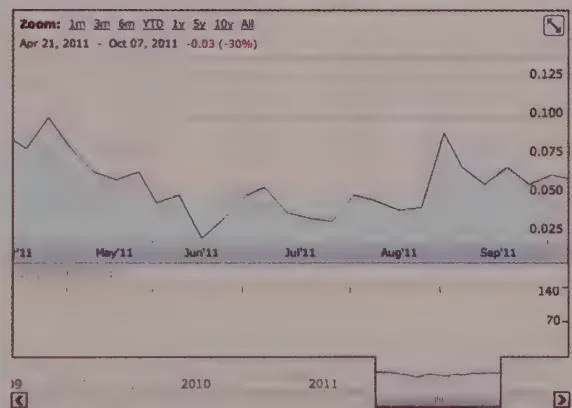
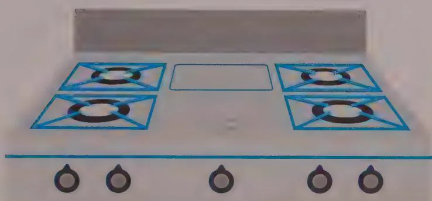
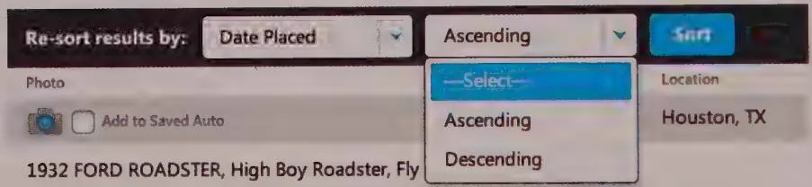
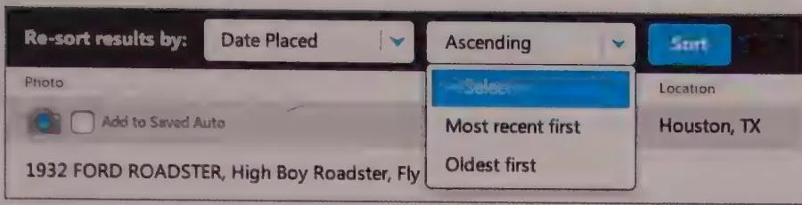

## 教材位置
- 原著：Alan Cooper et al., *About Face: The Essentials of Interaction Design*
- 章节：Chapter 26 — REDUCING WORK AND ELIMINATING EXCISE; Chapter 27 — Eliminating Excise
- 范围：全文

## 核心知识提取

### 1. 降低工作量与消除附加税 (Reducing Work and Eliminating Excise)
用户在与数字产品交互时需要执行四种类型的工作，这些工作通常构成了一种对用户的认知和物理努力征收的**附加税 (Excise)**：
- **认知工作 (Cognitive work)**：理解产品行为、文本和组织结构。
- **记忆工作 (Memory work)**：回忆产品行为、命令、密码、数据对象和控件的名称及位置，以及对象之间的关系。
- **视觉工作 (Visual work)**：确定目光在屏幕上的起点，在众多对象中找到某个对象，解码布局，以及区分具有视觉编码的界面元素。
- **物理工作 (Physical work)**：击键、鼠标移动、手势（点击、拖动、双击）、切换输入模式，以及导航所需的点击次数。

### 2. 目标导向任务与附加税任务 (Goal-Directed Tasks versus Excise Tasks)
- **目标导向任务 (Goal-directed tasks)**：直接有助于达成最终目标的任务（例如，驾车时操纵方向盘向目的地行驶）。
- **附加税任务 (Excise tasks)**：不能直接推动目标实现，而是为了满足工具本身或外部代理的需求而产生的额外工作（例如，必须先打开车库门才能开车，或者在软件中配置网络和备份文件）。
- **设计原则 (Design Principle)**：尽可能消除附加税 (Eliminate excise wherever possible)。界面中附加税的存在是导致用户对数字产品不满的首要原因。

### 3. 附加税的类型 (Types of Excise)

#### 导航附加税 (Navigational excise)
除特殊情况外，用户在软件中导航浏览很少与他们的目标保持一致，而是由于开发者的实现模型暴露。
- **多界面导航**：在多个屏幕、视图或页面之间导航（涉及大量的注意力转移，打断用户的心流，最易导致迷失）。
- **窗格间导航**：在相邻或重叠（如选项卡）的窗格间导航（过多的窗格导致视觉混乱，强制增加认知成本）。
- **工具与菜单间导航**：频繁使用的相关工具不应隐藏在深层菜单中。
- **信息导航**：过度依赖滚动 (Scrolling)、平移和缩放 (Zooming) 来浏览信息。

#### 拟物化附加税 (Skeuomorphic excise)
- 盲目将机械时代 (Mechanical-Age) 的模型复制到数字界面中。这种表现形式虽然起初易于理解，但由于未发挥数字环境的优势，随着熟练度的提升，管理这些隐喻本身就成了纯粹的附加税。

*Figure 12-5: 在 iOS 6（左）中，苹果沉溺于一些拟物化附加税，而这些设计在 iOS 7（右）中被完全净化了。*

#### 模态附加税 (Modal excise)
- 打断用户高效心流 (Flow) 的模态错误信息或确认对话框。
- **设计原则 (Design Principle)**：不要用愚蠢的做法打断进程 (Don't stop the proceedings with idiocy)。软件应当在后台自动纠正小错误，而不是迫使用户确认毫无意义的警告。

*Figure 12-6: 丑陋且无用的错误消息框，用愚蠢的方式打断了进程，甚至没有给出修复选项。*

#### 让用户请求许可 (Making users ask permission)
- 许多系统把输入和输出分为不同界面（看到信息后，必须“请求许可”跳转到另一页面才能修改）。
- **设计原则 (Design Principle)**：不要让用户请求许可 (Don't make users ask permission)；在输出的地方允许输入 (Allow input wherever you have output)。

#### 风格化附加税 (Stylistic excise)
- 过度风格化的图形设计，迫使用户付出额外的视觉工作来解码哪些元素代表控件、哪些仅是装饰。

#### 附加税具有情境性 (Excise Is Contextual)
- 某个任务是目标导向还是附加税，取决于人物角色 (Persona) 的特定情境。只有将其与真实的人物角色目标进行对比，才能判断一项功能究竟是不是附加税。

### 4. 消除附加税的策略 (Eliminating Excise)

为了消除最普遍的导航附加税，可采取以下核心设计策略：
- **减少前往的节点数 (Reduce the number of places to go)**：将模式、对话框和屏幕数量降至最低；限制窗格数量；缩减不必要的控件；并尽量减少滚动需求。
- **提供路标 (Provide signposts)**：利用一致性、持久性对象 (Persistent objects) 帮助用户定位方向，例如主窗口、常驻菜单栏、工具栏，以及网页顶部的固定导航栏。
- **提供全局概览 (Provide overviews)**：在处理深层内容时为用户定位。形式包括图形概览、文本概览（如面包屑导航）以及带注释的滚动条。

*Figure 12-10: Photoshop 中的 Navigator 面板（左）及 Google Finance 图表底部（右），皆为用户提供了极为有效的全局缩略概览。*

*Figure 12-11: 亚马逊面包屑导航 (Breadcrumb)，既展现了全局路径，又充当了导航工具。*

- **合理映射控件与功能 (Properly map controls to functions)**：
  - **物理映射 (Physical mapping)**：控件的物理排列应直接对应它所控制的对象。

  
  *Figure 12-13: 物理映射极差的炉灶面板。直线排列的旋钮让用户不断猜测目标，增加操作隐患。*
  
  
  *Figure 12-14: 清晰的物理映射设计，旋钮的空间位置直观暗示了它控制的燃烧器。*
  
  - **逻辑映射 (Logical mapping)**：概念和动作的逻辑必须符合人类的心智模型。

  
  *Figure 12-15: 逻辑映射失败案例。过滤时间使用“升序/降序”，不符合常规人类思维。*
  
  
  *Figure 12-16: 清晰的逻辑映射案例：使用“最新/最旧”能被大脑瞬间解码。*

- **避免层级结构 (Avoid hierarchies)**：
  - 开发者习惯以深层嵌套的树状结构（实现模型）来存储数据。但普通用户的物理存放心智模型其实是**单层分组 (Monocline grouping)**（如将文件归为几大类平铺）。
  - **解决方案**：向用户呈现基于单层分组的简单界面结构，但在底层用深层检索架构支撑。
- **不盲目复制机械时代模型 (Don't replicate Mechanical-Age models)**：
  - 挣脱物理媒介的原型束缚，发挥数字媒介独有的延展能力。

  
  *Figure 12-17: 典型的机械时代复制品——局限于现实纸张分页的死板数字日历。*
  
  
  *Figure 12-18: 专为数字时代重新设计的连续滚动式日历，突破了硬性跨月调度的限制。*

### 5. 其他常见附加税陷阱 (Other Common Excise Traps)
- 强迫用户到另一个窗口去执行影响当前窗口的功能。
- 强迫用户记忆文件在深层系统中的确切位置。
- 强迫用户频繁调整窗口大小或拖移窗口。
- 强迫用户重新输入早已存在的个人设置。
- 强迫用户为满足系统内部的数据完整性需求，填写毫无用处的琐碎表单字段。

## 关键图表索引

| Figure | 教材图注 | 教材原文路径 | 迁移状态 |
|:---|:---|:---|:---|
| Fig 12-1 | Microsoft Excel 标签页窗格 | `images/e0198684...webp` (Chapter 26) | ✅ 已迁移 |
| Fig 12-2 | Adobe Illustrator 选项卡调色板 | `images/48a3f0a3...webp` (Chapter 26) | ✅ 已迁移 |
| Fig 12-3 | Adobe Photoshop 工具面板导航附加税 | `images/832d8d8d...webp` (Chapter 26) | ✅ 已迁移 |
| Fig 12-4 | Google Maps 逻辑缩放 | `images/ad3d5365...webp` (Chapter 26) | ✅ 已迁移 |
| Fig 12-5 | iOS 拟物化过载与净化对比 | `images/b4764e55...webp` (Chapter 26) | ✅ 已迁移 |
| Fig 12-6 | Illustrator 无用的错误模态对话框 | `images/2c8d46e1...webp` (Chapter 26) | ✅ 已迁移 |
| Fig 12-7 | Microsoft Outlook 混乱的确认框 | `images/7bc62a84...webp` (Chapter 26) | ✅ 已迁移 |
| Fig 12-8 | Blue Bell Creameries 视觉风格过载 | `images/b42fdf89...webp` (Chapter 26) | ✅ 已迁移 |
| Fig 12-9 | Design Within Reach 网站的持久路标 | `images/70a16589...webp` (Chapter 27) | ✅ 已迁移 |
| Fig 12-10| Photoshop & Google Finance 概览工具 | `images/50cb3e08...webp` (Chapter 27) | ✅ 已迁移 |
| Fig 12-11| Amazon 的面包屑显示 | `images/2abaec68...webp` (Chapter 27) | ✅ 已迁移 |
| Fig 12-12| Microsoft Word 带注释滚动条 | `images/746a2a97...webp` (Chapter 27) | ✅ 已迁移 |
| Fig 12-13| 物理映射不佳的炉灶面板 | `images/2e990fc9...webp` (Chapter 27) | ✅ 已迁移 |
| Fig 12-14| 清晰物理映射的炉灶面板 | `images/c1d36e95...webp` (Chapter 27) | ✅ 已迁移 |
| Fig 12-15| 逻辑映射问题：升序/降序 | `images/0415a5bc...webp` (Chapter 27) | ✅ 已迁移 |
| Fig 12-16| 清晰的逻辑映射：最新/最旧 | `images/4bfd620f...webp` (Chapter 27) | ✅ 已迁移 |
| Fig 12-17| 局限于机械时代的日历设计 | `images/708429c5...webp` (Chapter 27) | ✅ 已迁移 |
| Fig 12-18| 信息时代的连续滚动日历 | `images/683254b9...webp` (Chapter 27) | ✅ 已迁移 |

> *注：完整哈希值可在原始 Markdown 检索获取，原文核心内嵌图已保留 `` 格式。*

## 易混淆概念辨析

- **目标导向任务 (Goal-directed tasks) vs 附加税任务 (Excise tasks)**：目标导向任务直接推进用户真实意图的达成（如在文档中输入文案）；附加税任务是为了满足软件系统或工具的约束而被迫执行的额外劳动（如配置网络连接、点击弹出的系统警告）。**教学风险**：在需求分析时，设计师极易混淆视听，将“系统必需的维护流程”误认为是“用户的核心目标”。
- **深层嵌套层级 (Hierarchies) vs 单层分组 (Monocline grouping)**：深层嵌套（多级子文件夹）是受计算机科学影响的系统开发模型；单层分组是普通大众在物理世界归档物品的心智模型（倾向于把文件分为宽泛的几大类铺开，而非无穷尽地钻入子集）。**教学风险**：在设计信息架构时错用底层代码模型代替用户心智模型，不仅增加寻找负担，还容易导致导航陷入死胡同。
- **物理映射 (Physical mapping) vs 逻辑映射 (Logical mapping)**：物理映射强调的是交互控件在三维空间上的物理位置要与被控实体直接对应（如四眼炉灶案例）；逻辑映射强调的是文案与操作语言要契合普通人的日常认知（如时间序列应用“新旧”而非数据库口吻的“降序”）。**教学风险**：若不区分这两种映射维度的差异，设计团队在进行可用性测试和诊断问题时可能会开错药方。

## 与逐字稿的对照检查表

- [ ] `CHK-B02-01`: 阐述认知/物理工作量与附加税的概念区分
  - 关键词: `认知工作`, `附加税`, `Excise`, `目标导向`
  - 预期出现模块: M03
- [ ] `CHK-B02-02`: 举例解析数字界面的常见附加税种类
  - 关键词: `导航附加税`, `拟物化`, `模态`, `请求许可`
  - 预期出现模块: M03
- [ ] `CHK-B02-03`: 提出消除界面附加税的核心架构策略
  - 关键词: `提供路标`, `单层分组`, `全局概览`
  - 预期出现模块: M03
- [ ] `CHK-B02-04`: 详细辨析并图解物理映射与逻辑映射的区别
  - 关键词: `物理映射`, `逻辑映射`, `炉灶`, `升序`
  - 预期出现模块: M03
