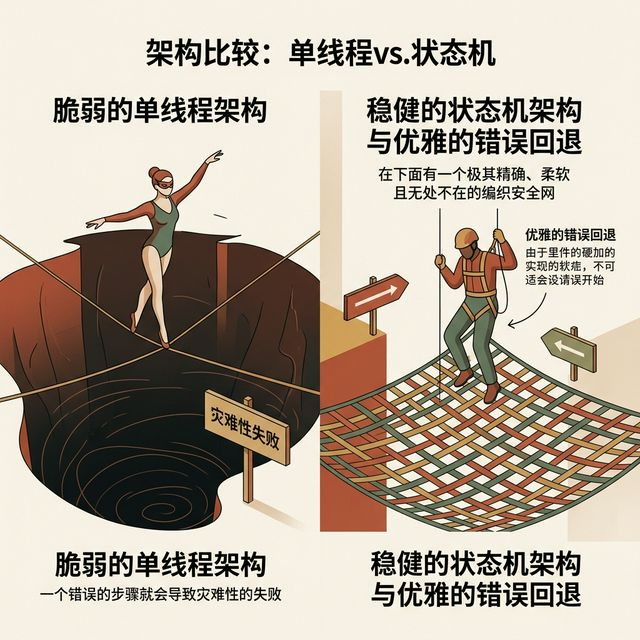
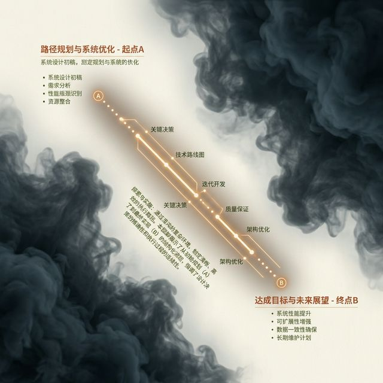

## 模块 0: 从混沌清单到流式骨架 (约 25 分钟)
<!-- BUDGET: 4600 chars | SLIDES: ≥9 | STATUS: done -->
<!-- [STAGE NOTE: 复习/导入] -->
<!-- 知识目标 1 回链：回顾 实践项目 从痛点洞察到假设验证再到 MVP 清单的完整创作流程节点 -->
<!-- 知识目标 2 回链：W04 假设驱动中对认知局限的初步认识（确证偏误、决策瘫痪），为本周心流与交互透明性做铺垫 -->

> [VISUAL]
> **Slide**: M0-01-W04-Review
> **Layout**: Split
> **Scene**: 左侧展示 W04 结束时的输出物（MVP 假设清单和低保真纸片人），右侧是一个问号，引向“如何变成真正的软件？”
> **Text**: 回顾：MVP 验证里程碑
> **List**:
> - 锁定假设
> - 低保真
> - 行为数据
> *   **Asset**: 

欢迎回到《交互产品开发》的课堂。上周，我们完成了 **实践项目 (痛点验证)** 的收官战役。大家用便签纸和纸片拼凑出**最小可行产品 (MVP)**，成功触达了第一批真实用户。

在这场实战中，大家学会了重要的一课：**用极低的设计成本，去排雷系统风险。** 
无论是用简单的着陆页 (Landing Page) 收集邮箱，还是用硬纸板制作假按钮——各位的思维模型已经进化。不再去问用户主观意见，而是用真实的**行为转化率数据**，证明了痛点真实存在且用户愿意买单。
这就是从主观猜测跨越到**“证据驱动设计 (Evidence-Driven Design)”**的里程碑。

> [VISUAL]
> **Slide**: M0-01b-Gap-Illusion
> **Layout**: `Full`
> **Scene**: 悬崖两端。一端是几张画着火柴人的MVP纸片，另一端是现代巨型软件都市。中间横亘着峡谷，底部标注“认知过载”、“状态崩塌”、“逻辑死循环”。
> **Text**: 致命的结构鸿沟
> **Caption**: 从便利贴到工业级软件之间，存在着“结构鸿沟”。
> *   **Asset**: 

但残酷的现实是：大家手里的 MVP，虽然是被验证过的需求，在结构上依然只是**零散的“功能卡片清单”**。

当需要把它变成包含分支跳转、表单校验、报错提示的庞大数字系统时，作为主设的你，该从哪里下第一刀？面对上百个潜在的界面状态，你该先画哪一页？

这正是初级设计师极易踩中的陷阱：**迷失在视觉细节中，却匮乏宏观的工程架构思维。**

> [VISUAL]
> **Slide**: M0-02-The-Missing-Blueprint
> **Layout**: `Comparison`
> **Scene**: 左侧展示一堆精美的按钮、输入框、卡片组件（如同散落的乐高积木），右侧展示一座结构严密、宏伟复杂的乐高城堡，并在表面叠加快放的图纸线框。标注：缺失的不是精致的零件，而是指引行动的蓝图。
> **Text**: 视觉零件 vs 系统蓝图
> **List**:
> - 散落零件
> - 系统蓝图
> **Search**: `lego bricks vs finished castle blueprint architectural drawing`
> *   **Asset**: 

在日常设计实践中，这体现为典型的“新手灾难”：**拿到需求后，连片刻的结构抽象都不做，直接打开 Figma。**

他们甚至愿意花几个通宵去调和报错页上小恐龙的阴影模糊度，单看任何一张图，视觉排版都非常出色。

> [VISUAL]
> **Slide**: M0-02b-Cognitive-Overload-Disaster
> **Layout**: `Full`
> **Scene**: 屏幕上出现一个充斥着几十个毫无关联的弹窗、报警灯和重叠菜单的恐怖 ERP 界面（如著名的 LingsCars 网站截图或极其混乱的中后台系统），画面中心打上红色的核辐射警告标志。
> **Text**: 架构缺失的代价
> **List**:
> - 记忆溢出
> - 焦点争夺
> - 认知过载
> *   **Asset**: 

但当他们把几十个孤立的页面强行串接成原型交给用户测试时，用户却像走进了一座没有路标的迷宫。

这里必须引入一个核心概念。正如我们在 W02 中学过的认知生理学极限：人类的工作记忆容量极为有限。把大量功能不加梳理地平铺，或强迫用户在无关联的界面间跳跃，必然会导致**认知过载 (Cognitive Overload)**。

举个真实的业务灾难场景：
在缺乏状态机的电商系统中，用户点击了“付款”。因为网络延迟且**未设计“等待状态”**，屏幕毫无反应。焦虑的用户狂戳屏幕，引发并发请求冲突。由于系统无法处理重复的点击状态，最终导致用户**被重复扣除了 3 笔款项**。

为什么单张界面无可挑剔，串联起来的体验却很糟糕？
因为**只有零散的视觉零件，却没有规划流转蓝图。** 
这正是缺乏宏观架构设计的代价。在研究视觉动效前，必须先为产品铺设坚实的流转骨架。

在我们继续深入之前，先来做一个小测验，看看大家是否真正理解了这道“结构鸿沟”。

> [ACTIVITY]
> *   **Type**: `Quiz`
> *   **Duration**: `2min`
> *   **Desc**: 架构认知测验：识别系统缺失的蓝图
> *   **Q**: 小林用 Figma 画了 50 张极精美的电商 App 页面。测试时，用户点击付款后因网络卡顿导致屏幕毫无反应，焦虑的用户狂戳屏幕最终导致重复扣款。从架构视角看，这种体验灾难的根本原因是什么？
> *   **Options**: A. 视觉设计过于繁杂，导致用户视觉层面的认知过载 | B. 仅堆砌了静态视觉零件，缺失处理异常任务的逻辑流转规划 | C. 违背证据驱动设计原则，跳过低保真验证直接进入视觉排版
> *   **Answer**: B
> *   **Explain**: 用户因缺乏反馈而疯狂点击导致灾难，正是因为产品只拼凑了正常的视觉零件，却没有去规划点击后的“等待状态”等结构流转。单纯简化视觉（A）或退回低保真（C）都无法解决缺乏工程连贯性的问题（参见本节“视觉零件 vs 系统蓝图”的分析）。

> [VISUAL]
> **Slide**: M0-03-Maze-App-Flow
> **Layout**: `Flow`
> **Scene**: 展示一个错综复杂、像意大利面条一样缠绕的应用跳转流程图。红色的错误标记（代表死循环、断头路、无返回节点的死胡同）四处闪烁，系统处于逻辑故障崩溃边缘。
> **Text**: 异常状态的流转瘫痪
> **Caption**: 缺乏架构设计导致的死循环与死胡同
> *   **Asset**: 

> [CASE STUDY: 某社交应用的意大利面条架构]
> 某早期社交应用的底层流程状态图上布满了自相矛盾的逻辑连线。因架构混乱、研发难以维护，导致严重的体验崩塌。灾难根源正是团队从未系统规划过状态流转。

大屏幕上的这个真实案例，其早期的**底层状态流转图**如“意大利面条”般死缠和自相矛盾。当底层逻辑混乱时，用户体验必然走向灾难。

在缺乏逻辑骨架的系统中，如果设计师没有提前规划流转，当遭遇**边缘异常 (Edge Cases)**（如：走进电梯断网、相机权限被系统拦截、支付接口无反馈）时，很容易引发系统崩溃。
程序要么直接闪退 (Crash)，要么把用户导向一个连“返回键”都没有的死胡同页面，留下永远在转圈的白屏。

每一次无法撤销的误操作和死胡同，都在透支用户的信任。

> [TEACHING MOMENT]
> **在现代数字产品中，核心业务功能的跑通只是基础；如何系统性地接管这些边缘异常，才是真正的架构级挑战。**
> 
> 面对海量的界面分支与不确定性，我们需要一套严密的系统来指挥全局，并为每一种可能出错的极端情况铺设安全的“兜底逃生通道”。
> 
> 只有把极端分支梳理成强健的流转骨架，才能构建出让用户真正安心的交互系统。

> [VISUAL]
> **Slide**: M0-03b-Safety-Net
> **Layout**: Split
> **Scene**: 左侧是杂技演员走钢丝，失足坠入深渊（单线程架构）；右侧是高空作业者身下有一层精密防护网（健壮的状态机与异常兜底架构）。
> **Text**: 异常状态的流转兜底
> **Caption**: 稳妥地接住用户的操作异常
> *   **Asset**: 

这组对比直观展示了两种架构差异：左侧走钢丝代表单线程脆弱原型——一旦 API 超时，页面白屏，直接抛出报错；右侧的安全网代表工业级状态机兜底架构——即使支付瞬间断网，系统也能在本地缓存暂存快照，网络恢复后静默提交订单。这就是从“可用”到“健壮”的跨越。

> [VISUAL]
> **Slide**: M0-03c-Team-Kickoff
> **Layout**: `Split`
> **Scene**: 一张敏捷开发团队在白板前协作的照片，标注出三个隐喻角色：架构制图师、业务守门员、用户走查员。
> **Text**: 从单兵到团队：架构启动仪式
> **List**:
> - 架构制图师 (UX/Architect)
> - 业务守门员 (PM)
> - 用户走查员 (QA)
> **Source**: `AI`
> **知识节点**: `agile_collaboration_roles`
> *   **Asset**: 

> [TEACHING MOMENT]
> 从单兵验证到团队协作——白板前的分工
> 
> 在上周的实验中，你们像“城市勘探家”一样单兵作战，验证了用户痛点。但今天，你们将正式组建一个真实的敏捷架构团队。
> 今天这节课，就是你们的**“架构启动仪式 (Kick-off Ceremony)”**——在写任何前端代码之前，先用白板搭建系统骨架。
> 
> 在接下来的实战中，你们的小组需要扮演三种核心角色：
> 1. **架构制图师 (UX/Architect)**：手里拿笔，负责画出状态图的人。你关注的是“怎么流转最顺滑”。
> 2. **业务守门员 (PM)**：手里拿需求清单，守住 MVP 功能边界的人。你关注的是“我们要做的功能是否闭环了”。
> 3. **用户走查员 (QA/Tester)**：代入目标用户走完整个流程的人。你关注的是“这么点会不会迷路或死机”。

> [VISUAL]
> **Slide**: M0-04-The-Journey
> **Layout**: Split
> **Scene**: 画面中心只有一条从 A 点直达 B 点的发光几何轨迹，穿越着屏幕四周混乱的黑暗迷雾。
> **Text**: 本周主题：流转架构与状态机
> **List**:
> - MVP 验证清单
> - 设计 Brief 约束
> - 状态机骨架
> *   **Asset**: 

上周的 MVP 实验，帮我们在商业逻辑上验证了：**这些构想出的功能是否真实被需要。**

然而，MVP 的数据只是一张**“混沌清单”**。敏捷团队的第一步，是把散落的痛点凝练成一份清晰的**设计 Brief (任务简报)**，明确我们的目标用户是谁、我们验证了什么假设、我们要做的范围边界在哪里。只有拿着这份 Brief 的“合约约束”，制图师才能动笔去画第一根线。

这周，我们要进入产品落地的深水区，用严密的工程逻辑回答下一个核心架构命题：
**如何将散落的独立痛点，缝合成一个能自我兜底的系统架构？**

这不仅是连线画图，更是构建系统的“中枢神经”。我们既要在顺利的**快乐路径 (Happy Path)** 上保持顺滑，更要在可能出错的边界区为用户铺设**逃生通道**。

这就是本周的核心目标——**目标导向的流转架构与状态机拆解 (Goal-Directed Flow & State Machine Orchestration)**。
今天，我们将暂且放下视觉层面的阴影与圆角，专注为产品植入逻辑自洽的交互骨架。

准备好了吗？我们将进入深度重构模式。
