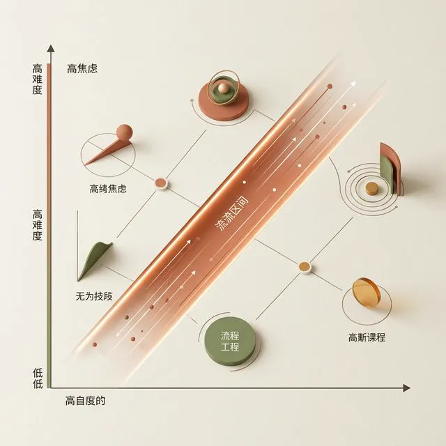
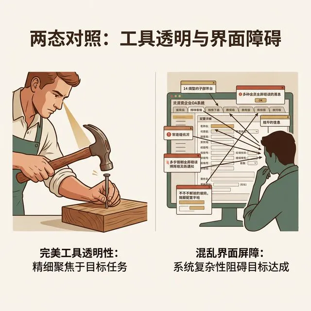

## 模块 1: 心流与交互透明性 (约 15 分钟)
<!-- BUDGET: 2700 chars | SLIDES: ≥5 | STATUS: done -->

<!-- SKELETON:
模块 1：心流与交互透明性 (15分钟)
-- 核心论断：最好的界面是让用户在完成任务时感觉不到界面的存在，注意力彻底透明。
-- 情感入口：你在专注画画或打字时，系统突然弹窗打断带来的强烈暴躁感。
-- 金字塔支撑：
   -- 支撑点 1：心流 (Flow) - Mihaly 提出的技能与挑战平衡态，带来极高生产力与沉浸感。
   -- 支撑点 2：交互透明性 (Transparency) - 像使用铁锤一样，工具不该横亘在人与目标之间。
   -- 支撑点 3：消除认知摩擦 - 任何要求用户对非业务目标进行额外确认的动作都是破坏心流的摩擦。
-- 视觉序列：Full(沉浸场景) -> Diagram(心流模型) -> Split(隐喻) -> Grid(痛点对比)
-- 出口悬念：理念很美好，但如何用具体的战术在复杂系统里做到这一点？这就引出了交互编排。
-->

> [VISUAL]
> **Slide**: M1-01-Painting-Flow
> **Layout**: `Full`
> **Text**: 体验的终极形态：让界面彻底消失
> **Scene**: 一位画家全神贯注地在画布上作画，周围的画室环境、散乱颜料罐全被极度模糊虚化，笔触流畅自然仿佛有脱离地心引力的生命力，画家与画布之间仿佛没有任何物理阻隔。画面整体色调温暖、极度沉浸。
> **Search**: `artist flow state painting immersed concentration`
> **知识节点**: `about-face-ch11-flow`
> *   **Asset**: 

### 体验的终极形态：让界面在心智中彻底消失

好，理清了架构的毁灭性，我们再来看看体验的巅峰。上周我们通过 MVP 验证了商业风险，回答了产品是否有需求的问题。

但假设验证通过，接下来的挑战是：**如何将这个想法转化为毫无认知阻力的数字产品？**

看看大屏幕上这位**沉浸在创作中的画家**，他与画布之间没有任何物理阻隔，这种**浑然天成的流畅感**正是我们的追求。这与单纯罗列功能清单、生硬堆砌控件的做法截然相反。今天这一章的核心主题，可以概括为一句话——**让界面彻底消失**。

> [TEACHING MOMENT]
> 回想 W02 探讨过的认知生理学极限：人类大脑额叶的**工作记忆容量极其有限（7±2 法则）**，它就像一台运行内存（RAM）极小、只能同时处理 7 个左右信息块的老旧电脑。每一次在屏幕上寻找按钮的视觉跳跃、跨页翻阅，都在榨取这无比稀缺的**认知带宽资源**。当记忆和决策负荷过载时，会导致用户注意力的崩溃。

---

> [VISUAL]
> **Slide**: M1-02-Flow-Diagram
> **Layout**: `Diagram`
> **Text**: 心流 (Flow) 与挑战技能模型
> **Scene**: Mihaly Csikszentmihalyi 心流模型的三维空间示意图。由底部的"无聊 (Boredom)"区，跨越到高压的纵轴"挑战极度焦虑 (Anxiety)"区。在复杂的二维坐标轴中，一条名为"心流区 (Flow Channel)"的发光对角通道被着重渲染，通道呈现动态的流速感。关键字号打出终极结论：绝顶体验诞生于任务挑战与个体控制技能的动态平衡。
> **Search**: `csikszentmihalyi flow model diagram challenge skill`
> **知识节点**: `about-face-ch11-flow`
> *   **Asset**: 

### 触发心流状态：用技能与挑战的平衡消融自我

早在 1990 年，心理学家米哈里·契克森米哈赖就科学地定义了"心流 (Flow)"：
**当一个人的技能水平与其面临的任务挑战处在精妙的平衡点上（既不无聊也不焦虑）时，他会自然跌入全神贯注、浑然忘我的沉浸体验。**

在这种状态下，人们能展现出极高的生产力与创造力。进入"心流状态"的大脑，会表现出几个极端特征：时间感知发生扭曲；自我意识消融，忘记自身正在操作工具；意念与动作合一，神经直觉自然流淌。

> [ACTIVITY]
> *   **Type**: `Quiz`
> *   **Duration**: `2min`
> *   **Desc**: 情境诊断：心流状态的触发条件
> *   **Q**: 小冰是一名刚学会基础拖拽操作的新手设计师，但主管直接丢给她一个需要编写复杂交互代码的底层架构任务。根据契克森米哈赖的“心流模型”，小冰此时最有可能处于哪种心理状态？
> *   **Options**: A. 跌入全神贯注的心流区 | B. 因挑战远超技能而陷入严重焦虑 | C. 因任务过于单调而感到极度无聊 | D. 达到工具与意图合一的透明状态
> *   **Answer**: `B`
> *   **Explain**: 根据心流的“挑战-技能模型”，绝顶体验诞生于挑战与技能的完美平衡。由于挑战难度极高而小冰的当前技能极低，因此她会直接跌入纵轴高位的“焦虑区”。

时间到！我看到后台数据……这跟我们在屏幕上画按钮有什么关系？现代交互设计之父 Alan Cooper 在《About Face》中指出：交互设计的核心目标之一，就是促进并增强用户的心流状态。

> **"无论系统多复杂，界面组件少一点，永远会更好。"**

他将这种极简体验境界称之为 **"交互透明性 (Interaction Transparency)"**。与优秀的作家能够让写作技巧隐形一样，优秀的交互设计也会让“软件的交互机制”消失。

> [VISUAL]
> **Slide**: M1-03-Transparency-Metaphor
> **Layout**: `Split`
> **Text**: 交互透明性隐喻
> **Scene**: 右半边极度讽刺，左半边极致优雅。左区：一把斑驳但极简的铁锤正精准砸入钉子，木工的焦点死死锚定在"钉子"上，大脑绝不会思考"我该怎么握锤"。右区：一个极其灾难的 OA 系统，用户可怜的注意力迷失在 14 个密密麻麻的二级标签页、弹窗、配置项中。左 = 透明且强壮的肢体延伸 / 右 = 横亘在梦想之前的厚重铁壁。
> **知识节点**: `about-face-ch11-flow`
> *   **Asset**: 

我们来看看左侧的铁锤。当木匠固定木板时，他的视觉焦点全在最终目标上。铁锤实现了真正的**透明性**，它成为了手臂的自然延伸。再看看右侧那些缺乏体验架构规划的商业软件。当你带着灵感准备记录时，常常被迫先关弹窗、找路径、看通知。界面彻底抛弃了透明性，变成了横亘在用户与目标之间的高墙。

> [VISUAL]
> **Slide**: M1-04-Friction-Points
> **Layout**: `Split`
> **Text**: 认知摩擦：心流的破坏者
> **Scene**: 现场用极快的切镜效果，动态还原一个用户在雨天试图用 App 叫车时，界面上不断弹出的打断性噪音：3 秒不可绕过的开屏广告、强迫填写的拉新横幅、以及反复报错的定位授权弹框。
> **Caption**: 打破心流的罪魁祸首：底层认知摩擦与强制打断式交互。
> *   **Asset**: 

### 消除认知摩擦：让系统像隐形管家

为了实现透明性，我们需要彻底消除界面上的**“认知摩擦”**。任何强行迫使主线任务暂停、要求用户做出与核心目标无关的额外确认操作，都属于认知摩擦。

例如现代手机输入法的**无感智能纠错**。如果你把“hello”按成了“gwkko”，系统会在后台隐式计算概率直接给出正确结果，而不是让你停下来移动光标修改。它从源头拔除了“报错-修改”的割裂感，实现了动作的透明化。

那么，理念很美好，但当我们面对真实的复杂业务系统时，怎样才能具体做到“不弹窗、少打扰”？

> [VISUAL]
> **Slide**: M1-05-Amazon-One-Click
> **Layout**: `Split`
> **Text**: 价值数十亿的“透明化”设计：一键下单
> **Scene**: 视觉强烈对比图。左侧是一个长达五页的传统电商结账流程（加入购物车、确认信息、填报地址、选择支付、最后确认），充满了红色的必填报错和密密麻麻的输入框，象征极高的认知摩擦；右侧是亚马逊网页上那枚孤零零但极其显眼的黄色按钮“Buy now with 1-Click (一键下单)”，手指点击后直接呈现包裹飞出的顺滑动画，象征心流的极致畅快。
> **Search**: `Amazon one click ordering checkout friction`
> **知识节点**: `about-face-ch11-flow`
> *   **Asset**: 

### 案例：价值数十亿的“无摩擦”结账

如果觉得输入法有些抽象，我们来看一个商业史上最著名、也是最昂贵的“消除认知摩擦”案例：亚马逊的“一键下单 (1-Click Ordering)”。

在早期电商时代，传统的在线购物流程是一场对注意力的残酷考验。当你看到一本心仪的书并产生购买冲动时，你需要先点击“加入购物车”，然后进入购物车页面确认数量，接着跳转到地址填写页面，再进入支付方式选择页面，最后还要在一个满是条款的长页面底部点击最终确认。

这五个繁琐的步骤，在当时被业内认为是天经地义的“机器底层逻辑”——因为服务器确实需要依次获取这些参数才能生成一张合法的订单。但在这五次页面跳转、十几次鼠标点击中，用户的“购买心流”被无情地割裂了无数次。每一次网页加载的延迟、每一次地址填写的犹豫，都是一颗极其硌脚的沙子。这直接导致了极高的“购物车遗弃率”。

> [TEACHING MOMENT]
> 从心智模型来看，传统的长结账流程，是将系统的“数据收集需求”傲慢地强加给了消费者。它迫使消费者离开“期待拥有商品”的纯粹愉悦，转而去处理枯燥的枯燥表单。在这个过程中，系统变成了一堵令人绝望的高墙，死死横亘在用户的欲望与满足之间。

亚马逊的创始人贝佐斯看到了这个致命的认知摩擦。他的解决方案暴力而优雅：通过在后台悄悄提前绑定用户的默认收货地址和信用卡信息，在前端仅保留一个孤零零的行动点——**“一键下单”**。当你点击它的那一刻，交易瞬间在后台并发完成。

没有任何中间页，没有任何确认弹窗，没有任何多余的验证。亚马逊把在线购物从一个复杂的“系统信息交互流程”，升维成了一种近乎动物本能的“直觉反射”。屏幕上的那个黄色按钮在这个瞬间实现了彻底的**透明化**，用户的意念直接穿透了玻璃屏幕，触达了商品本身。这项彻底消灭了摩擦的设计，不仅让亚马逊的转化率迎来了指数级爆发，更在随后的二十年里，定义了现代电商最基础的体验框架。

这就是交互透明性的威力。它不仅关乎美学层面的优雅，更是真金白银的商业护城河。

理清了这一点，我们再来回答那个问题：当面对极其复杂的底层业务系统时，怎样才能做到如丝般顺滑的“不打扰”？这就引出了我们将要深入探讨的**交互编排策略 (Orchestration)**。
