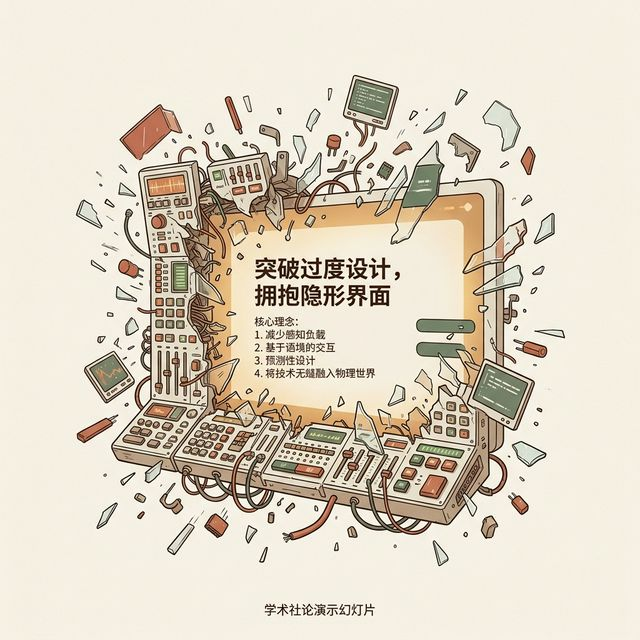
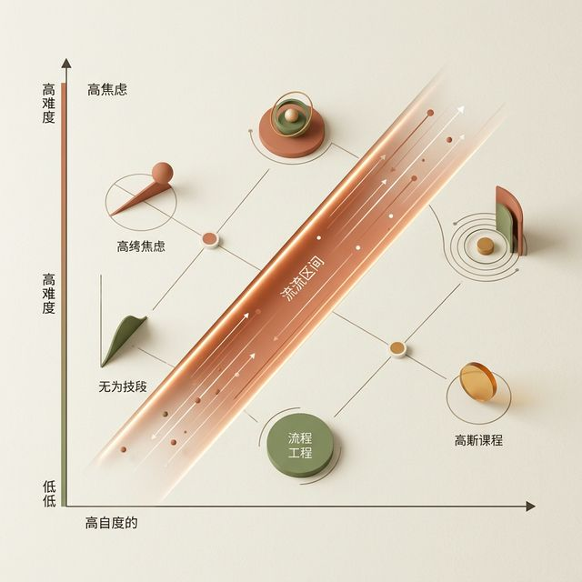
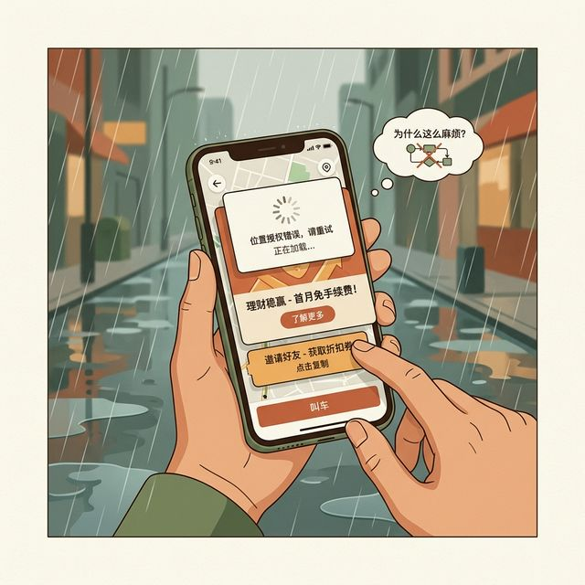

## 模块 1: 心流与交互透明性 (约 15 分钟)
<!-- BUDGET: 2700 chars | SLIDES: ≥5 | STATUS: done -->

> [VISUAL]
> **Slide**: M1-01-Painting-Flow
> **Layout**: `Full`
> **Scene**: 一位画家全神贯注地在画布上作画，周围的画室环境、散乱颜料罐全被极度模糊虚化，笔触流畅自然仿佛有脱离地心引力的生命力，画家与画布之间仿佛没有任何物理阻隔。画面整体色调温暖、极度沉浸。
> **Search**: `artist flow state painting immersed concentration`
> **知识节点**: `about-face-ch11-flow`
> *   **Asset**: 

好，理清了架构的毁灭性，我们再回过头来看看体验的巅峰。上周的极客实验告诉了你们怎么用最小成本去验证系统级商业风险。MVP 这个工具极其冷血地帮你回答了一个定性的零和问题——"这破代码做出来到底有没有真实人类想要？"

但假设验证通过了呢？假设数据告诉你，大家欢欣鼓舞，用户确实深受这个痛点折磨，你选的细分方向也堪称神来之笔。现在，极其冰冷且棘手的挑战被抛回给了你：**作为这场战役的首席交互工程师，你打算怎么把这个被验证过的“干瘪的想法”，变成一个让人用起来浑身起鸡皮疙瘩、极其精美、顺滑、并且毫无认知阻力的数字艺术品？**

很多二三线数字工厂的做法是：拿到哪怕是再天才的业务需求，也就是麻木地拉出一个长长 Excel 功能清单，然后直接打开组件库，随便找几个顺眼的页面把这些输入框和按钮像贴膏药一样生硬地塞在一张网格里。那叫无脑的砌墙，那绝对不叫高级软件设计。

今天我们这一章的核心主题，听起来可能会非常违背你们作为设计师固有的强烈自尊心和表现欲，这句箴言只有极简的五个字——**让界面彻底消失**。

> [TEACHING MOMENT]
> 回想 W02 我们深刻探讨过的类脑缺陷与认知生理学极限：由于人类大脑额叶的工作记忆容量极其可怜（著名的 7±2 法则），每一次在屏幕上寻找按钮的视觉跳跃、每一次回忆刚才那个参数是什么的跨页翻阅、以及每一次不得不精确点击确认的物理神经冲动，都在极其贪婪地榨取着这种无比宝贵的稀缺认知带宽资源。当这种记忆和决策负荷稍一遭遇设计不当的过载并发，就像因为内存泄漏而彻底锁死的烂电脑一样，会导致用户注意力的瞬间全盘崩溃。
> 而今天，我们要攻克的终极工程目标，就是通过极其精妙绝伦的伪装编排与状态隐式流转，系统性地、甚至是完全偷偷摸摸地，像切除肿瘤一样削减掉每一个榨取用户工作注意力碎片的无用环节。

---

> [VISUAL]
> **Slide**: M1-01b-No-UI
> **Layout**: `Full`
> **Scene**: 屏幕上闪烁着一行巨大的发光文字：“最好的 UI 是没有 UI”。背景隐约可见错综复杂的代码流，但前景被一块被一拳打碎的复杂控制面板屏幕填满，碎片四处飞溅，象征着推翻对堆砌控件的过度崇拜。
> **Caption**: 交互的至高境界：让数字界面的存在感彻底归零。
> *   **Asset**: 

“让界面彻底消失”——这个说法听起来确实有点像个自相矛盾的理论疯子。
作为正在苦学“用户界面设计 (User Interface Design)”的你们，每天最大的工作成就感来源就是在死磕那几个精致的毛玻璃按钮、调节着极其玄学的多层弥散阴影、为了对齐极其苛刻的 8px 黄金网格而熬夜。现在，我怎么能倒反天罡地要求你们亲手“消灭”这些耗费心血的视觉杰作呢？

这个看似在玩弄文字禅机的终极答案，其实深埋在一个非常著名、且被全球顶级架构师和极客们奉为终极体验圭臬的心理学概念底层里：心流 (Flow)。

> [VISUAL]
> **Slide**: M1-02-Flow-Diagram
> **Layout**: `Flow`
> **Scene**: Csikszentmihalyi 心流模型的三维空间示意图。由底部的"无聊 (Boredom)"区，跨越到高压的纵轴"挑战极度焦虑 (Anxiety)"区。在复杂的二维坐标轴中，一条名为"心流区 (Flow Channel)"的发光对角通道被着重渲染，通道呈现动态的流速感。关键字号打出终极结论：绝顶体验诞生于任务挑战与个体控制技能的动态、绝对完美平衡。
> **Search**: `csikszentmihalyi flow model diagram challenge skill`
> **知识节点**: `about-face-ch11-flow`
> *   **Asset**: 

> [PHILOSOPHY: 心流与上手性——跨世纪的哲学呼应]
> 心理学家 Csikszentmihalyi 对心流的定义，与海德格尔在《存在与时间》中描述的"上手状态 (Zuhandenheit)"形成了跨世纪的哲学呼应：当工具完美融入使用者意图时，工具本身就从意识中彻底退场。心流不仅是一种心理体验，更是一种存在论层面的人与世界的合一——正如庄子的"庖丁解牛"，"以神遇而不以目视"。

早在 1990 年，匈牙利裔的美籍心理学家 Mihaly Csikszentmihalyi（米哈里·契克森米哈赖）就在他石破天惊的同名巨著中，极其科学地定义了"心流"这个概念。抛开口号式的理论，简单来说，这是人类物种的神经系统能够体验到的一种代表着最巅峰、最极致的心理奖赏状态：
**当一个人的当下技能控制水平，和他所面临的动态任务挑战，极其巧合地处在一个精妙的平衡点上（既不因为太简单而无聊哈欠，也不因为太难而焦虑崩溃）时，他会极其自然地跌入一种全神贯注、浑然忘我的沉浸甚至失控体验。**

这种状态，坐在这里的你们绝对不陌生。回想一下：那些为了赶毕设、在深夜画图修图甚至连按保存都成为下意识动作的瞬间；或者那些戴着厚重的降噪耳机，十指如飞敲击机械键盘，调试一个复杂 Bug，整整四个小时没喝一口水却丝毫不感觉渴的极客时刻；甚至只是你们在玩《只狼》或者手速拉满玩竞技游戏打最高难度通关被 Boss 虐杀又重生的一瞬——在这些时刻，你们都曾极其深刻、甚至是上瘾般地体验过什么是心流。

进入这种"心流状态"的哺乳动物大脑，会表现出几个非常违反日常常理的极端生理特征：
首先是**生理时间感知的被完全扭曲折叠**——五个小时的枯燥时光，在你的主观记忆晶体中仿佛只像是一眨眼的五分钟；
其次是**主观自我意识的戏剧性冰雪消融**——你不仅彻底忘了自己饿不饿，你甚至忘了自己是谁、忘了周围的极度吵闹、更忘了你的手指正在操作是一套多么极其复杂的 C++ 界面层级工具；
最后，也是最难达到的一步：**肉体行动与意念意识的完美量子纠缠式合一**——你的每一个光标移动都不再经过长达半秒的理性前额叶深思熟虑，而是依靠最基础的神经末梢直觉，如水银泻地般自然流淌而出。

> [ACTIVITY]
> *   **Type**: `QA`
> *   **Duration**: `2min`
> *   **Desc**: 快速知识点回顾
> 教师提问互动，校验此前核心法则的理解情况。

这套听起来似乎像是在谈论某种修禅艺术的极高修养，但是这跟我们需要在屏幕上画按钮、写 TypeScript 类型检查逻辑的 App 前端交互开发有什么极其致命的因果关系？
它们的关系不仅大而且直接决定生死，它是决定一个代码资产是走向伟大的商业帝国，还是沦为一滩平庸的垃圾山的分水岭。我们这个领域的精神导师：现代交互设计之父 Alan Cooper 在他的传世硅谷技术经典《About Face》里，不仅将这套理论奉为神谕，更是基于此提出了一个甚至比包豪斯“形式追随功能”还要冷酷十倍的设计原则：

> **"不管你把软件的图形界面画得有多么震撼、多么具备 3D 酷炫光影，在这场争夺用户专注力的战争中，界面组件少一点，永远会不可阻挡地变得更好。"** (No matter how cool your interface is, less of it would be better.)

他的潜台词极其刻薄——**这世界上最伟大、最顶级的图形交互，就是让屏幕前的用户，根本在认知层面察觉不到任何所谓“交互”这个刻意动作的正在发生。** 用户极其脆弱的心智注意力，应该像极强的高能激光穿越一块极度纯净且毫无杂质的纳米玻璃一样，以光速直接碰撞并作用于他的核心业务目标上。Cooper 先生在神坛上，把这种用无数代码和心血堆砌出来的极简体验境界，高度概括并称之为数字产品的 **"交互透明性 (Interaction Transparency)"**。

> [VISUAL]
> **Slide**: M1-03-Transparency-Metaphor
> **Layout**: `Comparison`
> **Scene**: 右半边极度讽刺，左半边极致优雅。左区：展示一把斑驳但极简的铁锤正在半道精准且势大力沉地将钉子砸入实木板的瞬间——操作木工的视觉焦点特效完全死死锚定在"钉子"（用户的终极任务目标）上，他的大脑绝不会花哪怕 1 毫秒去低头思考"我该怎么按照系统说明书握住这个复杂参数的锤柄"。右区：一个极其灾难的企业级中后台 OA 系统界面——用户可怜的注意力完全迷失在 14 个密密麻麻的二级标签页、强制全屏防误触弹窗、不知所云的异常配置项中。画面一针见血地冷酷点题：左 = 透明且强壮的肢体延伸 / 右 = 横亘在梦想之前的厚重铁壁。
> **知识节点**: `about-face-ch11-flow`
> *   **Asset**: 

现在请全部抬头，看着大屏幕上这组极度震撼的视觉对比图，我们用最接地气的例子来品味 Cooper 先生这个近乎绝嗣的隐喻。

屏幕左侧，没有任何花哨设计的一把破旧铁锤。当你作为专业木匠，抄起它准备固定木板的绝对瞬间，你大脑皮层活跃的所有前额叶回路、瞳孔聚焦的所有高精度视觉信号，全都在那颗仅有几厘米的"铁打的钉子"上。你的心流里只在极其高速且安静地计算判断："这这一下砸进去了几毫米？用力会不会发生偏斜导致木板开裂？" 在这个建造物理世界结构的极其神圣的心流时刻，你绝对、绝对不可能突然像个被拔掉电源的人工智能一样停下来，去死板地在脑子里调用一个子程序去分析："请问，我现在到底应该向这根木头手柄施加 25 牛顿还是 30 牛顿的包裹力？我该按哪个键来确认握持生效？" 
这个世界上如果有这样造锤子的，那就是妥妥的反人类精神病。在这个人造工具极度协同的上下文中，这把几十块钱的铁锤毫无保留地实现了真正的**透明性**。它就像被黑客帝国植入了电极的机械臂一样，极度顺从地化为了你血肉之躯在物理世界力量辐射的强悍自然延伸。它的伟大的存在，就是绝对不会因为自己刷了一副极其刺眼的红漆，而傲慢地跳出来抢挡在你和你砸钉子的崇高终极目标之间。

但当我们将残酷的目光扫向那些傲慢的软件工程师们，看看右边呢？这就是现实中绝大多数糟糕透顶、缺乏任何全局状态架构规划的傲慢无礼的计算机商业软件。
你作为一个充满才华的小说家，清晨被巨大的灵感击中，端着咖啡，满怀无边无际的创作激情，打开被奉为神器的某大型办公软件想记录下史诗般的第一行字。可是惨剧发生了——当你在白板上敲击键盘之前，你被迫面临着一场极其丑陋且充满支配欲的“交互审查”：你被迫连续点了三次才能关掉首屏蹦出阻死你视线的巨大年度版本更新强弹框；接着你为了不丢失这伟大的灵感，被迫强打精神钻进深达三层、且充满陌生专业术语乱码的侧边目录里，寻找"强制云端或本地存储路径的验证权限"；还没等你点下确认，它甚至极其侮辱人地弹出一个毫无意义但默认全屏的系统通知："我们正在极其体贴地为您云更新某个 2KB 大小的垃圾素材包，请您务必不要关闭应用否则可能面临死机"。

在这个愚蠢至极的虚拟信息流系统里，界面彻底抛弃了它的工具透明性尊严，它面目可憎地异化、膨胀，变成了一座横亘在无助的用户和他们神圣目标之间、且挂满高精尖电子防御铁丝网的极不可逾越的厚直高墙。这堵墙上的每一块砖，都是某些工程师为了他们自私的异常捕获参数而在半夜心血来潮随便加塞进去的设计。用户的那些在喝咖啡时积累的、无比珍贵的短时记忆和创作激情的大脑燃烧能量，在极其屈辱地、像犯人一样翻越这些工程城墙的过程中，被生生消耗成了灰烬。当他们精疲力竭、终于在一堆眼花缭乱的废墟中找到那个干瘪的文本输入光标时，那道天才般的心流，早就被这套充斥着各种确认按钮的官僚系统给死死地掐死、彻底撕成了碎片。

**先生们女士们，请深刻理解并背诵这句话，这就是这门甚至有些反人性的课程所信奉的交互透明性核心绝对信仰：我们设计的每一个无论多复杂的长达 50 万行的系统和数字工具工具，只要它长了界面，它就应该无条件地像那把沉默的铁锤一样，极其谦卑且顺滑地，让用户颤抖的手毫无阻力地、以光速直接触达他最隐秘的那个灵魂级目标。绝对、永远不要在这个光速穿透的透明过程中，布下天罗地网，残忍地迫使或者诱骗用户由于一些可笑的业务边界条件，而停下来去同你出于自我炫技而胡编乱造的那些发光按钮和复杂的四级菜单进行所谓平等的"对话"！**

> [VISUAL]
> **Slide**: M1-04-Friction-Points
> **Layout**: Split
> **Scene**: 现场用极其短促快速的切镜效果，动态还原展示一个极度崩溃的用户，试图在雨天完成一个极简单一业务目标（通过 App 一键打车）时，界面上如牛皮癣般不断强制打断并弹出一堆试图阻断切割他最后残存心流的恶心噪声：5G极速网络下的 3 秒不可绕过的高收益理财开屏全屏广告、为了拉新强迫填入分享码的新手巨大引导长条横幅、以及底层逻辑混乱导致的不断重试却依旧无限极光旋转的定位授权报错弹框。
> **Caption**: 打破极客心流图的千古罪魁祸首：无可容忍的底层认知摩擦与一切强制霸权式交互。
> *   **Asset**: 

为了要在极其庞大冗余的机器代码森林里，真正硬核地还原并实现这种几乎像水一样的绝对物理透明性，我们需要拿起我们手中作为前端全栈架构师的最高权力屠刀——彻底而且无情地消除任何哪怕多一个像素的界面“心智阻断摩擦 (Mental Friction)”。
判定什么是罪该万死的摩擦的标准极其严苛：**任何利用代码控制力，强行迫使本该在执行快速主线任务的系统猛踩急刹车、并无耻停留在半空中无所作为、极度傲慢地强行等待用户用他们宝贵的脑细胞去做出一些哪怕只有零点几秒的与他们刚才脑内规划的目标毫不相关的额外确认决策的黑屏时刻，全都是必须要被系统性彻底根除的不可饶恕的绝对摩擦！**

举个业界极其惨痛的经典案例，当你全神贯注在一个老旧庞杂的企业级字处理排版软件里疯魔般地敲打键盘输入万字文案时，系统如果为了它那可怜悲催且落后的所谓“避免内存溢出导致缓存数据意外崩溃清空丢失”的可笑理由，强迫屏幕前已经文思泉涌的你，必须像给系统上供的奴隶一样，每隔极度机械的黄金 5 分钟，就得停下你那双飞舞在键盘上的双手，极其极其小心且精确地，把鼠标费力地移动到屏幕最高处的那个长得千篇一律的顶部文件选项死板菜单栏里，费神去找到并精确点击那颗只有芝麻绿豆大小的、写着“手动保存重写”的卑微按钮。
你有没有意识到它到底干了什么不可饶恕的错事？就这么一次区区几百毫秒的点击物理偏移加上微弱的寻找识别，它那肮脏的系统逻辑本身，就在这一刻，把一个沉浸在“我正在用最性感的词汇写一篇注定能拿普利策奖的伟大文章的顶尖心流”中的高维上帝，残忍无情地一把薅了出来，狠狠地摔进了“我不过就是一个必须给愚蠢落后的一九九几年旧时代弱智计算机底层破败软盘文件系统极其卑微地分配块簇的底层数据管理操作工”的极度令人作呕、且无比割裂的技术语境里。这就是在产品体验架构设计上最大、同时也是最残暴愚昧的一个巨量认知摩擦！
而相比之下，现代那些极其聪明优雅的生产力云软件，如同风靡硅谷被无数人崇拜的 Notion 或者极简强大的 Google Docs 所极其果断彻底采用的、基于极速增量树更新的无感“隐式自动云同步热保存”网络回写机制——它就是完全从架构源头拔除这种令用户产生自我撕裂摩擦的最极致、最暴力的“让动作无感透明化”的、令人拍案叫绝的最佳极简实践巅峰方案。

> [VISUAL]
> **Slide**: M1-05-Seamless-Flow
> **Layout**: `Full`
> **Scene**: 展示一个极其流畅的丝带在狂风中不受任何阻碍地飘舞，隐喻毫无摩擦的心流。下方压上一行引用的名人名言，字体铿锵有力。
> **Caption**: "好的交互设计不会让你觉得自己变聪明了，它只会让你忘记自己正在使用电脑。"
> *   **Asset**: 

记住这句话，让它成为你们在搭建每一个前端路由跳转时脑海里回响的唯一审判标准。我们刚才讲的心流和透明性，解决的是"为什么要消灭摩擦"的信仰问题。但光有信仰远远不够——接下来我们要回答的是"怎么消灭"。这就需要一套极其具体的、可以直接落地到你代码里的操作性军规。
