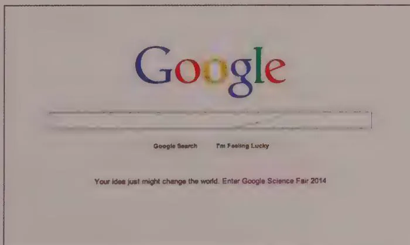
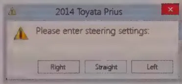
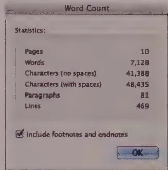
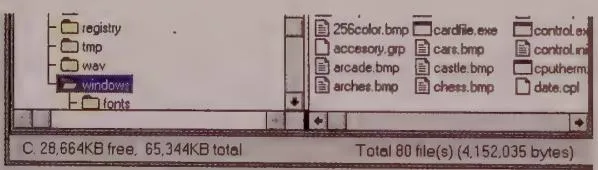

## 模块 2: 交互编排策略 (约 15 分钟)
<!-- BUDGET: 2700 chars | SLIDES: ≥5 | STATUS: done -->

<!-- SKELETON:
模块 2：交互编排策略 (15分钟)
-- 核心论断：交互编排是为了让所有元素协同工作，达成统一的业务目标，而非制造屏幕噪音。
-- 情感入口：面对满屏弹窗、警告和密密麻麻的按钮，用户就像听了一场各种乐器乱响的灾难音乐会。
-- 金字塔支撑：
   -- 支撑点 1：顺从心智与少即是多 - 不要强迫用户学习机器逻辑，用时间置换空间（Google极简）。
   -- 支撑点 2：直接指挥与提供选择 - 像驾驶汽车一样直接操作，把功能安静地放在工具栏供选择，而不是用对话框频繁提问。
   -- 支撑点 3：无模式反馈与概率兜底 - 用HUD/状态栏替代强阻断弹窗，不要为了百万分之一的例外去惩罚99.9%的常态心流。
-- 视觉序列：Full(交响乐指挥) -> Grid(心智对比) -> Split(对话框隐喻) -> Comparison(HUD反馈) -> Split(概率弹窗)
-- 出口悬念：只要遵守这些编排原则，产品就能好用了吗？为什么有些产品明明很极简，却依然让人用得很累？这就引出了"附加税"。
-->

> [VISUAL]
> **Slide**: M2-01-Symphony-Conductor
> **Layout**: `Full`
> **Text**: 交互编排 (Orchestration)：控制进退时机，而非增加噪音
> **Scene**: 维也纳金色大厅。一位交响乐指挥站在庞大乐团的最前方，背对观众。画面强调"和谐控制力"——上百个原本会互相干扰的复杂声音源，在指挥棒下被合并成完美的音浪。
> **Search**: `orchestra conductor harmonious coordination symphony power control`
> **知识节点**: `about-face-orchestration-strategies`
> *   **Asset**: 

### 引言：何为“交互编排”？

前面我们提到，在复杂的系统中需要做到“不打扰”，这依赖于高超的**编排 (Orchestration)** 技巧。

什么是编排？想象一场交响音乐会，如果上百件乐器各自为政、音量拉满，只会制造混乱无序的噪音。指挥本人不发出一分贝声音，他唯一的权力是基于全局视角，精准控制各声部进入和退出的时机与强弱对比。

复杂的 App 界面同理。按钮、警告文字、弹框都是你的“乐器”。如果它们缺乏节制，就会轰炸用户的认知带宽；如果它们被系统性地编排了出场顺序——主视觉组件占据 C 位，次要状态蛰伏在阴影中，用户的心流才会如丝般顺滑。

Alan Cooper 在《About Face》中总结了实现和谐互动的核心策略。接下来，我们将通过教材中几个极其经典的案例，来拆解这些策略。

---

### 策略一：遵循用户的心智模型

**永远顺从用户的心智模型，而不是计算机的底层运作逻辑。** 软件应当贴合用户思考任务的方式。

> [TEACHING MOMENT]
> 教材中提到了一个经典的医院信息系统案例。对于同一个系统，医生期望按“患者姓名”或“病症”来查找信息，因为这是他们的核心任务；而计费办公室的职员则更倾向于通过“逾期时间”对账单排序。如果系统强迫医生去使用计费逻辑的搜索面板，就是违背心智模型。

### 策略二：少即是多 (Less is More)

> [VISUAL]
> **Slide**: M2-02c-Less-is-More-Google
> **Layout**: `Full`
> **Text**: 少即是多：极简主义的典范
> **Scene**: Google 经典搜索首页的干净截图，大面积留白，仅中心保留输入框与“Google Search”按钮。
> **知识节点**: `about-face-orchestration-strategies`
> *   **Asset**: 

“少即是多”绝不等于简单粗暴地阉割核心功能，而是**用时间流速置换空间拥挤度**。就像经典的 Google 搜索界面，它隐藏了庞大的后台矩阵，只为迎合用户当下的唯一诉求——“搜”。通过克制的编排，最大限度地减少在同一界面突袭用户短时工作记忆的视觉元素。

### 策略三：让用户指挥而非讨论

> [VISUAL]
> **Slide**: M2-03-Direct-Command
> **Layout**: `Split`
> **Text**: 交互方式对比：像使用工具一样操作
> **Scene**: 两张教材对比图。左侧展示一个系统对话框，用生硬的红叉报错警告用户（Fig 11-2）；右侧展示一个极具讽刺意味的隐喻：驾驶员试图转动方向盘，但挡风玻璃上却弹出了一个巨大的“确认框”询问是否确认转向（Fig 11-3）。
> **知识节点**: `about-face-orchestration-strategies`
> *   **Asset**: 
> *   **Asset**: 

**用户希望像使用工具（如驾驶汽车或挥舞锤子）一样使用软件，而不是与软件进行双向对话。**

请看大屏幕上的讽刺插图：如果你在高速上急转弯打方向盘时，汽车突然在挡风玻璃上弹出一个阻断框：“发现您正试图左转，此操作有风险，是否继续？”，这是极其荒谬甚至致命的。纯粹的指挥（Command）应是单向且即时响应的。采用直接操纵，而非弹出对话框对用户进行指责或辩论。

### 策略四：提供选择而非提出问题

> [ACTIVITY]
> *   **Type**: `QA`
> *   **Duration**: `1min`
> *   **Desc**: 灵魂发问
> *   **Q**: 为什么我们如此厌恶软件里的弹窗？

因为**对话框是提出问题、要求回答且阻断流程的**。它们像审问者一样频繁中断你的心流。

真正的优雅设计是**提供选择**。像管家一样把工具铺陈在阴影里静默待命。例如，Word 的工具栏和面板就是安静地提供选择，当你需要更改字体时，只需漫不经心地挑选即可，系统绝不会弹框质问你。

### 策略五：提供无模式化反馈 (Modeless Feedback)

> [VISUAL]
> **Slide**: M2-03b-Non-modal
> **Layout**: `Comparison`
> **Text**: 无模式化反馈：静默的环境信息播报
> **Scene**: 左侧为 Word 2010 底部的状态栏（Fig 11-4a），安静显示字数与页码；右侧为战斗机的平视显示器（HUD）（Fig 11-4b），信息直接投射在视野中，不阻碍驾驶。
> **知识节点**: `about-face-orchestration-strategies`
> *   **Asset**: 
> *   **Asset**: 

刚才提到了弹窗阻断。所谓模态 (Modal) 弹窗，就是必须点击“确认”或“关闭”才能继续使用的排他性界面；而**无模式 (Modeless)** 则是像汽车仪表盘或飞行员的 HUD（平视显示器）一样，仅仅静默地指示状态，绝不抢占你的焦点。应用程序必须清晰展示操作进度与状态，但绝不能阻断正常流程。

### 策略六：为极大概率设计，静默兜底极小可能性

> [VISUAL]
> **Slide**: M2-04-Probability-Design
> **Layout**: `Split`
> **Text**: 概率 (Probable) vs 可能性 (Possible)
> **Scene**: 展示教材中经典的“不必要的保存确认对话框”截图。系统在用户关闭文件时，固执地弹出“是否保存对 Document 的更改”。
> **知识节点**: `about-face-orchestration-strategies`
> *   **Asset**: 

这里有一个极其容易混淆的核心概念：**可能性 (Possible) vs 概率 (Probable)**。
“可能性”是指技术上的理论发生几率（哪怕只有百万分之一），而“概率”是实际高频发生的常态。

程序员思维常犯的错误，就是让界面的交互复杂度由极小“可能性”主导。比如，丢弃 6 小时工作成果的可能性确实存在，但用户在关闭文档时，99.9% 的概率是希望系统自动保存的。频繁弹出“确认保存”对话框，就是用 0.1% 的极小手滑概率去惩罚 99.9% 的正常心流用户。真正高级的编排方案是直接静默保存，通过“撤销 (Undo)”进行兜底。

### 策略七：信息的情境化 (Contextualize Information)

> [VISUAL]
> **Slide**: M2-05-Contextual-Info
> **Layout**: `Split`
> **Text**: 回应“和什么相比？”的语境
> **Scene**: 屏幕左侧展示早期 Windows 3.0 的文件管理器，显示着诸如“空闲字节: 1,024,567”这样毫无感情的干瘪数字（Fig 11-6）；右侧则是现代 macOS 或 Windows 10 的磁盘管理界面，用一个直观的颜色饼图或彩色进度条展示可用空间比例。
> **知识节点**: `about-face-orchestration-strategies`
> *   **Asset**: 

仅仅给出冰冷的定量信息往往是不够的，优秀的编排需要将信息置于情境中。当系统告诉你“还剩 10 万个可用字节”时，用户的大脑必须被迫进行一次换算和比较。而当你用饼图或进度条展示相对比例时，系统直接替用户回答了那个最核心的潜台词问题：“这到底是多还是少？”——这就叫情境化。

### 策略八：反映对象与系统的状态 (Reflect Status)

> [VISUAL]
> **Slide**: M2-06-Reflect-Status
> **Layout**: `Full`
> **Text**: 传递状态，而非报告底层细节
> **Scene**: 工业机器人 Baxter 正在工作。引人注目的是它顶部的显示屏并非代码控制台，而是呈现出一张带有表情的脸（Fig 11-7）。当它正常运转时表情放松，遇到异常时表情困惑。
> **知识节点**: `about-face-orchestration-strategies`
> *   **Asset**: 

最后，系统应当以符合人类直觉的方式传达当前的忙碌或异常状态，而不是抛出一堆底层错误代码。以著名的协作型工业机器人 Baxter 为例，它的屏幕脸部能够通过丰富的表情来传达状态。当你看到它“皱起眉头”时，你本能地知道它遇到了阻碍，而无需去解读报错日志。避免不必要的系统细节报告，将系统的内在状态转化为可被人类直觉瞬间捕获的隐喻。

这些所有的策略，本质上都是为了彻底消除横亘在使用者欲望和最终目标之间的系统噪音。

那么，只要遵守了这些编排原则，产品就能好用了吗？为什么有些产品明明界面很极简、也没有弹窗，却依然让人用得很累？这就引出了我们在产品架构阶段最大的敌人——“附加税 (Excise)”。
