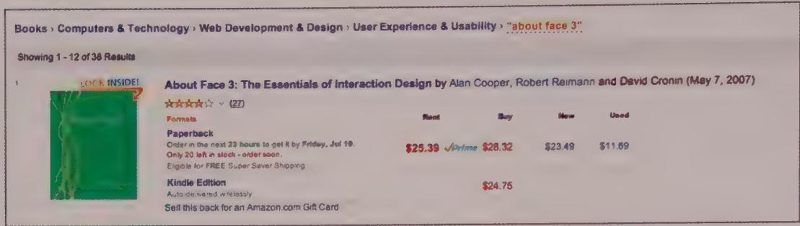
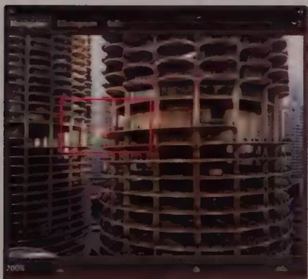
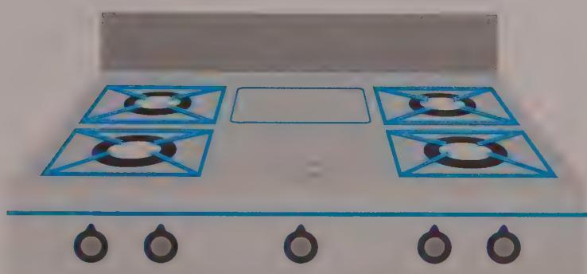

## 模块 3: 目标导向与附加税 (约 10 分钟)
<!-- BUDGET: 1800 chars | SLIDES: ≥4 | STATUS: done -->

<!-- SKELETON:
模块 3：目标导向与附加税 (10分钟)
-- 核心论断：所有偏离用户核心业务意图的界面操作，都是应当被消灭的系统附加税。
-- 情感入口：去海边度假却要在烈日下排队三小时等待安检，这种被迫的耗能正是软件体验中的附加税。
-- 金字塔支撑：
   -- 支撑点 1：附加税的定义与表现 - 目标导向任务 vs 附加税任务。四大隐性工作量衍生出导航税、拟物税与模态税。
   -- 支撑点 2：消除系统附加税的架构策略 - 用单层分组、全局路标与概览消除深层层级迷宫。
   -- 支撑点 3：遵循映射法则 - 通过物理映射（如炉灶旋钮）与逻辑映射（如排序文案）极大地降低认知税。
-- 视觉序列：Flow(度假阻力) -> Split(iOS拟物对比) -> Comparison(面包屑概览) -> Split(炉灶物理映射)
-- 出口悬念：理解了这些附加税的种类后，在具体的前端页面流转中，如何把它们彻底拆解出来？这就需要引入状态机的思维。
-->

> [VISUAL]
> **Slide**: M3-01-Excise-Tax
> **Layout**: `Flow`
> **Text**: 目标导向与附加税
> **Scene**: 一条从"起点"到"人生终极目标（抵达海滩度假）"的美好风景路径。但在这条路径上，被强行设置了数十个红色的收费站路障：办理复杂的签证、排队安检、填写入境卡等。这些红色路障统称为"附加税 (Excise)"。
> **Search**: `goal directed task vs excise obstacles path diagram`
> **知识节点**: `about-face-excise-types`
> *   **Asset**: 

### 目标导向任务与附加税的本质差异

这就引出了我们在产品架构阶段最大的敌人——“附加税 (Excise)”。

Alan Cooper 明确将数字产品中的交互操作划分为两大阵营。第一类是**目标导向任务 (Goal-Directed Tasks)**，即直接推进用户核心动机的操作，比如驾车时操纵方向盘驶向目的地。

第二类则是**附加税任务 (Excise Tasks)**：它们对达成最终目标毫无贡献，完全是为了满足工具本身的技术约束而产生的额外操作。就像你要开车出门，却必须先下车去费力地拉开生锈的车库卷帘门。或者你要去海边度假（目标导向），却不得不在烈日下排队两小时办理签证（附加税）。

在数字系统中，界面附加税往往伪装成四种隐性工作量对用户进行“征税”：**认知工作**（逼迫用户理解复杂的代码逻辑）、**记忆工作**（强迫记忆密码或数据位置）、**视觉工作**（在混乱布局中寻找按钮）以及**物理工作**（不必要的点击和鼠标长途奔袭）。尽可能消除这些附加税，是交互架构师的核心信仰。

### 附加税的重灾区：从拟物化到模态弹窗

如果我们放任系统工程底层的逻辑暴露，会产生极高昂的附加税。我们来看教材中指出的几种典型类型。

> [VISUAL]
> **Slide**: M3-02-Skeuomorphic-Excise
> **Layout**: `Split`
> **Text**: 拟物化附加税：照搬机械时代的遗迹
> **Scene**: iOS 6（左侧，沉迷于皮革纹理、纸张分页和拨盘）与 iOS 7（右侧，被完全净化的扁平数字原生界面）的直观对比（Fig 12-5）。
> **知识节点**: `about-face-excise-types`
> *   **Asset**: 

首先是**拟物化附加税 (Skeuomorphic excise)**。在设计初期，模仿物理世界（如皮革通讯录、带孔活页纸）能降低学习门槛，但它往往把物理媒介的缺陷也一并复制了过来。例如，强迫用户像翻阅实体日历一样按月切换，而不是利用数字媒介的特权提供“连续无缝滚动”的日历界面，这种对机械时代（Mechanical-Age）模型的盲目复制，随着用户熟练度的提升，就成了纯粹的附加税。

其次是粗暴打断进程的**模态附加税 (Modal excise)**。正如教材中那个丑陋的错误对话框（Fig 12-6），它用极其愚蠢的方式拦截了用户的心流，迫使用户去确认系统底层的微小异常，甚至不提供修复选项。

另外，**导航附加税 (Navigational excise)**也是常见的系统顽疾，包括深度的多界面跳转、过多的窗格切换。很多时候它源于开发者用深层嵌套的“树状结构”来强迫用户。其实，普通大众的心智模型倾向于**单层分组 (Monocline grouping)**，即把事物分为宽泛的几大类铺开。设计应当向用户呈现基于单层分组的简单结构，把深层检索隐藏在底层架构中。

### 消除策略：路标、概览与映射法则

要消灭上述附加税，我们需要依赖特定的架构策略。

> [VISUAL]
> **Slide**: M3-03-Overviews-Signposts
> **Layout**: `Comparison`
> **Text**: 提供路标与全局概览
> **Scene**: 教材图例。左上角展示 Amazon 的面包屑导航（Fig 12-11）；右下角展示 Photoshop 的 Navigator 缩略图面板与 Google Finance 底部带注释的全局图表（Fig 12-10）。
> **知识节点**: `about-face-excise-types`
> *   **Asset**: 
> *   **Asset**: 

**策略一：提供路标与全局概览**。在处理深层内容时，像亚马逊面包屑这样的**持久路标 (Signposts)** 能让用户瞬间定位自己的层级；而像 Photoshop 缩略图面板这样的**全局概览 (Overviews)**，则能极大地消除信息导航时迷失的恐慌感。

> [VISUAL]
> **Slide**: M3-04-Mapping-Principle
> **Layout**: `Split`
> **Text**: 合理映射：不让人类去猜
> **Scene**: 物理映射案例对比。左侧是一个物理映射极差的炉灶面板（四个旋钮排成一条直线，无法直观判断哪个对应哪个燃烧器，Fig 12-13）。右侧是清晰的物理映射设计（旋钮的空间位置直接构成了对四个燃烧器的直观暗示，Fig 12-14）。
> **知识节点**: `about-face-excise-types`
> *   **Asset**: 
> *   **Asset**: 

**策略二：合理映射控件与功能 (Properly map controls to functions)**。屏幕上的那个炉灶案例揭示了**物理映射**的重要性：控件的排列应当在空间上直接呼应它所操作的实体。

> [ACTIVITY]
> *   **Type**: `Quiz`
> *   **Duration**: `2min`
> *   **Desc**: 逻辑映射纠错
> *   **Q**: 某社区软件的帖子列表提供了“按时间降序”和“按时间升序”的按钮。这违背了哪种映射法则？
> *   **Options**: A. 违背物理映射 | B. 违背逻辑映射 | C. 违背单层分组法则 | D. 违背提供路标法则
> *   **Answer**: `B`
> *   **Explain**: 正确答案是 B。“升序/降序”是典型的数据库底层语言，不符合人类的日常认知。更好的**逻辑映射**是用“最新/最旧”这种大脑能瞬间解码的日常文案替代它。

这就是逻辑映射的力量。不加约束的开发往往导致“输出即输入”被破坏——“强迫用户到另一个页面去修改当前页面的信息”，这也是系统对用户征收的隐形许可税。

理解了所有的附加税种类后，在具体的前端页面流转中，如何把这些隐藏在页面深处的税点彻底拆解出来并予以消灭？这就需要我们引入一个极度硬核的工具——**状态机 (State Machine) 思维**。
