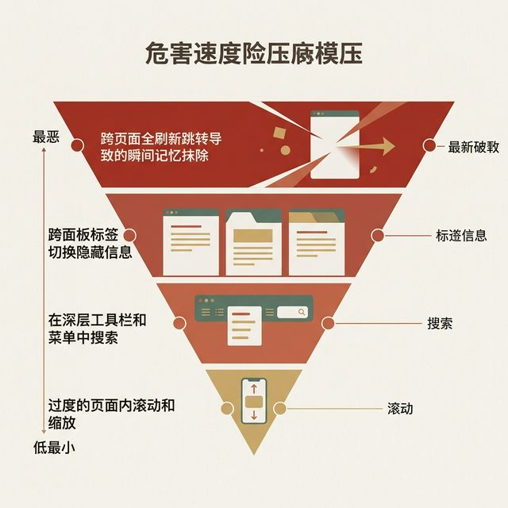

## 模块 3: 目标导向与附加税 (约 10 分钟)
<!-- BUDGET: 1800 chars | SLIDES: ≥4 | STATUS: done -->

> [VISUAL]
> **Slide**: M3-01-Excise-Tax
> **Layout**: `Flow`
> **Scene**: 一条从"起点"到"人生终极目标（抵达海滩度假）"的美好风景路径。但在这条路径上，被强行设置了数十个红色的收费站路障：办理复杂的签证、飞机延误安检、长达两小时的堵车、填写入境卡、在烈日下排队等出租车。这些红色路障统称为"附加税 (Excise Tax)"。
> **Search**: `goal directed task vs excise obstacles path diagram`
> **知识节点**: `about-face-excise-types`
> *   **Asset**: 

前面我们讲的编排，是教你怎么让界面元素和谐配合。但是，作为一个顶尖的交互架构师，在你开始编排之前，你必须先用极其冷酷的目光审视你的系统，问一个更根本、甚至更拷问灵魂的问题——**在你的满屏功能里，到底有多少操作是在真正帮助用户达成他的终极目标？又有多少操作，纯粹是因为你工程没做好，而在强行浪费他的生命？**

Alan Cooper 在这里提出了一个非常绝妙且刺骨的分类。他把用户在软件里做的所有操作，无情地劈成了两类：

第一类，叫**目标导向任务 (Goal-Directed Tasks)**。这些是直接、本质性地推进人类原始动机的操作。比如你画画时挥动笔刷的动作，比如你开车时转动方向盘的动作，比如你写代码时敲击键盘拼写算法的动作。这是用户享受的、创造价值的核心工作。

第二类，他借用了一个极其让人厌恶的现实词汇，叫做**附加税任务 (Excise Tasks)**。什么是附加税？你买车要交购置税，你发工资要交所得税。在软件工程里，附加税指的是：**那些对达成终极目标没有任何实质性贡献，但是由于当前的物理环境或技术局限，你被系统强行逼迫去完成的额外狗屁工作。**

举个不恰当但绝对真实的例子。你今天的终极目标是“去海边度假”。“躺在沙滩上喝椰汁”是你的目标导向任务。但为了实现这个目标，你被迫要做什么？你要提前一个月去大使馆排队办签证，你要花两个小时在机场被安检人员摸遍全身，你要忍受飞机上的糟糕食物和引擎噪音，你落地了还要填一张极其繁琐的英文入境卡。这些，全都是假期体验里的“附加税”。没有任何人是为了“体验机场安检”而决定去度假的。

在数字世界里，这种税收更加猖獗。你满怀激情地想给朋友发一条消息（目标导向），但你必须先指纹解锁手机，在几十个鲜艳的图标中寻找微信（视觉税），被迫看完 3 秒的开屏广告（时间税），等待沉重的沙漏加载完成，最后可能还要因为网络切换被迫重新登录验证一下手机号（系统税）。这层层叠叠的附加税，足以在一通操作后，让你彻底忘记了你最初想跟朋友说什么。

> [VISUAL]
> **Slide**: M3-02-Four-Excises
> **Layout**: `Split`
> **Scene**: 四类用户隐性消耗工作的示意图。每类配一个高亮图标和简短说明：1) 认知工作 (理解复杂的架构) — 燃烧的大脑图标 2) 记忆工作 (回想昨天的密码) — 漏水的沙漏图标 3) 视觉工作 (在满屏花哨中寻找目标) — 充血的眼睛图标 4) 物理工作 (被迫跨屏移动鼠标十次) — 抽筋的手指图标。标注：当采用纯后端工程思维（实施模型）驱动体验时，这四类工作将全面膨胀为高额附加税。
> **知识节点**: `about-face-excise-types`
> *   **Asset**: 

如果你用极其死板和偷懒的后端工程思维（所谓的“实施模型逻辑”）去主导和搭建前端的呈现视图体验界面，那么你施加在每一位无辜用户头上的这套罪恶的附加税种类和额度，简直会像滚雪球一样令人发指。它就像四座残忍的大山，主要分为四种极其消耗人类生命能量的严酷工作：

1. **认知工作 (Cognitive Work)**：也就是迫使你的用户大脑像发烫的 CPU 一样疯狂运转，去费力地理解你的系统底层数据库到底是怎么诡异搭建的。比如强迫一个根本不懂代码的小白去理解“本地极速缓存文件”、“远端节点挂载文件”和“云端跨平台同步热文件”在生命周期和读写逻辑上那如同天书般的本质技术区别。这不是他的工作，这是你们这些拿着高薪的架构师本该干完的脏活！
2. **记忆工作 (Memory Work)**：也就是残暴地逼迫用户那可怜的短时工作记忆缓存，去记住一堆极度反人类的规则信息。比如在注册页让他记住密码“必须包含至少两个大写字母、小写字母、甚至连排的特殊符号不能重复”；更恶劣的是，在长达十步的疯狂跳转购买流程中，强迫他跨了足足五个完全不相关的分类页面，凭在大脑里死记硬背去寻找并核对刚才选中的那个包含 18 位随机字母的商品雪花 ID 编号。
3. **视觉工作 (Visual Work)**：这通常源于你们对视觉排版的无能狂怒。在一张由于塞满了五颜六色的狗皮膏药、毫无视觉轴线排版层级、且密密麻麻充斥着花里胡哨闪烁动画的庞大表单里，让用户像在玩最高难度的“威利在哪里寻找隐形人大家来找茬”地狱游戏一样，血丝充满眼球地去满世界寻找这整个页面上唯一起关键作用的那个只有指甲盖大小的“立即提交保存”幽灵按钮到底藏在哪儿。
4. **物理工作 (Physical Work)**：这是对用户肉体赤裸裸的折磨。让用户的手在硬邦邦的机械键盘和极其难用的鼠标之间，频繁且极其痛苦干涩地来回切换几十次；甚至仅仅是为了删除列表边缘上的一行无效废话汉字字符，都要迫使他僵硬的手腕移动鼠标跨越整整 27 寸甚至 32 寸的巨大高清发光屏幕矩阵，去提心吊胆地极其精准地点击像素级瞄准那个隐藏在暗处极小的“x”号关闭图标。

---

作为交互设计师，你在税务局的使命非常简单粗暴：**在一切可能的地方，合法地、疯狂地消除附加税。避税就是正义。**

而在所有的系统附加税中，有一种税的“杀伤力”绝对排名第一，也就是初级产品经理最喜欢犯的错误——**导航附加税 (Navigation Excise)**。

> [VISUAL]
> **Slide**: M3-03-Navigation-Pyramid
> **Layout**: `Flow`
> **Scene**: 一张倒置的、血红色的“危险层级”金字塔图，展示四层导航附加税的破坏力。从最宽的顶部到底层（破坏力递减）：1) 跨页面/视图跳转页面 (瞬间失忆，破坏力极强) 2) 跨面板/Tab 切换 (隐藏信息，增加记忆负担) 3) 跨工具箱/系统菜单寻找 (打断当前物理动作) 4) 屏幕内无限滚动/乱缩放 (视觉眩晕)。
> **Search**: `navigation hierarchy levels severity diagram`
> **知识节点**: `about-face-excise-types`
> *   **Asset**: 

请看这张导航附加税的危险层级图。

位于金字塔最顶端，破坏力最强的罪魁祸首，就是——**跨页面跳转 (Jumping across screens/windows)**。这绝对是破坏心流的最强核武器。想象一下，你正在集中精力填写一张长达 20 项的复杂财务报销单。突然，有一个项目需要你确认某个供应商代码，你点了一个链接。此时，系统毫不留情地把当前整个主任务页面强行刷新盖掉，弹到了一个全屏的、毫不相干的后台查询库页面。等你花了三分钟查完代码，满头大汗地点下浏览器自带的后退按钮时，灾难降临了：因为页面的重新加载，你刚才辛辛苦苦填了二十分钟的报销单全部被清空了。那一刻，用户的内心是崩溃的，甚至是充满杀意的。每一次毫无防备的页面全刷新跳转，对人类脆弱的工作记忆都是一次不可逆的格式化清除。

破坏力排在第二层的是**跨面板或 Tab 切换 (Cross-pane/Tab switching)**。前端开发非常喜欢用 Tab 选项卡，因为它可以偷懒地把原本巨大的信息量像俄罗斯套娃一样粗暴地折叠起来，让首屏在 UI 稿上“看起来”既干净又整洁。但它的认知代价极其高昂：它强迫用户玩“壳套壳的盲盒游戏”。很多关键信息被生硬地割裂，并藏在不同的 Tab 黑箱里，用户的大脑每分每秒都在被迫进行高强度的位置空间记忆练习——“等一下，那个开发票的税号设置项，到底是在‘基础信息’那个 Tab 里，还是在‘财务高级设置’里边？” 找不到的时候，他只能在五个 Tab 之间像无头苍蝇一样疯狂来回点击。

往下，第三层是**在工具栏和隐藏菜单里寻找 (Searching in toolbars/menus)**。也就是俗称的“功能去哪儿了”。比如微信把“拍一拍”这种高频社交功能埋在“设置-隐私-朋友圈”这种极其诡异、长达四五级的深海节点里。功能虽然都实现了，如果用户根本找不到它在哪里，不仅功能价值归零，还在寻找的过程中积累了大量的挫败感和暴躁情绪。

最后，最底层的第四种导航税是**页面内无意义的跨越滚动和频繁的视口缩放 (Scrolling and Panning)**。这相对前三种来说比较温和，但如果在一个长且无聊的流式页面里，为了看清一张图表的细节（比如被强行限制在很小的容器里），强迫用户不断地双指放大缩小，这种纯粹的劳务工作累积起来，同样是一种严重的认知疲劳。

> **核心工程洞察：导航，它的本质就是纯粹的附加税。** 凡是强迫用户把目光从他的核心业务目标上移开，去关注你的菜单该怎么点、你的窗口该往哪拖拽的操作，全都是在犯罪。作为优秀的架构师，你的首要职责就是把这四种导航税按死在摇篮里：能不用新窗口就用原位展开，能直接平铺就不用深层 Tab，能一步到位就绝不折叠菜单。

> [ACTIVITY]
> *   **Type**: `QA`
> *   **Duration**: `2min`
> *   **Desc**: 快速知识点回顾
> 教师提问互动，校验此前核心法则的理解情况。

---

> [TEACHING MOMENT]
> 大家想没想过，到底是什么原因导致了这些附加税如此泛滥成灾？其实这源于一种在程序员视角中极其典型且几乎不可救药的设计哲学，我称之为“上帝的洁癖”。在这个被代码统治的哲学里，他们坚信“写就是写，读就是读”，系统底层的读写分离必须被神圣地映射到UI界面上。这就引发了一个我们日常见得最多的交互悲剧：“凡有输出之处，皆不允许输入”。

请你回想一下绝大多数你们用过的教务系统或者内部 ERP 打卡系统。你想修改一个学生的学号信息。你点进了“学生主页”，看到了那个显眼的学号数字（输出）。此时，不管你怎么急促地双击它，它都是死的，只是一个冰冷的文字符号。系统冷漠地强迫你：请先退回到上一级长列表，勾选这名学生前面的复选框，然后再艰难地移到屏幕右上方寻找一个叫做“修改数据”的独立编辑页面功能按钮（转入输入模式）。

这在实施模型的数据库逻辑上极其合理完美：Update 和 Select 是两种完全不同的 SQL 语句，需要触发完全不同的生命周期和鉴权机制。所以要用两个完全独立的视图（页面）来承载。

**但对不起，这种冰冷的机器逻辑，对用户的心智模型来说，简直是反人类。**
普通人的心智模型是什么？我们从小到大是怎么修改作业本上的错别字的？——**我亲眼看到哪个字写错了，我就用橡皮直接在那个位置上把它擦掉，然后用铅笔在同一个物理坐标点上原地盖写一个新的字。** 就这么简单、直觉、高效。没有人会在修改作业之前大喊一声：“老师，请允许我先进入铅笔编辑模式！”

这就是 Cooper 教给大家的终极准则：**凡有输出（看到信息）之处，皆应允许输入（直接就地修改）。** 这，就是用最野蛮、最粗暴的方式，砸碎那座名叫“跳转编辑页面”的附加税大山。

---

还有一种附加税值得单独拎出来——**拟物化附加税 (Skeuomorphic Excise)**。

> [VISUAL]
> **Slide**: M3-04-Skeuomorphism-Tax
> **Layout**: `Comparison`
> **Scene**: 左右极端对比。左侧：iOS 6 的拟物化通讯录界面（极其逼真的皮革质感纹路、高亮立体反光、硬质纸张翻页卷边动画特效、右侧强制锁死的 A-Z 字母固定手扣索引条）。右侧：iOS 7 的极度扁平化通讯录界面（全局纯白空间、搜索框强制置顶霸占最高权重、极其清晰洗练的无框文字列表、彻底抛弃一切多余的材质纹理装饰阻隔）。标注极其醒目：左 = 愚蠢地将旧世界物理隐喻的致命限制1:1复制到数字高维世界 / 右 = 彻底打碎枷锁释放数字维度的无穷原生搜索能力。
> **Search**: `iOS 6 vs iOS 7 contacts app skeuomorphism flat design comparison`
> **知识节点**: `about-face-excise-types`
> *   **Asset**: 

[CASE STUDY]
大家看向大屏幕，这可以说是整个产品史上的一个神级分水岭。如图，左边这个看起来非常熟悉但又有些年代感的，是极其经典的乔布斯时代 iOS 6 系统的通讯录界面——它极其偏执地追求那种以假乱真的缝线皮革质感、极其逼真的纸张翻页滑动物理效果、甚至在屏幕最右侧死死地钉嵌了一条无法挪动的物理世界字母索引定位条。它从骨子里，在极度疯狂地模拟我们在抽屉里经常看到的什么东西？对，一本实体的、纸质的小本子通讯录。

当时全世界的设计师都在疯狂赞美这种拟物化设计的质感，但他们没有意识到这里面藏着多么恐怖的认知绞肉机。作为一本现实物理世界中的实体纸质的厚重通讯录，它有一个极其致命甚至可悲的三维原子空间绝对限制：你只能、且唯独只能按照上面印好的 ABC 拼音字母的首字母顺序去硬性排列表里的所有联系人。一旦印刷完成，顺序就是锁死的定局。如果你在极其紧急的情况下，想临时切换成按照“谁是我最近三小时刚联系过的人”或者“谁的所在地和我是同一个城市”这种高阶业务维度来进行动态重新分类排序——对不起，极其冰冷且无情的物理世界规则会冷酷地告诉你，这绝对做不到，除非你把整本书撕碎。

而如果我们把这种物理世界的天然极低效残疾限制，极其愚蠢、不加任何过滤批判脑子地 1:1 全部照搬抄袭到本该拥有无穷算力、高维上帝视角的数字屏幕产品里，强迫用户为了找个名字非得在这堆假皮革和假翻页动画里通过极其机械且原始的首字母索引艰难去翻找目标的时候——那么所有这些为了模拟一本可悲的旧世界实体书本而产生的那些所谓“华丽复古”的翻页动画过渡时间、以及被屏幕右侧那一排僵硬且不可改变的 26 个毫无拓展性的字母检索死板按键所残暴消耗霸占的极其宝贵的屏幕黄金点击空间像素，它们在这一刻，统统沦为了一种彻头彻尾的、极度可笑且荒唐可悲的**巨额拟物化附加税**。因为它们彻底锁死了我们在这个硅基神谕维度的原生数字特权——那就是本该享用的：极其高效的全局模糊瞬间搜索、随心所欲的全维度动态时间线降序排列，这才是数字维度独有的降维打击。拟物化本身不是错，最大的错，是在于它把旧物理世界那些充满隐喻的致命枷锁，也傲慢地原封不动复制并污染到了极其自由的数字代码世界里。

---
