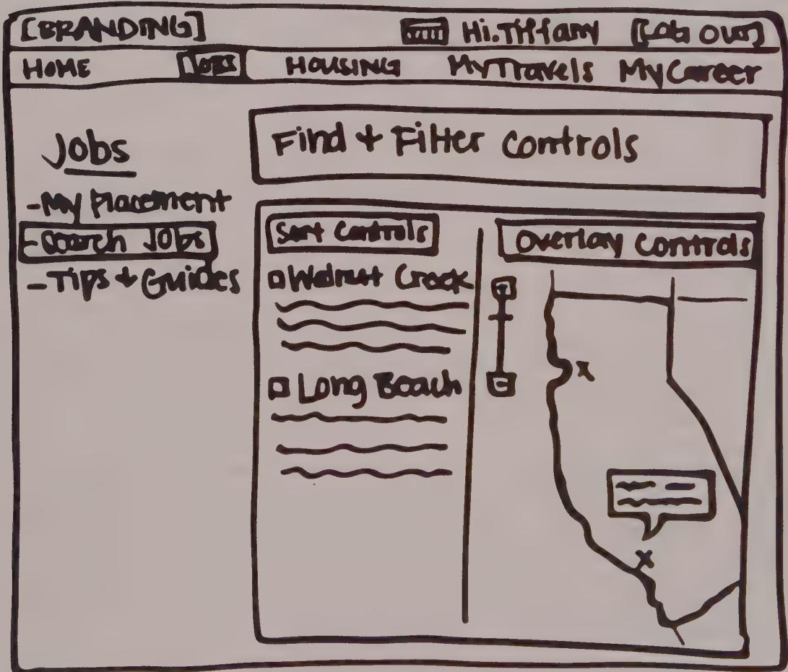
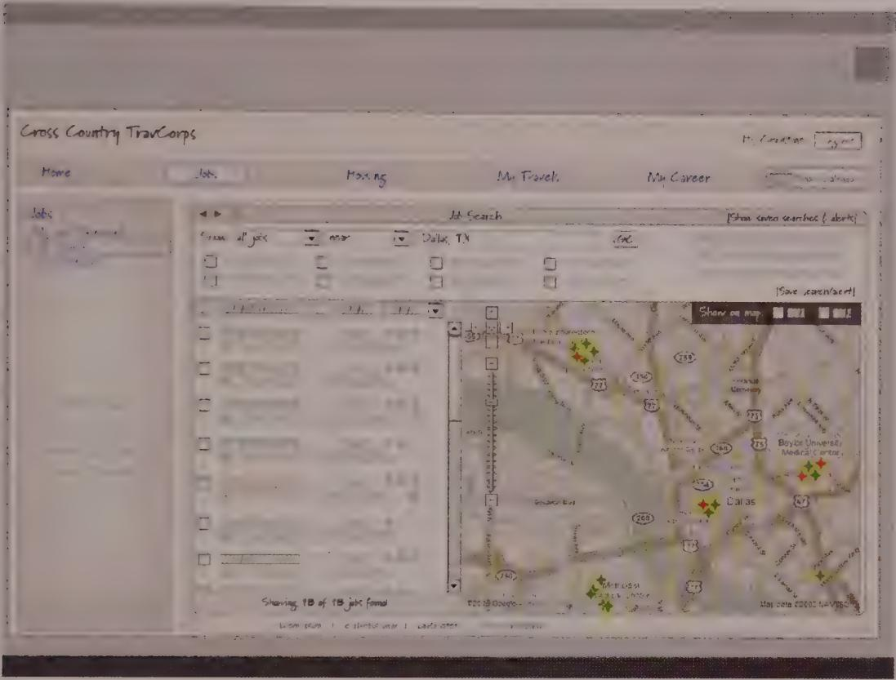

## 模块 4: 从心流到页面流——状态机拆解 (约 13 分钟)
<!-- BUDGET: 2300 chars | SLIDES: ≥4 | STATUS: done -->

<!-- SKELETON:
模块 4：从心流到页面流——状态机拆解 (10分钟)
-- 核心论断：交互框架设计不是画好看的界面，而是严谨地定义底层状态机的流转与验证。
-- 情感入口：你兴冲冲地画完了所有高保真界面，开发却问你“点这个按钮后没网络跳去哪页”时的崩溃瞬间。
-- 金字塔支撑：
   -- 支撑点 1：框架定义六步法 - 从明确外形尺寸、姿态，到定义数据与功能层级的构建。
   -- 支撑点 2：矩形阶段与状态机映射 - 用低保真草图连接流转箭头，将抽象的心流具象化为可执行的页面状态流转。
   -- 支撑点 3：场景驱动验证 - 用关键路径场景结合故事板跑通主线，再用必须使用场景与边缘场景补全防线死角。
-- 视觉序列：Full(框架定义流程) -> Split(矩形草图与状态机) -> Comparison(故事板与视觉演进) -> Flow(验证场景矩阵)
-- 出口悬念：至此，整个前端的逻辑骨架已经搭建完毕。下一步，我们如何在实验中真实地将这些骨架拼装起来？
-->

> [VISUAL]
> **Slide**: M4-01-Framework-Process
> **Layout**: `Full`
> **Text**: 构建交互框架的六步法
> **Scene**: 屏幕上展示着《About Face》教材中经典的“框架定义流程 (The Framework Definition process)”示意图（Fig 5-1）。强调设计不是一蹴而就的像素填充，而是一个从抽象功能、空间分组到草绘流转的严谨工业级六步迭代过程。
> **知识节点**: `about-face-ch14-framework`
> *   **Asset**: 

### 构建交互框架的工程纪律

理解了附加税的破坏力后，下一步就是如何在复杂的业务中彻底消除它。很多新手设计师最大的痛点是：**不知道第一笔该画什么**。当你兴冲冲地画完几十张精美的高保真设计稿交给开发时，开发可能会冷冰冰地问你：“用户点这个按钮后，如果没有网络，应该跳去哪个状态？”——此时你才发现，你的设计只有好看的皮囊，完全没有逻辑骨架。

Alan Cooper 在《About Face》中指出，设计阶段首先要关注的是界面的整体结构和相关行为，而非像素级细节。这个结构被称为**交互框架 (Interaction Framework)**。

在敏捷团队中，谁来主导这套框架的定义？
答案是**交互设计师 (UX Lead)**。但你绝不是一个人在战斗：上游的**业务守门员 (PM)** 为你提供设计 Brief 作为约束输入；下游的**开发工程师**则要在你的框架基本成型时尽早介入评审，评估技术可行性。

有了团队协作的认知，我们再来看交互框架。它不仅定义屏幕布局，更定义了产品的**流程 (Flow)**。它的构建包含六个核心步骤：
1. **定义外形尺寸与姿态**：明确产品运行的媒介（如桌面 Web 或手机端）及用户投入的注意力姿态。
2. **定义功能与数据元素**：明确核心数据及其操作工具，并假装产品是“人类”，赋予它体贴主动的特质。
3. **确定功能组与层级**：将功能进行最佳组合，促进人物模型在任务中的“心流”。如果用户有多个互不重叠的目标，就定义独立的视图；如果需求高度聚合，则合并视图。

完成了前三步的概念重构后，接下来就是真正将心流“具象化”的时刻。

### 矩形阶段：Task Flow A/B 与视觉映射

> [VISUAL]
> **Slide**: M4-02-Rectangles-Phase
> **Layout**: `Split`
> **Text**: 矩形阶段：绘制状态流转
> **Scene**: 大屏幕展示教材中的“早期框架草图 (An early framework sketch)”（Fig 5-2）。画面中只有极其粗糙的低保真矩形线框代表视图和容器，重点是矩形组之间穿插的箭头，代表着状态转移 (State changes) 与页面流。
> **知识节点**: `about-face-ch14-framework`
> *   **Asset**: 

第四步被称为**矩形阶段 (The rectangles phase)**。

在这一步，我们依然不画任何具体的按钮或圆角。我们将每个视图细分为粗略的矩形区域（对应窗格或工具栏）。真正的精髓在于：**在矩形之间绘制流转箭头**。

在这里，架构制图师面临着两条战术路径的抉择：
- **Task Flow A（线性任务流）**：这代表着一切顺利的 **Happy Path (关键路径场景)**，是从起点直达终点的最快通道。
- **Task Flow B（分支决策流）**：这代表着遭遇异常时的 **边缘兜底场景**。

这些流转箭头代表着**状态改变 (State changes)**。在计算机科学中，这就是底层**状态机 (State Machine)** 流转的直观表达。在这个阶段，交互架构师的工作本质上是在编排一堆互相关联的系统状态。通过白板和低保真草图，我们能以极低的成本快速推翻和探索多个状态转移路径，确保整体的“页面流 (Page Flow)”不会产生额外的附加税。

### 故事板与验证防线

> [VISUAL]
> **Slide**: M4-03-Storyboarding
> **Layout**: `Comparison`
> **Text**: 关键路径场景的演进
> **Scene**: 对比图。左侧展示基于关键路径场景的连续状态流转和低保真演进（Fig 5-3）；右侧展示其最终落地的视觉语言研究阶段（Fig 5-4）。强调从逻辑推演到最终视觉的顺滑过渡。
> **知识节点**: `about-face-ch14-framework`
> *   **Asset**: 
> *   **Asset**: 

第五步是**构建关键路径场景 (Construct key path scenarios)**。我们利用一系列按序排列的低保真草图构建出故事板 (Storyboarding)。这就像一部电影的分镜头脚本，生动展示了用户动作与系统的连续状态响应，是对整个状态机运转的“现实检验”。

最后一步，也是极其关键的防御工程：**通过验证场景检查设计**。

> [ACTIVITY]
> *   **Type**: `Quiz`
> *   **Duration**: `2min`
> *   **Desc**: 状态验证防线区分
> *   **Q**: 开发团队在测试系统时发现，当用户恰巧录入两个完全同名同姓且手机号完全一致的极小概率联系人时，UI 界面排版会略微错位。在设计框架验证阶段，这属于哪种场景？是否应该为了完美解决它而牺牲主流程的极简性？
> *   **Options**: A. 属于必须使用的场景，应当增加额外的弹窗强制用户改名 | B. 属于边缘用例场景，交由底层代码健壮性防御即可，不应牺牲主界面的简洁 | C. 属于替代场景，应当开辟一个新的视图专门处理同名同姓 | D. 属于关键路径场景，因为通讯录录入是核心功能
> *   **Answer**: `B`
> *   **Explain**: 正确答案是 B。教材将验证场景分为三种：替代场景（备选主线）、必须使用的场景（系统配置等极低频但必要的操作，需强化引导）和边缘用例场景（极端异常）。题干中的情况属于纯粹的边缘用例，开发人员常聚焦于此防范 Bug，但在设计框架时，它绝对不应成为耗费核心精力的焦点，更不应为了小概率事件增加正常的交互附加税。

正如刚才所讲，我们用关键路径跑通了主干，用替代场景覆盖了分支，用必须使用的场景修补了低频断点。当你的状态机抗住了所有这些场景的拷问，你的交互框架就拥有了坚不可摧的逻辑内核。

至此，整个产品前端的逻辑骨架已经被我们搭建完毕。从心流理论到附加税甄别，再到严谨的状态机拆解，大家已经具备了现代数字产品架构师的核心能力。下一步，我们如何在实验中真实地将这些骨架拼装起来？这就进入到了我们将要面临的实验实践阶段。
