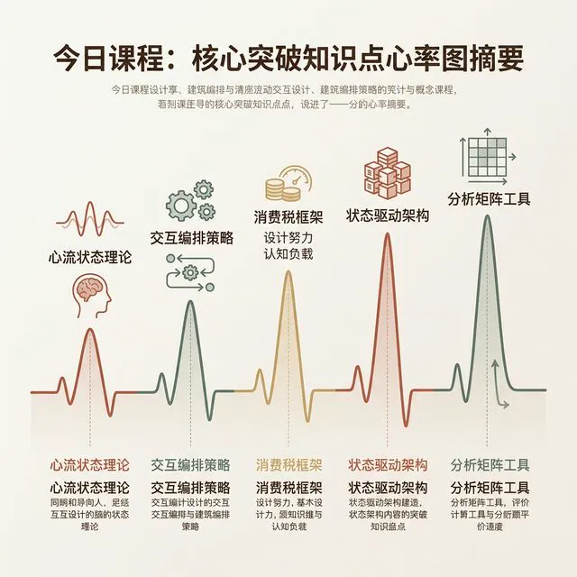
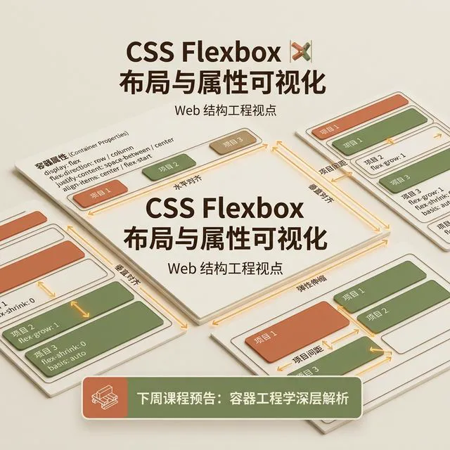

## 模块 6: 课程总结与下次预告 (约 10 分钟)
<!-- BUDGET: 1000 chars | SLIDES: ≥1 | STATUS: done -->

> [VISUAL]
> **Slide**: M6-01-Summary
> **Layout**: `Split`
> **Scene**: 课程核心脉络图，高亮今天的突破点。
> **Text**: 交互架构四大基石
> **List**: 透视心流 / 状态编排 / 剥离附加 / 状态机
> **Source**: `AI`
> **知识节点**: `about-face-ch11-flow`
> *   **Asset**: 

> [TEACHING MOMENT]
> 今天这节课最核心的认知升级只有一句话：**从今天起，你们不再是画界面的人，而是编排状态的人。** 页面只是状态的投影，状态机才是产品的骨骼。当你下一次打开 Figma 之前，先问自己：这个系统在遭遇断网、超时、空数据的极端时刻，它的状态会流向哪里？如果你回答不了这个问题，你就没有资格动那支画笔。

最后五分钟，我们把今天讲的架构知识与上周的调研成果拼合成一张完整拼图。

上周，你们用 MVP 验证了“核心需求假设”，获取了宝贵的数据点。但如果不给这些需求装上健壮的系统架构与状态边界，它们验证的价值就无法落地。从今天起，你们必须彻底突破“页面美工”的思维，进化为掌控系统状态的**交互架构工程师**！

同时，你必须明白，架构师绝对不是孤军奋战。你的每一份状态流转图，最终都需要通过像 Brief 或 PRD 这样的团队语言，清晰地传达给你的 PM 和开发战友。

### 架构师的视野：透视心流与系统透明性

> [VISUAL]
> **Slide**: M6-01a-System-Transparency
> **Layout**: `Full`
> **Scene**: 一张展示极简无感交互的真实产品 UI 对比图。
> **Text**: 物理与数字的透明性
> **Source**: `External`
> **Search**: 极简 UI 设计 透明界面 无感交互 (invisible UI seamless interaction)
> *   **Asset**: 

焦点不再是视觉表象，而是操作背后的**心流 (Flow)** 与**透明性 (Transparency)**。你的系统架构必须像得心应手的工具一样预判用户意图，而不是像一堵死板的石墙处处设卡校验。

### 架构师的工具：状态编排与心智保护

> [VISUAL]
> **Slide**: M6-01b-State-Orchestration
> **Layout**: `Right`
> **Scene**: 真实优秀应用中手风琴面板、抽屉或非模态反馈的设计截图，展示次级状态的收纳。
> **Text**: 状态编排：少即是多
> **Source**: `External`
> **Search**: 手风琴折叠面板 抽屉组件 非模态反馈 UI (accordion UI drawer non-modal feedback)
> *   **Asset**: 

你手中掌握的是**状态编排策略 (State Orchestration)** 的核心控制权。严格遵循“少即是多”，熟练利用手风琴面板、抽屉或非模态反馈收纳次级状态，在信息过载的环境中保护用户极其稀缺的心智带宽。

### 架构师的决断：剥离附加税与构建状态机

> [VISUAL]
> **Slide**: M6-01c-Excise-Elimination
> **Layout**: `Split`
> **Scene**: 繁琐的深层嵌套菜单和多重 Tab 与精简优化后的界面对比图。
> **Text**: 剥离阻断心流的附加税
> **Source**: `External`
> **Search**: 复杂嵌套菜单优化 减少全量刷新 UX优化对比 (complex nested menu optimization UI)
> *   **Asset**: 

你要果断审查并剥离一切阻挠心流的**附加税 (Excise Tasks)**。无论是频繁滚动、深层嵌套菜单、多重 Tab 切换，还是页面全量刷新，都要将它们从体验主干道上彻底剥离。

最终，所有交互法则必须沉淀为一张逻辑严密的**全局状态机**网络！这不再是白板上的概念，而是可供开发工程师用状态变量 1:1 还原为真实代码的工程蓝图，是保障系统健壮性的核心底层架构！

> [VISUAL]
> **Slide**: M6-02-Next-Teaser
> **Layout**: `Full`
> **Scene**: 一张充满 CSS 属性和弹性盒子布局的网页结构透视渲染图。
> **Text**: 下周预告：建立间距系统与容器映射
> **Caption**: 预告：当虚拟的蓝图撞上浏览器的物理边界。
> **Source**: `AI`
> **知识节点**: `frontend_css_box_model`
> *   **Asset**: 

**预告下周：**
如果说这五周我们都在绘制心智蓝图，那么下周 (W06)，当这份蓝图准备转化为真实代码时，我们将迎来工程化落地——主题是**“建立间距系统与容器工程化映射”**。

在 Figma 里，你可以随意用绝对坐标放置像素；但在真实尺寸多变的浏览器世界中，元素将面临严酷的挤压与拉伸。下周我们将揭秘前端 CSS 的盒模型规律，学习建立 Design Token 与间距系统。没有底层秩序约束的界面，在屏幕响应变化时终将变成灾难。

下课！这周的实验操作中，请大家严格执行架构审查，把本该由系统处理的无用确认路径全部优化重构！
