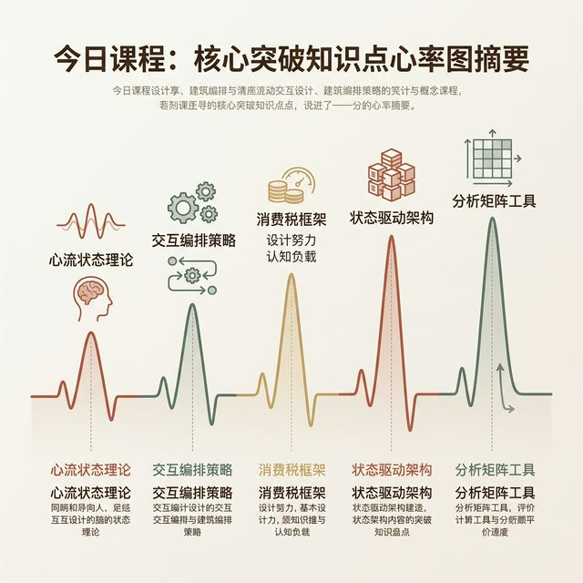
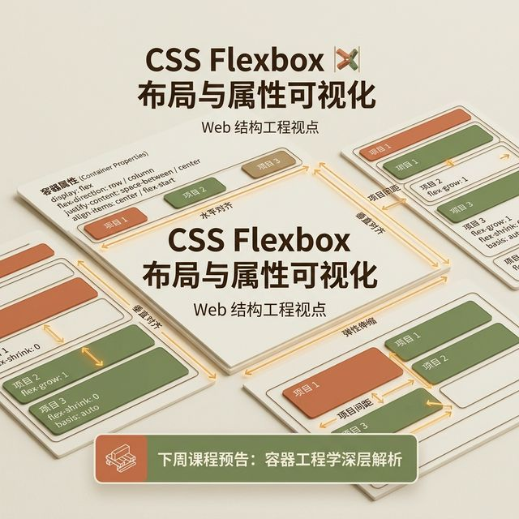

## 模块 6: 课程总结与下次预告 (约 10 分钟)
<!-- BUDGET: 1000 chars | SLIDES: ≥1 | STATUS: done -->

> [VISUAL]
> **Slide**: M6-01-Summary
> **Layout**: List
> **Scene**: 课程核心脉络图，高亮今天的突破点。
> **知识节点**: `about-face-ch11-flow`
> *   **Asset**: 

> [TEACHING MOMENT]
> 今天这节课最核心的认知升级只有一句话：**从今天起，你们不再是画界面的人，而是编排状态的人。** 页面只是状态的投影，状态机才是产品的骨骼。当你下一次打开 Figma 之前，先问自己：这个系统在遭遇断网、超时、空数据的极端时刻，它的状态会流向哪里？如果你回答不了这个问题，你就没有资格动那支画笔。

好，各位，我们今天的内容非常极客，也非常违背直觉，甚至是对你们过去画图习惯的一次彻头彻尾的颠覆。借着最后五分钟，我们必须要把今天讲的这些硬核甚至晦涩的知识碎片，和你们上周抛头颅洒热血换来的东西，重新死死地钉牢在一起，拼成一张贯穿整个学期的宏大数字战役拼图。

今天，我们不仅仅是上了一节课，我们是带领大家完成了一次关于创造数字资产方法论的认知维度的极其升维打击。从这节课开始，我绝对不再允许这里的任何人，像一个只会拼凑好看组件的"页面流水线装潢美工师"一样去思考问题。上周，你们用极致粗糙甚至丑陋的 MVP，也就是 Lean UX 最精华的最小可行性产品测试手段，像特种兵一样冲进现实的泥沼，斩获并且极其冷酷地验证了那个决定全组人生死的“核心需求假设”。那是你们战术上取得的第一滴鲜血，它极其神圣。但是，如果不给这些孤零零跳动的、随时也会熄灭的痛点需求，装上能够适应真实数字世界、经得起上万人同时踩踏敲击的健壮血管与骨骼，它们上周验证成功的价值就只不过是一场春梦！你们必须从今天开始，强迫自己破茧，彻底进化为一名掌控时间与空间的**交互架构工程师**！

**在这位新生的交互架构师的超维眼睛里，他看的究竟是什么？**
你看的绝对不再是那些极其肤浅的渐变色彩和谐度、圆角的物理像素大小！你那双锐利的眼睛，透过屏幕反光，看到的是用户脑电波般的**心流绝对速度 (Flow)**。你衡量一个设计方案是传世之作还是数字垃圾的唯一严酷标准，不再是它发到社交网络上能不能斩获多少个赞，而是它究竟有没有达到那种让人感觉不到它存在的极致的**物理与数字的透明性 (Transparency)**——你的整套系统架构，能否像你最熟练的那具肉身或者那把被锤打了几百遍的铁锤一样，极其聪明如影随形地紧贴并预判感知着用户的意图，而不是像一堵冰冷且死板的石墙一样，每前进一步都傲慢地强行勒令用户大声停下宣读通行指令才肯放行。

**这位架构师的双手里，紧紧攥着的又到底是什么神兵利器？**
你手里攥着的不再是简单的画笔，而是**状态编排策略 (State Orchestration)** 的最高指挥权杖。那些生性极其喧闹而且不受控制的各种红绿色按钮、满天飞的弹框、无脑的震动提示，在你近乎独裁的神级指挥棒下，必须极其严密地学会"少即是多，指挥而非平级对话"的主仆铁律法则。你极其熟练且极其狡猾地懂得利用极其轻量的前端手风琴折叠面板、隐形触发的抽屉状态、或者用悄无声息的非模态视觉进度反馈，去安静妥善安置那些本必不可说、但不属于当下最核心高亮诉求的次级辅助状态。你就是依靠这根指挥棒，在这个本身就已经充斥着极度高压精神垃圾噪音和随时会干扰心志的布满断层与陷阱的险恶数字狂野世界里，尽全部极其惊人的力量，去死死捍卫甚至拼死保全我们每位自然人用户那被压榨得极其脆弱和稀缺的精神注意力与宝贵心智带宽。

**而最后，在最深信这位架构师冷酷的心里，到底又到底深藏着一把多么恐怖什么屠戮的利刀？**
那是一把刀锋如雪、极其致命且专门用来斩断和绞杀一切**阻挠心流的附加税 (Excise Tasks Killing)** 的外科剔骨解剖手术刀。刚才我们在那面布满警报的黑板上，极其详细地血淋淋拆解了一座深藏着四层庞大金字塔结构的极其狡诈险恶的隐性阻断摩擦与导航地雷：从屏幕上令人眩晕的频繁鼠标滚轮滚动、到深不见底毫无逻辑的盲盒抽屉菜单、到极度折损空间定位感切割记忆的疯狂互相嵌套切换 Tab，一直升格到位于金字塔最顶尖、破坏力如同能抹除硬盘记忆一样巨大的页面整体全量刷新跳转。你们不仅要能极其敏锐地像嗅出腐臭味一样认出它们潜藏在哪行交互稿里，你们还要更加残忍、更加毫不留情地像剜肉一样，把它们从用户的体验直觉心流主干道路径上给极其彻底地、永远地连根剔除并且用更柔性的技术路线替代掉。

最终，你们将所有这些高度抽象、甚至哲学化的心法和教条，都没有挂在嘴上，而是极其冷酷务实地执行、将其犹如神兵降世一样降维打击，极其完美且严丝合缝地凝练并沉淀进了一张无比强悍、不带一丝水份的**全局状态机拆解网**上！这张虽然密密麻麻看起来眼花缭乱却井然有序的大网，它再也不是漂移在白板上的纸上谈兵体验概念，而是真真切切地、可以被后端工程师拿过去一行不差、用极严密状态迁移变量 1:1 分毫不差地敲入键盘给硬核还原出来的真实服务器与前端工程代码逻辑流结构图谱！请大家记死在心里：这，正是你们手上正在打磨的这套破破烂烂的产品原型，在经历了初创痛苦后，在未来能够承受并活着挺过真实世界这台疯狂绞肉机复杂考验的最坚不可摧的万丈高楼钛合金地基！

> [VISUAL]
> **Slide**: M6-02-Next-Teaser
> **Layout**: Image
> **Scene**: 一张充满 CSS 属性和弹性盒子布局的网页结构透视渲染图。
> **Caption**: 预告：当虚拟的蓝图撞上浏览器的物理边界。
> **知识节点**: `frontend_css_box_model`
> *   **Asset**: 

**预告下周：**
如果说这五周，我们都在学习如何在空中楼阁里绘制一幅完美的心智蓝图；那么下周 (W06)，当我们手捧着这卷蓝图，准备把它交给程序员变成真实的每一行代码时，我们会迎来一次极其猛烈的工业化撞击——主题是**“建立间距系统与容器工程化映射”**。

在 Figma 里，你可以随意用绝对坐标放置一个像素点；但是在真实的、尺寸千变万化的浏览器世界里，所有的元素都会面临残酷的物理挤压和无限拉伸。我们必须要硬核揭秘前端 CSS 的盒模型本质规律，并学习如何建立如同神圣不可侵犯的法律一般的 Design Token 和间距系统。因为，没有底层秩序约束的华丽界面，最终在屏幕响应变化时，都会变成灾难现场。

下课！各位执行力拉满，这周的 实验2 操作白板上，不要手软，把那些本该由编排系统承担的无用确认路径，全部杀光！
