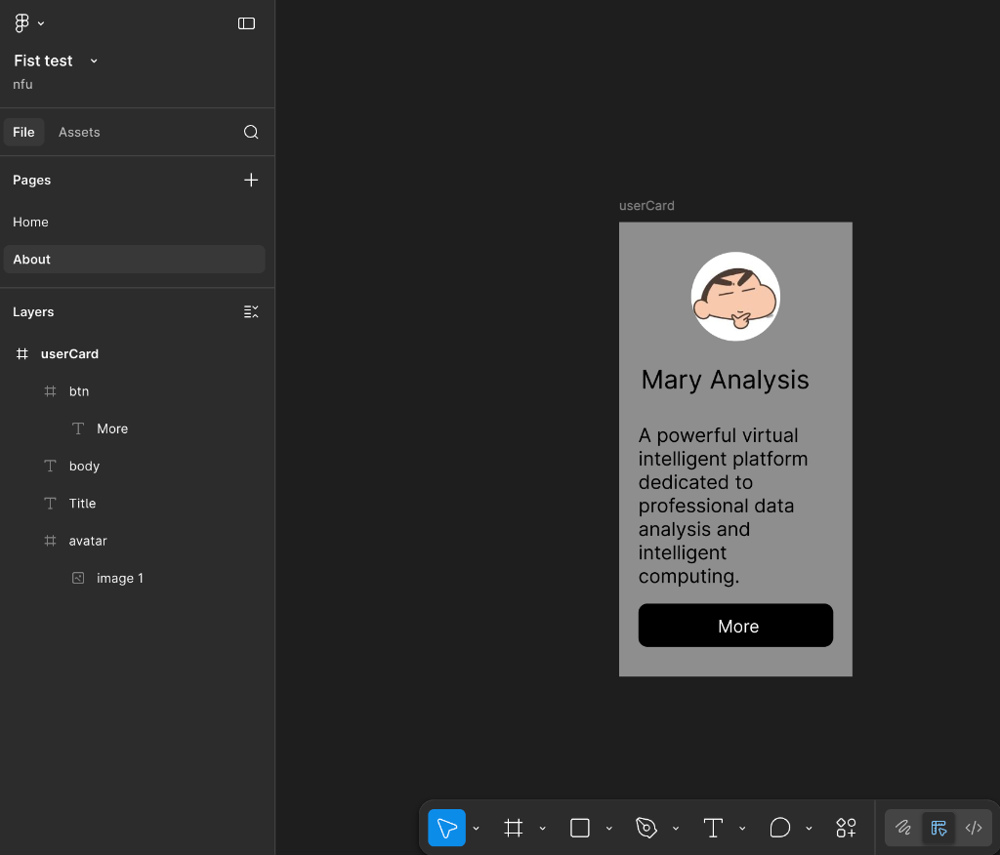
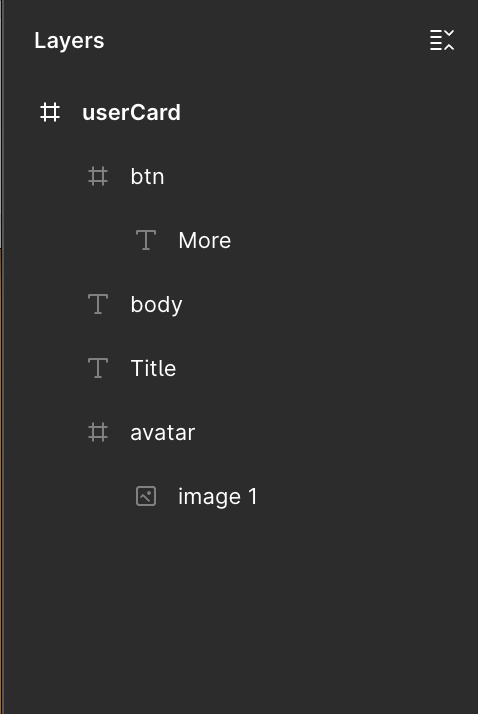
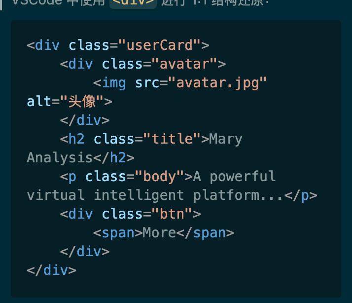
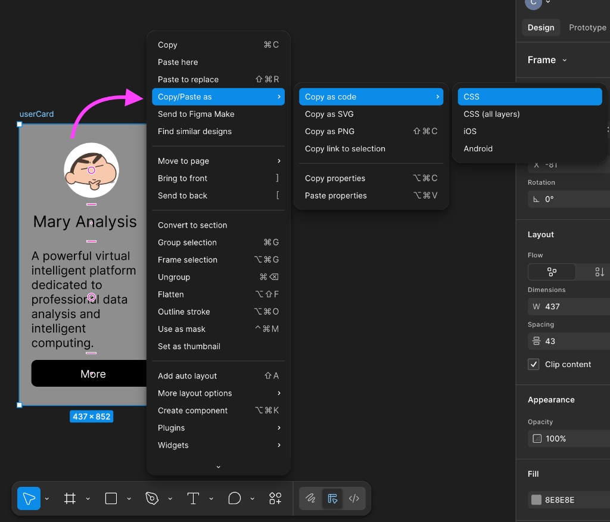

# 实践指南：用户卡片 (User Card) 的双重构建

## Stage 1：手工时代的脆弱 (画布思维)

**学习目标**：体会脱离了父级统筹的绝对坐标排版，在面对真实动态数据时有多么脆弱。

### 任务 1：Figma 基础对象手工拼装
在此阶段，**绝对禁止**使用 `Shift + A` 开启 Auto Layout。请完全凭借视觉直觉绘制卡片。

**最终目标参考图**：
 

1. **创建主载体 (userCard)**：
   - 使用快捷键 `F` 新建一个 Frame，命名为 `userCard`。
   - 在右侧面板设置尺寸：`W: 437, H: 852`（或任意适合的竖向比例尺寸）。
   - 添加深灰色背景 (Fill)，并设置圆角 (Corner Radius) 为 16。
2. **绘制头像 (avatar)**：
   - 新建一个 Frame 命名为 `avatar`，设置为正圆形 (等宽高，圆角拉满)。
   - 置入头像图片（如示例中的小新），手动拖拽到卡片的中上部。
3. **添加文本区**：
   - 使用文字工具 `T` 添加标题 `Title`，内容输入“Mary Analysis”，字号调大并加粗。
   - 再次添加正文 `body`，输入说明文本，手动将其与标题对齐。
4. **制作按钮 (btn)**：
   - 新建一个 Frame 命名为 `btn`，填充黑色背景，设置大圆角。
   - 在其中输入文本 `More`，手动调整文本在按钮框内的绝对居中。

**图层结构校验**：
完成拼装后，请检查左侧的 Layers 面板，确保图层呈如下嵌套关系，且没有任何表示 Auto Layout 的水平/垂直小横杠图标。

*(注：请将您提供的图层结构截图保存在此路径)*

### 任务 2：VSCode 绝对定位复现与破坏测试

1. **编写结构 (HTML)**：
   根据上述的 Layers 面板结构，在 VSCode 中使用 `<div>` 进行 1:1 结构还原：
   ```html
   <div class="userCard">
       <div class="avatar">
           
       </div>
       <h2 class="title">Mary Analysis</h2>
       <p class="body">A powerful virtual intelligent platform...</p>
       <div class="btn">
           <span>More</span>
       </div>
   </div>
   ```
   
   > [!TIP]
   > **Figma 图层与 HTML DOM 树的 1:1 映射法则**：
   > 仔细观察，你在 Figma 左侧建立的**父子嵌套结构**，正是右侧 HTML 结构代码的完美倒影：
   > - 最外层的 `# userCard` 画板，对应了最外层的包裹容器 `<div class="userCard">` (大盒子)。
   > - 内部的 `# avatar` 和 `# btn` 容器，对应内部的 `<div class="avatar">` 和 `<div class="btn">` (子盒子)。
   > - 最末端的文本图层 `T More` 等，则对应着 HTML 里的文本标签如 `<span>` 或 `<h2>` (叶子节点)。
   >
   > 

   > [!TIP]
   > **文字标签小科普**：
   > - `<h2>`~`<h6>`：**标题 (Heading)**，自带逻辑层级与块级换行本能。
   > - `<p>`：**段落 (Paragraph)**，用于大段内容，默认占据整行空间。
   > - `<span>`：**行内包裹 (Span)**，像保鲜膜一样紧贴文字，不破坏排版换行，常用于按钮内部文字。

2. **搬运死板的代码 (CSS)**：
   - 在 Figma 中，右键点击各个图层元素（如 `userCard`），在菜单中依次选择 **Copy/Paste as > Copy as code > CSS**。
   - 粘贴到 VSCode 后你会发现，生成的 CSS 代码中充斥着类似 `position: absolute; left: 45px; top: 120px; width: 300px;` 的绝对坐标。
   - 将这些包含绝对坐标和固定宽高的 CSS 原封不动地复制到你的 HTML `<style>` 标签中，完成 1:1 视觉还原。
   
   

   > **参考：手工时代的 CSS 输出示例**
   > 如果你在课堂上没来得及画完，可以直接复制下方这段代码到你的 `<style>` 中。请注意观察，这里面充斥着满屏的 `position: absolute` 和被彻底写死的绝对坐标（`left` / `top`）。
   > ```css
   > /* userCard */
   > position: relative;
   > width: 437px;
   > height: 852px;
   > background: #8E8E8E;
   > 
   > /* avatar */
   > position: absolute;
   > width: 167px;
   > height: 167px;
   > left: 135px;
   > top: 56px;
   > background: #000000;
   > border-radius: 982px;
   > 
   > /* image 1 */
   > position: absolute;
   > width: 225px;
   > height: 224px;
   > left: -29px;
   > top: -29px;
   > background: url(image.png);
   > 
   > /* Title */
   > position: absolute;
   > width: 355px;
   > height: 68px;
   > left: 41px;
   > top: 266px;
   > font-family: 'Inter';
   > font-style: normal;
   > font-weight: 400;
   > font-size: 48px;
   > line-height: 58px;
   > color: #000000;
   > 
   > /* body */
   > position: absolute;
   > height: 295px;
   > left: 36px;
   > right: 36px;
   > top: 377px;
   > font-family: 'Inter';
   > font-style: normal;
   > font-weight: 400;
   > font-size: 36px;
   > line-height: 44px;
   > color: #000000;
   > 
   > /* btn */
   > position: absolute;
   > width: 365px;
   > height: 81px;
   > left: 36px;
   > top: 715px;
   > background: #000000;
   > border-radius: 17px;
   > 
   > /* More */
   > position: absolute;
   > width: 162px;
   > height: 35px;
   > left: calc(50% - 162px/2 + 47.5px);
   > top: 23px;
   > font-family: 'Inter';
   > font-style: normal;
   > font-weight: 400;
   > font-size: 32px;
   > line-height: 39px;
   > color: #FFFFFF;
   > ```

3. **破坏测试 (体会痛点)**：
   - 在 HTML 中，将 `body` 段落的内容复制粘贴 3 次，使其变成一段超长文本。
   - **观察灾难**：在浏览器中预览，你会看到超长的文本直接冲出了卡片底部，或者与底部的 `btn` 按钮发生了极其严重的文字重叠。按钮不会被推开，卡片也不会自动变高。这就是**画布思维的破产**。
   
   > **[待补充截图]**：需要在此处插入一张截图——展示浏览器中文字严重溢出、与按钮死死重叠的“车祸现场”。
   > **推荐命名**: `../../practices/materials/W06/browser_overlap_disaster.png`

---

## Stage 2：弹性纪元的秩序 (容器思维)

**学习目标**：通过 Auto Layout 和 Flexbox，让组件“活”起来，实现内容的自动推挤与自适应生长。

### 任务 3：Figma 中的 Auto Layout 重构
废弃 Stage 1 中生硬的坐标体系，为卡片注入弹性灵魂。

> [!WARNING]
> **避坑指南：切忌“由外向内”硬塞**
> 很多新手会犯一个致命错误：先把 `userCard` 大框掏空设为 Auto Layout，然后再把孤立的头像、文字、按钮“硬塞”回去。这种操作有三大严重漏洞：
> 1. **局部丧失弹性**：按钮如果没有单独做 Auto Layout，内部文字依然是死板的绝对定位，无法自适应。
> 2. **间距层级失控**：把所有元素扔进大框会使其成为平级兄弟，共享相同的全局 `Gap`，无法实现“标题与正文更亲密”的嵌套层级排版。
> 3. **空容器坍缩陷阱**：空 Frame 设为 Hug 时会坍缩成 0x0 的点，极难进行准确的内部拖拽判定。
> 
> **正确法则：必须“从内到外 (Inside-Out)”像搭积木一样层层包裹，这才是真实的工程构建逻辑！**

1. **从内到外建立弹性关系**：
   - 选中 `btn` 框及其内部的 `More` 文字，按下 `Shift + A` 开启 Auto Layout。设置内部间距 (Padding) 使按钮自适应文字长度。
   - 将 `Title` 和 `body` 组合，`Shift + A` 建立文本组的自动布局。
2. **全局统筹 (最关键一步)**：
   - 将 `avatar`、文本组、`btn` 全选，按下 `Shift + A` 建立外层 `userCard` 的自动布局。
   - 在右侧 Auto Layout 面板中：
     - 方向设为 **Vertical (纵向)**
     - 对齐方式设为 **Top Center (顶部居中)**
     - 调整元素的纵向间隙 **Gap** (例如 24px)。
3. **分配伸缩本能 (Resizing)**：
   - **头像 (Fixed)**：将 `avatar` 的宽和高死死锁定为 **Fixed**，保证它不被挤压。
   - **文本 (Hug & Fill)**：将 `body` 文本的宽度设置为 **Fill (充满容器)**，高度设置为 **Hug (适应内容)**。这是排雷的核心：当宽度受限时，文字会换行，高度会自动撑开。
   - **卡片外框 (Hug)**：确保 `userCard` 的高度为 **Hug**，这样它就能随着内部文字的增多而自动变长。
   
   > **[待补充截图]**：需要在此处插入一张截图——展示右侧属性面板，特写 Auto Layout 的方向设置，以及 Resizing 区域的 Hug/Fill/Fixed 状态。
   > **推荐命名**: `../../practices/materials/W06/figma_autolayout_panel.png`

### 任务 4：VSCode Flexbox 完美翻译
在代码中，抛弃所有的 `position: absolute`，使用 Flexbox 翻译 Figma 的弹性规则。

1. **开启弹性宇宙**：
   ```css
   .userCard {
       display: flex;                /* 开启弹性容器 */
       flex-direction: column;       /* 对应 Figma 的 Vertical 方向 */
       align-items: center;          /* 对应 Figma 的横向居中 */
       gap: 24px;                    /* 完美还原 Figma 中的元素间隙 */
       padding: 32px;                /* 设置内边距，取代固定的死宽高 */
       
       /* 移除 width 和 height 的死板限制，让它自由生长 */
       max-width: 400px;
       background-color: #7b7b7b;
       border-radius: 16px;
   }
   ```
2. **定义子元素本能**：
   ```css
   .avatar {
       flex-shrink: 0;               /* 对应 Fixed，铁块般不可被挤压 */
       width: 150px; 
       height: 150px;
   }
   
   .body {
       align-self: stretch;          /* 对应 Fill，横向填满容器 */
       /* 不需要设置高度，块级文本天然自带 Hug 向下生长的本能 */
   }
   ```
3. **压力测试与验证**：
   再次在 HTML 中增加大量测试文本，并调整浏览器窗口的宽度。你会看到文本优雅地折行，按钮被安全地推向下方，外侧的深灰色卡片也随之拉长。
   
   > **[待补充截图]**：需要在此处插入一张截图——展示重构后、完美响应多段文本拉伸的优雅 UI 界面，与 Stage 1 的灾难形成强烈对比。
   > **推荐命名**: `../../practices/materials/W06/browser_responsive_success.png`
