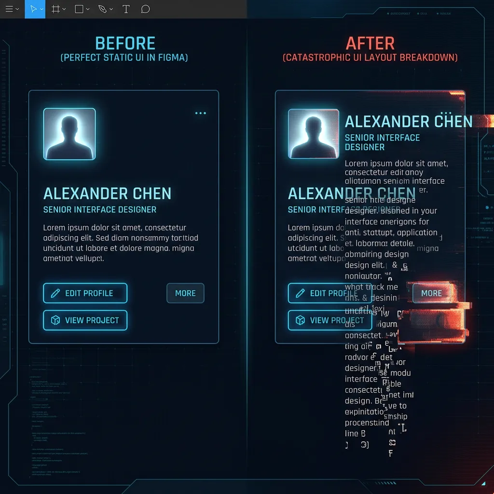
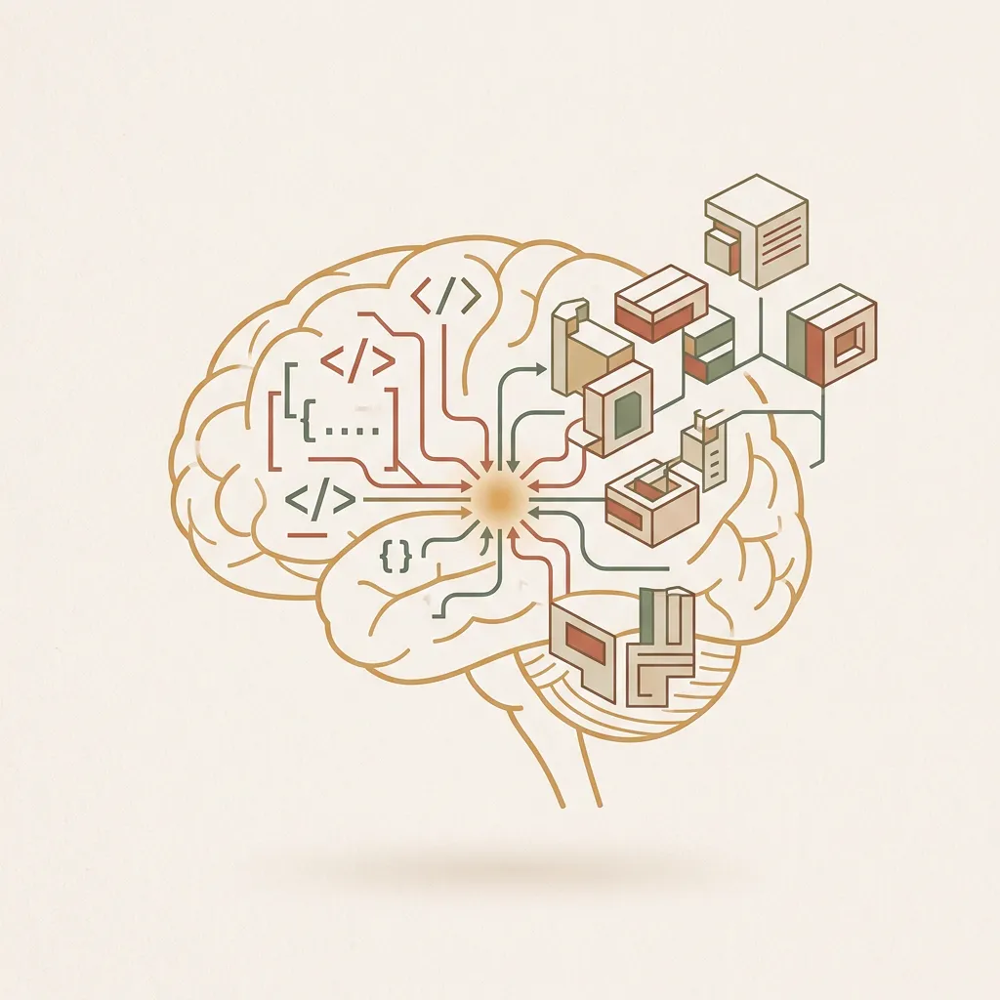

# W06 容器工程化基础映射: 让设计懂代码的语言

### 破冰导言：设计师的“心碎瞬间”

> [VISUAL]
> **Slide**: M0-01
> **Layout**: `Center`
> **Text**: 设计师的心碎瞬间
> **Scene**: 呈现一个强烈的“灾难”对比：左侧是 Figma 里静态完美的“用户卡片（User Card）”设计；右侧是真实数据灌入后，变长的用户简介文字像泥石流一样向下冲垮、死死压在“More”按钮上的“车祸现场”。通过强烈的视觉反差打破安全感，直击痛点。
> *   **Source**: AI_Gen
> *   **Asset**: 

> [WARNING]
> 想象一个场景：在 Figma 中将卡片元素精确对齐到像素级后，一旦遇到文案增加或屏幕变窄导致文字折行，文字就会直接压在底部按钮上。外框不会自动长高，按钮也不会被推开。这并非设计失误，而是设计软件默认的“绝对坐标定位（画布思维）”，无法应对网页内容动态生长的“弹性逻辑（容器思维）”。本节课我们将彻底填平这道认知鸿沟。

### 本节目标：从画布到容器的思维跨越

> [VISUAL]
> **Slide**: M0-02
> **Layout**: `Agenda`
> **Text**: 本节目标
> **List**: 思维转换 / 底层同频 / 物料规范
> **Scene**: 清晰列出三大核心目标，配合简单的图标（大脑代表思维，代码符号代表同频，组件模块代表物料）。
> *   **Keywords**: brain logic, code brackets, UI building blocks
> *   **Asset**: 

- **思维转换**：从“画布思维”彻底转换为“容器思维”。
- **底层同频**：理解 DOM 盒模型结构（**即把网页视作层层嵌套的矩形盒子**），掌握 Figma Auto Layout 与 CSS Flexbox（**让元素像排队一样自动拉伸、挤压和对齐的弹性布局规则**）的底层映射关系。
- **物料规范**：建立严格的组件化与 Design Token 意识（**将颜色、间距等视觉属性提取为设计与代码通用的“变量字典”**），为后续 AI 辅助编码实验提供标准化的前端物料设计体系。

> [ACTIVITY]
> *   **Type**: `Quiz`
> *   **Duration**: `3min`
> *   **Desc**: 破冰测验：面对动态内容的考验
> *   **Q**: 当设计一张用户卡片时，由于用户的个人简介长度未知（可能 1 行也可能 5 行）。在真正的网页开发思维中，我们应该如何处理卡片高度与内部元素的关系？
> *   **Options**: 
>     *   A. 在 Figma 中预判最长可能的文本，直接写死一个 800px 的卡片绝对高度。
>     *   B. 把下方按钮的 Y 轴坐标固定在距离顶部 500px 的位置，留足空间。
>     *   C. 赋予文本框“向下生长的本能”，同时让外层卡片高度被内部文本“撑开”。
>     *   D. 当文本过长时，让文字自动缩小字号以适应固定的卡片高度。
> *   **Answer**: C
> *   **Explain**: 这正是“容器思维”的核心。选项 C 对应 Figma 的 Auto Layout 机制：将文本宽设为 Fill、高设为 Hug，同时外框设为 Hug。这样无论文本多长，都会自动推开下方的按钮并撑大外框。而选项 A 和 B 是典型的“画布绝对定位思维”，一旦内容动态变化，必然导致大片空白或元素重叠。

---
