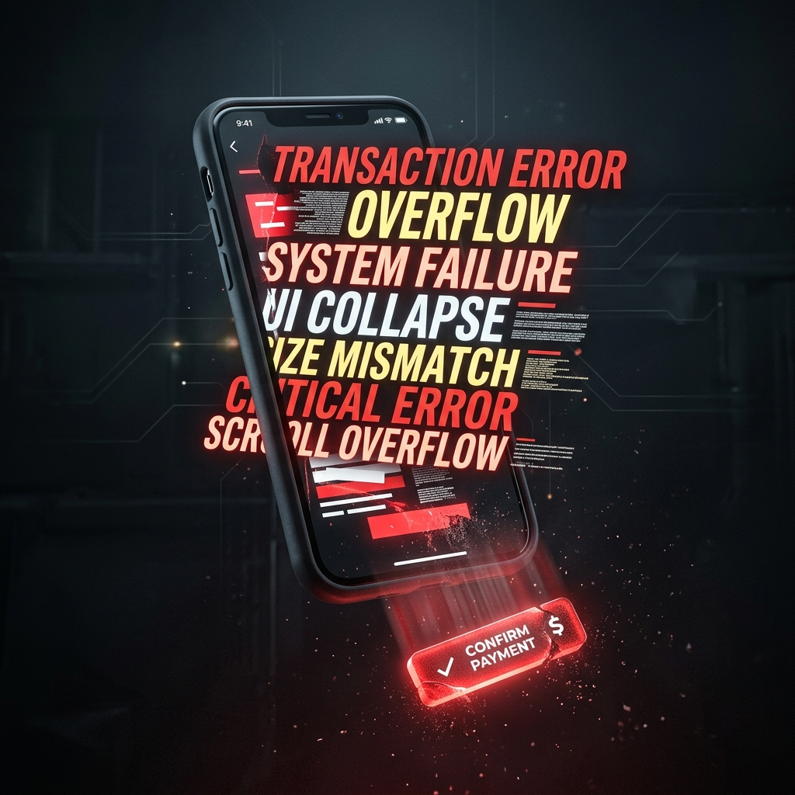
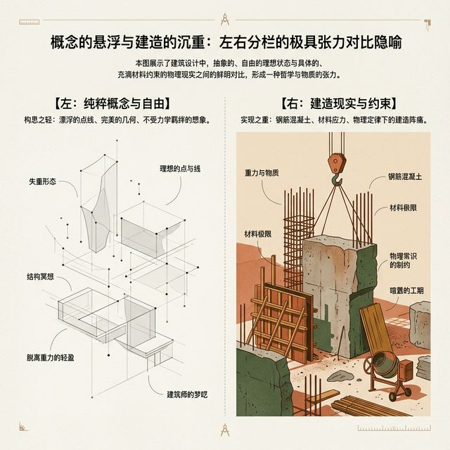

## 模块 1: 复习 — 从状态流转到物理界面 (约 10 分钟)
<!-- BUDGET: 1800 chars | SLIDES: ≥4 | STATUS: done -->
<!-- [STAGE NOTE: 复习] -->
<!-- 知识目标 1 回链：回顾从状态机架构到工程化落地的创作流程衔接 -->
<!-- 知识目标 2 回链：W05 状态流转中的心智模型匹配（三层模型理论）在本周转化为工程实施模型 -->

### 1.1 现状断言：抽象的逻辑蓝图无法被用户直接操作

> [VISUAL]
> **Slide**: M1-01
> **Layout**: `Center`
> **Text**: 完美的蓝图
> **Scene**: 左侧是上周复杂的状态机连线图，右侧是一张完美的 Figma 设计稿，鼠标正在精确拖动一个按钮对齐网格坐标 (X: 120, Y: 300)
> **知识节点**: `about-face-mental-models` 
> **Asset**: 
> **Source**: `Manual`
> **Keywords**: Figma perfectly aligned design

> [LIFE CONNECT]
上周我们用状态机搭建了逻辑蓝图。带着这份安全感，你们可能习惯性地在 Figma 中用固定的 X/Y 坐标画出一张“完美”的商品卡片。
但不可控的真实物理设备，会瞬间击碎这种基于“死坐标”的平面设计美梦。

> [CASE STUDY]

> [VISUAL]
> **Slide**: M1-01b
> **Layout**: `Center`
> **Text**: 脆弱的现实：物理变量击碎绝对坐标
> **List**: 固定坐标/物理变量/排版灾难
> **Scene**: 右侧是真实手机上的排版灾难现场：开启“大字号模式”后，暴胀的文字将底部的“确认支付”按钮硬生生顶出了手机的物理下边界。按钮直接“掉出”了屏幕之外，彻底消失无踪，导致支付流程完全瘫痪，呈现出极具冲击力的崩溃画面。
> *   **Asset**: 
> *   **Asset (AI fallback)**: 
> **Source**: AI Generated

设想一下，你在 Figma 中使用固定的 X 和 Y 坐标，将结算页的“确认支付”按钮完美固定在画板底端。
但当程序上线后，遇到一位开启了手机“大字号模式”的长辈用户时，被撑大的文字会直接冲出原本设计好的区域，彻底覆盖底部死守坐标的支付按钮，导致核心功能瘫痪。
这证明了一个残酷的事实：状态机保证了我们的“点击逻辑”不会出错，但它无法保证这个界面在充满未知变量的真实物理屏幕上能被正确地“排版”和“显示”。当我们跨越从逻辑蓝图到物理屏幕的鸿沟时，依赖平面软件里“死坐标”的绘图方式就会引发排版灾难。

### 1.2 破坏性测试预告：感受死坐标的脆弱

> [VISUAL]
> **Slide**: M1-02
> **Layout**: `Center`
> **Text**: 破坏性测试预告
> **Scene**: 预告即将到来的实践环节，展示纯绝对定位的脆弱代码块与超长文本碰撞的预警概念图。
> **Asset**: 
> **Source**: `AI_Gen`

> [TEACHING MOMENT]
在引入本周真正的解决方案之前，我们要先做一场“破坏性测试”。
接下来的 `User Card` 实践中，要求大家**绝对禁止开启 Figma 的 Auto Layout**。凭借直觉，用死坐标拼装卡片，并把带有 `position: absolute` 的坐标原样搬进代码编辑器。
随后，我们将注入超长文本，大家将亲眼见证绝对坐标下的重叠灾难。只有亲身体验过这种崩溃，你才会渴望寻找一种能够自适应物理变量的排版法则。

在正式开启这场破坏测试之前，让我们先通过一道情境测验，检验一下你对逻辑模型与物理渲染层分离的理解。

> [ACTIVITY]
> *   **Type**: `Quiz`
> *   **Duration**: `2min`
> *   **Desc**: 课堂测验：逻辑蓝图与物理界面的断层
> *   **Q**: 张伟在设计一款应用时，画出了完美无缺的结算流程状态机（State Machine），确认每一个状态流转都没有遗漏。但在真实长辈用户的手机上（开启了大字号模式），“确认支付”按钮却被放大的文字覆盖导致无法点击。这说明了什么？
> *   **Options**: A. 状态机遗漏了“大字号模式”这一特殊的状态异常分支，应该在逻辑图上增加节点 | B. 状态机仅能保证逻辑流程的严密，无法解决物理视图层的自适应排版问题 | C. 只要 Figma 的视觉稿画得足够精细，就不需要依赖状态机 | D. 前端开发人员在实现状态机时写错了核心算法
> *   **Answer**: `B`
> *   **Explain**: 选项 B 正确。状态机（W05内容）关注的是操作逻辑（如果A发生则流转到B），而大字号导致的文字溢出和按钮覆盖，是物理视图层的渲染表现问题。逻辑的完美无法自动转化为物理排版的完美，固守固定坐标必然导致渲染崩溃。选项 A 错误，状态机不处理字号放大这种纯 UI 表现问题；选项 C 错误，二者分属不同维度；选项 D 错误，这并非算法问题。
