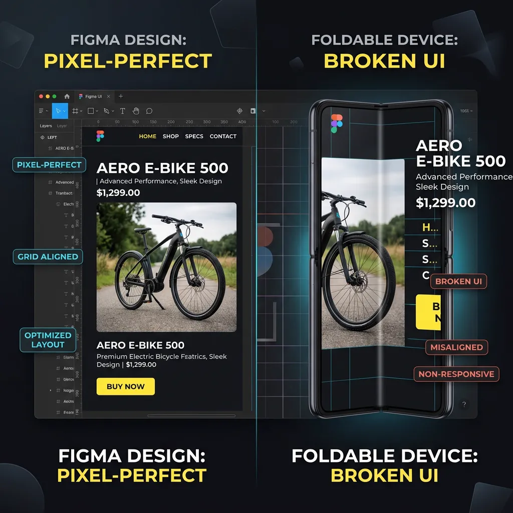
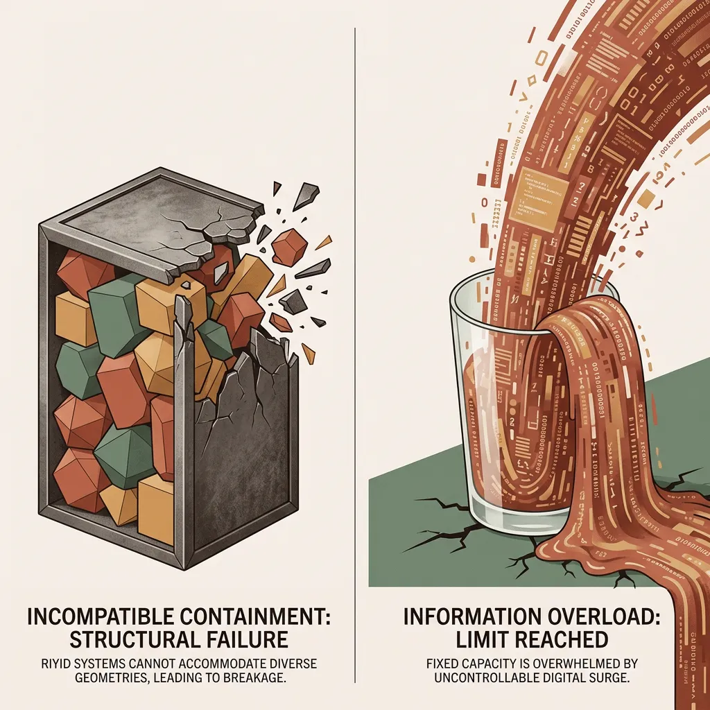
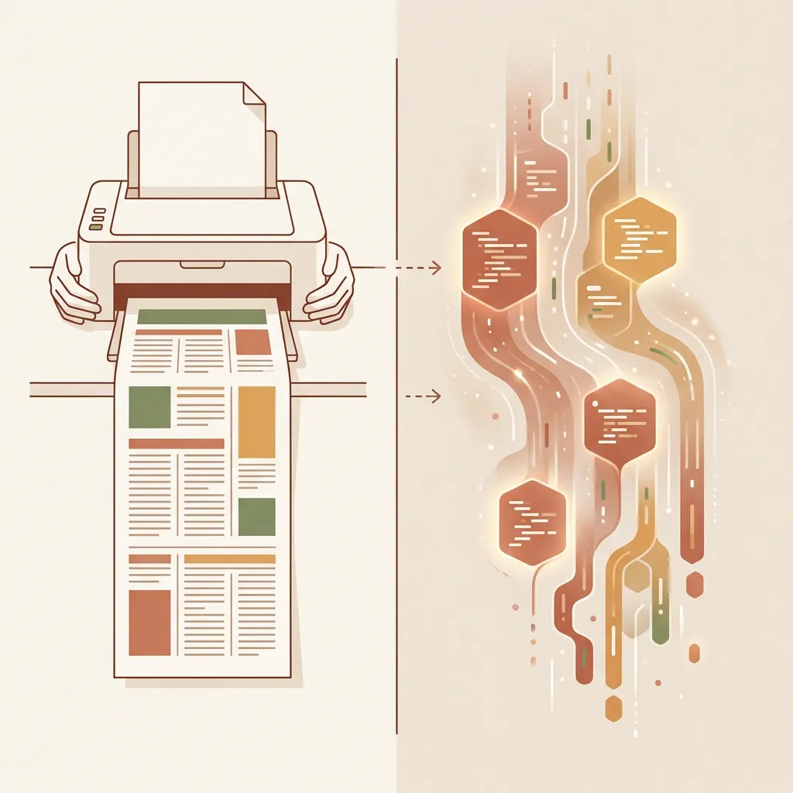
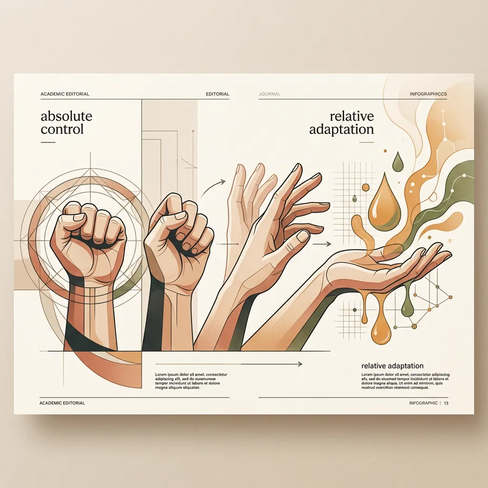
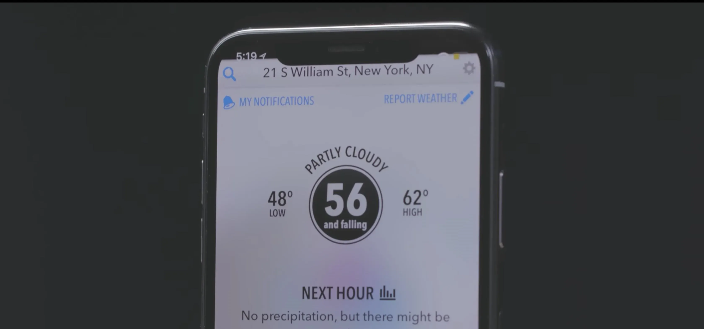
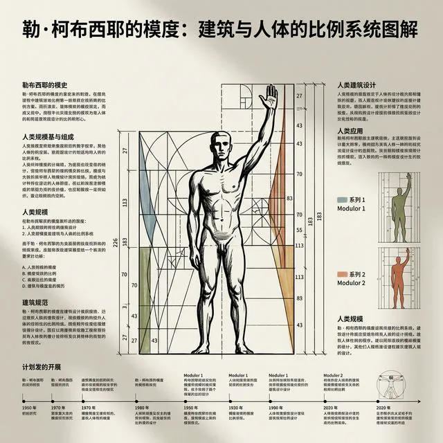
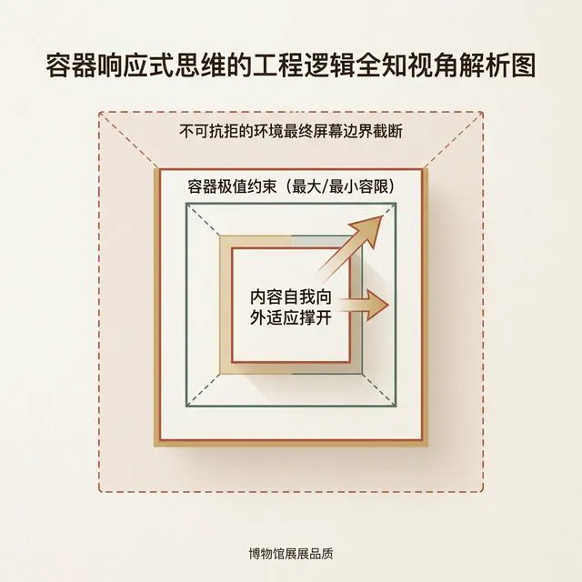
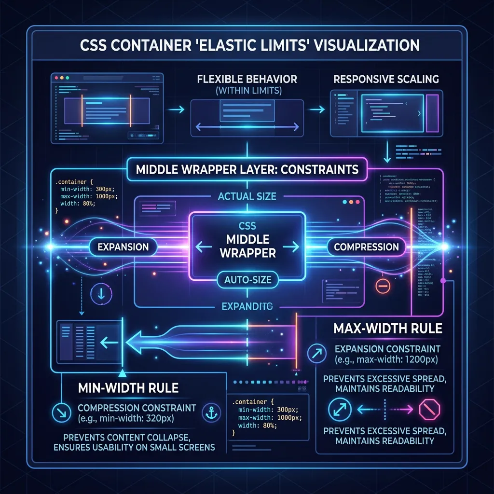
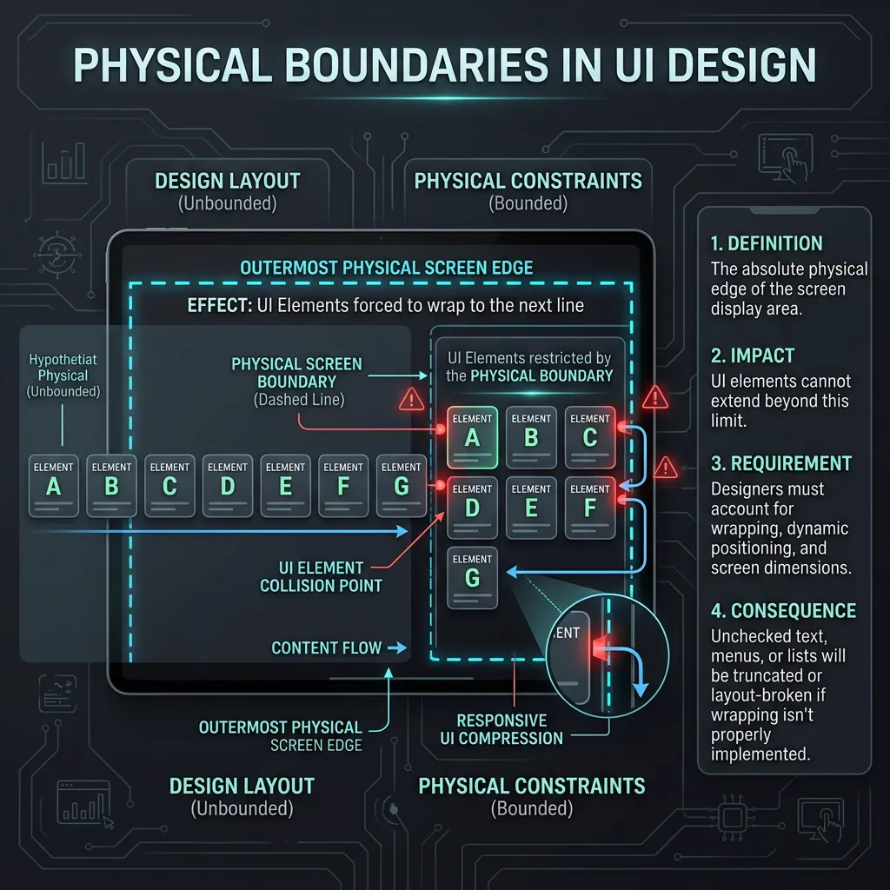

## 模块 2: 导入 — 画布思维的崩塌与响应式觉醒 (约 10 分钟)
<!-- BUDGET: 1800 chars | SLIDES: ≥4 | STATUS: done -->

### 2.1 恶果显现：静态画布在多屏时代的崩塌

> [VISUAL]
> **Slide**: M2-01
> **Layout**: `Comparison`
> **Text**: 恶果显现：静态画布在真实设备的崩塌
> **List**: 静态对齐 / 排版错位
> **Scene**: 对比图。左侧是一个在 Figma 中对齐到像素级的电商落地页。右侧是同一个设计在极窄的折叠屏手机上被打开，排版错位——头图只露出一半，文字飞出屏幕边缘，底部的“立即购买”按钮被挤压变形。
> **Source**: AI_Gen
> **Asset**: 

> [LIFE CONNECT]
> 在认识底层框架前，我想问大家一个问题：作为设计师，你是否遇到过设计落地后排版错位的情况？

在设计阶段，你在 Figma 里追求完美的 **Figma 像素级对齐 (Pixel-perfect Alignment)**。但当设计最终在用户的真实设备上打开时，往往会出现 **排版错位 (Layout Dislocation)**。

> [VISUAL]
> **Slide**: M2-01b
> **Layout**: `Split`
> **Text**: 恶果追因：铁盒与洪流的冲突
> **List**: 铁盒：物理设备碎片化 (Device Fragmentation) / 洪流：动态内容溢出 (Dynamic Content Overflow) 
> **Scene**: 一分为二的灾难隐喻图：左侧是一个试图装下各种奇形怪状几何体的固定钢铁盒子，盒子边缘因不兼容（代表碎片化的屏幕尺寸）而被生生撕裂；右侧是一个尺寸被焊死的玻璃杯，里面正被注入汹涌的数字洪流（代表超长文本与大字模式），信息流疯狂溢出并冲垮了表面。
> **Keywords**: rigid iron box, shattered edge, overflowing glass, digital flood
> **Source**: `AI_Gen`
> **Asset**: 

导致这种错位的原因主要有两个。首先是 **物理设备碎片化 (Device Fragmentation)**：用户可能用极窄的折叠屏、超宽的带鱼屏或旧手机打开页面，如果把坐标写死，元素就会飞出屏幕边缘。

其次是 **动态内容溢出 (Dynamic Content Overflow)**：正如上一节我们在破坏性预告中看到的，当长辈们开启手机的“大字号模式”时，被撑大的文字彻底覆盖了底部死守坐标的支付按钮，导致功能瘫痪。

> [VISUAL]
> **Slide**: M2-01c
> **Layout**: `Image`
> **Source**: `AI_Gen`
> **Text**: 画布思维的死局
> **Scene**: 隐喻图——画面中，有人试图用生硬的直角坐标系标尺 (X/Y) 死死钉住一滩正在流动的水，以此展示一种对抗物理法则的失控感与无力感。
> *   **Asset**: 

这种试图用图钉把界面元素死死钉在屏幕特定位置的排版灾难，其根源正是平面设计中根深蒂固的思维定势——**画布思维 (Canvas Mindset)**。我们在潜意识里把用户的屏幕当成了一张固定尺寸的死板画纸，试图用静态的 X 和 Y 坐标去死死钉住每一个像素点。一旦用户的屏幕尺寸变了或者字体放大了，原本的布局空间被挤压，死坐标之间的元素就会像车祸一样连环追尾、互相叠压。

为什么我们在平面软件里画得越死，在现实物理设备中就塌得越狠？因为这涉及到一种核心的媒介本质差异。

> [VISUAL]
> **Slide**: M2-02
> **Layout**: `Center`
> **Text**: 流动的光与电
> **Scene**: 对比概念图。左侧是一张被打印机吐出的固定尺寸纸张；右侧是像水流一样自上而下自然发光排列的流动数字文本，充满动态与适应性。
> **Source**: AI_Gen
> **Asset**: 

回想一下 1990 年代万维网初期的网页，它们没有任何 CSS 装饰，就是纯粹的自适应文本流。那时候的网页其实是最纯粹的“响应式”——无论你拉伸多宽的浏览器，文字都会自动向下流淌折行。数字媒介的本质，从来都不是打印机里吐出来的死板纸张，它是流动的光与电。

但后来，随着大量习惯了“纸媒排版”的设计师涌入数字领域，我们把做海报时的“绝对控制欲”强加给了屏幕。我们试图用死板的绝对坐标去禁锢流动的光电，这就导致了当物理设备碎片化时，排版必然走向崩溃。

> [VISUAL]
> **Slide**: M2-02a
> **Layout**: `Center`
> **Text**: 控制权的让渡：并非妥协，而是升维
> **Scene**: 隐喻图——一双紧紧握拳的手（象征绝对控制）逐渐松开，变成托举流动数字水滴的手势（象征相对适应权）。
> **Source**: AI_Gen
> **Asset**: 

> [PHILOSOPHY]
> 在这里，我们需要引入一个推进认知的关键概念——**控制权的让渡 (Relinquishing Control)**。
> **请注意，这绝不是向用户“妥协”或意味着设计师“失控”，而是一种设计维度的升级。**
> 我们不再去死死控制每一个像素的 X/Y 坐标，而是去制定一套“弹性规则”（比如：当屏幕变窄时，间距如何缩放？元素如何折叠？）。我们是在**主动把最终画面的渲染权，让渡给用户的物理设备与动态数据去计算**。

在传统的平面设计中，设计师拥有对画布的 **绝对控制权 (Absolute Control)**，文字的边界是恒定的；但在数字产品设计中，你必须追求 **相对适应权 (Relative Adaptation)**。因为真实的数据天然是流动的，如果坚持用绝对坐标排版，一旦遭遇超长文本注入或系统大字号覆盖，就会导致排版崩塌。

> [VISUAL]
> **Slide**: M2-02b
> **Layout**: `Image`
> **Source**: Web Source
> **Text**: 刘海屏危机：被硬件击碎的绝对坐标
> **Scene**: 2017 年 iPhone X 刚发布时的典型未适配 App 截图：顶部导航栏的“返回”和“菜单”按钮被物理刘海直接遮挡了一半，右上角的UI元素与系统时间重叠，呈现出死守绝对坐标导致的典型布局灾难。
> *   **Asset**: 
> *   **Asset (AI fallback)**: 

> [CASE STUDY]
> 2017年苹果发布 iPhone X 时，全球移动端爆发了一场史无前例的排版灾难：因为屏幕顶部首次出现了物理“刘海”（Notch）和圆角。大量采用“死坐标”开发、将顶部导航栏硬编码在 `y=0` 的 App，其核心按钮直接被物理刘海无情切断和遮挡，导致应用核心交互瞬间瘫痪。
> 这个历史级的教训迫使业界推出了“安全区域”（Safe Area）规范。它告诉我们，在硬件形态无穷分裂的今天，控制权的让渡绝非妥协，而是保障界面在任何设备上存活的唯一法则。我们必须把“哪里可以画图”的决定权，交还给操作系统和硬件环境。

为了顺应流动性，工程界给出了**响应式设计 (Responsive Design)**的解药。它迫使页面放弃绝对坐标，转而根据外部物理设备的宽窄进行自适应的舒展与折叠。

但新的矛盾随之而来：流体是无形的，而设计师的天性又极度渴望把控排版秩序。我们如何才能做到“既允许内容流动，又保持结构不散架”？这就需要全新的思维模式。

### 2.2 范式转换：用弹性容器收纳流动内容

> [VISUAL]
> **Slide**: M2-03
> **Layout**: `Full`
> **Text**: 范式转换：用容器思维包裹不确定性
> **Scene**: 一分为二的隐喻对比图。左侧是现实世界中生硬、死板的钢铁海运集装箱，打着大大的红叉。右侧是极具科幻感的“数字液态集装箱”：它像是由高弹力的半透明硅胶制成，当里面装入文字时它自动紧贴，当外部屏幕缩小（用箭头挤压）时，它内部的文字会自动换行，而硅胶容器本身完好无损地适应了新形状。
> **Search**: `elastic transparent digital container adjusting to contents vs rigid shipping container`
> **Asset**: 
> **Source**: AI_Gen

> [TEACHING MOMENT]
> 为了用结构去收纳流动的内容，计算机科学家们引入了网页构建的核心范式——**容器思维 (Container Thinking)**。

在使用容器思维时，你不再设定绝对的坐标指令。相反，你是为其制定一套 **弹性约束规则 (Elastic Constraint Rules)**：当一段超长文本注入时，容器能够自动向下生长并推开底部元素；当遇到极窄屏幕时，它能自动换行收缩。你实际上是在设计具有自我调节能力的虚拟盒子（如 Flexbox 容器），用它们把动态的内容包裹起来。

> [VISUAL]
> **Slide**: M2-04
> **Layout**: `Flow`
> **Text**: 空间法则：DOM 盒模型的弹性约束
> **Scene**: 弹性容器的逻辑全知视角解析图。三个不断向外扩张嵌套的方块：最核心的内层块向外突破产生箭头，标注为“内容撑开盒子”；中间包裹层标注为“盒子的极限（最大/最小伸缩规则）”；而最外层的庞大虚线框标注的是“屏幕的最终物理边界”。
> **List**: 内容撑开 / 弹性极限 / 物理边界
> **Search**: `responsive design container logic scalable boundaries adaptation breakpoints`
> **Asset**: 
> **Source**: `Manual`

> [TECH NOTE]
> 这套基于弹性和包裹的逻辑，构成了浏览器排版的最核心机制——也就是我们将要深度解构的 **DOM 盒模型 (Box Model)**（你可以把它想象成一个个由高弹力半透明硅胶做成、互相嵌套的数字收纳箱）。在这个模型中，容器与内容的交互遵循三个递进的空间法则：
> 
> 第一是**内容撑开 (Content-Driven)**（也就是“有多少货，就撑出多大箱子”）：数字容器没有绝对尺寸，它的初始高度由内部的文字和图片体积决定；

> [VISUAL]
> **Slide**: M2-04b
> **Layout**: `Flow`
> **Text**: 弹性极限法则
> **Scene**: M2-04 的第二步，高亮中间包裹层（最大/最小伸缩规则）。
> **Source**: `AI_Gen`
> **Asset**: 
> **List**: 最大宽度（Max-width）/ 最小宽度（Min-width）

> 第二是**弹性极限 (Elastic Limits)**（也就是“箱子最多能被拉伸或压缩到什么程度”）：设计师通过设定最大宽度（Max-width）和最小宽度（Min-width），划定容器形变的极限；

> [VISUAL]
> **Slide**: M2-04c
> **Layout**: `Flow`
> **Text**: 物理边界法则
> **Scene**: M2-04 的第三步，高亮最外层的物理屏幕边界虚线框，展示碰触后的强制换行效果。
> **Source**: `AI_Gen`
> **Asset**: 

> 第三是**物理边界 (Physical Boundaries)**（也就是“当硅胶箱撞到外层设备物理屏幕的边界铁壁时怎么办”）：当设备屏幕缩小碰触到弹性底线时，容器内的元素会被强制换行并重新排列。掌握这三层约束逻辑，你就能构建出适应不同设备的弹性排版。

在正式进入抽象的盒模型代码之前，我们先用一个真实场景来测试一下大家是否真正完成了从画布到容器的思维转换。

> [ACTIVITY]
> *   **Type**: `Quiz`
> *   **Duration**: `2min`
> *   **Desc**: 课堂测验：画布思维的崩坏场景
> *   **Q**: 爷爷在用生鲜 App 买菜时，开启了系统级的“长辈大字模式”。如果该 App 的商品卡片是新手使用“画布思维（Canvas Thinking）”通过绝对坐标钉死尺寸做出来的，爷爷最可能在屏幕上看到哪种界面崩坏现象？
> *   **Options**: A. 卡片像气球一样自动向上撑高，将下方的商品信息平滑地向下推开 | B. 放大的菜名文字直接冲出卡片边界，与下方的价格文本发生挤压重叠 | C. 界面文字大小根本没有任何改变，写死的代码强行屏蔽了系统指令 | D. 整个生鲜页面的所有元素按比例缩小，导致屏幕四周出现巨大黑边
> *   **Answer**: `B`
> *   **Explain**: 正确答案是 B。参见本节“2.1 恶果显现：动态内容溢出”部分的讲解，画布思维倾向于用绝对坐标“钉死”元素，当内部文本被系统强行放大时，外围卡片作为“死图纸”缺乏弹性，会导致文字溢出或重叠。错误选项分析：选项 A 恰恰是本节所讲“容器思维”的响应方式，而非画布思维；选项 C 错误，因为页面代码通常无法对抗系统底层的无障碍字号覆盖指令；选项 D 错误，画布思维下元素通常保持固定像素，不会主动产生整体的比例缩放。
