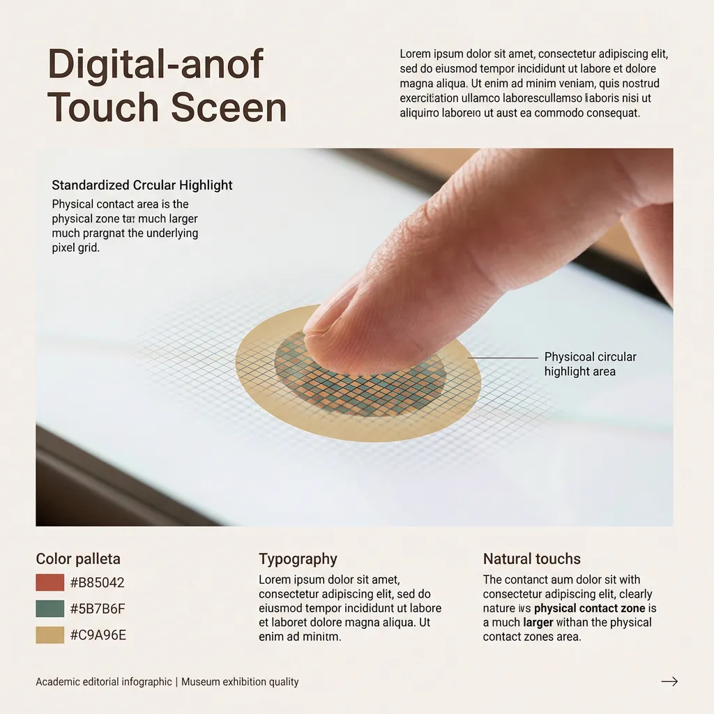
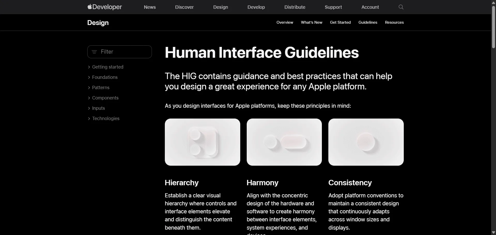
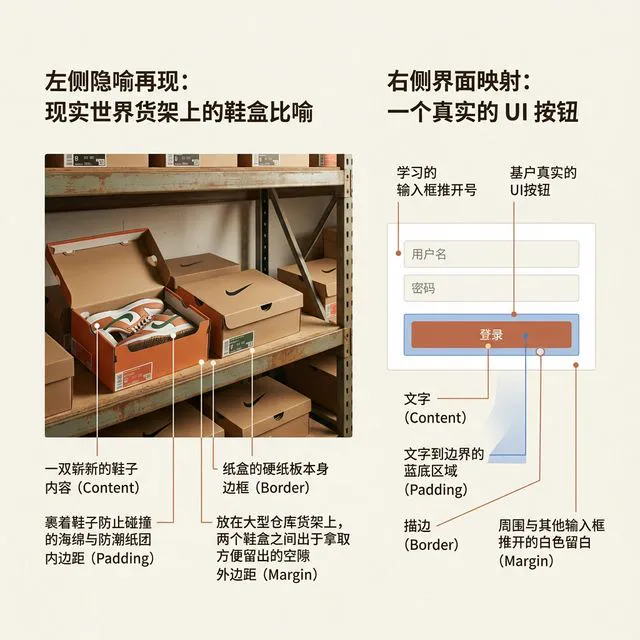
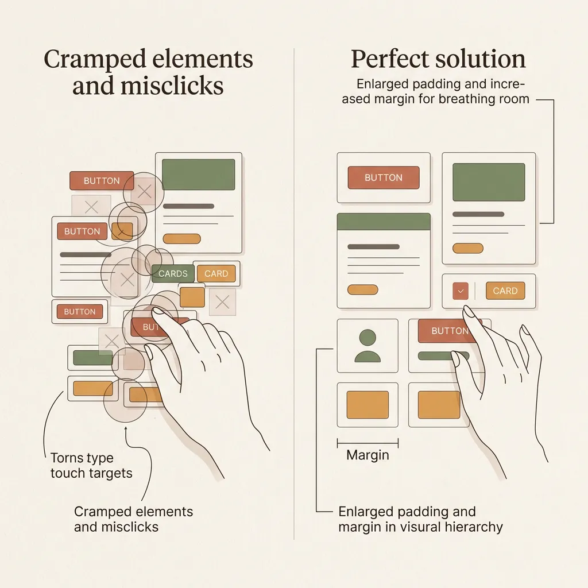
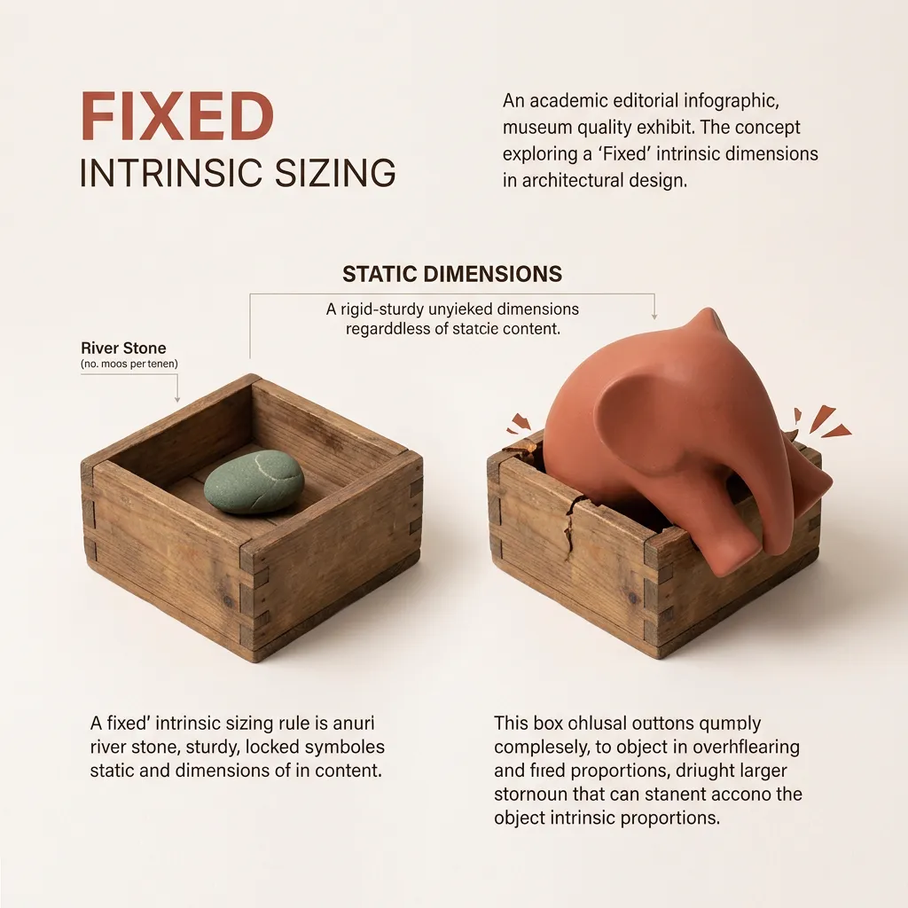
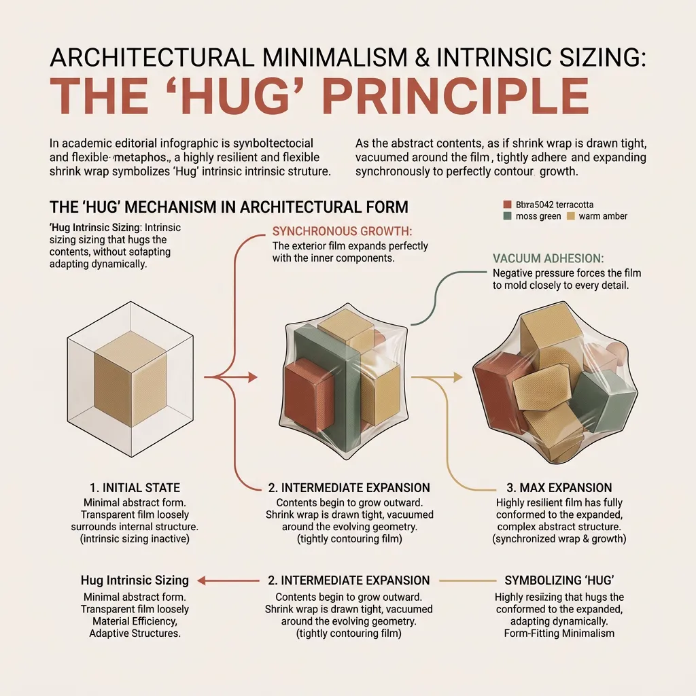
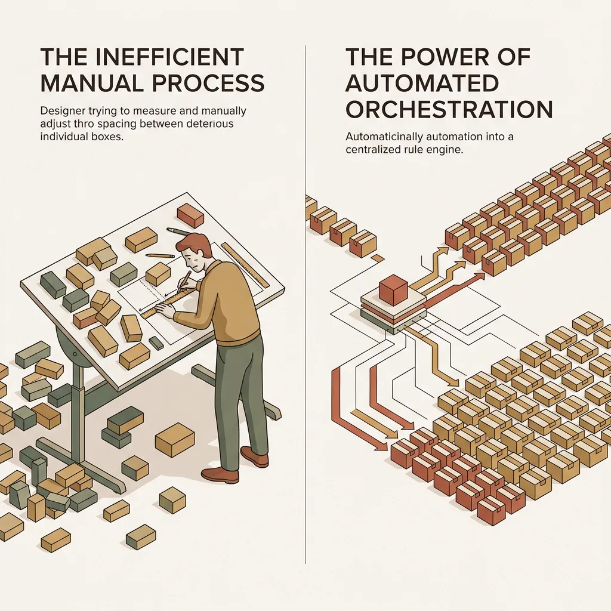

## 模块 3: 讲授(上) — 万物皆盒：CSS 盒模型与物理法则 (约 20 分钟)
<!-- BUDGET: 3600 chars | SLIDES: ≥7 | STATUS: done -->

> [!INFO]
> **核心理论库**
> - 引用节点: `dom-box-model-mental-map`
> - 理论溯源: W3C 盒模型规范与网页空间渲染的底层物理引擎抽象。

### 3.1 胖手指灾难与缺乏边界的卡片

> [LIFE CONNECT]
> **日常界面的暴怒时刻**

> [VISUAL]
> **Slide**: M3-01
> **Layout**: `Image`
> **Text**: 胖手指灾难
> **Scene**: 宏观特写镜头下的手指触控分析图。画面展示一根人类食指按压在发光的玻璃屏幕上，底层显现出代表像素的数字网格。在手指与玻璃接触的位置，有一个标准的工业圆形光圈（代表 7 毫米真实物理接触面积），以此说明物理触碰范围远大于底层的视觉像素按钮。
> **Search**: `iOS 44px minimum touch target size fat finger error button spacing`
> **Asset**: 
> **Source**: `AI_Gen`

作为数字产品的用户，你大概率经历过这类**误触灾难**：明明瞄准了“保存”按钮，点下瞬间却触发了紧贴旁边的“删除”。又或者在粗糙的应用中，看到毫无关联的信息卡片紧紧挤在一起，**缺乏基本的边界感**。

这种**视觉与操作的失控感**背后，实质上是**物理交互与数字界面**的底层机制冲突。

> [VISUAL]
> **Slide**: M3-01c
> **Layout**: `Image`
> **Text**: 44像素起源
> **Scene**: 2007 年初代 iPhone 发布会乔布斯展示触控的照片，或 Apple HIG 的 44px 官方规范图。
> **Search**: `Steve Jobs iPhone 2007 touch area Apple HIG 44px`
> **Asset**: 
> **Source**: Web Source

> [STORY]
> **44 像素的物理学真相**
> 2007 年初代 iPhone 为解决玻璃屏幕上的“胖手指”误触，通过测试发现：人类食指按压屏幕的**真实物理接触面积约为 7 毫米**，这在当年 163 PPI 的屏幕上被换算为 **44 像素 (44px)**。
> 这绝非僵化的像素教条，而是将人类生物学规律强制翻译为数字网格的法则。其灵魂本质在于——无论屏幕分辨率如何飙升，系统都必须用内部缓冲带，为充满误差的“胖手指”保留至少 7 毫米的物理安全区。

> [ACTIVITY]
> *   **Type**: `Quiz`
> *   **Duration**: `2min`
> *   **Desc**: 物理触控安全区的情境映射
> *   **Q**: 苹果公司发布了搭载超视网膜屏幕（460 PPI）的全新设备，其屏幕像素密度远超初代 iPhone。为了确保 App 的主操作按钮依然能抵御“胖手指”误触，UI 设计师在设定底层触控热区时，应该基于什么核心基准来计算最终的像素值？
> *   **Options**: A. 严格沿用初代设备确立的 44px 绝对数值以保持历史兼容 | B. 锚定人类食指 7 毫米的真实物理接触面积作为硬性转化底线 | C. 根据新屏幕超高的分辨率等比例缩减按钮的物理面积 | D. 放弃物理约束，直接根据视觉美感设定任意像素尺寸
> *   **Answer**: `B`
> *   **Explain**: 参考 3.1 节关于“44像素真相”的论述。触控设计的底层法则是将人类生物学规律（7 毫米物理接触面积）映射为数字网格，而非死守特定的数字教条。无论屏幕的分辨率（PPI）如何翻倍增长，人类手指的真实物理大小恒定。因此必须选 B，锚定 7 毫米的物理底线。选 A 会导致按钮在物理世界严重缩水；选 C 和 D 则彻底背离了容器安全区原则。

既然**物理安全区**与**元素边界感**如此重要，要如何用代码将其落地？这就要求我们将网页视为一系列拥有内外约束的**物理容器**。

为了亲身感受缺乏物理边界保护时，界面会发生怎样的“重叠与拥挤灾难”，我们现在就去 Figma 里做一次破坏性测试。

> [ACTIVITY]
> *   **Type**: `Practice`
> *   **Duration**: `15min`
> *   **Desc**: Stage 1 实践：体验缺乏物理边界的脆弱
> *   **Context**: 让学生在 Figma 中不使用 Auto Layout（无盒模型保护），随意散落拼接一张用户卡片，测试文字溢出或增减元素时引发的拥挤与错位灾难。
> *   **Link**: 请参阅 [实践：用户卡片 (User Card) 的双重构建](../practices_user_card.md) 中的 `Stage 1` 任务说明。

### 3.2 容器引擎的核心：DOM 树与 CSS 盒模型

刚才大家在构建 User Card 时体验到了重叠与错位问题——散落的头像和名字缺乏约束，稍有变动便会相互遮挡。面对这种布局失控，能够有效管理它们的底层规则究竟是什么？

> [TECH NOTE]
> **底层物理法则：DOM 与 CSS 盒模型**
> 浏览器引擎不理解虚无缥缈的“形状”和“位置”，它只理解严密的**逻辑结构**。任何元素想要在屏幕上显示，都必须服从一套刚性的组合拳：**DOM 树**与 **CSS 盒模型**。
> 
> 首先是 **DOM (Document Object Model, 文档对象模型)**。虽然名字听起来有些学术，但剥开这层外衣，它就是 **DOM 树（白话解释：网页的“家谱树”）**。在这棵树上，每一个文本、图片、按钮，都是一个独立的**节点 (Node)**，必须严密认祖归宗，明确谁是父辈（包裹者）、谁是子辈（被包裹者）。在这个世界里，没有孤立存在的图形，只有基于 **CSS 盒模型 (Box Model)** 层层包裹的**物理嵌套骨架**。

> [VISUAL]
> **Slide**: M3-02b
> **Layout**: `Split`
> **Text**: 鞋盒隐喻与真实映射
> **Scene**: 左侧隐喻再现：现实世界货架上的鞋盒比喻。一双崭新的鞋子放在耐克鞋盒里，周围裹着海绵。右侧界面映射：一个真实的 UI 按钮，对应标注出文字 (Content)、文字到边界的蓝底区域 (Padding)、描边 (Border)、周围与其他输入框推开的白色留白 (Margin)。
> **Search**: `css box model shoebox metaphor real world`
> **Asset**: 
> **Source**: `Manual`

建立起**容器思维 (Container Thinking)**，意味着你要把整个网页想象成一个标准的仓储货架系统。大盒装中盒、中盒装小盒的层层嵌套机制，在工程上称为 **Nesting (嵌套)**（白话解释：像俄罗斯套娃一样的层层物理包裹机制）。解决刚才 User Card 元素散落问题的方法，就是把头像和文字装进“信息盒子”，再把信息盒子和按钮一起装进“外层卡片盒子”。任何内容都必须置于标准“盒子”的约束下，这是 DOM 渲染的基础规则。

> [ACTIVITY]
> *   **Type**: `Quiz`
> *   **Duration**: `2min`
> *   **Desc**: DOM 嵌套规则的情境校验
> *   **Q**: 实习生小王在开发“用户评论卡片”时，为了贪图方便，直接将“头像图片”、“用户名文本”和“评论内容文本”并排散落在画布的最外层（Root），而没有将它们放进任何一个父级容器（Parent Box）中包裹起来。从 DOM 树与响应式布局的视角来看，这种“扁平散落”的做法最可能导致什么灾难？
> *   **Options**: A. 触发浏览器的安全拦截，拒绝渲染这些没有父级包裹的孤立节点 | B. 缺乏父级容器包裹，导致它们在屏幕尺寸变化时各自散落，无法作为一个整体卡片移动和排版 | C. 自动触发绝对坐标机制，将所有元素的尺寸强制缩小 | D. 使得子元素的文本内容自动溢出，背景颜色变为透明
> *   **Answer**: `B`
> *   **Explain**: 参见 3.2 节对 DOM 层级嵌套（Nesting）的解释。网页元素必须遵循“家谱树”的层层包裹原则。正确答案是 B，散落的元素缺乏共同的“父辈”（外层卡片盒子）进行物理包裹，在响应式流动中必然各自为战，彻底散架。选 A 是错误的，浏览器依然会渲染散落的节点，只是排版会极其混乱；选 C 和 D 纯属捏造，缺乏包裹并不会自动缩放尺寸或改变背景颜色。

那么，这个“盒子”究竟是如何构造的？让我们像解剖建筑蓝图一样，把它切开来看看。

> [VISUAL]
> **Slide**: M3-02
> **Layout**: `Flow`
> **Text**: 盒模型剖析
> **Scene**: 经典的 CSS 盒模型 3D 拆解透视图。从最内层向外依次漂浮：最蓝色的核心区域是 Content（内容区），向外一层包裹着绿色的缓冲带 Padding（内边距），紧接着是一道黄色的坚固围墙 Border（边框），而最外层则散发着橙色虚线的排斥力结界 Margin（外边距）。图示要求像建筑大楼的结构解剖图一样，展现极其严密的包裹感与层级关系。
> **List**: 内容区/内边距/边框/外边距
> **Source**: `AI_Gen`
> **Search**: `css box model layers content padding border margin 3d anatomy`
> **Asset**: 

> [TECH NOTE]
> **盒子解剖学：四层物理边界**
一个标准的 CSS 盒子，由内向外由四层清晰的物理边界组成：
**第一层：Content / 内容区**。这是盒子的灵魂，也是鞋盒里的那双“实体鞋子”。它占据核心位置，是你真正要展示的文字、图片或视频数据。
**第二层：Padding / 内边距（白话解释：盒子内部的防撞海绵）**。这是向内包裹核心的缓冲带，防止内容物撞击边界。它属于盒子内部的面积，虽然透明，但能被背景色填满。
**第三层：Border / 边框**。这是盒子的物理外墙，就像硬纸板本身。它可以有粗细和样式，是清晰界定内外领土的**刚性边界**。
**第四层：Margin / 外边距（白话解释：推开别人的社交安全距离/排斥力）**。这是盒子向外释放的排斥力场。它决定了这个鞋盒放在货架时，与其他鞋盒之间强制撑开的物理距离。这部分空间永远透明，别人无法侵犯。

> [VISUAL]
> **Slide**: M3-02c
> **Layout**: `Comparison`
> **Text**: 痛点解药具象化
> **List**: 内边距/外边距
> **Scene**: 直观对比演示“加大 Padding 防误触”和“增加 Margin 拉开社交距离”的前后效果。左侧展示极易误触的狭小按钮与拥挤卡片，右侧展示通过增加透明区（Padding）撑大触控面积以及通过加大间距（Margin）实现呼吸感的完美修复方案。
> **Search**: `padding margin UX improvement touch target spacing`
> **Asset**: 
> **Source**: `Manual`

> [TEACHING MOMENT]
> **用物理参数解决布局痛点**
> 掌握四层包裹机制，能帮助我们从工程维度系统性解决界面布局问题。
> 
> 针对开篇提到的“胖手指误触”问题，如果一个文字按钮太小，科学的做法并非强行放大文本字号（Content）以免破坏视觉层级。正确的做法是**增加 Padding (内边距)**，通过注入透明的内部物理缓冲带，在维持核心内容不变的前提下，精确扩大可响应的**触控热区尺寸**，有效降低误触率。
> 
> 同理，当多个信息卡片间距过密时，不应直接缩放卡片本体，而应增加它们之间的 **Margin (外边距)**，通过调整外层排斥距离，建立符合规范的视觉安全区。

> [ACTIVITY]
> *   **Type**: `Quiz`
> *   **Duration**: `2min`
> *   **Desc**: Padding 扩大物理触控区的情境决策
> *   **Q**: 某银行 App 的“忘记密码”纯文字按钮经常遭到老年用户投诉，表示手指极难点中。在不能改变整体排版结构，也不能无限放大文字字号的前提下，前端工程师应该通过调整盒模型的哪一层物理边界，来悄无声息地撑大这个按钮的真实触控响应区？
> *   **Options**: A. 扩大文字本身的 Content (内容区) 尺寸，强制拉大字号 | B. 增加按钮内部的 Padding (内边距)，注入透明的物理防撞海绵 | C. 加粗按钮外围的 Border (边框)，用线条勾勒出更大的范围 | D. 增大按钮外部的 Margin (外边距)，把它和其他元素推得更远
> *   **Answer**: `B`
> *   **Explain**: 参考 3.2 节“用物理参数解决布局痛点”的论述。要解决“胖手指”点按困难且不破坏视觉层级，科学方法是利用 B（Padding / 内边距）。因为 Padding 属于盒子内部面积，点击它同样会触发响应，相当于在文字外围注入了隐形的热区缓冲带。选 A 会破坏排版；选 C 改变了视觉样式；选 D（Margin）增加的是外部排斥距离，无法响应点击事件。

现在，让我们通过另一个真实的 UI 设计决策，来检验一下你的“盒子间距思维”是否已经成型。

> [ACTIVITY]
> *   **Type**: `Quiz`
> *   **Duration**: `2min`
> *   **Desc**: 盒模型内外边距的情境辨析
> *   **Q**: 假设你正在设计微信的聊天界面，目前两条不同用户的消息气泡贴得太紧，导致用户容易看错聊天顺序。为了拉开两个消息气泡之间的垂直距离，你应该调整哪个属性？
> *   **Options**: A. 增加气泡内部的 Padding (内边距) | B. 增加气泡之间的 Margin (外边距) | C. 加粗气泡边缘的 Border (边框) | D. 扩大气泡文字的 Content (内容区)
> *   **Answer**: `B`
> *   **Explain**: 参考 3.2 节关于“盒子解剖学”的四层物理边界论述。不同的消息气泡属于完全独立的容器盒子。要拉开独立容器之间的“社交安全距离”，必须使用 B (Margin，外边距) 来产生外部排斥力。若错误地选 A (增加 Padding)，只会让气泡内部的防撞海绵区被撑大，物理边界依然紧贴；选 C 只改变边框厚度；选 D（扩大内容区）则会让文字本身变大破坏排版。这三者均无法解决外部容器视觉拥挤的核心痛点。

### 3.3 尺寸本能法则：硬质木箱 vs 热缩膜

理解了盒模型的四层空间结构后，我们还需要向内探索一个关键问题：单体盒子的最终大小究竟由谁决定？这就是盒子的**尺寸本能 (Intrinsic Sizing)**（白话解释：盒子不靠外界强加尺寸，而是根据肚子里装了多少东西自行决定大小的物理本能）——在无外部强制设定的情况下，盒子基于内部内容自行决定大小的物理机制。

在没有任何外部排版系统强行干预的情况下，盒子自身只具备两种最基础的“物理材质响应机制”：

> [VISUAL]
> **Slide**: M3-03a
> **Layout**: `Image`
> **Text**: 尺寸本能：硬质木箱
> **Scene**: 尺寸本能机制隐喻。一只坚固的“硬质木箱（Fixed）”，无论里面装的是一块小石头还是一头大象，木箱的长宽被完全固定，多出的部分直接破框而出（Overflow）。
> **Search**: `intrinsic sizing fixed container rigid box overflow`
> **知识节点**: `dom-box-model-mental-map`
> **Asset**: 
> **Source**: `AI_Gen`

第一种机制，被称为 **Fixed (固定尺寸)**。
它就像一个被钉死的**硬质木箱**，无论内容多少，长宽参数都被强行锁定（如代码写死 `width: 200px`）。面对真实动态数据时，这种静态设定极易引发布局崩坏——若内容超载，木箱不会被撑大，而是触发 **Overflow (溢出)**（白话解释：内容物超载导致冲破外壳的“爆仓”现象），导致内部元素强行冲破物理边界并覆盖其他元素，破坏整个界面结构。

这正是刚才 User Card 实践中出现的溢出问题：输入超长文本时，文本冲破了固定宽高的束缚，与下方的职位信息重叠。这种静态尺寸设定在工业界也曾引发过严重故障。

> [VISUAL]
> **Slide**: M3-03_case
> **Layout**: `Image`
> **Text**: 国际化溢出问题
> **Scene**: 展示 2018 年某国际租车巨头 App 德文版的真实截图。底部的结算按钮被设置了固定宽度 (Fixed)，导致超长德文单词 "Mietwagenbuchung" 溢出按钮边界并与导航栏重叠，遮挡了点击区域，凸显尺寸硬编码带来的可用性问题。
> **Asset**: 
> **Source**: `AI_Gen`

> [CASE STUDY]
> 2018年，某国际租车巨头 App 在进军德国市场时发生严重布局故障：设计团队使用 Fixed 机制，将结算按钮宽度硬编码为适配英文 "Rent" 的大小。当切换到德语环境时，超长单词 "Mietwagenbuchung" 导致文字溢出按钮边界，与底部导航栏重叠，致使部分用户无法点击支付，当日转化率下跌 80%。这表明：在动态数据和多语言环境下，使用固定尺寸（Fixed）极易引发布局崩溃。

> [ACTIVITY]
> *   **Type**: `Quiz`
> *   **Duration**: `2min`
> *   **Desc**: Fixed 属性导致 Overflow 的情境分析
> *   **Q**: 某新闻客户端的开发团队为“今日头条”模块的新闻标题设置了固定的容器高度（Fixed，锁定为 40px）。当运营人员在后台发布了一条包含三行文字的超长突发新闻标题时，按照盒模型的尺寸本能物理法则，前端界面最可能会发生什么样的渲染灾难？
> *   **Options**: A. 标题容器像热缩膜一样自动被新闻文字垂直撑开，完美显示三行内容 | B. 容器高度死锁在 40px，多出的文字冲破容器底部边界，覆盖在下方的新闻列表上 | C. 浏览器智能识别到空间不足，自动将标题文字字号缩小到原本的三分之一 | D. 超出的文字会被系统自动裁剪隐藏，并加上省略号
> *   **Answer**: `B`
> *   **Explain**: 参见 3.3 节关于“尺寸本能：硬质木箱”的理论。Fixed（固定尺寸）的物理特性是长宽被强行锁定，像钉死的木箱一样不具备自适应能力。当内容物超载时，必然触发 Overflow（溢出）现象，即内容冲破边界覆盖其他元素，故选 B。选 A 是 Hug 机制的表现；选 C 浏览器不会自动缩放字号；选 D 除非手动设置特定截断代码，默认行为是直接溢出。

> [VISUAL]
> **Slide**: M3-03b
> **Layout**: `Image`
> **Text**: 尺寸本能：热缩膜
> **Scene**: 尺寸本能机制隐喻。极具韧性的“热缩膜（Hug）”，随着内部物品的膨胀，热缩膜像被吸干了空气一样，紧紧贴合着内容物同步撑大。
> **Search**: `intrinsic sizing hug container shrink wrap`
> **知识节点**: `dom-box-model-mental-map`
> **Asset**: 
> **Source**: `AI_Gen`

第二种机制，被称为 **Hug / 内容撑开（白话解释：随内容胀缩的热缩膜）**。
它的物理尺寸完全由内部的内容物 (Content) 决定，字少则收缩，字多则由内向外撑开。这在工程上即**内容优先 (Content-Driven)** 原则。在 Figma 中设置 "Hug contents"（或在 CSS 中使用 `width: fit-content`），能让盒子动态自适应不可预知的数据长度，保持布局极强的健壮性。

> [TEACHING MOMENT]
> **User Card 布局问题的终极解药**
> 现在，你们已经拿到了修复 User Card 的两把钥匙：第一，用 DOM 层级逻辑将散落的元素装进嵌套盒子（Nesting）；第二，将卡片外壳的尺寸属性从固定的 Fixed 切换为动态的 Hug。当遇到超长名字时，容器会被向外撑开，进而把下方的职位信息向下推移，化解重叠问题。这就叫“让布局自动流动”。

> [ACTIVITY]
> *   **Type**: `Practice`
> *   **Duration**: `10min`
> *   **Desc**: Stage 2 实践：用层级与 Hug 修复灾难
> *   **Context**: 回到 Figma 中的 User Card，将散乱的图层打包为 Auto Layout（DOM 层级映射），并运用 Hug contents 机制，测试长文本输入时卡片高度自动撑开的流动效果。
> *   **Link**: 请参阅 [实践：用户卡片 (User Card) 的双重构建](../practices_user_card.md) 中的 `Stage 2` 任务说明。

> [ACTIVITY]
> *   **Type**: `Quiz`
> *   **Duration**: `2min`
> *   **Desc**: 盒模型单体尺寸法则的情境校验
> *   **Q**: 假设你正在设计一个跨国电商平台的“加入购物车”按钮，未来该按钮需要支持 10 种不同语言的国际化翻译（如德语单词通常比英语长一倍）。为了保证翻译后蓝色背景框能够自动包裹所有文字并保持界面结构完整，你应该给这个按钮的外壳设置哪种尺寸本能属性？
> *   **Options**: A. Fixed (固定尺寸，锁定 150px 宽度以确保设计图视觉恒定) | B. Hug (包裹内容，由内部文字长度向外动态撑开外壳边界) | C. Padding (内边距，预先设置极宽的缓冲带以容纳超长文本) | D. Fill (充满容器，让按钮随外层屏幕宽度强制进行水平拉伸)
> *   **Answer**: `B`
> *   **Explain**: 详见 3.3 节关于“尺寸本能”的法则。在多语言等真实动态场景下，选 A (写死 Fixed) 相当于固化的硬质木箱，必然导致长文本强行冲破边界 (Overflow)；选 C 只是被动加厚缓冲带，无法随文字长度精确自适应；选 D 会破坏按钮的合理屏占比。唯有利用 B (Hug 机制) 遵循“内容优先”法则，像热缩膜一样紧密跟随内容动态撑开尺寸，才是健壮的现代容器解法。

### 3.4 终极校验：从单体盒子到弹性宏观布局

经过前述实践，我们确立了核心认知：**工业级 UI 设计的本质，是将视觉直觉转化为机器引擎可解析的精确物理参数**。通过合理设定 **Fixed/Hug 材质** 与 **Padding/Margin 边界**，我们已成功驯服了**单体盒子**。

> [ACTIVITY]
> *   **Type**: `Quiz`
> *   **Duration**: `2min`
> *   **Desc**: 阵列调度的必要性辨析
> *   **Q**: 当面临一个包含 50 个商品卡片的列表页，且客户要求增加卡片之间的垂直间距时，如果设计师不使用阵列级调度（如 Flexbox 的 Gap 或 Auto Layout），而是逐个去修改卡片下方的 Margin，这种操作的致命陷阱是什么？
> *   **Options**: A. 破坏了父子层级逻辑 | B. 触发了盒子挤压，导致内部相邻元素发生碰撞 | C. 陷入了低效的单体微调，无法应对未来数据的动态增减 | D. 违背了尺寸本能，强制覆写了包裹机制
> *   **Answer**: `C`
> *   **Explain**: 在庞大的盒子群落中，逐一修改单体元素的 Margin 极其低效。必须使用宏观的弹性布局系统（Flexbox / 容器级 Gap）来实施统一的阵列级调度，从而让系统具备自适应动态数据的能力。

> [VISUAL]
> **Slide**: M3-04
> **Layout**: `Image`
> **Text**: 阵列调度引擎
> **Scene**: 画面左侧是设计师绝望地逐个测量并手动调整几十个盒子间距的繁重体力劳动；右侧是成百上千个盒子受统一中央规则指挥，像流水般自动整齐排列的高效自动化场景。
> **Search**: `manual margin alignment vs fluid flexbox automation`
> **Source**: `AI_Gen`
> **Asset**: 
> **Source**: `AI_Gen`

驯服单体仅仅是开始，现代界面的真正挑战在于**阵列级调度**。面对真实业务中成百上千需统一调整间距的动态列表项，若继续依赖**手动设定 Margin** 的个体微调模式，不仅极度低效，更无法应对动态增减的数据。为了让庞大的**盒子群落**能受统一规则指挥并实现**自动流动重排**，我们将从单体物理学跃迁至宏观调度机制——直接跨入下一模块：**弹性布局系统 (Flexbox)**（白话解释：能让成百上千的盒子像流水一样自动排队、自动分配空间的智能指挥官）。
