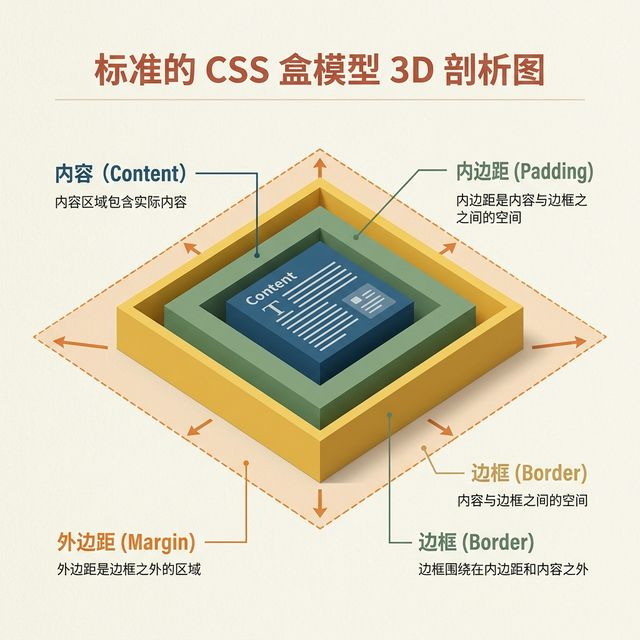
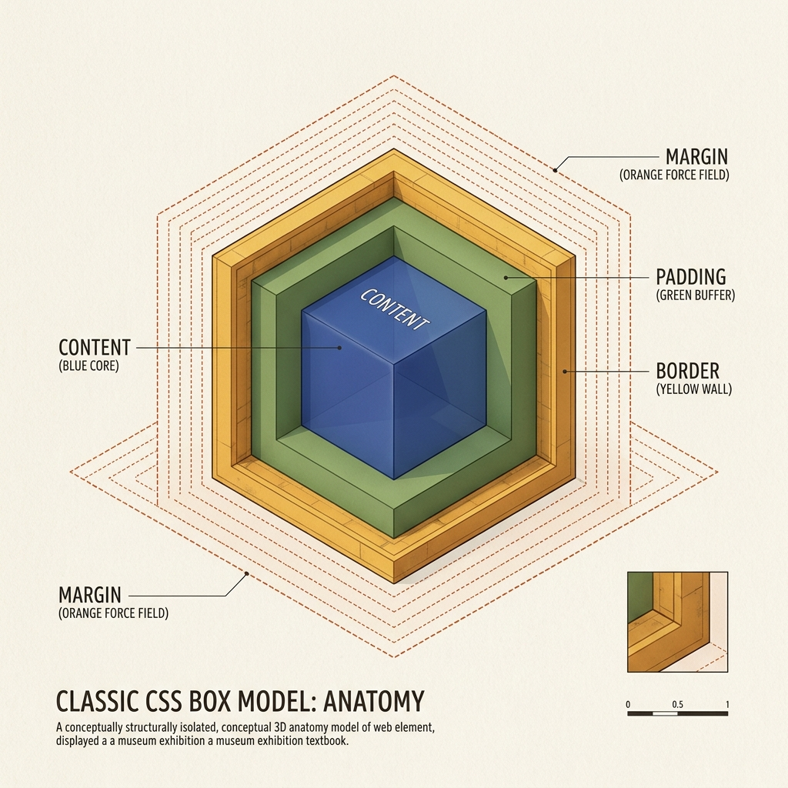
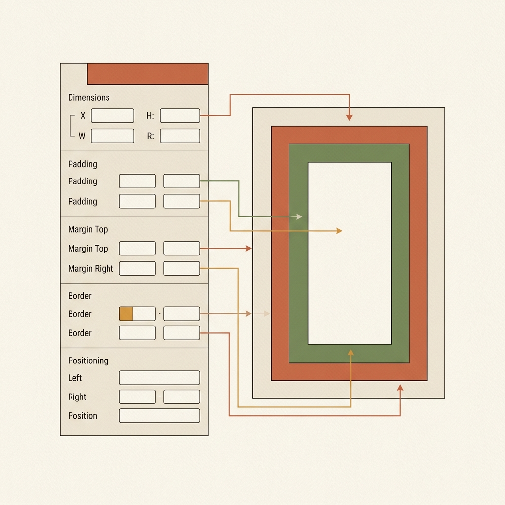
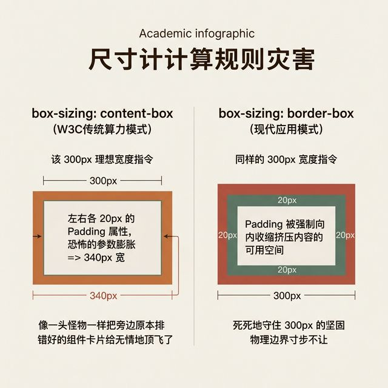

## 模块 3: 讲授(上) — 万物皆盒：DOM 盒模型与物理法则 (约 20 分钟)
<!-- BUDGET: 3600 chars | SLIDES: ≥7 | STATUS: done -->

> [!INFO]
> **核心理论库**
> - 引用节点: `dom-box-model-mental-map`
> - 理论溯源: W3C 盒模型规范与网页空间渲染的底层物理引擎抽象。

> [VISUAL]
> **Slide**: M3-01
> **Layout**: `Flow`
> **Scene**: 经典的 CSS 盒模型 3D 拆解透视图。从最内层向外依次漂浮：最蓝色的核心区域是 Content（内容区），向外一层包裹着绿色的缓冲带 Padding（内边距），紧接着是一道黄色的坚固围墙 Border（边框），而最外层则散发着橙色虚线的排斥力结界 Margin（外边距）。图示要求像建筑大楼的结构解剖图一样，展现极其严密的包裹感与层级关系。
> **Search**: `css box model layers content padding border margin 3d anatomy`
> **知识节点**: `dom-box-model-mental-map`
> *   **Asset**: 

前端的世界，和你们刚才看到的自由画板，有着本质的不同。
前端的屏幕上，并没有那些可以让你随意画的、孤立存在的圆形，也没有轻飘飘浮在半空的线段。

统治这个庞大数字世界的最底层物理法则，有且只有一个：**DOM 盒模型 (Box Model)**。

HTML 里的每一个元素元素，无论是大大的背景主视觉图、一段包含几千字的文章，还是哪怕仅仅是一行极其微小、微不足道的文字标题。在冷酷无情的浏览器引擎眼里，它们永远都只是一个方方正正的"矩形盒子"。请你千万不要被视觉表象所欺骗了，就算你把它在这层画布上画成了一个绝对正义的圆形按钮，它的物理占位边界依然是个长方形。

这个占据物理空间的盒子，就像洋葱一样，天生有着四层皮肤。
**第一层最核心的肉，叫做 Content（内容区）。**
你的文字排版、图片素材本身有多大的实体尺寸，它在中心就占据多大。我们在 CSS 代码里写下 `width: 100px` 的时候，在远古时代的浏览器规则计算里，指的仅仅是这块"肉"的精确宽度。

**第二层，叫做 Padding（内边距）。**
这是紧紧包裹着核心内容的向内缓冲带。如果内容是你的身体，Padding 就是你身上穿的那件厚厚的防撞服。

**第三层，叫做 Border（边框）。**
这是容器的显式物理边界，就像一堵你无法穿透的墙。你可以通过参数给墙加上各种颜色，也可以让它是完全透明的伪装色，但它永远都在那里。

**最外面的第四层，叫做 Margin（外边距）。**
这并不是实体的阻挡，而是一种排斥力场、一种无法跨越的结界。它决定了这个盒子和相邻的另一个盒子之间，必须保持多远的坚定的社交隔离距离。

> [VISUAL]
> **Slide**: M3-01b
> **Layout**: `Flow`
> **Scene**: Margin 坍塔陷阱图解。上下紧挨的两个盒子，上方盒子的底部 Margin 标记为 30px，下方盒子的顶部 Margin 标记为 20px。但实际渲染的间距并不是 50px，而是被坝塔吞没为 30px，用大红叉和警示符号标注。
> **Search**: `css margin collapsing diagram vertical overlap visual explanation`
> *   **Asset**: 

但是，这第四层结界里还藏着一个让无数前端工程师在深夜拔头发的经典程序感染现象——**Margin 坍塔（Margin Collapsing）**。
你设定上方盒子的底部结界为 30px，下方盒子的顶部结界为 20px。理想情况下你觉得它们之间应该是 30+20=50px 的庞大安全缓冲区吧？不！浏览器极其霜冷地告诉你：当两个垂直相邻的 Margin 面对面碰撞时，它们不会像不同味道的果汁一样叠加融合，而是会发生吂坍！只有较大的那个值会被留下，较小的那个直接被吞没，最终只留下 30px。
这种反直觉的抢占行为，曾经导致无数工程师和设计师对着屏幕上“明明标注了 50px 间距为什么只显示了 30px”的愫尬谜题纠结一整晚。在 Figma 里，Auto Layout 巧妙地用 `gap` 属性彻底规避了这个历史坑——它定义的是子元素之间显式且不会坍塔的间距，而不是两个盒子各自向外投射的排斥场。

> [VISUAL]
> **Slide**: M3-02
> **Layout**: `Split`
> **Scene**: 左侧隐喻再现：现实世界货架上的鞋盒比喻。一双崭新的鞋子放在耐克鞋盒里。鞋子是 Content，裹着鞋子防止碰撞的海绵与防潮纸团是 Padding，纸盒的硬纸板本身是 Border，而放在大型仓库货架上，两个鞋盒之间出于拿取方便留出的空隙是 Margin。右侧界面映射：一个真实的 UI 按钮，对应标注出文字 (Content)、文字到边界的蓝底区域 (Padding)、描边 (Border)、周围与其他输入框推开的白色留白 (Margin)。
> **Search**: `css box model shoebox metaphor real world`
> *   **Asset**: 

> [STORY TIME]
如果这些英文术语太过抽象，你们完全可以跳出冷冰冰的代码浏览器窗口，把整个由光和电组成的渲染引擎立刻想象成一个极其庞大、物流运转极度高效的现代化生鲜仓储货架系统。而每一个网页界面里的原生元素，不管它在表面的设计稿上被你们用色彩粉饰得多不像，在底层分拣机器人红外射线的眼里，它们永远都只是货架上的一个个方方正正的**鞋盒**。你绝不可能试图把一个没有外层方正包装的水球直接赤裸裸地扔到高速运转的平铺物流履带上，所有的零碎东西在进入这个严苛系统前，必须被强制塞进一个个标准化的长方体盒子里。这就是万物皆盒的绝对前提。

在鞋盒里面的那双鞋子，就是你的 Content（内容），它是有明确三维实体尺寸的。
为了在运输过程中保护鞋子不晃荡、不被边角撞散，你在鞋子周围严密塞进去的一圈一圈防撞海绵或者揉皱的防潮纸，就是 Padding（内边距）。
那个用硬纸板折叠而成的外包装外壳本身，就是 Border（边框）。
当你把这个包装好的鞋盒放到货架上时，为了方便之后拿取，你刻意和旁边另一个鞋盒之间留出了一段清晰的空隙，这就是外边距结界 Margin。

现在让我们把视线从鞋盒拉回数字 UI 界面。
看看你们在上节课表单设计里画的那个"确认提交"按钮。在这上面，文字"提交"就是里面那双鞋（核心内容）。在文字到按钮的物理边线之间，那些用来撑起蓝色背景并让按钮看起来有呼吸感和张力的内部空间，全部都是塞进去的海绵 Padding。
很多初级设计师在检查设计稿时都会反应："哎呀，这个按钮在手机端看起来太小了，经常会点不到报错"，而他们的第一直觉反应，就是赶紧去把字体级别放大。
错了。**增加触控面积最科学、最工程化的方法，绝对不是放大内容本身去抢占面积，而是加厚海绵——也就是增加内部的 Padding。这能在不破坏视觉层级的前提下，极大扩充可点击的热区范围。** Apple 的人机界面指南里明确规定了最小触控热区为 44x44pt，而 Google 的 Material Design 规范更加激进，建议为 48x48dp。这些底线尺寸中真正起作用的大部分空间，可不是文字本身，而是裹着文字的那层厚实的 Padding 缓冲护甲。
而按钮的最外侧物理边缘，到紧接着的下一个诸如"密码输入框"之间的强制隔离距离，就是绝对结界 Margin。

> [PHILOSOPHY]
> **跨学科视角：Margin 结界与霍尔的近距学 (Proxemics)**
> 我们为什么需要如此残忍地控制 Margin 这个"排斥结界"？如果跳出代码，从美国人类学家爱德华·霍尔 (Edward T. Hall) 提出的「近距学 (Proxemics)」来看，人类在物理世界中本能地划分了亲密、个人、社交与公共四种空间距离。如果一个陌生人在拥挤的地铁里完全无视你的"个人距离"强行贴向你，你会感到本能的极度不适甚至愤怒。数字界面的容器组件也是一样。
> 如果两个毫无功能血缘关系的卡片（比如"购物车去结算"的安全按钮和"猜你喜欢"的促销横幅）没有通过足够大倍数的 Margin 保持安全的"社交距离"，它们就会像不速之客一样互相粗暴地侵犯对方的私人领地。缺乏 Margin 结界保护的粘连界面，本质上是在视觉潜意识层面不断诱发用户的空间幽闭恐惧与压迫感。控制 Margin，就是在用社会心理学的法则，为这些冷冰冰的代码方块画出优雅的社交礼仪边界。

> [VISUAL]
> **Slide**: M3-02b
> **Layout**: `Comparison`
> **Scene**: Figma 与代码的一一对映表，左半侧显示 Figma 属性面板截图（标注 Frame 宽高、Padding、Item Spacing、Stroke），右半侧对应 CSS 代码块（width/height, padding, gap, border），中间用精确的箭头连接。
> **知识节点**: `dom-box-model-mental-map`
> *   **Asset**: 

我说到盒模型的四层结构，其实想告诉大家一件极其重要的事：你们每天在 Figma 里操作的那些属性，**和真实代码里的盒模型参数，是一条沟里的两头牛**。
你在 Figma 里给 Frame 设定的宽高，就是代码中的 `width` 和 `height`；你在 Auto Layout 面板上调整的四个方向的 Padding，直接对应的就是 CSS 的 `padding`；你在那个标注着 Item Spacing 的输入框里敲入的数字，对应的恰好是 Flex 布局里的 `gap`；而你为元素添加的描边 Stroke，就是盒模型的 `border`。
所以请大家牢记这一点：**你在 Figma 里走过的每一步属性设置，都干干净净地映射在前端代码的盒模型体系里，一个不多，一个不少。**你设定得越规范，工程师在代码里复现的成本越低；你设定得越随意，期间的翻译损耗就越巨大，最终呈现出来的差距也就越让人崩溃。

> [ACTIVITY]
> *   **Type**: `QA`
> *   **Duration**: `2min`
> *   **Desc**: 快速知识点回顾
> 教师提问互动，校验此前核心法则的理解情况。

> [VISUAL]
> **Slide**: M3-03
> **Layout**: `Comparison`
> **Scene**: 尺寸计算法则灾难展示图表。左边是 `box-sizing: content-box` (W3C传统算力模式)：设计师给盒子设定了 300px 的理想宽度指令，然后给其加上了左右各 20px 的 Padding 属性。结果整个盒子发生了恐怖的参数膨胀，变成了 340px 宽，像一头怪物一样把旁边原本排错好的组件卡片给无情地顶飞了。右边是 `box-sizing: border-box` (现代应用模式)：同样的 300px 宽度指令，Padding 被强制向内收缩挤压内容的可用空间，盒子整体视觉外观死死地守住 300px 的坚固物理边界寸步不让。
> **Search**: `box-sizing border-box vs content-box calculation css layout bug`
> *   **Asset**: 

这看似清晰的四层洋葱皮结构，不仅仅是为了我们在视觉上好区分做划分，它更是整个前端世界里最血腥、最残酷的尺寸计算公式与 Bug 的根源所在。

这曾经是整个早期 Web 前端工程界的一个无法避开的巨大天坑。
假设你现在是一个初级的设计师，你在你的草图中想在可视区域画一个正好 300 像素宽的精美用户卡片。画出来之后，你觉得里面的标题文字太贴边了，简直像被关在监狱里，于是你在控制台输入了指令，加上了左侧 20 像素，右侧 20 像素的内部缓冲边距 (Padding)。

在过去（也就是远古的 IE 时代的暗黑岁月，或者是严格 W3C 的早期粗糙规范中），当你天真地给元素设定 `width: 300px` 时，它默认只约束了最里面的那层极其狭窄的肉 (Content)。它不管外面的死活。
于是，浏览器极其死板且刻薄的计算公式开始运作了：**300px (核心肉体) + 20px (左侧海绵充填) + 20px (右侧海绵充填) = 340px 的总显示尺寸。**

最终在那个原本只有有限像素宽度的屏幕上被暴躁渲染出来的，是一个宽达 340 像素的膨胀怪物盒子！这种由于 Padding 无脑加法计算导致的意料之外的空间膨胀，曾经让无数号称"像素级还原"的精美设计稿，在浏览器里因为宽度爆表而四分五裂。

为了彻底解决这个反人类的空间加解算法，随后而来的 CSS3 正式规范化了一个极其霸道的指令——也就是今天拯救了所有人的 **`box-sizing: border-box`**。
这条指令的意思非常明确：当你果断写下宽度 300px 的时候，这是直接越过内容层，对第三层洋葱皮——边框(Border)这层物理防线下发的最高命令。不管里面被疯狂塞入多少用作缓冲的海绵，你的可视总体外壳必须死死守住 300 像素这条红线，绝对不准向外产生任何一纳米的膨胀！所有多出来的防守海绵，只能乖乖地往内去残忍挤压和压缩核心肉体的生存空间。

> [TEACHING MOMENT]
> 今天你们在 Figma 画板里每一次调引用的 Auto Layout（自动布局），其底层逻辑就是完美且苛刻地默认基于 `border-box` 的防膨胀算法去运行的。这就意味着一个质变：当你在 Figma 最右侧属性栏里拖拽或锁定出一个宽度固定（Fixed）的弹性 Frame 容器，然后再去试图增加或缩减它的内部 Padding 内边距数值拉扯间距时，它的整体宏观总宽带永远都不会擅自越轨变长——这种绝对安全的尺寸锁定操作，是设计软件向代码底层执行协议妥协而换来的伟大胜利。

> [VISUAL]
> **Slide**: M3-04
> **Layout**: `Screenshot`
> **Scene**: 被全行业奉为"设计界天花板"的著名海外支付工具 Stripe 的真理官网代码审查截图。通过右键 Inspect 调出了浏览器极其极客视角的 Chrome DevTools（开发者工具）。在右侧的 Computed（计算属性）面板中，那个举世著名的、用来解析 DOM 的彩色同心矩形（也就是我们的盒模型 X 光透视图）清晰可见。数字极其密集且精准地显示了其在多级容器下，有着极度疯狂克制和如同数学矩阵般绝对规律的 padding 与 margin 的双层数值控制体系。
> **Search**: `stripe website devtools inspect element css box model padding margin precision`
> *   **Asset**: 

我们今天在这里一直谈论工程化、规则化，它真正的目的，就是要求你们必须把以往基于灵感触发的设计直觉，全部强制且无缝地转化为可以被机器直接解析的浏览器底层网格参数。

你们可以在下课后，亲自去打开那个被全世界 SaaS 开发者与同行极力推崇、被称为"设计界绝对天花板"的 Stripe 支付平台的官方网。不要只看它的表面视觉，请点开鼠标右键，勇敢地选择"检查 (Inspect)"，直接带上头盔去窥视它庞大视觉体系下运转的代码底层发动机。
当你凝视浏览器的 DevTools 右下角，你会立刻看到我们要讲的那个彩色的层层叠套的同心矩形，那就是能照透一切设计外衣的真实照妖镜。

在这面全视照妖镜的严密扫描下，你会无比吃惊地发现：Stripe 那些在普通用户看起来无比轻盈梦幻、似乎顺理成章完全浑然天成的设计元素，其背后其实隐藏着一个在空间约束上达到了极端狂热程度的"盒子控制狂"团队。

它页面上的每一处看起来极其通透的呼吸感，全都是被严厉的数学公式计算好并强行注入的 Padding 参数；而所有的元素与元素的社交安全距离，全都是被极其残暴地控制且精确约束到必须是 8px 倍数值的 Margin。在它的整个前端视图帝国里，没有哪怕一个像素的游离。
这也是为什么 Stripe 的那套史诗级组件库，可以允许毫无天赋的新手实习工程师哪怕是闭着眼睛去胡乱调用拼接，最终呈现的界面也绝对不会崩塌离析的最核心原因。

> [CASE STUDY]
这种对底层盒模型进行偏执且极权式控制的做法，绝非 Stripe 一家公司独有的怪癖。翻开当今世界上任何一家统治级大厂的开源前端规范手册——无论是支撑起整个北美独立站电商半壁江山的 Shopify 的 Polaris 设计系统，还是支撑着国内无数复杂中后台业务流转和金融级数据呈现的阿里的 Ant Design——只要你稍微深入去向下翻阅阅读，你会发现它们的组件库文档里，往往都有一整页甚至好几页极度冗长、看上去枯燥乏味的矩阵制表。里面专门用来精细定义和强硬锁死每一颗最最普通的警示按钮、每一张带着阴影的商品图文信息卡片的内外部四层洋葱圈盒模型约束参数，甚至连一像素的多余视觉溢散都在规范里被直接明令禁止。
这绝对不是什么由强迫症重度患者所自嗨搞出来的狂欢节，这是当一个工业级别的商业产品在团队规模高速进化扩张到上百名、甚至跨越多个遥远时区进行散装分布协作的设计师与全栈工程师团队群体时，产品总监们用来对抗混乱，唯一能够彻底阻止由于个人审美偏差习惯所带来的全链路视觉雪崩崩溃、以及不可逆的熵增失控走向深渊的最后一条钢铁防线。

记住，**要把那些漂浮在空中的设计直觉，强硬且不可逆地转化为能够用游标卡尺去度量的盒子边界参数，才是对复杂产品与用户界面系统秩序的最深层、最具权力的掌控。**

当你们返回到 Figma 设计界面的时候，请先别急着画那些好看的渐变色块和花俘的装饰图标。请先对着你的屏幕大声回答我三个问题：第一，这个元素的内容边界在哪里？第二，它的缓冲距离应该是多少？第三，它和邻居之间的强制隔离约束又是多少？只有当你能清晰地回答这三个问题的时候，你才算是真正拥有了用工程思维去看待每一个屏幕元素的能力。

---
