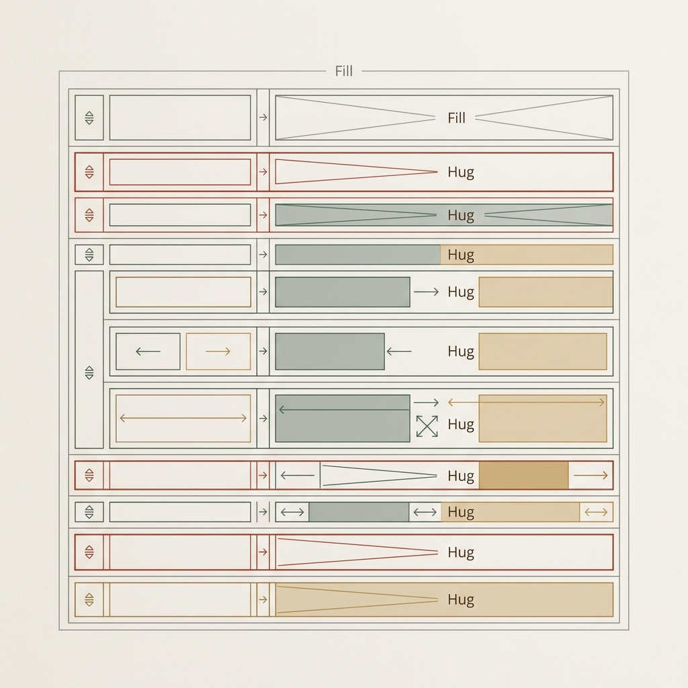
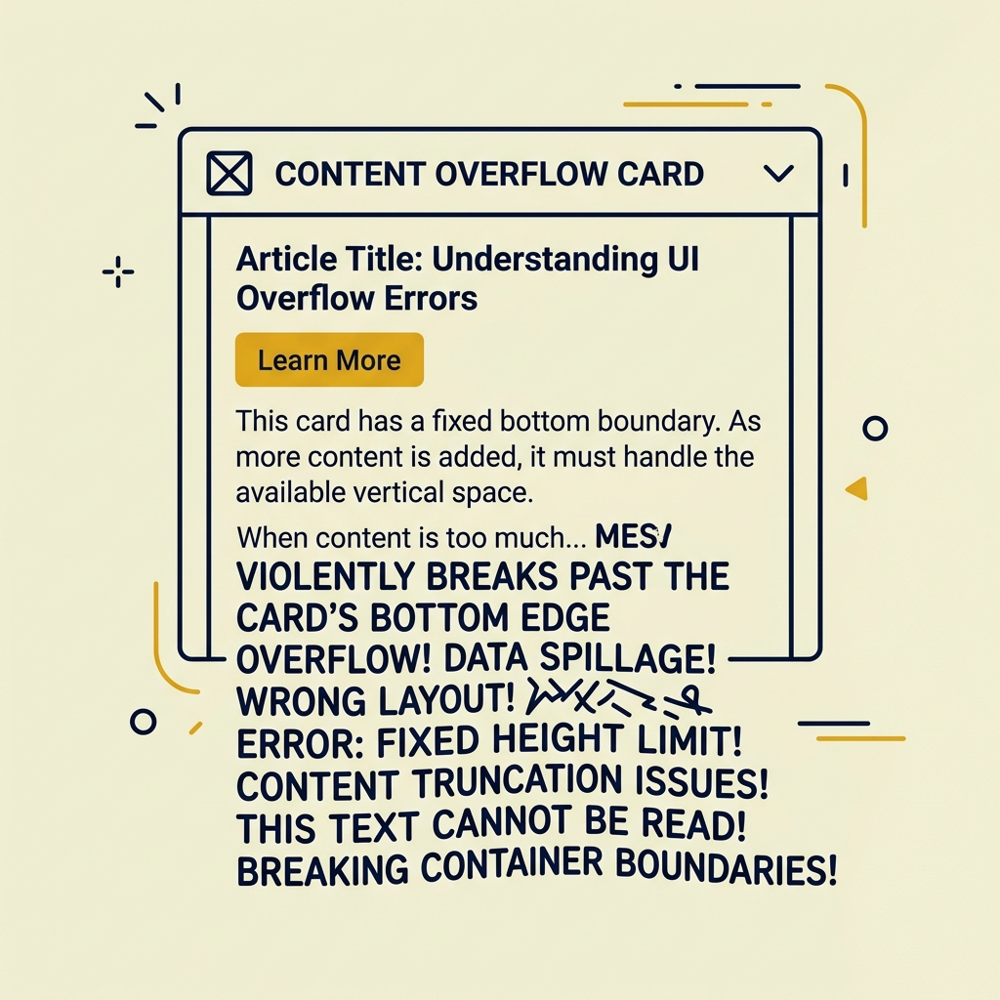
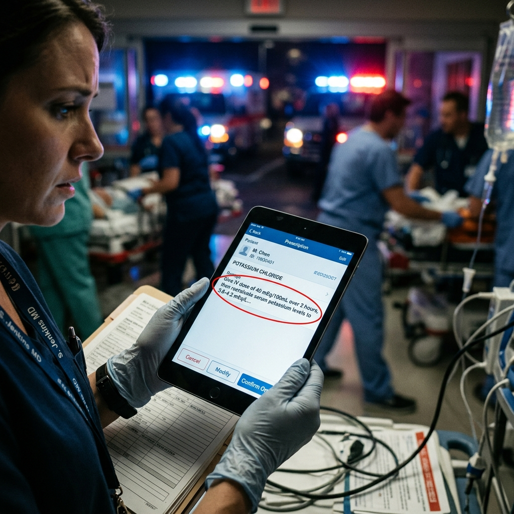
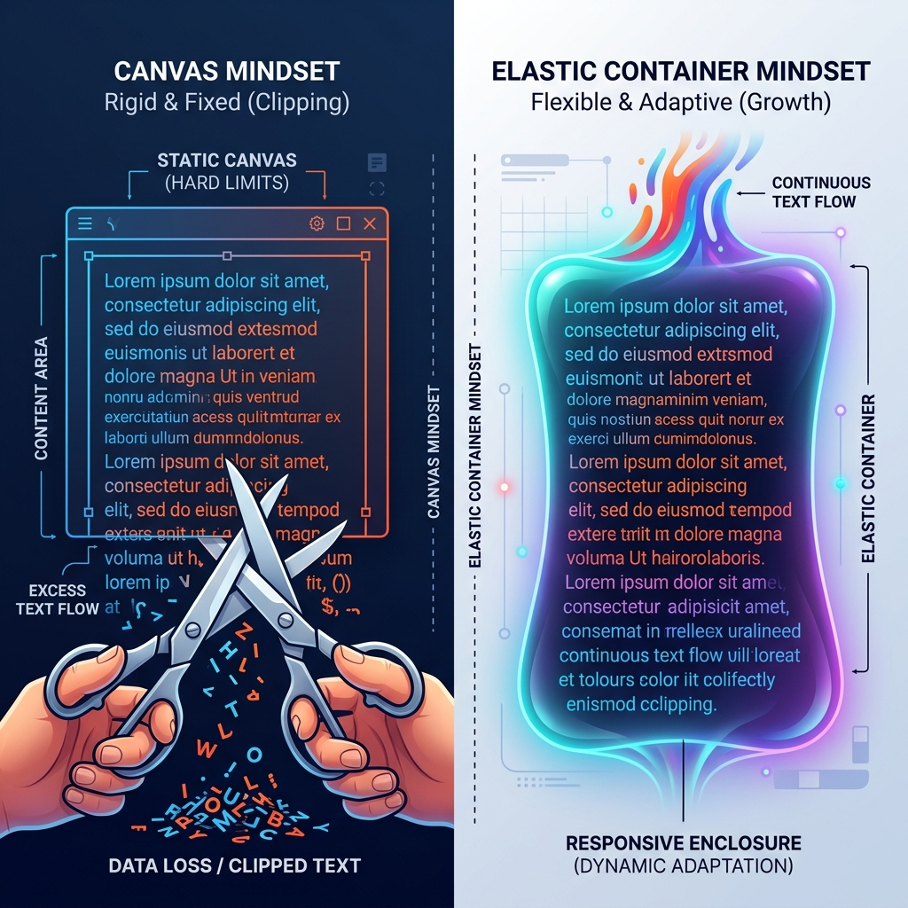
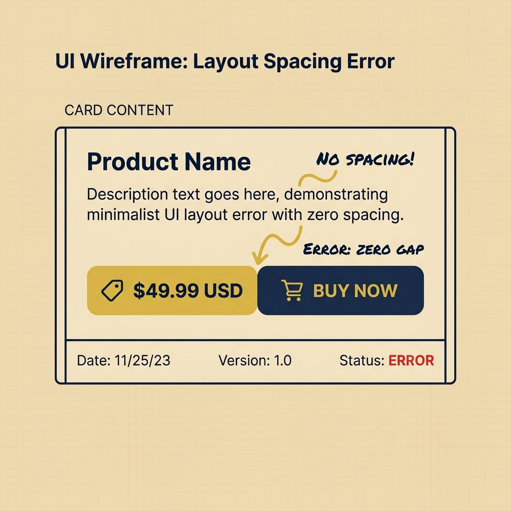
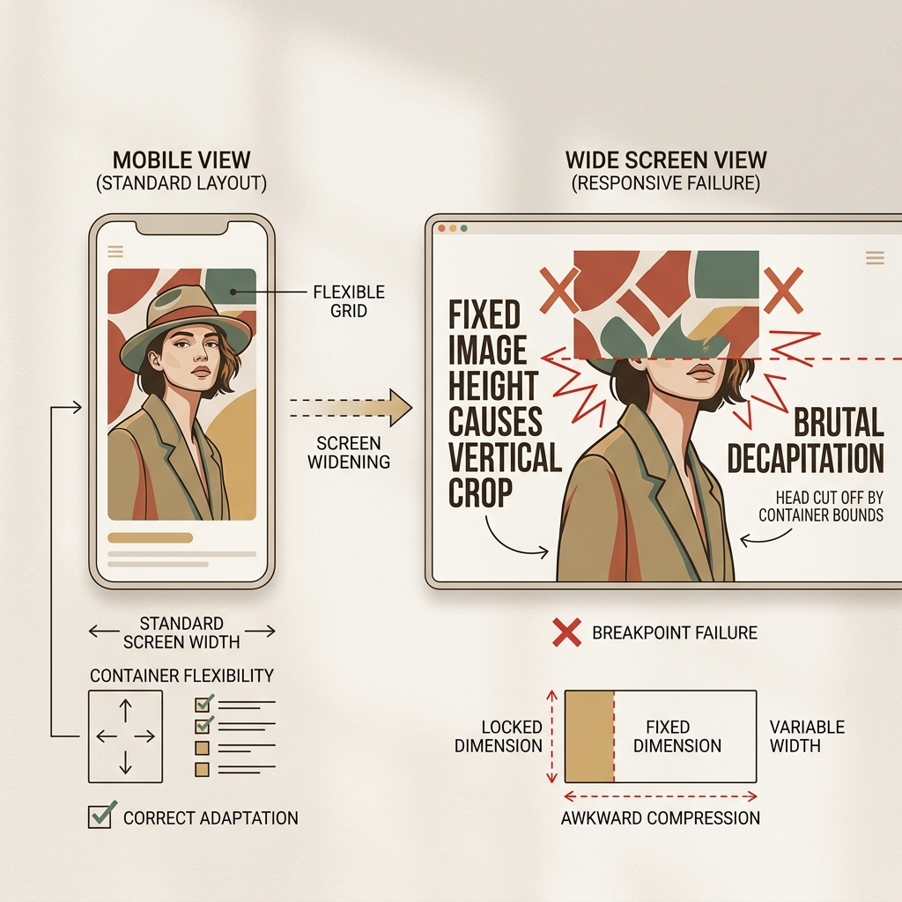
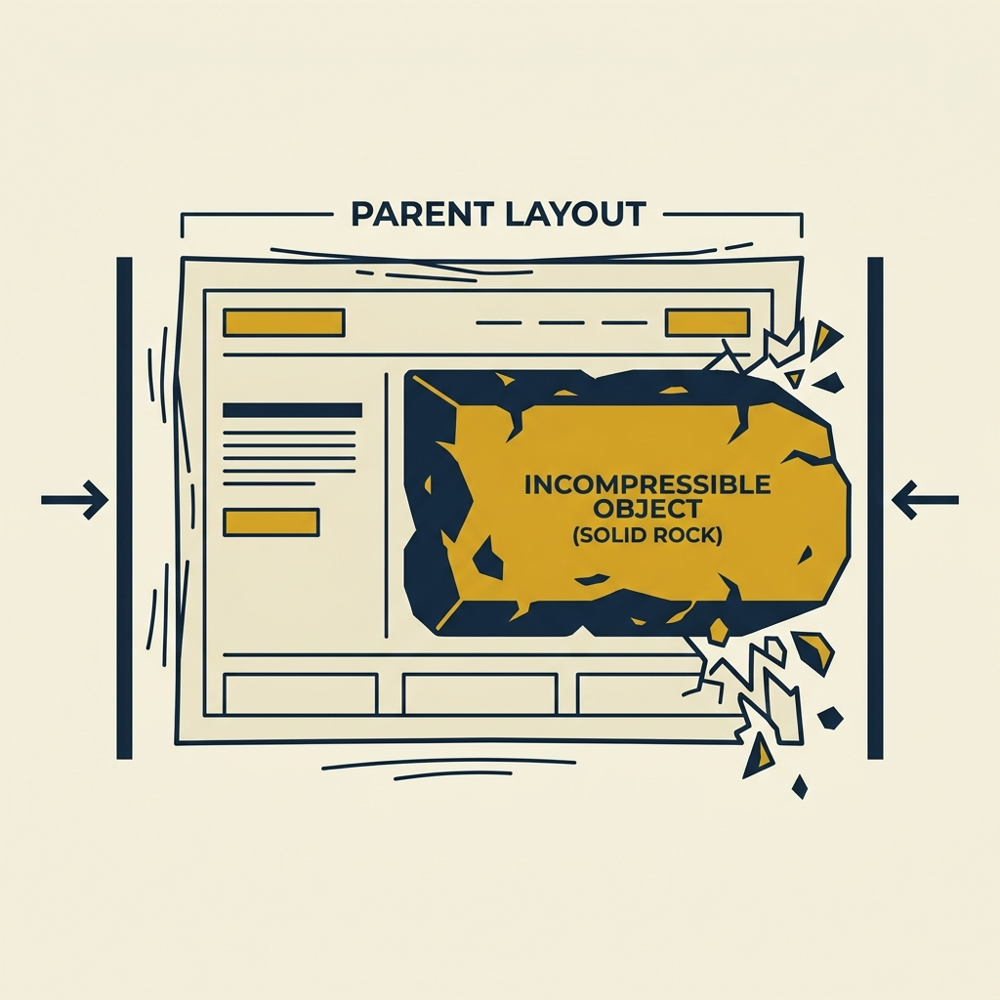
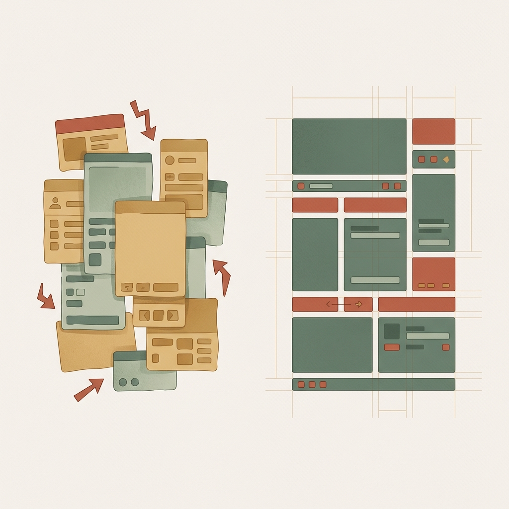

## 模块 4: 讲授(中) — 弹性宇宙：Flexbox与AutoLayout双向翻译 (约 35 分钟)
<!-- BUDGET: 5500 chars | SLIDES: ≥9 | STATUS: done -->

> [VISUAL]
> **Slide**: M4-01
> **Layout**: `Full`
> **Text**: 智能物流集装箱
> **Scene**: 一个透明的集装箱（代表父容器），里面整齐排列着我们在上一节课看到的“标准木箱”。集装箱外侧有一个中央控制台，只要拨动上面的拨盘，里面所有的木箱瞬间自动改变横向排队或纵向列阵的方式，间距也完全同步调整。
> **Search**: `smart logistics shipping container automated sorting system flexbox`
> **知识节点**: `flex-autolayout-mapping`
> **Asset**: 
> **Source**: `AI_Gen`

### 4.1 阵列统筹：交出控制权

上一个模块，我们搞懂了单个“木箱”的物理构造，也体验了手动摆放成百上千个木箱、调校 Margin（外边距）时的绝望。
解决这种手工排版痛点的系统性方案，叫做 **Flexbox (弹性盒模型)**。而 Figma 里的 **Auto Layout (自动布局)**，本质上就是给 Flexbox 这段干涩的代码，穿上了一件直观可视化的图形外衣。

当你把一批零散的盒子扔进 Flexbox 时，就等于把它们装进了一个**智能物流集装箱**。在弹性宇宙里，根本法则只有一条：**父容器拥有绝对控制权**。子元素必须上交它们原来各自为政的“Margin（个人距离）”，全权交由父容器的 **Gap（统一间隙）** 来统筹。是横向排队还是纵向列阵？间距留 16px 还是 24px？统帅一键发号施令，内部元素必须无条件服从。

这种父子控制衍生出了最核心的布局机制：**嵌套（Nesting）**。
就像打包行李箱，你不会把所有东西散落扔进去，而是先把洗漱用品放进洗漱包（子容器A），衣服放进收纳袋（子容器B），最后整齐放进行李箱（大父级容器）。一旦外部受压变形，每个小包都会在自己父容器的规则下自动调整，最终实现整体排版的自适应。

拆解常见的聊天消息界面，即可直观看到这种嵌套结构：

> [VISUAL]
> **Slide**: M4-02c
> **Layout**: `Image`
> **Text**: 聊天卡片嵌套拆解
> **Scene**: 微信/IM 聊天消息卡片拆解界面。真实截图覆盖了一层高亮的线框：最外层是代表大容器的蓝框，行内左侧头像代表 Fixed 的红色方块，右侧时间戳也是代表 Fixed 的红框，夹在中间的消息文本区是代表 Fill 的蓝色弹性框。
> **Search**: `chat message interface box model wireframe flexbox autolayout`
> **List**: Fixed / Hug / Fill
> **Asset**: 
> **Source**: `External`

> [ACTIVITY]
> *   **Type**: `Quiz`
> *   **Duration**: `2min`
> *   **Desc**: 知识点检查：Flexbox 父子控制权移交
> *   **Q**: 实习生小王在 Figma 中将五个原本各自设置了不同 Margin（外边距）的卡片框选并添加了 Auto Layout。添加完成后，他发现这五个卡片原本不一的间距瞬间变成了统一的 10px。这反映了弹性布局的什么核心法则？
> *   **Options**: A. 容器接管间隙控制权，子元素 Margin 强制失效 | B. 子元素的 Margin 自动求平均值并应用到父容器上 | C. 自动布局机制会默认清除所有子元素的视觉样式属性 | D. 子元素通过自身的 Hug 属性智能适应了周围环境空间
> *   **Answer**: `A`
> *   **Explain**: 在弹性宇宙中，一旦元素被放入 Auto Layout，子元素必须“上交控制权”，Margin 会被废弃而由 Gap 统筹。错误选项 B 错在 Margin 并非求平均而是直接失效；选项 C 错在机制仅接管空间布局，不会清除颜色等视觉样式。请参见本节关于“智能物流集装箱”控制权移交的讲解。

### 4.2 物理材质映射：Fixed、Hug 与 Fill

还记得我们在上一个模块探讨的“单体尺寸本能”吗？现在，当元素被放入拥有绝对控制权的**横向父容器**内，它们不再是孤立的个体。我们将上一节悬而未决的“Fill”，与升级后的“Fixed/Hug”放在一起，看看在这套复杂的阵列系统中，它们是如何演变成三种互相制衡的“物理材质”的：

> [VISUAL]
> **Slide**: M4-02d
> **Layout**: `Grid`
> **Text**: 伸缩材质映射
> **List**: 铁块 / 紧身衣 / 水
> **Scene**: 将“生硬的铁块（Fixed）”、“高弹力紧身衣（Hug）”与“有魔力的流动水（Fill）”并置的三宫格视觉隐喻，帮助学生在听讲时拥有具体的认知锚点。
> **Search**: `fixed hug fill auto layout physical metaphor`
> **Asset**: 
> **Source**: `AI_Gen`

1. 就像刚刚聊天界面的左侧头像，以及大家在 User Card 实践中搭建的圆头像，采用了 **Fixed (固定尺寸)**：我们在上节课叫它“硬质木箱”，但在受挤压的父容器里它表现得更像一块**铁块**。无论外框怎么拉伸，它都会固定保持设定的绝对像素（比如 150x150），绝不让步，从而防止核心视觉错位。
2. 你们在实践中设置的 User Card 大外框和底部的按钮，采用了 **Hug (适应内容)**：在这里它更像一件量身定制的**高弹力紧身衣**。内部文字变多它就自动向下撑大，文字减少它立刻紧缩，紧密包裹内部的内容，不留多余空间。
3. 夹在中间的消息文本区（或 User Card 的正文区），终于解锁了 **Fill (充满容器)**：这就是那团有魔力的**水**。因为有了大容器作为边界，它被扔进去后，无论外层被拉伸得多宽它都会瞬间横向膨胀填满剩余缝隙；结合 Hug 的高度本能，就能完美实现“横向流淌填满，遇阻换行自动撑高”的弹性体验。

弹性布局（Auto Layout）的核心不仅是嵌套，更重要的是在父级的绝对规则下，指挥这三种不同物理属性的子元素（固定的铁块 Fixed、紧身的保鲜膜 Hug、流动的水 Fill）进行动态协同列阵。横向还是纵向？间隙（Gap）留多少？一切由父容器的排版法则决定。

> [VISUAL]
> **Slide**: M4-02e
> **Layout**: `Image`
> **Text**: 弹性材料实战
> **Scene**: 动态 UI 演示图。在横向容器中，铁块(Fixed)、紧身衣(Hug)、水(Fill)三种材质在容器受横向挤压和拉伸时的实时形变反馈。
> **Search**: `flexbox auto layout physical material demonstration dynamic resizing`
> **Asset**: 
> **Source**: `AI_Gen`

> [ACTIVITY]
> *   **Type**: `Quiz`
> *   **Duration**: `2min`
> *   **Desc**: 课堂测验：核心伸缩属性应用
> *   **Q**: 设计师小林正在用 Figma 制作一个微信界面的消息条。最左边是朋友的头像，中间是文字消息，最右边是时间标签。当屏幕从 iPhone 切换到更宽的 iPad 屏幕时，他希望头像和时间的大小保持绝对不变，而中间的文字消息区域自动变宽以填满多出来的屏幕空白。小林应该如何设置这三个元素的缩放属性？
> *   **Options**: A. 头像和时间设为 Fixed，文字消息设为 Fill | B. 头像和时间设为 Hug，文字消息设为 Fixed | C. 头像和时间设为 Fill，文字消息设为 Fill | D. 头像和时间设为 Fixed，文字消息设为 Hug
> *   **Answer**: `A`
> *   **Explain**: 头像和时间作为固定视觉锚点，必须像铁块一样锁死，因此用 Fixed（固定尺寸）；中间的文字区需要像水一样填满屏幕变宽后产生的剩余缝隙，因此必须用 Fill（充满容器）。若文字区错用 Hug（D项），它只会紧缩抱住字数本身，无法撑开占据剩余空间。参见本节关于“三种物理材质”的讲解映射。

> [VISUAL]
> **Slide**: M4-03
> **Layout**: `Comparison`
> **Text**: Wrap 换行机制
> **Scene**: Wrap 换行机制图解。左边是没有开启 Wrap 保护的情况：屏幕被挤压，一排标签被截断或溢出屏幕边缘；右边开启 Wrap 机制后：多出来的标签平滑折行到第二排。
> **List**: Wrap 开启前 / Wrap 开启后
> **知识节点**: `flex-autolayout-mapping`
> **Asset**: 
> **Source**: `Manual`

当这堆不断膨胀和收缩的元素在同一个容器内相互挤压、横向空间被耗尽时，我们还有最后一道柔性防线——**Wrap (换行折叠机制)**（当单行排满后自动像瀑布一样跌落到下一行的安全保护网）。有了它，多余的元素遇到悬崖绝不会挤出屏幕，而是聪明地跌落到第二行重新列阵。

> [VISUAL]
> **Slide**: M4-04
> **Layout**: `Grid`
> **Text**: 四大响应式排版问题
> **Scene**: 卡片响应式排版问题示例。一次性展示 4 种典型排版错误截图：1. 文字溢出（长文字溢出卡片）。2. 元素粘连（按钮和价格无间隙贴合）。3. 图片截断（配图焦点被纵向裁切）。4. 固定锁死（固定宽度区块溢出屏幕）。
> **Search**: `broken css layout responsive problems bug flexbox disaster overflow troubleshooting wireframe`
> **List**: 文字溢出 / 元素粘连 / 图片截断 / 固定锁死
> **Asset**: 
> **Source**: `Manual`

### 4.3 诊断实战：四种典型排版问题解析
为了加深印象，我们来看看初学者从“画布思维”强行切换到“容器思维”时，最容易在真实项目中制造的 4 种典型排版错误。这些问题不仅常常发生在期末作业里，也在新手设计师和前端工程师的交接中频繁出现。

> [VISUAL]
> **Slide**: M4-04a
> **Layout**: `Image`
> **Text**: 一号问题：文字溢出
> **Scene**: 响应式问题之“文字溢出”。一个商品卡片设计，标题文本因为高度被固定限制，多行文字超出了卡片的底部边界，溢出到背景上，形成视觉断层。
> **List**: 症状 / 病因 / 处方
> **Asset**: 
> **Source**: `Manual`

**一号问题：文字溢出与静默截断。** 
**症状**：文字直接超出了卡片底部，发生重叠；或者更为隐蔽的——为了保持界面的“整洁”，多出的文字触发了**内容裁剪（Clip Content）机制**，就像被强制盖上一块不透明的遮挡板，超出的部分被完全隐藏，末尾只剩下一个不起眼的省略号。
**病因诊断**：你在画文本框时，习惯性地像在 Photoshop 里一样，用鼠标强行拉了一个“固定大小”的虚线框，导致高度被固定限制（Fixed Height）。当真实的后台数据塞进来一段长文本时，它没有空间向下生长。

> [VISUAL]
> **Slide**: M4-04a-2b
> **Layout**: `Image`
> **Text**: 救急屏幕盲区
> **Scene**: 急救场景隐喻。一张模糊的急诊室背景，前景是 iPad Mini 屏幕上一条被无情截断的处方信息，凸显出这种设计缺陷在真实场景下的严重后果。
> **Search**: `emergency room ipad mini clipped text UX disaster medical`
> *   **Asset**: 
> **Source**: AI Generated

> [CASE STUDY]
> **真实案例：被省略号截断的关键信息**
> 
> 在探讨“静默截断”的危害时，我们必须跳出“排版是否美观”的狭隘视角，来看看这种设计失效如何在现实世界中引发严重后果。
> 
> 2018年，一家医疗机构引入了全新的移动端电子病历系统（EHR），允许急诊科医生通过 iPad 进行移动查房。为了让界面看起来“极简且整洁”，外包设计团队为系统中的“处方药物与剂量”卡片容器设定了绝对死板的固定高度（Fixed Height: 48px），并在文本超出时开启了强制的“内容裁剪（Clip Content）”与省略号截断（Text Overflow: Ellipsis）。
> 
> 在他们的测试屏幕（标准的 1080p 桌面显示器）上，一切看起来完美无缺。
> 
> 然而，问题暴露在急诊室的真实设备上。当一位老年患者因急性哮喘入院时，值班医生在 iPad Mini（屏幕宽度和分辨率远小于测试环境）上开具了处方。由于系统采用了非弹性布局，药名与剂量文本在狭窄屏幕上被迫发生折行。但关键在于，外层容器的高度被固定在 48px。
> 
> 处方上的文本原本是：
> `硫酸沙丁胺醇雾化吸入溶液 (Salbutamol)`
> `剂量：2.5mg`
> 
> 但在被挤压的卡片内，文本折行后第二行的剂量信息触碰到了 Fixed 的底部边界。系统的“美化截断机制”被触发。在护士站的最终执行终端上，这条关键的处方显示为：
> `硫酸沙丁胺醇雾化吸入溶液 (Sal...`
> 
> 护士无法看到确切的 `2.5mg` 剂量。在争分夺秒的急救现场，这种由“排版截断”导致的信息黑洞，引发了用药确认的严重延迟。

> [VISUAL]
> **Slide**: M4-04a-3
> **Layout**: `Split`
> **Text**: 傲慢的画布思维
> **Scene**: 概念隐喻图：左侧代表“画布思维”（一把剪刀直接将溢出边框的文字裁切），右侧代表“弹性容器思维”（一个具有生命力的软框随着液态文字的注入，自动向下延展包容，不丢失任何信息）。
> **Asset**: 
> **Source**: `AI_Gen`

> [CASE STUDY] (接上文)
> **解剖这起案例的设计病理：**
> 这不仅仅是一个前端 Bug，这是典型的“画布思维”对真实数据的傲慢。设计师将文本视为可以随意裁切的“灰色填充块”，为了维持所谓卡片的统一高度，牺牲了信息呈现的完整性。
> 在弹性宇宙中，文本永远是液态的。特别是对于医疗、金融等高风险场景，承载核心数据的容器高度，**必须**设置为拥抱内容（Hug）。我们要让真实产生的数据量，自下而上地决定外框的最终高度，宁可让界面长短不一，也绝对不能让一条关键信息被省略号静默截断。

**处方**：文本是液态的，必须允许它向下流淌或折行。承载多行文本的容器高度，必须设置为拥抱内容（Hug），让里面的字数来自动决定外框的高度。

> [VISUAL]
> **Slide**: M4-04b
> **Layout**: `Image`
> **Text**: 二号问题：元素粘连
> **Scene**: 响应式问题之“元素粘连”。一个卡片底部，价格数字和“购买”按钮无间隙贴合，中间没有任何呼吸空间（间隙 Gap 为零），导致视觉拥挤感。
> **List**: 症状 / 病因 / 处方
> **Asset**: 
> **Source**: `Manual`

> [PACING]
> *[讲师眉头微皱，手指在屏幕上指点]*
**二号问题：元素粘连。** 
**症状**：价格标签和右侧的“购买”大按钮紧密贴合，连一像素的空隙都没有。视觉上失去呼吸感，显得缺乏秩序。
**病因诊断**：只顾着把元素塞进父容器，却忘记了最重要的是“阵型排布”，没有给父容器设定合理的空间统筹法则。
**处方**：发挥父容器的统治权，为它设定统一的 **间隙（Gap）**，或者开启两端分布对齐（Space Between），让元素像同极磁铁一样自动弹开，保持安全的呼吸距离。

> [VISUAL]
> **Slide**: M4-04c
> **Layout**: `Image`
> **Text**: 三号问题：图片截断
> **Scene**: 响应式问题之“图片截断”。一个响应式卡片在宽屏被拉伸时，因为配图容器高度固定而宽度自适应拉宽，导致模特的人脸焦点在垂直方向被裁切，丢失核心视觉信息。
> **List**: 症状 / 病因 / 处方
> **Asset**: 
> **Source**: `Manual`

**三号问题：图片截断。** 
**症状**：当页面在大屏幕上被拉宽时，配图的人脸焦点在垂直方向被切掉了一半。
**病因诊断**：这是一个经典的二维冲突悖论。你希望图片随屏幕变宽（Width: Fill），但你没有让它等比拉高，而是把高度固定了（Height: Fixed）。当宽度变大、高度不增加时，图片的原始宽高比遭到破坏。为了强行填满你增加的横向空间，画面只能在垂直方向上被裁切。
**处方**：图片容器拉伸需要谨慎。要么让前端工程师使用 CSS 的**按比例缩放（Aspect Ratio，即锁定长宽比，宽变大时高同步变大）**，要么确保图片焦点在中心，通过**对象适配（Object Fit）机制**——就像设置手机壁纸一样，设定规则让图片自动等比填满并裁切多余边缘，从而优先保护画面的核心视觉区。

> [VISUAL]
> **Slide**: M4-04d
> **Layout**: `Image`
> **Text**: 四号问题：固定锁死
> **Scene**: 响应式问题之“固定锁死”。一个响应式的父容器正在被横向挤压，但里面的子元素却像一块不可压缩的石头，保持固定宽度（Fixed），直接溢出父容器的边缘。
> **List**: 症状 / 病因 / 处方
> **Asset**: 
> **Source**: `Manual`

**四号问题：固定锁死。** 
**症状**：在需要灵活流动的响应式布局里，出现了一个完全不响应缩放的绝对定宽区块。屏幕宽度一旦向内挤压，排版的边缘瞬间出现溢出。
**病因诊断**：在弹性宇宙里，滥用了 Fixed（绝对固定尺寸）。这就好比在柔性排版系统中，强行塞入了一块生硬的铁块（Fixed），外力一压，容器瞬间出现溢出。
**处方**：在响应式系统的主干道上，必须克制对于 Fixed 的依赖，转而大量使用 Fill（充满剩余空间）和 Hug（拥抱内容），把绝对固定的 Fixed 留给那些永远不需要变形的微小组件（如固定大小的图标或勋章）。

> [ACTIVITY]
> *   **Type**: `Quiz`
> *   **Duration**: `2min`
> *   **Desc**: 课堂测验：响应式崩溃重症诊断
> *   **Q**: 新手设计师小明在制作淘宝商品卡片时遇到了问题。当卡片在宽屏幕上被横向拉伸时，卡片顶部配图里的模特人脸在垂直方向上遭到了生硬裁切，核心视觉信息丢失。最可能导致这个排版错误的原因是？
> *   **Options**: A. 父容器统一缩放间隙（Gap）导致了卡片整体比例失控 | B. 配图宽度设为充满（Fill），但高度被死死锁为固定（Fixed） | C. 承载卡片的父容器被强制配置了换行折叠（Wrap）边界 | D. 配图内部填充模式设定为包含（Contain）导致留白
> *   **Answer**: `B`
> *   **Explain**: 当图片宽度自适应填充（Fill）拉伸时，若高度未设置按比例缩放而是被固定（Fixed），画面为填满横向空间必然在垂直方向发生裁切，此即本节讲解的“三号问题：图片截断”。若是设为包含模式（D项）会出现黑边但不会裁切；C项的换行保护网影响的是多元素的折行排列，不会导致单张配图被裁切。

### 4.4 工业化实操：组件弹性封装

> [TEACHING MOMENT]
> 响应式工程化口诀：**父控全局列阵，子定弹性缩放，间隙系统规范**。
> 1. **父容器定列阵 (Parent Control)**：不仅决定主轴方向（Direction: 横向/纵向），还掌控全体子元素的对齐分布（Alignment: 居中/贴边）与换行规则（Wrap）。
> 2. **子元素定缩放 (Child Resizing)**：个体只负责声明自己在受压时的物理材质（Hug 高弹紧身衣 / Fill 流动水 / Fixed 铁块）。
> 3. **元素间隙走系统 (Gap)**：绝对禁止手捏数值，必须调用设计系统（Design System）中的标准化间距变量。

> [ACTIVITY]
> *   **Type**: `Demo`
> *   **Duration**: `10min`
> *   **Desc**: 教师实操演示：卡片组件的弹性封装与还原

> [VISUAL]
> **Slide**: M4-05
> **Layout**: `Full`
> **Text**: 实操：卡片组件嵌套封装
> **Scene**: Figma 实操录屏。演示“从内到外”的积木式弹性封装：先选中按钮及内部文字加 Auto Layout，再将标题与正文打组，最后将头像、文本组和按钮全选加 Auto Layout。将最外层黑底卡片的约束条件从 Fixed 切换为 Hug，卡片瞬间自适应拥抱内部的嵌套结构，最后演示调整不同层级的 Padding 和 Gap。
> **Search**: `figma auto layout nested demonstration user card inside out`
> **List**: 1. 局部封装 / 2. 层级嵌套 / 3. 全局统筹 / 4. 切换约束
> **Duration**: `2min`
> **TimeCategory**: `lecture`
> **Asset**: 
> **Source**: `Manual`

请看大屏幕。在《User Card》实践中我们强调了“切忌由外向内硬塞”，所以这里必须**从内向外**搭建：先选中按钮和文字建立局部的 Auto Layout，接着把标题和正文组合成文本区，最后才将头像、文本组、按钮三大块全选，点击右侧代表 **Auto Layout** 的加号进行全局统筹。瞬间，Figma 自动为它们加上了层级分明的父容器。此时，如果把最外层容器的约束从固定的 **Fixed** 切换为适应内容的 **Hug**，背景卡片就会像保鲜膜一样紧紧收缩并包裹住内部元素。最后分别设置好内边距和间隙。

**这不仅是排版，更是在进行“可视化写码”。** 本模块之所以称为**双向翻译**，是因为你在右侧面板的视觉配置，会 1:1 映射为**前端真实代码**：当我们在刚刚的 User Card 实践中设置**纵向排布 (Vertical)** 时，你在 VSCode 里对应写下的正是 `display: flex; flex-direction: column;`；当你在面板填入 **24px 间隙** 时，底层就同步生成了 `gap: 24px;`。通过 Auto Layout，设计师交付的不再是静态图层，而是包含**空间逻辑**的真实组件，工程师可直接复用这些参数，大幅降低沟通损耗。

然而，弹性布局的自由度需要严格的**间隙法则**来约束。若在面板中随意手捏间距（如 5px、7px 混用），不仅会导致视觉**呼吸感混乱**，更会让前端生成杂乱无章的**冗余代码**。

> [VISUAL]
> **Slide**: M4-05b
> **Layout**: `Split`
> **Text**: 间隙失控与工业秩序
> **Scene**: 展示杂乱间距（5px、7px、13px 随意堆叠引发报错）与严谨间距（统一 16px 的工业秩序）的对比图，为接下来的“间距刻度体系”做铺垫。
> **Search**: `design system spacing chaos vs order UI gap`
> **Asset**: 
> **Source**: `Manual`

在进入下一个主题之前，我们先来做一个破案小测验，验证一下大家对“双向翻译”的理解。

> [ACTIVITY]
> *   **Type**: `Quiz`
> *   **Duration**: `2min`
> *   **Desc**: 诊断测验：双向翻译与代码映射
> *   **Q**: 前端工程师老王在还原实习生小李的 Figma 卡片组件时，发现代码面板里竟然直接导出了 `gap: 13px;` 和 `gap: 7px;` 这样毫无规律的碎步代码。根据“双向翻译”原理，小李在设计时最有可能犯了什么错误？
> *   **Options**: A. 在父容器的对齐设置中开启了“两端对齐（Space Between）”自动计算间隙 | B. 在 Auto Layout 中脱离了系统规范，随意手捏了间隙数值 | C. 给卡片内部的单个子元素单独设置了绝对的外边距（Margin）参数 | D. 将最外层大容器的伸缩属性设为了适应内容（Hug）从而挤压内部空间
> *   **Answer**: `B`
> *   **Explain**: “双向翻译”意味着设计师在面板上的空间配置会 1:1 变成前端代码。前端出现无规律的 gap 间距数值，正是因为设计师在 Auto Layout 里像画画一样随意拉扯或手写了间隙数值（对应 B 项）。如果开启了两端对齐（A项），前端通常对应 `justify-content: space-between` 而非写死的散乱 gap 值；C 项在 Auto Layout 接管下 Margin 已失效。请回顾本节关于“双向翻译代码映射”原理的讲解。

> [VISUAL]
> **Slide**: M4-05b-2
> **Layout**: `Image`
> **Text**: 碎步间隙乱象
> **Scene**: 代码堆叠与间距测量乱象图。Figma 画布上密密麻麻标满了 7px, 11.5px, 13px 的红色测距线，旁边是对应的杂乱 CSS 代码，呈现出一种无序的工程灾难感。
> **Search**: `chaotic spacing figma redlines bad UI design handoff`
> **Asset**: 
> **Source**: `AI_Gen`

> [PHILOSOPHY]
> 弹性宇宙并不意味着“无法无天”。当所有的容器都在拉伸、换行、自由流动时，唯一能让整个系统保持视觉秩序感的，就是容器之间的**固定间隙法则**。

> [CASE STUDY]
> **商业案例：非标准化间距导致的电商大促事故**
> 
> 为什么我们对 Auto Layout 中的间隙（Gap）数值有如此苛刻的“洁癖”？这背后是一笔极其昂贵的商业学费。
> 
> 某大型跨国电商平台在筹备年度大促时，决定对全站的商品展示卡片进行一次彻底的响应式重构，以适配从超小屏安卓机到超宽屏带鱼屏的碎片化终端。设计团队使用了 Figma 的 Auto Layout，但在交付给前端工程师的代码中，充斥着毫无规律的间隙数值：这里的标题和价格差了 `7px`，那里的标签和按钮隔了 `13px`，甚至还有 `11.5px` 这种荒谬的像素切分。
> 
> 为什么会出现这种情况？因为初级设计师在搭建组件时，脱离了设计系统（Design System），仅仅凭借肉眼的“视觉舒适度”，用鼠标随意拖拽拉扯调整间距。
> 
> 问题在大促前夕的灰度测试中暴露了。
> 
> 当这套缺乏统一标尺的卡片组件被部署到数百万个不同尺寸的设备上时，前端的渲染引擎崩溃了。因为每一个卡片内的 13px、7px 都是硬编码的碎片化代码，工程师无法通过一套全局 CSS 变量（Variables）对全站间距进行统一的按比例缩放。

> [VISUAL]
> **Slide**: M4-05c
> **Layout**: `Comparison`
> **Text**: 碎步间距的终端适配问题
> **Scene**: 左右终端界面对比实录图：左侧是超大宽屏下的电商卡片，卡片被拉得极宽产生巨大留白，但“立即购买”按钮和价格标签因为被 7px 的固定间距限制，紧凑地挤在角落；右侧是超窄安卓屏，因为各种 11.5px、13px 的间隙互相挤压叠加，导致最右侧的“立即购买”主行动按钮直接被挤出了屏幕可视区之外。
> **List**: 宽屏显示 / 窄屏显示
> **Source**: `Manual`

> [CASE STUDY] (接上文)
> 结果是：在超大屏幕上，商品卡片被拉得极宽，但内部的按钮和价格却因为那微小的、写死的 `7px` 间隙紧凑地挤在一起，造成视觉失衡；而在超窄屏幕的低端安卓机上，各种 `13px`、`11.5px` 相互叠加，最终导致横向空间被这些零碎的间距耗尽，核心的“立即购买”按钮被挤出屏幕可视区。
> 
> 仅仅因为购买按钮在部分机型上的“消失”，该平台的转化率在几小时内遭遇了断崖式下跌，造成的 GMV（商品交易总额）损失高达数百万美元。
> 
> **这起昂贵事故给我们的教训是：**
> 在手工切图时代，你在画布上随手捏一个 7px 的间距，它只是一块静态的透明像素；但在容器化工程时代，你在 Auto Layout 右侧面板里填入的每一个数值，都会成为编译到底层的一行真实代码。
> 
> 当千百个组件共同构成一个庞大的响应式生态时，维系这个生态不崩塌的，不是魔法，而是**纪律**。这也是为什么顶级设计团队必须引入“8点网格系统”或标准化间距系统。所有的 Gap 必须是预设好的 Token（如 `gap-sm` 代表 8px，`gap-md` 代表 16px）。设计师在操作 Auto Layout 时，绝不是在盲目捏造距离，而是在调用系统分配的空间刻度。

接下来，我们将正式揭开工业标准布局的最后一块拼图：**间距刻度体系（Spacing System Scale）**。看看顶级设计系统是如何用严谨的数学刻度，让这些自动排布的组件从“不散架”升级为具备专业秩序感的界面。

> [VISUAL]
> **Slide**: M4-05d
> **Layout**: `Grid`
> **Text**: 设计刻度代币 (Token)
> **Scene**: 可视化排版矩阵图。展示一套标准的 8 点网格间距系统 (8px, 16px, 24px, 32px)，每个间距对应一个清晰的 Token 命名 (gap-sm, gap-md, gap-lg)，像一套精密的乐高积木一样整齐排列。
> **List**: Token / 8点网格 / 工业秩序
> **Search**: `8pt grid system spacing tokens design system scale`
> **Asset**: 
> **Source**: `AI_Gen`
