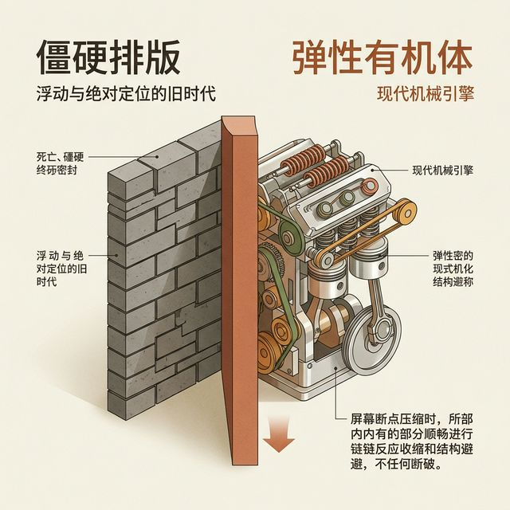
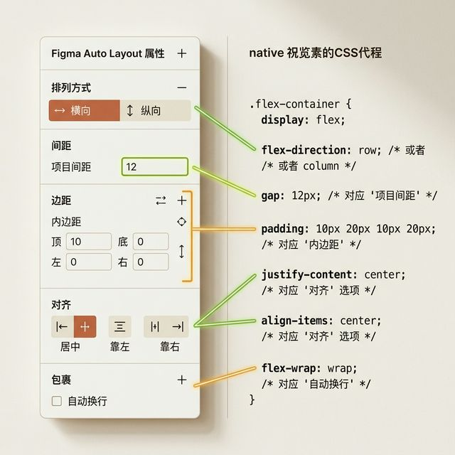
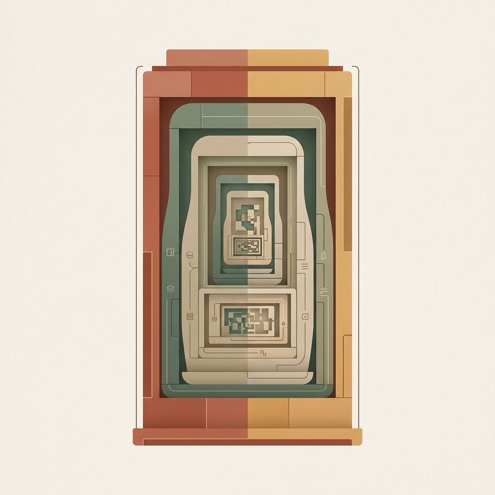
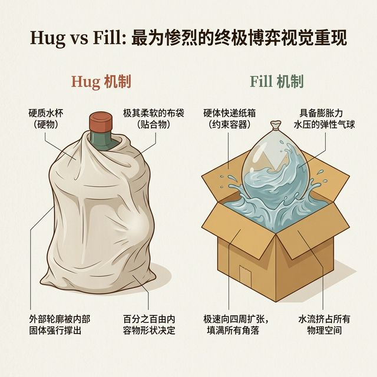
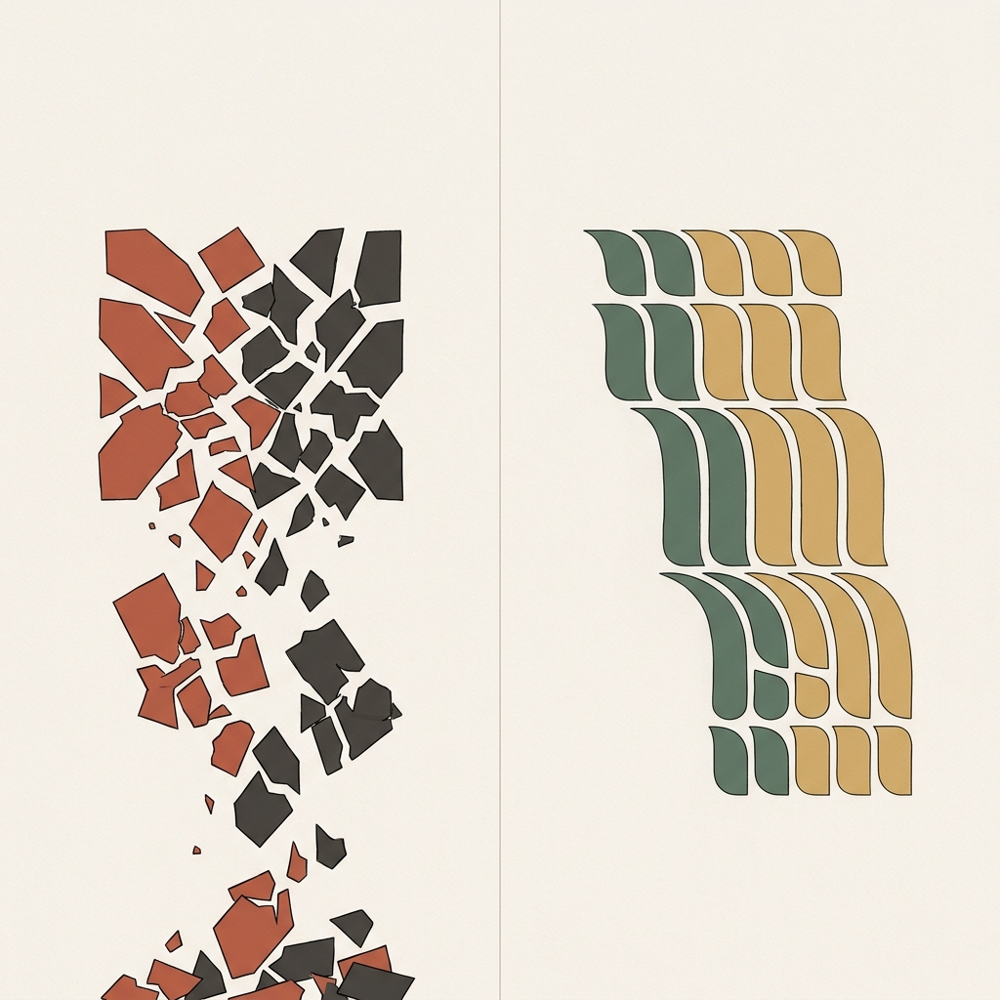

## 模块 4: 讲授(中) — 弹性宇宙：Flexbox与AutoLayout双向翻译 (约 25 分钟)
<!-- BUDGET: 4500 chars | SLIDES: ≥9 | STATUS: done -->

> [VISUAL]
> **Slide**: M4-01
> **Layout**: `Split`
> **Scene**: 极具视觉冲击力的从"僵硬排版"到"弹性有机体"跨越演示。屏幕左边是一堵用死硬灰色砖头严丝合缝砌死的墙（隐喻 Float 浮动与绝对定位的旧时代）。屏幕右边是一个充满弹簧、橡皮筋、活塞与连杆的极其精密且泛着光泽的现代机械引擎组。当受到外部强力施压（隐喻屏幕断点压缩）时，内部所有零件会平滑地发生连锁收缩和结构避让，绝不断裂。
> **Search**: `rigid brick wall vs elastic mechanical system flexibility responsive engine metaphor`
> **知识节点**: `flex-autolayout-mapping`
> *   **Asset**: 

当我们花了一节课的时间，终于理解了如何精确铸造出每一个孤立存在的合格积木块（也就是严酷的盒模型）之后，随之而来摆在你们面前的第二个巨大挑战是：如果把一堆不同尺寸的盒子扔进同一个巨大的屏幕容器里，积木和积木之间，究竟该按照什么法则来协同排列？

如果我们回到早期的 Web 拓荒时代，你会发现那时的网页排版更像是在做极其痛苦的算术泥水匠。我们只能使用一种叫做 `Float`（浮动）的老旧属性，一点点、一像素一像素地去算计一排还剩余几像素的坑位。只要用户的屏幕比你预想的稍微窄了哪怕也是可怜的 5 像素，排在最后一块的砖头盒子就会被无情地挤压跌落到下一排，整个原本对齐的精美页面瞬间发生恐怖的车祸现场。那是一个死硬的年代，没有宽容度可言。

直到后来，一种叫做 **Flexbox (弹性灵活盒子)** 的革命性底层布局技术石破天惊地出现了。网页的二维乃至一维排版交互，才算是真正从旧石器时代的刀耕火种，大跨步进入了可缩放的现代工业革命。
这也是你们现在每天重度依赖并且觉得理所当然的那个神兵利器——**Figma 右边栏里的 Auto Layout (自动布局)** 的亲生父亲。

> [VISUAL]
> **Slide**: M4-02
> **Layout**: `Comparison`
> **Scene**: 左侧是极其清晰的、放大版的高清 Figma Auto Layout 属性操作面板视图，右侧是其本质完全一一对应的原生浏览器 CSS Flexbox 底层编译代码块。两边用极为耀眼的荧光色连线，进行毫无误差的一对一全量高亮属性翻译绑定：例如横向纵向排列选项箭头精准对应 `flex-direction`；Item Spacing 输入框精准对应代码的 `gap` 属性；而局部的 Padding 边距设置甚至直接对应 CSS 原始的同名 `padding` 节点设置。
> **知识节点**: `flex-autolayout-mapping`
> *   **Asset**: 

很多非技术出身的同学一直有个错觉，以为 Auto Layout 是 Figma 团队自己在小黑屋里发明的什么绝世黑魔法引擎。
其实根本不是。本质上来看，**Figma 的 Auto Layout 就是给底层极客向的 CSS Flexbox 穿上了一件极其美观、直观、而且操作门槛极低的可视化图形外衣（GUI）**。它们两者之间，甚至是同呼吸共命运的，有着一套极其严密、一比一锁死的双向翻译协议。

这就意味你们在操作 Figma 的时候，实际上就是在云端写着最高标准的样板代码：
- 当你在 Figma 对界面里点击那个"横向排列"（Horizontal Direction）的直箭头操作时，Figma 在后台的翻译器其实是毫不犹豫地在代码虚拟层里下发了一句绝对的重设命令 `flex-direction: row`；
- 当你在数字框里小心翼翼地敲击，设置着容器里三个子卡片元素间的间隙为 16px (Spacing between items) 的时候，你的行为等同于一个资深前端亲手写下一句最干净利落的 `gap: 16px`。

只要你搞懂了 Auto Layout 界面的每一寸结构，实际上，你早就在无形中掌握了写当代最高效、最具鲁棒能力的前端 CSS 布局代码的黄金技能了。

而在这一套被称作弹性宇宙的系统里，它运行的首要、也是最根本、不能违背的大法则是：**父容器绝对控制子元素**。
一个套着大层级 Auto Layout 的父级 Frame，它就好像是一个拥有绝对权力的军事统帅。它只要发号施令制定了横向还是纵向，它里面的所有那些子元素、孙子元素图层，都必须立刻无条件服从这套整体的排列轴线分布与对齐规则（也就是著名的 Justify Content 与 Align Items 参数）。
这是一个极其关键的排障（Debug）思维：如果在未来的做图或者写代码中，你发现你怎么拼命去强行拖拽微调一个小文本图层它就是死活不听话归位，你甚至急得流汗。停下来。原因往往 100% 都不是这个子元素自己出了问题，而是因为它外面的"爹"——那个绝对包裹着它的父级容器的属性规则配置冲突了。

> [VISUAL]
> **Slide**: M4-02b
> **Layout**: `Flow`
> **Scene**: 俄罗斯套娃式的 Flex 嵌套架构图解。最外层是一个巨大的垂直向下箭头（代表最外层父容器 `flex-direction: column`），内部包含了三个水平向右箭头的"子一层"长条容器（`flex-direction: row`）。在其中一个长条容器内，又包含了两个垂直向下的小容器。生动展示 Auto Layout 无限嵌套构建复杂界面的能力。
> **Search**: `css flexbox nested containers layout architecture schema`
> *   **Asset**: 

这种父子控制的法则，还衍生出了 Flexbox 最伟大的力量来源：**嵌套（Nesting）**。
复杂的数字产品界面，从来都不是只有一个轴线的一维面条。它是由横竖横竖交织而成的迷宫。一个垂直方向的 Auto Layout 大容器里，可以包含三个水平方向的 Auto Layout 子容器（比如网页的页头、主体和页脚）；而在那个水平的主体容器里，又可以再嵌套一个垂直的侧边栏和一个弹性的主内容区。
就像你出门旅行打包行李箱（最外层垂直容器），你不是把所有零散的衣服牙刷都随便扔进去。你是先把洗漱用品装进一个洗漱包（水平子容器 A），把内衣裤装进另一个收纳袋（垂直子容器 B），然后把这些装好的子容器再整齐地放进行李箱里。一旦外出行李箱受到了积压变形，里面的每一个子包都会自己调整自适应——这就是高级前端布局最迷人的俄罗斯套娃艺术。

> [CASE STUDY]
如果你想亲眼目睹这种属于现代工业级代码级多端组件嵌套的终极精妙杰作，今天下课后请你们立刻去亲手打开大家经常在做笔记使用的 Notion 强大的长文档页面编辑器，并且尝试着用审查元素的视角去彻底解构它。Notion 的每一个可被随意拖拽操作的细小文字 Block，其在前端构架的本质上本身就是一个极其严密且自带逻辑约束的垂直 Auto Layout 的深层容器——它中间的主文本区内容块默认采用了极度柔软包容的 Hug 先进属性，去极其温柔地包裹并且自适应地追随你不断大量敲打输入的单行文字数量进而撑高其物理容器；可是它左侧那个永远用于悬浮出现、供鼠标定位的六个小白点拖拽手柄区域，则反向采用了绝对冷酷死板的 Fixed 固定硬编码宽度去死皮赖脸地占位防守，以此来防止整体条块在鼠标滑过时出现任何一点点令人不安的滑动偏移错乱感；而那一个位于最外层架构、用于承重囊括承载它们这群细小组件组合的整个超宽大页面主体白色大区呢，则完完全全是一个采用了极其贪婪特质设计的大面积巨大 Fill 伸展容器，像一头被饿坏的巨兽时刻准备着去瞬间涌入并填满你那随着鼠标疯狂横向拉伸变宽后电脑屏幕里新增出来的每一寸真空物理像素。
当你漫不经心地随手把一个折叠展开列表块（Toggle List）无情地用光标拖进另一个已经展开了的折叠列表块肚子内部的纵深里，然后再在那层深不可测的代码抽象结构里面直接暴躁地内嵌塞进一个个带有明黄色背景底色的强力刺眼 Callout 信息引语提示警告大方块时，各位，恭喜你，你就在无意间亲眼见证了这三层乃至可能是可怕的四级五级俄罗斯套娃循环系统在超大规模的真实世界端产品商业级别运转引擎当中的完美无瑕的兼容包容神话——在这个深邃恐怖且极度复杂的 DOM 操作架构层级节点树里面，每一层粗壮的干脉、甚至是末梢的每一片单调的独立树叶节点，都在严选各自被划分好的特定绝对封闭层级包裹空间里，极其严格苛刻且一丝不苟地在默默执行和绝对遵守着属于 Hug 与疯狂的 Fill 他们之间那些永不调停的复杂、绝妙的空间张力挤压博弈法则权衡。

> [PHILOSOPHY]
如果把视野拔得更高、更深一层地透过表象向更广袤的人文学科领域去看，我们会震撼并且极其诧异地发觉：这种极度讲究层级所属和套件制约的、近乎数学般冷酷的嵌套的庄严秩序感，它其实压根并非是几十年前硅谷那某几几个百无聊赖编写底层协议框架的老派计算机图形界程序员的偶然灵光乍现和独创思维产物。早在现代的电子管计算机设备被人类彻底完全发明和点亮诞生之前足足大半个多世纪那么久远的时候，研究全人类文化演进密码的顶尖当代结构语言学家大师们，就已经极其敏锐地透过漫长的历史卷宗发现了全人类地球表面这几千种截然不同语种深处由于大脑机制所隐藏的同一套极度惊人的逻辑和递归嵌套规律本质。
当代最负盛名的一代宗师语言学泰斗诺姆·乔姆斯基，在他那震惊学界、如同计算机汇编般严密的著名的生成语法（Generative Grammar）理论早就告诉并且警告了我们：人类这一充满局限的生物之所以能够仅仅只用区区几千个极其有限、甚至看起来十分可怜的短小残缺基础词汇符号集，就能去创造、去编织和倾诉出有着无限多种繁复可能、甚至可以组合出近乎无限长的长度、并且在其庞大结构内部能够包囊和隐藏着无数多个修饰从句的各种完全前所未有的全新句法模式句子；这背后一切力量的来源，正是因为我们作为智慧物种大脑里自带固化的那一道古老语言生成法则机制、其本身的天性，就是天然地、而且并且是毫无阻拦地被全权允许着让一个个小型的片段子句结构近乎是如同盗梦空间般无限降维地去嵌套堆砌、填充嵌合进一个更加庞大宏伟的母体大结构的边界管辖容器之中。
所以说到底，各位今天在这个微观层面上、满屏报错发狂而在 Figma 全黑死板的基础属性界面里，咬着牙死磕硬靠人力拖拽搭建出来的那套令人绝望的横向嵌套着无数纵向、而那些深不可测的繁杂内部纵向系统里又再次极其荒诞地反向深层包裹嵌套隐藏着横向网格分布的系统工程化组件结构大乱斗容器迷宫幻阵图，它并非只是一堆冷冰冰的多余代码废物。相反，它在构成这套体系底层的数字世界运行逻辑和那些更加深远的古老哲学演进的本质宿命上而言，它的确是完完全全、一脉相承地在和你此时此刻使用着极其复杂修饰语序的中文母语沟通去小心翼翼地造出那些错综迷离、层层叠叠包罗万象且相互制衡呼应附带着连环条件定语、同时还不忘穿插多重转折状语从句的庞大复杂高级句型，在这个宇宙级别的底层构建里死死地共同分享并且牢牢绑定着同一个不可违抗也是不可被修改破坏的、绝对纯粹同宗同源的宏伟底层递归闭环运行机制。

然而，弹性布局里真正最折磨新手神经、也是最考验交互工程师空间感官的难点死地，还不是静态对齐，而是发生动态拉扯变化时的——**尺寸博弈**。

> [VISUAL]
> **Slide**: M4-03
> **Layout**: `Flow`
> **Scene**: Hug vs Fill 最为惨烈的终极博弈视觉重现。左侧的子图案（象征 Hug 机制）：这是一个由极其柔软和贴合的软布袋材质包裹着的一个巨大硬质水杯，整个软布袋外部轮廓的形状和隆起，百分之百是被布袋里面那块坚硬固体水杯（也就是内容物）给绝对强行从内部撑死出来的。右侧子图（象征 Fill 机制）：这是一个装满了极其具备膨胀力水压的巨大弹性气球，它被人被粗暴丢进了一个非常空旷的硬体快递纸箱（约束容器）里，气球在接触底部的瞬间，向四周疯狂地、毫无保留地极速扩张，水流挤占瞬间填满了四周纸箱所有的物理角落。
> **Search**: `hug contents vs fill container metaphor flex grow flex basis tension mechanism`
> **知识节点**: `flex-autolayout-mapping`
> *   **Asset**: 

这就是业界赫赫有名的 **Hug (适应并且紧紧拥抱内容)** 阵营和 **Fill (野蛮疯狂地充满容器)** 阵营长年不息的宿命对决战。

这是什么高维概念？为了让各位产生深层肌肉记忆，我们必须用一个极其生动甚至是残暴的生活比喻。
**Hug (适应内容) 它的性格就像一个极度内向、没有安全感的人；或者我们在画板上看到的心智映射，就是一个装固体水杯的超软布袋**。
在代码世界里，它的初始占位完全由内部内容决定（对应 `flex-basis: auto`）。布袋里只有三个汉字，它就那么短短一截；后来传入十个字的标题，布袋立刻被撑长。它从不主动向外扩张（`flex-grow: 0`），只在乎紧紧抱着自己的核心内容。空间不够时，它甚至会优先委屈自己缩起来让道（`flex-shrink: 1`）。
什么样的 UI 用 Hug 最安全？各类文本标签 Tags、功能图标以及行数字数不确定的长文章描述段落。

与 Hug 完全相反的对立面，**Fill (充满容器) 它的性格就像一个极度贪婪的地产暴发户；也是那个被抛进纸箱内部之后疯狂向四周扩张、极富野心的水气球**。
映射到参数面板底层，它有着无止境的扩张欲望（对应 `flex-grow: 1`）。它不在乎自己内部装了多少内容，哪怕是个空壳子！只要父级容器里还有任何无主的剩余空间，它就会如同水流一般贪婪地膨胀填充，直到占据父级提供的全部可利用底盘。
什么样的 UI 必须用 Fill？所有全屏拉伸的广告头幅 Banner、横跨整屏的主搜索栏和输入框、以及作为视觉承重主干的自适应内容阅读专区或相册滚动区域。

> [VISUAL]
> **Slide**: M4-03b
> **Layout**: `Comparison`
> **Scene**: Wrap 换行机制图解。左边是没有开启 Wrap 保护的惨状：由于屏幕挤压，一排本来应该完整的 Tag 标签被粗暴截断，一半字面飞出屏幕；右边是开启了 Wrap (折行) 机制后的优雅：多出来的几个标签像是遇到了瀑布的边缘，平滑、自然地跌落到第二行，形成优雅的双排或三排网格状态。
> **知识节点**: `flex-autolayout-mapping`
> *   **Asset**: 

当这两个性格截然不同的怪物在同一个容器内相互冲撞挤压时，如果你依然觉得不够安全，现代的弹性容器还准备了最后一道终极的柔性防线——**Wrap (换行折叠机制)**。
在过去，我们要让过多的按钮或标签换行是一件要人命的数学题。但在 Flexbox 的宇宙里，你只需要在代码中加上一句 `flex-wrap: wrap`，或者在 Figma 属性栏点一下那个代表"跌落"的小图标。它就像是告诉统帅：如果士兵冲锋时遇到了前方悬崖，不要死板地挤在一起掉出屏幕外，请聪明地跌落到第二行重新排开阵列！

[CASE STUDY]
去打开淘宝任意一件商品的详情页，看看颜色选择和尺码选择区域。当可选标签多达十几个而屏幕宽度不够排成一行时，Wrap 机制让多余的标签像瀑布一样优雅跌落到第二排、第三排——而不是被挤出屏幕成为用户永远触及不到的幽灵。这就是不可预知碎片数量场景下的绝对生存法则。

> [VISUAL]
> **Slide**: M4-04
> **Layout**: `Grid`
> **Scene**: 现场急救：卡片响应崩溃重症诊疗室大赏。一次性残暴展示 4 种因为胡乱随心嵌套导致的典型、高发性崩溃惨状截图：1. 【脑溢血病】超长的多行商品标题文字直接冲破了单行父容器防线，文字飞出白底卡片边缘外，叠加在深色背景上完全不可阅读（原因是父级死硬缺乏 Fill 向下的折行保护网）。2. 【粘连挤压病】结账卡片下部的购买按钮，原本该优雅地独占居右，而价格信息由于应该独立居左却在断点变化时和按钮死死黏在了一起（原因是全局缺少水平分布 space-between 基本对齐思想或者内部缺少占坑位防挤压的底层核心 Fill 透明扩张卡块）。3. 【斩首式切割病】极其重要的配图横幅在设备屏幕水平缩放后被垂直粗暴切割，人脸被切断，图片素材不再保持本身的优良裁切比例尺寸。4. 【中风锁妖塔】把本该极其具备流体自适应生命力的整个左侧导航系统栏，硬生生写死了最荒谬且违背自然响应常识的、死硬定宽（绝对 Fixed 像素点）的万恶老旧设置。
> **Search**: `broken css layout responsive problems bug flexbox disaster overflow troubleshooting wireframe`
> *   **Asset**: 

为了加深大家的印象，让我们来举办一场残酷的"响应崩溃重症诊疗室大会"。屏幕上这四个病例，是各大公司初级设计师向工程侧交付资产时，每天都会爆发血案的经典绝症。

**一号重症：脑溢血病。**
你看到左上角那个商品的标题像喷血一样冲破了白色卡片的下底座，直接叠加在底层黑灰色的背景上完全变成了无法阅读的黑暗体了吗？这场事故的主因，就是那位自信的新手仅仅因为此时自己输入的标题"苹果手机"这四个字正好没有填满那行空隙，就傲慢地关闭了向下折行保护阀（没有赋予内部文字 Fill 参数，或者父级锁死了绝对高度）。当后来数据库里吐出一个名称长达三十个字的欧洲进口巧克力名称时，悲剧发生了。对于所有承载多行不可预测文本的主干框架，记住：**拥抱内容的自适应垂直延展高度必须永远开启。**

**二号重症：粘连挤压病。**
右上角的那个付款横条里，象征价格的那行红字和右边那颗极大的"立刻购买"按钮竟然像被强力胶粘连在了一起死死挤着，连透气呼吸的空间都没有。明明设计本意上一个是永远居左，一个是永远居右驻守，为什么它们会发生可怕的移位融合？因为在那个由水平横向 Auto Layout 构建出的大长条父级管辖宇宙里，这位设计师愚蠢地忘记去选定那个名叫 `space-between`（两端强制对齐）的核心救命稻草属性，或者是粗心之下没有在它们两者中间塞进那一块绝对隐形但是可以凭借填充拉扯属性不断向外发力的霸气空心占位透明 Fill 充填模块！

**三号重症：斩首式切割病。**
左下角的这幅极其昂贵的精美摄影头图的模特脸盆，在手机宽度被压缩之后被极其粗暴且毫无人性地从头顶正中间直批一刀纵向一切两段了。在所有的现代响应式图形组件中，你们绝不能让图片像死肉一样被人一刀切。你们必须给底层代码或者 Figma 灌注 `aspect-ratio`（保持固有长宽比例）的图片对象适应指令！让图片在横向变窄的同时，它的纵向高也要对应温柔地等比例萎缩，或者使用 `object-fit: cover` 哪怕裁切边缘，也要保护住主体的完整人像对焦！

**四号重症：中风锁妖塔。**
右下角的这张满屏图！在这个四处都需要水流般灵活性以应对未知平板尺寸的世界里，这也就是我们在 Figma 属性面板选单上常常一不小心就选中的第三种模式。讲了两个大营，我们最后来看看绝对的毒瘤反派。
那就是臭名昭著的 **Fixed（固定绝对定死无弹性尺寸法）**。

这种设定，就是来自上个没有响应式概念的史前旧时代的代码剧毒遗毒。
试想一下：当你在一个处处讲究弹性妥协的当代有机活页体系内，为了贪图一时之快，强行往这层活水里投下一大块固定了绝对宽度的花岗岩石板时，整个响应式宇宙的重力灾难就瞬间爆发了。
各大公司初级交互设计师交付原型时，工程团队怨声载道的"屏幕一拉就撕裂、文本溢出容器"的总崩溃惨案中，绝大多数都是因为新手擅自给本该弹性的元素，强加了一个绝对硬编码（Hard-coded）锁死的 Fixed 控制宽度。

> [TEACHING MOMENT]
> 当你下次打开 Figma 准备搭建一个新页面时，请先在脑中默念三遍这道工程化口诀：**外层定方向，内层定伸缩，间隙走系统**。方向用 row 或 column，伸缩在 Hug 和 Fill 之间二选一，间隙只允许踩在 4px 倍数的刻度上。任何违反这三条铁律的行为，都将不可避免地制造出你刚刚在急诊室里见证过的那些灾难。

永远不要在没有建立刻度大局观的情况下轻易落笔。一个完美无缺、极其优美在各类极限严苛分辨率测试设备运转下都不会动摇的弹性全界面，它是怎么被构建出来的？它就像是一套俄罗斯套娃、极其绝妙的微型生态系统一样，是由无数个极其明细且恪守本分的、柔软随境变幻的内向抱紧型 Hug 软质布袋元素，与那些填缝且兼顾支撑承重功能的生命型扩张极值 Fill 水质弹性气球彼此渗透、相互穿插嵌套而精密组合成的复合有机宏大复合连体！

如果你学会了像代码工程师一样去驯养这头名为容器组合引擎的巨兽，那么在 Figma 中搭建响应式的复杂框架，不再是画图纸，而是亲自设计整套骨头、内脏和活体肌肉组织系统！
而当这些活体的组合盒子完全获得了自动调整身体机能、掌握了完美避障身姿的能力之后，这并不是结束。它们之间彼此该相处留有的极度具有艺术规律的绝佳舒适控制防守距离和秩序，还需要更加站在顶端法则上的上层建筑去降维指导。这也就是接下来的这个模块环节里，我们要揭开的面纱——属于全局工业规范中的终极武器：间距系统。

---
