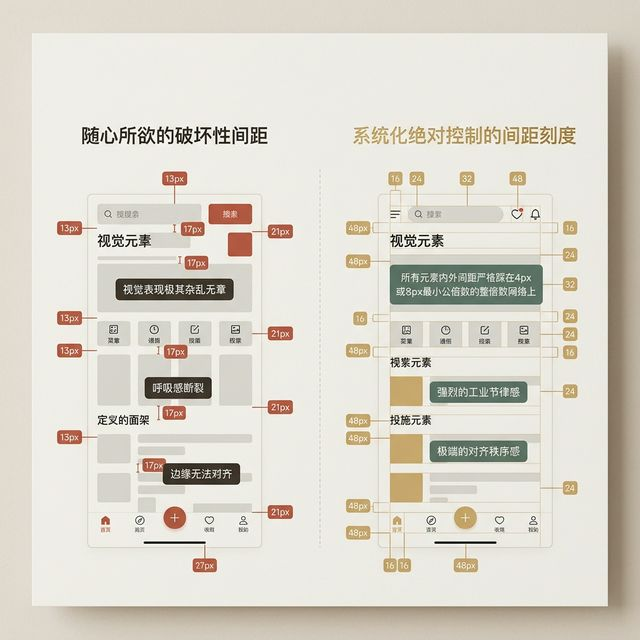
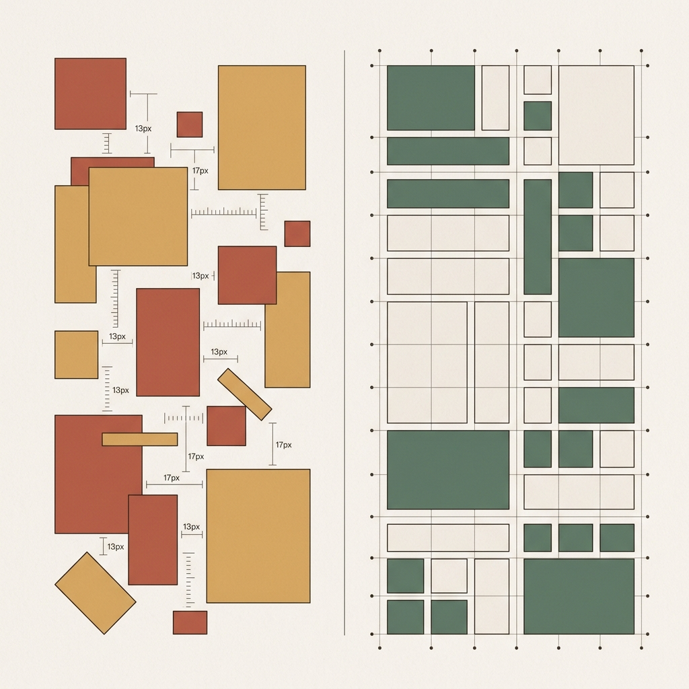
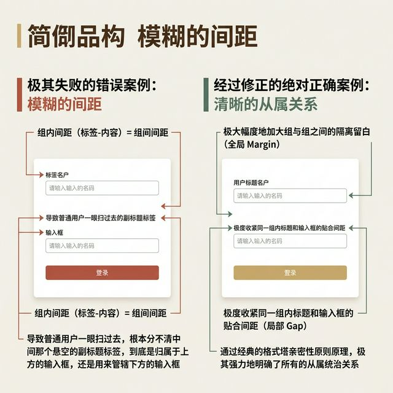
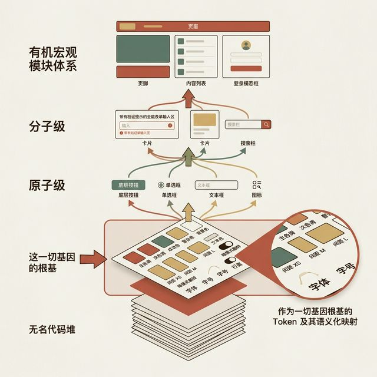
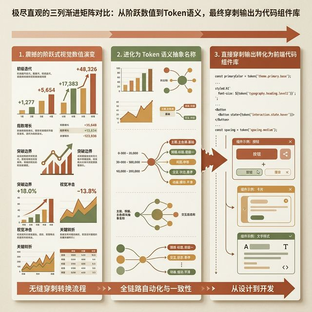
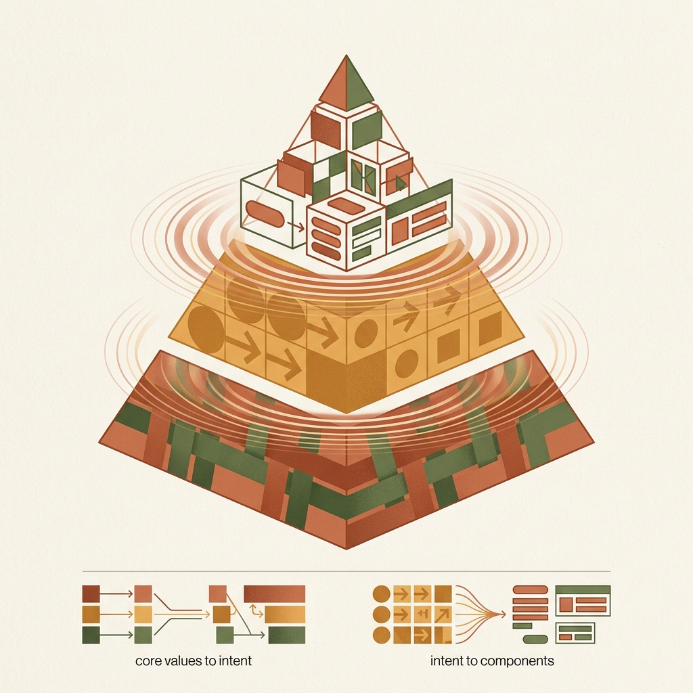
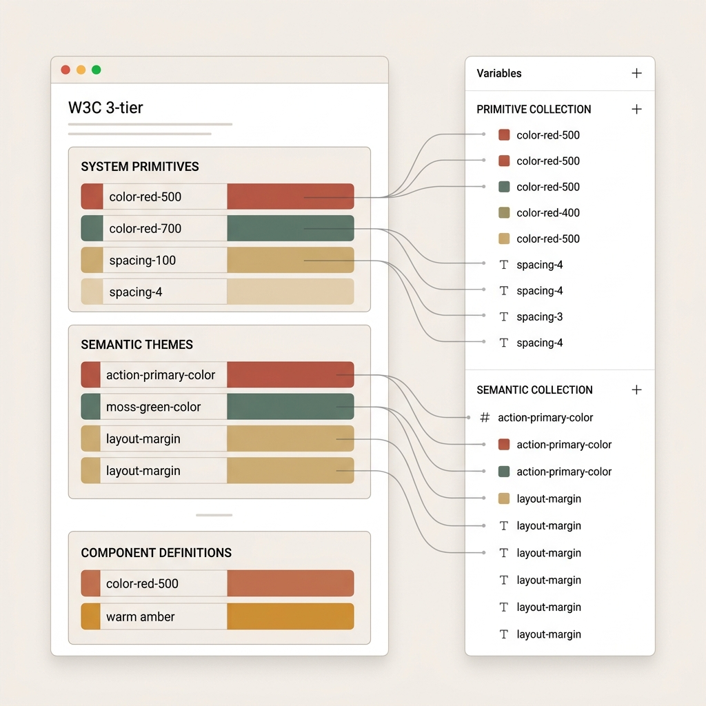
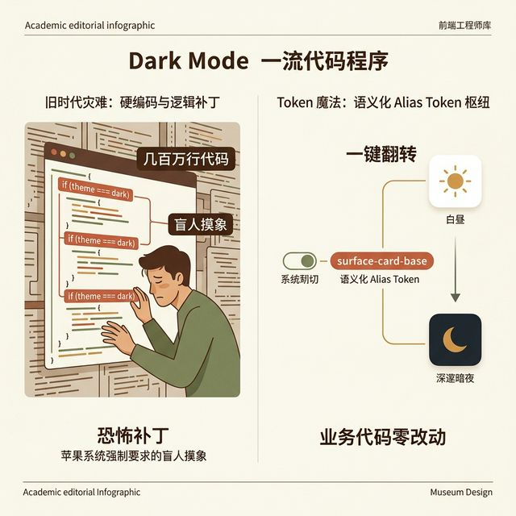

## 模块 5: 讲授(下) — 秩序的终局：间距刻度与Design Token (约 25 分钟)
<!-- BUDGET: 4500 chars | SLIDES: ≥9 | STATUS: done -->

> [TEACHING MOMENT]
> **核心理论库**
> - 引用节点: `book-refactoring-ui`, `refactoring-ui-layout-spacing`, `component-thinking-token-api`
> - 理论溯源: 亚当·瓦森 (Adam Wathan) 所著《Refactoring UI》中的非破坏性间距刻度机制；现代前端工程中的原子化设计体系与 Design Token 前沿语义标准。

### 5.1 间距刻度体系

> [VISUAL]
> **Slide**: M5-01
> **Layout**: `Comparison`
> **Text**: 间距排版策略实战对比
> **Scene**: 左右两套间距排版策略实战对比。左侧标注着"随意间距"：整个 UI 界面内充斥着毫无规律的 13px, 17px, 21px，视觉表现上显得杂乱无章。右侧标注着"系统化刻度"：所有的元素内外间距全都严格地踩在以 4px 或 8px 为最小公倍数的整倍数网络上，画面形成了一股工业节律感和对齐秩序感。
> **Search**: `spacing system scale 8px ui design consistency refactoring ui`
> **知识节点**: `refactoring-ui-layout-spacing`
> *   **Asset**: 

使用盒模型搭建完界面骨架后，必然面临一个细节拷问：盒子间的间距到底留多少？

过去排版时，很多设计师依赖「直觉」。觉得空了就往下拖，挤了就往上挪。结果 Figma 源文件中充斥着随机的间距数值。这种做法不仅导致视觉碎片化，更让下游的前端工程师陷入困境——因为前端难以对随机出现的 21px 进行系统级的变量复用。

> [PHILOSOPHY]
> 在《Refactoring UI》中，作者给出了一条铁律：**永远不要在 120px 和 125px 之间内耗，你必须建立一套"间距刻度体系（Spacing System Scale）"。**

> [TECH NOTE]
> **权威溯源：8点网格系统 (8-Point Grid System)**
> 这一体系最早由 Google Material Design 与 Apple HIG 等现代规范确立为行业标准。使用 8 作为基数，能完美适配现代跨设备响应式布局中 @1.5x、@2x 等屏幕缩放倍率，避免出现无法整除的小数像素。

> [VISUAL]
> **Slide**: M5-01a-grid
> **Layout**: `Image`
> **Text**: 8点网格像素对齐原理
> **Scene**: 4px/8px 网格在屏幕缩放下如何完美对齐物理像素的原理图解。展示在 @1.5x 和 @2x 缩放倍率下，8px 能够绝对纯粹地折算为 12px 和 16px 物理像素，不会产生亚像素模糊。
> **Source**: `Manual`
> *   **Asset**: 

你需要一把数字世界的游标卡尺。在现代交互设计中，业界确立了著名的**8点网格系统（8-Point Grid System）**，即采用以 **4px 或 8px** 为基准的倍数系统。为什么必须是 4 和 8？因为现代屏幕的物理像素密度（PPI）缩放通常是 1.5 倍、2 倍甚至 3 倍。如果基准是 5px，乘以 1.5 倍会产生 7.5px 的**亚像素（Sub-pixel）**，导致边缘模糊（**锯齿化**）。而 4 和 8 能在主流缩放倍率下保持绝对锐利的**物理边缘折算**。

> [CASE STUDY]
> **真实案例：失控的“1像素”与业界觉醒**
> 
> 早期移动端设计曾经历过一段缺乏规范的时期。当时一位硅谷设计师坚持在 UI 设计中使用以 5px 为基准的奇数间距系统（例如 15px），认为这能带来特殊的视觉张力。
> 
> 在高分辨率显示器上这看似完美，但当部署到缩放倍率为 1.5x 的中低端安卓机时，问题出现了。
> 
> 设计师设定的 15px 间距，在设备上需要渲染为 `15 * 1.5 = 22.5` 个物理像素。面对这 `0.5` 个无法被劈开的物理像素，渲染引擎只能被迫使用半透明的抗锯齿（Anti-aliasing）算法来“模拟”这半个像素的过渡。

> [VISUAL]
> **Slide**: M5-01b
> **Layout**: `Split`
> **Text**: 亚像素模糊现象
> **Scene**: 强烈的微距对比图（Macro shot）。左侧是高分屏上的 15px 奇数间距，边缘锐利；右侧是 1.5x 缩放倍率下的显示异常，15px 折算成 22.5 个物理像素，导致黑色线条边缘被迫呈现灰色的半透明抗锯齿像素块，显得毛糙模糊。
> **Keywords**: `sub-pixel rendering blur, anti-aliasing artifact, macro pixel grid, blurry UI edges, 1.5x scaling issue`
> **Source**: `AI_Gen`
> *   **Asset**: 

> [CASE STUDY] (接上文)
> 最终的结果是：界面上所有依靠 15px 间距对齐的细线条、文字边缘，全部出现了一层灰蒙蒙的模糊光晕。原本锐利精致的 UI 骨架，看起来就像是被拉伸的低分辨率图片。
> 
> 这场因为“亚像素模糊”引发的体验问题，导致该应用收到大量一星差评。
> 
> 痛定思痛后，行业推行了以 **8px 为基准的偶数网格系统**。在面对主流的 1.5x 缩放时，`8 * 1.5 = 12` 个物理像素，这是一个纯粹的整数；即使在极端缩放下，也能最大限度保证像素边缘对齐（Pixel-Perfect），确保了工业级的刻度规范。

基于此，行业衍生出了指数或线性递增的倍数链条：4 (微调), 8 (极紧), 12 (较紧), 16 (常规), 24 (较松), 32 (区块隔离), 直至 64 或 128 (巨屏留白)。

> [VISUAL]
> **Slide**: M5-01c
> **Layout**: `Image`
> **Text**: 间距刻度规范表
> **Scene**: 工业级排版刻度规范表。直观展示 4, 8, 12, 16, 24, 32 等间距阶梯，以及它们在 UI 骨架中的对应应用位置。
> **Source**: `Manual`
> *   **Asset**: 

有了这套**刻度网格**，你不再需要用方向键微调 2 像素。这也是为什么在刚才的 User Card 实践中，我们要求大家设定的 Gap 是 24px，Padding 是 32px，而不是随意的 23px 或 31px。这种数学约束不仅解放了决策算力，更让界面的空白产生统一的**视觉节律感（Rhythm）**，就像古典音乐中 4/4 拍的时间网格，让整个界面像交响乐一样精准协同。

### 5.2 消除歧义间距

> [VISUAL]
> **Slide**: M5-02
> **Layout**: `Comparison`
> **Text**: 消除歧义间距
> **Scene**: 清晰展示在复杂用户表单登录设计中有关"消除歧义间距"的经典正反案例大剖析。左侧的错误案例（其组内标签与内容的间距数值，和不同组块之间的上下间距完全相等），这就导致普通用户一眼扫过去，分不清中间那个悬空的副标题标签，到底是归属于上方的输入框，还是属于下方的输入框；右侧是经过修正的绝对正确案例，设计师通过加大组与组之间的隔离留白（全局 Margin），并且极度收紧同一组内标题和输入框的贴合间距（局部 Gap），通过经典的格式塔亲密性原则原理，明确了所有的从属统治关系。
> **Search**: `avoid ambiguous spacing form design proximity gestalt principle UI`
> **知识节点**: `refactoring-ui-layout-spacing`
> *   **Asset**: 

建立系统刻度，还能自动解决一个影响认知的核心排版问题——**歧义间距（Ambiguous Spacing）**。

当界面组件密集且缺少分割线时，间距是用户区分功能分组的唯一防线。看左侧的表单，中间的"送货备用家庭地址"标签，到底属于上方输入框，还是下方输入框？因为设计师将所有上下间距平均设定为 20px，导致视觉上的**从属关系**模糊不清。

大家回想一下刚才做 User Card 实践时，为什么操作指南里有一条红色的**避坑警告**——“切忌把所有元素扔进一个大框共享相同的全局 Gap”？因为如果头像、标题、正文和按钮共享同一个 24px 的 Gap，标题和正文的亲密关系就被打破了，这就会产生典型的**歧义间距**。所以你们必须先用 `Shift+A` 把标题和正文打成一个小包（小 Gap），再和外层打成一个大包（大 Gap）。

在右侧的表单重构方案中也是同样的道理：用 8px 这个极小的**组内距（Gap）**，让标题贴紧其所属的输入框；同时用 32px 这样的大倍数**隔离留白（Margin）**，拉开不同表单模块的距离。通过拉大视觉差距，原本充满歧义的关系瞬间变得不言自明。

请记住这个排版铁律：**具有从属关系的组内间距，必须远远小于互不干扰的组间间距。**这就是**格式塔亲密性原则**在 UI 空间中的直接应用。

> [ACTIVITY]
> *   **Type**: `Quiz`
> *   **Duration**: `2min`
> *   **Desc**: 应用亲密性原则排查歧义间距问题
> *   **Question**: 实习生小明正在设计一款外卖 APP 的订单详情页，其中包含「配送信息」卡片和下方的「商品明细」区块。在 UI 走查时，设计主管指出页面存在严重的「歧义间距」（Ambiguous Spacing）问题。根据格式塔亲密性原则，小明最有可能在排版时犯了以下哪种错误？
> *   **Options**:
>     *   A. 「配送信息」卡片内部的字段标题与文本的间距，等于该卡片与下方「商品明细」区块之间的留白间距
>     *   B. 将「配送信息」和「商品明细」两个独立区块之间的全局留白（Margin）设置得过大
>     *   C. 在「配送信息」卡片内部，使用了极小的组内距（Gap）来强制绑定骑手姓名与联系电话字段
>     *   D. 没有为「配送信息」卡片添加深色的实线边框，完全依靠间距留白来进行视觉上的模块分割
> *   **Answer**: A
> *   **Explain**: 选项 A 正确，根据本节讲授的排版铁律：“具有从属关系的组内间距，必须远远小于互不干扰的组间间距”。当内部间距等于外部间距时，视觉无法判断归属，产生歧义。选项 B 是正常的模块隔离操作；选项 C 正确应用了亲密性原则；选项 D 的“大留白无边框”是现代 UI 常见做法，不会直接导致歧义。

### 5.3 Design Token 层级

> [VISUAL]
> **Slide**: M5-03
> **Layout**: `Flow`
> **Text**: 原子设计与 Token 映射
> **List**: 
> - 设计令牌
> - 原子组件
> - 分子模块
> - 有机体系
> **Scene**: 展示 Brad Frost [Atomic Design 原子设计] 理论架构。从底层基础的 Design Tokens（色块参数、间距倍数），向上聚合成基础的 Atoms（原子级：如底层按钮），再组合为 Molecules（分子级：如表单输入区），最终组装为 Organisms（有机宏观模块体系）。画面高亮突出最底层的 Token。
> **Search**: `atomic design tokens semantic naming structure framework ui components`
> **知识节点**: `component-thinking-token-api`
> *   **Asset**: 

掌握了基于盒子的弹性布局与间距刻度后，为了让前端工程（特别是 AI 辅助生成工具）准确理解我们的设计意图，我们需要将这些散落的视觉属性封装起来，这就是现代 UI 工程的核心物料——**Design Token (设计标准令牌体系)**。

现代软件 UI 界面不再是喷枪画出来的画布，而是由标准化零件拼装而成的工业产品。在**原子设计 (Atomic Design)**方法论中，界面被拆分为原子、分子和有机体。但在原子内部，决定其外观的基因参数就是 Token。

> [VISUAL]
> **Slide**: M5-04
> **Layout**: `Grid`
> **Text**: Token 语义化映射
> **List**: 
> - 视觉硬值
> - 语义封装
> - 代码映射
> **Scene**: 三列渐进矩阵对比，展示数值进化为 Token 语义并转化为代码的过程：状态1提取吸色板蓝值 `#3B82F6` → Token 命名 `color-primary-500` → 前端类名 `bg-primary-500`；状态2背景白底层 `#FFFFFF` → Token `surface-card-base` → `bg-surface-card`；状态3圆角 12px → Token `radius-lg` → `rounded-lg`。
> **知识节点**: `component-thinking-token-api`
> *   **Asset**: 

> [STORY TIME]
> 大家刚才在写 User Card 时，是不是在 CSS 里直接敲下了 `background-color: #7b7b7b;` 和 `border-radius: 16px;`？这种直接写死数值的行为，在工程界被称为**硬编码 (Hardcode)**。
> 
> 现在想象一个常见的协作场景：团队用这种“硬编码”方式完成了 100 张界面的高保真原型后，业务方突然要求将主色调 `#3B82F6` 稍微调亮一点，或者把卡片圆角改为 24px。
> 
> 如果没有系统化的管理，你将面临逐一选中并修改几百个图层的繁琐工作。前端工程师同样要在代码库中查找替换大量的硬编码参数，极易出现漏改，导致界面风格表现不一致。

到底什么是 Token（令牌）？如果用白话来降维解释，它就像是一张张**“提货单”或“代金券”**。它将死板的视觉属性（比如具体的十六进制颜色值、间距像素），包装成一个拥有独立名字的**语义化变量**，用来彻底消灭硬编码。代码不需要记住复杂的色号，只需要拿着这批带有特定名字的“提货单”，去系统里提取对应的属性即可。

> [ACTIVITY]
> *   **Type**: `QA`
> *   **Duration**: `1min`
> *   **Desc**: Figma 变量联想
> 提问大家：回顾在 Figma 中使用的 Color Styles 或 Local Variables，当修改一个基础色时，所有引用该颜色的组件是否会瞬间同步更新？

> [TECH NOTE]
> **权威溯源：W3C 设计令牌规范 (Design Token)**
> 这一概念最初由 Salesforce 团队提出并落地，目前正由 **W3C 设计令牌社区组 (DTCG)** 推进为跨平台的通用 Web 标准，旨在彻底打通设计工具（如 Figma）与代码仓库（如 CSS/JSON）之间的机器可读协议。

在前端工程中，这种设计参数的「一处修改、多处同步」机制，被标准化为 Design Token。为了应对复杂的跨平台多主题适配，业界基于 W3C 标准草案制定了严密的**三层抽象架构（三明治法则）**：

> [VISUAL]
> **Slide**: M5-04b
> **Layout**: `Flow`
> **Text**: Token 三明治架构
> **List**: 
> - 全局变量
> - 意图别名
> - 组件专用
> **Scene**: 展示 W3C 标准推荐的 Design Token 三层架构。底层为基础的【Global Tokens (全局变量)】；中间层赋能语义，定义为【Alias Tokens (意图别名)】；最顶层为具体的【Component Specific Tokens (组件专用)】。
> **Search**: `design tokens three tier architecture global alias component specific w3c format`
> *   **Asset**: 

1. **Global Tokens（全局变量）**：类似于调色厂里最原始的**基础油漆桶**，上面贴着出厂成分表（如 `blue-500 = #3B82F6`）。它只负责客观存在，不管你怎么用。
2. **Alias Tokens（意图别名）**：类似于贴在油漆桶上的**用途标签**。它本身不存具体的颜料配方，只表达你的设计意图（如宣告这桶油漆被指定为**品牌主色**，即 `color-primary = blue-500`）。
3. **Component-specific Tokens（组件专用）**：类似于具体的**施工图纸指令**。它直接指挥前端的具体组件（如告诉施工队：登录按钮的底色 `button-bg` 就刷那桶贴了 `color-primary` 标签的油漆）。

通过建立这种**间接映射**，当我们需要改变主色调时，只需在底层修改 `blue-500` 的数值。整个产品的按钮、边框、文字高亮将在瞬间自动更新，无需改动上百张画板，更无需查阅业务代码。

> [CASE STUDY]
> **工业案例：IBM Carbon 的全局色值同步**
> 
> IBM Carbon 拥有全球上千条独立软件产品线。过去，若要将标志性的品牌蓝稍微调亮，将会面临极大的工程挑战。
> 
> 品牌部需要下发新的 Hex 色值，前端工程师必须在浩如烟海的代码仓库中执行“全局查找与替换”，极易产生遗漏或误改，整个品牌色升级往往耗时数月且容易出错。

> [VISUAL]
> **Slide**: M5-04b-2
> **Layout**: `Image`
> **Text**: 硬编码升级的混乱现场
> **Scene**: AI 隐喻图：海量设计师和前端工程师在堆积如山的旧代码和画板中，焦头烂额地手动查改颜色，四周散落着无数包含 Hex 色值的纸条。
> **Keywords**: `developers and designers overwhelmed, messy code, hex color codes everywhere, chaos`
> **Source**: `AI_Gen`
> *   **Asset**: 

> [CASE STUDY] (接上文)
> **但有了 Token 的三层架构后，情况彻底改变。**
> 
> IBM 的界面组件没有绑定绝对的色值代码。按钮底色绑定的是 `button-primary`（组件专用），它指向 `blue-60`（意图别名），最后在底层字典中映射为真实的物理色值 `#0F62FE`。
> 
> 当升级启动时，核心团队仅需在全局 Token 的 JSON 配置文件中，将 `blue-60: "#0F62FE"` 改写为 `#0050E6`。

> [VISUAL]
> **Slide**: M5-04c
> **Layout**: `Split`
> **Text**: 全局同步更新机制
> **Scene**: 一张工程联动图。左侧展示一个代码编辑器窗口，一行 JSON 配置文件中的 `#0F62FE` 正在被修改为 `#0050E6`；右侧呈现发散状的网络，连接着多个云端控制台和移动端 APP，这些终端在配置修改的瞬间亮起统一的新品牌蓝。
> **Keywords**: `JSON code editing, blue fiber optic nodes, UI synchronization, global dashboard update`
> **Source**: `AI_Gen`
> *   **Asset**: 

> [CASE STUDY] (接上文)
> 这版配置更新被推送到代码仓库。全球数千个产品线的构建流水线在下一次自动编译时，会自动拉取最新的 Token 字典。
> 
> **短短 48 小时内。**
> 全局界面组件自动完成了统一的新品牌色更新。前端工程师无需加班逐一修改页面代码，也避免了人工排查的时间成本。
> 
> 这就是 Token 的核心价值：**将视觉规范的调整，转化为可通过工程管线自动化同步的数据指令。**

> [ACTIVITY]
> *   **Type**: `Quiz`
> *   **Duration**: `2min`
> *   **Desc**: 运用三层架构策略进行全局色彩替换
> *   **Question**: 某生鲜 APP 的产品经理提出，要将界面中所有代表“促销”状态的橙色文本，统一替换为一种更亮眼的朱红色。在基于 W3C 标准的 Design Token 三明治架构中，前端团队执行此修改的最规范、最安全的路径是什么？
> *   **Options**:
>     *   A. 在 Global Tokens 层，查找所有值为旧橙色的底层物理色变量，并直接修改它们的十六进制数值
>     *   B. 在 Alias Tokens 层，将代表促销意图的 `color-promo` 变量重新指向新的朱红色底层变量
>     *   C. 在 Component-specific Tokens 层，逐一为所有的促销商品卡片和横幅创建全新的组件专属变量
>     *   D. 绕过三明治映射架构，直接在前端业务代码库中全局搜索原始的橙色色值并执行暴力的批量替换
> *   **Answer**: B
> *   **Explain**: 选项 B 正确，根据三层映射原则，Alias Tokens（意图别名）负责功能意图管理，修改它的指向可以确保所有绑定“促销”意图的组件同步更新。选项 A 错误，修改 Global 层会误伤系统中其他碰巧使用该橙色的无关元素（如某品牌 Logo）；选项 C 效率极其低下，违背了“一处修改，多处生效”的核心初衷；选项 D 属于硬编码灾难，极易造成遗漏并引发代码冲突。

### 5.4 暗黑模式与组件映射

> [VISUAL]
> **Slide**: M5-05
> **Layout**: `Comparison`
> **Text**: 深色模式切换原理
> **Scene**: 深色模式（Dark Mode）硬编码与 Token 架构的对比。左侧：复杂的 `if (theme === 'dark')` 逻辑分支；右侧：基于 `surface-card-base` 等语义化 Alias Token 的无缝主题切换机制。
> **Search**: `hardcoded dark mode vs semantic design tokens architecture seamless theme switching`
> **知识节点**: `component-thinking-token-api`
> *   **Asset**: 

> [CASE STUDY]
> **暗黑模式（Dark Mode）的硬编码陷阱**
> 
> 早期适配暗黑模式时，若缺乏架构规划，前端通常会在业务代码里硬编码逻辑分支：
> `if (isDarkMode) { background = "#000000"; color = "#FFFFFF"; }`
> 
> 这种做法极易遗漏冷门页面。当用户在全黑环境下遇到未适配的页面时，会被纯白底色瞬间刺激视觉，这导致了严重的体验问题——即“暗夜白屏眩光”。这正是技术债失控的表现。

> [VISUAL]
> **Slide**: M5-05b
> **Layout**: `Full`
> **Text**: 暗黑模式遗漏导致的白屏眩光
> **Scene**: 在全黑的卧室环境里，用户看着手机屏幕。手机屏幕四周是暗色调的 UI，但在正中央突然弹出了一个纯白底色的协议弹窗。白光照亮了用户的脸庞，引起视觉不适。
> **Keywords**: `dark room looking at phone, white screen glare on face, user squinting from bright light, dark mode UI bug`
> **Source**: `AI_Gen`
> *   **Asset**: 

> [CASE STUDY] (接上文)
> 引入 Token 的中间层架构后，UI 组件仅绑定 **Alias Token（意图别名）**（如 `surface-card-base`）。
> 
> **这就是间接映射层的优势。**
> 当系统切换到暗黑模式时，引擎自动将该 Token 对应的颜色由白色 `#FFFFFF` 切换为深灰色 `#1A202C`。组件本身不需要包含任何暗黑模式的判断逻辑。所有的界面都能随着系统主题，自动且无遗漏地完成样式切换，从而大幅降低了维护成本。

> [PHILOSOPHY]
> 计算机科学大师 David Wheeler 曾说："计算机科学中的任何问题，都可以通过引入一个**间接层（Indirection Layer）**来解决。"

回顾本模块内容：无论是运用**盒模型**约束自由画布、引入 Auto Layout 规则，还是架设 Token **间接映射层**，本质都是在构建高度解耦的系统基建。交互工程的精髓，就是将迭代的风险前置消化在底层的映射规则中。

在后续实验中，当大家使用 AI 前端生成工具（如 v0 或 Cursor）时，请避免使用绝对视觉指令（如"用那个蓝色"），因为这会产生难以维护的硬编码。相反，你需要将 Token 字典输入给 AI，并使用语义化约束："按钮背景引用 `bg-primary-500`，圆角锁定为 `radius-lg`"。

理解并掌握这种**接口映射规律**，你们产出的将不再是静态的视觉稿，而是高标准、可扩展的现代交互工程文件。

> [VISUAL]
> **Slide**: M5-05c
> **Layout**: `Image`
> **Text**: AI 生成与 Token 约束
> **Scene**: AI IDE (如 Cursor) 截图。展示在输入框中向 AI 下达带有 Token 约束的 Prompt：“生成一个商品卡片，按钮背景引用 `bg-primary-500`，圆角锁定为 `radius-lg`”，而 AI 生成的代码完美应用了这些语义变量而非绝对数值。
> **Source**: `Manual`
> *   **Asset**: 

---
