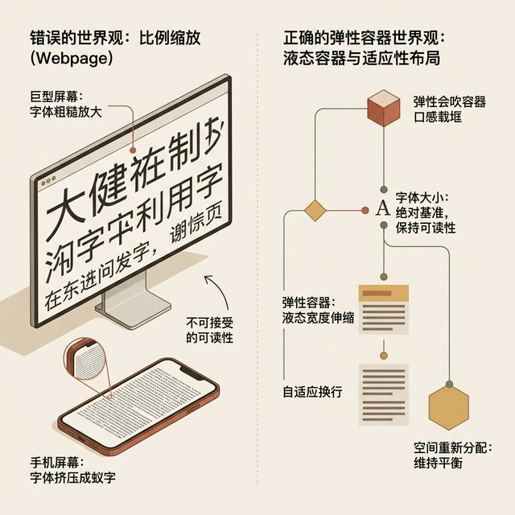

## 模块 6: 实践 — 严苛组件框架搭建 (约 80 分钟)
<!-- BUDGET: 0 chars | SLIDES: ≥0 | TYPE: activity | STATUS: exempt -->

> [VISUAL]
> **Slide**: M6-01
> **Layout**: `Grid`
> **Text**: 严苛骨架
> **List**:
> - 全容器化
> - 刻度纪律
> - 响应式测试
> **Scene**: 极具秩序感的 Figma 组件化界面搭建拆解，展现严苛的框架规则和约束。
> *   **Asset**: 

> [ACTIVITY]
> **Type**: `Practice`
> **Duration**: `80min`
> **Desc**: 实验2(Exp2) 实践：Figma 响应式组件框架搭建（用户卡片）
> **目标**: 基于《用户卡片 (User Card) 的双重构建》实践指南，完成从“画布思维”到“容器思维”的范式转换。
> **任务 1：Stage 1 画布思维的脆弱**
> 1. 在 Figma 中绝对禁止使用 Auto Layout，纯手工拖拽绘制用户卡片（头像、标题、正文、按钮）。
> 2. 在 VSCode 中使用纯绝对定位（`position: absolute`）还原 CSS，进行破坏测试（增加超长文本），观察重叠灾难。
> **任务 2：Stage 2 弹性纪元的秩序**
> 1. 在 Figma 中使用“由内向外”法则，通过 Auto Layout 重构卡片。
> 2. 建立 8点网格间距刻度，设置 Hug/Fill/Fixed 的响应式本能。
> 3. 在 VSCode 中使用 Flexbox 完美翻译，再次进行压力测试，观察弹性布局的优雅自适应。
> **交付物**:
> 1. Figma 源文件链接（包含 Stage 1 绝对定位版 和 Stage 2 Auto Layout 版）
> 2. HTML/CSS 代码压缩包（包含破坏测试截图与修复后截图）

---
