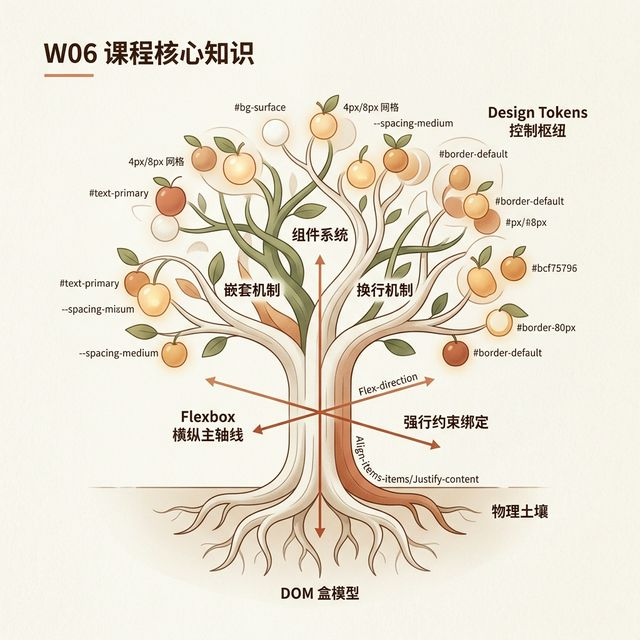
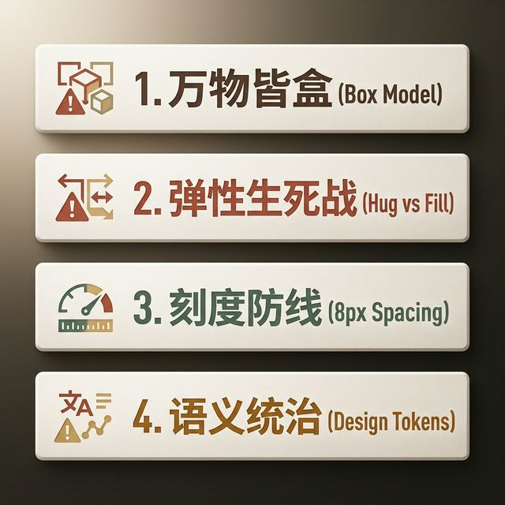
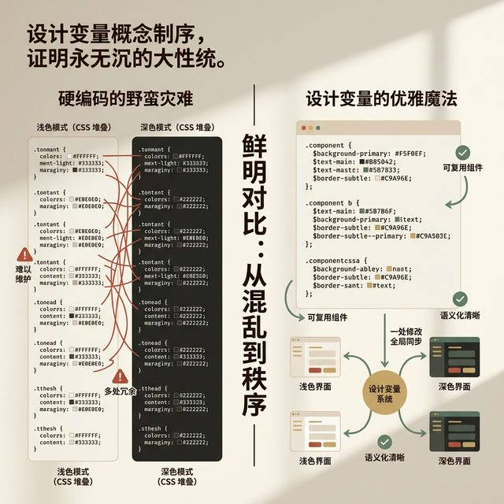

## 模块 7: 小结 — 容器工程化的心流纪律 (约 10 分钟)
<!-- BUDGET: 1800 chars | SLIDES: ≥4 | STATUS: done -->

> [VISUAL]
> **Slide**: M7-01
> **Layout**: `Flow`
> **Scene**: 整个 W06 课程的超高密度核心知识网络地图总结。一棵由底层向上生长的赛博朋克风格科技树：树根深扎在 `box-sizing: border-box` 的 DOM 盒模型物理土壤中；粗壮的树干是被强行约束绑定的 `Flexbox` 横纵主轴线；繁茂交织的枝桠则是通过 `Nesting` (嵌套) 机制与 `Wrap` (换行) 机制生长的巨大组件系统；而结出的那一颗颗闪烁着特定代号光点（如 `#bg-surface`, `4px/8px 网格`）的抽象果实，就是最终统治一切的 `Design Tokens` 控制枢纽。
> **Search**: `knowledge tree mind map UI engineering box model flexbox tokens conclusion`
> *   **Asset**: 

四个学时的漫长拉锯，还有整整 80 分钟极其枯燥且充满绝望报错提示的实战操作，各位，你们今天经历了一场思维层面的残酷外科手术洗礼。

我们在开课时说过，你们之前在画布上自由挥洒的那套心智模型，面对如同巨兽一般的现代软件工程流水线时，是极其脆弱不堪一击的。今天，我们亲手打碎了那层画板的滤镜，带大家看清了这个由光与电、像素与矩阵构筑起来的数字容器世界最底层的冰冷骨架。

让我们用最后十分钟，把这庞大的信息洪流重新凝练，印入你们作为交互设计师最深层的肌肉记忆之中。

> [VISUAL]
> **Slide**: M7-02
> **Layout**: `Split`
> **Scene**: 极简深色背景排版，四个刺眼的关键词像碑文一样逐行强势淡入（Fade In）：1. 万物皆盒 (Box Model)；2. 弹性生死战 (Hug vs Fill)；3. 刻度防线 (8px Spacing)；4. 语义统治 (Design Tokens)。每一个词条旁边都画了一个锋利的警示小图标。
> *   **Asset**: 

请牢牢记住这四道护城河法则：

**第一层防线：万物皆盒。**永远不要相信你眼睛看到的圆形或多边形，在浏览器的真实物理世界里，每一个元素都是带着四层洋葱皮（Content, Padding, Border, Margin）的绝对矩形。想要扩大热区？不要去无脑放大字体，去极其贪婪地增加你的内部缓冲海绵（Padding）避震器。

**第二层防线：弹性博弈。**当这些盒子被扔进同一个宏大宇宙时，你要像指挥千军万马的将军一样去调配权责。是让元素成为极度克制、无条件拥抱内部内容的 `Hug` 阵营？还是让它化身为充满野心、挤占一切周边空白生存空间的 `Fill` 怪兽？记住，绝大多数的响应式屏幕惨烈灾难断裂车祸，全部源于你在该用柔软的 Hug 时错用了固定死硬的 Fixed，或者在该用强横的 Fill 底座时忘记了开启 Wrap 换行保护网。

**第三层防线：刻度纪律。**抛弃你们过去引以为傲的所谓"设计师视觉眼感随心微调"。在拥有这套不可通融的、基于 4px 最小物理渲染像素对齐乘数的宏大数学间距刻度表之后，你们在界面上按下的每一次方向键，都必须是对大一统系统纪律的绝对服从。消除那些让用户抓狂的表单模糊间距，用巨大的 Margin 划清无关界限，用紧凑的 Gap 定义血亲从属关系。

**第四层防线：语义降维。**这是属于神之领域的架构特权。如果今天之后，谁还没有在 Figma 资产库中构建出哪怕最基本的三明治 Token 隔离体系，谁还在直接把极其业余的十六进制色号硬编码直接丢给后续工程链条或者是 AI 代码小球生成模块，那他就不配称自己正在做"交互产品设计"。掌握它，你就是那个制定宏大 API 规则蓝图的造物主。

> [VISUAL]
> **Slide**: M7-03
> **Layout**: `Split`
> **Scene**: 一张极其安静、极具禅意的黑白摄影照片：日本老剑客正在枯山水庭院中极其刻板地重复挥动木刀的枯燥基础动作，汗水湿透了后背。画面中央浮现出一句极具冲击力的现代哲学引言文本。
> **Search**: `zen discipline mastery philosophy minimalism quote architecture flow`
> **Quote**: "绝对的纪律，才是通向终极自由与创造心流的唯一通行密钥。" (Jocko Willink)
> *   **Asset**: 

> [PHILOSOPHY]
很多刚接触工程底层的学生，在经历了今天极其折磨人的嵌套报错、在面对极其繁琐的甚至要把全屏幕颜色清一遍并且重新做上变态极权映射命名之后，往往会陷入一种极度的委屈与痛苦。他们会跑来问我："老师，设计不应该是极其浪漫的、天马行空的、充满无限生命灵感的发散性艺术创造吗？我们为什么非要用这么多冰冷无情的工程卡地亚标尺、极其生硬死板的规矩去把自己死死锁在这重极高难度的镣铐之中？"

这是一个非常伟大且极其深刻的问题。
但我能给你们的唯一答案是：恰恰相反，在极其精密的现代数字工业体系下，**绝对的纪律，才是通向终极设计自由与创造心流的唯一通行密钥。**

当你不知道这些底层规则怎么运转的时候，你所谓的挥洒自如，只会换来每一次屏幕比例改变时的全盘崩溃，只会让你在开发阶段每天被满头大汗的工程师无休止地去反复追问："这个间距到底是对齐这里还是那里？"。你原本用在极具价值的商业体验闭环设计上的黄金精力，将会在这种毫无尊严、极其琐碎且不断扯皮发大水的补锅地狱里被彻底榨干蚕食。
而如果，你从一开始就在极深层地接纳并且完美拥抱、甚至主动主导控制了这套工程化的铁血戒律；当你极其熟练地运用 Auto Layout 像呼吸一样自然，当你的页面框架被强硬绑死在 Token 骨架上。那一刻，你将脱胎换骨。你再也不用去畏惧任何物理设备的挤压，你的所有设计将会坚如磐石！在这个极其坚固的容器堡垒内，你那被解放出来的疯狂想象力，才能不被打断、极其专注地全部倾注在真正去塑造能够直击用户灵魂核心深处的"体验"这件极度迷人的工作本身。

所以各位，请学着像拥抱爱人一样去拥抱这套看起来冰冷的规则枷锁吧。因为真正的高手，都是带着最粗重镣铐在进行最绝美惊艳的刀尖之舞！

> [VISUAL]
> **Slide**: M7-04
> **Layout**: `Center`
> **Scene**: 充满极度前瞻性与压迫感和宏大指引感的下一周高危悬念预告下集预告大字报。背景是黑暗中散发着冷光的错综复杂的电子架构数据管线，中央是一排深邃透亮的霓虹重型字体核心标语："The Visual System awakens. AI Assembly Line approaches." （视觉系统觉醒，AI流水线逼近）。
> **Search**: `cyberpunk UI system engineering dataline glowing typography preparation dark mode`
> *   **Asset**: 

**下周预告与课后死线：**

今天在这 80 分钟实战下课前，没有完整跑通极度抗压测试的那三套核心组件状态页面（Exp2产出物），请你们今天务必熬夜带走死磕，解决掉它！
为什么我给你们下达这么残忍的时间死线？
因为在下下周，我们将正式跨越到深水区！你们所亲手建立起来的这套被间距体系和底层映射 Token 重重加固保护好的纯素面原型钢筋骨架，即将迎来它生命中最极其残酷血腥的第二次试炼大检与绝美升华转折！
我们将带着它，直接对接接入那台最新工业化强力的 **AI 辅助生成流水线引擎大局**。如果你的底盘在没有打稳这套容器化基础的前提下，哪怕差一像素的松动，当强大的机器算力顺着你的脉络强势汹涌灌注附加上去的那一瞬间，整个架构就会被直接撕成凄惨的碎片！

回去打磨好你们的无敌底盘防线。下周，我们将在最完美的钢铁骨架上，揭开那一层属于现代视觉、属于高级产品光影艺术渲染权杖控制的——"界面与视觉设计系统（W07）"的新篇章风暴。

各位架构师们，下课！

> [VISUAL]
> **Slide**: M7-05
> **Layout**: `Full`
> **Scene**: 一张极具仪式感的终局升华全景巨幅大图。在幽暗的光影下，一幅包含了刚刚所有学过知识的——有着绝密嵌套的 Auto Layout 连线、带着精准计算的 8px 倍数间距刻度网格、以及散发着荧光色高亮的严密语义化 Token 定义参数的代码级组件设计图纸，正在被一双无形且巨大的手（象征着未来的机器算法或者开发系统环境），以前所未有的平滑无阻力姿态，像水流入大海一般被全盘接受和吸纳收编。没有撕裂，没有抗拒，只有完美的齿轮咬合与极其惊人的严密无阻流转契合。
> **Search**: `perfect engineering code gears precision design to code seamless integration workflow dark mode`
> *   **Asset**: 

在这个长达四个多小时的极其高强度的脑力激荡和残酷物理工程结构观念重塑的思维洗礼课程接近尾声的时候，当你们看着屏幕上或者画板里，那些刚刚从你们手下经历过无数次崩溃断裂、但最终却被极其严厉的盒模型纪律、极其包容且韧性的 Auto Layout 弹性法则系统，以及不可违背违抗的工业标准级间距网格刻度所彻底降服和驯化了的——并且完美跑通了各种极端屏幕暴力拉扯测试而依然能够保持绝美身姿且坚如磐石的组件框架体系框架矩阵时。我想，各位此时此刻的内心应该对"规则机制"这两个字，已经产生了一种绝非以往的、刻骨且深入骨髓的认知级敬畏感和掌控自豪感了。

> [VISUAL]
> **Slide**: M7-06
> **Layout**: `Split`
> **Scene**: 以极致黑色背景作为底版映衬，白色的极致极简衬线字体在屏幕巨大显示。极具压迫感但又让人深省反思。
> **Quote**: "只有在绝对无情的限制和秩序容器里，你的设计才真正获得了在这浩瀚数字宇宙里自由呼吸生存的终极特权。"
> *   **Asset**: 

工程化，绝对不是为了把艺术扼杀或者套上枷锁锁死在牢笼里。
相反地，容器工程与极其死板的绝对控制机制，是为了给你们脑海中那些脆弱且敏感娇嫩的美丽产品架构理念，打造一层最坚不可摧和能够防御任何不确定性风暴的坚固装甲地基外壳。
当你把画布上散乱的元素装进盒子，当你让盒子学会像水库里的水流一般收放自如地进行弹性折叠与自我保护，当你用 Token 系统替代了混乱无法解释的十六进制暗语时，你就亲手搭建了一座桥梁。这座桥，连接了感性的心理愿景，与极其冷峻的工程实施底层模型深渊。

这是一种带着强烈工业美感的心流纪律。
每一次向着底层技术本质规则的残酷妥协低头，换回来的，都将会是在接下来的 AI 生成无界浪潮、以及前端真实构建的巨大汪洋波浪里的一次从无到有的重生蜕变式的伟大反击升华！

下一周，在这套绝对规则化容器的坚固地基基础上，我们将在此之上进行视觉重构的第一道美学质变突破！下课！
人们已经在洞穴壁。好的。
