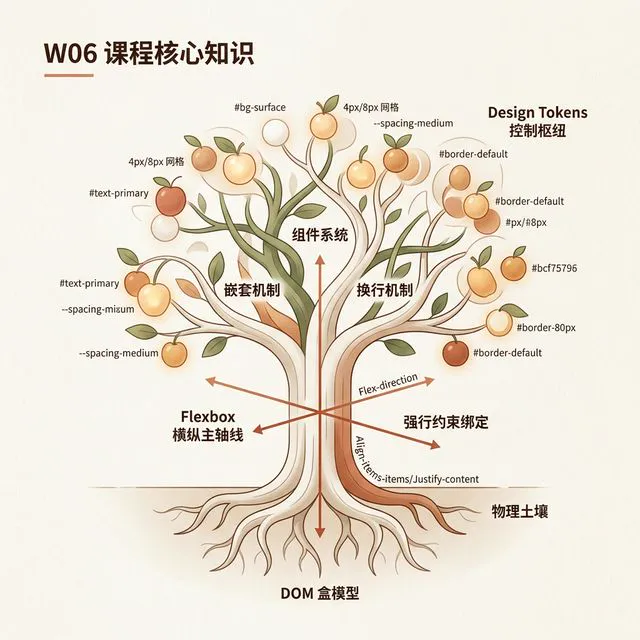
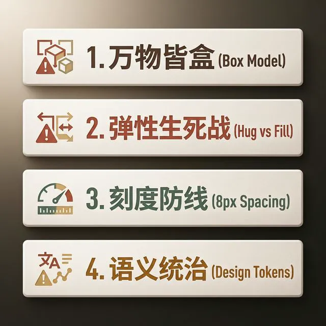
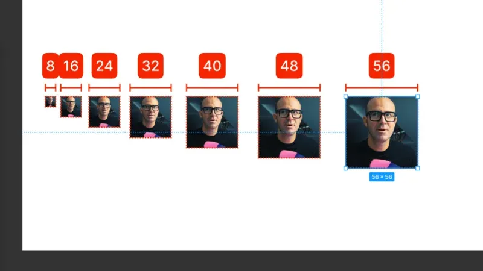
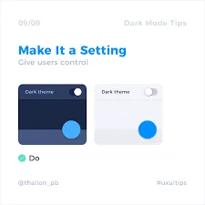

## 模块 7: 小结 — 容器工程化的心流纪律 (约 10 分钟)
<!-- BUDGET: 1800 chars | SLIDES: ≥4 | STATUS: done -->

### 7.1 知识树复盘

> [VISUAL]
> **Slide**: M7-01
> **Layout**: `Center`
> **Text**: 知识网络地图总结
> **Scene**: 现代 UI 工程的集装箱货运系统（隐喻信息图）：底层是整齐排列的标准集装箱（Box Model）；中间是贯穿画面的运输滑轨（Flexbox）与打包吊臂（Nesting）；顶端是闪烁着代码指令的中央调度大屏（Design Tokens）。
> **Search**: `shipping container logistics system UI engineering box model flexbox tokens conclusion metaphor`
> *   **Asset**: 

> [TEACHING MOMENT]
> 🧊 **容器法则**: 基于自由画板的心智模型，在现代软件工程中难以落地。这就像在甲板上散装堆放的货物，遇到跨平台适配的“风浪”瞬间就会散架。**所谓容器工程化，就是用“集装箱”的绝对规范，取代散装的自由**，让设计在任何屏幕下都能稳固存活。

在这 80 分钟的实战里，你们亲眼目睹了那张纯手工拖拽的“用户卡片”，是如何因为仅仅增加了一段超长的个人签名，就发生排版雪崩的。当你不得不因为文字溢出，去手动把下面所有的按钮、图标一像素一像素往下挪时——那种深深的无力感和烦躁，就是“画布思维”在工程现实面前的彻底破产。

今天，我们要彻底碾碎这种脆弱的自由画板滤镜，在你们脑海中建立了一套**现代 UI 工程的集装箱货运系统**。

它的根基深扎于“万物皆盒”的**标准集装箱尺寸**中；它的主干是 `Flexbox` 打造的**标准化装卸滑轨**；通过 Auto Layout 组件嵌套，它将小盒子打包成稳固的**大集装箱**；而最后，`Design Tokens` 则如同这套物流系统的**中央调度中枢**，用一套标准指令控制着所有的视觉果实。

让我们用最后十分钟，把刚才你们在痛苦的破坏测试中换来的认知，重新凝练为确保设计存活的四大法则。

### 7.2 四道工程防线

> [VISUAL]
> **Slide**: M7-02
> **Layout**: `Split`
> **List**:
> - 万物皆盒
> - 弹性博弈
> - 刻度纪律
> - 语义控制
> **Text**: 四道工程防线法则
> **Scene**: 极简深色背景排版，四个关键词逐行淡入：1. 万物皆盒 (Box Model)；2. 弹性博弈 (Hug vs Fill)；3. 刻度纪律 (8px Spacing)；4. 语义控制 (Design Tokens)。每一个词条旁边都画了一个警示小图标。
> *   **Asset**: 

请牢牢记住这四条确保设计存活的工程防线（我们也可以把它们看作是确保集装箱平稳运输的四条安检纪律）：

**第一层防线：万物皆盒（标准容器）。**在真实的物理世界里，每一个元素都是带着四层洋葱皮（Content, Padding, Border, Margin）的绝对矩形。就像刚才的用户卡片，不要企图用画布上的(X,Y)绝对坐标去控制位置。扩大热区？不要随意放大字体，去增加**内部缓冲海绵（Padding）**，就像给易碎货物塞满防撞泡沫。

**第二层防线：弹性博弈（装载逻辑）。**当这些盒子被放入同一个容器（大集装箱）时，你需要调配权责。是让元素成为拥抱内容的 `Hug` 阵营（就像**紧紧包裹货物的保鲜膜**），还是化身挤占剩余空间的 `Fill` 阵营（就像**自动膨胀撑满集装箱缝隙的填缝剂**）？记住，刚才压力测试中发生的文本重叠灾难，绝大多数的**响应式错位**，都源于不当地使用了 `Fixed`（固定尺寸），或者忘记了开启 `Wrap` 自动换行。

> [VISUAL]
> **Slide**: M7-02b
> **Layout**: `Center`
> **Text**: 刻度纪律
> **Scene**: 表现 4px/8px 数学间距的排版隐喻图（Pedagogical 信息图风格），展示巨大 Margin 与紧凑 Gap 的空间秩序感。
> **Keywords**: `8-point grid, UI spacing system, mathematical layout, margin and gap, structural order`
> **Source**: `AI_Gen`
> *   **Asset**: 

**第三层防线：刻度纪律（标准卡槽）。**抛弃所谓的"视觉微调"和凭感觉对齐。在拥有这套基于 4px 或 8px 的**数学间距刻度表**之后，每一次排版都必须服从系统纪律。就像码头上的集装箱必须卡入标准的卡槽，用巨大的 Margin 划清无关界限，用紧凑的 Gap 定义内部元素的**亲密从属关系**。

> [VISUAL]
> **Slide**: M7-02c
> **Layout**: `Center`
> **Text**: 语义控制
> **Scene**: Figma Design Tokens 面板的真实截图，对比右侧十六进制硬编码的代码段，凸显语义化变量的威力。
> **Source**: `External`
> *   **Asset**: 

**第四层防线：语义控制（调度指令）。**这是架构级别的控制力。如果在 Figma 资产库中没有构建出 **Token 隔离体系**（即把颜色、间距等硬指标，抽离为拥有独立意义的语义变量，比如“主警告色”而不是“#FF0000”），而是将十六进制色号硬编码交付给开发阶段，就无法支撑起现代软件的复杂迭代。掌握它，你将能更好地制定 **UI 规则蓝图**。

趁热打铁，让我们用一个真实的实战场景，检验一下大家是否真正把这四道防线法则刻入了潜意识。

> [ACTIVITY]
> *   **Type**: `Quiz`
> *   **Duration**: `2min`
> *   **Desc**: 架构师的代码审查
> *   **Q**: 实习生小明在设计商品卡片时，为了拉开"商品标题"与"价格"的距离，他直接给价格文本增加了一个独立的顶部外边距（Margin-Top）。基于"容器思维"法则，他应该采用哪种更具工程纪律的做法？
> *   **Options**: A. 保持独立外边距，但将数值严格修改为 8px 的倍数 | B. 将两者包裹在父级 Auto Layout 容器中，用 Gap 统管间距 | C. 取消间距，将价格元素的尺寸模式改为 Hug 拥抱内容 | D. 扩大价格盒子的 Padding 内部缓冲海绵，将上面的标题挤开
> *   **Answer**: B
> *   **Explain**: 参见"刻度纪律"与"弹性博弈"防线。紧凑的子元素应通过父级容器的 `Gap` 定义亲密从属关系。给单一元素加独立 Margin 会打破系统一致性，属于脱离系统的独立修改。选项 A 治标不治本；选项 C 的 Hug 解决的是自身尺寸而非兄弟元素间距；选项 D 的 Padding 是向内缓冲，不能用来推开外部元素。

好，时间到！我看到后台数据，有不少同学依然凭借直觉选了其他选项。给单一元素加 Margin 这种脱离系统控制的行为，依然是画布思维的残余。这其实反映出一个更底层的认知冲突，正是我想在今天课末跟你们探讨的。

> [CASE STUDY]
> **真实案例：缺乏容器纪律的重构代价**
> 
> 刚才在实战中，一张用户卡片的错位顶多让你烦躁 5 分钟。但如果把这种缺乏纪律的画布思维放大到成百上千个页面的企业级项目呢？
> 
> 2018 年某生鲜电商平台进行大屏适配时，由于早期上千张 UI 画板全部采用绝对定位和固定数值（缺乏“弹性博弈”与“刻度纪律”），导致新版在折叠屏上出现了严重的图片拉伸与按钮错位。

> [VISUAL]
> **Slide**: M7-02d
> **Layout**: `Image`
> **Text**: 缺乏容器纪律的错位崩溃
> **Scene**: 一张夸张的 UI 界面在平板上错位、拉伸、断裂的概念示意图，表现折叠屏展开瞬间界面失控的灾难状态。
> **Keywords**: `broken UI layout, text overflowing container, misplaced buttons, disaster, stretched images on tablet`
> **Source**: `AI_Gen`
> *   **Asset**: 

> [CASE STUDY] (接上文)
> 为修复这一底层架构缺陷，该团队被迫停滞新业务半年，重新从头建立组件容器和 Token 体系。这说明了工程规范对现代产品迭代的决定性作用。

### 7.3 纪律即自由

> [VISUAL]
> **Slide**: M7-03
> **Layout**: `Split`
> **Text**: 规范与自由
> **Scene**: 黑白摄影照片：工匠正在枯山水庭院中重复基础动作。画面中央浮现出引言文本。
> **Search**: `zen discipline mastery philosophy minimalism quote architecture flow`
> **Quote**: "系统的规范，才是通向最终设计自由的保障。"
> *   **Asset**: 

> [PHILOSOPHY]
> 很多刚接触工程底层的学生，在经历了嵌套报错、重新梳理严格映射命名后，可能会产生疑问："设计不应该是充满灵感的艺术创造吗？为什么非要用工程标尺约束自己？"

在现代数字工业体系下，**系统的规范，才是实现设计自由的基础。**

当你缺乏底层规则支撑时，随意的设计往往会在屏幕比例改变时发生错位，并在交付时引发频繁的返工。你原本应该用在**探索高级动效与创新交互**上的精力，将会在无休止的**像素修补**中被消耗。

而如果你从一开始就接纳这套**工程规范**，熟练运用 Auto Layout，将页面框架与 Token 绑定。你将能构建出稳定可靠的界面框架，即便面对多尺寸设备的自适应也能游刃有余。在这种坚固的**底层结构**保障下，你的想象力才能专注倾注在塑造**核心用户体验**上。

### 7.4 任务预告

> [VISUAL]
> **Slide**: M7-04
> **Layout**: `Center`
> **Text**: 对接 AI 辅助流水线
> **Scene**: 下集预告。背景是错综复杂的数据管线与组件结构，中央是字体核心标语："The Visual System awakens." （视觉系统觉醒）。
> **Search**: `UI system engineering dataline glowing typography preparation dark mode`
> *   **Asset**: 

今天下课前，没有完整跑通**用户卡片破坏与重构测试**的同学，请务必解决它。

为什么要在今天完成？因为下周我们将跨入新阶段。你们建立的这套通过间距和 Auto Layout 规范的**原型架构**，即将迎来新的应用。

我们将直接对接 **AI 辅助生成流水线**。如果你的底盘没有打稳，任何底层架构的松动，都会在 AI 批量生成时放大，导致大规模的界面错位。

请巩固好你们的**底层基础**。下周，我们将在此之上，探索现代**视觉系统**的构建模式。

各位架构师，下课！
