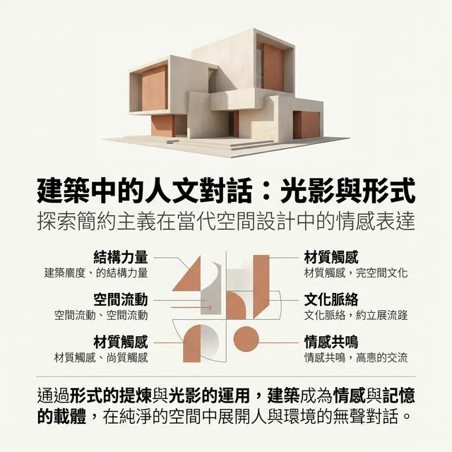

# W07 视觉重构：层级与色彩

> [VISUAL]
> **Slide**: "第一印象"
> **Layout**: `Center`
> **Scene**: 黑色背景，中间浮现一行极细的灰色文字“设计不在于添加，而在于凸显”，然后瞬间切换为对比强烈的黑白粗细排版，视觉冲击力强。
> **知识节点**: `refactoring-ui-hierarchy`
> *   **Asset**: 

同学们好，欢迎进入第七周的课程。

[PHILOSOPHY]
在之前的课程里，我们把精力放在了“骨架”和“骨肉”上。我们整理了逻辑流，砍掉了多余的“附加税”，画出了高保真线框图。但当你们把线框图交给用户时，他们可能会说：“看起来有点干瘪”或者“不够专业”。
这是因为，优秀的骨架还需要**视觉层级**的赋能。在这个阶段，设计不在于你添加了多少装饰，而在于你如何**控制用户的注意力**。

今天，我们将从“直觉式”和“战术级”的角度，重构界面的视觉层级与色彩系统。

---
