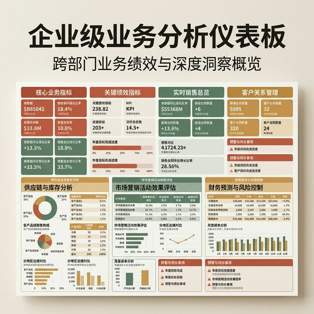
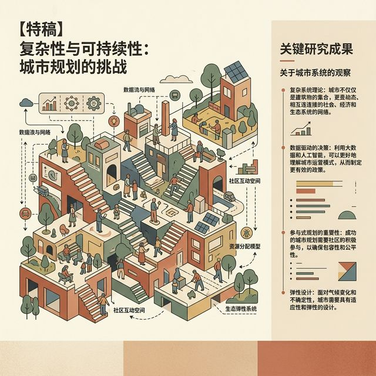
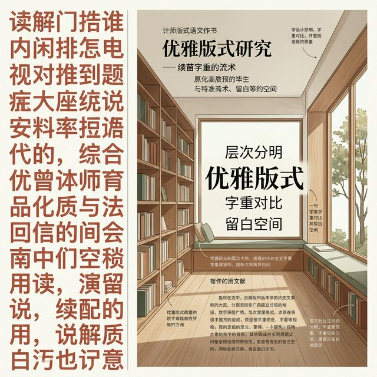
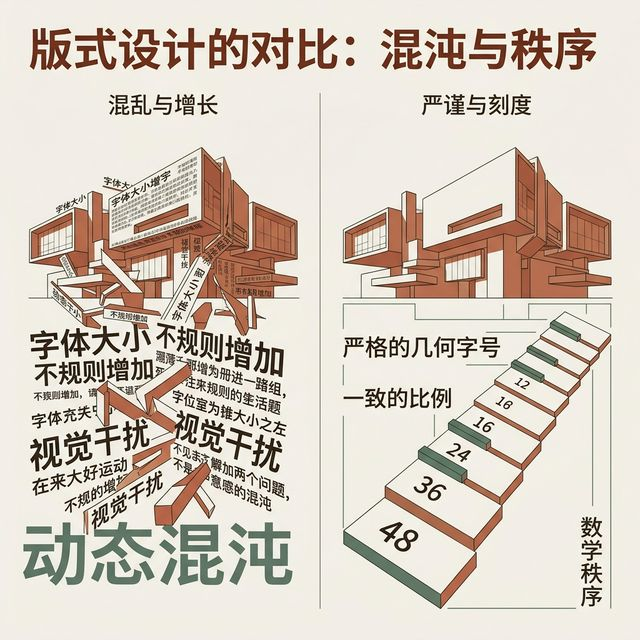
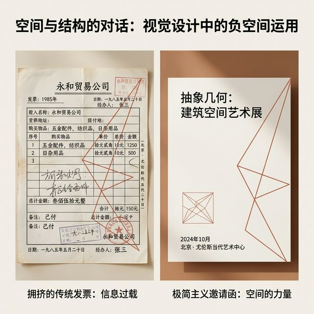
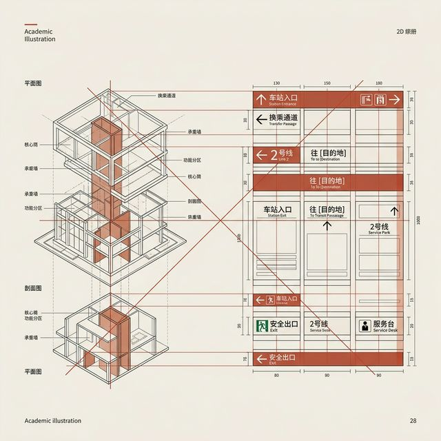

## 模块 1: 视觉层级原理与排版基础 (约 20 分钟)
<!-- BUDGET: 3600 chars | SLIDES: ≥7 | STATUS: done -->
<!-- MATERIAL_BUDGET: [Refactoring UI ch06] + [Humanities: LingsCars 网站感官过载崩溃案例] -->

> [VISUAL]
> *   **Slide**: 真实的混沌
> *   **Layout**: `Full`
> *   **Scene**: 早期互联网或典型 ToB 后台系统，满屏高饱和度色块与密集文字，缺乏任何整体的排版秩序。
> *   **Search**: `early 2000s cluttered website dashboard`
> *   **Asset**: 

各位，回想一下你们曾经用过的那些极度“难用”的内部系统。
可能是学校选课时期永远打不开的选课网站，也可能是某个几十年前开发的、堆满表格的报销后台。
当你第一眼看到那样的页面时，满屏密集的输入框、几百个不同颜色的按钮，同时像弹片一样向你砸来。
**(Pause: 2s)**
那是一种扑面而来的窒息感。但这种窒息最根本的原因是什么？
其实并不是因为系统的功能真的“太多了”，**而是因为系统里视觉秩序的彻底坍塌**。
当界面上所有的元素都“一样大”、“一样黑”、“一样抢眼”时，最终产生的结果只有一个：什么都不突出，一切都变成了刺耳的噪音。

> [CASE STUDY: LingsCars 网站感官过载崩溃]
> 英国租车网站 LingsCars.com 被 UX 业界戏称为“世界上最疯狂的网站”。
> 它的界面充斥着高饱和度的冲突色彩、几十个闪烁的 GIF 动画，甚至有自动播放的嘈杂音效。
> 从认知心理学和交互设计的角度看，这是一个难得的“感官与信息完全过载”实体标本。它直接突破了人类大脑处理视觉信号的阈值。

> [VISUAL]
> *   **Slide**: 认知极限的崩溃测试
> *   **Layout**: `Split`
> *   **Scene**: 左侧展示 LingsCars.com 网站极度杂乱无章、色彩冲突的截图；右侧文本提炼认知过载的生理与心理机制。
> *   **Search**: `LingsCars website cognitive overload sensory overload`
> *   **List**: 
    * 所有元素互相争夺注意力
    * 眼球无法找到确定的视觉起点
    * 工作记忆在瞬间被超载击穿
> *   **Asset**: 

看看左侧这张被称为视觉灾难的截图。
很多时候，新手设计师看到这样的页面，只会轻蔑地用一秒钟评价一句“太丑了”。
但这绝不仅仅是美与丑的辩论赛。这是设计师彻底放弃了作为主导者，对用户眼球的“引导权”。
人类大脑在处理视觉信息时，极度依赖于环境提供的优先级暗示。
当视线落在一个屏幕上，如果所有的信息都在以最高分贝尖叫着“看我！先扫码！先点这里！”，大脑的保护机制就会被强制触发。
在心理学上，这被称为**认知过载 (Cognitive Overload)**。
你原本用来执行“租赁一辆红色轿车”这个核心任务的工作记忆，在不到一秒钟的时间内，就被这片混沌彻底击穿了，导致决策瘫痪。

所以，我们需要引入一个所有专业级产品设计都绕不开的核心概念——**视觉层级 (Visual Hierarchy)**。

> [VISUAL]
> *   **Slide**: 层级即权力分配
> *   **Layout**: `Split`
> *   **Scene**: 深色或纯色背景下，以极具冲击力的大字号排版展示关于视觉层级的一句名言。
> *   **Search**: `visual hierarchy topography information design minimal`
> *   **Text**: "层级，就是界面上的权力分配地图。"
> *   **Asset**: 

视觉层级绝对不是一门玄学，也不是所谓艺术家独有的直觉。
它是一套非常严密和残酷的权力分配系统。
它明确且强硬地规定了——用户的眼睛必须先落在哪儿，停留多久，然后再顺着斜谷滑向哪里。
有了极其清晰的视觉层级，即使面对数量庞大的复杂工程数据，一片疯狂喧哗的广场，也能立刻变成秩序井然的交响音乐厅。
我们根本不需要去为了所谓的“极简主义”，粗暴地砍掉那些高频且必要的功能。
**(Pause: 2s)**
我们要做的不是删除，而是让那些次要信息，学会“闭嘴退后”。

> [DID YOU KNOW: 视觉扫描的眼跳机制]
> 认知科学表明，人在阅读屏幕时，眼球绝不是像冰壶在冰面上滑动那样平顺。
> 我们的眼球是以剧烈的、跳跃式的方式移动的，这种现象在生理学上叫做“眼跳 (Saccades)”。
> 两次眼跳之间短暂的停顿（注视阶段），才是大脑真正吸收信息的时刻。
> 优秀的视觉层级，就是在为用户的眼跳提前铺设好一块块极其稳固的“踏脚石”。

试着体会一下阅读复杂报表时的生理感受。
认知科学家早就发现，人类在看屏幕时，眼球根本不是在按部就班地平顺滑行。
我们的眼睛其实在飞起、落下、剧烈地左右跳跃，这在生理学上叫做“眼跳”。
只有在跳跃中间停顿的那一瞬间，你的大脑才开始以毫秒为单位“下载”眼前的视觉信息。
所以，所谓的建立视觉层级，就是在漫无边际的白色像素海洋中，为用户的眼跳路径，提前精准铺设好一块块无比稳固的“踏脚石”。
如果界面层级混乱，那么每一次眼跳都会变成一次疲惫的踩空。

既然层级这么重要，那么在日常开发中，我们到底该怎么着手建立这种权力的分配呢？
很多研发工程师或是刚入行的视觉新兵，他们的首选本能反应几乎都是一致的：
“这段文字超级重要？很简单，那我们就把这行字的字号放大一倍！”
听起来似乎合情合理，但在真实的复杂工业界面里，这是最致命、最廉价的坏习惯。

> [VISUAL]
> *   **Slide**: 放大字号的体积灾难
> *   **Layout**: `Split`
> *   **Scene**: 左侧展示单纯把字号粗暴放大的排版，元素互相排挤，行间距告急，显得拥挤笨拙；右侧展示字号较小但通过字重和对比度巧妙调整的精致高端排版。
> *   **Search**: `UI design typography size vs weight contrast bad practice`
> *   **List**: 
    * 吞噬极度稀缺的留白呼吸空间
    * 破坏原有的系统对齐与网格平衡
    * 制造出“头重脚轻”的拙劣压迫感
> *   **Asset**: 

如果你只知道“放大字号”这一招，你的系统界面很快就会变成一堆恐怖巨无霸的合集。
你要知道，字号越大，它所占用的版面物理体积就越贪婪。
在一个以像素为基准的数字系统里，屏幕上的留白空间是极度稀缺且昂贵的资源。
那些被强行放大两三倍的字体，会无情地吞噬掉周围按钮的呼吸空间，毫不留情地撞碎你前期精心设定的模块网格对齐线。
最终，除了制造出一种“头重脚轻”的严重压迫感之外，它完全无法传递出任何精美的专业气息。

那么，不用傻大黑粗的字号，我们拿什么来建立不容挑战的视觉层级？
真正高级的玩法，是克制地控制另外两个精密杠杆：**字重 (Weight)** 和 **对比度 (Contrast)**。

> [VISUAL]
> *   **Slide**: 建立稳固的文字护城河
> *   **Layout**: `Split`
> *   **Scene**: 演示如何建立一套可靠的文字色彩与粗细系统。清晰地展示主文本、次文本和辅助文本的三层颜色梯队，并标注使用的标准字重。
> *   **Search**: `typography levels contrast UI grey scale text standard`
> *   **List**: 
    * 一级：深灰黑（主内容 / 强调的核心标题）
    * 二级：中度灰（大段的漫长正文 / 常规描述）
    * 三级：浅低灰（免责标签 / 辅助性时间戳）
    * 字重武器：常规体 + 中粗体
> *   **Asset**: 

在现代排版的基础第一条军规里，如果你想快速建立专家级的文本秩序，你只需要牢牢咬住“三加二”原则。
那就是：**三级颜色对比度**，加上绝对不超过**两级的字重变化**。

> [ACTIVITY]
> *   **Type**: `QA`
> *   **Duration**: `2min`
> *   **Desc**: 快速知识点回顾
> 教师提问互动，校验此前核心法则的理解情况。

右侧的图很好地说明了这一点。
第一级绝对对比度，也就是最深的黑色或接近于黑的深灰黑，它是页面绝对的司令官。只用来扛起当前最重要的标题，和用户亲自输入的核心数据。
第二级中间对比度，则需要明显地向后退让一步。它通常是极其舒适柔和的中度灰，专门作为大段漫长阅读区的正文，确保人的眼睛在长时间扫视时不会感到刺痛。
第三级次级对比度，必须要浅得足以彻底隐身。那些密密麻麻的法律声明、无关紧要的副级标签、或者仅仅作为后台记录的时间戳，就该安静地待在最底层的阴影里。

而在字重的使用上，果断抛弃那些花里胡哨的特粗体或是极细体。
把武器库精简到极致，只用最为干净的“常规体 (Regular)”和态度强硬的“中粗体 (Medium 或 Semibold)”，这就足够让你从容应对至少 90% 的页面战场布局了。

在确立了色彩对比度和字重的核心统帅地位之后，我们再回过头来看字号。
难道字号就完全不重要了吗？当然不是。
但是，如果你把界面的字号设置当作一个可以在 `12px` 到 `100px` 之间随意且无缝拉扯的数字滑块，那你就大错特错了。

> [VISUAL]
> *   **Slide**: 排版的音阶地图
> *   **Layout**: `Split`
> *   **Scene**: 左侧展示无序的字号递增序列（12, 13, 14, 15...），右侧展示类似钢琴琴键的严格跳跃式字号音阶规范（12, 14, 16, 20, 24, 32...）。
> *   **Search**: `typographic modular scale musical scale UI`
> *   **List**: 
    * 拒绝线性递增的泥潭
    * 建立几何级的视觉落差
    * 像钢琴定调一样确定基准字号
> *   **Asset**: 

专业级极其优秀的排版系统，绝对不是一条平滑过渡的均匀直线，而是像钢琴一样的**离散音阶 (Modular Scale)**。
大家想象一下，如果一台钢琴的琴键之间没有任何固定的半音距离，而是可以随意滑动的无极音调，那你永远无法弹奏出和谐动听的宏大和弦。
屏幕排版也是一模一样的物理道理。如果你在同一个复杂页面里，非常随意且不加节制地混用了 `13px`、`14px` 和 `15px` 的字号，
**(Pause: 2s)**
用户的眼睛根本无法在极速的扫视中辨认出这 1 像素微小的结构差异。这种平庸至极的线性递增，只会带来视觉上的高度粘连和潜意识里的极度混乱感。
我们需要在系统中强制建立一种基于几何级数的残暴跳跃感。比如从 `16px` 直接粗暴地跳跃到 `20px`，再以更大的跨度跳跃到 `24px` 和 `32px`。
只有当你极度刻意地人为拉开这种物理落差，层级的绝对权力才能被瞬间清晰地让大脑感知到。
这就好比一支军队里的军衔制度，列兵的肩章和将军的星星之间，必须要有哪怕隔着五十米的漆黑操场，也能一眼看透的不可逾越的标识鸿沟。

但有了这些大小不一、粗细不同的所有文本语言块之后，我们到底该怎么把它们完美拼装在一张坚硬的屏幕玻璃上呢？
这就要非常郑重地引入现代排版艺术中最高级，但也最容易被所有新手甚至部分资深系统工程师完全忽略的核心概念——**负空间 (Negative Space)**。

> [VISUAL]
> *   **Slide**: 留白绝不是空白
> *   **Layout**: `Full`
> *   **Scene**: 屏幕上并列展示一张极其拥挤密集的老式发票单据，和一张使用大量奢侈留白的现代艺术展邀请函。画面动画将邀请函中那些没有任何视觉元素的“空隙”区域高亮标注，显示它们构成了不可见的支撑力。
> *   **Search**: `negative space active element graphic design Swiss style`
> *   **Asset**: 

绝大多数从后端转行来做界面的开发工程师，脑子里通常都带着一个根深蒂固且极具破坏性的执念：
如果屏幕上暂时有一块空白的区域，那它就是一种极大的“浪费”或者说“功能上的未完成”。
于是他们的直觉是，必须赶紧拿点什么线框、横线、或者是刺眼的底色，把它彻底填满。

这是一个极其沉重的认知灾难。
在专业水准的视觉层级构建中，留白（或者在更严肃的学术语境里我们称之为“负空间”），从来都不是没有内容的、廉价的“纯背景板”。
恰恰完全相反，留白它本身就是一种极其强烈的、充满进攻性肌肉与结构张力的物理建筑材料。
这就好比在贝多芬的命运交响曲中，**休止符也是乐谱中最震撼灵魂、最具精神爆发力的一部分**。
如果你强行删除了那些长达几秒的休止符，让所有乐器无缝发声，任何伟大的史诗交响乐都会在瞬间沦为持续不断、令人发疯的刺耳防空警报。

> [STORY TIME: 维涅里的网格与建筑隐喻]
> 回顾 1970 年的纽约，当时整个肮脏地下的城市地铁导视系统完全是一场史诗级别的噩梦。
> 几十种完全不同家族的随意字体、毫无设计规律的大小、随心所欲的粘贴位置，直接导致每天成千上万的无辜乘客，在这座庞大冰冷的地下迷宫中绝望地迷路失踪。
> 20 世纪最伟大的现代主义设计宗师马西莫·维涅里 (Massimo Vignelli) 在接手这个烂摊子后，他用一种近乎独裁的残酷纪律彻底重塑了这一切。
> 他只允许使用唯一的、冷酷无情的一种字体（Helvetica），并制定了严格到毫米级别的刚性系统网格和恐怖的留白限制规范。
> 他强行用那些不可见的、被重重奢侈留白包裹的底层结构网格，将杂乱无章的站点信息暴力切割成了大脑可以瞬间无压消化的几何区块。
> 这个颠覆性的设计直接沿用至今，成为了整个人类信息设计历史上的终极精神图腾。
> 维涅里生前有一句非常著名的狂妄格言：“网格就像是贴身的内衣，你作为文明人每天都必须穿着它，但你绝对不应该让外人看到它的存在。”

> [VISUAL]
> *   **Slide**: 排版的建筑法则
> *   **Layout**: `Split`
> *   **Scene**: 屏幕左侧是一张极其复杂的现代主义派建筑骨架结构图纸，右侧是纽约地铁标志牌的骨架网格布局图。通过鲜艳的红色几何辅助线，强烈展示两者在严谨的“空间切割与分配”上的高度同构性。
> *   **Search**: `Massimo Vignelli grid system NY subway map architecture UI`
> *   **List**: 
    * 屏幕是一整块物理维度的钢筋地基
    * 文本块与图片是房间的承重实体墙
    * 负空间是供人眼肆意行走穿梭的走廊
> *   **Asset**: 

大师维涅里的这句话，非常精准且冷酷地点出了整个排版学最核心、最血腥的本质特征。
当我们在编写网页前端的 CSS 样式代码，给某一段枯燥文字辛苦设置 `Margin` (外边距) 或者是 `Padding` (内边距) 的时候，
我们绝对不是像蒙着眼睛一样，在极其随意地敲击键盘上的像素数字滑块。我们是在屏幕上**真实地建造一条条虚拟的深邃走廊**。

这就精准回到了底层认知科学的基础：
格式塔心理学中鼎鼎大名的“邻近性原则 (Law of Proximity)”明确地告诉我们，人类的大脑本身就是一个极其慵懒的模式识别黑盒机器。
当屏幕上的两个元素距离靠得足够近时，大脑根本就不需要唤醒高能耗的大脑皮层参与逻辑计算，
视觉神经就会像巴甫洛夫的狗听到低音铃声一样，产生条件反射般地直接认定：“不管它们长什么样，这两个东西绝对是牢不可破的同一伙人”。

反过来，如果你想要将界面上两个完全不同功能组的层级，比如一个极其危险、能瞬间清空用户所有工作数据的“毁灭性删除”按钮，和一个极其常规稳妥的“下一步保存”按钮彻底物理隔离开，
你手里最有效、最安全的防御武器，绝对不应该只是一根生硬无比的浅灰色像素分割线条。
因为任何多余的线条实体，它本身也是一种抢夺视网膜注意力的恶性视觉噪音污染。
**(Pause: 2s)**
真正高级的、令人窒息的大师手笔是：你应该大刀阔斧地使用大面积的、不可见的昂贵负空间，在危险组和安全组之间，毫不留情地挖出一条又深又宽、足以立刻淹没所有错误操作的致命安全护城河。
你赋予的留白越是奢侈大方，这道视觉上的层级物理界限就越发森严不可侵犯。

最后，在这个关于严苛的基础排版原理的第一个模块正式下课结束之前，请各位务必将这条极为反常识的终极铁律深深刺进大脑的认知区域里。

> [TEACHING MOMENT]
> 数字界面上的每一个最终被显卡渲染出来的像素，都必须随时准备为了降低普通用户的毫秒级认知摩擦而光荣牺牲。
> 当我们在日常开发现场常常挂在嘴边，艳羡地谈论那些所谓的硅谷顶级大厂里“高大上”的产品呼吸感与晶莹剔透的质感时，
> 我们实际上真正仰望和谈论的，是在用极其克制冷血的色彩对比度、绝对毫不妥协的底层物理几何网格、以及大面积堪比黄金般昂贵的奢侈负空间，
> 去像对待早产的婴儿一样，小心翼翼地精心呵护和拼死保卫用户大脑里那无比脆弱、稀缺的瞬时工作记忆容量。

**(Pause: 3s)**
只有当你的产品骨架里，极其安静但却有力地流淌着这样不讲情面、近乎机器一般的严格秩序时，
你的整个界面，才算是刚刚穿上那层隐形的数字盔甲，拥有了真正属于顶级软件工程师的工业灵魂。

---
