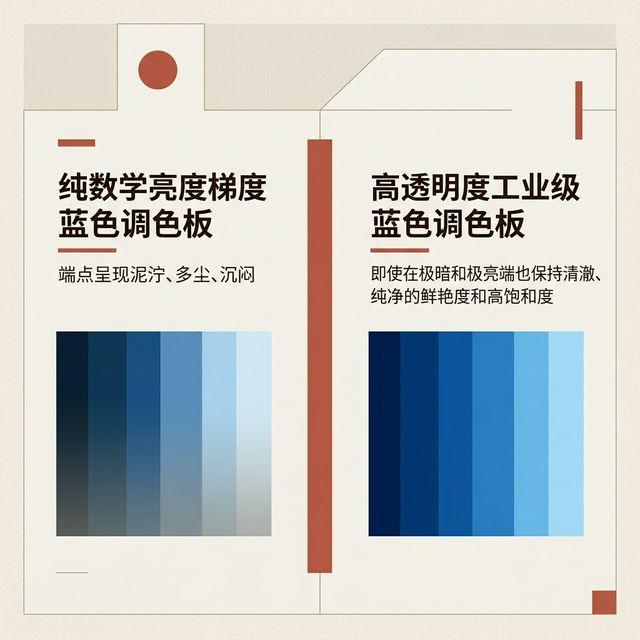
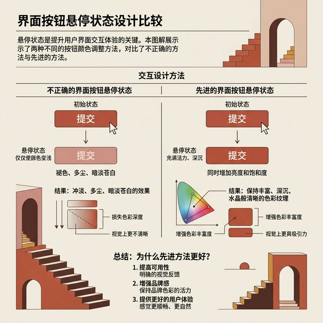
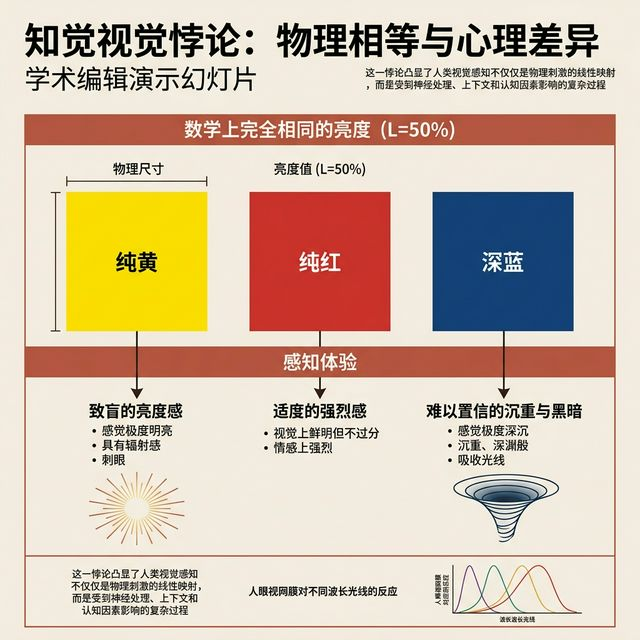
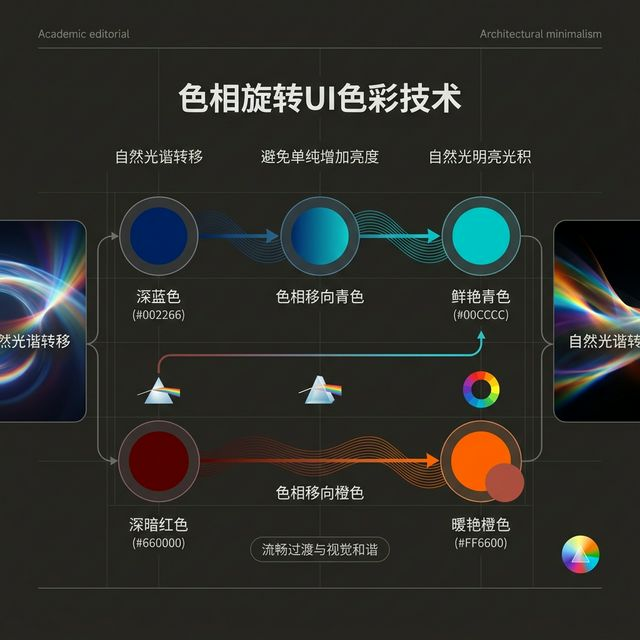
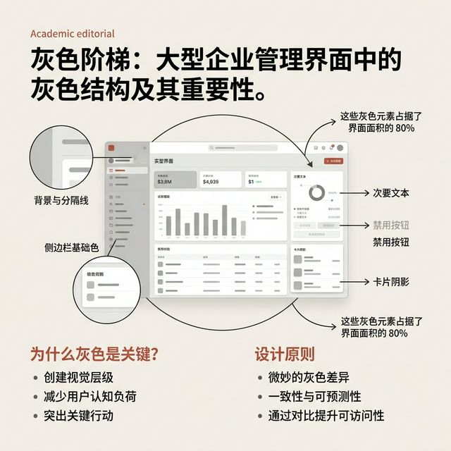
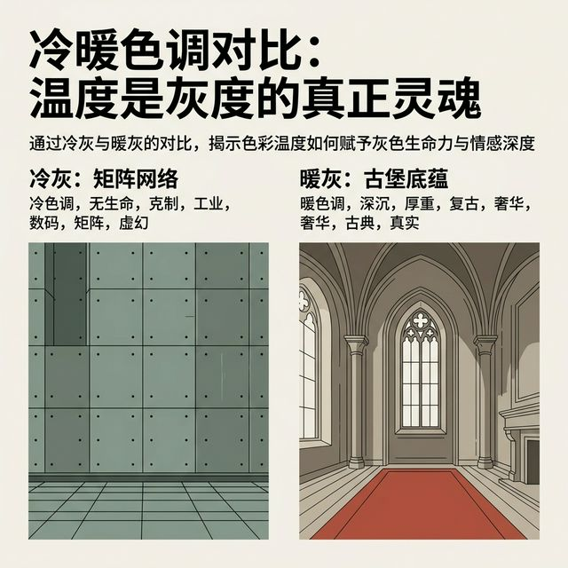
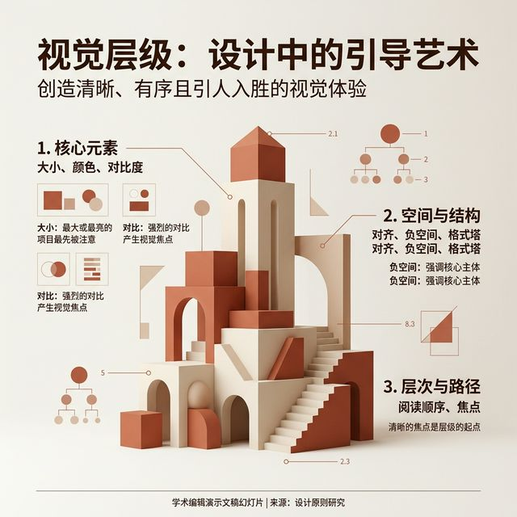

## 模块 4: 色彩进阶与灰阶温度 (约 20 分钟)
<!-- BUDGET: 3600 chars | SLIDES: >=7 | STATUS: done -->
<!-- MATERIAL_BUDGET: [Refactoring UI ch32-33 进阶色彩] + [Humanities: 电影调色心理学 - 冷暖灰阶的情感隐喻 (教父 vs 黑客帝国)] -->

拥有了 9 阶色板，初学者常会陷入一种误区。
理论上，在 HSL 模型中固定色相 (Hue) 和饱和度 (Saturation)，只拨动明度 (Lightness) 滑块，就能自动生成完美的渐变色带。
但这仅仅是理想的数学模型，人眼的神经机制在极端的灰暗死角里，并不认这个死板的数学账。

> [VISUAL]
> *   **Slide**: 亮度的视觉衰减悖论
> *   **Layout**: `Comparison`
> *   **Scene**: 左侧展示单纯改变 Lightness 算出的“数学渐变蓝色”。放大细节展示：在色阵向极限延伸时，极浅的 50 号特浅蓝和深压的 900 号暗蓝，全部显现出一种如同蒙上灰尘的浑浊感；右侧是对照组，设计师手动介入抢救后的高通透工业级色板大阵，其色彩强度在明亮和重压下依然保持着清晰纯净的张力。
> *   **Search**: `color lightness illusion perceived saturation UI comparison robust`
> *   **List**: 
    * 数学算法上的纯洁，往往带来视觉肉眼上的浑浊
    * Lightness 会在极昼或极渊中吞噬你的饱和度
    * 必须手动进行抢救式的物理“饱和度极值补偿”
> *   **Asset**: 

[WARNING]
这就是色彩数据世界里埋藏极深的第一个视错觉骗局：**亮度天生就会吃掉你的饱和度**。
当你把光彩逼人的 `500` 号主基准色，单纯通过增加 Lightness 强拉洗白成 `50` 号，或者压黑沦陷成 `900` 号黑池时……
你立刻会发现：它原本那种水灵灵的纯净张力迅速流失了！它在极暗和极亮的那一极看起来就像一块老化发灰的旧布，极其浑浊且缺乏底气。

为了强行从这种极限脱色溃败感中抢救色的原貌生命体征，专业的视觉设计师在调配极度偏离居中 `500` 号、向两边极限滑落的色阶时，将会敏锐且果断地**手动拉高两端极远色的绝对饱和度 (Saturation) 参数**。
这就是进阶重火力调色神技：**饱和度物理过载补偿**。

[PRACTICE]
**实战解析：如何徒手捏出一条 9 阶色阶？**
光说理论很抽象，让我们进入连线操作。假设你的主品牌色定在 `500` 号的蓝色（比如一种克莱因蓝）。要如何靠色相旋转扩展出 `50` 到 `900` 呢？
1. **确立锚点**：你的色盘核心锚点是 `500`。
2. **向高光进军 (50-400)**：当你设定 `400`、`300` 一直到 `50` 时，不要只单纯加亮度。你要同时把 Hue 的数值向青色 (Cyan) 或者绿色 (Green) 极其缓慢地推移。比如主色是 Hue 210，那么 `50` 号色可以偏移到 Hue 195。这模拟了现实世界中，阳光直射在蓝色物体上时，最亮的高光处往往会带上一点点环境天空光漫反射的偏青冷蓝效应。
3. **向暗渊下潜 (600-900)**：当你设定 `600` 到 `900` 时，在拉低亮度的同时，把 Hue 向深紫色 (Purple) 方向扭转。比如主色 Hue 210，`900` 号色可能转到了 Hue 225。这模拟了自然界物理环境中，暗部的阴影往往会因为天光散射定律（瑞利散射底层机制）而显得偏向更为深邃的紫蓝调。

这种完全遵照物理光学自然环境光渲染客观规律进行的人工偏移补偿，能让你的数字色阶图谱不再是冷冰冰机器吐出的 Hex 码死板数据，而是仿佛在真实的日照天光物理世界光影下自然投射产生的立体存在。这就是那些世界顶级 UI 界面之所以看起来极为“通透”、极其富有“生命呼吸感”的硬核底层大招组合拳：**亮度极值动态过载补偿控制与物理光学级别色相微调。**\n\n> [VISUAL]
> *   **Slide**: 抢救褪色发灰的按钮
> *   **Layout**: `Screenshot`
> *   **Scene**: 悬浮态 (Hover) 变化的提交按钮。鼠标极快滑放的微秒瞬间，左边错误的示范仅仅拉高了亮度，看起来活像被撒上了一层惨白的大白粉，干枯发蒙；右方高阶示范中，系统同步精确推高了内在浓稠的极限饱和度血液参数，保住了按钮如同水晶通透的质感。
> *   **Search**: `UI button hover state lightness saturation compensation`
> *   **Asset**: 

如果你觉得这就是全部陷阱，那大错特错。在色相维度的参数相轴极深处，还潜伏着第二个具有绝对反直觉的视觉魔法幽灵。

> [VISUAL]
> *   **Slide**: 基因原罪：色彩的先天明度不平等
> *   **Layout**: `Split`
> *   **Scene**: 屏幕上并列出现绝对同级、被锁死同频 Lightness 设定在 50% 的纯黄色、纯红色和深大蓝色方块。动画展示：最左的黄色爆明仿佛在核爆般直刺视网膜；而最右的沉重蓝色块则截然相反显得绝望压抑、深邃不可见底。
> *   **Search**: `perceived lightness hue color theory UI paradox`
> *   **List**: 
    * 黄色天生属于高光区霸权
    * 蓝色骨子里就死死刻印着深渊基因
    * 绝不要试图用平视的眼光去衡量不同色相
> *   **Asset**: 

**盲区之二：感知视觉与色相扭力旋转 (Color Hue Rotation)。**
虽然在代码编辑器后台，你大笔一挥极其省事地把原色极黄和暗冷蓝的 Lightness 明度都锁死为看起来平等的 50%，在计算器看来它们是完全死寂相等的。
但这只是机器看到的。渲染到人类视网膜时，事实是：黄色这种色系诞生时就带有极高的明度压强感；而哪怕最高亮度的蓝色也天生显得沉暗。

这就等于你在做一道极高难度的物理计算题：当你想要把一个颜色调亮，由于色相基因存在不平等，如果你仅仅只知道去抠 Lightness 那个苍白无力的滑块，渲染结局只会是没有任何生气的发灰。

> [TIP]
> **前端技术前瞻：OKLCH 感知色彩模型**
> 为了解决我们刚才提到的“色相先天明度不平等”问题，苹果和 W3C 等主导了全新的色彩空间规范：**OKLCH (Lightness, Chroma, Hue)**。
> 与 HSL 最大的不同是，OKLCH 是第一个真正基于人类视觉感知建立的大众生产级色彩空间。
> 
> 如果你在 OKLCH 模型中，把黄色和蓝色的 Lightness（感知明度）都设定为 50%。系统会自动在底层复杂的数学空间中进行折算，最终渲染出来的黄色和蓝色，在你肉眼看来，它们的“发光强度”将是**绝对相等**的！如果你在 OKLCH 里拉动一个高对比度渐变，你再也不需要极其痛苦地去手动做刚才讲过的“色相旋转”和“饱和度极值补偿”了，底层的感知引擎会自动帮你保持住色彩最完美的通透与纯净感。这也正是现代技术栈正在默默往 OKLCH 全面迁移的根本原因。\n\n> [VISUAL]
> *   **Slide**: 色相神级旋转：用光谱对抗极度虚无褪色
> *   **Layout**: `Flow`
> *   **Scene**: 在深色背景上，高级演绎动态过程：如何要把颜色调亮，除了拉扯明度，还要像个化学家一样，把它的色相 (Hue) 微妙地向光谱上那些“天生显得更明亮”的相邻色相倾斜偏移。深蓝色慢慢向青绿旋转变得通透空灵；暗红色慢慢向暖橙色旋转，不再显得像干涸的泥水。
> *   **Search**: `hue rotation color palette UI design advanced`
> *   **Asset**: 

> [ACTIVITY]
> *   **Type**: `QA`
> *   **Duration**: `2min`
> *   **Desc**: 快速知识点回顾
> 教师提问互动，校验此前核心法则的理解情况。

真正大宗师的调色手法，是大胆的**“色相旋转”**。
当你想要把一个颜色极其自然地调亮时，除了推高明度，你还需要把它的 Hue 向更高明度的感官光带去做顺畅转移微调。
这种运用底层光学和人眼生理逻辑的高阶调色法，能打造出绝对水晶般通透、毫无浑浊干杂质的数字调色库。

> [VISUAL]
> *   **Slide**: 后台物理宇宙真正的万王之王：中立灰阶军团
> *   **Layout**: `Full`
> *   **Scene**: 一个庞大的企业级管理后台界面。高亮提取出页面里占据了 80% 面积的所有“灰色”区域：背景、分割线、侧边栏底色、次级文字、禁用态按钮、卡片阴影。
> *   **Search**: `UI design grey scale background importance`
> *   **Asset**: 

而在这夺目的彩色表演之下，隐藏着实则统治整个数字界面版图的绝对暗物质：**中立灰阶 (Grayscale)**。
统计整个大型界面，那些惊艳的品牌色大抵连 5% 面积都占不到。霸占 80% 以上界面表面积的，全是用于区隔物理空槽、承载文本的灰阶框架集合。
品牌色决定头一眼惊艳，而庞大安静的灰阶基准线，则无情地决定了整个产品的“底层质感”与潜意识中的“情感绝对温度”。

> [PHILOSOPHY: 电影工业调色学与灰阶密码]
> 在顶级的电影工业调色室里，绝对没有哪位调色师会去使用物理意义上纯粹干净、无任何色偏偏向的“死灰”。
> 真正的高级灰色，都带着微弱但致命的情感神经注射。
> 犹如《黑客帝国 (The Matrix)》，那看似压抑的世界阴冷死寂灰色框架下，全被注入了幽怨窒息的冷绿色调基因；
> 再比如《教父 (The Godfather)》，柯里昂家族暗室内的深灰暗影表面下，底子里一直向外散发着陈旧权柄般血腥且复古的冷橘暗金色光芒。

> [VISUAL]
> *   **Slide**: 《黑客帝国》与《教父》的视觉温度
> *   **Layout**: `Comparison`
> *   **Scene**: 截取《黑客帝国》矩阵物理死区的冷绿色死灰墙影视截图，对比《教父》复古陈旧幽暗厚重的经典古堡室暖灰色大截面。展现出“温度，才是灰暗系真正的灵魂基石”。
> *   **Search**: `movie color grading the matrix godfather grayscale tint`
> *   **Asset**: 

为什么电影工业比互联网 UI 更重视灰阶？因为影视屏幕不仅要传递信息，更要**植入潜意识**。
《黑客帝国》中那个虚假的矩阵世界，之所以采用死寂的冷绿色调灰底，是因为在光学原理上，“冷绿”是人类面部血液“暖红”的绝对反比补色。当整个屏幕弥漫着这种带绿光的灰调时，所有角色脸上的生机与血气都在视觉上被完全中和、被抽干了。观众不需要听任何台词，生理上潜意识里就已经感受到了一种被数字技术严重剥削压抑的窒息感。

而《教父》室内那标志性的古铜暖橙金色暗影，则是在极致高仿黄昏与篝火时分的光谱。在人类远古几十万年的进化基因中，火光橘黄不仅与黄昏降临的静谧相连，更象征着族群聚落、绝对的防御安全、不可挑战的权力以及温暖封闭的避风港。这种被重度混入了暖陈色光的古铜灰阶暗流，让原本充满血腥残酷屠杀暴力的黑手党肮脏交易环境，在视觉心理学上瞬间蒙上了一层极其浓墨重彩、充满古典帝国般不容置疑的绝对威严与老派家长制强权保护伞的家族荣光浪漫滤镜。

回到你的 SaaS 面板上，你希望你的高管用户在面对那一屏庞大繁杂无比的数据 Dashboard 时，感到的是被代码淹没的麻木枯竭？还是稳坐中军帐、统御全局的绝对掌控安全感？这就是你作为一个界面架构师，能够通过那几丝灰阶温度去直接干涉的维度。\n\n> [VISUAL]
[ADVANCED]
**高阶命题：暗黑模式 (Dark Mode) 下的灰阶反转物理坍塌**
既然提到了灰色庞大体系，就绝对绕不开现代界面高端开发项目里的地狱级挑战关卡：暗色原生模式 (Dark Mode)。
许多初级开发团队在做前端暗黑模式适配时，往往只是极其粗暴草率地将系统色板无脑反相：将 `White (亮度 100%)` 强转成 `Black (亮度 0%)`，将原本极浅灰的基底层背景直接一键替换成死寂深黑色，把文本颜色直接从黑暴力变白。结果就是交付的最终界面像是一张恐怖过曝冲印失败的劣质摄影底片，原先精心构建的所有层级 Z 轴深度关系在这一刻全被强行压平抹平了。
> *   **Asset**: 

为什么这种小聪明式的简单“色值反向映射”完全行不通？
因为在亮色正向模式下，我们通过在无色白色画布基底上叠加不同浓度、逐渐加深的“阴影灰色”来创建深度纵深感。因为纸是白的，背景就是最亮的底层，突出的前置悬浮卡片略暗，或者需要带有深色坠落阴影才能突出。
而在真正的沉浸式暗黑模式物理逻辑里，视觉高程真理是**完全反转的**：在暗室里，越靠近底层地表的基础层背景系统，越是需要接近于绝对的黑谷底深渊 `900` 号（但在此绝不推荐纯黑 #000000，容易引起像素发光严重拖影）；而随着 Z 轴向上弹出的模态卡片层、前置悬浮窗警告层，因为它们在物理上“离用户的眼睛眼球更拔高更接近”，所以它们必须**反其道而行之地被调亮（用相对更亮一度的浅暗灰色去涂装覆盖）**。在暗色深层物理空间里，能够争取到“更高光照度”本身就意味着获得了“更高的物理海拔维度”。这与亮色模式的阴影堆叠法则截然相反。

如果你在此前的亮色模式系统中，严格使用了带着情感温度配置的科技冷面灰（即在灰阶系统池里小心注入蓝光参数基因），那么在制作应对夜晚的暗色版图时，你打底的全局底色 `900` 号也绝对、绝不允许是毫无生气的纯死亡黑，而必须是一种极度深邃、如深夜大洋深处那般蕴含巨大压迫力的深冷蓝灰调色海。在深夜环境特有的超高原生对比度极限放大器作用下，人眼黑白视锥细胞对色彩偏差异质杂质的灵敏感知度会变得比白天正午大太阳底下敏感无数倍。在此时此地，你对整个产品底层灰阶里那微不足道仅仅 `3%` 品牌色血脉基因的控制阀门就显现出了尤为直接见血的决定性——一旦底层深色体系稍微操作失控、被混杂了哪怕 1% 的多余红黄暖色冲突光谱杂色，你的整个界面系统立刻就会全面散发出一种像地下室未清理干净的脏旧生锈服务器机房般令人不安的恶劣低端破败感。\n\n> *   **Slide**: 赋予无界机器死灰以心跳温度：冷科技与生活暖灰
> *   **Layout**: `Split`
> *   **Scene**: 屏幕被一分为三。左边死板物理纯灰，如同原始的开发工具；中间混入了蓝色基因的冷灰 (Cool Grey)，立刻展现出专业克制的强大控制感科技冷锋；右侧灰色系则被混入微弱柔和的橙黄色，变得具有手磨咖啡质感般的暖灰 (Warm Grey)。
> *   **Search**: `cool grey vs warm grey UI design tint`

在我们的交互界面开发域，同理：**永远不要大面积使用 Saturation 为绝对 0 的死尸物理纯灰。**
若你开发极度强调专业纪律的硬核金融监控台或安防数据中心屏，果断用品牌蓝为庞大的灰阶区域注入一丝“蓝色防线基因”。这便是令人大脑强制降温的**科技冷灰 (Cool Grey)**。
若面临休闲、社交分享或陪伴生活型应用，那就隐秘地为灰色涂装混入微量的暖橙黄色生命力。让整个面板散发阳光烘烤般的**舒适暖灰 (Warm Grey)**。

温度，才是决定灰阶生死的致命武器。

[TIP]
**工程实践中如何落地“有温度的灰色”**
如果你使用的是现代 CSS 预处理器或原生 CSS3 变量系统，大规模引入并维护灰阶温度体系变得极其简单高效。
你不需要去色环上手动挨个辛苦推导出那 9 个甚至 10 个灰色变态十六进制数值。更好的高级做法是使用原生混色函数体系。
例如：`color-mix(in oklch, var(--brand-primary) 3%, var(--neutral-grey))`。
仅仅只凭借着这不到 3% 的品牌主颜色（或者特定暖橙色）的极其微弱代码注入混血，就能以极低近乎于零的工程长期维护成本支出，让你界面的整个地基灰色支撑网络瞬间在物理上拥有了与品牌基调绝对同频、高度统一且极其高级的情绪心跳。这种看似极其克制但在底层却无比精准、可无限一键扩展的高维工程化色彩温控体系建设，才是真正匹配和决定现代大型多终端协同 SaaS 互联网系统产品应有的专业高阶重度工业水准生命力。\n\n---
