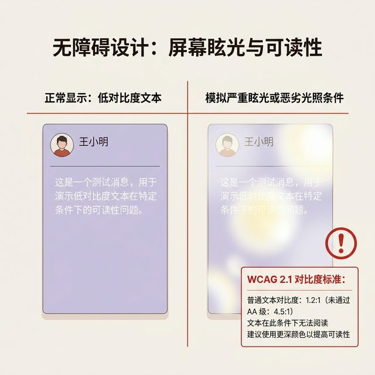
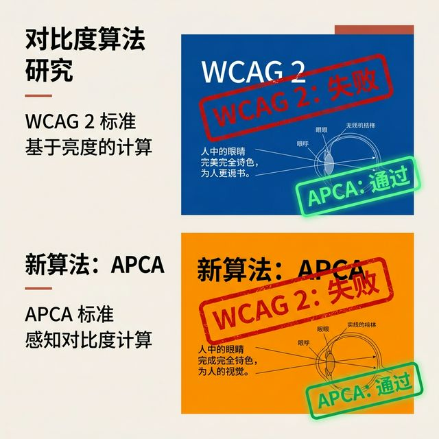
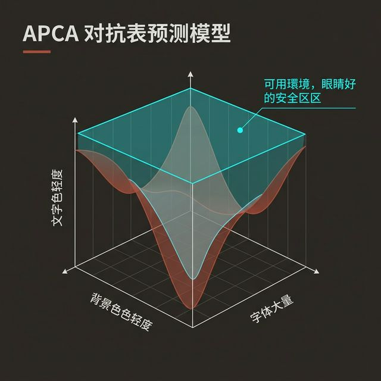
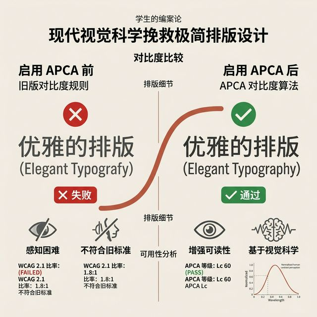
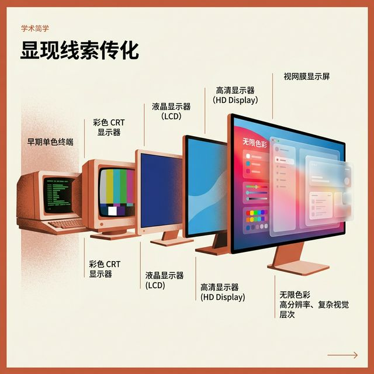
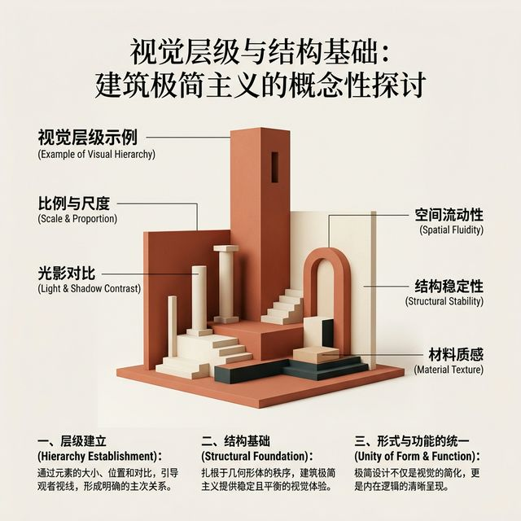
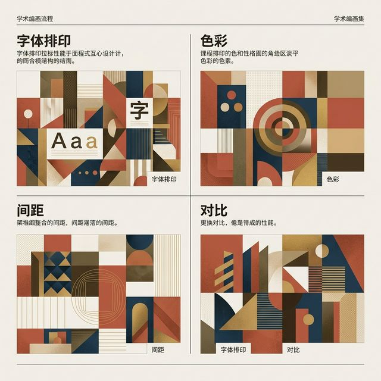

## 模块 5: 色彩无障碍与冗余设计 (约 20 分钟)
<!-- BUDGET: 3600 chars | SLIDES: >=7 | STATUS: done -->
<!-- MATERIAL_BUDGET: [Refactoring UI ch34-35 / WCAG标准] + [Cross-discipline: 三哩岛核泄漏事故 (红绿指示灯色彩反直觉与冗余失效灾难)] -->

当我们把色板调整到理想状态时，工程学必须介入，并设立防线：**无障碍性 (Accessibility, a11y)**。

> [VISUAL]
> *   **Slide**: WCAG 对比度底线
> *   **Layout**: `Split`
> *   **Scene**: 左半区是浅紫底色配淡白文字的卡片；右半区模拟了光线不佳环境下的阅读视角，文字无法分辨。旁边打出红色警告与 WCAG 对比度指标。
> *   **Search**: `WCAG color contrast ratio failing UI accessibility`
> *   **List**: 
    * 正文底线：4.5:1
    * 大标题底线：3.0:1
> *   **Asset**: 

[CAUTION]
色彩是传递信息的载体。在前端规范中，对文本与背景色之间有着严苛界定：**WCAG 对比度标准**。
对于正文信息，对比度不允许低于 **4.5:1**。大标题可放宽到 **3.0:1**。
无论多渴望用浅灰文字在白底上营造极简感，只要不满足对比度测试，便是不及格。

但哪怕遵守了 WCAG，色彩底层依然藏着盲区。

> [VISUAL]
> *   **Slide**: WCAG 算法的局限与 APCA
> *   **Layout**: `Comparison`
> *   **Scene**: 上方是深蓝背景配白字；下方是明橙背景配黑字。这两组在 WCAG 2 检测下都得到“Fail”。但肉眼透视图表显示，普通人看这两个按钮时对比度足够清晰。随后系统切入 APCA 滤镜，给这两组打出“Pass”。
> *   **Search**: `WCAG vs APCA perceptual contrast UI design`
> *   **Asset**: 

**工程学盲区：单纯基于机器物理逻辑的旧标准并不可靠。**
传统 WCAG 2.0 算法制定较早，基于简单的亮度差模型，未充分考虑人类视觉对字重与明度的真实补偿偏好。
这就导致它会误判清晰组合为不及格，又会把难读配置判定为安全。这也是现代设计系统正向新一代的 **APCA (Advanced Perceptual Contrast Algorithm)** 仿生标准迁移的原因。APCA 真正基于人类在复杂光影下阅读文本的方式构建。

> [NOTE]
> **深度进阶：APCA 算法到底为什么比 WCAG 2.0 更懂人眼？**
> WCAG 2.0 的对比度公式建立在一个极其粗糙的早期纯物理光度学模型之上（单纯基于相对亮度 L1/L2 的数值相除）。它有一个极其致命的系统设定缺陷：它假设“白底黑字”和“黑底白字”在人类视网膜系统上的感知消耗是完全对称相等的。也就是说，如果白底黑字的对比度得分是 21:1，那么同样颜色的黑底白字在它的算法里也只能是完全一模一样的 21:1。
> 
> 但这完全违背并无视了人类眼球的真实物理生理结构！在明亮的白底环境中，由于整体环境光通量巨大且充沛，人眼的瞳孔会自动收缩变小，从而极大地减少了由于晶状体边缘不规则带来的“球面像差”。此时视网膜上的成像边缘极其锐利，用户能够轻易毫不费力地分辨出极细的黑色字体骨架边界。
> 
> 而相反，在极端黑暗的背景（深黑底）下，为了捕获更多微弱的光线，人眼的瞳孔会不由自主地被迫剧烈放大。放大的瞳孔会带来不可避免的物理边缘散光现象（这就像高端相机的光圈如果开到最大参数就极易产生边缘失焦一样）。此时如果上面悬浮的是发着高频强光的纯白文字，高能白光子会在黑色感光细胞的交界边缘发生剧烈疯狂的光晕溢出，这在眼科医学上被称为极其有害的“光晕 (Halation)”。
> 
> 革命性的 APCA (Advanced Perceptual Contrast Algorithm 基于感知的进阶对比度算法) 则极其精准深刻地抓住了这一人因生理界限的不对称性。在它严苛高端的矩阵评级计算中，如果背景由于过度低光暗沉导致判断使用者瞳孔处于放大拉伸状态，它会智能且毫不留情地要求前端必须“强制增加字体的几何粗细 (Font-Weight) 与面积”，而不是单单愚蠢地把白光亮度滑块强推到最高峰值。因为在这个深黑数字宇宙里，能将文本从眼花模糊中剥离解救出来的，永远都不是“更刺目耀眼的白色闪光”，而是“更粗壮结实的绝对字号物理骨架”。这就是真正代表现代高阶顶层系统设计的底层光学拦截密码。\n\n> [VISUAL]
> *   **Slide**: 色盲模拟下的视觉挑战
> *   **Layout**: `Split`
> *   **Scene**: 左侧是正常视界下的红黄绿指示灯。右侧切入色盲滤镜，代表警告、安全与危险的灯全部变成了相似的黄褐色。
> *   **Search**: `color blindness simulator UI design redundancy`
> *   **Asset**: 

这就引出了交互开发中的重要原则：**永远不要将单一颜色的变化，作为传达关键状态信息的唯一途径。**
对于全球有色觉障碍的用户来说，依赖强对比色的报错与指示，可能只是一片难以区分的灰色区域。因此，系统设计中必须引入航天级理念：**多通道冗余设计 (Redundancy Design)**。

> [VISUAL]
> *   **Slide**: 多通道冗余设计
> *   **Layout**: `Screenshot`
> *   **Scene**: 在色盲画面的基础上进行修复。绿色成功区域叠加打上锐利的对号图形；红色危险区嵌上叹号三角符号。同时伴随高反差文本下划线。即使处于色盲模式色彩褪去，几何图形和字体骨架依然能清晰传达告警信息。
> *   **Search**: `UI state redundancy color shapes icons accessibility`
> *   **List**: 
    * 第一防线：原生颜色
    * 第二防线：Iconography (几何标识)
    * 第三防线：原生文字段标签
> *   **Asset**: 

“冗余”在防错工程里，是阻挡认知偏差的保险丝。设计者必须在特定色彩被剥除之外的维度上，附加几何图案和结构边框。即便处于光线不佳或病理环境下，信息本体依然能通过坚实的骨架传递。如果不重视系统冗余防御，往往会引起严重的代价。

> [ADVANCED]
> **多模态冗余补位：视网膜防线失效时的听觉与触觉反馈**
> 现代系统不仅要求视觉层面的防错，更要求多维度的感官冗余。当用户的视觉通道被全部占用或阻断时（例如户外强光、驾驶盲操），优质的系统会自动切入听觉与触觉维度的防御。
> 以 iOS 系统为例：当面临关键校验失败（例如 Apple Pay 失败）时，系统除了展示红色警告图标，还会立即通过底层的 Taptic Engine 触发强烈的双重线性震动反馈，并伴随低频阻断警告音。通过视觉、触觉、听觉三路联合警报，即便用户没有看清屏幕，系统传达阻断状态的成功率也大幅提升这就是典型的现代人机工程多通道冗余设计。

> [VISUAL]
> *   **Slide**: 三哩岛核泄漏事故控制面板
> *   **Layout**: `Full`
> *   **Scene**: 展示 1970 年代真实的核电站控制室大屏照片。在核心阀门监控区，由于控制灯的设计极其违反直觉，红绿灯的常规含义被完全颠倒。
> *   **Search**: `Three Mile Island control room TMI-2 accident UI disaster`
> *   **Asset**: 

> [PHILOSOPHY: 认知错位与信息误导]
> 1979 年的三哩岛核泄漏事故中，反常的指示灯设计是促成灾难的重要考量因素。在常理认知中，红色代表“危险与停止”，绿色代表“安全与运行”。但在老旧的操作面板上，红色亮起代表“阀门开启处于带压流量状态”，绿色代表“阀门关闭冷态阻断”。
> 当事故突发，操纵员在紧张下顺从了本能，看错了指示灯信息状态，导致了部分连环误操作。

> [LESSON]
> **灾后反思：摒弃红绿灯，采用明确语言符号印刻**
> 应对这类容错率为零的关键系统，防错重构的最优解是直接采用“语言符号标签”。
> 放弃容易引发歧义和色弱困扰的布尔状态红绿指示灯，改为在阀门旁嵌入微型电子屏。屏幕直接以最高对比度的白底黑字显示出确切状态：当阀门打开时显示大写单词 **[OPEN]**，关闭时显示 **[CLOSED]**。
> 这彻底消除了色彩隐喻的模糊性，利用人类最直接的共同语义——文本，直接接管了最核心状态的传达，这也是设计中最高级别的冗余保险。

> [VISUAL]
> *   **Slide**: 暗黑模式下的散光光晕
> *   **Layout**: `Flow`
> *   **Scene**: 右侧引出暗黑模式面板，展示“光晕现象 (Halation)”。纯黑背景上的纯白大亮文字，在散光用户眼中产生明显的边缘眩光。
> *   **Search**: `astigmatism halation dark mode UI design`
> *   **Asset**: 

今天，对比度偏差在暗黑模式 (Dark Mode) 中继续发酵。许多人在暗色界面中为追求高对比度，盲目选择纯黑背景配置最亮的纯白文本。对于散光群体而言，由于明暗落差过大，这会在水晶体折射中产生明显的**散光光晕 (Halation)**，造成文字发虚、引发晕眩。

合理理智的做法，是在暗底板中留有一丝灰度的缓冲液底色，且将纯前端文本的极白光收拢控制，为视网膜降低对比负担。
> [TIP]
> **前端工程落地：我们该如何应对这套新世界的视网膜标准？**
> 面对标准更迭的深水区，你可能会问：“既然老旧规范千疮百孔甚至可能阻断信息，那我到底该如何在眼下的项目中进行工程落地以规避全方位的体验灾难？”
> 这一问题的绝佳解法极其务实且清晰。请在你们的 Design Token 根系统定义层，强行引入双重防御检查网关：
> 1. 当设计受众极广、偏向白天的常规浅色系庞大后台或 C 端页面时，WCAG 2.0 依然是可以被信任的最后一条底线基本盘防线。按照它来跑基础自动化巡检绝对没问题。
> 2. 但凡你的项目、组件或者模态弹窗开始深度涉足哪怕一丁点的“深色模式 (Dark Mode)”，请毫不犹豫、不可商量地在组件库层面丢弃老的 WCAG 2.0，必须直接使用 APCA 最新算法参数在 Figma 测算插件或 CI/CD 构建前端组件库里发起视觉强行并网对比测试拦截。
> 3. 最终赋予开发执行者的具体神级启示是：永远、永远必须在全局样式表中，为所有深色暗夜模式下的关键操作文本，准备一套完全独立的、额外强加粗的物理字重层级（例如强制提升至 `font-weight: 500` 甚至 `600`）来依靠纯粹物理结构厚度抵御视网膜散光造成的光漫射吞噬；与此同时，必须保持最绝对清醒的系统克制——必须刻意将系统默认下那看似光鲜实则刺目剧毒的 `#FFFFFF` 纯满屏高白漆文本颜色，坚决强制削峰平谷地往下拉低回调压缩至毫不刺眼的 `rgba(255, 255, 255, 0.87)` 甚至更低的透明度白膜遮罩透辉绝对安全限界级别。

这不到几毫米极其微小不起眼的系统最高明度峰值极限回调抑制，以及这几盎司悄无声息偷偷加派的基础支撑字重加强固化指令，就是在用数字架构系统最温柔隐秘的工程底层代码力量，极其精准小心而又无声息地，大规模抚平并治愈着全世界终端屏幕外几十亿潜在轻度或重度散光视障用户们，原本早已焦躁不堪且饱受眩光刺痛折磨的脆弱神经系统。\n\n\n\n---\n\n## 模块 6：实践 — 重建骨架脉络 (约 80 分钟)
<!-- BUDGET: 0 chars | TYPE: activity | STATUS: exempt -->

> [VISUAL]
> **Slide**: "给骨架填色"
> **Layout**: `Workshop`
> **Scene**: 左侧是上节课搭建的灰色高保真线框图。中间是一个空白的 Design Token 面板（包含色彩、字体粗细槽位）。右侧是目标渲染的界面框架。
> **知识节点**: `refactoring-ui-color`
> *   **Asset**: 

> [ACTIVITY]
> **Type**: `Workshop`
> **Duration**: `80min`
> **Desc**: 重建骨架脉络 — 为界面注入 9 阶色板与色彩层级

本周的实验室任务非常具体：我们要给 W05 和 W06 留下来的极简骨架“填色”。

1.  请打开你的设计工程，不要急着去填充主视区。
2.  先在你的 Design System 或者 CSS 变量库中，调配出一套专属于你们组产品的 **9 阶基础色彩 Token 库**和带有温度的**灰阶库**。
3.  从“最大片”的空间开始，尝试利用我们讲过的“反向弱化”战术，利用不同的浅层灰阶分离容器边缘。
4.  在给按钮等交互控件上色时，注意使用刚才提到的“色相旋转”和“饱和度补偿”，保持颜色的呼吸感。同时在代码检查中验证对比度是否全部满足 `>= 4.5:1`。

当你们的骨架沾染了正确的色彩系统与层级分配后，这个产品模型才算真正“破土而出”。大家回实验室见真章。

---
