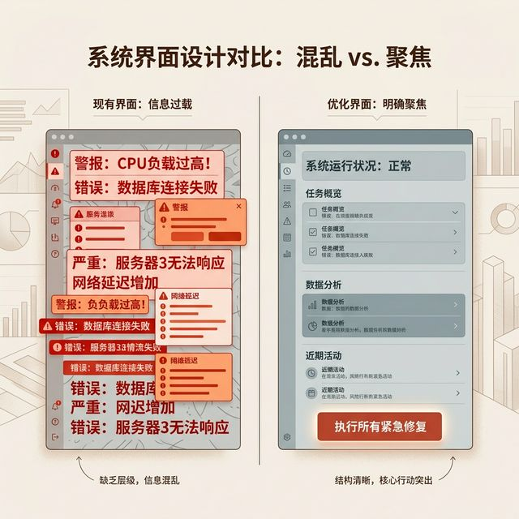
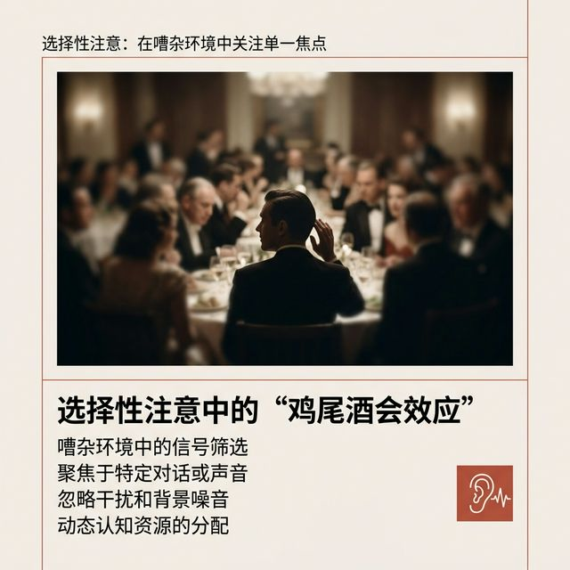
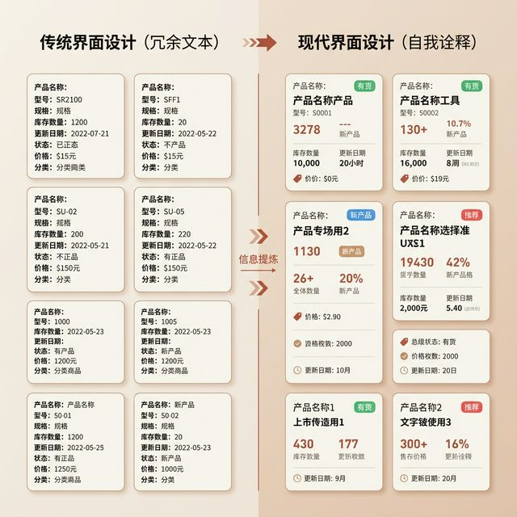
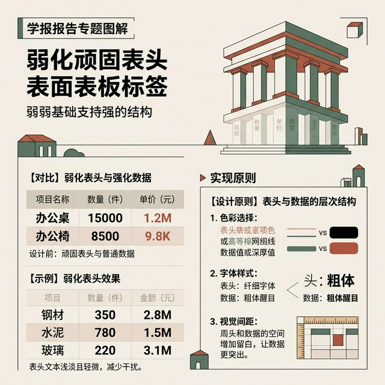
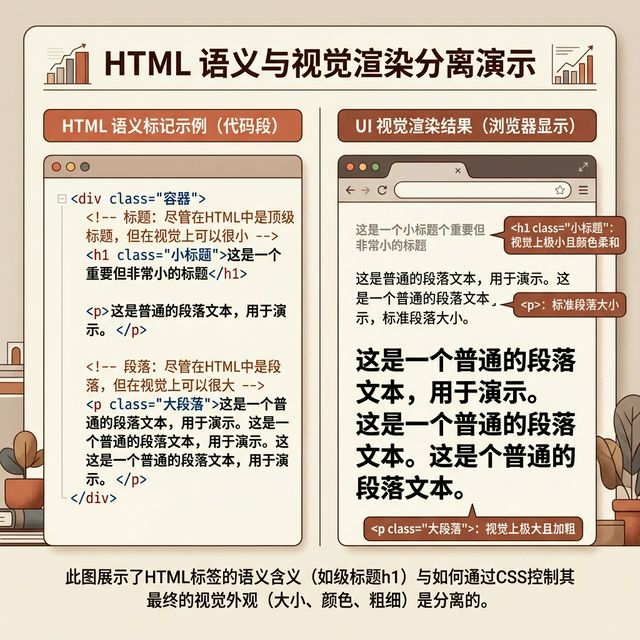
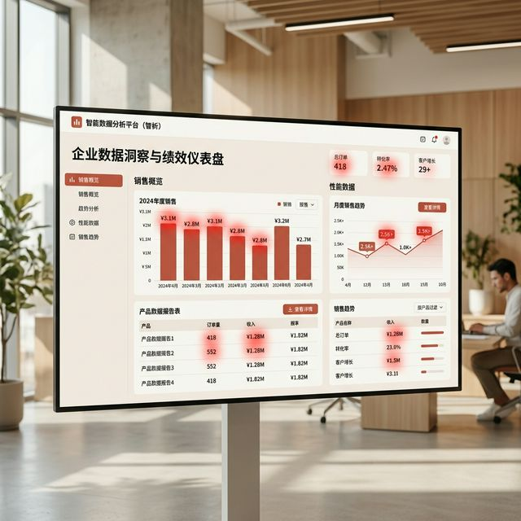
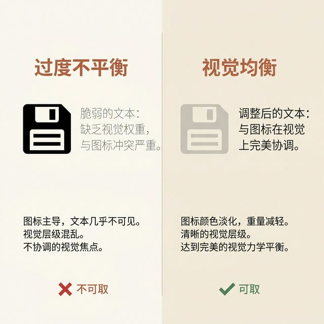

## 模块 2: 层级实战策略 (约 20 分钟)
<!-- BUDGET: 3600 chars | SLIDES: ≥7 | STATUS: done -->
<!-- MATERIAL_BUDGET: [Refactoring UI ch09-13 实战策略] + [Cross-discipline: 认知心理学“鸡尾酒会效应”与选择性注意力过滤] -->

上一讲，我们给界面穿上了严格遵守建筑学网格和色彩对比度法则的无形盔甲。
当你把所有的文字和负空间都收拾得像瑞士名表一样精确严密之后，你以为这就结束了吗？
不。有了坚不可摧的基础骨架，我们才刚刚拿到进入残酷真实战场的入场券。接下来，我们要面对具体的实战战术。

> [VISUAL]
> *   **Slide**: 强调的悖论
> *   **Layout**: `Split`
> *   **Scene**: 屏幕左侧展示一个满是红字和加粗字体的报警面板，毫无重点；右侧通过动画演示：将原本所有明亮的菜单项和外框全部剥离颜色洗淡，只留下一个目标高亮，重点瞬间锐利凸显。
> *   **Search**: `cocktail party effect de-emphasize UI contrast`
> *   **List**: 
>     * 反向弱化：为了强调而退让
>     * 剥夺竞争者的视觉声量
>     * 大合唱中唯一的独唱者
> *   **Asset**: 

战术一：**反向弱化。也就是强调的悖论。**

在几乎所有新晋全栈开发工程师或者初级产品经理的心智模型里，如果想要强调某个新上线的促销功能，或者是某个极度危险的删除按钮，他们的第一直觉永远是高度同质化的：
“把它搞大！把它变红！给它玩命加粗！”
在没有任何干扰元素的单一页面真空试验场里，这招可能有效。但在一个挤满了七八十个控件和多重复杂表单的真实后台 Dashboard 里，这也是一种最愚蠢的做法。
当你界面上所有的元素都在极度绝望地大喊大叫的时候，你继续用尽全力去拉高某一个按钮的物理音量，只会让整个场面的混乱指数呈几何级数上升，变成一场极其可怕的声学灾难。
**(Pause: 2s)**
真正绝顶聪明的做法，是极其冷静地反其道而行之。
当你觉得主角不够突出的时候，请不要继续盲目去加强你的主角，而是转身去**冷酷地弱化所有试图与主角竞争注意力的庞大配角阵营**。

> [PHILOSOPHY: 鸡尾酒会效应与选择性过滤]
> 认知心理学中有一个极为经典的人类生理现象，叫做“鸡尾酒会效应 (Cocktail Party Effect)”。
> 试着想象你在一个几百人同时喧哗狂饮的舞会上，整个环境的底噪震耳欲聋。但如果突然有人在几十米开外，用非常微弱但完全清晰的声音轻轻叫了一声你的名字，你的大脑能够在几毫秒内瞬间过滤掉几百人的巨大轰鸣，像雷达一样精确定位到那个声音。
> 大脑之所以能完成这项奇迹，靠的根本不是那个呼喊的声音分贝有多大，而是大脑瞬间主动开启了防御性的“选择性过滤”底层的神经抑制机制，把所有其他无关的噪音强制判定为背景音。

> [VISUAL]
> *   **Slide**: 鸡尾酒会效应
> *   **Layout**: `Image`
> *   **Scene**: 一张复古的纽约晚宴老照片，人群喧闹模糊，但中心焦点对准一个正在回头聆听的人类剪影，周围环境被极度暗角虚化，完美刻画出选择性注意力的开启瞬间。
> *   **Search**: `cocktail party effect selective attention psychology vintage crowd focus`
> *   **Asset**: 

在界面排版构图上，我们要做的就是人为地制造出这种强大的“神经抑制过滤”。
打个比方，一个常见的左侧导航侧边栏，你觉得当前处于激活状态的菜单项不够明显？千万不要去给它加刺眼的红框或者荧光底色。
去把那十几个没有被激活的同辈普通菜单项揪出来，统统扒掉它们身上深灰色的厚重背景图层，把它们的字重残暴地降到最薄的常规体，把颜色无情地洗淡成极其微弱可怜的中度灰。彻底剥夺它们的视觉物理声量，让它们老老实实地退却到后方的黑暗阴影里。
一退一进之间，目标元素甚至都不需要增加哪怕区区一像素的面积，就能像暗夜里的一根火柴一样，极其自然、且锐利无比地刺痛视网膜凸显出来。
这就是属于高阶架构大师的实战绝密心法：**通过无情消灭周围的竞争者，来建立界面上的独裁统治**。

> [VISUAL]
> *   **Slide**: 标签后置原则
> *   **Layout**: `Split`
> *   **Scene**: 左侧展示充满了形如“Email: abc@xyz.com”、“Status: Active”字样的“键值对”生硬枯燥堆砌；右侧展示抹掉一切多余标签，仅靠数据本身排版本身自证的清爽界面（如小徽章、不同字体强弱区分）。
> *   **Search**: `UI labels are last resort minimal form design`
> *   **List**: 
>     * 拒绝机械的研发键值对思维
>     * 数据格式本身即是自解释声明
>     * 让真实数据成为唯一的舞台主角
> *   **Asset**: 

战术二：**标签后置原则 (Labels Are a Last Resort)。**

如果说有什么东西是让一个精心设计的界面瞬间看起来像个极其枯燥无聊的“九十年代数据库后台”的罪魁祸首，那就是泛滥成灾的“字段标签”。
很多全栈工程师在写前端页面的时候，大脑内存里装的完全还是后端的 JSON 或者是关系型数据库表中的“键值对 (Key-Value)”底层映射逻辑。
一旦这种粗暴的逻辑直接物理反映到 UI 界面上，就变成了无休止的、极其枯燥的流水账：
“邮箱：张三@公司.com”
“产品单价：$19.99”
“所属部门：云端平台架构部”

这是一个极其偷懒且极度落后的视觉翻译过程。
在真正的顶级视觉层级划分里，**标签从来都不应该成为你的默认选择**。它是你在穷尽了绝大多数的排版解构手段之后，走投无路迫不得已才动用的最后一道防线。
为什么？因为对于人类那经历了百万年进化的极其敏锐的模式识别能力来说，很多现代数据格式本身，就是极其强烈的、不可磨灭的自解释声明。
一串中间带着非常独特 `@` 符号的英文字符串，屏幕前任何人只要扫一眼就知道那绝对是邮箱；
一串最前头挂着显眼 `$` 符号的阿拉伯数字，哪怕是六七岁的小孩都知道那是一张价签。
**(Pause: 2s)**
在这类拥有强烈格式自证特性的数据前面，强行加上极其生硬的冒号和六角黑字的标签前缀，就像是你极其可笑地在一个真苹果上用马克笔刻上“这是一个苹果”一样荒谬绝伦。
这些冗杂的多余标签，就像是一大盆极其粘稠恶心的泥浆，死死地糊住了用户试图快速扫视有效数据的黄金视线。

如果有些特定的垂直业务数据，确实需要标签才能辨认呢？比如一个内部仓库报表里的数字 `12`。
最高级的处理办法是把它们极其平滑地融合进人类的自然语言流里，写成“库存当前还剩 12 件”。

> [VISUAL]
> *   **Slide**: 后置标签的视觉物理降级
> *   **Layout**: `List`
> *   **Scene**: 在浅色底图上，极其直观地演示如何冷酷处理那些必须保留的顽固表头标签。
> *   **List**: 
>     * 极限缩小物理字号尺寸
>     * 颜色洗脱至濒死边缘的浅低灰
>     * 全面强行卸载所有加粗骨骼装甲
> *   **Asset**: 

如果在极其密集的专业比对表格里，不得不保留呆板的表头标签矩阵，那么请你务必对这些辅助性的标签进行最严酷的“视觉降级”残酷处理。
狠狠地缩小它们的物理字号、把全黑刺目的文字疯狂洗脱到边缘濒死的浅低灰、全面卸掉它们身上所有的字重粗体装甲。
永远要将这个极其珍贵的铁律刻在脑子里：标签，永远只是负责在漆黑剧院里默默搭台子、打杂的背景板；**只有那些真实变动的数据，才是永远在这个舞台中央聚光灯下翩翩起舞的绝对主角。**

> [VISUAL]
> *   **Slide**: 语义与视觉的物理剥离
> *   **Layout**: `Split`
> *   **Scene**: 动画演示 HTML 底层语义标签（H1-H6）与最终渲染视图大小的强行物理剥离。左侧代码展示使用 `h1`，右侧终端的视觉屏幕上却把这个标题压缩得极小甚至变淡，反而是下方卡片里的正文活动使用了大号极其醒目的加粗字体。
> *   **Search**: `separate semantic HTML from visual UI hierarchy`
> *   **List**: 
>     * 语义标签仅服务于无脑机器爬虫与视障设备
>     * 视觉层级必须且只服务于人类视网膜
>     * 坚决用铁腕打破“H1就必须全场最大”的石器时代教条
> *   **Asset**: 

战术三：**语义让位原则。**

接下来，我们来到最容易让前端工程师和视觉设计师拔刀相向、起激烈争执的一个血腥防区：底层语义架构与上层视觉层级的彻底割裂。
在我们接触的最原始的启蒙 HTML 教程里，我们所有人都被老师植入过一个不可冒犯的教条概念：`H1` 标签代表着整个页面中最高级别、最具统领权的主页面标题。所以，全世界的 Web 浏览器在没有 CSS 介入时，默认都会把它渲染得巨大无比，像是一块沉重吓人的黑色搬砖。
由于这种极为深刻的思维钢印，很多带有纯粹工程师直线思维的人，会不自觉地在潜意识里认为：只要这行字代表着当前页面的主语义统帅地位，那它的物理字号，就必须是全场范围内毋庸置疑的最大值。

这是一个极其僵化、不知变通的远古教条主义。
各位要深刻、彻底地理解这一点：隐藏在代码底层里面的 `H1` 到 `H6` 标签结构，那叫做**文档的语义抽象层级**。
它存在的唯一目的和意义，是为了给屏幕阅读器里的无助盲人进行语音播报识别，或者是给 Google 那些没有眼睛的爬虫机器抓取关键字去阅读解析的。
而我们今天在课堂上花了如此大代价讲述的，是前端的**物理视觉层级**。它是活生生的、直接极其感性地投射进人类视网膜上的光影魔术幻觉。

在绝大部分极其庞大现代且复杂的企业级产品（ERP）里，页面左上角最顶端的那个万年不变的大标题（比如“商品管理全局控制中心”或者是“管理员核心账户设置”），在骨架语义上，它确实是当仁不让的最高统帅 `H1`。
但在屏幕前坐着的用户的真实注意力分配雷达中，它仅仅只是一个极其廉价的、用来安抚情绪告诉你“兄弟，你没走错路”的背景贴纸罢了。它只是一张落满灰尘的无聊出入证。

> [VISUAL]
> *   **Slide**: 寻找屏幕上的真实热区
> *   **Layout**: `Screenshot`
> *   **Scene**: 一张极其庞大、充满图表数据的企业后台监控面板截图，用高对比度的红色眼动追踪热区图 (Heatmap) 覆盖在上方，用最冰冷的数据证明人类真正的注意力焦点完全集中在数据跳动区和核心交互按钮上，而不是顶部高高在上的巨型 H1 标题。
> *   **Search**: `dashboard UI eyetracking heatmap focus`
> *   **Asset**: 

真正的焦点、真正主宰战场的生死胜负手在哪儿？是页面下方那一排排疯狂跳动、闪烁着红色警报的焦灼数据监控卡片，以及那个决定了千万资金流向的、散发着刺眼蓝色光芒的“提交最终算力结算”按钮。
**(Pause: 2s)**
所以，在极其职业化、冷酷的商业实战开发里，我们要异常勇敢且绝不手软地把这些被称为 `H1` 老大级别的页面骨干标题，在最终的视觉效果上极限度地压缩、缩小，甚至极其无情地将其直接洗成毫无存在感的浅灰色。
在更加极端追求沉浸式屏效的恶劣场景下，我们通常是在代码的坟墓里虚伪地保留这个 `H1` 标签，仅仅为了去机械地照顾无障碍法案的机器访问，但在用户看到的物理视觉上，却毫不留情地用 `display: none` 把它的尸体彻底沉到水底。
在做页面排版结构设计时，请在脑子里挥舞利刃，死死地斩断这两者之间被洗脑绑定的荒谬勾连：
**选择往代码里写什么层级的标签，那是完全极其死板地基于逻辑与抽象语义的刚性需求；而最终决定在屏幕上赋予它什么样令人胆寒的物理张力和色彩渲染样式，绝对有且只能有一条理由，那就是极其贪婪与势利的人类视觉权力统治的层级需求。**

> [VISUAL]
> *   **Slide**: 权重与对比度的无情跷跷板
> *   **Layout**: `Split`
> *   **Scene**: 左侧展示一个极度抢眼、重量惊人的纯黑实心重型保存图标紧挨着极其纤细娇弱的浅灰色正文文本，两者显得极其割裂与违和；右侧展示将这个实心图标强制洗淡成浅低灰色后，它原本庞大的物理重量感瞬间被抵消，与旁边纤细的正文达成了视觉上令人惊叹的完美机械平衡。
> *   **Search**: `balance visual weight and contrast UI icons`
> *   **List**: 
>     * 像素的物理表面积即是绝对视觉重量
>     * 图标面积溢出惩罚：果断降低色彩对比度
>     * 细微边框存在感崩塌：强制增加物理厚度
> *   **Asset**: 

最后，我们来看这项绝地重生的战术四：**权重与色彩对比度的终极跷跷板平衡 (Balance Weight and Contrast)。**

在人类构筑视觉层级时，有一个埋藏得很深、极其隐蔽的底层物理规律：
前端界面上任何一个组件对象，它最终被渲染出来的绝对物理面积，将直接而且强硬地决定了它在这个页面二维世界里的“视觉物理总重量”。
为什么人们总是觉得加粗的超重型字体看起来更加重要？因为它的总含墨量飙升了，它霸占的总可视面积剧烈膨胀了。
这个极其粗暴、不可谈判的基础面积物理定律，同样无情并且死板地统治着整个复杂界面上那些细微的矢量小图标和辅助边框线。

举一个所有新手或初级主案在日常高密度交互开发中都会狠狠撞墙的烂熟例子：
当你在一个经过重重验证设计得非常柔和、排版极其完美的浅灰色信息报表列表旁边，由于某种低劣直觉，极其不怀好意地放置了一个纯黑色的、被实心油墨死死填满全涂的重量级微型 SVG 图标时，你会瞬间感到整个局部区域产生一种极其尖锐强烈的刺眼割裂感。
这一切的根源到底是为什么？就是因为实心图标它物理本身的表面积在这片宁静的局部空间里远远超标溢出了！
它在这个本来和谐的区域里变得极其沉重不堪，就像一个贪婪狂暴的微型引力黑洞一样，四处掠夺疯狂抢占周围用户用于阅读文本的黄金核心注意力。

遇到这种情况，那些刚出新手村的雏鸟架构师往往会彻底陷入恐慌，完全不知所措。而顶尖主笔级架构师给出的工业终极解药，却极其令人费解和反常识：
**既然它的整体物理死面积实在完全无法减小，已经被代码逼到退无可退的死角，那就反手一刀，去大刀阔斧残酷地砍掉、稀释它的核心色彩对比度！**
**(Pause: 2s)**
不要有哪怕一丝一毫的虚伪犹豫，立刻直接把这个看起来极其具有毁灭性和喧闹感的实心全黑色灾难图标，直接强制高压洗淡成顺从的中度灰，甚至直接剥离到毫无攻击威胁可言的浅低边缘灰。

在按完保存刷新的那一刻，你会像亲眼见证黑盒魔法一样极其震撼窒息地发现：
正是因为其核心色彩对比度的直线断崖式雪崩下降，它原本庞大沉重得令人发指的物理占有重量感，终于被毫不留情地完美彻底对冲抵消了。
原本极其嚣张跋扈、在版图里到处喧宾夺主横冲直撞的黑色实心图标怪兽，瞬间如同被完全驯化一般乖巧顺从地和旁边同属于第二层级的文字正文方阵手牵着手，达成了极其优雅、极其安静、却具有毁灭效率和妥帖感知的视觉机械永恒平衡。

这也是底层物理世界宇宙宏大核心法则极其完美的正反闭环双通。如果此时你在该界面的最为残酷核心的高级隔离区，手刻画下了一根仅仅只有代码层面自带区区 `1px` 宽度的极纤细微薄隔离分割线，却绝望地发现在充斥着数万表格元的高精度满屏重卡型数据面前，它的存在感实在是太弱、乃至微薄到极其可怜，根本完全无力且无法起到任何一点切断阻止视线的物理阻挡切割壁垒作用的话……
千万，千万，永远不要去用极其愚蠢廉价且缺乏专业设计基础审美修养的下等业余直觉，去试图走旁门捷径把这根线狠狠加深描绘变成刺眼突兀、割裂视网膜的重墨纯黑色线条！那是整个工业标准的行业灾难重灾区。
在这个修罗战场上，唯一并且绝对精准的高阶存活正确做法是：
**像个冰冷的雕塑机器一样，死死保持住，锁死它原本毫无侵略扩张性的、极其柔和内敛的浅低底灰色参数常量绝对不容侵犯，在此基础上，毫不吝啬、极其粗暴狂放地强行硬加它横向走廊的物理空间排版绝对厚宽厚度。**
直接把它极其果断霸道地加宽夯厚，把它堆砌到巨大甚至恐怖的 `2px` 绝对实线护栏，乃至直接挖一条深到见骨的 `4px` 中空防洪槽留白宽边框！

这所有惊心动魄、不容有半点闪失的过程，完全就好像是把所有程序员逼迫在没有任何防护栏、极其危险绝望的三百米透明百尺高空上，蒙眼玩着一局生与死极度高精度精密走钢丝的最后存活赌博游戏。
而此时此刻被牢牢攥在你因为恐惧流汗的双手之中的、这个系统整个位面世界上唯一仅存、能把你和整个服务器底库从地狱深渊坠楼惨结局中拯救回来的唯一最终绝对保命神级筹码，
就只能是你在屏幕框架的后台，犹如机械疯子般不断狂热地在代表着屏幕“绝对物理总渲染面积下坠重力感”的庞然大物，和那象征着光剑刺透眼球般尖锐的“色彩明度对比值光年刺眼度”这两个掌握一切的宏大终极杠杆生杀参数变量之间——满头大汗、近乎崩溃地来回疯狂极速拉扯腾挪测试！

不断拉扯。来回调转。疯狂测试。
直到耗尽无尽无数版地狱般的 Git 代码强迫推出版迭代编译漫长耐心，最终找到并死死锚定那个在这块几十寸二维平行晶体管玻璃大地上，那唯一且能将所有光与暗暴力元素镇压平复，那能代表着整个人类所创造过的人工数字交互宇宙中最具神迹般最高纯粹绝对恒定平衡静止秩序、不可一世的黄金完美分割生杀造物临界奇点。
