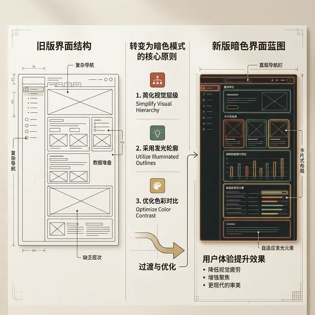

# W08 视觉重构：深度与防错

> [VISUAL]
> *   **Slide**: "二维面板与三维直觉"
> *   **Layout**: `Center`
> *   **Scene**: 深色发光屏幕上，一束模拟顶灯投向中央。光晕中浮现出一个极具质感的立体按钮，顶部带有精确到像素级别的白化高光边沿，底部投下自然的漫反射软阴影。
> *   **知识节点**: `refactoring-ui-depth`
> *   **Asset**: 

同学们好，欢迎进入第八周的课程《视觉重构：深度与防错》。

在前两周的训练中，我们已经确立了框架布局的层级法则（骨架），并运用 HSL 色彩模型建立了无障碍的语义配色体系（皮肤）。我们的界面已经具备了基本的可用性。然而，单靠线框和颜色依然存在局限：当所有信息都被压平在一个二维发光的屏幕玻璃上时，用户处理复杂数据的认知负荷会显著增加。

优秀的设计师需要超越平面建立立体空间隐喻。今天，我们将重点探讨如何利用光学原理在界面中生成深度错觉，并用这些三维机制区分业务优先级。同时，我们还将深入研究“边缘状态”：在极端业务情境下（如数据为空、用户出错），我们如何设计安全兜底网络，提供无缝的用户体验。

---
