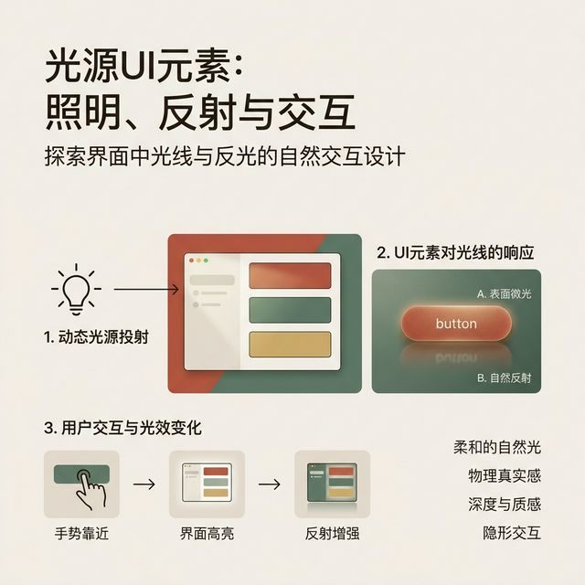
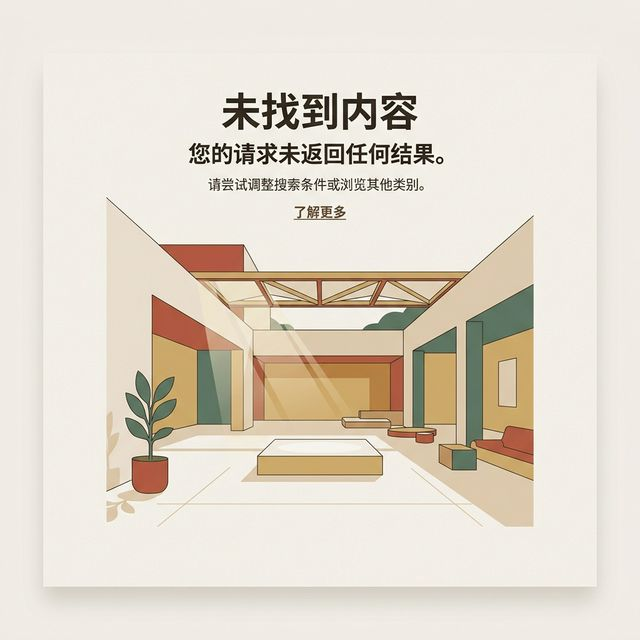
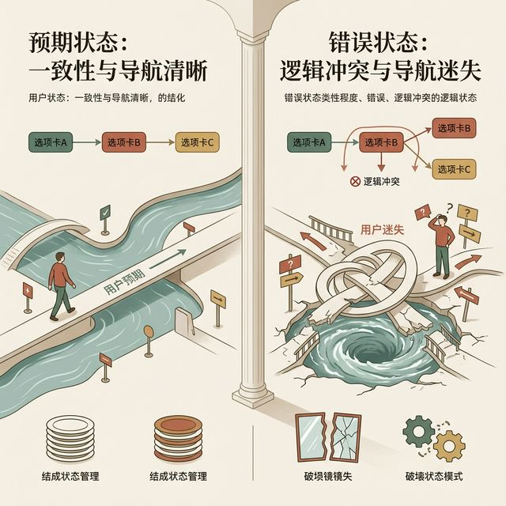
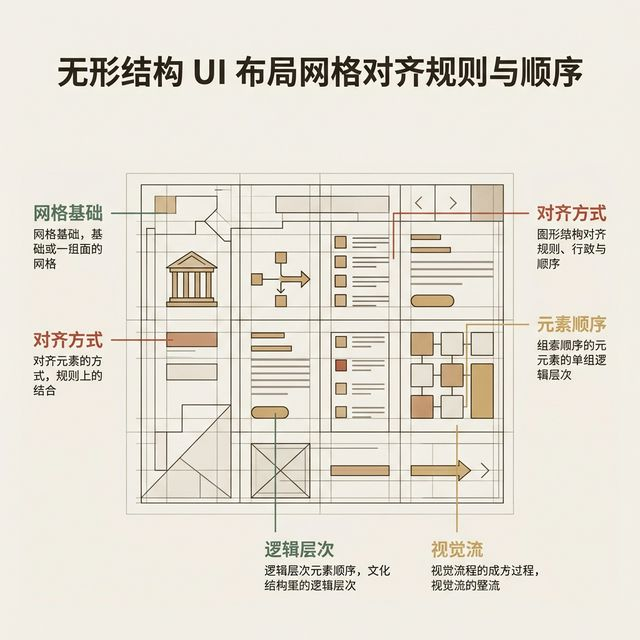
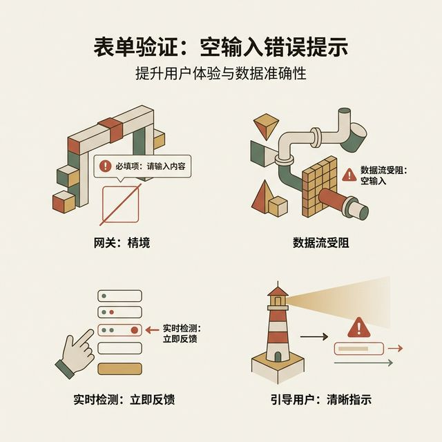
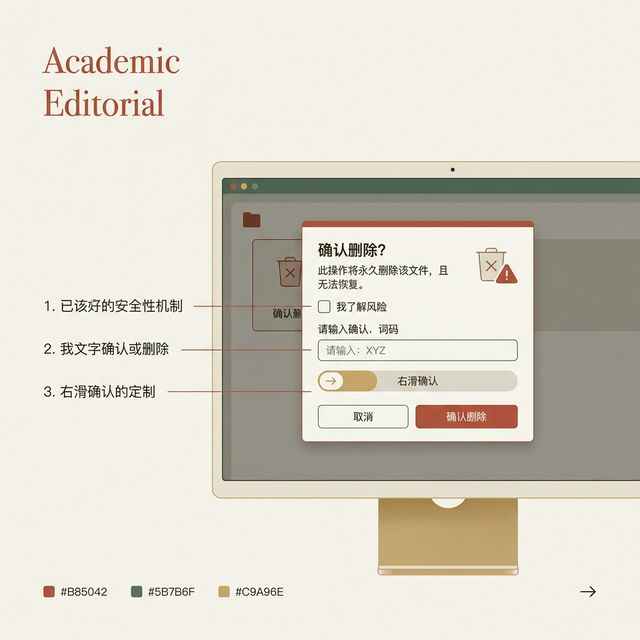
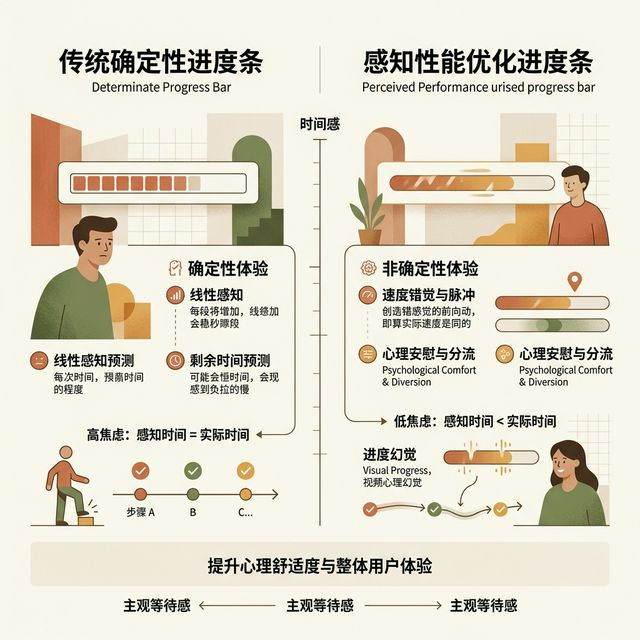

## 模块 2: 物理深度与悬浮高度体系 (约 25 分钟)
<!-- BUDGET: 4500 chars | SLIDES: ≥9 | STATUS: done -->
<!-- MATERIAL_BUDGET: Hub×3 + 原文段落×3 + 案例×1 | 估算 4800 字 | 覆盖率 106% -->

> [VISUAL]
> *   **Slide**: 寻找光影的起点：图形界面的历史纵深
> *   **Layout**: `Flow`
> *   **Scene**: 时间轴展示。从 Xerox PARC 的纯黑白线框，到 Windows 95 的斜面按钮，再到 iOS 6 的精致皮革拟物化，后收敛于 Material Design 的卡片高度。
> *   **Search**: `GUI history depth representation Xerox Windows 95 iOS Skeuomorphism`
> *   **List**: 
>     * Xerox PARC：零厚度的二维纸张拓荒
>     * Windows 95：三维凸起（Bevel）的众化尝试
>     * 拟物化巅峰：用显卡渲染皮革与木纹
>     * 现代终局：量子纸张与物理引擎
> *   **Asset**: 

要想透彻理解现代物理深度与悬浮高度体系，我们必须跳出单纯的代码视角。我们要回顾过去四十年的图形用户界面（GUI）设计史。在这段历史中，人类对视觉深度的追求从未停止过。> [VISUAL]
> *   **Slide**: Xerox PARC 实验室的无纸化拓荒
> *   **Layout**: `Full`
> *   **Scene**: 泛黄的老照片风格。施乐帕克实验室中早期的图形工作站，屏幕上全是由粗糙的一像素黑线勾勒出的矩形窗口，仿佛二维的平面拓扑积木。
> *   **Search**: `Xerox PARC early GUI flat desktop`
> *   **Asset**: 

第一代图形界面起源于施乐帕克（Xerox PARC）研究中心。受限于当时的单色显示器，早期的窗口完全是一张二维平面的纸张。工程师用一条单像素的黑线来分隔不同层级的窗口，那是的零厚度界面。

> [VISUAL]
> *   **Slide**: Windows 95 的斜面凸起风暴
> *   **Layout**: `Split`
> *   **Scene**: 经典的 Windows 95 开始按钮。放大展示按钮四周的像素矩阵：左上角是白色的高光色块，右下角是深色的阴影色块。由于这种反差造成了极其经典的按钮凸起感。
> *   **Search**: `Windows 95 button bevel CSS trick retro UI`
> *   **Asset**: 

到了上世纪九十年代，随着 Windows 95 的发布，三维立体感开始进入众的视野。工程师们利用简单的灰白高亮线和深色阴影线，构建了经典的斜面凸起，即 Bevel 效果，效果。当你按下那个灰色的“开始”按钮时，高光和阴影发生反转，给人一种为明确的物理下陷感。这种设计地降低了网民的学习门槛。它让人们直觉地认识到，屏幕上的像素是可以被点击和按压的。

> [VISUAL]
> *   **Slide**: iOS 拟物化的光辉岁月
> *   **Layout**: `Full`
> *   **Scene**: 极高清晰度的 iOS 6 界面解剖图。备忘录如同真实的黄色拍纸簿，日历拥有皮革缝线，连录音机都带有金属拉丝高光。极度奢华的材质纹理填满了屏幕。
> *   **Search**: `iOS 6 skeuomorphism design leather wood texture UI`
> *   **Asset**: 

进入二十一世纪初，随着移动设备的爆发，厚重感被推向了高峰。在 2007 年至 2012 年间的 iOS 系统中，拟物化设计，也就是 Skeuomorphism，统治了全局。设计师不遗余力地在屏幕上伪造皮革纹理、木材反光、金属拉丝和厚重的亚克力玻璃。这在当时地缓解了众对纯触屏操作的恐慌。因为那一切看起来太像真实的物理物件了。然而，随着用户数字素养的提升，这些沉重的材质开始成为视觉负担。过度渲染的纹理不仅消耗了量的移动端图形处理器算力，也严重压缩了用于显示核心数据的排版空间。

终，这场由拟物引发的审美疲劳，在 2013 年迎来了激烈的反弹。整个行业迅速倒向了剥离一切光影的扁平化时代。那是一场矫枉过正的设计革命。它消除了材质的厚重，却也毁掉了层级的秩序。直到今天，我们终于找到了介于二者之间的黄金平衡点：那就是建立一套严密、可推导、具有纯粹数学逻辑的物理高度体系。

> [CASE STUDY: Google Material Design 的“量子纸张”]
> 在早期的移动时代，前端开发常常滥用 CSS3 的阴影新特性。为了凸显某一个界面元素，节制地给每一个头像、每一行输入框加上沉重的黑色投影。这不仅没有建立主次关系，反而让整个界面沦为光污染灾区。
> 
> 这一混乱终结于 Google 推出的 Material Design 规范。Google 的核心智囊团开创性地提出了一个强的系统隐喻：所有的 UI 组件，其物理本质都是一张厚度固定为一独立像素（dp）的“量子纸张”。
>
> > [VISUAL]
> *   **Slide**: 量子纸张的世界观法则
> *   **Layout**: `Split`
> *   **Scene**: 模拟 Google Material Design 的实验台。所有的纸片厚度被标定为严格的 `1dp`。一张纸片由于悬浮较高，从边缘晕染出一大片离散阴影。
> *   **Search**: `Material design elevation 1dp floating paper concept`
> *   **Asset**: 

规范严厉地定下规矩。这些数字化的纸片，可以在屏幕上自由滑动、形变甚至凭空生成。但是，它们必须在这个数字引力场中遵守严密的 Z 轴Z轴物理海拔，也就是 Elevation 法则，法则。系统绝不允许两张纸片逻辑地穿越重叠，从而引发违背常理的物理交叉故障。

在这套体系中，界面上的阴影被正式转变为一块组件在 Z 轴体系中的高度护照。阴影的弥散度被用于传达该对象距离数字底层地板的垂直高度。阴影面积越、散开得越离散，代表其距离底层框架越远。这意味着它离用户的视网膜更近，它的操作权限也就更。

为了规范前端团队的日常实战，我们将型企业级应用的前端高度梳理为五个典型的军衔梯队。这是一个森严的等级制度。

> [VISUAL]
> *   **Slide**: 五级军衔制：地源区与卡片层
> *   **Layout**: `Split`
> *   **Scene**: 解构第一级地源底板（Z=0），纯粹平铺的哑光灰色幕布，没有任何光影逾越；右侧是升起一像素的第二级卡片层（Z=1），在边缘带有微弱发涩的 2px 离散黑影，宣告与底板断开。
> *   **Search**: `UI elevation system surface vs card level 0 1 depth`
> *   **Asset**: 

第一层，地源底板区，即 Elevation Z 轴坐标 0 点。这是页面画布的底层主背景色。在此处严禁嵌套任何形式的光源或投影。它必须始终保持紧贴地面的哑光状态。任何越界的高光都会破坏地球重力场的错觉。

第二层，内容卡片层 (Elevation Z=1)。这部分用于承载核心正文流的数据切片。规范只允许使用低模糊半径的垂直阴影投影，通常控制在两到三个像素以内。它的使命是将其自身与背景底色做出微弱却绝缘的物理切割。

> [VISUAL]
> *   **Slide**: 第三序列：导航空降与浮游单位
> *   **Layout**: `Full`
> *   **Scene**: 一个带有厚重阴影半径的悬浮操作加号按钮（FAB），它投下的影子半径明显大于底部卡片，营造出悬空在高处的强力统治感。
> *   **Search**: `Floating action button UI elevation nav bar shadow`
> *   **Asset**: 

第三层，导航空降层。这一层级包括高居顶端的不死导航栏、随时从天而降的下拉菜单，或是自由游走的浮动操作按钮。它们如同悬挂在低空轨道上的战舰，必须幅度扩展阴影散轶半径，生成明显的悬空漂浮感。

第四层，模态拦截层 (Elevation Z=4)。例如覆盖全屏的系统对话框，也就是 System Dialog，或右侧滑出的侧边抽屉卡盘。它们是处理紧急业务状态的高权限独裁者。不仅需要拥有全系统夸张的光环投射面积，还经常强行连带一层黑色的半透明全屏遮罩幕布降临。该幕布会通过屏蔽掉全站鼠标指针事件，实现硬核的深度隔离。

> [PHILOSOPHY]
> 真正的模态拦截层必须具备排他性的庄严感。当你决定召唤一个拥有高 Z 轴高度、配备广袤阴影的模态面板时，你实际上是对用户下达了一项必须无条件服从的操作驻留令。底层的半透明遮罩幕布不仅仅是为了产生视觉景深的退让物理隔离，更是该应用系统对用户全部业务操作流的一次全方位监管与接手。
>
> 在这一刻，过去的操作上下文被凝固休眠。除了解决眼下这份关乎金额变动、隐私授权、数据损毁的核心二次确认指令外，任何想绕过这一层屏障去点按下方元素的企图都将遭到封杀。因此，高层级的物理深度不是一种单纯的装饰，而是一种耗费精力与注意力带宽的核武器。不到核心资产发生扭转的生死存亡关头，绝轻易动用模态拦截。

> [DID YOU KNOW: 苹果对于模态阴影的系统级演进机制]
> 在近年的苹果人机界面指南迭代中，原生组件对于弹窗阴影控制经历了巨技术转折。早年为了配合强拟物，弹窗总是配备浓烈的硬质黑影。
> 
> 现在，设计师克制地剥除了强黑影边界，转而将重兵布局在“底层视差模糊技术，即 Vibrancy Blur，”这一高昂渲染材质上。当你触发一个现代 iOS 的确认框，它几乎是平顺地浮靠在表面。关键在于其底座背景，不管是滚动的相册还是动态地图，瞬间遭遇高斯模糊算法的全面洗劫处理。
>
> 底层清晰世界瞬间失去边界。人类睫状肌在面对屏幕模糊底片时，会产生自然抗拒。受限于视觉天平规律，瞳孔的视觉对焦中心全部被迫汇聚到中央那张锐利如刀的信息指令确认卡片上。苹果这招没有使用额外黑影，仅仅依靠散焦渲染退让，就掌控了坚摧的高安全管控视界体系。

> [ACTIVITY]
> **[交互体验走查] 阴影的有无与厚度**
> （请打开你手机里最常用的一个 App，找出一个带有投影的悬浮元素。你能分辨出它是向你表达单纯的悬浮菜单，还是想表达完全的模态隔离吗？它的阴影厚度符合我们刚刚讲的高差规则吗？）

> [VISUAL]
> *   **Slide**: 顶级视效的机密：双阴影合体引擎
> *   **Layout**: `Split`
> *   **Scene**: 在一张展示高定设计质感的浅色渲染展示画板上，剥离了 CSS 样式代码片段薄层。高亮显示段落里以逗号相连接隔开的两组 `box-shadow` 特性串。通过渐隐显示配合光环的组合播放动画散开效果，解构物理双层物理叠影烘焙机制生成的深层原理奥秘。
> *   **Search**: `CSS multiple box-shadow UI trick dual layer depth realistic lighting rendering effect`
> *   **List**: 
>     * 核心硬边缘阴影 (Contact Shadow)
>     * 外围软晕染阴影，即 Drop Shadow，
>     * 型光学反射阵列融合
> *   **Asset**: 

哪怕你严格落实了这些高级物理层面的层级论，如果在实际切图写板时只选用一行单一的 CSS 投影参数去应付差事，卡片视图上通常依然洋溢出一种干瘪重量地基支撑的悬浮感和脱力感。就像一片边缘裁剪粗糙廉价、在寒风中摇摆不定缺乏质量挂底的废品包装纸。

要想还原真实世界，必须引入现实复杂光学的弥散定律。真实环境物体因为光照散射、漫反射和二次光线反弹吸收，绝非单一灰幕。一个合格乃至高品质层级投影构建模型中，会强行嵌套融汇进两种背道而驰截然不同的光学配方比例成分。

首当其冲的成分称为核心硬边缘阴影，英文称为 Contact Shadow 或 Ambient Occlusion，。它的生成区域贴在物体边缘靠近地表的缝隙死角闭塞处。由于光被程度地挤压隔离开来，这里孕育出一条紧实、发沉、纯度颇高的收敛暗区切线。它的职责就是锚定这个卡片部件。让脑知晓，这个方块是有质量的，而不是漂移的幻影。

配合出击的是外围主光源软晕染模糊，即 Drop Shadow 或 Soft Spread，。它承担表现整体高差落位尺度的责任。由于发光源距离带来的光线分散效应，它会在组件外侧形成被匀称拉长拉宽、幅度缓慢消散衰减退行的淡雅雾化光晕分布场。

这就是现代卓越框架秘密标配的绝招秘技：“被称为 The Master Dual Shadows System 的双阴影高定体系”。

落实到项目工程代码源文件，它直截了当地显化为同一 DOM 对象身上的双发并联 CSS 属性赋值：`box-shadow: 0px 4px 12px rgba(0,0,0,0.06), 0px 1px 2px rgba(0,0,0,0.15);`。首先利用第一段有着夸张达 12 像素离散半径的口径配置去支撑全场的氛围，构筑厚重呼吸感；随后通过第二段超紧缩的单像素位移配合陡升的暗度透明通道浓度参数，如精工车床切削般扣合固定住实体基础。两者的乘数效应叠加烘托出精美绝伦的上乘重量级金属质感与踏实可靠的设计公信力。这是那些使用单调发散滤镜的新手永远无法触及的工艺段位巅峰。

> [VISUAL]
> *   **Slide**: 丧失光源之后：纯粹扁平环境生存指令
> *   **Layout**: `Comparison`
> *   **Scene**: 整个画风色彩滤镜切换至严苛的无投影能力环境沙盘中。全面展演和推演在这个速扁平指令禁令控制区，我们仅能利用灰度阶梯交迭和形状拼合去打出一套精彩的高差纵深反击建立层级感。
> *   **Search**: `flat design depth UI no shadow overlap brightness scale optical illusion UI flat 2.0`
> *   **Asset**: 

但是，设计和工程并非能够永远待在温室配置里。如果你身处的研发业务组恰逢决策层对特定视觉门类颁发了封杀限制指令——由于性能瓶颈、响应受限或者是品牌固执地要执行全面简政策，全面禁用所有节点对象的阴影光效特效。在面对全员收缴投影武器装备的扁平干冷二维底板工作场中，我们的层级护城河建设工程是否就此宣告破产停摆烂尾？

不能坐以待毙。剥离掉投影带来的性能开销，我们手中还剩下建立高度落差认知体系的两把无坚不摧之利器匕首：基于通道灰度的明度调减跳崖值落差，也就是 Brightness Scale Offsets，，以及利用重力压迫感的排他性遮盖机械交叠阵法，即 Forced Exclusive Overlapping Pattern，。

> [VISUAL]
> *   **Slide**: 亮色漂浮定律
> *   **Layout**: `Split`
> *   **Scene**: 左界纯白雪源背景下直接叠盖若干白卡群导致它们塌陷粘连；右界直接调动全局色相明度总阀将其仅微小下降探底五个百分点至淡灰色码区域 `#F4F5F7`。上浮业务操作窗始终坚守高饱和度夺目亮点本色，由此完成强脱离错落剥离成就。
> *   **Search**: `UI background contrast brightness optical visual depth color theory elevation simulation`
> *   **Asset**: 

首先应用的型兵器是远郊空气质量光衰效应的视错觉移植系统法。在自然深远山脉视觉识别体验规律经验中，偏离你目轴越去往远处后方的延展背景背景布幕环境地带，势必由于灰尘悬浮分子颗粒雾霾微粒吸光截流作用失去纯粹亮色饱和亮度从而导致其发暗显灰。与此对立的，能让你一把掌揽入近前的核心标的物结构元件，由于全无长焦距拦截的损失折半衰减，天然就展现着接受为明亮通透的白强采光折射度。

利用这套老旧原始但万试万灵的高效人脑识别生物陷阱滤镜网络漏洞逻辑，在不能加光圈阴影的废土废品系统里，操作起来可谓是一把冷酷精准直接的斩首战刀开局：决不拖泥带水，果断降级降低整个屏幕外围容器框架和基板地背景底色的明度值采光参数。强行削弱甚至一刀砍掉占比 5% 到 8% 的关键亮度配比权重梯段；把它扭改变为带着收敛情绪的浅哑灰色涂装系列。与之同步策应的重要指令则是，所有身居前沿高频接触火线的可执行交互的窗口或者面板底色参数变量组池口，则保持其纯净全反射的工业化满级强度高雪白标准参考线值 `#FFFFFF` 点列上。

脑面对这种全无多边形抗锯齿重运算消耗开销渲染的无痕轻量处理会发生什么反馈？那千锤百炼打磨的脑回路追影判定模型，会在看到甚至只包含细小如一个明度进位的断崖边缘那一丝毫秒即分出胜负判定，自动划归稍暗部分作为远在天边的地基层序列列队，判定雪白部分为紧贴你掌心屏幕触控权重的前线工作漂浮台。此等操作，毫不损耗开销却获全胜。

> [VISUAL]
> *   **Slide**: 后防线：霸道的机械遮挡法则
> *   **Layout**: `Full`
> *   **Scene**: 演示一个纯扁平面板在没有任何光与色辅佐状态下，通过暴力移动重要业务弹出浮窗面板的主卡块切边区域去横着身躯跨越碾压并盖盖封死下层列表数据尾部残缺边框，强硬地昭示其空间前端层级统治地位。
> *   **Search**: `overlapping shapes UI structural depth intersection flat vector design layered break border`
> *   **Asset**: 

当所有的通道配色卡点手段均已消耗殆尽还未能压制全场确立严峻系统层级规矩时，只能祭出后一张带物理压迫性质和强迫阵线霸权干预的雷霆暴乱手段。那是根本没有选择的解决方略通道路径：人为强行去创造结构边角排他粗暴物理强行交迭覆盖截断阻挡法案。

这种手法在排版构架上的表现是，将你试图置顶高层突出管理并拉拽提拔到高展示维度的指令行为触控区域或是严重警戒级别告知牌卡面板，去特意干涉其安全余量排布界线位置，使得该物块如同推土机般特意越过红线，强制地覆盖和去碾轧碾断其底下流趟的信息流跑道表单内容文本某一段段落的截流边框细线体。

心理与视觉机制处理过程简单且致命。由于上层组件边沿霸权遮蔽吞没了其它配角底板的展示全貌，一旦发生几何切割和图形遮挡打乱破坏事件效应；受众眼睛传回终端脑的判定中枢连带逻辑反馈便会绕过所有核算查验防区快速得出判决陈词：“那个敢于遮断淹没其他结构元件领土形状的物体单元组合，必定战胜地排挤驻扎在首位近的空间地基阵脚”。这种强交接与错位破坏秩序手法法则建立后，扁平空间防备将挑战地牢牢锁死层级别构架序列位与防线。

> [CASE STUDY: 纸质材质与数字阴影的经典实验]
> 让我们来看一个非常经典的实验室人机测试。研究人员曾经招募了两百名普通智能手机用户。他们被要求在一个非常复杂的数字仪表盘上寻找一个特定的开票操作按钮。
> 第一组测试库中，所有的按钮都没有任何厚度。按钮完全是扁平的矩形色块。甚至连颜色的明暗过渡都没有。结果非常糟糕。这组用户平均花费了十二秒才找到目标。许多人甚至试图点击大尺寸的文字标题。他们根本无法区分操作区和展示区。
> 第二组测试库中，工程师引入了数字悬浮高度体系。核心操作按钮被加上了三像素的硬边缘底层阴影。四周还有大范围的柔和长阴影。按钮周围的背景板也被降低了明度。奇迹发生了。寻找时间瞬间缩短到了三秒以内。
> 这就是大脑视觉边缘检测机制的胜利。人类的眼睛在数百万年的进化中，早已极度适应了识别自然界中的三维物体。当我们看到阴影时，大脑会瞬间将其判定为一个可以被手部抓取并操控的物理实体。
> 所以，高级的前端工程师从不认为自己只是在写样式表代码。他们认为自己是在重塑光学规律。每一行代码，每一个光晕像素的散射值，都在直接操纵着屏幕前那双眼睛所连接的大脑。这就是为什么我们要求大家对于 Z 轴海拔高度有着近乎病态的严苛追求。高度不仅仅是美观。高度就是操作的特权。高度就是用户直觉的向导。

> [PHILOSOPHY: 渲染管线与光影的代价]
> 我们必须直面一个极为残酷的工程现实。精美的多层投影光环，其实是前端性能的致命杀手。
> 当你在浏览器里为一个浮动窗口渲染了极度宽广的柔和高斯模糊时，浏览器的渲染管线正在痛苦地哀嚎。光影算法极其耗费算力。如果你在滚动列表中滥用了这种深层级效果。那么整个程序的帧率将会暴跌。用户在滑动时会感受到明显的卡顿和粘滞。
> 这就是商业级项目开发中必须做出的妥协。不能为了追求极致的纵深错觉，而让应用程序的运行效率垫底。高级架构师会引入硬件加速。他们会把渲染阴影的繁重任务甩给图形显卡。并在不必要的时候直接降维处理次级组件的光效。这就是设计与工程的完美博弈。
