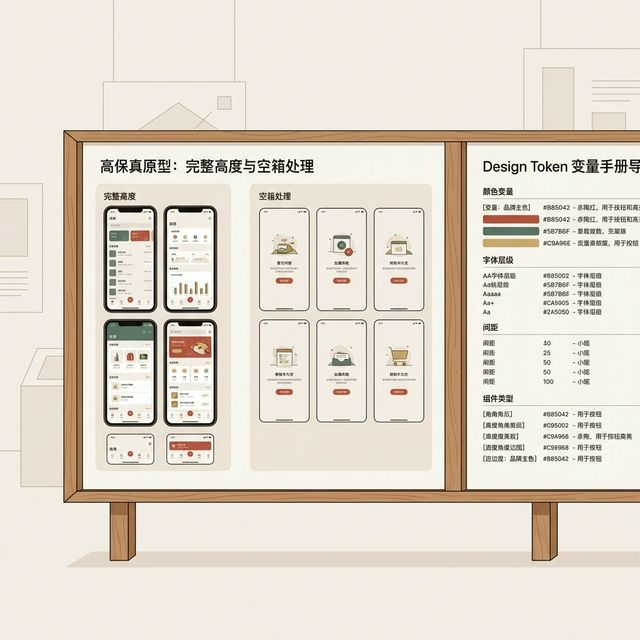

## 模块 5: 实践 — 收尾 实践项目2 (约 80 分钟)
<!-- BUDGET: 100 chars | SLIDES: ≥0 | TYPE: activity | STATUS: done -->

> [VISUAL]
> *   **Slide**: "收尾 实践项目2"
> *   **Layout**: `Workshop`
> *   **Scene**: 工作坊展示屏：左侧为带有完整高度和空箱处理的高保真原型，右侧为导出的 Design Token 手册。
> *   **知识节点**: `refactoring-ui-empty-states`
> *   **Asset**: 

到这里，为期两周的视觉重构内容演示便告一段落。
请各小组在接下来的 80 分钟内完成第二阶段实验：
1. 检查设计系统阴影层级，至少配置三级高度（Base, Card, Suspended）的全局变量。
2. 完善边缘状态（Empty States），必须包含文案、插画占位符与独立 CTA。
3. 审查关键破坏流中的撤销机制（Undo/Redo），替换掉所有生硬的 Confirmation Dialog。
完成设定后，将组件代码录入最终验收报告进行互评。

> [ACTIVITY]
> *   **Type**: `Workshop`
> *   **Duration**: `80min`
> *   **Desc**: 收尾 实践项目2，建立视觉 Token 最终数据集

---

> [TEACHING MOMENT: 实验的真实工程意图]
> 很多同学以为实践项目只是单纯的代码复现。这是一个严重的认知误区。
> 我们在这个实验里，不仅要求你们完成悬浮卡片的制作。更关键的是要求你们亲手建立起防错的安全网体系。
> 当用户在实验中错误点击时，你们的系统不能崩溃。你们的页面必须优雅地弹出拦截警告。并且给出极度宽容的撤销倒计时。
> 这才是真正的一线大厂级别的研发素养要求。我们不培养只会切图的技术工人。我们培养的是能够为千万级用户资产安全保驾护航的架构护卫军。
> 请务必在实验中，将这套防御理念深深烙印在你们的组件架构之中。
