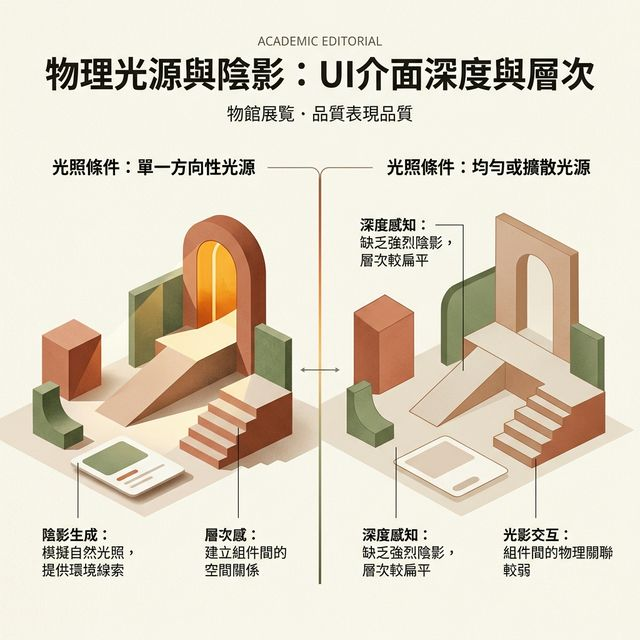
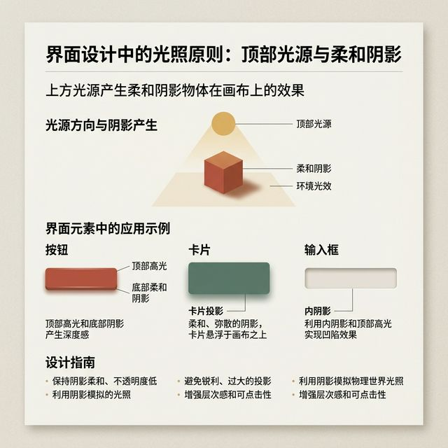
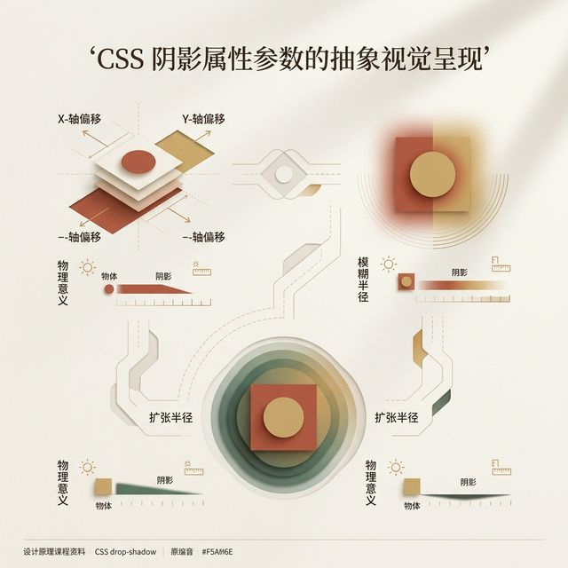
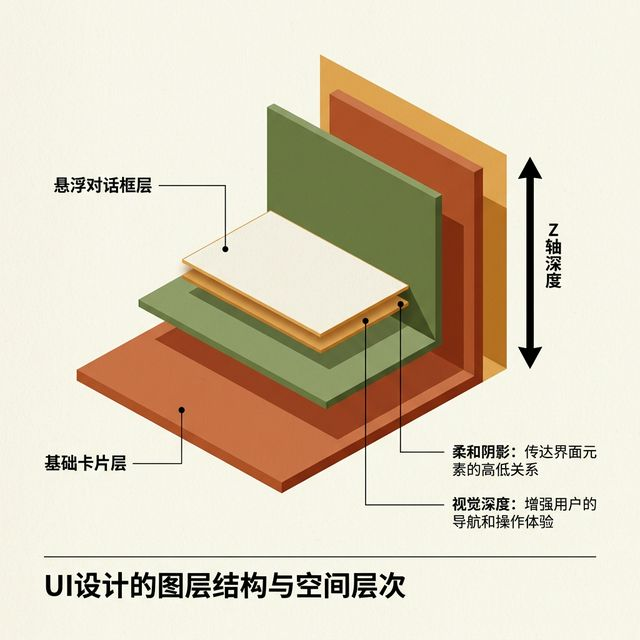
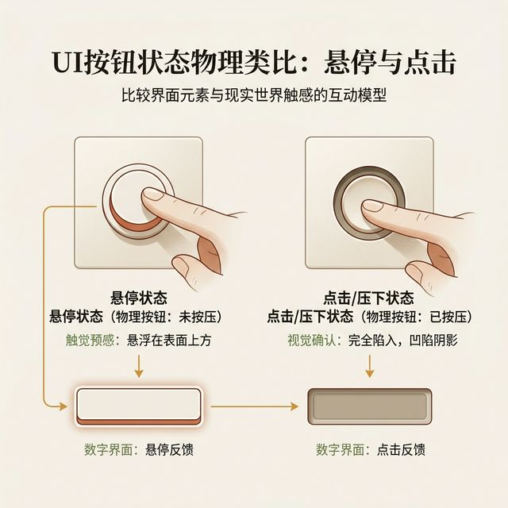

## 模块 1: 复习与光影法则 (约 20 分钟)
<!-- BUDGET: 3600 chars | SLIDES: ≥7 | STATUS: done -->
<!-- MATERIAL_BUDGET: Hub×1 + 原文段落×2 + 案例×1 | 估算 3600 字 | 覆盖率 100% -->

> [VISUAL]
> *   **Slide**: 平面维度的交互局限
> *   **Layout**: `Comparison`
> *   **Scene**: 左侧是一个绝对扁平的线框面板，所有按钮和文字处于同一个视觉图层，显得主次不分。右侧是增加了真实投影的材质面板，操作按钮悬浮于背景之上，层级极其明确。
> *   **Search**: `flat design limitations cognitive load vs materialized ui`
> *   **List**: 
>     * 二维屏幕上的三维直觉映射
>     * 深度即是视觉优先级
>     * 人眼对物理遮挡的毫秒级反应
> *   **Asset**: 

各位同学好。欢迎进入第八周的课程，《视觉重构：深度与防错》。

> [STAGE NOTE: 复习（能力2 回链：Design Token 体系应用）]
> 在前两周的训练中，我们已经确立了骨架网格。我们也运用了色彩模型，建立了无障碍的语义配色。界面已经具备了基本的可用性。

但这还远远不够。我们面临着一个本质的生理挑战。当我们把复杂的信息压缩在一块二维的发光玻璃上时，人脑的认知负荷会急剧飙升。

请观察你周围的物理世界。不管是桌面的纸张，还是层层叠起的书籍。我们的大脑早已习惯了一种判断法则。那就是通过物理的高度、物体的遮挡关系以及环境光影，来瞬间识别物品的主次。凸起的实体按钮，会本能地发出“可按压”的信号。门把手会自然地发出“可抓握”的启示。这是一种无需学习的肌肉记忆。

但在数字屏幕上，这变得极其困难。屏幕背后的发光二极管，无法产生真实的物理凹凸。要让静态的像素色彩激发用户的触控欲望，我们必须成为幻觉大师。我们要在二维的平面坐标系内，构建一套符合自然规律的光影错觉。只有打破这层次元壁，界面才能真正获得生命力。

> [VISUAL]
> *   **Slide**: 从拟物到扁平的历史钟摆
> *   **Layout**: `Timeline`
> *   **Scene**: 时间轴展示。起点是苹果早期 iOS 6 浓重的皮革和木纹拟物化界面。中间节点是 2013 年后极端的扁平化风潮，没有边界的纯色块。终点是现代回归理性的材质光影设计，晶莹剔透且主次分明。
> *   **Search**: `GUI UI design history Skeuomorphism Flat design Neumorphism evolution`
> *   **Asset**: 

在我们动用代码去实现深度之前，必须回顾一段设计史的弯路。这段历史影响了我们今天的法则收敛点。

在初世代的触摸屏时代，设计师们走向了极端拟物化。英文称为 Skeuomorphism。那时候的按钮，被渲染上了昂贵的皮革缝线，或者逼真的原木纹理。甚至连日历应用，都带着撕扯的纸张边缘。这种设计在当时有着极强的启示性，它确实降低了新手的学习门槛。但代价也是极其惨痛的。它极大地消耗了屏幕的排版带宽，也拖垮了早期设备的图形算力。人们很快就对这种厚重的装饰感产生了严重的视觉疲劳。

于是到了二零一三年左右，行业迎来了一场激烈的反叛。极端的扁平化风暴席卷全球。所有设计师都像患了洁癖一样。他们粗暴地剥离了几乎所有的深度暗示。阴影被删除了，边框的光泽被抹去了。界面的所有元素，都被拍成了一张没有任何厚度的塑料胶片。

然而，矫枉过正引发了严重的可用性危机。用户陷入了迷茫。去除了立体的边界感后，人们无法快速分辨哪里是可以点击的入口，哪里只是用来阅读的标题。这就是扁平化带来的信息粘连灾难。

在经历了长期的试错后，现代交互设计的黄金法则终于浮出水面。那就是：坚决剔除无效的纹理拟物，但必须极其克制地保留“光”与“物理深度”。这是建立数字世界秩序，最纯粹也是最强大的干预维度。

> [VISUAL]
> *   **Slide**: 上帝之光：全局顶光源法则
> *   **Layout**: `Section`
> *   **Scene**: 浩淼的太阳系图景下，阳光从高空俯射。随后镜头切换至一个微观的 UI 组件库。所有按钮的高光都在最顶部，而模糊的阴影则沉甸甸地坠落在组件的正下方。两幅图呈现惊人的光学一致性。
> *   **Search**: `UI global top light illumination consistency psychology evolution`
> *   **知识节点**: `light-source-psychology`
> *   **知识节点**: `design-history-evolution`
> *   **Asset**: 

> [!INFO] 理论库映射
> **核心教材**：《Refactoring UI》
> **章节关联**：`[refactoring-ui-depth]` 阴影/多重边框与覆盖建立界面深度
> **关键延展**：建立统一的全局定光源，用物理深度重构二维界面层级。

要在这个数字切片里重建三维空间，第一定理就是：假设在屏幕正上方，永远悬挂着一盏看不见的模拟太阳主光源。我们将其称为全局顶光源法则。

这绝非设计师的主观审美癖好。这是基于人类长达两百万年进化历程的心理常识。在大自然的生存记忆里，阳光绝大部分时间总是从天顶上方俯射而下的。所以，三维实体受光发亮的地方，永远在它的顶部。而沉淀黑暗阴影的死角，永远在物体的底部。

人类的大脑皮层，已经将这一套自然光影光谱特征，深深地硬编码进了潜意识里。如果我们违背这套铁律会怎样呢？如果你为了所谓的设计创新，贸然把光源的方向改成了从底部向上照射。这会让观者的潜意识雷达瞬间拉响警报。因为在大自然的经验库里，只有在深夜的旷野点蜡烛，从下巴往上打光讲鬼故事时，才会出现这种诡异的下潜光源。这种反直觉的物理错误，会给受众带来极强的不安感与排斥感。

所以，这套单一全局顶光源法则，是不可侵犯的底线。一旦确立，团队里的所有成员，都必须严格遵守这一基石。

> [CASE STUDY: 拟物化与扁平化的世纪工程决战]
> 让我们更深入地咀嚼一段交互设计史上的关键节点。那就是二零一三年苹果公司内部发生的设计路线之战。
> 在乔布斯时代，iOS 系统的界面是由斯科特·福斯托尔主导的。他是一个极度狂热的拟物化信徒。当时的日历应用中，不仅使用了真实的皮革纹理，甚至在屏幕边缘渲染了细微的纸张裂纹。这种设计的初衷是极其具有人文关怀的。它让一群刚刚从翻盖手机时代过渡过来的用户，在面对冰冷的玻璃屏幕时，能够瞬间领会到“这是一本笔记本”。这在心理学上被称为强视觉启示（Affordance）。
> 
> 但这种重度渲染带来了两个致命的工程问题。
> 第一是视觉带宽被严重挤压。当屏幕上充斥着华丽的木纹和渐变金属反光时，留给真正重要数据（比如联系人姓名、时间表）的空间就被急剧压缩了。用户的眼睛在阅读时，被迫处理大量无效的装饰性像素。
> 第二是算力危机。早期的移动芯片性能捉襟见肘，还要分出大量的 GPU 资源去实时渲染这些极其复杂的材质贴图。
>
> 于是，乔纳森·伊夫接手后，发动了名为 iOS 7 的扁平化革命。他像做外科手术一样，无情地切除了所有的伪造材质。整个系统一夜之间变成了由白底、纯色细线和无阴影色块组成的极简骨架。这场革命虽然极大地释放了性能和视觉空间，但也引发了长达数年的可用性灾难考察期。由于失去了按钮的边缘凸起感，上千万的老年用户在更新系统后，陷入了完全不知道哪里可以点击的恐慌之中。这也直接促使了后来的设计流派，不得不重新把物理投影这个“克制但极其有用”的功能请回神坛。

> [TEACHING MOMENT: 前端渲染管线的数学原理]
> 刚才提到，为了建立深度错觉，我们使用了一套极其复杂的 `box-shadow` 特性。
> 从前端浏览器的渲染引擎视角来看，画一个阴影可不是简单地涂上一层灰色。它是基于高斯模糊算法的密集矩阵运算过程。
> 当我们在 CSS 代码里敲下 `12px` 的模糊半径时，浏览器实际上在后台怎么做？它会对这个组件边缘的所有外围像素，进行一个半径为 12 像素的卷积核扫描。由于要计算每个像素点周边所有点的颜色权重均值。这个计算量是呈指数级上升的。
> 
> 如果你在一个有着上百个元素的商品长列表里，给每一个小卡片都粗暴地加上了巨大的高斯模糊阴影。当你用手指在屏幕上快速滑动这个列表时，手机的处理芯片就会因为不堪重负而发生严重的丢帧卡顿现象。
> 这是因为浏览器在每一帧画面的刷新中，都被迫重新计算成千上万个像素的阴影混合结果。所以，高级的视觉架构绝不是肆无忌惮的光污染。高级工程师懂得在必要的时候，剥离次级控件的光效，把极其昂贵的阴影渲染算力，仅仅保留给最核心的悬浮操作按钮或者警告模态框。设计与性能的权衡，这是成为顶尖高手的必经之路。

> [TEACHING MOMENT: 光影在可访问性中的关键权重]
> 除了美学，光影还有一个容易被忽视的工程作用。那就是视障人群的可访问性（Accessibility）。
> 患有轻度白内障或散光的老年人，对于极细的线条和扁平的低对比度色块是非常不敏感的。如果你的按钮只是一个浅蓝色的扁平矩形框，在他们的视网膜里可能直接和白色背景融为一体。
> 但是，人类对于强烈明暗对比（如浓重的下降投影）的视神经敏感度，是远超对于纯碎色彩色相的敏感度的。通过增加底层阴影半径和卡片的对比度，即使是在烈日暴晒的户外环境下，手机屏幕上的关键交互按钮依然能呈现出清晰的物理轮廓。这是符合 WCAG 国际无障碍网页设计标准理念的最佳实践手段之一。

> [VISUAL]
> *   **Slide**: 悬浮实体的光学手术台解剖
> *   **Layout**: `Split`
> *   **Scene**: 左半球是 3D 软件渲染出的绝美金属方块受光图。右半部分是将这块质感拆解为 CSS 投影参数机制。图表明确指出：高光线在顶部，深色降噪投影在底部。并且红色高亮警告了 X 轴偏移量。
> *   **Search**: `UI element highlight inset shadow CSS box-shadow anatomy variables rule`
> *   **Asset**: 

理解了光源方向，我们来解剖数字按键的光学原理。工程师究竟是如何用几行代码，骗过大家的眼睛的呢？这就不得不提到强大的外扩弥漫阴影指令系统。

当光流垂直坠下时，拦截光束的顶部物块边缘，首当其冲接收到了最强的反光。这会在组件的最上沿，形成一条极细却极亮的白线。我们把它定义为高光反射边。相抗衡的另一边，处于光照死角的底盘交接处，光线难以穿过。这里只能被迫渲染出一团轮廓发虚、向外逐渐隐退的暗色云雾。这就是核心的坠落阴影带。

前端团队利用这一光学密码欺骗大脑时，有一条绝对不能触碰的高压红线。这就涉及到掌管光源水平方位的核心变数：也就是 X 轴方向的偏移量数值。

为了绝对捍卫“光必须垂直从天而降”的法则，这一个指令的属性值，无论在任何奇葩的需求面前，都必须死死钉住在零这个数字上。必须极度静态，不容篡改。这是很多入行新手极容易犯的致命错误。很多人喜欢随意拨动转盘，给阴影加上了横向的偏移。一旦发生这种情况，整个界面就会像破裂了的万花筒。各个组件的阴影散落方向互不相干，完全无法对齐。这会让整个布局丧失应有的高级工程公信力。这不仅是设计车祸，这是视觉逻辑的全面溃散。

> [VISUAL]
> *   **Slide**: 反叛的深度：凹陷与数据槽口
> *   **Layout**: `Split`
> *   **Scene**: 屏幕左侧是代表着悬浮与权力的外凸按钮。右侧紧邻的是状态呈现出严重向内剥脱陷入的文本输入框。光顺着边沿滑落，产生倒挂的内阴影与反白的底部受光槽线。
> *   **Search**: `UI text input inner shadow box-sizing visual cue affordance`
> *   **List**: 
>     * 顶部发暗：边缘壁阻挡了顶光
>     * 底部反白：坑底直面天顶光束
>     * 交互隐喻：安全的数据存放穴巢
> *   **Asset**: 

光学系统不单单能造山，它也能挖坑。我们来看看文本输入框。在我们的潜意识里，输入框应该是一个向数字岩层内部开凿的凹槽形空间，它在等待我们投入键盘敲击出的字符。

如果延续刚才的全局顶光源法则，当我们向着屏幕的内部挖陷一个深坑时，光路会发生完全相反的变化。凹坑靠上方的内壁边界，就像一道屋檐，死死阻挡了来自上方的直射光束。这必然使得洞口的顶部深处，凝结出一道深沉厚重的内阴影边界。

反观深渊的最底部，其对立的内沿却因为视野豁然开朗，直接反射了垂直的满溢光线，从而形成了一条极细极锐利的内高光阻截线。这一暗一明的空间倒置组合法则，就是一种极为强烈的交互隐喻。它安全地向双眼传递了“请放心填写”的空间保障感。

> [VISUAL]
> *   **Slide**: 状态流转与动态阻尼回馈
> *   **Layout**: `Diagram`
> *   **Scene**: 一个带有厚重投影的按钮，正在被鼠标箭头点击。展示静态悬停时阴影散开准备发力接战，以及在按压瞬间，阴影突然向核心聚合消散，本体背景色彩加深的动态力学压缩全过程。
> *   **Search**: `UI button interactive states normal hover active pushed mechanics simulation`
> *   **Asset**: 

静态的光影视效确实非常惊艳。但这仅仅是用户拿到的一张体验图纸。当我们真正伸出手指去触控那个组件时，微秒级的反馈延迟才是见证奇迹的最终时刻。

如果在按下的那一个微小分镜帧里，我们通过代码指令，瞬间清零了按钮底部那宏大的扩散阴影扩展半径，并将组件的基色压暗一个色号。各位，奇妙的事情发生了。这就在数字界面上，强行制造了一种类似机械键盘轴体被重压到底的绝妙力学段落感。这就是我们追求的物理深层体系和交互阻尼沉浸体验。它用纯粹算法和通道变换，硬生生地喂给了用户一段逼真的力量较量感受。

> [VISUAL]
> *   **Slide**: 高级质感：系统染色投影机制
> *   **Layout**: `Comparison`
> *   **Scene**: 左侧卡片底色为浓郁的珊瑚红，却拖引着脏兮兮的纯黑死寂色阴影，导致画面浑浊跌价。右侧将黑影剥离，替换上了利用卡片本体珊瑚主色，混合出携带自身红色反光氛围的高阶染色柔化阴影光效，通透且极具赛博呼吸感。
> *   **Search**: `colored shadows UI design neumorphism ambient lighting environment tracking`
> *   **Asset**: 

在这个模块的最后，我要揭露一个业界常犯的光学参数死角。大量的开发者为了省事，习惯把投影的颜色全部锁死为绝对死黑的纯正暗色代码。但是在现实世界复杂的光谱干涉作用下，例如迷人的丁达尔效应或者是地面的环境回闪折射反光影响，任何带有强属性主色彩的悬空物体，其背光阴影是绝不会彻底呈现为纯粹幽闭黑暗的炭灰死色的。

对于高端商业交互产品线，我们必须引入高级的“染色明暗光影干预机制”。它的指令法则核心就是，一定要提取组件原本基座自带的主体有色基准作为投影渲染池。把高饱和色彩投降调入弥散半径晕染层里。通过色相上的染料侵入，这能立刻扫荡清空界面系统中的那种廉价的灰霾泥色。这也正是交付令人折服且发散着自身内生光源赛博光环玻璃美学视效体验，最神秘而有效的光影杀手锏之一。
